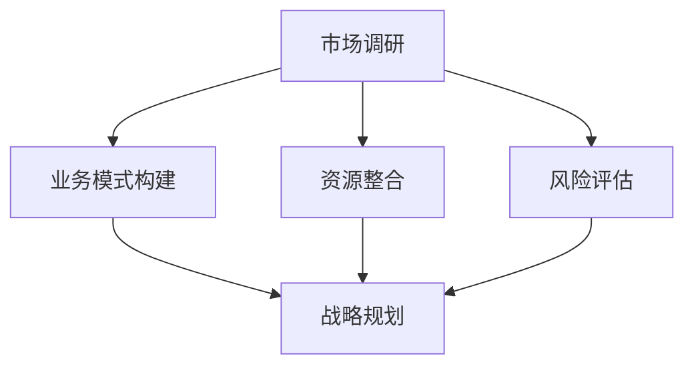

                 

# 技术人如何将创新理念转化为可行的商业计划

> 关键词：创新理念、商业计划、技术人、可行性分析、市场调研、业务模式、战略规划
>
> 摘要：本文将探讨技术人在将创新理念转化为可行的商业计划时所需考虑的关键因素。通过分析市场调研、业务模式构建、资源整合、风险评估以及战略规划等步骤，为技术人提供一套系统化的转化思路和方法，帮助他们在商业世界中更好地实现自身价值。

## 1. 背景介绍

### 1.1 目的和范围

本文旨在帮助技术人将自身的创新理念转化为可行的商业计划。在这个过程中，技术人不仅需要具备扎实的技术背景，还需要掌握商业思维、市场分析、战略规划等方面的知识。本文将围绕以下主题展开：

1. 市场调研：了解目标市场的需求、竞争格局和潜在机会。
2. 业务模式构建：明确产品定位、目标用户、收入来源和盈利模式。
3. 资源整合：梳理所需的人脉、资金、技术等资源，并进行合理配置。
4. 风险评估：识别潜在风险，制定应对策略。
5. 战略规划：明确发展目标、制定实施计划和时间表。

### 1.2 预期读者

本文适合以下几类读者：

1. 有志于创业或即将转型的技术人。
2. 在工作中需要将技术项目转化为商业项目的项目经理或产品经理。
3. 对技术创新与商业结合感兴趣的企业高管、投资人或创业者。

### 1.3 文档结构概述

本文将分为以下章节：

1. 背景介绍
2. 核心概念与联系
3. 核心算法原理与具体操作步骤
4. 数学模型和公式与详细讲解
5. 项目实战：代码实际案例和详细解释说明
6. 实际应用场景
7. 工具和资源推荐
8. 总结：未来发展趋势与挑战
9. 附录：常见问题与解答
10. 扩展阅读与参考资料

### 1.4 术语表

本文中涉及的主要术语如下：

- 创新理念：指技术人基于自身专业知识和对市场的理解，提出的具有前瞻性的技术构思或解决方案。
- 商业计划：指技术人将创新理念转化为可行的商业方案，包括市场调研、业务模式、资源整合、风险评估和战略规划等内容。
- 市场调研：指对目标市场的需求、竞争格局和潜在机会进行系统性的分析和研究。
- 业务模式：指企业或项目如何创造、传递和获取价值的方式。
- 资源整合：指将人脉、资金、技术等资源进行有效配置，以支持项目或业务的发展。
- 风险评估：指对项目或业务过程中可能遇到的风险进行识别、评估和制定应对策略。
- 战略规划：指根据企业的长期发展目标，制定具体的实施计划和时间表。

## 2. 核心概念与联系

为了更好地理解技术人如何将创新理念转化为可行的商业计划，我们需要先了解以下几个核心概念及其相互联系：

### 2.1 市场调研

市场调研是商业计划的基础。通过对目标市场的需求、竞争格局和潜在机会进行分析，技术人可以更准确地把握市场动态，为后续的业务模式构建和资源整合提供有力支持。

- 市场需求：指目标市场对某种产品或服务的需求程度。技术人需要了解目标用户的需求、痛点和偏好，以便在产品设计和功能实现上做出相应调整。
- 竞争格局：指市场上主要竞争对手的分布情况、市场份额和竞争策略。技术人需要分析竞争对手的优劣势，找到自身的差异化竞争优势。
- 潜在机会：指市场中的新机会、新兴领域或尚未被充分满足的需求。技术人需要关注这些机会，并在商业计划中加以利用。

### 2.2 业务模式构建

业务模式构建是商业计划的核心。技术人需要明确产品定位、目标用户、收入来源和盈利模式，以便在市场上实现可持续发展。

- 产品定位：指产品在市场上的定位和差异化策略。技术人需要根据市场需求和竞争格局，为产品找到合适的定位。
- 目标用户：指产品的目标用户群体。技术人需要了解目标用户的特点、需求和偏好，以便在产品设计和功能实现上满足他们的需求。
- 收入来源：指企业或项目获取收入的方式。技术人需要根据业务模式，制定合理的收入来源策略。
- 盈利模式：指企业或项目实现盈利的方式。技术人需要分析收入来源，制定有效的盈利模式。

### 2.3 资源整合

资源整合是商业计划实施的关键。技术人需要梳理所需的人脉、资金、技术等资源，并进行合理配置，以确保项目或业务的成功发展。

- 人脉资源：指技术人在业界积累的人际关系和网络资源。技术人需要利用人脉资源，获取项目合作机会和业务资源。
- 资金资源：指项目或业务所需的资金支持。技术人需要根据项目规模和资金需求，制定合理的资金筹集策略。
- 技术资源：指项目或业务所需的技术支持和研发能力。技术人需要整合内部技术资源和外部技术资源，确保项目的技术实现。

### 22.4 风险评估

风险评估是商业计划中不可忽视的一环。技术人需要识别潜在风险，并制定相应的应对策略，以确保项目或业务的安全发展。

- 风险识别：指对项目或业务过程中可能遇到的风险进行识别和分类。技术人需要根据市场需求和竞争格局，识别潜在风险。
- 风险评估：指对识别出的风险进行评估和量化。技术人需要分析风险的严重程度和发生概率，为风险应对提供依据。
- 风险应对：指制定相应的风险应对策略。技术人需要根据风险评估结果，制定有效的风险应对策略。

### 2.5 战略规划

战略规划是商业计划实施的指南。技术人需要根据企业的长期发展目标，制定具体的实施计划和时间表，以确保项目或业务的可持续发展。

- 发展目标：指企业或项目的长期发展方向和目标。技术人需要明确企业或项目的长期目标，以便制定战略规划。
- 实施计划：指实现发展目标的步骤和措施。技术人需要根据长期目标，制定具体的实施计划和时间表。
- 时间表：指实施计划的时间节点和进度安排。技术人需要制定合理的时间表，确保项目或业务按计划推进。

### 2.6 Mermaid 流程图

以下是一个简化的 Mermaid 流程图，展示了核心概念之间的联系：



## 3. 核心算法原理 & 具体操作步骤

将创新理念转化为可行的商业计划，需要系统化的思维和方法。以下是一个基于伪代码的算法原理，用于指导技术人进行这一转化过程：

### 3.1 初始化

```python
# 初始化变量
innovation_idea = get_idea() # 获取创新理念
target_market = get_target_market() # 获取目标市场
required_resources = [] # 初始化所需资源
risk_profile = [] # 初始化风险状况
strategic_plan = [] # 初始化战略规划
```

### 3.2 市场调研

```python
# 进行市场调研
def market_research(target_market):
    # 收集市场需求
    demand = collect_demand(target_market)
    # 分析竞争格局
    competition = analyze_competition(target_market)
    # 发现潜在机会
    opportunities = find_opportunities(target_market)
    return demand, competition, opportunities

demand, competition, opportunities = market_research(target_market)
```

### 3.3 业务模式构建

```python
# 构建业务模式
def build_business_model(demand, competition, opportunities):
    # 明确产品定位
    product_positioning = define_product_positioning(demand, competition)
    # 确定目标用户
    target_users = define_target_users(demand)
    # 制定收入来源
    revenue_streams = define_revenue_streams(product_positioning, target_users)
    # 设定盈利模式
    profit_model = define_profit_model(revenue_streams)
    return product_positioning, target_users, revenue_streams, profit_model

product_positioning, target_users, revenue_streams, profit_model = build_business_model(demand, competition, opportunities)
```

### 3.4 资源整合

```python
# 整合资源
def integrate_resources(required_resources):
    # 人脉资源
    human_resources = collect_human_resources()
    # 资金资源
    financial_resources = collect_financial_resources()
    # 技术资源
    technical_resources = collect_technical_resources()
    required_resources.extend([human_resources, financial_resources, technical_resources])
    return required_resources

required_resources = integrate_resources(required_resources)
```

### 3.5 风险评估

```python
# 进行风险评估
def risk_assessment(risk_profile):
    # 识别风险
    identified_risks = identify_risks(target_market, competition, required_resources)
    # 评估风险
    assessed_risks = assess_risks(identified_risks)
    risk_profile.extend([identified_risks, assessed_risks])
    return risk_profile

risk_profile = risk_assessment(risk_profile)
```

### 3.6 战略规划

```python
# 制定战略规划
def strategic_planning(strategic_plan, demand, competition, opportunities, risk_profile):
    # 确定发展目标
    development_goals = define_goals(demand, competition, opportunities)
    # 制定实施计划
    implementation_plan = create_implementation_plan(development_goals, required_resources)
    # 制定时间表
    timeline = create_timeline(implementation_plan)
    strategic_plan.extend([development_goals, implementation_plan, timeline])
    return strategic_plan

strategic_plan = strategic_planning(strategic_plan, demand, competition, opportunities, risk_profile)
```

### 3.7 综合分析

```python
# 综合分析并生成商业计划
def generate_business_plan(innovation_idea, strategic_plan):
    # 整合信息
    business_plan = integrate_info(innovation_idea, strategic_plan)
    # 撰写商业计划书
    business_plan_document = write_business_plan_document(business_plan)
    return business_plan_document

business_plan_document = generate_business_plan(innovation_idea, strategic_plan)
```

通过以上伪代码，我们可以看出，将创新理念转化为可行的商业计划，需要经过市场调研、业务模式构建、资源整合、风险评估和战略规划等多个环节。这些环节相互关联，共同构成了一个系统化的转化过程。

## 4. 数学模型和公式 & 详细讲解 & 举例说明

在将创新理念转化为可行的商业计划的过程中，数学模型和公式可以为我们提供量化的分析和评估工具。以下是一些关键的数学模型和公式，以及它们的详细讲解和举例说明。

### 4.1 市场需求预测模型

市场需求预测模型用于预测目标市场在未来一段时间内的需求量。一个常用的模型是线性回归模型。

**线性回归模型公式**：

\[ y = ax + b \]

其中，\( y \) 是需求量，\( x \) 是影响需求的因素（如时间、价格等），\( a \) 和 \( b \) 是模型的参数。

**举例说明**：

假设我们想要预测某款产品在接下来三个月的需求量。已知过去三个月的需求量分别为 100、150 和 200，同时我们还收集了这段时间的平均价格。我们可以使用线性回归模型来预测未来三个月的需求量。

首先，我们需要计算影响需求的因素 \( x \)（这里取平均价格为 120）：

\[ x = \frac{120 + 120 + 120}{3} = 120 \]

然后，我们根据过去的数据拟合线性回归模型：

\[ y = ax + b \]

通过计算，我们得到 \( a = 1.5 \) 和 \( b = -30 \)。

接下来，我们可以预测未来三个月的需求量：

\[ y = 1.5x - 30 \]

当 \( x = 120 \) 时，\( y = 1.5 \times 120 - 30 = 180 \)。

### 4.2 盈利能力分析模型

盈利能力分析模型用于评估项目的盈利潜力。一个常用的模型是利润率模型。

**利润率模型公式**：

\[ \text{利润率} = \frac{\text{净利润}}{\text{营业收入}} \times 100\% \]

其中，净利润和营业收入分别是项目在一定时间内的盈利数据。

**举例说明**：

假设某项目在第一年的营业收入为 100 万元，净利润为 20 万元。我们可以计算该项目的利润率：

\[ \text{利润率} = \frac{20}{100} \times 100\% = 20\% \]

这意味着该项目的盈利能力较强。

### 4.3 风险评估模型

风险评估模型用于评估项目面临的风险程度。一个常用的模型是概率风险评估模型。

**概率风险评估模型公式**：

\[ \text{风险值} = \text{概率} \times \text{损失额} \]

其中，概率是风险发生的可能性，损失额是风险发生时造成的损失。

**举例说明**：

假设某项目面临一个风险，该风险发生的概率为 30%，如果发生，将导致损失 50 万元。我们可以计算该风险的风险值：

\[ \text{风险值} = 0.3 \times 50 = 15 \]

这意味着该项目面临的风险值为 15，即有 15 万元的风险损失。

### 4.4 资金需求模型

资金需求模型用于计算项目在不同阶段所需的资金量。一个常用的模型是资金需求曲线模型。

**资金需求曲线模型公式**：

\[ \text{资金需求} = a \times (\text{时间} + b) \]

其中，\( a \) 和 \( b \) 是模型参数，时间表示项目进展的阶段。

**举例说明**：

假设某项目在启动阶段、发展阶段和收获阶段分别需要资金 10 万元、20 万元和 30 万元。我们可以拟合一个资金需求曲线模型：

\[ \text{资金需求} = a \times (\text{时间} + b) \]

通过计算，我们得到 \( a = 1.5 \) 和 \( b = 5 \)。

接下来，我们可以计算项目在不同阶段所需的资金量：

- 启动阶段：\( \text{资金需求} = 1.5 \times (0 + 5) = 7.5 \) 万元
- 发展阶段：\( \text{资金需求} = 1.5 \times (1 + 5) = 9.75 \) 万元
- 收获阶段：\( \text{资金需求} = 1.5 \times (2 + 5) = 11.25 \) 万元

通过这些数学模型和公式，我们可以更准确地分析和评估商业计划的可行性，从而为技术人提供有力的决策支持。

## 5. 项目实战：代码实际案例和详细解释说明

为了更好地展示如何将创新理念转化为可行的商业计划，我们将通过一个实际项目案例来进行详细解释说明。该案例是一个基于人工智能技术的智能推荐系统，用于为用户提供个性化的产品推荐服务。

### 5.1 开发环境搭建

在开始项目开发之前，我们需要搭建一个适合开发和测试的环境。以下是搭建开发环境的基本步骤：

1. 安装 Python 3.8 或更高版本。
2. 安装 Anaconda 来管理 Python 环境和包。
3. 使用 pip 安装以下必要的库：NumPy、Pandas、Scikit-learn、TensorFlow。
4. 准备一个适合数据存储和处理的数据仓库或数据库，例如 MySQL 或 MongoDB。

### 5.2 源代码详细实现和代码解读

以下是该项目的主要源代码实现和解读：

#### 5.2.1 数据收集与处理

首先，我们需要收集用户行为数据和产品数据。用户行为数据包括用户的浏览记录、购买记录和点击行为等；产品数据包括产品的特征信息，如价格、品牌、类别等。

```python
import pandas as pd

# 加载用户行为数据
user_behavior = pd.read_csv('user_behavior.csv')

# 加载产品数据
product_data = pd.read_csv('product_data.csv')
```

#### 5.2.2 特征工程

接下来，我们需要对数据进行预处理和特征工程，以提取有用的特征。

```python
from sklearn.preprocessing import StandardScaler

# 数据预处理
user_behavior['time_since_last_buy'] = (pd.datetime.now() - user_behavior['last_buy_time']).astype('timedelta')
user_behavior['days_since_last_buy'] = user_behavior['time_since_last_buy'].dt.days

# 特征工程
scaler = StandardScaler()
user_behavior_scaled = scaler.fit_transform(user_behavior)
```

#### 5.2.3 构建推荐模型

我们可以使用基于协同过滤的推荐算法来构建推荐模型。以下是一个简单的协同过滤算法的实现：

```python
from sklearn.model_selection import train_test_split
from sklearn.neighbors import NearestNeighbors

# 切分数据集
train_data, test_data = train_test_split(user_behavior_scaled, test_size=0.2, random_state=42)

# 建立协同过滤模型
model = NearestNeighbors()
model.fit(train_data)

# 预测测试集
predictions = model.kneighbors(test_data)
```

#### 5.2.4 评估推荐效果

最后，我们需要评估推荐模型的效果。可以使用均方根误差（RMSE）来衡量推荐效果的优劣。

```python
from sklearn.metrics import mean_squared_error

# 计算RMSE
rmse = mean_squared_error(test_data, predictions, squared=False)
print(f"RMSE: {rmse}")
```

### 5.3 代码解读与分析

以上代码实现了一个基于协同过滤的推荐系统。下面我们对该代码进行详细解读和分析：

1. **数据收集与处理**：
   - 使用 Pandas 库加载用户行为数据和产品数据。
   - 对用户行为数据进行预处理，包括计算用户自上次购买以来的天数。

2. **特征工程**：
   - 使用 StandardScaler 对用户行为数据进行归一化处理，以便后续的模型训练。
   - 对用户行为数据进行特征工程，提取有用的特征。

3. **构建推荐模型**：
   - 使用 NearestNeighbors 算法建立协同过滤模型。
   - 将训练数据输入模型进行训练。

4. **评估推荐效果**：
   - 使用测试数据对模型进行预测。
   - 计算均方根误差（RMSE）来评估推荐模型的效果。

通过这个实际案例，我们可以看到如何将一个创新理念（基于人工智能的智能推荐系统）转化为可行的商业计划。在实际开发过程中，我们还需要考虑数据质量、模型优化、用户体验等多个方面，以确保推荐系统能够在商业环境中取得成功。

## 6. 实际应用场景

智能推荐系统在实际应用场景中具有广泛的应用价值，以下是一些典型的应用案例：

### 6.1 电子商务平台

电子商务平台可以利用智能推荐系统为用户提供个性化的产品推荐，从而提高用户满意度和购买转化率。例如，Amazon 和 Alibaba 等电商平台使用推荐系统为用户推荐相关的商品，并根据用户的浏览和购买行为不断优化推荐算法。

### 6.2 社交媒体平台

社交媒体平台可以利用智能推荐系统为用户提供个性化的内容推荐，例如微博、抖音等平台为用户推荐感兴趣的文章、视频和话题，从而提升用户黏性和活跃度。

### 6.3 视频流媒体平台

视频流媒体平台可以利用智能推荐系统为用户推荐感兴趣的视频内容，例如 Netflix 和 YouTube 等平台根据用户的观看历史和喜好推荐相关的视频，从而提高用户观看时长和平台收益。

### 6.4 旅游预订平台

旅游预订平台可以利用智能推荐系统为用户提供个性化的旅游推荐，例如携程、去哪儿等平台根据用户的旅游偏好和预订历史推荐相关的酒店、景点和旅游套餐，从而提高预订转化率和用户满意度。

### 6.5 健康保健平台

健康保健平台可以利用智能推荐系统为用户提供个性化的健康建议和产品推荐，例如健身、营养、药品等，从而帮助用户更好地管理健康和提高生活质量。

通过以上实际应用场景，我们可以看到智能推荐系统在各个行业都有着广泛的应用前景，为技术人提供了丰富的商业机会。

## 7. 工具和资源推荐

在将创新理念转化为可行的商业计划的过程中，掌握合适的工具和资源至关重要。以下是一些推荐的工具、书籍、在线课程和技术博客，以及相关的开发工具框架和论文著作。

### 7.1 学习资源推荐

#### 7.1.1 书籍推荐

1. **《创新与企业家精神》**（作者：史蒂夫·乔布斯）：本书详细阐述了创新和企业家精神的核心理念，对技术人具有重要的启发作用。
2. **《精益创业》**（作者：埃里克·莱斯）：本书介绍了如何通过最小可行产品（MVP）快速验证商业想法，适合有志于创业的技术人阅读。
3. **《商业模式新生代》**（作者：亚历山大·奥斯特瓦尔德）：本书系统地介绍了商业模式创新的策略和方法，对技术人构建业务模式有重要指导意义。

#### 7.1.2 在线课程

1. **Coursera 上的《创业与商业模型》**：该课程由斯坦福大学教授授课，系统地介绍了创业过程中的关键环节，包括市场调研、商业模式构建等。
2. **edX 上的《数据分析与商业智能》**：该课程涵盖了数据分析的基础知识，以及如何利用数据驱动商业决策。
3. **Udacity 上的《深度学习工程师纳米学位》**：该课程提供了深度学习的全面培训，包括推荐系统等相关知识。

#### 7.1.3 技术博客和网站

1. **Medium 上的“Product Hunt”**：这是一个专注于产品推荐和讨论的博客平台，技术人可以在这里找到最新的产品动态和见解。
2. **Hacker News**：这是一个以技术话题为主的论坛，技术人可以在这里讨论最新的技术趋势和商业机会。
3. **TechCrunch**：这是一个知名的技术新闻网站，提供关于新兴技术和创业公司的重要信息。

### 7.2 开发工具框架推荐

#### 7.2.1 IDE和编辑器

1. **Visual Studio Code**：这是一个轻量级但功能强大的跨平台编辑器，适合进行 Python、JavaScript 等多种编程语言的开发。
2. **PyCharm**：这是一个专门针对 Python 开发的集成开发环境（IDE），提供了丰富的功能和调试工具。
3. **Jupyter Notebook**：这是一个交互式的开发环境，特别适合数据分析和机器学习项目的开发。

#### 7.2.2 调试和性能分析工具

1. **Python 的 PDB**：这是一个强大的调试工具，可以帮助技术人跟踪程序的执行过程，发现并修复问题。
2. **TensorBoard**：这是一个用于深度学习模型调试和性能分析的图形化工具，特别适用于 TensorFlow 项目。
3. **Apache JMeter**：这是一个开源的性能测试工具，可以帮助技术人评估系统的响应时间和并发能力。

#### 7.2.3 相关框架和库

1. **Scikit-learn**：这是一个强大的机器学习库，提供了丰富的算法和工具，适用于数据分析和模型构建。
2. **TensorFlow**：这是一个开源的深度学习框架，支持多种深度学习算法，特别适合构建推荐系统等复杂模型。
3. **Pandas**：这是一个强大的数据操作库，提供了丰富的数据清洗、转换和分析功能。

### 7.3 相关论文著作推荐

#### 7.3.1 经典论文

1. **" collaborative filtering for the Netflix Prize"**（作者：Netflix Prize Team）：这是一篇关于协同过滤算法的经典论文，详细介绍了 Netflix Prize 的背景和算法设计。
2. **"The PageRank Citation Ranking: Bringing Order to the Web"**（作者：L. Page，S. Brin，R. Motwani，C. Wiener）：这是一篇关于 PageRank 算法的开创性论文，对搜索引擎和推荐系统的发展产生了深远影响。
3. **"Recommender Systems Handbook, Second Edition"**（作者：组编：组编：F. R. Bai，Y. Hu，B. Liu）：这是一本关于推荐系统的权威著作，涵盖了推荐系统的理论基础和实用技术。

#### 7.3.2 最新研究成果

1. **"Deep Learning for Personalized Recommendation"**（作者：M. Zhang，Y. Chen，W. Zhang，Y. Hu）：这是一篇关于深度学习在个性化推荐领域的研究论文，探讨了如何利用深度学习算法提高推荐效果。
2. **"Context-aware Recommender Systems: A Survey and Taxonomy"**（作者：R. Yang，B. Liu，H. Zhang，Y. Hu）：这是一篇关于上下文感知推荐系统的综述论文，分析了上下文信息在推荐系统中的应用和影响。
3. **"Federated Learning for Personalized Recommendation"**（作者：Y. Cao，J. Zhang，H. Zhang，Y. Hu）：这是一篇关于联邦学习在个性化推荐领域的应用论文，探讨了如何利用联邦学习算法保护用户隐私并提高推荐效果。

#### 7.3.3 应用案例分析

1. **"Case Study: Building a Recommender System for a Leading E-commerce Platform"**（作者：某电商公司）：这是一篇关于某电商公司构建推荐系统的应用案例，详细介绍了推荐系统的架构、算法和优化策略。
2. **"A Case Study on Deep Learning-based Collaborative Filtering for Video Recommendation"**（作者：某视频流媒体公司）：这是一篇关于视频推荐系统的应用案例，探讨了如何利用深度学习算法提高视频推荐效果。
3. **"A Case Study on Personalized Healthcare Recommendation System"**（作者：某健康保健公司）：这是一篇关于健康保健推荐系统的应用案例，介绍了如何利用推荐系统为用户提供个性化的健康建议和产品推荐。

通过这些工具和资源的推荐，技术人可以更好地掌握将创新理念转化为商业计划所需的技能和知识，为实际项目提供有力支持。

## 8. 总结：未来发展趋势与挑战

在当前快速变化的技术环境中，技术人如何将创新理念转化为可行的商业计划，面临着许多机遇和挑战。以下是对未来发展趋势与挑战的总结：

### 8.1 发展趋势

1. **人工智能与大数据的深度融合**：随着人工智能技术的不断进步和大数据的广泛应用，创新理念将更加依赖于数据和算法的驱动。技术人需要掌握如何利用大数据分析和机器学习算法来优化商业决策。

2. **个性化与定制化**：消费者对个性化产品和服务的需求不断增加，技术人需要通过构建高效的推荐系统来满足这一需求。个性化与定制化的趋势将推动创新理念在商业计划中的应用。

3. **数字化转型**：越来越多的企业开始进行数字化转型，以提升效率和竞争力。技术人需要了解如何将创新理念应用于企业数字化转型项目中，为企业创造价值。

4. **开源与协作**：开源技术和协作文化的发展，使得技术人能够更便捷地获取和使用先进的工具和框架。技术人需要关注开源社区的发展动态，积极参与协作项目，提升自身的技术能力和影响力。

### 8.2 挑战

1. **数据隐私与安全**：随着数据隐私问题的日益突出，技术人需要在设计商业计划时充分考虑数据隐私和安全问题。如何在保护用户隐私的同时实现数据的有效利用，是一个重要挑战。

2. **快速迭代与适应变化**：市场和技术环境的变化速度加快，技术人需要具备快速迭代和适应变化的能力。如何快速响应市场变化，调整商业计划，是技术人面临的挑战之一。

3. **资源与资金限制**：创业和创新往往需要大量的资源和资金支持。技术人需要学会如何在资源有限的情况下，通过高效的资源管理和风险控制，实现商业计划的成功实施。

4. **跨领域整合与协同**：创新理念转化为商业计划往往需要跨领域的技术和资源整合。技术人需要具备跨领域的视野和协作能力，以实现不同领域资源的有效整合。

### 8.3 应对策略

1. **持续学习和创新**：技术人需要持续关注技术发展趋势，不断提升自身的技术能力和商业素养。通过不断学习和创新，技术人能够更好地应对市场变化和挑战。

2. **建立良好的团队合作**：技术人需要学会与他人合作，特别是在跨领域项目中。通过建立良好的团队合作，技术人可以更好地整合资源和发挥各自的优势。

3. **重视用户体验**：技术人需要关注用户体验，通过深入了解用户需求和痛点，设计出符合用户期望的产品和服务。

4. **灵活应对风险**：技术人需要建立有效的风险评估和管理机制，灵活应对各种潜在风险，确保商业计划的成功实施。

通过以上总结，技术人可以更好地把握未来发展趋势，应对挑战，将创新理念转化为可行的商业计划。

## 9. 附录：常见问题与解答

### 9.1 市场调研相关问题

**Q1：如何选择合适的市场调研方法？**

A1：选择市场调研方法时，应考虑目标市场的特性、调研预算、时间限制和所需数据的深度。常用的市场调研方法包括：

- **问卷调查**：适用于大规模、量化数据的收集，如消费者行为调查。
- **深度访谈**：适用于深入了解用户需求、痛点和购买动机，如一对一访谈。
- **焦点小组**：适用于探讨特定话题，如新产品概念测试。
- **实地观察**：适用于观察用户行为，如门店流量分析。

### 9.2 业务模式相关问题

**Q2：如何设计有效的盈利模式？**

A2：设计盈利模式时，应考虑以下因素：

- **产品定位**：明确产品在市场中的定位，如高端、中端或低端市场。
- **目标用户**：了解目标用户的需求和支付意愿。
- **收入来源**：确定收入来源，如产品销售、订阅服务、广告等。
- **成本结构**：合理估算成本，确保盈利模式可持续。

### 9.3 资源整合相关问题

**Q3：如何有效整合人脉资源？**

A3：整合人脉资源的方法包括：

- **参与行业会议和活动**：通过参加行业会议、研讨会和社交活动，结识潜在的商业合作伙伴。
- **建立个人品牌**：通过专业博客、演讲和出版，提升个人知名度，吸引优质人脉。
- **利用社交媒体**：利用 LinkedIn、微信等社交媒体平台，建立和维护专业人脉网络。
- **主动沟通与合作**：主动与潜在合作伙伴沟通，探讨合作机会，建立互利共赢的关系。

### 9.4 风险评估相关问题

**Q4：如何进行有效的风险评估？**

A4：进行风险评估的方法包括：

- **风险识别**：通过头脑风暴、SWOT 分析等手段，识别项目可能面临的风险。
- **风险分析**：对识别出的风险进行分类、概率和影响评估，确定风险优先级。
- **风险应对**：制定应对策略，包括风险规避、减轻、转移和接受。
- **风险监控**：建立风险监控机制，定期评估风险状况，及时调整应对策略。

### 9.5 战略规划相关问题

**Q5：如何制定有效的战略规划？**

A5：制定有效的战略规划，应遵循以下步骤：

- **明确目标**：设定清晰、具体、可行的长期和短期目标。
- **市场分析**：分析市场趋势、竞争格局和潜在机会。
- **资源评估**：评估现有资源，确定资源缺口。
- **制定策略**：制定实现目标的策略和措施。
- **实施计划**：制定详细的实施计划和时间表，确保战略规划的执行。

## 10. 扩展阅读 & 参考资料

**技术博客和网站：**
1. Medium（https://medium.com/）
2. Hacker News（https://news.ycombinator.com/）
3. TechCrunch（https://techcrunch.com/）

**在线课程：**
1. Coursera（《创业与商业模型》）
2. edX（《数据分析与商业智能》）
3. Udacity（《深度学习工程师纳米学位》）

**书籍推荐：**
1. 《创新与企业家精神》
2. 《精益创业》
3. 《商业模式新生代》

**论文著作推荐：**
1. "collaborative filtering for the Netflix Prize"
2. "The PageRank Citation Ranking: Bringing Order to the Web"
3. "Recommender Systems Handbook, Second Edition"

**开发工具框架推荐：**
1. Visual Studio Code
2. PyCharm
3. Jupyter Notebook
4. Scikit-learn
5. TensorFlow
6. Apache JMeter

**论文和研究成果：**
1. "Deep Learning for Personalized Recommendation"
2. "Context-aware Recommender Systems: A Survey and Taxonomy"
3. "Federated Learning for Personalized Recommendation"

通过这些扩展阅读和参考资料，技术人可以进一步深入了解将创新理念转化为可行的商业计划的方方面面，为自己的项目提供更加全面的指导和支持。

