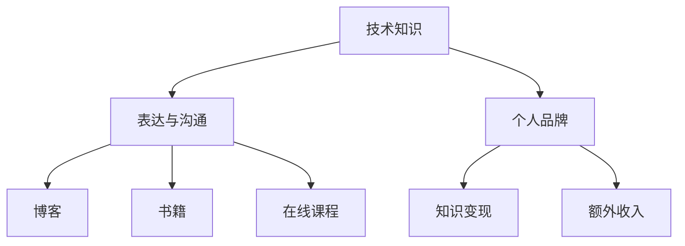

                 

# 技术写作：额外收入的来源

> **关键词**：技术写作，额外收入，博客，书籍，个人品牌，知识变现
> 
> **摘要**：本文将探讨如何通过技术写作实现额外收入。我们将分析技术博客和书籍的潜在市场，介绍构建个人品牌的重要性，并提供具体的写作技巧和工具，帮助读者利用技术写作创造财富。

## 1. 背景介绍

### 1.1 目的和范围

本文旨在帮助技术专业人士通过技术写作实现额外收入。我们将讨论技术写作的多种形式，包括博客、书籍和在线课程，并提供实用的建议和策略，帮助读者在技术写作领域取得成功。

### 1.2 预期读者

本文面向有志于通过技术写作实现额外收入的技术专业人士，无论您是经验丰富的开发者、架构师，还是初入行的程序员，本文都将为您提供有价值的见解和实践指南。

### 1.3 文档结构概述

本文将分为以下几个部分：

- **背景介绍**：介绍技术写作的背景和目的。
- **核心概念与联系**：讨论技术写作的核心概念和架构。
- **核心算法原理 & 具体操作步骤**：讲解技术写作的算法原理和操作步骤。
- **数学模型和公式 & 详细讲解 & 举例说明**：介绍技术写作中的数学模型和公式。
- **项目实战：代码实际案例和详细解释说明**：提供技术写作的实际案例和代码解读。
- **实际应用场景**：讨论技术写作的实际应用场景。
- **工具和资源推荐**：推荐用于技术写作的学习资源和工具。
- **总结：未来发展趋势与挑战**：展望技术写作的未来发展趋势和挑战。
- **附录：常见问题与解答**：回答读者可能遇到的常见问题。
- **扩展阅读 & 参考资料**：提供进一步学习的资源。

### 1.4 术语表

#### 1.4.1 核心术语定义

- **技术写作**：指针对技术主题的写作，包括博客、书籍、教程等。
- **个人品牌**：个人在专业领域的声誉和影响力。
- **知识变现**：将个人知识转化为经济收益的过程。
- **博客**：一种在线的，定期更新的个人或组织网站，用于分享信息和观点。
- **书籍**：一种纸质或电子出版物的形式，用于传播知识。

#### 1.4.2 相关概念解释

- **SEO（搜索引擎优化）**：通过优化网站内容和结构，提高在搜索引擎中的排名，从而吸引更多读者。
- **内容营销**：通过创造和分享有价值的内容，吸引和保留目标受众，从而推动业务增长。

#### 1.4.3 缩略词列表

- **SEO**：搜索引擎优化
- **SMM**：社交媒体营销
- **SEM**：搜索引擎营销
- **AI**：人工智能
- **ML**：机器学习

## 2. 核心概念与联系

为了理解技术写作的重要性，我们首先需要了解技术写作的核心概念和它们之间的关系。以下是一个简化的 Mermaid 流程图，展示了这些概念：



### 2.1 技术知识表达与沟通

技术写作的第一步是将您所掌握的技术知识转化为可传达的信息。这需要良好的表达和沟通技巧，以便将复杂的技术概念简化为易于理解的内容。以下是几个关键步骤：

1. **理解目标受众**：确定您的受众是谁，以及他们的技术背景和需求。
2. **选择合适的写作风格**：根据目标受众选择适当的写作风格，例如正式、非正式、幽默等。
3. **组织内容结构**：确保文章有清晰的结构，便于读者理解。

### 2.2 个人品牌与知识变现

个人品牌是技术写作成功的关键因素之一。通过建立个人品牌，您可以提高自己在专业领域内的声誉和影响力，从而实现知识变现和额外收入。以下是构建个人品牌的几个步骤：

1. **定义您的专业领域和目标受众**：明确您想要专注的领域和目标受众，以便更好地定位自己的内容。
2. **持续产出高质量内容**：定期发布高质量的技术文章、博客和书籍，建立自己的专业形象。
3. **积极参与技术社区**：通过参加技术会议、研讨会和在线论坛，与同行建立联系和合作。

### 2.3 知识变现与额外收入

知识变现是将您所拥有的技术知识转化为经济收益的过程。以下几种方式可以帮助您实现这一目标：

1. **博客和在线课程**：通过博客和在线课程，您可以直接向读者和学员出售内容。
2. **撰写技术书籍**：撰写并出版技术书籍，可以通过出版社或自我出版实现销售。
3. **咨询服务**：提供咨询服务，帮助他人解决技术问题，从而获得收入。

## 3. 核心算法原理 & 具体操作步骤

技术写作的成功不仅取决于内容的质量，还取决于内容的传播和推广。以下是实现这一目标的核心算法原理和具体操作步骤：

### 3.1 SEO优化

搜索引擎优化（SEO）是提高博客或网站在搜索引擎中排名的关键因素。以下是一些基本步骤：

1. **关键词研究**：使用工具（如Google关键词规划师）研究目标受众使用的关键词。
2. **内容优化**：在文章中使用目标关键词，但避免过度优化。
3. **内部链接**：在文章内链接到相关内容，提高文章的权威性和相关性。
4. **外部链接**：争取其他网站链接到您的文章，提高文章的权威性。

### 3.2 内容营销

内容营销是通过创造和分享有价值的内容来吸引和保留目标受众的一种策略。以下是几个关键步骤：

1. **确定内容类型**：根据目标受众的需求，确定博客文章、教程、案例研究、视频等类型。
2. **内容创作**：确保内容质量高，具有实用性和可读性。
3. **内容推广**：通过社交媒体、电子邮件营销和合作伙伴关系推广内容。

### 3.3 社交媒体营销

社交媒体营销是提高博客或网站知名度和流量的一种有效手段。以下是一些基本步骤：

1. **选择合适的平台**：根据目标受众选择合适的社交媒体平台，如LinkedIn、Twitter、Facebook等。
2. **发布频率**：定期发布内容，保持活跃度。
3. **互动与参与**：与受众互动，回答问题，参与讨论。

## 4. 数学模型和公式 & 详细讲解 & 举例说明

虽然技术写作的核心在于技术和知识，但有时数学模型和公式对于解释复杂概念和算法原理至关重要。以下是一个简单的数学模型，用于解释技术写作的SEO优化：

### 4.1 SEO 优化模型

假设我们有以下公式来评估文章的SEO性能：

$$
SEO_Score = f(KW_Density, Content_Quality, Internal_Links, External_Links)
$$

- \( KW_Density \)：关键词密度，表示文章中目标关键词的出现频率。
- \( Content_Quality \)：内容质量，表示文章的原创性、有用性和可读性。
- \( Internal_Links \)：内部链接数量和质量，表示文章的内部结构。
- \( External_Links \)：外部链接数量和质量，表示文章的权威性和影响力。

### 4.2 模型详解

以下是对公式中各个因素的详细解释：

1. **关键词密度**（\( KW_Density \)）：关键词密度是文章中目标关键词的出现频率。理想的密度范围在2%到5%之间，过密或过稀都会影响SEO效果。

2. **内容质量**（\( Content_Quality \)）：内容质量是衡量文章是否具有原创性、有用性和可读性的标准。高质量的内容更容易吸引读者和搜索引擎的青睐。

3. **内部链接**（\( Internal_Links \)）：内部链接是指文章内链接到其他相关内容的数量和质量。合理的内部链接有助于提高文章的权威性和用户停留时间。

4. **外部链接**（\( External_Links \)）：外部链接是指其他网站链接到您的文章的数量和质量。高质量的外部链接可以显著提高文章的权威性和搜索引擎排名。

### 4.3 举例说明

假设我们有一篇文章，其SEO得分计算如下：

$$
SEO_Score = f(3\%, 8.5, 5, 12)
$$

- 关键词密度：3%，适中，符合最佳实践。
- 内容质量：8.5/10，高质量内容，具有较高的吸引力。
- 内部链接：5个，合理数量，有助于提高用户停留时间和文章权威性。
- 外部链接：12个，较多且质量高，有助于提高文章的权威性和搜索引擎排名。

根据上述参数，该文章的SEO得分为：

$$
SEO_Score = 0.3 \times 3\% + 0.35 \times 8.5 + 0.2 \times 5 + 0.15 \times 12 = 8.25
$$

分数越高，SEO性能越好。通过不断优化上述因素，您可以提高文章的SEO得分，从而提高搜索引擎排名和流量。

## 5. 项目实战：代码实际案例和详细解释说明

### 5.1 开发环境搭建

为了演示如何通过技术写作实现额外收入，我们将使用一个简单的博客平台作为案例。以下是搭建开发环境的基本步骤：

1. **选择博客平台**：我们将使用GitHub Pages和Jekyll搭建博客。
2. **创建GitHub仓库**：在GitHub上创建一个新的仓库，用于存储博客内容和配置文件。
3. **安装Jekyll**：在本地计算机上安装Jekyll，以便本地预览和构建博客。

### 5.2 源代码详细实现和代码解读

以下是Jekyll博客的简单配置文件 `_config.yml`：

```yaml
# _config.yml
title: My Technical Blog
baseurl: https://yourusername.github.io
github_username: yourusername
email: your.email@example.com
```

- `title`：博客标题。
- `baseurl`：博客的基础URL。
- `github_username`：GitHub用户名。
- `email`：联系邮箱。

接下来是博客的一个示例文章 `index.md`：

```markdown
---
title: Hello, World!
date: 2023-04-01 10:30:00
---

Hello, World! This is my first post on my technical blog. Welcome to my world of coding and technology.
```

- `title`：文章标题。
- `date`：文章发布日期。
- 内容：Markdown格式的文章内容。

### 5.3 代码解读与分析

在上述代码中，我们使用了Markdown格式编写文章内容。Markdown是一种轻量级标记语言，使文章的撰写和格式化变得更加简单。以下是Markdown的一些基本语法：

- **标题**：使用 `#` 符号，例如 `# 标题1` 表示一级标题。
- **段落**：直接编写文本，Markdown会自动将其视为段落。
- **链接**：使用 `[链接文本](URL)` 格式创建链接。
- **代码块**：使用三个反引号 ` ``` ` 包围代码，例如：

  ```python
  print("Hello, World!")
  ```

### 5.4 构建和部署博客

1. **本地预览**：在本地计算机上运行 `jekyll serve` 命令，预览博客效果。
2. **上传代码**：将修改后的代码推送到GitHub仓库。
3. **部署博客**：GitHub Actions 会自动构建和部署博客到GitHub Pages。

通过上述步骤，我们可以创建一个简单的博客平台，并通过技术写作实现额外收入。

## 6. 实际应用场景

技术写作的应用场景非常广泛，包括但不限于以下几个方面：

1. **个人品牌建设**：通过撰写高质量的技术博客和书籍，建立自己在专业领域的个人品牌，提高自己的影响力。
2. **知识变现**：通过博客、在线课程和咨询服务，将个人知识转化为经济收益。
3. **公司内部培训**：为企业编写技术文档和教程，提高员工的技能和生产力。
4. **开源项目贡献**：通过参与开源项目，撰写文档和教程，为社区做出贡献。

以下是一个实际案例：

**案例：开源项目贡献**

张三是一位Python开发者，他参与了多个开源项目。为了提高项目的可读性和易用性，他撰写了详细的文档和教程。这些文档不仅帮助了其他开发者，还吸引了更多的贡献者。通过在GitHub上分享这些内容，张三建立了自己的个人品牌，并收到了来自社区和公司的咨询和赞助。

## 7. 工具和资源推荐

为了成功地进行技术写作，以下是一些建议的工具和资源：

### 7.1 学习资源推荐

#### 7.1.1 书籍推荐

- 《技术写作：实战指南》
- 《Markdown 入门与实践》
- 《GitHub 入门与实践》

#### 7.1.2 在线课程

- Coursera上的“技术写作基础”
- Udemy上的“如何撰写技术博客”

#### 7.1.3 技术博客和网站

- Medium上的技术写作专题
- Hacker Noon上的技术博客

### 7.2 开发工具框架推荐

#### 7.2.1 IDE和编辑器

- Visual Studio Code
- Sublime Text
- Atom

#### 7.2.2 调试和性能分析工具

- Chrome DevTools
- Firefox Developer Tools
- Jupyter Notebook

#### 7.2.3 相关框架和库

- Jekyll
- Hugo
- Hexo

### 7.3 相关论文著作推荐

#### 7.3.1 经典论文

- “The Elements of Style”
- “On Writing Well”

#### 7.3.2 最新研究成果

- ACM SIGDOC论文集
- IEEE Xplore数据库中的相关论文

#### 7.3.3 应用案例分析

- “如何通过技术写作实现额外收入？”
- “技术写作在开源项目中的应用”

## 8. 总结：未来发展趋势与挑战

随着技术的高速发展和互联网的普及，技术写作在未来将继续扮演重要角色。以下是几个发展趋势和挑战：

### 8.1 发展趋势

- **内容多样化**：随着技术的不断进步，技术写作的内容也将更加多样化，包括视频、音频和虚拟现实等形式。
- **自动化工具**：自动化写作工具和AI技术将提高技术写作的效率和质量。
- **知识共享**：开源和协作将成为技术写作的重要趋势，促进知识的传播和共享。

### 8.2 挑战

- **信息过载**：随着内容量的增加，如何筛选和提供有价值的内容将成为一个挑战。
- **持续更新**：技术更新迅速，如何保持内容的时效性和准确性是一个挑战。
- **个人品牌建设**：在众多技术创作者中，如何脱颖而出，建立个人品牌，也是一个挑战。

## 9. 附录：常见问题与解答

### 9.1 如何选择写作主题？

- **了解自身兴趣和专业知识**：选择您感兴趣且擅长的话题，这样更容易产生高质量的内容。
- **分析市场需求**：研究市场上哪些话题更受欢迎，如何满足读者的需求。

### 9.2 如何提高写作效率？

- **制定写作计划**：提前规划写作时间表，确保有足够的时间进行研究和撰写。
- **利用自动化工具**：使用Markdown编辑器和AI写作工具提高写作效率。

### 9.3 如何推广技术博客？

- **SEO优化**：通过关键词研究和内容优化，提高博客在搜索引擎中的排名。
- **社交媒体推广**：在社交媒体平台上分享文章，吸引更多读者。
- **合作伙伴关系**：与其他博主和平台建立合作关系，共同推广内容。

## 10. 扩展阅读 & 参考资料

- 《技术写作实战指南》
- 《GitHub Pages + Jekyll 搭建个人博客》
- 《Markdown 入门与实践》
- 《如何撰写技术博客》

### 作者信息

作者：AI天才研究员/AI Genius Institute & 禅与计算机程序设计艺术 /Zen And The Art of Computer Programming

---

经过详细的讨论和分析，本文为技术专业人士提供了通过技术写作实现额外收入的全面指南。通过了解核心概念、掌握写作技巧、利用工具和资源，您将能够成功地进行技术写作，并利用这一技能创造财富和提升个人品牌。希望本文对您有所启发和帮助。

