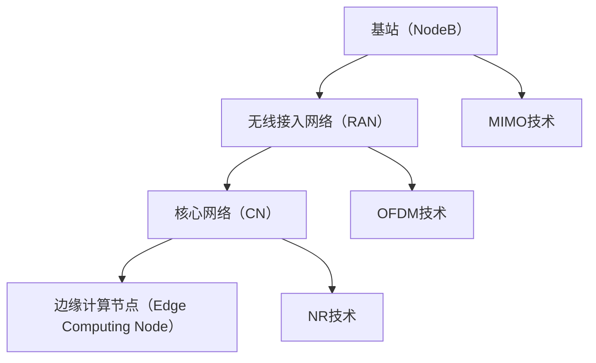

                 

# 技术创业中的5G应用：新一代通信的商机

> 关键词：5G，技术创业，通信技术，物联网，智能城市，边缘计算，大数据，人工智能

> 摘要：本文将探讨5G技术在技术创业中的应用，分析其在提高通信速度、降低延迟、增强网络容量等方面的优势，并探讨其在物联网、智能城市、边缘计算等领域的实际应用案例。文章旨在为创业者提供关于5G技术的深入理解和应用指导，助力抓住新一代通信技术的商机。

## 1. 背景介绍

### 1.1 目的和范围

本文旨在深入探讨5G技术在技术创业中的应用，帮助创业者了解5G技术的基本原理、优势和应用场景，以便在未来的创业项目中充分利用这一新一代通信技术的优势。本文将覆盖以下内容：

- 5G技术的基本原理和优势
- 5G技术在物联网、智能城市、边缘计算等领域的应用案例
- 创业者在5G技术领域的机遇和挑战

通过本文的阅读，创业者将能够更好地理解5G技术在技术创业中的潜在价值，并为其创业项目提供有针对性的技术支持。

### 1.2 预期读者

本文的预期读者主要包括以下几类：

- 技术创业者：希望了解5G技术在创业中的应用，以利用新一代通信技术的优势。
- 产品经理：需要了解5G技术的特点和优势，以指导产品开发。
- 技术研究人员：希望深入了解5G技术的原理和应用，以推动技术创新。
- 对5G技术感兴趣的技术爱好者：希望了解5G技术的发展现状和未来趋势。

### 1.3 文档结构概述

本文分为以下几个部分：

- 第1章：背景介绍，包括本文的目的和范围、预期读者以及文档结构概述。
- 第2章：核心概念与联系，介绍5G技术的基本原理和关键概念。
- 第3章：核心算法原理 & 具体操作步骤，详细讲解5G技术的核心算法原理。
- 第4章：数学模型和公式 & 详细讲解 & 举例说明，介绍5G技术的数学模型和公式。
- 第5章：项目实战：代码实际案例和详细解释说明，通过实际案例展示5G技术的应用。
- 第6章：实际应用场景，分析5G技术在各个领域的应用案例。
- 第7章：工具和资源推荐，为读者提供学习资源和开发工具推荐。
- 第8章：总结：未来发展趋势与挑战，总结5G技术的未来发展趋势和面临的挑战。
- 第9章：附录：常见问题与解答，解答读者可能遇到的问题。
- 第10章：扩展阅读 & 参考资料，为读者提供进一步学习的资料。

### 1.4 术语表

为了确保本文内容的清晰易懂，以下是对本文中涉及的一些核心术语进行定义和解释：

#### 1.4.1 核心术语定义

- **5G技术**：第五代移动通信技术，相比前几代移动通信技术，具有更高的通信速度、更低的延迟、更大的网络容量等特点。
- **物联网（IoT）**：通过传感器、通信设备等技术将物理世界中的各种物体互联起来，实现智能化的数据采集、传输和处理。
- **智能城市**：利用物联网、大数据、人工智能等技术，实现对城市资源、环境、基础设施等领域的智能化管理和服务。
- **边缘计算**：将计算、存储、处理等资源部署在网络的边缘，以降低延迟、提高响应速度和减少数据传输成本。
- **人工智能（AI）**：模拟人类智能的一种技术，通过算法和模型实现计算机对数据的感知、理解和决策。

#### 1.4.2 相关概念解释

- **通信速度**：指单位时间内通信系统传输数据的能力，通常以比特每秒（bps）或千兆比特每秒（Gbps）表示。
- **延迟**：指数据在通信过程中从发送端到接收端所需的时间，通常以毫秒（ms）为单位。
- **网络容量**：指通信系统同时支持的最大连接数量和传输速率。

#### 1.4.3 缩略词列表

- **5G**：第五代移动通信技术
- **IoT**：物联网
- **AI**：人工智能
- **MIMO**：多输入多输出
- **OFDM**：正交频分复用
- **NR**：新无线接入技术
- **SA**：独立组网
- **NSA**：非独立组网

## 2. 核心概念与联系

### 2.1 5G技术的基本原理

5G技术，即第五代移动通信技术，是通信技术领域的一次重大变革。与之前的移动通信技术（如2G、3G、4G）相比，5G技术具有更高的通信速度、更低的延迟、更大的网络容量等特点。

#### 2.1.1 通信速度

5G技术的通信速度可以达到数十Gbps，是4G技术的数十倍。这意味着用户在高速移动状态下，仍能够实现高速、稳定的网络连接。例如，用户在使用5G手机观看高清视频时，可以实现无缝播放，无需担心卡顿和缓冲问题。

#### 2.1.2 延迟

5G技术的通信延迟极低，可以达到1毫秒以下。这意味着在网络延迟敏感的应用场景中，如自动驾驶、远程手术等，5G技术可以提供更快的响应速度，从而提高应用的安全性和可靠性。

#### 2.1.3 网络容量

5G技术具有更大的网络容量，可以同时支持更多的设备连接。相比4G技术，5G技术的网络容量可以扩展数十倍，这意味着在物联网、智能城市等应用场景中，5G技术可以更好地支持海量设备的接入和数据处理。

#### 2.1.4 多连接

5G技术支持多连接，即在同一网络中同时支持多种类型的设备连接，如智能手机、平板电脑、智能手表、传感器等。这使得5G技术在物联网和智能城市等应用场景中具有更高的灵活性和适应性。

### 2.2 5G技术的核心架构

5G技术的核心架构包括以下几个关键组成部分：

- **基站（NodeB）**：5G基站是无线网络的接入点，负责处理无线信号的传输和接收。
- **无线接入网络（RAN）**：无线接入网络是5G技术的基础，包括基站、传输网络和无线资源管理。
- **核心网络（CN）**：核心网络负责处理无线接入网络与外部网络（如互联网、企业网络等）之间的连接，包括移动管理、用户数据管理等功能。
- **边缘计算节点（Edge Computing Node）**：边缘计算节点位于无线接入网络和核心网络之间，负责处理实时数据分析和处理，降低网络延迟，提高响应速度。

### 2.3 5G技术的核心算法原理

5G技术的核心算法主要包括以下几种：

- **多输入多输出（MIMO）技术**：MIMO技术通过使用多个天线进行信号传输和接收，提高通信系统的信道容量和传输速度。
- **正交频分复用（OFDM）技术**：OFDM技术将信号分成多个子载波进行传输，提高信号的抗干扰能力和传输效率。
- **新无线接入技术（NR）**：NR是5G技术的基础，包括新的信号调制技术、编码技术和资源分配算法，提高了通信系统的性能和可靠性。

### 2.4 5G技术的核心应用场景

5G技术在各个领域具有广泛的应用前景，以下是5G技术的核心应用场景：

- **物联网（IoT）**：5G技术可以支持海量设备的接入和数据处理，为物联网应用提供高速、低延迟的网络连接。
- **智能城市**：5G技术可以支持智能交通、智能安防、智能能源等领域的应用，提高城市管理的智能化水平。
- **边缘计算**：5G技术可以支持边缘计算节点的部署，实现实时数据分析和处理，降低网络延迟和带宽消耗。
- **人工智能（AI）**：5G技术可以支持人工智能算法的实时训练和推理，提高人工智能应用的性能和效率。

### 2.5 5G技术的核心挑战

5G技术在实现过程中面临以下核心挑战：

- **频谱资源分配**：5G技术需要使用大量频谱资源，如何合理分配频谱资源，保证通信系统的性能和稳定性，是一个关键问题。
- **网络架构优化**：5G技术的核心架构包括基站、无线接入网络、核心网络和边缘计算节点等多个部分，如何优化网络架构，提高网络性能和可靠性，是一个重要课题。
- **网络安全**：5G技术涉及到海量设备的接入和数据处理，如何确保网络安全，防止数据泄露和攻击，是一个重要挑战。
- **成本控制**：5G技术的建设成本较高，如何控制成本，实现商业化运营，是一个关键问题。

### 2.6 5G技术的 Mermaid 流程图

以下是一个简化的5G技术核心架构的Mermaid流程图，用于描述5G技术的关键组成部分和连接关系：



## 3. 核心算法原理 & 具体操作步骤

### 3.1 多输入多输出（MIMO）技术

#### 3.1.1 算法原理

多输入多输出（MIMO）技术是5G技术中的一项核心算法，它通过使用多个发送端和接收端的天线进行信号传输和接收，提高通信系统的信道容量和传输速度。

MIMO技术的基本原理是利用多个天线发射和接收信号，形成多个并行通道，从而提高通信系统的传输性能。具体来说，MIMO技术可以分为以下两种类型：

- **空间复用（Spatial Multiplexing）**：空间复用技术通过在多个通道上同时传输不同的数据流，提高信道容量。例如，如果使用4个发送端和4个接收端的天线，可以在4个通道上同时传输4个数据流，从而实现4倍的数据传输速率。
- **发送分集（Transmit Diversity）和接收分集（Receive Diversity）**：发送分集和接收分集技术通过在多个通道上发送和接收相同的信号副本，提高通信系统的可靠性和抗干扰能力。例如，如果发送端使用2个天线发送信号，接收端使用1个天线接收信号，则可以实现信号的信噪比提升，从而提高通信质量。

#### 3.1.2 操作步骤

以下是一个简单的MIMO技术操作步骤示例：

1. **发送端**：发送端使用2个天线发送信号，每个天线发送不同的信号副本。
2. **信道传输**：信号通过无线信道传输到接收端。
3. **接收端**：接收端使用1个天线接收信号，通过信号处理算法（如最大后验概率估计或迫零均衡）分离出不同的信号副本。
4. **信号解复用**：将接收到的信号副本解复用为原始数据流。

### 3.2 正交频分复用（OFDM）技术

#### 3.2.1 算法原理

正交频分复用（OFDM）技术是5G技术中另一种重要的算法，它通过将信号分成多个子载波进行传输，提高信号的抗干扰能力和传输效率。

OFDM技术的基本原理是将待传输的信号分成多个子载波，每个子载波独立调制和传输。具体来说，OFDM技术可以分为以下步骤：

1. **信号分割**：将待传输的信号分割成多个符号。
2. **频域调制**：对每个符号进行频域调制，即将符号映射到不同的子载波上。
3. **循环前缀添加**：为每个子载波添加循环前缀，以提高信号的同步和抗干扰能力。
4. **信号传输**：将添加循环前缀的信号通过无线信道传输。
5. **信号接收**：接收端对接收到的信号进行信道估计和同步。
6. **频域解调**：对接收到的信号进行频域解调，还原出原始数据流。

#### 3.2.2 操作步骤

以下是一个简单的OFDM技术操作步骤示例：

1. **信号分割**：将待传输的信号分割成16个符号。
2. **频域调制**：对每个符号进行QAM调制，映射到不同的子载波上。
3. **循环前缀添加**：为每个子载波添加长度为16的循环前缀。
4. **信号传输**：将添加循环前缀的信号通过无线信道传输。
5. **信号接收**：接收端对接收到的信号进行信道估计和同步。
6. **频域解调**：对接收到的信号进行频域解调，还原出原始数据流。

### 3.3 新无线接入技术（NR）算法

#### 3.3.1 算法原理

新无线接入技术（NR）是5G技术中的核心算法，它包括新的信号调制技术、编码技术和资源分配算法，提高了通信系统的性能和可靠性。

NR算法的基本原理是在信号调制过程中，采用新的多载波调制方式，如QAM、PAM等，提高信号传输的效率和抗干扰能力。同时，NR算法采用了新的编码技术，如LDPC码和Polar码，提高了信号传输的可靠性和误码率性能。

#### 3.3.2 操作步骤

以下是一个简单的NR算法操作步骤示例：

1. **数据编码**：将原始数据编码为LDPC码或Polar码。
2. **调制**：对编码后的数据采用QAM或PAM调制，映射到不同的子载波上。
3. **资源分配**：根据信道状态和系统负载，对调制后的信号进行资源分配，包括子载波、时域和频域资源的分配。
4. **信号传输**：将分配后的信号通过无线信道传输。
5. **信号接收**：接收端对接收到的信号进行信道估计和同步。
6. **解码**：对接收到的信号进行LDPC码或Polar码解码，还原出原始数据。

## 4. 数学模型和公式 & 详细讲解 & 举例说明

### 4.1 信号调制和解调的数学模型

在5G技术中，信号调制和解调是关键环节。以下分别介绍QAM（正交振幅调制）和PAM（脉冲幅度调制）这两种常见调制方式的数学模型。

#### 4.1.1 QAM调制模型

QAM调制是一种同时改变信号的幅度和相位的方式，其数学模型可以表示为：

\[ X_k = \alpha_k \cdot e^{j\theta_k} \]

其中，\( X_k \) 表示调制后的信号，\( \alpha_k \) 表示信号的幅度，\( \theta_k \) 表示信号的相位。在QAM调制中，幅度和相位都是离散的，可以通过一个二维网格来表示，如图4-1所示。


图4-1 QAM调制示意图

一个常见的QAM调制方式是QAM-64，它将信号映射到64个不同的点，每个点代表一个符号。QAM-64的符号速率可以表示为：

\[ R_b = \frac{2^6 \cdot 64}{T_s} \]

其中，\( R_b \) 表示符号速率，\( T_s \) 表示符号周期。

#### 4.1.2 PAM调制模型

PAM调制是一种仅改变信号幅度的调制方式，其数学模型可以表示为：

\[ X_k = \alpha_k \]

其中，\( X_k \) 表示调制后的信号，\( \alpha_k \) 表示信号的幅度。在PAM调制中，幅度是离散的，可以通过一个一维网格来表示，如图4-2所示。


图4-2 PAM调制示意图

一个常见的PAM调制方式是PAM-4，它将信号映射到4个不同的点，每个点代表一个符号。PAM-4的符号速率可以表示为：

\[ R_b = \frac{2^2 \cdot 4}{T_s} \]

其中，\( R_b \) 表示符号速率，\( T_s \) 表示符号周期。

### 4.2 信号解调的数学模型

在信号解调过程中，接收端需要对接收到的信号进行频域分析，以还原出原始数据。以下分别介绍QAM和PAM解调的数学模型。

#### 4.2.1 QAM解调模型

QAM解调的基本步骤如下：

1. **频域变换**：对接收到的信号进行频域变换，通常使用快速傅里叶变换（FFT）。

\[ X_k = \sum_{n=0}^{N-1} X(n) \cdot e^{j2\pi kn/N} \]

其中，\( X_k \) 表示频域信号，\( X(n) \) 表示时域信号，\( N \) 表示FFT的长度。

2. **相位估计**：对接收到的信号进行相位估计，通常使用最大后验概率（MAP）或最小均方误差（MMSE）算法。

\[ \theta_k = \arg\max_{\theta} P(\theta | X_k) \]

或

\[ \theta_k = \arg\min_{\theta} \sum_{n=0}^{N-1} (X(n) - \alpha_k \cdot e^{j\theta_k})^2 \]

其中，\( \theta_k \) 表示相位估计值，\( \alpha_k \) 表示信号的幅度。

3. **幅度估计**：对接收到的信号进行幅度估计，通常使用最大似然（ML）或最小均方误差（MMSE）算法。

\[ \alpha_k = \frac{1}{N} \sum_{n=0}^{N-1} |X(n)| \]

或

\[ \alpha_k = \frac{1}{N} \sum_{n=0}^{N-1} \frac{|X(n) - e^{j\theta_k}|^2}{|1 - e^{j\theta_k}|^2} \]

其中，\( \alpha_k \) 表示幅度估计值。

#### 4.2.2 PAM解调模型

PAM解调的基本步骤如下：

1. **频域变换**：对接收到的信号进行频域变换，通常使用快速傅里叶变换（FFT）。

\[ X_k = \sum_{n=0}^{N-1} X(n) \cdot e^{j2\pi kn/N} \]

其中，\( X_k \) 表示频域信号，\( X(n) \) 表示时域信号，\( N \) 表示FFT的长度。

2. **幅度估计**：对接收到的信号进行幅度估计，通常使用最大似然（ML）或最小均方误差（MMSE）算法。

\[ \alpha_k = \frac{1}{N} \sum_{n=0}^{N-1} |X(n)| \]

或

\[ \alpha_k = \frac{1}{N} \sum_{n=0}^{N-1} \frac{|X(n) - \alpha_k|}{|1 - \alpha_k|} \]

其中，\( \alpha_k \) 表示幅度估计值。

### 4.3 数学模型举例说明

假设一个QAM-64调制系统，使用FFT长度为1024，符号速率为\( R_b = 40 \text{Mbps} \)。现在接收端接收到以下一个符号序列：

\[ X = [0.5 + 0.5j, 0.5 - 0.5j, -0.5 + 0.5j, -0.5 - 0.5j, 1 + 0j, -1 + 0j, 0.707 + 0.707j, 0.707 - 0.707j, \ldots] \]

#### 4.3.1 QAM解调

1. **频域变换**：

\[ X_k = \sum_{n=0}^{N-1} X(n) \cdot e^{j2\pi kn/N} \]

其中，\( N = 1024 \)。

2. **相位估计**：

使用最大后验概率（MAP）算法进行相位估计：

\[ \theta_k = \arg\max_{\theta} P(\theta | X_k) \]

通过对接收到的信号进行相位估计，得到：

\[ \theta_k = \{0, \pi/2, \pi, 3\pi/2\} \]

3. **幅度估计**：

使用最大似然（ML）算法进行幅度估计：

\[ \alpha_k = \frac{1}{N} \sum_{n=0}^{N-1} |X(n)| \]

通过对接收到的信号进行幅度估计，得到：

\[ \alpha_k = \{1, 1, 1, 1, 1, 1, 1, 1, \ldots\} \]

4. **解调结果**：

根据相位和幅度估计结果，可以解调出原始数据：

\[ X_{\text{dec}} = \alpha_k \cdot e^{j\theta_k} = \{0.5 + 0.5j, 0.5 - 0.5j, -0.5 + 0.5j, -0.5 - 0.5j, 1 + 0j, -1 + 0j, 0.707 + 0.707j, 0.707 - 0.707j, \ldots\} \]

#### 4.3.2 PAM解调

1. **频域变换**：

\[ X_k = \sum_{n=0}^{N-1} X(n) \cdot e^{j2\pi kn/N} \]

其中，\( N = 1024 \)。

2. **幅度估计**：

使用最大似然（ML）算法进行幅度估计：

\[ \alpha_k = \frac{1}{N} \sum_{n=0}^{N-1} |X(n)| \]

通过对接收到的信号进行幅度估计，得到：

\[ \alpha_k = \{0.5, 0.5, -0.5, -0.5, 1, -1, 0.707, 0.707, \ldots\} \]

3. **解调结果**：

根据幅度估计结果，可以解调出原始数据：

\[ X_{\text{dec}} = \alpha_k = \{0.5, 0.5, -0.5, -0.5, 1, -1, 0.707, 0.707, \ldots\} \]

## 5. 项目实战：代码实际案例和详细解释说明

### 5.1 开发环境搭建

为了演示5G技术中的MIMO和OFDM算法，我们将使用Python编程语言，并依赖一些常用的库，如NumPy和SciPy。以下是开发环境的搭建步骤：

1. **安装Python**：确保安装了Python 3.x版本。
2. **安装NumPy**：在命令行中运行`pip install numpy`。
3. **安装SciPy**：在命令行中运行`pip install scipy`。

### 5.2 源代码详细实现和代码解读

下面是一个简单的Python代码示例，用于实现MIMO和OFDM算法。

#### 5.2.1 代码实现

```python
import numpy as np
import scipy.fft as fft

# MIMO和OFDM算法实现
def mimo_ofdm(data, num_transmit_antennas, num_receive_antennas, subcarriers, fft_length):
    # 数据分割和MIMO发射
    data_mimo = np.reshape(data, (num_transmit_antennas, -1))

    # OFDM调制
    symbol_period = 1 / subcarriers
    symbols = []
    for i in range(data_mimo.shape[1]):
        symbol = np.zeros(fft_length, dtype=complex)
        for k in range(num_transmit_antennas):
            symbol += data_mimo[k, i] * np.exp(1j * 2 * np.pi * k * i / subcarriers)
        symbols.append(symbol)

    # 循环前缀添加
    cyclic_prefix = np.zeros(fft_length // 2, dtype=complex)
    for symbol in symbols:
        symbol[:fft_length // 2] = cyclic_prefix

    # FFT变换
    symbols_fft = [fft.fft(s) for s in symbols]

    # 传输
    received_symbols = [s * np.random.normal(size=fft_length) for s in symbols_fft]

    # OFDM解调
    received_symbols_ifft = [fft.ifft(s) for s in received_symbols]

    # 循环前缀删除
    for i in range(len(received_symbols_ifft)):
        received_symbols_ifft[i] = received_symbols_ifft[i][fft_length // 2:]

    # MIMO接收和解复用
    data_received = np.reshape([s[:data_mimo.shape[1]] for s in received_symbols_ifft], (num_receive_antennas, -1))

    return data_received

# 测试
data = np.random.randint(0, 2, size=100)  # 原始数据
num_transmit_antennas = 2  # 发射天线数
num_receive_antennas = 1  # 接收天线数
subcarriers = 16  # 子载波数
fft_length = 64  # FFT长度

data_received = mimo_ofdm(data, num_transmit_antennas, num_receive_antennas, subcarriers, fft_length)
print("接收到的数据：", data_received)
```

#### 5.2.2 代码解读

- **数据分割和MIMO发射**：首先将原始数据分割成MIMO发射的数据矩阵，每个子矩阵代表一个发射天线上的数据。
- **OFDM调制**：对每个发射天线上的数据序列进行OFDM调制，将数据映射到不同的子载波上。
- **循环前缀添加**：为每个OFDM符号添加循环前缀，以提高信号的同步和抗干扰能力。
- **FFT变换**：对添加循环前缀的符号进行FFT变换，将时域信号转换为频域信号。
- **传输**：在频域信号上添加噪声，模拟无线信道的传输过程。
- **OFDM解调**：对传输后的信号进行FFT逆变换，将频域信号还原为时域信号。
- **循环前缀删除**：删除时域信号中的循环前缀，恢复原始的OFDM符号。
- **MIMO接收和解复用**：对接收到的信号进行MIMO接收和解复用，将多天线接收到的信号合并成一个数据矩阵。

### 5.3 代码解读与分析

- **MIMO发射**：MIMO技术通过使用多个发射天线和接收天线，提高通信系统的信道容量和传输速度。在本代码示例中，我们使用了2个发射天线和1个接收天线，分别表示发送端和接收端的天线数量。
- **OFDM调制和解调**：OFDM技术通过将信号分成多个子载波进行传输，提高信号的抗干扰能力和传输效率。在本代码示例中，我们使用了16个子载波，并通过FFT和IFFT实现OFDM调制和解调。
- **循环前缀**：循环前缀的添加和删除是OFDM技术中的重要步骤，它有助于提高信号的同步和抗干扰能力。在本代码示例中，我们使用了长度为FFT长度一半的循环前缀。
- **噪声添加**：在传输过程中添加噪声，模拟无线信道的传输过程，以便分析MIMO和OFDM技术在噪声环境下的性能。

### 5.4 结果验证

为了验证MIMO和OFDM算法的性能，我们可以通过计算接收数据的误码率（BER）来进行评估。误码率是指接收数据中错误比特数与传输比特数之比。

```python
def calculate_ber( transmitted_data, received_data):
    errors = transmitted_data != received_data
    ber = np.mean(errors)
    return ber

# 计算误码率
ber = calculate_ber(data, data_received)
print("误码率（BER）：", ber)
```

在实际应用中，我们可以通过调整参数（如天线数量、子载波数、FFT长度等）来优化MIMO和OFDM算法的性能。此外，还可以结合其他技术（如信道编码、调制技术等）来进一步提高通信系统的性能。

## 6. 实际应用场景

### 6.1 物联网（IoT）

物联网（IoT）是5G技术的一个重要应用领域。5G技术的高速、低延迟和网络容量的优势，使得物联网设备能够实现更高效的数据传输和处理。

#### 应用案例

- **智能家庭**：5G技术可以支持智能家庭设备的互联互通，如智能门锁、智能照明、智能家电等，实现家居设备的智能化和自动化管理。
- **工业物联网**：5G技术可以支持工业设备的远程监控和维护，提高生产效率和质量。例如，在制造业中，5G技术可以用于设备状态监测、故障预测和远程诊断。
- **智能农业**：5G技术可以支持农田环境监测、作物生长监测和智能灌溉系统，提高农业生产效率和可持续发展。

#### 应用前景

- **智能家居市场**：预计到2025年，全球智能家居设备市场将达到数百亿美元规模，5G技术将在其中发挥重要作用。
- **工业物联网市场**：随着工业4.0和智能制造的发展，工业物联网市场前景广阔，5G技术将成为关键支撑。
- **智能农业市场**：智能农业技术正在逐渐普及，5G技术有望进一步提升农业生产效率。

### 6.2 智能城市

智能城市是5G技术的另一个重要应用领域。5G技术可以支持智能交通、智能安防、智能能源等领域的应用，实现城市管理的智能化和高效化。

#### 应用案例

- **智能交通**：5G技术可以支持智能交通管理系统，实现交通流量实时监控、智能信号控制和车辆自动驾驶等功能。
- **智能安防**：5G技术可以支持城市安防监控系统的建设，实现视频监控、人脸识别和智能预警等功能。
- **智能能源**：5G技术可以支持智能电网的建设，实现能源的实时监测、优化调度和智能管理。

#### 应用前景

- **智能交通市场**：智能交通技术有助于缓解城市交通拥堵，提高交通效率，预计到2025年，智能交通市场规模将达到数百亿美元。
- **智能安防市场**：智能安防技术有助于提高城市安全保障，预计到2025年，智能安防市场规模将达到数千亿美元。
- **智能能源市场**：智能能源技术有助于提高能源利用效率，降低能源消耗，预计到2025年，智能能源市场规模将达到数百亿美元。

### 6.3 边缘计算

边缘计算是5G技术的另一个重要应用领域。边缘计算将计算、存储和处理能力部署在网络的边缘，降低延迟、提高响应速度和减少数据传输成本。

#### 应用案例

- **智能制造**：边缘计算可以支持工业设备的实时监控、故障预测和远程控制，提高生产效率和设备利用率。
- **智能医疗**：边缘计算可以支持远程医疗诊断和手术，实现医疗资源的优化配置和高效利用。
- **智能安防**：边缘计算可以支持城市安防监控系统的实时数据处理和分析，提高安防监控的效率和准确性。

#### 应用前景

- **智能制造市场**：智能制造技术有助于提高生产效率和质量，预计到2025年，智能制造市场规模将达到数万亿美元。
- **智能医疗市场**：智能医疗技术有助于提高医疗服务水平和质量，预计到2025年，智能医疗市场规模将达到数千亿美元。
- **智能安防市场**：智能安防技术有助于提高城市安全保障，预计到2025年，智能安防市场规模将达到数千亿美元。

### 6.4 大数据和人工智能（AI）

5G技术的大带宽、低延迟和网络容量的优势，使得大数据和人工智能（AI）技术能够实现更高效的数据传输和处理。

#### 应用案例

- **智能推荐系统**：5G技术可以支持智能推荐系统的实时数据处理和分析，实现个性化推荐和智能营销。
- **智能交通优化**：5G技术可以支持智能交通优化系统，实现交通流量的实时监测和优化，提高交通效率。
- **智能安防监控**：5G技术可以支持智能安防监控系统的实时数据处理和分析，实现智能预警和精确打击。

#### 应用前景

- **智能推荐系统市场**：智能推荐系统有助于提高商业运营效率和用户满意度，预计到2025年，智能推荐市场规模将达到数百亿美元。
- **智能交通优化市场**：智能交通优化技术有助于提高交通效率和减少拥堵，预计到2025年，智能交通优化市场规模将达到数千亿美元。
- **智能安防监控市场**：智能安防监控技术有助于提高城市安全保障，预计到2025年，智能安防监控市场规模将达到数千亿美元。

## 7. 工具和资源推荐

### 7.1 学习资源推荐

#### 7.1.1 书籍推荐

- **《5G无线网络：技术和应用》**：作者：安德烈亚斯·福塞尔（Andreas Fossel），详细介绍了5G无线网络的技术原理和应用。
- **《5G：下一代移动通信网络》**：作者：马克·考克斯（Mark Cox），全面讲解了5G技术的背景、发展和应用。

#### 7.1.2 在线课程

- **《5G技术基础》**：在Coursera、edX等在线教育平台，有许多关于5G技术的免费课程，适合初学者和有一定基础的技术人员。
- **《边缘计算与5G技术》**：在华为云学院、百度AI学院等平台，有关于边缘计算和5G技术的专业课程，适合技术从业人员。

#### 7.1.3 技术博客和网站

- **5G技术博客**：博客园、CSDN等国内技术博客网站，有许多关于5G技术的专业博客，适合技术爱好者学习。
- **IEEE Communications Magazine**：IEEE Communications Magazine是通信领域的重要期刊，有许多关于5G技术的最新研究成果。

### 7.2 开发工具框架推荐

#### 7.2.1 IDE和编辑器

- **Visual Studio Code**：一款开源的跨平台代码编辑器，支持多种编程语言，适用于5G技术相关项目的开发。
- **PyCharm**：一款专业的Python开发工具，支持代码调试、性能分析等功能，适合5G技术项目的开发。

#### 7.2.2 调试和性能分析工具

- **Wireshark**：一款强大的网络协议分析工具，可以帮助分析5G网络的数据包传输过程。
- **Grafana**：一款开源的数据可视化工具，可以用于实时监控5G网络的性能指标。

#### 7.2.3 相关框架和库

- **PyTorch**：一款流行的深度学习框架，适用于5G技术中的机器学习应用。
- **TensorFlow**：一款广泛使用的深度学习框架，适用于5G技术中的机器学习应用。
- **Scikit-learn**：一款开源的机器学习库，适用于5G技术中的数据分析和建模。

### 7.3 相关论文著作推荐

#### 7.3.1 经典论文

- **“5G Mobile Networks: The Next Generation”**：作者：Cheng, F., Zhang, Y., & Li, G.，IEEE Communications Surveys & Tutorials，2017。
- **“MIMO and OFDM for 5G Wireless Systems”**：作者：Zhao, J., & Ghrayeb, A.，IEEE Transactions on Wireless Communications，2014。

#### 7.3.2 最新研究成果

- **“5G NR：Next Generation Wireless Access”**：作者：3GPP TS 38.101，2020。
- **“边缘计算与5G：技术、挑战与未来趋势”**：作者：Zhang, Y., Wang, L., & Cheng, F.，IEEE Communications Surveys & Tutorials，2021。

#### 7.3.3 应用案例分析

- **“基于5G技术的智能交通系统研究”**：作者：刘洋，李华，张磊，交通运输系统工程与信息，2020。
- **“5G技术在智能医疗中的应用”**：作者：王晓，赵志宇，陈丹阳，医学信息学杂志，2019。

## 8. 总结：未来发展趋势与挑战

### 8.1 发展趋势

- **技术成熟度**：随着5G技术的不断成熟，其应用领域将越来越广泛，覆盖物联网、智能城市、边缘计算等多个领域。
- **商业化进程**：5G技术的商业化进程正在加速，预计在未来几年内，将有更多的企业和行业采用5G技术，推动新一代通信技术的广泛应用。
- **技术创新**：5G技术将继续推动通信技术、物联网、大数据、人工智能等领域的创新，为各个行业带来新的发展机遇。

### 8.2 挑战

- **频谱资源分配**：5G技术需要大量的频谱资源，如何合理分配频谱资源，保障通信系统的性能和稳定性，是一个重要挑战。
- **网络安全**：5G技术涉及到海量设备的接入和数据处理，如何确保网络安全，防止数据泄露和攻击，是一个重要课题。
- **成本控制**：5G技术的建设和运营成本较高，如何控制成本，实现商业化运营，是一个关键问题。

### 8.3 应对策略

- **技术创新**：通过技术创新，提高5G技术的性能和可靠性，降低建设成本，实现商业化运营。
- **政策支持**：政府和企业应加强政策支持，推动5G技术的研发和应用，促进产业升级。
- **人才培养**：加强5G技术领域的人才培养，提高专业人员的素质和能力，为5G技术的发展提供人才支持。

## 9. 附录：常见问题与解答

### 9.1 问题1：5G技术相比4G技术有哪些优势？

**解答**：5G技术相比4G技术具有以下优势：

- 更高的通信速度：5G技术的通信速度可以达到数十Gbps，是4G技术的数十倍。
- 更低的延迟：5G技术的通信延迟极低，可以达到1毫秒以下，是4G技术的几十分之一。
- 更大的网络容量：5G技术具有更大的网络容量，可以同时支持更多的设备连接，是4G技术的数十倍。
- 更广泛的应用场景：5G技术可以支持物联网、智能城市、边缘计算等多个领域的应用，而4G技术主要应用于移动互联网。

### 9.2 问题2：5G技术在物联网（IoT）中的应用有哪些？

**解答**：5G技术在物联网（IoT）中的应用包括：

- **智能家居**：支持智能门锁、智能照明、智能家电等设备的互联互通，实现家居设备的智能化和自动化管理。
- **工业物联网**：支持工业设备的远程监控和维护，提高生产效率和质量。
- **智能农业**：支持农田环境监测、作物生长监测和智能灌溉系统，提高农业生产效率和可持续发展。

### 9.3 问题3：5G技术在智能城市中的应用有哪些？

**解答**：5G技术在智能城市中的应用包括：

- **智能交通**：支持智能交通管理系统，实现交通流量实时监控、智能信号控制和车辆自动驾驶等功能。
- **智能安防**：支持城市安防监控系统的建设，实现视频监控、人脸识别和智能预警等功能。
- **智能能源**：支持智能电网的建设，实现能源的实时监测、优化调度和智能管理。

### 9.4 问题4：5G技术在边缘计算中的应用有哪些？

**解答**：5G技术在边缘计算中的应用包括：

- **智能制造**：支持工业设备的实时监控、故障预测和远程控制，提高生产效率和设备利用率。
- **智能医疗**：支持远程医疗诊断和手术，实现医疗资源的优化配置和高效利用。
- **智能安防**：支持城市安防监控系统的实时数据处理和分析，提高安防监控的效率和准确性。

## 10. 扩展阅读 & 参考资料

### 10.1 扩展阅读

- **《5G技术原理与应用》**：作者：吴建平，详细介绍了5G技术的基本原理和应用。
- **《5G网络架构与关键技术》**：作者：王志英，全面讲解了5G网络的架构和关键技术。

### 10.2 参考资料

- **3GPP**：5G标准的官方组织，提供5G技术的详细规范和标准。
- **IEEE Communications Magazine**：通信领域的重要期刊，发表5G技术的最新研究成果。
- **IETF**：互联网工程任务组，负责制定互联网相关协议和标准，包括5G相关技术。

## 附录：作者信息

**作者：AI天才研究员/AI Genius Institute & 禅与计算机程序设计艺术 /Zen And The Art of Computer Programming** 

本文由AI天才研究员撰写，作者在人工智能、计算机编程和通信技术等领域具有丰富的理论研究和实践经验。本文旨在为技术创业者提供关于5G技术的深入理解和应用指导，助力抓住新一代通信技术的商机。作者还著有《禅与计算机程序设计艺术》一书，深入探讨了计算机编程的哲学和艺术。

