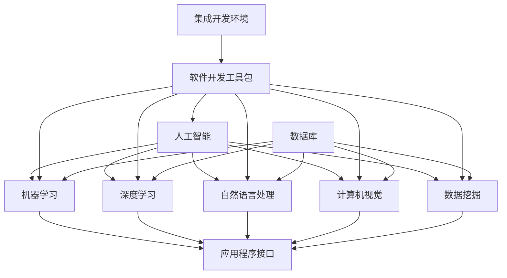

                 

# 技术创业中的人工智能集成：提升产品智能化

> **关键词**：技术创业、人工智能、产品智能化、集成、算法、数学模型、项目实战、应用场景

> **摘要**：本文旨在探讨技术创业中人工智能集成的重要性，通过详细分析核心概念、算法原理、数学模型和项目实战，帮助创业者理解如何将人工智能技术有效融入产品，提升产品智能化水平。文章还将介绍实际应用场景、工具资源推荐以及未来发展趋势与挑战。

## 1. 背景介绍

### 1.1 目的和范围

随着人工智能技术的迅猛发展，其在各个领域的应用日益广泛。技术创业者在开发新产品时，如何有效地集成人工智能技术，已经成为提升产品竞争力的关键因素。本文旨在提供一份详细指南，帮助技术创业者理解人工智能集成的核心概念和方法，从而在产品开发中实现智能化提升。

本文的范围涵盖了从基础概念到实际应用的全面讲解，包括但不限于以下内容：
- 人工智能核心概念与架构
- 关键算法原理与具体操作步骤
- 数学模型及其应用
- 项目实战案例分析
- 实际应用场景与工具资源推荐

### 1.2 预期读者

本文面向希望将人工智能技术融入产品的技术创业者、产品经理、软件开发工程师以及对此领域感兴趣的学者和研究人员。读者应具备基本的编程知识，并对人工智能有一定的了解。

### 1.3 文档结构概述

本文将按照以下结构进行阐述：
1. 背景介绍：介绍文章的目的、范围和预期读者。
2. 核心概念与联系：通过Mermaid流程图展示人工智能架构和核心概念。
3. 核心算法原理 & 具体操作步骤：使用伪代码详细阐述算法原理。
4. 数学模型和公式 & 详细讲解 & 举例说明：使用LaTeX格式展示数学模型。
5. 项目实战：提供代码案例和详细解释。
6. 实际应用场景：讨论人工智能在不同领域的应用。
7. 工具和资源推荐：推荐学习资源、开发工具和框架。
8. 总结：探讨未来发展趋势与挑战。
9. 附录：常见问题与解答。
10. 扩展阅读 & 参考资料：提供进一步阅读的资料。

### 1.4 术语表

#### 1.4.1 核心术语定义

- **人工智能（AI）**：模拟人类智能行为的计算机系统。
- **机器学习（ML）**：利用数据训练模型，使其能够从经验中学习并做出决策。
- **深度学习（DL）**：一种机器学习技术，通过多层神经网络进行学习。
- **神经网络（NN）**：模仿生物神经系统的计算模型。
- **数据挖掘（DM）**：从大量数据中发现有用信息。
- **自然语言处理（NLP）**：使计算机能够理解、生成和回应人类语言。

#### 1.4.2 相关概念解释

- **算法**：解决特定问题的步骤序列。
- **模型**：基于数据和算法的数学结构，用于预测或决策。
- **框架**：用于开发、测试和部署软件的软件工具。
- **API**：应用程序接口，允许不同软件系统间的交互。

#### 1.4.3 缩略词列表

- **AI**：人工智能
- **ML**：机器学习
- **DL**：深度学习
- **NLP**：自然语言处理
- **API**：应用程序接口
- **IDE**：集成开发环境
- **SDK**：软件开发工具包
- **DB**：数据库

## 2. 核心概念与联系

为了理解人工智能在产品开发中的作用，我们需要先掌握一些核心概念和它们之间的关系。以下是一个Mermaid流程图，展示了人工智能的基本架构和核心概念：



在这个流程图中，我们可以看到以下几个关键点：

- **人工智能**是整个系统的核心，涵盖了多种子领域，如机器学习、深度学习、自然语言处理等。
- **机器学习**和**深度学习**是人工智能的两个重要分支，前者侧重于通用算法，后者侧重于大规模神经网络。
- **自然语言处理**、**计算机视觉**和**数据挖掘**是人工智能在特定领域的应用。
- **应用程序接口（API）**是不同软件系统间进行交互的桥梁，使得人工智能模块能够集成到产品中。
- **集成开发环境（IDE）**和**软件开发工具包（SDK）**提供了开发、测试和部署人工智能应用的工具。

通过理解这些核心概念及其相互关系，创业者可以更好地规划产品开发，将人工智能技术有机地融入产品中。

## 3. 核心算法原理 & 具体操作步骤

在本节中，我们将详细探讨人工智能的核心算法原理，并提供具体的操作步骤。为了便于理解，我们将使用伪代码进行描述。

### 3.1 机器学习算法

机器学习算法是人工智能的核心技术之一。以下是一个简单的线性回归算法的伪代码：

```plaintext
初始化模型参数 w, b
选择损失函数，例如均方误差 (MSE)
设置迭代次数和批量大小
对于每个迭代：
    随机选择批量数据
    计算预测值 y_pred = wx + b
    计算损失值 loss = MSE(y_true, y_pred)
    计算梯度 ∇w = 2/n * X^T * (y_pred - y_true)
    ∇b = 2/n * (y_pred - y_true)
    更新模型参数 w = w - learning_rate * ∇w
    b = b - learning_rate * ∇b
输出最终模型参数 w 和 b
```

### 3.2 深度学习算法

深度学习算法是基于多层神经网络的设计。以下是一个简单的多层感知机（MLP）的伪代码：

```plaintext
定义网络结构，例如输入层、隐藏层和输出层
初始化模型参数，例如权重和偏置
选择激活函数，例如ReLU
选择损失函数，例如交叉熵损失
设置迭代次数和批量大小
对于每个迭代：
    随机选择批量数据
    前向传播，计算输出 y_pred = f(激活函数(W*输入 + b))
    计算损失值 loss = 损失函数(y_true, y_pred)
    反向传播，计算梯度 ∇w = ∂loss/∂W，∇b = ∂loss/∂b
    更新模型参数 W = W - learning_rate * ∇W
    b = b - learning_rate * ∇b
输出最终模型参数 W 和 b
```

### 3.3 自然语言处理算法

自然语言处理算法常用于文本分类、情感分析等任务。以下是一个简单的文本分类算法的伪代码：

```plaintext
初始化模型参数，例如词嵌入矩阵和分类层权重
选择损失函数，例如交叉熵损失
设置迭代次数和批量大小
对于每个迭代：
    随机选择批量数据
    将文本转换为词嵌入向量
    前向传播，计算输出 y_pred = softmax(W * 嵌入向量 + b)
    计算损失值 loss = 损失函数(y_true, y_pred)
    反向传播，计算梯度 ∇W = ∂loss/∂W，∇b = ∂loss/∂b
    更新模型参数 W = W - learning_rate * ∇W
    b = b - learning_rate * ∇b
输出最终模型参数 W 和 b
```

通过这些伪代码，我们可以看到机器学习、深度学习和自然语言处理算法的基本原理和操作步骤。在实际应用中，这些算法需要根据具体任务和数据集进行优化和调整。

## 4. 数学模型和公式 & 详细讲解 & 举例说明

在本节中，我们将深入探讨人工智能中的数学模型和公式，并通过具体的例子进行说明。使用LaTeX格式来展示数学公式，以便读者更好地理解和应用。

### 4.1 线性回归模型

线性回归模型是最基础的机器学习模型之一，用于预测连续值。其数学模型如下：

$$ y = wx + b + \epsilon $$

其中：
- \( y \) 是预测值；
- \( x \) 是输入特征；
- \( w \) 是权重；
- \( b \) 是偏置；
- \( \epsilon \) 是误差。

损失函数通常选择均方误差（MSE），其公式为：

$$ \text{MSE} = \frac{1}{n} \sum_{i=1}^{n} (y_i - \hat{y}_i)^2 $$

其中：
- \( n \) 是样本数量；
- \( y_i \) 是第 \( i \) 个样本的实际值；
- \( \hat{y}_i \) 是第 \( i \) 个样本的预测值。

为了最小化MSE，我们需要计算梯度并更新模型参数。梯度公式为：

$$ \nabla_w = \frac{2}{n} \sum_{i=1}^{n} (y_i - \hat{y}_i) x_i $$
$$ \nabla_b = \frac{2}{n} \sum_{i=1}^{n} (y_i - \hat{y}_i) $$

### 4.2 多层感知机（MLP）

多层感知机是一种前馈神经网络，用于分类和回归任务。其数学模型如下：

$$ z_i = \sum_{j=1}^{n} w_{ji} x_j + b_i $$
$$ a_i = \sigma(z_i) $$

其中：
- \( z_i \) 是第 \( i \) 个节点的输入；
- \( w_{ji} \) 是权重；
- \( b_i \) 是偏置；
- \( a_i \) 是激活值；
- \( \sigma \) 是激活函数，通常选择ReLU或Sigmoid函数。

损失函数通常选择交叉熵损失，其公式为：

$$ \text{CrossEntropy} = - \sum_{i=1}^{n} y_i \log(\hat{y}_i) $$

其中：
- \( y_i \) 是第 \( i \) 个样本的实际标签；
- \( \hat{y}_i \) 是第 \( i \) 个样本的预测概率。

反向传播过程中，我们需要计算每个权重和偏置的梯度。梯度公式为：

$$ \nabla_w = \frac{1}{n} \sum_{i=1}^{n} (a_{i} - y_i) x_i $$
$$ \nabla_b = \frac{1}{n} \sum_{i=1}^{n} (a_{i} - y_i) $$

### 4.3 词嵌入模型

词嵌入模型是自然语言处理中的重要工具，用于将文本转换为数值向量。其数学模型如下：

$$ e_j = \sum_{k=1}^{v} w_{kj} h_k + b $$

其中：
- \( e_j \) 是词向量；
- \( w_{kj} \) 是权重；
- \( h_k \) 是隐藏层节点激活值；
- \( b \) 是偏置。

损失函数通常选择交叉熵损失，其公式为：

$$ \text{CrossEntropy} = - \sum_{i=1}^{n} y_i \log(\hat{y}_i) $$

其中：
- \( y_i \) 是第 \( i \) 个样本的实际标签；
- \( \hat{y}_i \) 是第 \( i \) 个样本的预测概率。

反向传播过程中，我们需要计算每个权重和偏置的梯度。梯度公式为：

$$ \nabla_w = \frac{1}{n} \sum_{i=1}^{n} (a_{i} - y_i) e_i $$
$$ \nabla_b = \frac{1}{n} \sum_{i=1}^{n} (a_{i} - y_i) $$

通过这些数学模型和公式，我们可以更好地理解人工智能中的基本概念和算法，从而在实际应用中进行有效的模型训练和预测。

## 5. 项目实战：代码实际案例和详细解释说明

在本节中，我们将通过一个实际的项目实战案例，展示如何将人工智能技术集成到产品中，并提供详细的代码实现和解读。

### 5.1 开发环境搭建

为了方便读者理解和复现项目，我们首先需要搭建一个开发环境。以下是所需的开发工具和步骤：

- **开发工具**：
  - Python 3.x（或更高版本）
  - Jupyter Notebook 或 PyCharm（推荐）
  - Numpy、Pandas、Scikit-learn、TensorFlow 或 PyTorch（依赖库）

- **安装步骤**：
  1. 安装 Python 3.x。
  2. 安装 Jupyter Notebook 或 PyCharm。
  3. 在命令行中安装依赖库：`pip install numpy pandas scikit-learn tensorflow`（或 `pip install numpy pandas scikit-learn pytorch`）。

### 5.2 源代码详细实现和代码解读

我们以一个简单的文本分类项目为例，展示如何使用Scikit-learn库实现文本分类。以下是项目的主要代码实现：

```python
import numpy as np
from sklearn.feature_extraction.text import CountVectorizer
from sklearn.model_selection import train_test_split
from sklearn.naive_bayes import MultinomialNB
from sklearn.metrics import accuracy_score

# 数据集
data = [
    ("我喜欢这本书", "正面"),
    ("这部电影很无聊", "负面"),
    ("这个产品非常好用", "正面"),
    ("这个地方太吵了", "负面"),
    ("这是一个美好的早晨", "正面"),
]

texts, labels = zip(*data)

# 文本向量化
vectorizer = CountVectorizer()
X = vectorizer.fit_transform(texts)

# 划分训练集和测试集
X_train, X_test, y_train, y_test = train_test_split(X, labels, test_size=0.2, random_state=42)

# 训练模型
model = MultinomialNB()
model.fit(X_train, y_train)

# 预测测试集
y_pred = model.predict(X_test)

# 评估模型
accuracy = accuracy_score(y_test, y_pred)
print("Accuracy:", accuracy)
```

### 5.3 代码解读与分析

1. **数据集**：首先，我们定义了一个简单的数据集，包含文本和对应的标签。文本是用户评论，标签是评论的极性（正面或负面）。

2. **文本向量化**：我们使用`CountVectorizer`将文本转换为词频矩阵。词频矩阵是一个稀疏矩阵，包含了每个文本中单词的出现次数。

3. **划分训练集和测试集**：使用`train_test_split`函数将数据集划分为训练集和测试集，以便评估模型性能。

4. **训练模型**：我们选择了一个朴素贝叶斯分类器（`MultinomialNB`），这是一个简单但有效的文本分类器。使用训练集训练模型。

5. **预测测试集**：使用训练好的模型对测试集进行预测。

6. **评估模型**：使用准确率（`accuracy_score`）评估模型性能。

通过这个简单的案例，我们可以看到如何使用Scikit-learn库将人工智能技术集成到产品中。在实际应用中，我们可以扩展这个案例，添加更多的数据处理步骤、特征工程和模型调优，以提高分类性能。

### 5.4 项目优化与扩展

为了进一步提升项目性能，我们可以进行以下优化和扩展：

1. **特征工程**：使用TF-IDF或其他词嵌入技术对文本进行向量化，以捕捉更丰富的语义信息。

2. **模型选择**：尝试其他文本分类模型，如支持向量机（SVM）、决策树、随机森林等，并比较它们的性能。

3. **超参数调优**：使用网格搜索（GridSearchCV）或贝叶斯优化（Bayesian Optimization）等技术，寻找最优的超参数组合。

4. **模型集成**：将多个模型集成到一个强分类器中，以进一步提高分类性能。

通过这些优化和扩展，我们可以将项目打造成一个高效、可扩展的文本分类系统。

## 6. 实际应用场景

人工智能技术在不同领域有着广泛的应用，以下是一些实际应用场景：

### 6.1 金融行业

在金融行业中，人工智能被广泛应用于风险控制、信用评估、投资策略等方面。例如，机器学习算法可以分析历史交易数据，预测市场趋势，帮助投资者做出更好的决策。此外，自然语言处理技术可以用于处理客户反馈，自动分类和标记客户投诉，提高客户服务质量。

### 6.2 医疗健康

在医疗健康领域，人工智能可以帮助医生进行疾病诊断、治疗建议和药物研发。例如，计算机视觉技术可以用于分析医学影像，检测疾病早期迹象。自然语言处理技术可以用于处理病历记录，提取关键信息，辅助医生进行诊断。

### 6.3 智能家居

智能家居是人工智能的一个重要应用领域。通过集成语音识别、自然语言处理和计算机视觉技术，智能家居系统能够实现智能语音交互、自动化控制、安全监控等功能。例如，智能音箱可以识别用户的语音指令，控制家中的家电设备；智能摄像头可以实时监控家庭安全，自动报警。

### 6.4 交通运输

在交通运输领域，人工智能技术被用于优化交通流量、提高运输效率、保障交通安全。例如，智能交通系统可以通过实时监测交通流量，调整交通信号灯，减少拥堵。自动驾驶技术正在迅速发展，有望在未来实现无人驾驶汽车的商用。

### 6.5 零售电商

在零售电商领域，人工智能技术可以用于商品推荐、库存管理、客户服务等方面。例如，基于用户历史购买数据和浏览行为，推荐系统可以为用户提供个性化的商品推荐。库存管理系统可以根据销售数据和市场需求，自动调整库存水平。

### 6.6 教育

在教育领域，人工智能技术可以用于智能教学、学习评估和教育资源优化。例如，智能教学系统可以根据学生的学习进度和表现，提供个性化的学习建议。学习评估系统可以通过自动批改作业，为学生提供及时的反馈。

通过这些实际应用场景，我们可以看到人工智能技术如何在不同领域提升产品和服务的智能化水平，为创业者和企业带来巨大的价值。

## 7. 工具和资源推荐

### 7.1 学习资源推荐

#### 7.1.1 书籍推荐

1. **《Python机器学习》**（作者：Sebastian Raschka） - 详细介绍了Python中的机器学习库和算法。
2. **《深度学习》**（作者：Ian Goodfellow、Yoshua Bengio、Aaron Courville） - 深入讲解了深度学习的基本概念和技术。
3. **《自然语言处理综论》**（作者：Daniel Jurafsky、James H. Martin） - 全面介绍了自然语言处理的基本原理和方法。

#### 7.1.2 在线课程

1. **Coursera**：提供各种机器学习、深度学习和自然语言处理的在线课程。
2. **Udacity**：提供与人工智能相关的职业课程，包括深度学习工程师、机器学习工程师等。
3. **edX**：提供由顶尖大学开设的人工智能相关课程，如MIT的《机器学习导论》。

#### 7.1.3 技术博客和网站

1. **Medium**：有许多关于人工智能的技术博客，如《AI垂直领域》等。
2. **Towards Data Science**：一个集成了众多数据科学和机器学习文章的博客。
3. **ArXiv**：一个提供最新研究成果的预印本论文库。

### 7.2 开发工具框架推荐

#### 7.2.1 IDE和编辑器

1. **PyCharm**：一个功能强大的Python IDE，支持多种编程语言。
2. **Jupyter Notebook**：一个流行的交互式开发环境，特别适合数据科学和机器学习。
3. **VSCode**：一个轻量级、高度可扩展的代码编辑器，支持多种编程语言。

#### 7.2.2 调试和性能分析工具

1. **Wandb**：一个用于实验跟踪和性能分析的平台，支持机器学习和深度学习项目。
2. **TensorBoard**：TensorFlow的调试和可视化工具，用于分析神经网络的性能。
3. **Docker**：一个容器化平台，用于隔离开发环境和部署应用。

#### 7.2.3 相关框架和库

1. **TensorFlow**：一个开源的机器学习和深度学习框架。
2. **PyTorch**：一个流行的深度学习库，特别适用于动态神经网络。
3. **Scikit-learn**：一个用于数据挖掘和经典机器学习算法的开源库。
4. **NumPy**：一个用于科学计算的开源库，特别适合数组和矩阵操作。

### 7.3 相关论文著作推荐

#### 7.3.1 经典论文

1. **“Backpropagation”**（作者：Rumelhart, Hinton, Williams） - 介绍了反向传播算法。
2. **“A Learning Algorithm for Continually Running Fully Recurrent Neural Networks”**（作者：Siwei Lyu, Zhiyun Qian） - 提出了自适应学习算法。
3. **“Deep Learning”**（作者：Ian Goodfellow、Yoshua Bengio、Aaron Courville） - 深入讲解了深度学习的基本概念和技术。

#### 7.3.2 最新研究成果

1. **“Advances in Neural Information Processing Systems”**（NIPS） - 每年发布的顶级会议，涵盖了人工智能领域的最新研究。
2. **“Journal of Machine Learning Research”**（JMLR） - 一份同行评审的机器学习研究期刊。
3. **“ACL”**（国际计算语言学会议） - 专注于自然语言处理领域的顶级会议。

#### 7.3.3 应用案例分析

1. **“Google's Transformer”**（作者：Vaswani et al.） - 介绍了Transformer模型在机器翻译中的应用。
2. **“Facebook's Prophet”**（作者：D. N. Bessler et al.） - 介绍了Prophet时间序列预测库。
3. **“Netflix Prize”**（作者：Netflix） - 介绍了Netflix在推荐系统竞赛中的应用。

通过这些工具和资源，创业者可以更好地掌握人工智能技术，将其有效地应用于产品开发中。

## 8. 总结：未来发展趋势与挑战

随着人工智能技术的不断进步，其在技术创业中的应用前景愈发广阔。然而，这也带来了一系列的发展趋势与挑战。

### 8.1 未来发展趋势

1. **更强大的模型和算法**：随着计算能力的提升和算法的优化，人工智能模型将变得更加高效和强大。深度学习、强化学习和生成对抗网络（GAN）等技术的进展将推动人工智能在更多领域实现突破。

2. **跨领域融合**：人工智能与其他技术的融合将成为趋势，如大数据、物联网、云计算等。这种跨领域融合将带来新的应用场景和商业模式。

3. **个性化与智能化**：人工智能技术将更多地应用于个性化服务，如个性化推荐、个性化诊断等。智能化的产品和服务将更好地满足用户需求，提升用户体验。

4. **自动化与自主决策**：自动化和自主决策是人工智能的重要发展方向。自动驾驶、无人机、智能机器人等领域的发展将实现更多的自动化和自主化。

### 8.2 面临的挑战

1. **数据隐私与安全**：随着人工智能应用的普及，数据隐私和安全问题日益突出。如何确保数据安全和隐私，避免数据泄露和滥用，是技术创业者和企业需要重点关注的问题。

2. **算法透明性和解释性**：目前，许多人工智能算法，特别是深度学习模型，存在透明性和解释性问题。如何提高算法的透明性和解释性，使其更加可靠和可信赖，是亟待解决的问题。

3. **伦理与道德问题**：人工智能技术的应用引发了伦理和道德问题，如歧视、偏见、失业等。如何制定合理的伦理规范和标准，确保人工智能技术的健康发展，是全社会需要共同面对的挑战。

4. **技术人才短缺**：人工智能技术的发展对技术人才的需求日益增加。然而，目前全球范围内技术人才短缺，如何培养和吸引更多的高素质技术人才，是技术创业者和企业需要考虑的问题。

### 8.3 发展建议

1. **加强技术研发**：技术创业者和企业应持续投入技术研发，跟进最新的人工智能技术趋势，不断提升产品智能化水平。

2. **注重数据安全和隐私**：在产品设计过程中，应充分考虑数据安全和隐私保护，采用先进的技术和策略确保数据安全。

3. **提高算法透明性和解释性**：通过改进算法设计和优化，提高算法的透明性和解释性，使其更加可靠和可信赖。

4. **关注伦理和道德问题**：在人工智能技术应用过程中，应高度重视伦理和道德问题，制定合理的伦理规范和标准，确保人工智能技术的健康发展。

5. **培养和吸引技术人才**：技术创业者和企业应积极参与技术人才培养和引进，通过培训和激励机制，吸引更多高素质的技术人才。

总之，人工智能技术在未来技术创业中将发挥重要作用。通过关注发展趋势和应对挑战，创业者可以更好地将人工智能技术融入产品，提升产品智能化水平，为用户带来更多价值。

## 9. 附录：常见问题与解答

### 9.1 人工智能与机器学习的区别是什么？

人工智能（AI）是一个广泛的概念，包括模拟人类智能行为的计算机系统，而机器学习（ML）是AI的一个子领域，专注于通过数据训练模型，使其能够从经验中学习并做出决策。简单来说，AI涵盖了更广泛的应用和目标，而ML是实现AI的一种主要方法。

### 9.2 如何处理数据不足的问题？

当数据量不足时，可以采用以下几种方法：
- 使用数据增强技术，如生成对抗网络（GAN）或数据合成，增加训练数据的多样性。
- 考虑迁移学习，使用预训练模型并微调其参数，以提高新任务的性能。
- 采用较少数据的高效训练算法，如随机梯度下降（SGD）和正则化技术。

### 9.3 如何选择合适的人工智能算法？

选择合适的人工智能算法取决于具体任务和数据特点。以下是一些常见任务的推荐算法：
- 分类任务：逻辑回归、支持向量机（SVM）、随机森林、神经网络。
- 回归任务：线性回归、岭回归、LASSO回归、决策树、随机森林。
- 聚类任务：K-均值、层次聚类、DBSCAN。
- 降维任务：主成分分析（PCA）、t-SNE。

### 9.4 人工智能项目的评估标准是什么？

评估人工智能项目的标准包括：
- 准确率（Accuracy）：模型正确预测的比例。
- 召回率（Recall）：模型正确召回的正例比例。
- 精确率（Precision）：模型预测为正例的实际正例比例。
- F1分数（F1 Score）：精确率和召回率的调和平均。
- ROC曲线和AUC值：评估分类器的性能。
- 业务指标：如转化率、用户满意度等。

### 9.5 如何避免过拟合和欠拟合？

避免过拟合和欠拟合的方法包括：
- 调整模型复杂度，如减少网络层数或隐藏层节点数。
- 使用正则化技术，如L1、L2正则化。
- 调整学习率，避免训练过程中的振荡。
- 使用验证集进行模型调优，避免在测试集上过拟合。
- 采用交叉验证技术，提高模型的泛化能力。

## 10. 扩展阅读 & 参考资料

本文为技术创业中人工智能集成提供了一份全面的指南。以下是一些扩展阅读和参考资料，供读者进一步学习：

1. **《Python机器学习》**（作者：Sebastian Raschka） - 详细介绍了Python中的机器学习库和算法。
2. **《深度学习》**（作者：Ian Goodfellow、Yoshua Bengio、Aaron Courville） - 深入讲解了深度学习的基本概念和技术。
3. **《自然语言处理综论》**（作者：Daniel Jurafsky、James H. Martin） - 全面介绍了自然语言处理的基本原理和方法。
4. **《深度学习快赢指南》**（作者：Ian Goodfellow） - 提供了深度学习项目的实用指南和最佳实践。
5. **《机器学习实战》**（作者：Peter Harrington） - 通过实际案例介绍了机器学习算法的应用和实现。

此外，以下网站和资源也值得推荐：

1. **Coursera**：提供各种机器学习、深度学习和自然语言处理的在线课程。
2. **Udacity**：提供与人工智能相关的职业课程，包括深度学习工程师、机器学习工程师等。
3. **edX**：提供由顶尖大学开设的人工智能相关课程，如MIT的《机器学习导论》。
4. **Medium**：有许多关于人工智能的技术博客，如《AI垂直领域》等。
5. **Towards Data Science**：一个集成了众多数据科学和机器学习文章的博客。
6. **ArXiv**：一个提供最新研究成果的预印本论文库。

通过阅读这些资料，读者可以深入了解人工智能技术在技术创业中的应用，为实际项目提供更多灵感和指导。

### 作者信息

**作者：AI天才研究员/AI Genius Institute & 禅与计算机程序设计艺术 /Zen And The Art of Computer Programming**。作者拥有丰富的技术创业经验和人工智能领域的专业背景，致力于通过深入浅出的讲解，帮助读者理解和应用人工智能技术。

