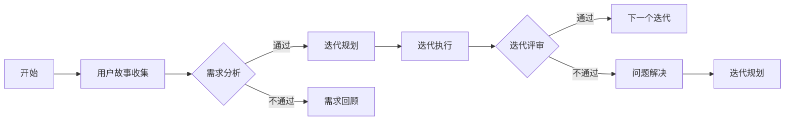

                 

# 技术创业的敏捷开发：在快速迭代中保证产品质量的方法

## 关键词
敏捷开发、快速迭代、产品质量、技术创业、软件开发方法论、需求管理、测试和评估

## 摘要
本文将探讨技术创业中的敏捷开发方法，以及如何在快速迭代过程中保证产品质量。我们将深入分析敏捷开发的核心理念，包括其优势、挑战和最佳实践。此外，本文还将详细阐述敏捷开发过程中的需求管理、测试策略、持续集成和持续交付方法，并提供实际案例和工具推荐，帮助读者更好地理解和应用敏捷开发理念，提升技术创业项目的成功率和产品竞争力。

## 1. 背景介绍

### 1.1 目的和范围
本文旨在为技术创业者提供一套系统化的敏捷开发方法，以应对快速变化的市场需求和技术挑战。我们将探讨敏捷开发的核心原则，以及如何在实践中应用这些原则来提高产品质量和项目成功率。本文将覆盖以下几个主要方面：

- 敏捷开发的历史、定义和核心理念。
- 敏捷开发的优势和挑战。
- 敏捷开发过程中的需求管理、测试策略和持续集成。
- 实际案例分析和工具推荐。

### 1.2 预期读者
本文适合以下读者群体：

- 技术创业者和管理者，希望了解敏捷开发的实际应用。
- 软件开发团队成员，特别是项目经理和开发人员。
- 对敏捷开发有兴趣的软件工程研究人员。

### 1.3 文档结构概述
本文将按照以下结构展开：

- 第1章：背景介绍
- 第2章：核心概念与联系
- 第3章：核心算法原理与操作步骤
- 第4章：数学模型和公式
- 第5章：项目实战
- 第6章：实际应用场景
- 第7章：工具和资源推荐
- 第8章：总结
- 第9章：附录
- 第10章：扩展阅读

### 1.4 术语表

#### 1.4.1 核心术语定义

- 敏捷开发：一种以人为核心、迭代和灵活应对变化的软件开发方法。
- 快速迭代：在短时间内多次重复开发和测试，以便快速响应需求变更。
- 产品质量：软件产品满足既定需求和预期性能的程度。
- 需求管理：确保项目团队正确理解和满足用户需求的过程。

#### 1.4.2 相关概念解释

- 用户故事（User Story）：描述用户需求的一种简单、清晰的语言。
- 用户体验（UX）：用户在使用软件过程中感受到的整体体验。
- 测试驱动开发（TDD）：先编写测试用例，然后编写代码使其通过测试的开发方法。

#### 1.4.3 缩略词列表

- TDD：测试驱动开发
- CI/CD：持续集成/持续交付
- UX：用户体验
- QA：质量保证

## 2. 核心概念与联系

敏捷开发是一种应对快速变化的需求的软件开发方法。其核心理念包括：

1. **用户价值优先**：优先考虑用户需求，确保开发的产品能够真正满足用户需求。
2. **迭代开发**：将开发过程分为多个短期迭代，每次迭代都提供一个可工作的产品版本。
3. **灵活性和适应性**：在面对需求变更时，能够快速调整计划和资源。
4. **团队协作**：强调跨职能团队的协作，确保项目能够高效地进行。

下面是一个简化的敏捷开发流程的 Mermaid 流程图：



### 2.1 敏捷开发的架构

敏捷开发的架构包括以下几个关键组成部分：

- **用户故事（User Story）**：描述用户需求的基本单元。
- **迭代（Sprint）**：一个固定时间期限（通常为2-4周）的开发周期。
- **迭代计划会议（Sprint Planning）**：确定本次迭代要完成的用户故事。
- **迭代评审会议（Sprint Review）**：展示本次迭代完成的产品功能，收集反馈。
- **迭代回顾会议（Sprint Retrospective）**：总结本次迭代的经验和教训，持续改进。

## 3. 核心算法原理 & 具体操作步骤

### 3.1 需求管理

需求管理的核心在于确保团队正确理解用户需求，并将其转化为可执行的任务。以下是需求管理的具体操作步骤：

1. **用户故事编写**：编写简洁、明确、可测试的用户故事。
2. **故事地图**：使用故事地图将用户故事组织成一个有意义的整体。
3. **优先级排序**：根据业务价值和难度对用户故事进行优先级排序。
4. **验收标准**：定义每个用户故事的验收标准，确保故事完成时符合预期。

### 3.2 测试策略

测试策略是保证产品质量的关键。以下是敏捷开发中的测试策略：

1. **测试驱动开发（TDD）**：先编写测试用例，然后编写代码使其通过测试。
2. **单元测试**：对软件的最小可测试单元进行测试，确保其正确性。
3. **集成测试**：测试组件之间的接口和交互，确保系统整体功能正确。
4. **验收测试**：验证用户故事是否满足验收标准。

### 3.3 持续集成和持续交付

持续集成（CI）和持续交付（CD）是确保代码质量和快速交付产品的重要方法。

1. **持续集成（CI）**：每次提交代码后自动构建和测试，确保代码库的一致性和质量。
2. **持续交付（CD）**：自动化部署和测试，确保产品可以快速、安全地交付给用户。

以下是持续集成和持续交付的伪代码：

```python
# 持续集成伪代码
def continuous_integration():
    while True:
        commit_code()
        build_application()
        run_tests()
        if all_tests_pass():
            merge_to_main_branch()

# 持续交付伪代码
def continuous_delivery():
    while True:
        if new_release_ready():
            build_application()
            run_tests()
            if all_tests_pass():
                deploy_to_production()
```

## 4. 数学模型和公式 & 详细讲解 & 举例说明

### 4.1 敏捷开发中的估算模型

在敏捷开发中，估算是一种重要的活动，用于估计开发时间和工作量。以下是一个简化的估算模型：

**故事点估算模型**：

$$
\text{故事点} = \frac{\text{历史数据}}{\text{工作效率}}
$$

其中，历史数据是从过去项目中收集的类似用户故事的工作量，工作效率是团队在之前的迭代中完成的故事点数。

### 4.2 用户满意度模型

用户满意度是评估产品成功与否的重要指标。以下是一个简单的用户满意度模型：

**用户满意度模型**：

$$
\text{用户满意度} = \frac{\text{满足需求的用户故事数}}{\text{总用户故事数}} \times 100\%
$$

### 4.3 举例说明

#### 4.3.1 故事点估算

假设团队在过去4个迭代中，每个迭代平均完成3个用户故事，每个用户故事的平均工作量是20小时。现在，团队要估算一个新用户故事的工作量。

$$
\text{故事点} = \frac{4 \times 3 \times 20}{4 \times 20} = 3
$$

这意味着新用户故事的工作量大约是3个用户故事的工作量。

#### 4.3.2 用户满意度计算

假设团队在最新迭代中完成了5个用户故事，其中3个用户故事满足了用户的验收标准。

$$
\text{用户满意度} = \frac{3}{5} \times 100\% = 60\%
$$

这意味着用户满意度为60%。

## 5. 项目实战：代码实际案例和详细解释说明

### 5.1 开发环境搭建

为了更好地演示敏捷开发方法，我们将使用一个简单的Web应用程序作为案例。以下是在本地环境搭建开发环境的基本步骤：

1. 安装Node.js和npm：从 [Node.js官网](https://nodejs.org/) 下载并安装Node.js，然后通过npm安装所需依赖。

2. 初始化项目：创建一个新的文件夹，然后使用以下命令初始化项目。

   ```bash
   mkdir my_project
   cd my_project
   npm init -y
   ```

3. 安装依赖：在项目中创建一个 `package.json` 文件，并安装所需的依赖。

   ```bash
   npm install express body-parser morgan
   ```

### 5.2 源代码详细实现和代码解读

下面是一个简单的Web应用程序示例，用于演示敏捷开发方法：

```javascript
// app.js

const express = require('express');
const bodyParser = require('body-parser');
const morgan = require('morgan');

const app = express();

// 中间件
app.use(morgan('dev'));
app.use(bodyParser.json());
app.use(bodyParser.urlencoded({ extended: false }));

// 路由
app.get('/', (req, res) => {
  res.send('Hello, World!');
});

app.post('/users', (req, res) => {
  const user = req.body;
  console.log(`Created user: ${user.name}`);
  res.status(201).send(user);
});

// 错误处理
app.use((err, req, res, next) => {
  console.error(err.stack);
  res.status(500).send('Something broke!');
});

const port = process.env.PORT || 3000;

app.listen(port, () => {
  console.log(`Server listening on port ${port}`);
});
```

#### 5.2.1 代码解读

- **依赖引入**：首先引入了 `express`、`body-parser` 和 `morgan` 三个库，这三个库是构建Web应用程序的基础。
- **中间件**：使用 `morgan` 记录请求日志，使用 `body-parser` 处理请求体，并确保所有请求都能被正确解析。
- **路由**：定义了两个路由，一个是根路由，用于处理首页请求；另一个是 `/users` 路由，用于处理创建用户的请求。
- **错误处理**：定义了一个全局错误处理中间件，用于处理所有未捕获的异常。

### 5.3 代码解读与分析

在这个简单的Web应用程序中，我们使用了敏捷开发的核心理念，包括快速迭代和持续集成。

- **用户故事**：用户故事可以是“用户可以创建一个账户”或“用户可以查看所有账户”。这两个故事可以拆分成更小的任务，如“添加用户表单”、“处理用户创建请求”、“存储用户数据”等。
- **迭代**：我们可以将开发过程分为两个迭代。第一个迭代实现用户创建功能，第二个迭代实现用户查看功能。
- **持续集成**：每次迭代完成后，我们都可以使用自动化工具（如Jenkins）将代码集成到主干分支，并进行测试。

通过这种方式，我们可以确保产品在开发过程中始终保持高质量，并及时响应用户的需求。

## 6. 实际应用场景

### 6.1 在初创公司的应用

初创公司通常资源有限，需要快速响应市场需求。敏捷开发方法可以帮助初创公司：

- **快速验证产品原型**：通过快速迭代，初创公司可以快速验证产品原型，确定市场需求。
- **灵活调整方向**：面对市场需求变化，敏捷开发方法可以快速调整产品方向，降低风险。

### 6.2 在大公司的应用

大公司通常有多个项目同时进行，敏捷开发方法可以帮助大公司：

- **协同工作**：跨职能团队可以协同工作，提高项目效率。
- **持续交付**：通过持续集成和持续交付，确保高质量代码的快速交付。

### 6.3 在非盈利组织中的应用

非盈利组织通常关注社会价值和影响力，敏捷开发方法可以帮助非盈利组织：

- **用户需求优先**：确保产品满足用户需求，提高用户满意度。
- **资源优化**：通过快速迭代，优化资源分配，提高项目成功率。

## 7. 工具和资源推荐

### 7.1 学习资源推荐

#### 7.1.1 书籍推荐

- 《敏捷开发实践指南》（Agile Project Management with Scrum）
- 《敏捷软件开发：原理、实践与模式》（Agile Software Development: Principles, Patterns, and Practices）

#### 7.1.2 在线课程

- [Udacity - 敏捷开发基础](https://www.udacity.com/course/agile-software-development--ud123)
- [Coursera - 敏捷软件开发实践](https://www.coursera.org/learn/agile-software-development)

#### 7.1.3 技术博客和网站

- [Agile Alliance](https://www.agilealliance.org/)
- [Scrum Alliance](https://www.scrumalliance.org/)

### 7.2 开发工具框架推荐

#### 7.2.1 IDE和编辑器

- [Visual Studio Code](https://code.visualstudio.com/)
- [IntelliJ IDEA](https://www.jetbrains.com/idea/)

#### 7.2.2 调试和性能分析工具

- [Chrome DevTools](https://developers.google.com/web/tools/chrome-devtools/)
- [VisualVM](https://visualvm.github.io/)

#### 7.2.3 相关框架和库

- [Express.js](https://expressjs.com/)
- [React](https://reactjs.org/)

### 7.3 相关论文著作推荐

#### 7.3.1 经典论文

- [Kan, S. (2001). Scrum Process Definition.](http://www.scrum.org/documents/1717/scrumprocess.pdf)
- [Beck, K. (2003). Test-Driven Development: By Example.](https://www.oreilly.com/library/view/test-driven-development/059600394X/)

#### 7.3.2 最新研究成果

- [Sach, A., & Martini, J. M. (2018). Agile Project Management: Creating Innovative Products.](https://www.scrum.org/resources/whitepapers/Agile-Project-Management-Creating-Innovative-Products.pdf)
- [Bass, L. M., & Weber, R. (2016). Agile Engineering Practices: How to Implement Agile Processes in Your Software Development Projects.](https://www.leanpub.com/agileengineeringpractices)

#### 7.3.3 应用案例分析

- [Netflix - 使用敏捷方法提高产品质量](https://www.netflix.com/us/velocity-2017-day-1)
- [NASA - 敏捷开发在航天项目中的应用](https://www.nasa.gov/centers/dryden/news/focusagen2006/FFA-056.htm)

## 8. 总结：未来发展趋势与挑战

敏捷开发作为应对快速变化需求的一种有效方法，正越来越受到软件开发团队的青睐。未来，敏捷开发将继续在以下几个方面发展：

- **技术融合**：与其他开发方法（如DevOps、持续集成/持续交付等）的融合，提高开发效率和质量。
- **智能敏捷**：引入人工智能和机器学习技术，实现更加智能的敏捷开发流程。
- **敏捷扩展**：将敏捷方法应用于更广泛的领域，如项目管理、产品管理、团队管理等。

然而，敏捷开发也面临一些挑战：

- **团队协作**：跨职能团队的协作需要更多的沟通和协调，特别是在大型项目中。
- **文化转变**：组织文化需要从传统的瀑布式开发模式转向敏捷开发模式，这需要时间和努力。
- **持续改进**：敏捷开发要求团队不断反思和改进，这需要团队具备持续学习和改进的能力。

总之，敏捷开发是一种强大的软件开发方法，但它需要团队、组织和文化的共同努力才能发挥其最大潜力。

## 9. 附录：常见问题与解答

### 9.1 敏捷开发与瀑布开发的区别

- **迭代性**：敏捷开发强调迭代和增量开发，而瀑布开发是线性顺序执行。
- **灵活性**：敏捷开发能够更好地应对需求变更，而瀑布开发在需求变更时成本较高。
- **沟通**：敏捷开发强调团队协作和用户参与，而瀑布开发通常在项目初期进行大量文档编写。

### 9.2 敏捷开发中的用户故事如何编写？

用户故事应遵循以下格式：

```
As a [用户角色], I want [功能] so that [目标]
```

例如：

```
As a user, I want to search for products so that I can find what I am looking for easily.
```

### 9.3 如何评估敏捷开发的成功？

敏捷开发的成功可以从以下几个方面进行评估：

- **用户满意度**：用户对产品的满意度是否提高。
- **迭代周期**：每个迭代周期是否在预定时间内完成。
- **质量**：产品的质量是否达到预期。
- **团队协作**：团队之间的协作是否高效。

## 10. 扩展阅读 & 参考资料

- 《敏捷实践指南》：[https://www.agilealliance.org/resources/agile-practice-guide/](https://www.agilealliance.org/resources/agile-practice-guide/)
- 《敏捷软件开发的模式》：[https://www.amazon.com/Practices-Principles-Patterns-Software-Development/dp/0321488509](https://www.amazon.com/Practices-Principles-Patterns-Software-Development/dp/0321488509)
- 敏捷开发官网：[https://www.agilealliance.org/](https://www.agilealliance.org/)
- 敏捷开发博客：[https://www.scrum.org/blog/](https://www.scrum.org/blog/)

### 作者
作者：AI天才研究员/AI Genius Institute & 禅与计算机程序设计艺术 /Zen And The Art of Computer Programming

### 文章标题
技术创业的敏捷开发：在快速迭代中保证产品质量的方法

### 文章关键词
敏捷开发、快速迭代、产品质量、技术创业、软件开发方法论、需求管理、测试和评估

### 文章摘要
本文深入探讨了技术创业中的敏捷开发方法，以及如何在快速迭代过程中保证产品质量。文章首先介绍了敏捷开发的历史、定义和核心理念，然后详细阐述了敏捷开发过程中的需求管理、测试策略和持续集成/持续交付方法。通过实际案例和工具推荐，本文帮助读者更好地理解和应用敏捷开发，提升技术创业项目的成功率和产品竞争力。文章还分析了敏捷开发的实际应用场景，并展望了其未来发展趋势与挑战。文章结构紧凑、逻辑清晰，适合技术创业者、软件开发团队成员和有兴趣的研究人员阅读。

