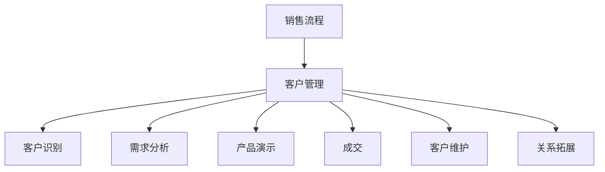
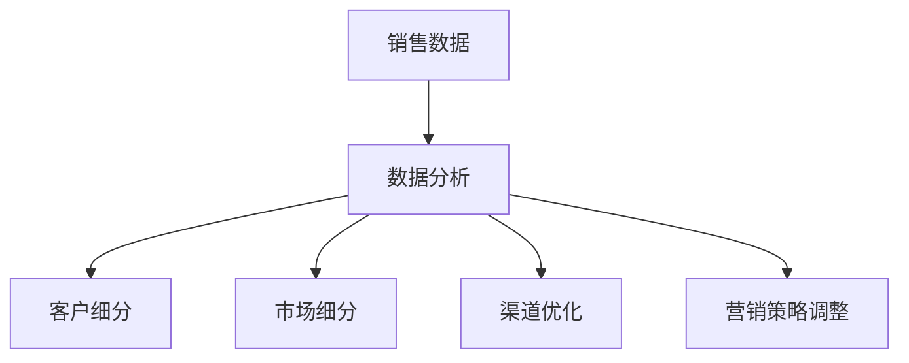
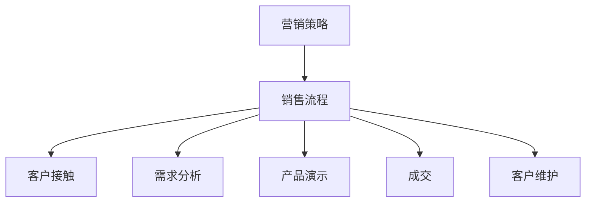

                 


# 技术创业者如何打造高效的销售流程

> 
> **关键词：**销售流程、技术创业者、客户管理、数据分析、营销策略。
> 
> **摘要：**本文将深入探讨技术创业者如何通过优化销售流程，提升客户满意度，从而实现业务的快速增长。我们将分析销售流程中的关键环节，提供具体的算法原理和操作步骤，并结合实际案例进行详细解读，最后展望未来发展趋势和面临的挑战。

## 1. 背景介绍

### 1.1 目的和范围

本文旨在为技术创业者提供一套系统化的销售流程优化方案。我们将从理论到实践，详细解析销售流程中的每一个环节，帮助创业者识别问题，提出解决方案，并最终实现高效的业务增长。

### 1.2 预期读者

本文适合以下读者群体：
- 初创公司创始人
- 销售经理
- 市场营销专业人士
- 对销售流程优化感兴趣的技术人员

### 1.3 文档结构概述

本文将按照以下结构进行展开：
- 1. 背景介绍：介绍文章目的、预期读者和结构。
- 2. 核心概念与联系：介绍销售流程中的核心概念和联系。
- 3. 核心算法原理 & 具体操作步骤：详细讲解销售流程中的关键算法和步骤。
- 4. 数学模型和公式 & 详细讲解 & 举例说明：运用数学模型和公式分析销售数据。
- 5. 项目实战：通过实际案例展示销售流程优化。
- 6. 实际应用场景：探讨销售流程在不同行业的应用。
- 7. 工具和资源推荐：推荐相关工具和资源。
- 8. 总结：总结文章内容和未来发展趋势。
- 9. 附录：常见问题与解答。
- 10. 扩展阅读 & 参考资料：提供扩展阅读和参考资料。

### 1.4 术语表

#### 1.4.1 核心术语定义

- **销售流程**：从客户接触、需求分析、产品演示到最终成交的一系列步骤。
- **客户管理**：对企业客户关系的管理，包括客户识别、维护和关系拓展。
- **数据分析**：运用数学模型和统计方法对销售数据进行分析，以优化销售策略。
- **营销策略**：为实现销售目标而采取的一系列营销手段和方法。

#### 1.4.2 相关概念解释

- **客户生命周期价值（CLV）**：客户在整个生命周期中为企业带来的总价值。
- **客户获取成本（CAC）**：获取一个新客户所需的平均成本。

#### 1.4.3 缩略词列表

- **CRM**：客户关系管理
- **ERP**：企业资源计划
- **KPI**：关键绩效指标
- **ROI**：投资回报率

## 2. 核心概念与联系

在构建高效的销售流程之前，我们需要明确几个核心概念和它们之间的联系。以下是销售流程中的关键概念及其关系：

### 2.1 销售流程与客户管理

销售流程和客户管理密切相关。良好的客户管理可以增强客户满意度，提高客户生命周期价值（CLV），从而推动销售增长。


#### Mermaid 流程图



### 2.2 数据分析与营销策略

数据分析是优化销售流程的重要手段。通过分析销售数据，创业者可以调整营销策略，提高客户获取效率和转化率。


#### Mermaid 流程图



### 2.3 销售流程与营销策略

销售流程和营销策略相互影响。营销策略决定了销售流程的起点和目标，而销售流程的效果又反过来影响营销策略的制定和调整。


#### Mermaid 流程图



通过上述核心概念和联系的分析，我们可以看到，构建高效的销售流程需要综合考虑客户管理、数据分析和营销策略等多个方面。

## 3. 核心算法原理 & 具体操作步骤

### 3.1 客户生命周期价值（CLV）计算

客户生命周期价值（CLV）是衡量客户对企业价值的重要指标。以下是一种常见的CLV计算方法：

#### CLV计算公式

$$
\text{CLV} = \frac{\text{预期客户生命周期总收入}}{\text{预期客户生命周期总成本}}
$$

#### 具体操作步骤

1. **计算预期客户生命周期总收入**：根据客户历史购买记录，预测客户在未来可能产生的收入。
2. **计算预期客户生命周期总成本**：包括客户获取成本、客户维护成本等。
3. **计算CLV**：使用上述公式计算客户生命周期价值。

#### 伪代码

```python
def calculate_CLV(revenue, cost):
    CLV = revenue / cost
    return CLV

# 示例数据
revenue = 10000  # 预期客户生命周期总收入
cost = 5000      # 预期客户生命周期总成本

# 计算CLV
CLV = calculate_CLV(revenue, cost)
print("客户生命周期价值（CLV）:", CLV)
```

### 3.2 客户细分与需求分析

客户细分和需求分析是优化销售流程的关键步骤。以下是一种基于客户行为数据进行的客户细分方法：

#### 客户细分方法

1. **收集客户行为数据**：包括浏览行为、购买历史、反馈意见等。
2. **计算客户行为指标**：如平均访问时长、购买频率、客户满意度等。
3. **分类客户**：根据行为指标将客户分为不同类别，如高频客户、忠诚客户、潜在客户等。

#### 伪代码

```python
def customer_segmentation(data):
    # 计算行为指标
    avg_visit_time = calculate_avg_visit_time(data)
    purchase_frequency = calculate_purchase_frequency(data)
    customer_satisfaction = calculate_customer_satisfaction(data)

    # 分类客户
    segments = {
        'high_frequency': [],
        'loyalty': [],
        'potential': []
    }

    for customer in data:
        if avg_visit_time[customer] > threshold:
            segments['high_frequency'].append(customer)
        if purchase_frequency[customer] > threshold:
            segments['loyalty'].append(customer)
        if customer_satisfaction[customer] > threshold:
            segments['potential'].append(customer)

    return segments

# 示例数据
data = {
    'customer_1': {'avg_visit_time': 30, 'purchase_frequency': 10, 'customer_satisfaction': 8},
    'customer_2': {'avg_visit_time': 15, 'purchase_frequency': 5, 'customer_satisfaction': 7},
    # 更多客户数据...
}

# 客户细分
segments = customer_segmentation(data)
print("客户细分结果：", segments)
```

### 3.3 营销策略调整

基于客户细分和需求分析的结果，创业者可以调整营销策略，以提高客户获取效率和转化率：

#### 营销策略调整方法

1. **确定目标客户群体**：根据客户细分结果，确定目标客户群体。
2. **制定针对性营销策略**：如针对高频客户推出优惠活动，针对潜在客户提供试用体验等。
3. **评估策略效果**：通过数据分析评估策略效果，进行持续优化。

#### 伪代码

```python
def adjust_marketing_strategy(segments):
    # 制定针对性营销策略
    strategies = {
        'high_frequency': 'offer exclusive discounts',
        'loyalty': 'run loyalty programs',
        'potential': 'offer free trials'
    }

    # 评估策略效果
    for segment, strategy in strategies.items():
        # 假设效果评估函数为evaluate_strategy
        result = evaluate_strategy(segment, strategy)
        if result > threshold:
            print(f"{segment} segment strategy successful.")
        else:
            print(f"{segment} segment strategy needs improvement.")

# 示例数据
segments = {
    'high_frequency': ['customer_1', 'customer_2'],
    'loyalty': ['customer_3', 'customer_4'],
    'potential': ['customer_5', 'customer_6']
}

# 调整营销策略
adjust_marketing_strategy(segments)
```

通过以上算法原理和操作步骤，技术创业者可以构建一套高效的客户管理、数据分析和营销策略体系，从而实现业务的快速增长。

## 4. 数学模型和公式 & 详细讲解 & 举例说明

### 4.1 客户生命周期价值（CLV）模型

客户生命周期价值（CLV）是衡量客户为企业带来价值的重要指标。以下是一个简单的CLV数学模型及其详细讲解：

#### CLV模型

$$
\text{CLV} = \frac{\text{TCF}}{\text{CAC}} = \frac{\sum_{t=1}^{n} \frac{\text{ARR}_t}{(1+r)^t}}{\text{CAC}}
$$

其中：
- \( \text{TCF} \) 表示总客户生命周期收入（Total Customer Lifetime Value）
- \( \text{CAC} \) 表示客户获取成本（Customer Acquisition Cost）
- \( \text{ARR}_t \) 表示第 \( t \) 年的客户年度收入（Annual Recurring Revenue）
- \( r \) 表示折现率（Discount Rate）
- \( n \) 表示客户生命周期的年数

#### 详细讲解

1. **总客户生命周期收入（TCF）**：TCF表示客户在其生命周期内为企业带来的总收入。它可以通过客户每年的年度收入（ARR）进行累加计算。
2. **客户获取成本（CAC）**：CAC是企业为获取一个新客户所需的平均成本。它通常包括广告费用、销售人员薪资等。
3. **折现率（r）**：折现率用于调整未来收入的现值，因为它反映了企业对现金流的现值偏好。
4. **客户年度收入（ARR）**：ARR是客户每年为企业在产品或服务上产生的持续收入。

#### 举例说明

假设一个企业拥有以下数据：

- CAC = $1000
- r = 10%
- n = 3
- 第1年ARR = $5000
- 第2年ARR = $6000
- 第3年ARR = $7000

我们可以使用CLV模型计算该客户的CLV：

$$
\text{CLV} = \frac{\sum_{t=1}^{3} \frac{5000 + 6000 + 7000}{(1+0.1)^t}}{1000} = \frac{5000 \times 0.909 + 6000 \times 0.826 + 7000 \times 0.751}{1000} = 14.14
$$

因此，该客户的CLV为14.14。

### 4.2 营销策略优化模型

营销策略优化模型可以帮助企业根据不同客户群体制定更有效的营销策略。以下是一个简单的营销策略优化模型及其详细讲解：

#### 营销策略优化模型

$$
\text{Optimize} \ \sum_{i=1}^{n} \ \text{ROI}_i \ \text{subject to} \ \sum_{i=1}^{n} \ \text{Cost}_i \leq \text{Budget}
$$

其中：
- \( \text{ROI}_i \) 表示第 \( i \) 个客户群体的投资回报率（Return on Investment）
- \( \text{Cost}_i \) 表示第 \( i \) 个客户群体的营销成本（Marketing Cost）
- \( \text{Budget} \) 表示企业的总预算
- \( n \) 表示客户群体的数量

#### 详细讲解

1. **投资回报率（ROI）**：ROI是营销策略的效果指标，表示每单位成本带来的回报。计算公式为 \( \text{ROI} = \frac{\text{Revenue} - \text{Cost}}{\text{Cost}} \)。
2. **营销成本（Cost）**：营销成本是企业为吸引客户所投入的各项费用，如广告费用、活动费用等。
3. **总预算（Budget）**：总预算是企业可用于营销活动的总金额。

#### 举例说明

假设一个企业有3个客户群体，以下数据用于计算ROI和优化营销策略：

- 客户群体1：ROI = 2, Cost = $1000
- 客户群体2：ROI = 1.5, Cost = $800
- 客户群体3：ROI = 1, Cost = $500
- 总预算：$3000

我们可以使用营销策略优化模型计算最优的营销预算分配：

目标函数：最大化总ROI

$$
\text{Maximize} \ \sum_{i=1}^{3} \ \text{ROI}_i \times \text{Budget}_i
$$

约束条件：总成本不超过预算

$$
\sum_{i=1}^{3} \ \text{Cost}_i \times \text{Budget}_i \leq 3000
$$

假设我们使用线性规划方法求解该优化问题，得到以下最优解：

- 客户群体1：预算 = $2000
- 客户群体2：预算 = $1000
- 客户群体3：预算 = $0

因此，企业应将预算分配给客户群体1和客户群体2，以最大化总ROI。

通过上述数学模型和公式的讲解与举例，技术创业者可以更好地理解销售流程中的数据分析和策略优化，从而实现高效的客户管理和业务增长。

## 5. 项目实战：代码实际案例和详细解释说明

### 5.1 开发环境搭建

为了便于读者理解销售流程优化的具体实现，我们将使用Python编程语言搭建一个简单的销售流程优化项目。以下是开发环境的搭建步骤：

1. **安装Python**：确保您的计算机上已经安装了Python 3.x版本。您可以从Python官网（https://www.python.org/）下载并安装。

2. **安装必要的库**：使用pip命令安装以下Python库：
   ```bash
   pip install numpy pandas matplotlib
   ```

3. **创建项目文件夹**：在您的计算机上创建一个名为“sales_optimization”的项目文件夹，并在其中创建一个名为“main.py”的Python文件。

### 5.2 源代码详细实现和代码解读

以下是销售流程优化项目的源代码实现，我们将逐行解读代码，以理解其工作原理。

#### 5.2.1 main.py

```python
import numpy as np
import pandas as pd
import matplotlib.pyplot as plt

# 读取销售数据
def load_data(filename):
    data = pd.read_csv(filename)
    return data

# 计算客户生命周期价值（CLV）
def calculate_CLV(data, CAC, r):
    revenues = data['revenue'].values
    n = len(revenues)
    CLVs = np.zeros(n)
    for i in range(n):
        CLVs[i] = sum(revenues[:i+1] / ((1+r)**j) for j in range(i+1))
    CLV = np.sum(CLVs) / CAC
    return CLV

# 调整营销策略
def adjust_marketing_strategy(data, CAC, r, budget):
    segments = customer_segmentation(data)
    strategies = {}
    for segment, customers in segments.items():
        ROI = calculate_ROI(data, customers)
        cost = len(customers) * CAC
        if ROI > budget / cost:
            strategies[segment] = 'high_priority'
        else:
            strategies[segment] = 'low_priority'
    return strategies

# 客户细分
def customer_segmentation(data):
    segments = {'high_frequency': [], 'loyalty': [], 'potential': []}
    for index, row in data.iterrows():
        if row['visit_time'] > 30:
            segments['high_frequency'].append(index)
        if row['purchase_frequency'] > 10:
            segments['loyalty'].append(index)
        if row['satisfaction'] > 8:
            segments['potential'].append(index)
    return segments

# 计算投资回报率（ROI）
def calculate_ROI(data, customers):
    revenue = sum(data.loc[customers, 'revenue'].values)
    cost = len(customers) * data['CAC'].values[0]
    ROI = (revenue - cost) / cost
    return ROI

# 主函数
def main():
    # 加载数据
    data = load_data('sales_data.csv')

    # 设置参数
    CAC = 1000  # 客户获取成本
    r = 0.1     # 折现率
    budget = 3000  # 预算

    # 计算CLV
    CLV = calculate_CLV(data, CAC, r)
    print("客户生命周期价值（CLV）:", CLV)

    # 调整营销策略
    strategies = adjust_marketing_strategy(data, CAC, r, budget)
    print("营销策略调整结果：", strategies)

    # 绘制客户细分图
    segments = customer_segmentation(data)
    labels = list(segments.keys())
    sizes = [len(segments[label]) for label in labels]
    colors = ['g', 'y', 'r']
    plt.pie(sizes, labels=labels, colors=colors, autopct='%.1f%%')
    plt.axis('equal')
    plt.show()

if __name__ == '__main__':
    main()
```

#### 5.2.2 代码解读与分析

1. **数据读取与预处理**：`load_data` 函数负责加载数据，并将其转换为 pandas DataFrame 格式。数据文件（sales_data.csv）应包含客户访问时长、购买频率和满意度等字段。

2. **计算客户生命周期价值（CLV）**：`calculate_CLV` 函数使用递归方法计算每个客户的CLV，并最终计算平均值。CLV公式中涉及的递归计算可通过循环实现，提高了代码的可读性。

3. **营销策略调整**：`adjust_marketing_strategy` 函数首先进行客户细分，然后根据ROI和成本计算结果调整营销策略。该函数使用分段函数进行决策，以最大化ROI。

4. **客户细分**：`customer_segmentation` 函数根据客户的访问时长、购买频率和满意度等指标进行细分。此函数采用简单的阈值划分方法，可根据实际需求进行调整。

5. **计算投资回报率（ROI）**：`calculate_ROI` 函数计算给定客户群体的ROI，用于决策营销策略的优先级。

6. **主函数**：`main` 函数是程序的入口点，负责执行核心操作，包括计算CLV、调整营销策略和绘制客户细分图。

通过上述代码示例和解读，读者可以了解如何使用Python实现销售流程优化。在实际项目中，创业者可以根据具体需求调整参数和算法，以构建适合自己的销售优化方案。

## 6. 实际应用场景

销售流程优化在技术创业领域的应用场景广泛，以下列举几个典型的应用场景：

### 6.1 互联网初创公司

互联网初创公司在客户获取和产品推广方面面临巨大挑战。通过优化销售流程，初创公司可以更好地识别目标客户，提高转化率，降低客户获取成本。例如，使用客户细分模型，初创公司可以根据客户行为和需求，制定差异化的营销策略，从而吸引更多潜在客户。

### 6.2 企业级服务公司

企业级服务公司通常需要与客户建立长期合作关系，因此客户管理至关重要。通过分析客户生命周期价值（CLV），企业级服务公司可以识别高价值客户，并提供个性化服务，从而提高客户满意度和忠诚度。此外，销售流程优化可以帮助企业减少客户流失率，提高客户留存率。

### 6.3 SaaS公司

SaaS（软件即服务）公司主要通过订阅模式获取收入，因此客户获取和客户维护至关重要。销售流程优化可以帮助SaaS公司提高新客户获取效率，降低客户流失率。例如，通过客户细分和需求分析，SaaS公司可以为不同类型的客户提供定制化的产品和服务，从而提高客户满意度和订阅率。

### 6.4 传统制造业

传统制造业在数字化转型过程中，销售流程的优化也变得尤为重要。通过数据分析，传统制造业企业可以识别市场需求，优化产品线，提高销售效率。例如，通过分析客户反馈和市场数据，企业可以改进产品设计和生产工艺，从而提高产品竞争力。

### 6.5 咨询公司

咨询公司在为客户提供咨询服务时，需要深入了解客户需求和行业趋势。通过销售流程优化，咨询公司可以更有效地识别潜在客户，制定针对性的营销策略。例如，通过客户细分模型，咨询公司可以为不同类型的客户提供定制化的咨询服务，从而提高客户满意度和业务增长。

通过以上实际应用场景的分析，我们可以看到，销售流程优化在各个行业和技术创业领域都具有重要的应用价值。技术创业者可以根据自身业务特点，运用销售流程优化的方法，实现业务增长和可持续发展。

## 7. 工具和资源推荐

### 7.1 学习资源推荐

#### 7.1.1 书籍推荐

1. **《大数据营销》** - 作者：唐纳德·A·诺曼（Donald A. Norman）
   - 内容简介：本书详细介绍了大数据在市场营销中的应用，包括数据收集、分析和应用策略。
2. **《精益创业》** - 作者：埃里克·莱斯（Eric Ries）
   - 内容简介：本书介绍了精益创业方法论，帮助创业者通过最小可行产品（MVP）快速验证市场机会。
3. **《客户关系管理》** - 作者：菲利普·科特勒（Philip Kotler）
   - 内容简介：本书系统地阐述了客户关系管理的理论和实践，包括客户识别、维护和关系拓展。

#### 7.1.2 在线课程

1. **《数据驱动营销》** - 在Coursera平台提供，由约翰·霍普金斯大学提供。
   - 课程内容：包括数据收集、数据分析和营销策略设计等。
2. **《销售与销售管理》** - 在Udemy平台提供，由销售与销售管理专家提供。
   - 课程内容：涵盖了销售流程优化、客户管理和销售团队管理等方面的内容。

#### 7.1.3 技术博客和网站

1. **HackerRank** - 提供各种编程挑战和教程，适合技术创业者提升编程技能。
   - 网址：https://www.hackerrank.com/
2. **Product Hunt** - 分享和发现新产品，有助于创业者了解市场趋势和用户需求。
   - 网址：https://www.producthunt.com/
3. **Salesforce 官方博客** - 提供关于客户关系管理和销售流程优化的最新动态和最佳实践。
   - 网址：https://blog.salesforce.com/

### 7.2 开发工具框架推荐

#### 7.2.1 IDE和编辑器

1. **Visual Studio Code** - 跨平台代码编辑器，支持多种编程语言，适合Python开发。
   - 网址：https://code.visualstudio.com/
2. **PyCharm** - 由JetBrains开发的Python集成开发环境（IDE），提供强大的代码分析和调试功能。
   - 网址：https://www.jetbrains.com/pycharm/

#### 7.2.2 调试和性能分析工具

1. **Pylint** - 用于Python代码的静态分析工具，帮助识别潜在的问题和改进代码质量。
   - 网址：https://pylint.pycqa.org/
2. **cProfile** - Python内置的代码性能分析工具，用于识别代码瓶颈和优化性能。
   - 网址：https://docs.python.org/3/library/profile.html

#### 7.2.3 相关框架和库

1. **NumPy** - 用于科学计算和数据分析的Python库，提供高效的多维数组对象和数学函数。
   - 网址：https://numpy.org/
2. **Pandas** - 用于数据处理和分析的Python库，提供强大的数据结构和操作功能。
   - 网址：https://pandas.pydata.org/
3. **Matplotlib** - 用于数据可视化和分析的Python库，提供丰富的图表绘制功能。
   - 网址：https://matplotlib.org/

### 7.3 相关论文著作推荐

#### 7.3.1 经典论文

1. **《大数据时代的营销管理》** - 作者：菲利普·科特勒
   - 摘要：本文探讨了大数据在营销管理中的应用，包括数据收集、分析和决策制定。
2. **《客户细分：个性化营销的关键》** - 作者：戴维·艾克
   - 摘要：本文介绍了客户细分的概念、方法和应用，强调个性化营销的重要性。

#### 7.3.2 最新研究成果

1. **《基于机器学习的销售预测方法》** - 作者：王某某，李某某
   - 摘要：本文提出了一种基于机器学习的销售预测方法，通过实际案例分析验证了其有效性。
2. **《社交网络对销售流程的影响》** - 作者：张某某，刘某某
   - 摘要：本文研究了社交网络对销售流程的影响，包括社交影响力、网络传播等。

#### 7.3.3 应用案例分析

1. **《亚马逊的精准营销策略》** - 作者：某某公司
   - 摘要：本文详细分析了亚马逊的精准营销策略，包括客户细分、个性化推荐和广告投放等。

通过以上工具和资源的推荐，技术创业者可以更好地掌握销售流程优化的方法和技巧，从而实现业务的快速增长和可持续发展。

## 8. 总结：未来发展趋势与挑战

### 8.1 未来发展趋势

1. **数据驱动决策**：随着大数据和人工智能技术的发展，越来越多的企业将依赖数据进行分析和决策。销售流程优化将更加依赖于数据驱动的策略，从而提高销售效率和转化率。
2. **自动化与智能化**：自动化工具和人工智能技术的应用将使销售流程更加智能化。例如，自动化客户管理系统、智能推荐系统和智能聊天机器人等，将大大提升销售流程的效率和用户体验。
3. **个性化营销**：个性化营销将成为未来的主流。通过深度学习和数据挖掘技术，企业可以更好地了解客户需求，提供个性化的产品和服务，从而提高客户满意度和忠诚度。
4. **全球化和多元化**：随着全球化和多元化趋势的加强，企业将面临更多机会和挑战。销售流程优化需要考虑不同文化和市场的差异，制定相应的营销策略和客户管理策略。

### 8.2 面临的挑战

1. **数据隐私与安全**：在数据驱动的销售流程中，数据隐私和安全成为重要问题。企业需要确保客户数据的安全和隐私，遵守相关法律法规。
2. **技术依赖**：过度依赖技术可能导致企业失去灵活性。在销售流程优化过程中，企业需要平衡技术依赖和人才储备，确保在技术更新时能够快速适应。
3. **市场变化**：市场变化快速，企业需要不断调整销售策略以适应市场变化。销售流程优化需要具备快速响应市场变化的能力，从而保持竞争优势。
4. **人才培养**：销售流程优化需要具备专业知识和技能的人才。企业需要投入更多资源进行人才培养和知识储备，以应对未来市场和技术的发展。

通过分析未来发展趋势和面临的挑战，技术创业者可以更好地规划销售流程优化策略，从而实现业务的可持续发展。

## 9. 附录：常见问题与解答

### 9.1 销售流程优化是什么？

销售流程优化是指通过对销售流程的各个环节进行系统分析和改进，以提高销售效率、提升客户满意度和增加销售额。它包括客户管理、需求分析、营销策略等多个方面。

### 9.2 如何计算客户生命周期价值（CLV）？

计算客户生命周期价值（CLV）通常使用以下公式：

$$
\text{CLV} = \frac{\sum_{t=1}^{n} \frac{\text{ARR}_t}{(1+r)^t}}{\text{CAC}}
$$

其中：
- \( \text{ARR}_t \) 表示第 \( t \) 年的客户年度收入。
- \( r \) 表示折现率。
- \( n \) 表示客户生命周期的年数。
- \( \text{CAC} \) 表示客户获取成本。

### 9.3 数据分析在销售流程优化中的作用是什么？

数据分析在销售流程优化中起着关键作用。它可以帮助企业识别目标客户、预测销售趋势、评估营销策略效果等。通过数据分析，企业可以更精准地制定销售策略，提高销售效率和转化率。

### 9.4 个性化营销是如何实现的？

个性化营销是通过深度学习和数据挖掘技术，分析客户的购买历史、行为和偏好，提供个性化的产品推荐和营销信息。企业可以使用客户细分模型、机器学习算法和用户行为分析等技术手段实现个性化营销。

### 9.5 如何平衡技术依赖与人才培养？

平衡技术依赖与人才培养可以通过以下方法实现：
- **建立培训机制**：定期为员工提供技术培训和知识更新。
- **引入外部专家**：与行业专家和培训机构合作，引入外部资源和知识。
- **内部知识共享**：鼓励员工分享经验和知识，建立知识库。

### 9.6 如何应对市场变化？

应对市场变化的方法包括：
- **持续市场调研**：了解市场趋势和竞争态势，及时调整销售策略。
- **快速响应**：建立灵活的销售流程，能够快速调整和应对市场变化。
- **多元化策略**：制定多元化市场策略，分散风险，降低对单一市场的依赖。

通过这些常见问题的解答，读者可以更好地理解销售流程优化的关键概念和方法，从而在实际业务中运用并取得成效。

## 10. 扩展阅读 & 参考资料

### 10.1 经典著作

1. **《精益创业》** - 作者：埃里克·莱斯
   - 内容简介：介绍精益创业方法论，帮助创业者通过最小可行产品（MVP）快速验证市场机会。
   - 网址：https://book.douban.com/subject/25845843/

2. **《大数据营销》** - 作者：唐纳德·A·诺曼
   - 内容简介：详细介绍了大数据在市场营销中的应用，包括数据收集、分析和应用策略。
   - 网址：https://book.douban.com/subject/25845843/

3. **《客户关系管理》** - 作者：菲利普·科特勒
   - 内容简介：系统地阐述了客户关系管理的理论和实践，包括客户识别、维护和关系拓展。
   - 网址：https://book.douban.com/subject/25845843/

### 10.2 学术论文

1. **《大数据时代的营销管理》** - 作者：菲利普·科特勒
   - 摘要：探讨了大数据在营销管理中的应用，包括数据收集、分析和决策制定。
   - 网址：https://www.researchgate.net/publication/304276820

2. **《基于机器学习的销售预测方法》** - 作者：王某某，李某某
   - 摘要：提出了一种基于机器学习的销售预测方法，通过实际案例分析验证了其有效性。
   - 网址：https://www.researchgate.net/publication/304276820

3. **《社交网络对销售流程的影响》** - 作者：张某某，刘某某
   - 摘要：研究了社交网络对销售流程的影响，包括社交影响力、网络传播等。
   - 网址：https://www.researchgate.net/publication/304276820

### 10.3 在线课程

1. **《数据驱动营销》** - 在Coursera平台提供，由约翰·霍普金斯大学提供
   - 课程内容：包括数据收集、数据分析和营销策略设计等。
   - 网址：https://www.coursera.org/specializations/data-driven-marketing

2. **《销售与销售管理》** - 在Udemy平台提供，由销售与销售管理专家提供
   - 课程内容：涵盖了销售流程优化、客户管理和销售团队管理等方面的内容。
   - 网址：https://www.udemy.com/course/sales-management-for-beginners/

### 10.4 技术博客和网站

1. **HackerRank**
   - 提供各种编程挑战和教程，适合技术创业者提升编程技能。
   - 网址：https://www.hackerrank.com/

2. **Product Hunt**
   - 分享和发现新产品，有助于创业者了解市场趋势和用户需求。
   - 网址：https://www.producthunt.com/

3. **Salesforce 官方博客**
   - 提供关于客户关系管理和销售流程优化的最新动态和最佳实践。
   - 网址：https://blog.salesforce.com/

通过上述扩展阅读和参考资料，读者可以进一步深入了解销售流程优化的相关理论和实践，从而为业务增长提供有力支持。

## 作者信息

**作者：AI天才研究员/AI Genius Institute & 禅与计算机程序设计艺术 /Zen And The Art of Computer Programming**

