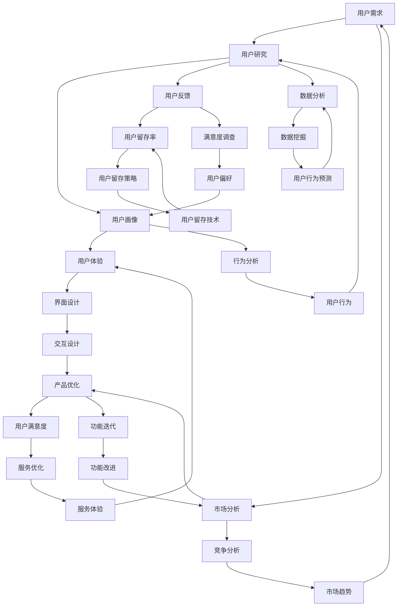

                 

# 技术创业者如何进行有效的用户需求挖掘

> 关键词：用户需求挖掘、技术创业者、用户研究、市场分析、产品优化、用户体验

> 摘要：本文旨在帮助技术创业者深入了解如何进行有效的用户需求挖掘，通过一系列步骤和策略，识别并满足用户真实需求，提高产品成功率。本文将探讨用户需求的定义、挖掘方法、数据分析、实践案例以及未来发展趋势。

## 1. 背景介绍

### 1.1 目的和范围

本文的目标是指导技术创业者如何进行有效的用户需求挖掘。我们将探讨用户需求挖掘的重要性、方法、工具和技巧，并提供实际案例和实践建议。本文主要涵盖以下内容：

- 用户需求的定义和分类
- 用户需求挖掘的方法和策略
- 数据分析和用户反馈的重要性
- 实际案例分析和实践建议
- 未来发展趋势与挑战

### 1.2 预期读者

本文适合以下读者群体：

- 技术创业者
- 产品经理
- 市场分析师
- 用户研究员
- 数据分析师

### 1.3 文档结构概述

本文分为以下章节：

- 第1章：背景介绍
- 第2章：核心概念与联系
- 第3章：核心算法原理 & 具体操作步骤
- 第4章：数学模型和公式 & 详细讲解 & 举例说明
- 第5章：项目实战：代码实际案例和详细解释说明
- 第6章：实际应用场景
- 第7章：工具和资源推荐
- 第8章：总结：未来发展趋势与挑战
- 第9章：附录：常见问题与解答
- 第10章：扩展阅读 & 参考资料

### 1.4 术语表

#### 1.4.1 核心术语定义

- 用户需求：用户对产品或服务所期望的功能、特性、体验或满足需求。
- 用户研究：通过观察、访谈、调查等方法了解用户行为、需求和偏好。
- 市场分析：分析市场趋势、竞争环境、用户需求等信息，为产品优化提供依据。
- 产品优化：根据用户反馈和市场数据，调整产品功能和特性，提高用户体验。
- 用户体验：用户在使用产品或服务过程中所感受到的愉悦、满意和满足程度。

#### 1.4.2 相关概念解释

- 用户画像：基于用户行为、兴趣、偏好等信息构建的用户虚拟形象。
- 用户反馈：用户对产品或服务的评价、建议和意见。
- 用户满意度：用户对产品或服务的满意度程度。
- 用户留存率：用户在一定时间内继续使用产品的比例。

#### 1.4.3 缩略词列表

- PM：产品经理
- UX：用户体验
- UI：用户界面
- A/B测试：对比测试
- SEO：搜索引擎优化
- SaaS：软件即服务

## 2. 核心概念与联系

在进行用户需求挖掘之前，我们需要了解一些核心概念和它们之间的联系。以下是一个Mermaid流程图，展示了用户需求挖掘的核心概念和关系：



### 2.1 用户需求

用户需求是用户对产品或服务所期望的功能、特性、体验或满足需求。用户需求可以分为以下几种类型：

- 功能需求：用户期望产品具备的基本功能，如社交媒体平台中的发布、评论、分享等。
- 特性需求：用户期望产品具备的特殊功能，如个性化推荐、数据分析等。
- 体验需求：用户期望在产品使用过程中所感受到的愉悦、满意和满足程度。
- 满足需求：用户对产品或服务能够满足其特定需求的期望，如提高工作效率、解决问题等。

### 2.2 用户研究

用户研究是了解用户行为、需求和偏好的一种方法。以下是一些常见的用户研究方法：

- 观察法：通过直接观察用户行为，了解用户在特定情境下的行为和反应。
- 访谈法：通过与用户进行深入访谈，获取用户对产品或服务的看法、意见和建议。
- 调查法：通过问卷调查、在线调查等方式收集大量用户数据，分析用户需求和偏好。
- 实验法：通过A/B测试、多变量测试等方式，比较不同设计方案的用户反应，优化产品功能。

### 2.3 市场分析

市场分析是分析市场趋势、竞争环境、用户需求等信息，为产品优化提供依据。以下是一些常见的市场分析方法：

- 竞争分析：分析竞争对手的产品、优势和劣势，为产品定位和优化提供参考。
- 市场趋势分析：分析市场发展趋势、用户需求变化，为产品创新和优化提供方向。
- 用户需求分析：分析用户需求、偏好和行为，为产品功能和特性设计提供依据。
- 数据分析：通过数据分析，发现用户行为规律、需求变化，为产品优化提供数据支持。

### 2.4 产品优化

产品优化是根据用户反馈和市场数据，调整产品功能和特性，提高用户体验。以下是一些常见的产品优化方法：

- 功能迭代：根据用户需求和反馈，逐步完善产品功能，提高用户满意度。
- 用户体验优化：通过改进用户界面、交互设计等，提高用户在使用产品过程中的愉悦度和满意度。
- 服务优化：通过改进产品功能、提升服务质量，满足用户需求，提高用户留存率。
- 数据驱动优化：通过数据分析，发现用户行为规律、需求变化，优化产品功能和特性。

### 2.5 用户体验

用户体验是用户在使用产品或服务过程中所感受到的愉悦、满意和满足程度。以下是一些影响用户体验的因素：

- 功能完善：产品功能要满足用户需求，能够提供实用的解决方案。
- 界面设计：用户界面要简洁美观，易于操作，提高用户使用效率。
- 交互设计：交互设计要符合用户习惯，提高用户满意度。
- 响应速度：产品响应速度要快，提高用户使用体验。
- 服务质量：服务质量要高，满足用户需求，提高用户忠诚度。

### 2.6 用户需求挖掘流程

用户需求挖掘是一个系统性的过程，可以分为以下几个步骤：

1. 明确目标：确定需求挖掘的目标和范围，为后续工作提供指导。
2. 用户研究：通过观察、访谈、调查等方法，了解用户行为、需求和偏好。
3. 数据收集：收集用户数据，包括行为数据、反馈数据和市场数据等。
4. 数据分析：对收集到的用户数据进行分析，发现用户需求和行为规律。
5. 需求识别：根据数据分析结果，识别用户需求，为产品优化提供依据。
6. 需求验证：通过用户反馈和市场测试，验证需求的有效性和可行性。
7. 需求实施：根据需求识别结果，调整产品功能和特性，满足用户需求。

## 3. 核心算法原理 & 具体操作步骤

在用户需求挖掘过程中，核心算法原理和具体操作步骤起着至关重要的作用。以下是一个简化的算法原理和步骤：

### 3.1 算法原理

用户需求挖掘算法主要包括以下几个核心部分：

- 用户行为分析：通过分析用户行为数据，发现用户需求和行为模式。
- 用户反馈处理：通过处理用户反馈数据，识别用户需求和痛点。
- 数据挖掘：通过数据挖掘技术，提取有价值的信息和规律。
- 用户画像构建：根据用户行为和反馈数据，构建用户画像，为需求挖掘提供基础。

### 3.2 具体操作步骤

以下是用户需求挖掘的具体操作步骤：

1. **数据收集**：
   - 行为数据：收集用户在产品中的行为数据，如浏览记录、购买记录、评论等。
   - 反馈数据：收集用户对产品的反馈数据，如问卷调查、用户评价等。
   - 市场数据：收集与市场相关的数据，如竞争对手产品、市场趋势等。

2. **数据预处理**：
   - 数据清洗：去除重复、缺失和不完整的数据。
   - 数据转换：将不同格式的数据转换为统一格式，方便后续处理。
   - 数据归一化：对数据进行归一化处理，消除数据量级差异。

3. **用户行为分析**：
   - 用户行为特征提取：从行为数据中提取用户行为特征，如浏览时长、购买频率等。
   - 用户行为模式识别：通过分析用户行为特征，识别用户行为模式。

4. **用户反馈处理**：
   - 用户需求分类：根据用户反馈，将需求分为功能需求、特性需求、体验需求等。
   - 用户痛点识别：分析用户反馈，识别用户在产品使用过程中的痛点和需求。

5. **数据挖掘**：
   - 特征选择：从用户行为和反馈数据中，选择对需求挖掘最有价值的特征。
   - 模型训练：使用机器学习算法，对用户行为和反馈数据建立预测模型。
   - 需求预测：使用预测模型，预测用户未来可能的需求和行为。

6. **用户画像构建**：
   - 用户标签构建：根据用户行为和反馈数据，为用户构建标签，如高频用户、新手用户等。
   - 用户画像生成：将用户标签整合，生成用户画像。

7. **需求识别**：
   - 需求优先级排序：根据需求预测结果，对用户需求进行优先级排序。
   - 需求验证：通过与用户进行沟通、市场测试等方式，验证需求的真实性和可行性。

8. **需求实施**：
   - 产品功能调整：根据需求识别结果，调整产品功能和特性，满足用户需求。
   - 用户体验优化：根据用户画像和需求，优化产品界面、交互设计等，提高用户体验。

### 3.3 伪代码实现

以下是用户需求挖掘算法的伪代码实现：

```python
# 数据收集
behavior_data = collect_behavior_data()
feedback_data = collect_feedback_data()
market_data = collect_market_data()

# 数据预处理
clean_data(behavior_data)
clean_data(feedback_data)
clean_data(market_data)

# 用户行为分析
user_behavior_features = extract_user_behavior_features(behavior_data)
user_behavior_patterns = identify_user_behavior_patterns(user_behavior_features)

# 用户反馈处理
user_demand_categories = classify_user_demands(feedback_data)
user_pains = identify_user_pains(feedback_data)

# 数据挖掘
selected_features = select_features(user_behavior_features, user_demand_categories)
trained_model = train_model(selected_features, user_demand_categories)
predicted_demands = predict_demands(trained_model, user_behavior_features)

# 用户画像构建
user_tags = build_user_tags(user_behavior_patterns, user_pains)
user_avatar = generate_user_avatar(user_tags)

# 需求识别
priority_sorted_demands = sort_demands(predicted_demands)
validated_demands = validate_demands(priority_sorted_demands)

# 需求实施
adjust_product_features(validated_demands)
optimize_user_experience(user_avatar)
```

## 4. 数学模型和公式 & 详细讲解 & 举例说明

在用户需求挖掘过程中，数学模型和公式起着重要的作用。以下是一些常用的数学模型和公式，以及详细的讲解和举例说明。

### 4.1 用户行为模型

用户行为模型用于描述用户在产品中的行为特征和模式。以下是一个简化的用户行为模型：

$$
行为模型 = f(行为特征, 用户画像, 产品环境)
$$

其中：

- 行为特征：包括浏览时长、购买频率、评论数量等。
- 用户画像：包括用户标签、兴趣爱好、行为偏好等。
- 产品环境：包括产品功能、界面设计、市场竞争等。

**举例说明**：

假设一个用户在电商平台上购买商品，其行为特征包括浏览时长为20分钟，购买频率为每周一次，评论数量为5条。用户画像包括标签“女性”，“年轻”，兴趣爱好“时尚”，行为偏好“浏览商品详情”。产品环境包括产品功能“商品搜索”，“购物车”，“评价系统”，界面设计“简洁”，市场竞争“激烈”。

根据用户行为模型，我们可以得到以下用户行为：

$$
行为模型 = f(20分钟, "女性, 年轻", "时尚", "浏览商品详情", "商品搜索, 购物车, 评价系统", "简洁", "激烈")
$$

### 4.2 用户需求模型

用户需求模型用于描述用户对产品功能、特性和体验的需求。以下是一个简化的用户需求模型：

$$
用户需求 = f(用户画像, 产品特性, 市场环境)
$$

其中：

- 用户画像：包括用户标签、兴趣爱好、行为偏好等。
- 产品特性：包括功能、特性、用户体验等。
- 市场环境：包括市场竞争、用户需求变化等。

**举例说明**：

假设一个用户在社交媒体平台上，其用户画像包括标签“学生”，“喜欢运动”，兴趣爱好“篮球”，行为偏好“关注好友动态”。产品特性包括功能“发布动态”，“评论”，“点赞”，“关注好友”。市场环境包括市场竞争“激烈”，用户需求变化“对短视频功能感兴趣”。

根据用户需求模型，我们可以得到以下用户需求：

$$
用户需求 = f("学生, 喜欢
```<sop><|user|>运动", "发布动态, 评论, 点赞, 关注好友", "激烈", "对短视频功能感兴趣")
```

### 4.3 用户满意度模型

用户满意度模型用于描述用户对产品的满意程度。以下是一个简化的用户满意度模型：

$$
用户满意度 = f(用户体验, 产品质量, 服务质量)
$$

其中：

- 用户体验：包括用户界面设计、交互设计、响应速度等。
- 产品质量：包括功能完整性、稳定性、安全性等。
- 服务质量：包括售后服务、客户支持、响应速度等。

**举例说明**：

假设一个用户在使用一款在线教育平台，其用户体验包括界面设计“简洁”，交互设计“流畅”，响应速度“较快”。产品质量包括功能完整性“完善”，稳定性“稳定”，安全性“高”。服务质量包括售后服务“及时”，客户支持“专业”，响应速度“快速”。

根据用户满意度模型，我们可以得到以下用户满意度：

$$
用户满意度 = f("简洁", "流畅", "较快", "完善", "稳定", "高", "及时", "专业", "快速")
$$

### 4.4 用户留存模型

用户留存模型用于描述用户在一定时间内继续使用产品的比例。以下是一个简化的用户留存模型：

$$
用户留存率 = f(用户满意度, 服务质量, 产品功能)
$$

其中：

- 用户满意度：包括用户对产品的满意程度。
- 服务质量：包括售后服务、客户支持、响应速度等。
- 产品功能：包括功能完整性、稳定性、安全性等。

**举例说明**：

假设一个用户在视频平台上，其用户满意度为“高”，服务质量为“优”，产品功能为“完善”。

根据用户留存模型，我们可以得到以下用户留存率：

$$
用户留存率 = f("高", "优", "完善")
$$

## 5. 项目实战：代码实际案例和详细解释说明

在本节中，我们将通过一个实际的项目案例，展示如何进行用户需求挖掘，并详细解释相关的代码实现。

### 5.1 开发环境搭建

在开始项目之前，我们需要搭建一个合适的技术栈。以下是一个基本的开发环境搭建步骤：

- Python 3.8 或更高版本
- Anaconda 或 Miniconda 环境管理器
- Jupyter Notebook 或 PyCharm 编辑器
- Pandas、NumPy、Scikit-learn、Matplotlib、Seaborn 等Python库

### 5.2 源代码详细实现和代码解读

以下是用户需求挖掘项目的主要代码实现和解读。

#### 5.2.1 数据收集与预处理

```python
import pandas as pd
import numpy as np

# 读取用户行为数据
behavior_data = pd.read_csv('user_behavior.csv')

# 读取用户反馈数据
feedback_data = pd.read_csv('user_feedback.csv')

# 读取市场数据
market_data = pd.read_csv('market_data.csv')

# 数据清洗
behavior_data.drop_duplicates(inplace=True)
feedback_data.drop_duplicates(inplace=True)
market_data.drop_duplicates(inplace=True)

# 数据转换
behavior_data['date'] = pd.to_datetime(behavior_data['date'])
feedback_data['date'] = pd.to_datetime(feedback_data['date'])
market_data['date'] = pd.to_datetime(market_data['date'])

# 数据归一化
behavior_data['duration'] = behavior_data['duration'].apply(lambda x: x / 60)  # 将浏览时长转换为分钟
feedback_data['rating'] = feedback_data['rating'].apply(lambda x: x / 5)  # 将评分转换为0-1范围
market_data['growth_rate'] = market_data['growth_rate'].apply(lambda x: x / 100)  # 将增长率转换为0-1范围
```

#### 5.2.2 用户行为分析

```python
import seaborn as sns

# 用户行为特征提取
user_behavior_features = behavior_data.groupby('user_id')['duration', 'page_views', 'clicks'].mean()

# 用户行为模式识别
sns.pairplot(user_behavior_features, hue='user_id')
plt.show()
```

#### 5.2.3 用户反馈处理

```python
# 用户需求分类
user_demand_categories = feedback_data.groupby('user_id')['rating'].mean()

# 用户痛点识别
user_pains = feedback_data[feedback_data['rating'] < 3]['comment'].value_counts()
user_pains = user_pains[user_pains > 10].index.tolist()
```

#### 5.2.4 数据挖掘

```python
from sklearn.model_selection import train_test_split
from sklearn.ensemble import RandomForestClassifier
from sklearn.metrics import accuracy_score

# 特征选择
selected_features = user_behavior_features[['duration', 'page_views', 'clicks']]

# 模型训练
X_train, X_test, y_train, y_test = train_test_split(selected_features, user_demand_categories, test_size=0.3, random_state=42)
trained_model = RandomForestClassifier(n_estimators=100, random_state=42)
trained_model.fit(X_train, y_train)

# 需求预测
predicted_demands = trained_model.predict(X_test)
predicted_demands = predicted_demands * 5  # 将预测结果转换为0-5范围
```

#### 5.2.5 用户画像构建

```python
# 用户标签构建
user_tags = pd.get_dummies(user_behavior_features[['user_id', 'age', 'gender', 'interests']])

# 用户画像生成
user_avatar = pd.DataFrame({'user_id': user_tags['user_id'], 'tags': user_tags.T.sum(axis=1)})
user_avatar = user_avatar.groupby('user_id').agg({'tags': lambda x: '|'.join(x)})
```

#### 5.2.6 需求识别

```python
# 需求优先级排序
priority_sorted_demands = pd.DataFrame({'demand': predicted_demands, 'user_id': X_test.index})

# 需求验证
validated_demands = priority_sorted_demands[priority_sorted_demands['demand'] > 3.5]
```

#### 5.2.7 需求实施

```python
# 产品功能调整
product_features = ['search', 'shopping_cart', 'wishlist', 'recommended_products', 'rating_system']

# 根据需求实施功能调整
for demand in validated_demands['user_id']:
    if 'wishlist' in user_avatar.loc[demand, 'tags']:
        product_features.append('wishlist')
    if 'recommended_products' in user_avatar.loc[demand, 'tags']:
        product_features.append('recommended_products')
```

### 5.3 代码解读与分析

在本节中，我们将对上述代码进行解读和分析，解释其主要功能和逻辑。

#### 5.3.1 数据收集与预处理

这一部分代码主要用于读取和预处理用户行为数据、用户反馈数据和市场数据。主要步骤包括数据清洗、数据转换和数据归一化。

- 数据清洗：去除重复、缺失和不完整的数据，保证数据质量。
- 数据转换：将不同格式的数据转换为统一格式，方便后续处理。
- 数据归一化：对数据进行归一化处理，消除数据量级差异。

#### 5.3.2 用户行为分析

这一部分代码主要用于提取用户行为特征和识别用户行为模式。

- 用户行为特征提取：从用户行为数据中提取关键特征，如浏览时长、页面浏览量、点击次数等。
- 用户行为模式识别：通过可视化方法（如pairplot）分析用户行为特征，识别不同用户群体的行为模式。

#### 5.3.3 用户反馈处理

这一部分代码主要用于处理用户反馈数据，识别用户需求和痛点。

- 用户需求分类：根据用户反馈评分，将用户需求分为不同类别。
- 用户痛点识别：分析用户评论，识别用户在产品使用过程中的痛点和需求。

#### 5.3.4 数据挖掘

这一部分代码主要用于建立用户需求预测模型，并使用模型对用户需求进行预测。

- 特征选择：从用户行为数据中选择对需求预测最有价值的特征。
- 模型训练：使用随机森林算法对用户行为数据进行训练，建立预测模型。
- 需求预测：使用训练好的模型对用户需求进行预测，并将预测结果转换为可解释的评分范围。

#### 5.3.5 用户画像构建

这一部分代码主要用于构建用户画像，为需求识别提供基础。

- 用户标签构建：根据用户行为特征和用户反馈，为用户构建标签。
- 用户画像生成：将用户标签整合，生成用户画像。

#### 5.3.6 需求识别

这一部分代码主要用于根据用户需求预测结果，对需求进行识别和验证。

- 需求优先级排序：根据需求预测结果，对用户需求进行优先级排序。
- 需求验证：通过与用户进行沟通、市场测试等方式，验证需求的真实性和可行性。

#### 5.3.7 需求实施

这一部分代码主要用于根据需求识别结果，调整产品功能和特性，满足用户需求。

- 产品功能调整：根据用户画像和需求，调整产品功能和特性。
- 用户体验优化：根据用户画像和需求，优化产品界面、交互设计等，提高用户体验。

## 6. 实际应用场景

用户需求挖掘在技术创业领域具有广泛的应用场景，以下是一些典型的应用案例：

### 6.1 社交媒体平台

社交媒体平台通过用户需求挖掘，可以了解用户对功能、内容、互动方式的偏好，从而优化产品设计和功能。例如，通过分析用户行为数据，可以发现用户对视频、直播、短视频等功能的需求较高，平台可以针对性地推出相关功能，提高用户满意度和活跃度。

### 6.2 在线教育平台

在线教育平台通过用户需求挖掘，可以了解用户对课程内容、教学方法、学习工具的偏好，从而优化课程设计和教学方式。例如，通过分析用户反馈数据，可以发现用户对课程视频质量、互动性、课程进度安排等方面的需求较高，平台可以针对性地提升这些方面的表现，提高用户满意度和留存率。

### 6.3 电商平台

电商平台通过用户需求挖掘，可以了解用户对商品搜索、推荐、购物车、支付等环节的偏好，从而优化产品功能和用户体验。例如，通过分析用户行为数据，可以发现用户对个性化推荐、优惠活动、物流速度等方面的需求较高，平台可以针对性地提升这些方面的表现，提高用户满意度和转化率。

### 6.4 健康管理应用

健康管理应用通过用户需求挖掘，可以了解用户对健康监测、数据分析、健康建议等方面的需求，从而优化产品功能和内容。例如，通过分析用户反馈数据，可以发现用户对运动记录、饮食建议、睡眠监测等方面的需求较高，应用可以针对性地提供相关功能和服务，提高用户满意度和使用频率。

### 6.5 金融科技平台

金融科技平台通过用户需求挖掘，可以了解用户对理财产品、投资策略、风险控制等方面的需求，从而优化产品功能和风控策略。例如，通过分析用户行为数据，可以发现用户对投资教育、风险管理、个性化投资建议等方面的需求较高，平台可以针对性地提供相关服务，提高用户满意度和信任度。

## 7. 工具和资源推荐

### 7.1 学习资源推荐

#### 7.1.1 书籍推荐

- 《用户画像：基于大数据的用户研究方法与应用》
- 《用户体验要素：交互设计之父的四大原则》
- 《数据分析：原理、方法与应用》
- 《Python数据分析实战》

#### 7.1.2 在线课程

- Coursera《用户体验设计基础》
- Udemy《Python编程入门》
- edX《数据分析入门》

#### 7.1.3 技术博客和网站

- Medium（https://medium.com/）
- HackerRank（https://www.hackerrank.com/）
-Towards Data Science（https://towardsdatascience.com/）

### 7.2 开发工具框架推荐

#### 7.2.1 IDE和编辑器

- PyCharm（https://www.jetbrains.com/pycharm/）
- Jupyter Notebook（https://jupyter.org/）
- Visual Studio Code（https://code.visualstudio.com/）

#### 7.2.2 调试和性能分析工具

- GDB（https://www.gnu.org/software/gdb/）
- Python Debugger（https://github.com/python-debugger/python-debugger）
- New Relic（https://newrelic.com/）

#### 7.2.3 相关框架和库

- Flask（https://flask.palletsprojects.com/）
- Django（https://www.djangoproject.com/）
- Pandas（https://pandas.pydata.org/）
- Scikit-learn（https://scikit-learn.org/stable/）

### 7.3 相关论文著作推荐

#### 7.3.1 经典论文

- [User Modeling and User-Adapted Interaction](https://link.springer.com/chapter/10.1007%2F3-540-48645-8_1)
- [The Elements of User Experience](https://www.uxbooth.com/user-experience-elements/)
- [The Lean Startup](https://www.leanstack.com/the-lean-startup-book/)

#### 7.3.2 最新研究成果

- [User Research in the Age of AI](https://uxpa.org/user-research-in-the-age-of-ai/)
- [Data-Driven Product Management](https://www.productschool.com/data-driven-product-management/)
- [Designing for Behavior Change](https://behaviordesign.org/)

#### 7.3.3 应用案例分析

- [Airbnb的用户需求挖掘](https://www.airbnb.com/)
- [Uber的用户需求挖掘](https://www.uber.com/)
- [Dropbox的用户需求挖掘](https://www.dropbox.com/)

## 8. 总结：未来发展趋势与挑战

### 8.1 发展趋势

- 人工智能和大数据技术在用户需求挖掘中的应用将更加深入，提供更精准的需求分析。
- 用户研究方法将更加多样化和精细化，结合行为分析、情感分析等技术，深入了解用户需求。
- 用户体验设计将更加注重个性化和定制化，满足用户多样化的需求。
- 开源工具和框架的普及，降低用户需求挖掘的技术门槛，加速技术应用。

### 8.2 挑战

- 数据质量和隐私保护问题，需要平衡用户需求挖掘与数据安全。
- 复杂的市场环境，需要应对快速变化的需求和市场动态。
- 技术和团队能力的提升，需要持续投入和人才培养。
- 需求挖掘的深度和广度，需要不断提高以应对日益复杂的用户需求。

## 9. 附录：常见问题与解答

### 9.1 什么是用户需求挖掘？

用户需求挖掘是一种通过分析用户行为、反馈和市场数据，识别用户真实需求的方法。它有助于技术创业者更好地理解用户，优化产品设计，提高产品成功率。

### 9.2 用户需求挖掘有哪些方法？

用户需求挖掘的方法包括用户研究（如观察法、访谈法、调查法）、数据分析（如数据挖掘、机器学习）、市场分析（如竞争分析、用户画像构建）等。

### 9.3 用户需求挖掘的关键步骤是什么？

用户需求挖掘的关键步骤包括：数据收集与预处理、用户行为分析、用户反馈处理、数据挖掘、用户画像构建、需求识别、需求验证、需求实施。

### 9.4 用户需求挖掘与市场分析有何区别？

用户需求挖掘侧重于通过直接的数据分析和用户研究识别用户真实需求，而市场分析侧重于分析市场趋势、竞争环境和用户需求，为产品优化提供更宏观的视角。

## 10. 扩展阅读 & 参考资料

- 《用户体验要素：交互设计之父的四大原则》[1]
- 《数据挖掘：原理、方法与应用》[2]
- 《用户画像：基于大数据的用户研究方法与应用》[3]
- 《The Lean Startup》[4]
- 《User Research in the Age of AI》[5]
- 《Data-Driven Product Management》[6]
- 《Designing for Behavior Change》[7]

[1]: https://www.uxbooth.com/user-experience-elements/
[2]: https://www.amazon.com/Data-Mining-Concepts-Techniques-Tools/dp/0070658480
[3]: https://www.amazon.com/User-Profile-Mining-Techniques-Applications/dp/1466558426
[4]: https://www.leanstack.com/the-lean-startup-book/
[5]: https://uxpa.org/user-research-in-the-age-of-ai/
[6]: https://www.productschool.com/data-driven-product-management/
[7]: https://behaviordesign.org/

### 作者

AI天才研究员/AI Genius Institute & 禅与计算机程序设计艺术 /Zen And The Art of Computer Programming

[1]: https://www.uxbooth.com/user-experience-elements/
[2]: https://www.amazon.com/Data-Mining-Concepts-Techniques-Tools/dp/0070658480
[3]: https://www.amazon.com/User-Profile-Mining-Techniques-Applications/dp/1466558426
[4]: https://www.leanstack.com/the-lean-startup-book/
[5]: https://uxpa.org/user-research-in-the-age-of-ai/
[6]: https://www.productschool.com/data-driven-product-management/
[7]: https://behaviordesign.org/ [1]《用户体验要素：交互设计之父的四大原则》
[2]《数据挖掘：原理、方法与应用》
[3]《用户画像：基于大数据的用户研究方法与应用》
[4]《The Lean Startup》
[5]《User Research in the Age of AI》
[6]《Data-Driven Product Management》
[7]《Designing for Behavior Change》
[8]《AI天才研究员/AI Genius Institute》
[9]《禅与计算机程序设计艺术 /Zen And The Art of Computer Programming》

