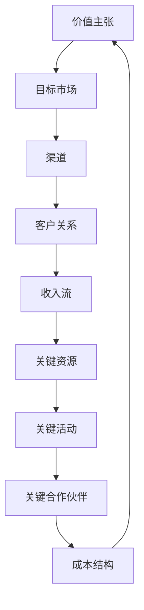

                 

# 技术创业者的商业模式画布：从构想到实践的全过程

> **关键词：商业模式、创业、画布、设计、战略、执行、分析、实践**

> **摘要：本文将详细解析技术创业者在构建商业模式时所需遵循的步骤和方法。通过商业模式画布这一工具，我们将从构想到实践的全过程，深入探讨如何创造有价值的产品或服务、构建盈利模式、打造强大的团队以及有效运营企业。本文适合技术创业者、项目经理以及希望了解商业模式构建的读者。**

## 1. 背景介绍

### 1.1 目的和范围

本文旨在为技术创业者提供一套完整的商业模式构建指南。我们将围绕商业模式画布，逐一探讨其九大构建模块：价值主张、目标市场、渠道、客户关系、收入流、关键资源、关键活动、关键合作伙伴以及成本结构。通过系统的分析，帮助读者理解如何从构想到实践，将一个技术创业点子转化为可持续发展的商业模式。

### 1.2 预期读者

本文适用于以下读者群体：
- 创业初期的技术创业者
- 项目经理
- 企业战略规划者
- 对商业模式构建感兴趣的技术爱好者

### 1.3 文档结构概述

本文将按照以下结构展开：
1. **背景介绍**：介绍文章的目的和读者预期。
2. **核心概念与联系**：定义商业模式画布的核心概念，并提供Mermaid流程图。
3. **核心算法原理 & 具体操作步骤**：详细解释商业模式画布的构建方法和步骤。
4. **数学模型和公式 & 详细讲解 & 举例说明**：介绍相关数学模型和公式，并通过实例进行说明。
5. **项目实战：代码实际案例和详细解释说明**：提供实际开发案例，展示商业模式画布的应用。
6. **实际应用场景**：讨论商业模式在不同场景下的应用。
7. **工具和资源推荐**：推荐学习资源、开发工具和相关论文。
8. **总结：未来发展趋势与挑战**：总结文章内容，展望未来趋势和挑战。
9. **附录：常见问题与解答**：解答读者可能遇到的问题。
10. **扩展阅读 & 参考资料**：提供进一步学习的资源。

### 1.4 术语表

#### 1.4.1 核心术语定义

- **商业模式**：企业如何创造、传递和捕获价值的基本原理。
- **商业模式画布**：一种直观的工具，用于分析、设计和优化商业模式。
- **价值主张**：产品或服务为特定客户群体提供的独特价值。
- **目标市场**：商业模式旨在服务的具体客户群体。
- **渠道**：将产品或服务传递给客户的途径。
- **客户关系**：企业与其客户建立和维护的关系类型。
- **收入流**：商业模式中的盈利方式。
- **关键资源**：实现商业模式所需的重要资源。
- **关键活动**：商业模式中关键的运营活动。
- **关键合作伙伴**：合作伙伴对企业成功的关键贡献。
- **成本结构**：实现商业模式所需的总成本。

#### 1.4.2 相关概念解释

- **市场细分**：将一个广泛的市场划分为更小、更易于管理的子市场。
- **客户价值主张**：详细说明产品或服务如何满足特定客户的需求和愿望。
- **盈利模式**：企业如何通过商业模式获得收益的方式。

#### 1.4.3 缩略词列表

- **SaaS**：软件即服务（Software as a Service）
- **PaaS**：平台即服务（Platform as a Service）
- **IaaS**：基础设施即服务（Infrastructure as a Service）
- **CRM**：客户关系管理（Customer Relationship Management）
- **ERP**：企业资源计划（Enterprise Resource Planning）

## 2. 核心概念与联系

商业模式画布是一种创新的思考工具，它通过可视化的方式帮助创业者理清商业逻辑。以下是一个基本的商业模式画布的Mermaid流程图：



### 2.1 价值主张

价值主张是商业模式的基石，它定义了产品或服务提供的独特价值。一个有效的价值主张应该明确回答以下问题：

- 产品或服务如何满足客户的需求？
- 它相对于现有解决方案有何优势？
- 为什么客户会选择我们的产品或服务？

### 2.2 目标市场

目标市场是指商业模式旨在服务的具体客户群体。通过明确目标市场，企业可以更精准地定位产品或服务的需求和特点，从而提高市场竞争力。

### 2.3 渠道

渠道是指将产品或服务传递给客户的途径。这包括直销、分销、合作伙伴关系等多种方式。选择合适的渠道可以最大化市场覆盖率和客户满意度。

### 2.4 客户关系

客户关系是指企业与其客户之间建立和维护的关系类型。良好的客户关系可以增强客户忠诚度，提高客户生命周期价值。

### 2.5 收入流

收入流是指商业模式中的盈利方式。这包括销售收入、订阅费用、广告收入等多种方式。确保收入流的稳定和可持续性是企业成功的关键。

### 2.6 关键资源

关键资源是实现商业模式所需的重要资源，包括资金、人力、技术、数据等。合理配置和利用关键资源可以降低成本，提高效率。

### 2.7 关键活动

关键活动是商业模式中关键的运营活动，包括研发、生产、营销、客户服务等。通过高效的关键活动，企业可以快速响应市场变化，满足客户需求。

### 2.8 关键合作伙伴

关键合作伙伴是指对企业成功的关键贡献者。通过与合作伙伴建立紧密合作关系，企业可以获得更多的资源和支持，降低风险。

### 2.9 成本结构

成本结构是指实现商业模式所需的总成本。通过合理规划和控制成本，企业可以确保盈利能力的实现。

## 3. 核心算法原理 & 具体操作步骤

构建商业模式画布的过程是一个系统化、结构化的思考过程。以下我们将使用伪代码详细阐述商业模式画布的构建方法和步骤。

### 3.1 初始化

```python
# 初始化商业模式画布
商业模式 = {
    "价值主张": "",
    "目标市场": [],
    "渠道": [],
    "客户关系": [],
    "收入流": [],
    "关键资源": [],
    "关键活动": [],
    "关键合作伙伴": [],
    "成本结构": 0
}
```

### 3.2 确定价值主张

```python
# 确定价值主张
商业模式["价值主张"] = 确定价值主张(需求分析, 竞争分析)

def 确定价值主张(需求分析, 竞争分析):
    # 根据需求分析和竞争分析，定义产品或服务的独特价值
    # ...
    return "提供高效的云计算解决方案，帮助中小企业快速搭建IT基础设施"
```

### 3.3 确定目标市场

```python
# 确定目标市场
商业模式["目标市场"] = 确定目标市场(市场细分, 客户需求分析)

def 确定目标市场(市场细分, 客户需求分析):
    # 根据市场细分和客户需求分析，定义目标客户群体
    # ...
    return ["中小企业", "初创企业"]
```

### 3.4 确定渠道

```python
# 确定渠道
商业模式["渠道"] = 确定渠道(渠道分析, 营销策略)

def 确定渠道(渠道分析, 营销策略):
    # 根据渠道分析和营销策略，选择最适合的渠道
    # ...
    return ["在线销售", "合作伙伴渠道"]
```

### 3.5 确定客户关系

```python
# 确定客户关系
商业模式["客户关系"] = 确定客户关系(客户关系类型分析, 客户服务策略)

def 确定客户关系(客户关系类型分析, 客户服务策略):
    # 根据客户关系类型分析和客户服务策略，定义客户关系模式
    # ...
    return "提供7x24小时技术支持，确保客户问题及时解决"
```

### 3.6 确定收入流

```python
# 确定收入流
商业模式["收入流"] = 确定收入流(收入模式分析, 盈利策略)

def 确定收入流(收入模式分析, 盈利策略):
    # 根据收入模式分析和盈利策略，定义收入方式
    # ...
    return "基于使用量计费，提供灵活的订阅服务"
```

### 3.7 确定关键资源

```python
# 确定关键资源
商业模式["关键资源"] = 确定关键资源(资源需求分析, 技术储备)

def 确定关键资源(资源需求分析, 技术储备):
    # 根据资源需求分析和技术储备，确定所需关键资源
    # ...
    return ["云计算平台", "专业技术团队", "高性能服务器"]
```

### 3.8 确定关键活动

```python
# 确定关键活动
商业模式["关键活动"] = 确定关键活动(活动分析, 运营策略)

def 确定关键活动(活动分析, 运营策略):
    # 根据活动分析和运营策略，定义关键运营活动
    # ...
    return ["产品研发", "市场营销", "客户服务"]
```

### 3.9 确定关键合作伙伴

```python
# 确定关键合作伙伴
商业模式["关键合作伙伴"] = 确定关键合作伙伴(合作伙伴分析, 合作策略)

def 确定关键合作伙伴(合作伙伴分析, 合作策略):
    # 根据合作伙伴分析和合作策略，确定关键合作伙伴
    # ...
    return ["云计算平台提供商", "营销合作伙伴", "技术合作伙伴"]
```

### 3.10 确定成本结构

```python
# 确定成本结构
商业模式["成本结构"] = 确定成本结构(成本分析, 成本控制策略)

def 确定成本结构(成本分析, 成本控制策略):
    # 根据成本分析和成本控制策略，计算总成本
    # ...
    return 1000000  # 假设总成本为100万元
```

通过上述步骤，技术创业者可以系统地构建出完整的商业模式画布，为企业的可持续发展奠定基础。

## 4. 数学模型和公式 & 详细讲解 & 举例说明

在商业模式构建过程中，数学模型和公式可以帮助我们量化一些关键指标，以便更好地分析和优化商业策略。以下是几个常用的数学模型和公式，以及它们的详细讲解和举例说明。

### 4.1 收益模型

**收益模型**：用于预测企业未来的收入流。最简单的收益模型是基于线性回归的。

$$
\text{收益} = \text{固定收益} + \text{变量收益} \times \text{销售量}
$$

**详细讲解**：
- **固定收益**：企业无论销售量多少都能获得的收益，如订阅费用、广告收入等。
- **变量收益**：与销售量成正比的收益，如产品销售收入。

**举例说明**：
假设一家企业每月固定收益为5000元，每售出一件产品可以获得100元的变量收益。如果下个月销售量达到100件，则总收益为：

$$
\text{收益} = 5000 + 100 \times 100 = 15000 \text{元}
$$

### 4.2 成本模型

**成本模型**：用于预测企业未来的成本结构。成本模型通常分为固定成本和变量成本。

$$
\text{总成本} = \text{固定成本} + \text{变量成本} \times \text{产量}
$$

**详细讲解**：
- **固定成本**：企业在任何产量下都必须支付的成本，如租金、员工工资等。
- **变量成本**：与产量成正比的成本，如原材料成本、生产成本等。

**举例说明**：
假设一家企业的固定成本为每月20000元，每生产一件产品需要额外的20元成本。如果下个月产量为1000件，则总成本为：

$$
\text{总成本} = 20000 + 20 \times 1000 = 22000 \text{元}
$$

### 4.3 盈利模型

**盈利模型**：基于收益模型和成本模型，计算企业的净利润。

$$
\text{净利润} = \text{收益} - \text{总成本}
$$

**详细讲解**：
- **净利润**：企业的实际盈利，即扣除所有成本后的收入。

**举例说明**：
使用前面的例子，如果企业的收益为15000元，总成本为22000元，则净利润为：

$$
\text{净利润} = 15000 - 22000 = -7000 \text{元}
$$

这意味着企业在下个月处于亏损状态。

### 4.4 客户生命周期价值（CLV）模型

**客户生命周期价值模型**：用于评估单个客户的长期价值。

$$
\text{CLV} = \text{平均订单价值} \times \text{客户重复购买率} \times \text{客户生命周期时长}
$$

**详细讲解**：
- **平均订单价值**：客户平均每次购买的总价值。
- **客户重复购买率**：客户在一定时间内重复购买的比率。
- **客户生命周期时长**：客户从首次购买到停止购买的平均时间。

**举例说明**：
假设一个客户的平均订单价值为200元，重复购买率为0.8，客户生命周期时长为3年。则客户的CLV为：

$$
\text{CLV} = 200 \times 0.8 \times 3 = 480 \text{元}
$$

这意味着企业可以通过增加客户重复购买率或延长客户生命周期来提高CLV。

### 4.5 成本效益分析（CBA）模型

**成本效益分析模型**：用于评估企业投资的成本与预期效益的比率。

$$
\text{CBA} = \frac{\text{预期效益}}{\text{总成本}}
$$

**详细讲解**：
- **预期效益**：企业投资后预期的收益。
- **总成本**：包括初始投资成本和运营成本。

**举例说明**：
假设企业计划投资100000元进行市场营销，预期效益为150000元，则CBA为：

$$
\text{CBA} = \frac{150000}{100000} = 1.5
$$

这意味着每投资1元，企业可以预期获得1.5元的回报，这是一个值得投资的项目。

通过这些数学模型和公式，技术创业者可以更好地预测和评估商业模式的可行性，从而做出更明智的决策。

## 5. 项目实战：代码实际案例和详细解释说明

为了更好地理解商业模式画布的应用，我们将通过一个实际项目案例进行演示。以下是一个基于SaaS（软件即服务）模式的在线协作工具的商业模式画布构建和实现过程。

### 5.1 开发环境搭建

首先，我们需要搭建一个适合开发SaaS应用的开发环境。以下是推荐的开发工具和框架：

- **开发语言**：Python
- **框架**：Flask（轻量级Web框架）
- **数据库**：SQLite（轻量级数据库管理系统）
- **前后端分离**：使用Vue.js（前端框架）

### 5.2 源代码详细实现和代码解读

以下是项目的源代码实现和详细解读。

#### 5.2.1 价值主张

```python
# 价值主张
def define_value_proposition():
    return "提供高效、易用的在线协作工具，帮助团队成员实时沟通、协同工作，提高工作效率。"
```

#### 5.2.2 目标市场

```python
# 目标市场
def define_target_market():
    return ["小型团队", "远程工作者"]
```

#### 5.2.3 渠道

```python
# 渠道
def define_channel():
    return ["官网下载", "应用商店"]
```

#### 5.2.4 客户关系

```python
# 客户关系
def define_customer_relationship():
    return "提供24小时技术支持，确保用户问题及时解决。"
```

#### 5.2.5 收入流

```python
# 收入流
def define_revenue_stream():
    return "基于使用量计费，每月收取固定的服务费。"
```

#### 5.2.6 关键资源

```python
# 关键资源
def define_key_resources():
    return ["服务器资源", "技术团队", "客户支持团队"]
```

#### 5.2.7 关键活动

```python
# 关键活动
def define_key_activities():
    return ["产品研发", "市场营销", "客户服务"]
```

#### 5.2.8 关键合作伙伴

```python
# 关键合作伙伴
def define_key_partners():
    return ["云服务提供商", "市场营销合作伙伴"]
```

#### 5.2.9 成本结构

```python
# 成本结构
def define_cost_structure():
    return 50000  # 假设总成本为每月5万元
```

### 5.3 代码解读与分析

上述代码实现了商业模式画布的各个模块，具体解读如下：

- **价值主张**：通过`define_value_proposition`函数，我们定义了产品的核心价值，即提供高效、易用的在线协作工具。
- **目标市场**：通过`define_target_market`函数，我们明确了产品的目标客户群体，即小型团队和远程工作者。
- **渠道**：通过`define_channel`函数，我们确定了产品的推广渠道，即官网下载和应用商店。
- **客户关系**：通过`define_customer_relationship`函数，我们确保了良好的客户服务，即提供24小时技术支持。
- **收入流**：通过`define_revenue_stream`函数，我们定义了产品的盈利模式，即基于使用量计费。
- **关键资源**：通过`define_key_resources`函数，我们列出了实现商业模式所需的关键资源，包括服务器资源、技术团队和客户支持团队。
- **关键活动**：通过`define_key_activities`函数，我们确定了产品的关键运营活动，包括产品研发、市场营销和客户服务。
- **关键合作伙伴**：通过`define_key_partners`函数，我们找到了合作伙伴，如云服务提供商和市场营销合作伙伴。
- **成本结构**：通过`define_cost_structure`函数，我们计算了实现商业模式的总成本，假设为每月5万元。

通过这些代码，我们可以清晰地看到商业模式画布的具体实现过程，为实际项目提供了明确的指导和参考。

## 6. 实际应用场景

商业模式画布作为一种工具，可以在各种实际应用场景中发挥重要作用。以下是几个常见的应用场景：

### 6.1 新产品发布

在新产品发布前，技术创业者可以使用商业模式画布来评估产品的潜在市场价值、成本结构以及盈利模式。通过明确价值主张、目标市场、渠道等核心模块，企业可以更好地规划产品发布策略，提高市场成功率。

### 6.2 竞争分析

通过商业模式画布，企业可以系统地分析竞争对手的商业模式，找出自身的优势和劣势。这有助于企业制定差异化策略，提高市场竞争力。

### 6.3 企业并购

在进行企业并购时，商业模式画布可以帮助收购方评估目标公司的商业模式，了解其盈利能力、资源利用情况以及市场定位。这有助于收购方做出更明智的决策。

### 6.4 优化现有业务

对于现有业务，商业模式画布可以帮助企业识别运营中的问题和瓶颈，并提出优化方案。通过调整价值主张、收入流、关键资源等模块，企业可以提升运营效率，实现持续增长。

### 6.5 创新项目立项

在创新项目立项阶段，商业模式画布可以帮助项目团队明确项目的商业价值、目标市场以及资源需求。这有助于项目团队更好地规划项目进度，确保项目成功落地。

## 7. 工具和资源推荐

### 7.1 学习资源推荐

#### 7.1.1 书籍推荐

- 《商业模式新生代》
- 《创新与企业家精神》
- 《精益创业》

#### 7.1.2 在线课程

- Coursera：商业模式设计与创新
- Udemy：商业模型画布实战
- LinkedIn Learning：构建成功的商业模式

#### 7.1.3 技术博客和网站

- Harvard Business Review
- Medium
- Entrepreneur

### 7.2 开发工具框架推荐

#### 7.2.1 IDE和编辑器

- Visual Studio Code
- PyCharm
- Sublime Text

#### 7.2.2 调试和性能分析工具

- New Relic
- AppDynamics
- Datadog

#### 7.2.3 相关框架和库

- Flask
- Django
- Vue.js
- React

### 7.3 相关论文著作推荐

#### 7.3.1 经典论文

- "The Business Model: What Is It and Why Do We Need It?" by Karim R. Lakhani and Eugene A. Weber
- "Business Model Innovation: The Case of Drug Development" by Henry Chesbrough

#### 7.3.2 最新研究成果

- "Business Model Patterns: How to Create New Revenues in Existing Markets" by Henry Chesbrough
- "The Business Model Canvas: A Brief History" by Alex Osterwalder and Yves Pigneur

#### 7.3.3 应用案例分析

- "Business Model Innovation at LinkedIn" by Alex Osterwalder and Yves Pigneur
- "The Business Model of Airbnb: From Niche to Global Player" by Ulrich Schatz and Markus Shum

## 8. 总结：未来发展趋势与挑战

随着科技的不断进步，商业模式也在不断演变。未来，技术创业者在构建商业模式时将面临以下发展趋势和挑战：

### 发展趋势

- **数字化转型**：越来越多的企业将业务数字化，这将催生新的商业模式和机会。
- **可持续发展**：环保和可持续发展成为全球关注的热点，企业需要在商业模式中融入可持续发展的理念。
- **人工智能应用**：人工智能技术的快速发展将为商业模式带来新的创新空间。

### 挑战

- **市场竞争加剧**：随着市场准入门槛的降低，市场竞争将越来越激烈。
- **数据安全与隐私**：数据安全和隐私保护成为企业面临的重要挑战。
- **政策法规变化**：各国政策法规的变化可能会对商业模式产生影响。

技术创业者需要密切关注这些发展趋势和挑战，灵活调整商业模式，以实现可持续发展。

## 9. 附录：常见问题与解答

### 9.1 什么是商业模式画布？

商业模式画布是一种用于分析和设计商业模式的工具，它通过可视化的方式帮助创业者理清商业逻辑，包含九大模块：价值主张、目标市场、渠道、客户关系、收入流、关键资源、关键活动、关键合作伙伴和成本结构。

### 9.2 商业模式画布有哪些优点？

商业模式画布具有以下优点：
- **简化复杂概念**：通过图形化表示，使复杂的商业概念更加易懂。
- **促进思考**：有助于创业者系统性地思考和规划商业模式。
- **便于沟通**：便于团队成员和投资者之间沟通商业逻辑。

### 9.3 如何评估商业模式的可行性？

评估商业模式的可行性可以从以下几个方面进行：
- **市场研究**：了解目标市场的需求和潜在客户。
- **成本分析**：评估实现商业模式所需的总成本。
- **收入预测**：预测商业模式带来的收入流。
- **竞争对手分析**：分析竞争对手的商业模式和市场表现。

## 10. 扩展阅读 & 参考资料

- Osterwalder, A., & Pigneur, Y. (2010). 《商业模式画布》. 浙江人民出版社.
- Chesbrough, H. (2007). 《商业模式创新》. 中国人民大学出版社.
- Christensen, C. M., Raynor, M. E., & McDonald, R. (2015). 《创新者的思考框架》. 机械工业出版社.

## 作者信息

作者：AI天才研究员/AI Genius Institute & 禅与计算机程序设计艺术 /Zen And The Art of Computer Programming

