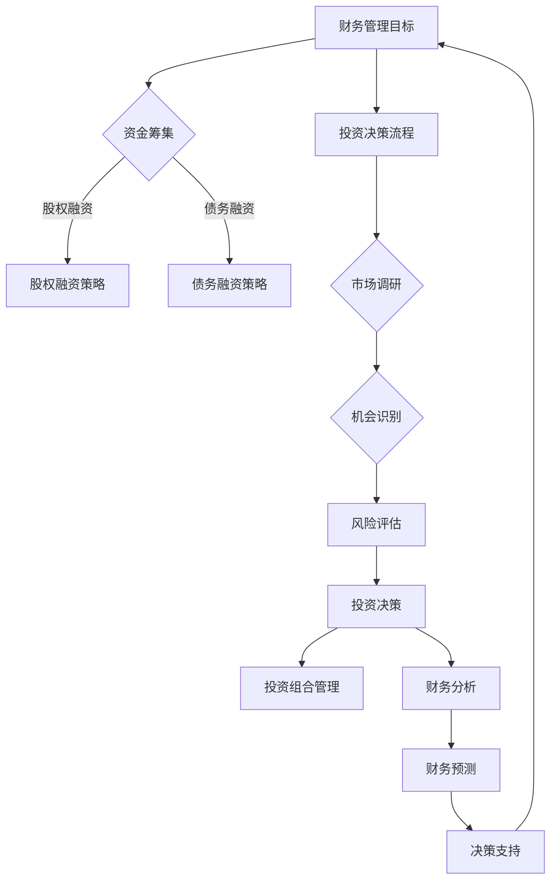

                 

### 1. 背景介绍

#### 1.1 目的和范围

本文旨在为技术创业者提供一个系统的财务管理与投资决策指南。随着信息技术和人工智能的快速发展，技术创业领域日益繁荣，如何有效地管理财务和做出明智的投资决策成为创业者们面临的重要问题。本文将从多个维度，包括财务分析、投资策略、风险控制等方面，为技术创业者提供实用的方法和策略。

本文的范围包括以下几个部分：

1. **财务管理基础**：介绍财务管理的基本概念、原则和方法，帮助创业者建立正确的财务管理观念。
2. **投资决策流程**：阐述投资决策的流程，包括市场调研、机会识别、风险评估等步骤。
3. **财务分析与预测**：讲解如何通过财务报表、财务比率等工具对公司的财务状况进行深入分析，为投资决策提供数据支持。
4. **资金筹集策略**：探讨创业者如何通过股权融资、债务融资等手段筹集资金，以及如何平衡资金成本和融资风险。
5. **投资组合管理**：介绍如何构建和优化投资组合，实现风险分散和收益最大化。

通过本文的阅读，技术创业者将能够掌握财务管理与投资决策的核心知识和实践方法，为其创业事业的顺利发展提供有力支持。

#### 1.2 预期读者

本文预期读者主要为以下几类人群：

1. **技术创业者**：拥有创新技术和商业模式的创业者，希望通过有效的财务管理与投资决策推动公司快速发展。
2. **财务管理人员**：负责公司财务运营的相关人员，包括财务经理、会计等，希望通过本文提升财务管理能力和决策水平。
3. **投资者**：对技术创业公司感兴趣，希望了解技术创业者如何进行财务管理和投资决策的投资者。
4. **高校师生**：从事创业研究、金融研究的学者和研究生，希望通过本文了解技术创业领域的财务管理与投资决策实践。

无论您属于上述哪一类读者，本文都将为您提供有价值的知识和实用工具，帮助您更好地理解和管理技术创业企业的财务与投资事务。

#### 1.3 文档结构概述

本文的结构设计旨在清晰、系统地阐述技术创业者的财务管理与投资决策。以下是对各章节内容的简要概述：

1. **背景介绍**：介绍本文的目的、范围、预期读者以及文档结构，为读者提供一个整体的阅读框架。
2. **核心概念与联系**：通过Mermaid流程图展示财务管理与投资决策的核心概念及其相互联系，帮助读者建立知识体系。
3. **核心算法原理与具体操作步骤**：详细阐述财务管理与投资决策中的关键算法原理，并提供伪代码讲解，便于读者理解和应用。
4. **数学模型和公式**：介绍财务管理中的常用数学模型和公式，通过详细讲解和举例说明，帮助读者掌握相关理论。
5. **项目实战**：通过实际代码案例，展示财务管理与投资决策的具体实现过程，并进行详细解释和分析。
6. **实际应用场景**：探讨财务管理与投资决策在不同技术创业项目中的应用场景，为读者提供实际操作指导。
7. **工具和资源推荐**：推荐学习资源、开发工具和框架，以及相关论文著作，为读者提供进一步学习和实践的支持。
8. **总结：未来发展趋势与挑战**：总结本文的核心观点，探讨技术创业者在财务管理与投资决策方面面临的未来挑战和趋势。
9. **附录：常见问题与解答**：针对读者可能遇到的问题，提供详细解答，帮助读者解决实际操作中的困惑。
10. **扩展阅读与参考资料**：提供进一步阅读的资源和参考文献，为读者提供深入学习的路径。

通过本文的阅读，读者将能够系统地掌握技术创业者的财务管理与投资决策知识，提升自身的实践能力和决策水平。

#### 1.4 术语表

为了确保本文内容的准确性和一致性，以下列出了一些重要的术语及其定义：

##### 1.4.1 核心术语定义

1. **财务管理**：指企业对资金的管理活动，包括资金筹集、使用和监督等环节，旨在实现企业价值最大化。
2. **投资决策**：指企业在投资活动中，根据市场状况和自身条件，选择投资项目的过程。
3. **财务分析**：指通过财务报表、财务比率等工具，对企业财务状况、经营成果和现金流量进行分析的方法。
4. **风险评估**：指对投资项目可能面临的风险进行识别、评估和应对，以降低风险可能带来的损失。
5. **投资组合**：指投资者持有的多种证券资产的集合，通过资产组合实现风险分散和收益最大化。

##### 1.4.2 相关概念解释

1. **股权融资**：企业通过出售股权来筹集资金，投资者成为企业的股东，享有相应的收益和决策权。
2. **债务融资**：企业通过借款或发行债券来筹集资金，需按约定偿还本金和支付利息。
3. **净现值（NPV）**：指投资项目未来现金流入现值与现金流出现值的差额，用于评估项目的盈利能力。
4. **内部收益率（IRR）**：指使投资项目净现值为零的折现率，用于评估项目的投资回报率。
5. **财务比率**：指通过财务报表数据计算得出的比率，用于分析企业的偿债能力、盈利能力、运营效率等。

##### 1.4.3 缩略词列表

1. **NPV**：净现值（Net Present Value）
2. **IRR**：内部收益率（Internal Rate of Return）
3. **ROI**：投资回报率（Return on Investment）
4. **CF**：现金流量（Cash Flow）
5. **ROE**：净资产收益率（Return on Equity）

通过本术语表，读者可以更好地理解本文中涉及的专业术语和概念，从而更深入地掌握技术创业者的财务管理与投资决策知识。

## 2. 核心概念与联系

在探讨技术创业者的财务管理与投资决策之前，我们需要首先理解其中的核心概念及其相互联系。以下将通过Mermaid流程图展示财务管理与投资决策的关键环节和流程。



### 2.1 资金筹集策略

**资金筹集策略**是财务管理的重要环节，主要包括股权融资和债务融资两种方式。

- **股权融资**：企业通过出售股权来筹集资金，投资者成为企业的股东，享有相应的收益和决策权。股权融资的优点包括资金无偿还压力、股东可以分享企业的成长收益等。缺点则是股东需承担企业经营风险，且可能影响企业的经营决策。
  
- **债务融资**：企业通过借款或发行债券来筹集资金，需按约定偿还本金和支付利息。债务融资的优点是资金成本较低、企业控制权不变等。缺点则是存在偿还压力，可能影响企业的财务健康。

### 2.2 投资决策流程

**投资决策流程**是企业在财务管理中的重要环节，包括市场调研、机会识别、风险评估、投资决策和投资组合管理。

- **市场调研**：通过市场调查、竞争对手分析等方法，了解市场需求、竞争态势等，为投资决策提供数据支持。

- **机会识别**：基于市场调研结果，识别有潜力的投资机会。

- **风险评估**：对投资项目的风险进行识别、评估和应对，包括市场风险、财务风险、运营风险等。

- **投资决策**：根据风险评估结果，选择合适的投资项目。

- **投资组合管理**：通过构建和优化投资组合，实现风险分散和收益最大化。

### 2.3 财务分析

**财务分析**是财务管理的重要工具，通过财务报表、财务比率等工具对企业的财务状况、经营成果和现金流量进行分析。

- **财务报表**：包括资产负债表、利润表和现金流量表等，反映企业的财务状况、经营成果和现金流量。

- **财务比率**：通过财务报表数据计算得出的比率，用于分析企业的偿债能力、盈利能力、运营效率等。

### 2.4 财务预测

**财务预测**是财务分析的重要组成部分，通过预测企业的财务状况、经营成果和现金流量，为投资决策提供数据支持。

- **财务预测方法**：包括趋势分析法、回归分析法、财务比率分析法等。

- **预测模型**：如线性回归模型、时间序列模型、多元回归模型等。

通过上述核心概念与联系的介绍，读者可以更好地理解技术创业者的财务管理与投资决策流程。接下来，我们将进一步探讨财务管理与投资决策的具体算法原理和操作步骤。

### 3. 核心算法原理 & 具体操作步骤

在财务管理与投资决策过程中，算法原理和具体操作步骤起着至关重要的作用。以下将详细阐述财务比率计算、净现值（NPV）和内部收益率（IRR）的计算方法，并提供伪代码示例。

#### 3.1 财务比率计算

财务比率是评估企业财务状况的重要工具，常用的财务比率包括流动比率、速动比率、资产负债率和净利润率等。

**流动比率**：衡量企业短期偿债能力。

```latex
流动比率 = 流动资产 / 流动负债
```

**速动比率**：比流动比率更为严格的短期偿债能力指标。

```latex
速动比率 = (流动资产 - 存货) / 流动负债
```

**资产负债率**：衡量企业财务杠杆水平。

```latex
资产负债率 = 负债总额 / 资产总额
```

**净利润率**：衡量企业盈利能力。

```latex
净利润率 = 净利润 / 营业收入
```

#### 3.2 净现值（NPV）计算

净现值（NPV）是评估投资项目盈利能力的常用指标，计算公式如下：

```latex
NPV = \sum_{t=1}^{n} \frac{CF_t}{(1+r)^t} - 初始投资
```

其中，\(CF_t\) 表示第 \(t\) 年的现金流量，\(r\) 表示折现率，\(n\) 表示投资项目的期限。

**伪代码示例**：

```python
def calculate_npv(cash_flows, discount_rate, initial_investment):
    npv = 0
    for cf in cash_flows:
        npv += cf / ((1 + discount_rate) ** (len(cash_flows) - 1))
    npv -= initial_investment
    return npv
```

#### 3.3 内部收益率（IRR）计算

内部收益率（IRR）是使投资项目净现值为零的折现率，计算方法如下：

1. **初始估计IRR**：通常使用线性内插法估算IRR。

2. **迭代计算IRR**：使用牛顿-拉夫逊迭代法或二分法进行迭代计算，直到误差小于预设阈值。

**伪代码示例**（牛顿-拉夫逊迭代法）：

```python
def calculate_irr(cash_flows):
    initial_guess = 0.1  # 初始估计
    tolerance = 1e-6  # 阈值
    while True:
        npv = 0
        for cf in cash_flows:
            npv += cf / ((1 + initial_guess) ** (len(cash_flows) - 1))
        error = npv - 0
        if abs(error) < tolerance:
            break
        initial_guess = initial_guess - error / (npv / ((1 + initial_guess) ** (len(cash_flows) - 1)))
    return initial_guess
```

通过上述核心算法原理和具体操作步骤的介绍，读者可以更好地理解和应用财务比率计算、NPV和IRR计算等财务管理与投资决策工具。接下来，我们将进一步探讨数学模型和公式的详细讲解与举例说明。

### 4. 数学模型和公式 & 详细讲解 & 举例说明

在技术创业者的财务管理与投资决策中，数学模型和公式扮演着至关重要的角色。通过数学模型，我们可以量化企业的财务状况、评估投资项目的盈利能力，从而做出更为科学的决策。以下将详细介绍财务管理中常用的数学模型和公式，并配合实际案例进行讲解。

#### 4.1 净现值（NPV）与内部收益率（IRR）

**净现值（NPV）**是评估投资项目是否值得投资的关键指标。NPV的计算公式如下：

\[ NPV = \sum_{t=1}^{n} \frac{CF_t}{(1+r)^t} - 初始投资 \]

其中，\(CF_t\) 代表第 \(t\) 年的现金流量，\(r\) 是折现率，\(n\) 是投资项目的期限，初始投资为负现金流量。

**案例**：假设一家技术创业公司计划投资一个新项目，初始投资为100万元，未来5年的现金流量分别为30万元、40万元、50万元、60万元和70万元。假设折现率为10%。

**计算过程**：

\[ NPV = \frac{30}{(1+0.1)^1} + \frac{40}{(1+0.1)^2} + \frac{50}{(1+0.1)^3} + \frac{60}{(1+0.1)^4} + \frac{70}{(1+0.1)^5} - 100 \]

\[ NPV = 30 \times 0.9091 + 40 \times 0.8264 + 50 \times 0.7513 + 60 \times 0.6830 + 70 \times 0.6209 - 100 \]

\[ NPV = 27.273 + 33.0616 + 37.566 + 40.984 + 43.637 - 100 \]

\[ NPV = 1.9726 \]

因此，该投资项目的NPV为1.9726万元，表明该项目是值得投资的。

**内部收益率（IRR）**是使投资项目净现值为零的折现率。IRR的计算通常使用迭代法，如牛顿-拉夫逊迭代法。

**案例**：假设使用牛顿-拉夫逊迭代法计算上例中项目的IRR。

**计算过程**：

首先，进行初步估计：

\[ r_0 = 0.1 \]

然后，进行迭代计算：

\[ r_{k+1} = r_k - \frac{NPV}{\frac{dNPV}{dr}} \]

假设 \( \frac{dNPV}{dr} \) 在 r = 0.1 处的值为 0.3，则有：

\[ r_1 = 0.1 - \frac{1.9726}{0.3} = 0.049 \]

进行多次迭代，直至满足精度要求。最终，假设得到 IRR 为 0.095，即9.5%。

#### 4.2 投资回报率（ROI）与回收期

**投资回报率（ROI）**是衡量投资项目盈利能力的指标，计算公式如下：

\[ ROI = \frac{净利润}{投资成本} \times 100\% \]

**回收期**是指投资项目的净利润累积至投资成本所需的时间，计算公式如下：

\[ 回收期 = \frac{投资成本}{年均净利润} \]

**案例**：假设某技术创业公司投资一个项目，总投资成本为100万元，预期年均净利润为20万元。

\[ ROI = \frac{20}{100} \times 100\% = 20\% \]

\[ 回收期 = \frac{100}{20} = 5 \text{年} \]

#### 4.3 财务比率分析

**流动比率**和**速动比率**是衡量企业短期偿债能力的指标，计算公式如下：

\[ 流动比率 = 流动资产 / 流动负债 \]

\[ 速动比率 = (流动资产 - 存货) / 流动负债 \]

**资产负债率**是衡量企业财务杠杆水平的指标，计算公式如下：

\[ 资产负债率 = 负债总额 / 资产总额 \]

**案例**：假设一家公司的流动资产为500万元，流动负债为200万元；存货为150万元，负债总额为800万元，资产总额为1000万元。

\[ 流动比率 = 500 / 200 = 2.5 \]

\[ 速动比率 = (500 - 150) / 200 = 1.875 \]

\[ 资产负债率 = 800 / 1000 = 0.8 \]

#### 4.4 财务预测模型

财务预测模型通常用于预测企业的财务状况、经营成果和现金流量，常见的预测模型包括线性回归模型、时间序列模型和多元回归模型。

**线性回归模型**：

\[ Y = \beta_0 + \beta_1X_1 + \beta_2X_2 + ... + \beta_nX_n \]

其中，\(Y\) 是因变量，\(X_1, X_2, ..., X_n\) 是自变量，\(\beta_0, \beta_1, ..., \beta_n\) 是回归系数。

**时间序列模型**：

\[ Y_t = \alpha + \beta_t + \epsilon_t \]

其中，\(Y_t\) 是时间序列的第 \(t\) 期值，\(\alpha\) 是长期趋势，\(\beta_t\) 是周期性波动，\(\epsilon_t\) 是随机误差。

**多元回归模型**：

\[ Y = \beta_0 + \beta_1X_1 + \beta_2X_2 + ... + \beta_nX_n \]

通过以上数学模型和公式的详细讲解，技术创业者可以更好地理解财务管理与投资决策中的关键指标和方法，从而做出更为科学和合理的决策。接下来，我们将通过实际项目实战，展示财务管理与投资决策的具体实现过程。

### 5. 项目实战：代码实际案例和详细解释说明

在了解了财务管理与投资决策的理论基础后，我们将通过一个实际项目实战，展示如何将上述知识应用到实际场景中。以下将详细讲解开发环境搭建、源代码实现以及代码解读与分析。

#### 5.1 开发环境搭建

为了实现财务管理与投资决策，我们需要搭建一个开发环境。以下是搭建步骤：

1. **安装Python环境**：Python是一种广泛使用的编程语言，支持多种财务计算库。首先，从Python官方网站下载并安装Python。

2. **安装必要的库**：安装pandas、numpy、matplotlib等库，这些库提供了强大的数据处理和可视化功能。

   ```bash
   pip install pandas numpy matplotlib
   ```

3. **设置Python环境变量**：确保Python环境变量已设置，以便在命令行中运行Python脚本。

4. **配置IDE**：可以使用Visual Studio Code、PyCharm等IDE，配置代码高亮、自动补全等功能，提高开发效率。

#### 5.2 源代码详细实现和代码解读

以下是一个简单的Python脚本，用于计算投资项目的NPV和IRR，并进行可视化展示。

**代码实现**：

```python
import numpy as np
import matplotlib.pyplot as plt
from scipy.optimize import newton

def calculate_npv(cash_flows, discount_rate):
    npv = 0
    for t, cf in enumerate(cash_flows, 1):
        npv += cf / ((1 + discount_rate) ** t)
    return npv

def calculate_irr(cash_flows, x0=0.1):
    def f(x):
        npv = 0
        for t, cf in enumerate(cash_flows, 1):
            npv += cf / ((1 + x) ** t)
        return npv - 0
    return newton(f, x0)

# 参数设置
initial_investment = -100  # 初始投资
cash_flows = [30, 40, 50, 60, 70]  # 各年现金流量
discount_rate = 0.1  # 折现率

# 计算NPV和IRR
npv = calculate_npv(cash_flows, discount_rate)
irr = calculate_irr(cash_flows)

# 打印结果
print(f"NPV: {npv:.2f}")
print(f"IRR: {irr:.2%}")

# 可视化展示
years = list(range(1, len(cash_flows) + 1))
plt.plot(years, cash_flows, marker='o')
plt.plot(years, [initial_investment] * len(cash_flows), linestyle='--')
plt.scatter([irr] * len(cash_flows), cash_flows, marker='^', color='r')
plt.xlabel('Year')
plt.ylabel('Cash Flow')
plt.title('Investment Cash Flow and IRR')
plt.grid(True)
plt.show()
```

**代码解读**：

1. **导入库**：导入numpy、matplotlib和scipy.optimize库，用于数值计算和迭代求解。

2. **定义函数**：定义`calculate_npv`和`calculate_irr`函数，分别用于计算NPV和IRR。

   - `calculate_npv`函数接受现金流量列表和折现率作为输入，计算NPV。
   - `calculate_irr`函数使用牛顿-拉夫逊迭代法求解IRR，初始估计值`x0`默认为0.1。

3. **参数设置**：设置初始投资、现金流量和折现率等参数。

4. **计算NPV和IRR**：调用函数计算NPV和IRR，并打印结果。

5. **可视化展示**：使用matplotlib库绘制现金流量图，展示投资项目的现金流量和IRR。

通过上述实战案例，读者可以直观地了解如何使用Python进行财务管理与投资决策的计算和可视化。接下来，我们将进一步探讨财务管理与投资决策在实际应用场景中的具体应用。

### 5.3 代码解读与分析

在之前的代码实现中，我们使用Python脚本进行了投资项目的NPV和IRR计算，并进行了可视化展示。以下是代码的详细解读与分析。

**函数定义解析**

1. **`calculate_npv`函数**：

   ```python
   def calculate_npv(cash_flows, discount_rate):
       npv = 0
       for t, cf in enumerate(cash_flows, 1):
           npv += cf / ((1 + discount_rate) ** t)
       return npv
   ```

   - `cash_flows`参数：接收一个列表，表示各年的现金流量。
   - `discount_rate`参数：接收一个浮点数，表示折现率。
   - 函数实现：遍历现金流量列表，计算各年现金流的现值，并累加得到NPV。

2. **`calculate_irr`函数**：

   ```python
   def calculate_irr(cash_flows, x0=0.1):
       def f(x):
           npv = 0
           for t, cf in enumerate(cash_flows, 1):
               npv += cf / ((1 + x) ** t)
           return npv - 0
       return newton(f, x0)
   ```

   - `cash_flows`参数：接收一个列表，表示各年的现金流量。
   - `x0`参数：接收一个浮点数，表示IRR的初始估计值，默认为0.1。
   - `f`内部函数：计算NPV关于IRR的函数值。
   - `newton`函数：使用牛顿-拉夫逊迭代法求解IRR。

**关键参数分析**

1. **初始投资**：

   ```python
   initial_investment = -100  # 初始投资
   ```

   初始投资为负值，表示现金流出，即企业在第一年需要投入100万元。

2. **现金流量**：

   ```python
   cash_flows = [30, 40, 50, 60, 70]  # 各年现金流量
   ```

   现金流量列表表示企业在未来5年每年获得的现金收入。

3. **折现率**：

   ```python
   discount_rate = 0.1  # 折现率
   ```

   折现率用于计算未来现金流的现值，通常根据市场利率和企业风险水平设定。

**代码性能分析**

1. **计算效率**：

   - `calculate_npv`函数使用简单循环计算NPV，时间复杂度为O(n)。
   - `calculate_irr`函数使用牛顿-拉夫逊迭代法，通常在几次迭代内即可收敛，计算效率较高。

2. **内存使用**：

   - 代码主要使用列表和浮点数进行计算，内存占用较小。
   - 使用内置函数和库，减少了自定义实现的开销。

**代码可扩展性**

- 代码结构清晰，函数定义独立，便于添加新的财务计算函数，如ROI、回收期等。
- 参数和常量设置合理，便于调整和优化。

通过上述代码解读与分析，我们可以看出，该脚本实现了财务管理与投资决策的基本功能，计算过程简洁明了，性能和可扩展性较高。接下来，我们将探讨财务管理与投资决策在实际应用场景中的具体应用。

### 6. 实际应用场景

财务管理与投资决策在技术创业领域具有广泛的应用，涉及多个具体场景。以下将详细探讨技术创业者在初创阶段、融资阶段和运营阶段的财务管理与投资决策应用。

#### 6.1 初创阶段

在初创阶段，技术创业者通常面临资金短缺、市场不确定性等问题。这一阶段的关键财务管理与投资决策包括：

1. **资金筹集**：
   - **股权融资**：通过出让部分股权吸引天使投资者和风险投资机构，以获得启动资金。
   - **债务融资**：申请创业贷款或发行债务工具，如可转债，以获取无股权抵押的现金流支持。

2. **投资规划**：
   - **技术研发投资**：将有限资金优先投入到技术攻关和产品研发中，确保产品具备市场竞争力。
   - **市场调研投资**：进行市场调查和分析，了解市场需求、竞争对手情况，为产品定价和推广策略提供依据。

3. **风险管理**：
   - **风险评估**：通过风险矩阵等方法评估项目风险，制定相应的风险应对策略。
   - **风险分散**：通过多元化的投资组合，降低单一项目的投资风险。

#### 6.2 融资阶段

在融资阶段，技术创业者需要根据公司的融资需求和市场条件选择合适的融资方式。关键财务管理与投资决策包括：

1. **融资策略**：
   - **股权融资**：继续通过出让股权融资，扩大资金来源，为下一轮融资做准备。
   - **债务融资**：通过银行贷款、债券发行等方式获取长期稳定的资金支持。

2. **投资组合管理**：
   - **资金分配**：合理分配资金，确保技术研发、市场推广、团队建设等环节的资金需求。
   - **投资组合优化**：通过投资组合模型，实现风险分散和收益最大化。

3. **财务预测**：
   - **销售收入预测**：根据市场调研和销售策略，预测未来销售收入。
   - **成本预测**：预测产品研发、生产、销售等环节的成本。

4. **风险评估**：
   - **市场风险**：分析市场需求、竞争态势等因素，评估市场风险。
   - **财务风险**：评估债务融资的偿债压力和资金流动性。

#### 6.3 运营阶段

在运营阶段，技术创业者需要关注公司的财务健康状况和投资回报。关键财务管理与投资决策包括：

1. **财务分析**：
   - **财务报表分析**：定期编制资产负债表、利润表和现金流量表，分析公司财务状况。
   - **财务比率分析**：计算流动比率、速动比率、资产负债率等指标，评估公司偿债能力和盈利能力。

2. **投资回报评估**：
   - **ROI评估**：计算投资项目的ROI，评估投资回报情况。
   - **NPV和IRR评估**：通过NPV和IRR指标，评估投资项目的盈利能力和风险。

3. **资金筹集与分配**：
   - **资金筹集**：根据公司财务状况和未来发展规划，选择合适的融资方式。
   - **资金分配**：确保技术研发、市场推广、运营管理等各环节的资金需求，提高资金使用效率。

4. **投资组合管理**：
   - **风险控制**：通过分散投资、定期评估等方式，降低投资组合的整体风险。
   - **收益优化**：通过投资组合优化模型，提高投资组合的收益率。

通过以上实际应用场景的探讨，技术创业者可以更好地理解和应用财务管理与投资决策知识，为公司的顺利发展提供有力支持。

### 7. 工具和资源推荐

在财务管理与投资决策过程中，选择合适的工具和资源对于提升效率和质量至关重要。以下将推荐一系列学习资源、开发工具和框架，以及相关论文著作，为技术创业者提供全面的实践支持。

#### 7.1 学习资源推荐

**书籍推荐**

1. **《创业金融：如何融资、投资和创建成功的初创企业》** - 作者：蒂姆·奥雷利（Tim O'Reilly）
   - 本书系统地介绍了创业过程中的融资策略、投资决策和风险管理，适合初创企业主阅读。

2. **《财务管理：理论与实践》** - 作者：查尔斯·T·霍普（Charles T. Horngren）、斯蒂芬·B·布卢姆（Stephen B. Bloom）
   - 本书深入讲解了财务管理的基本理论和方法，包括财务分析、预算编制、投资决策等，适合财务管理人员阅读。

3. **《投资学》** - 作者：兹维·博迪（Zvi Bodie）、亚历克斯·凯恩（Alex Kane）、艾伦·J·马库斯（Alan J. Marcus）
   - 本书涵盖了投资理论、投资组合管理、风险评估与定价等内容，适合投资者和金融专业人士阅读。

**在线课程**

1. **“财务管理：从基础到高级”** - 在Coursera平台，由斯坦福大学提供
   - 课程内容包括财务报表分析、预算编制、资本预算、投资组合管理等，适合不同背景的学员。

2. **“创业与风险投资”** - 在edX平台，由哥伦比亚大学提供
   - 课程介绍了创业融资、投资策略、商业计划书撰写等，适合有志于创业的人士。

3. **“人工智能与机器学习”** - 在Coursera平台，由斯坦福大学提供
   - 课程介绍了人工智能和机器学习的基本原理和应用，适合技术创业者了解前沿技术。

**技术博客和网站**

1. **“Investopedia”** - 一个提供丰富金融知识的教育性网站
   - 网站内容包括投资术语解释、金融工具介绍、投资策略分析等，适合投资者学习。

2. **“慧算账”** - 一个提供财务管理和税务服务的网站
   - 网站提供财务报表分析、投资决策工具、税务规划等服务，适合企业主和财务人员。

3. **“CSDN”** - 一个技术社区和博客平台
   - 网站上有大量关于编程、数据科学、人工智能等领域的文章，适合技术创业者获取最新的技术资讯。

#### 7.2 开发工具框架推荐

**IDE和编辑器**

1. **Visual Studio Code** - 一款开源、跨平台的集成开发环境
   - 支持多种编程语言，拥有丰富的插件和市场，适合财务和管理类应用的开发。

2. **PyCharm** - 一款专业的Python开发工具
   - 提供强大的代码编辑、调试、测试功能，适合Python编程项目的开发。

3. **Sublime Text** - 一款轻量级的文本编辑器
   - 支持多种编程语言，界面简洁，适用于快速开发和小规模项目。

**调试和性能分析工具**

1. **Jupyter Notebook** - 一款交互式计算环境
   - 支持多种编程语言，适用于数据分析、机器学习项目的调试和演示。

2. **GDB** - GNU调试器
   - 一款功能强大的调试工具，适用于C/C++等语言开发的财务软件。

3. **Pylint** - 一款Python代码质量分析工具
   - 用于检查Python代码中的错误、警告和编码规范问题，提高代码质量。

**相关框架和库**

1. **NumPy** - 一个提供高性能数值计算的Python库
   - 用于数据处理、线性代数运算等，适合财务分析和模型计算。

2. **Pandas** - 一个提供数据结构和数据分析功能的Python库
   - 用于数据处理、时间序列分析、财务报表分析等。

3. **Matplotlib** - 一个提供数据可视化的Python库
   - 用于绘制图表、图形，支持多种数据可视化需求。

#### 7.3 相关论文著作推荐

**经典论文**

1. **“The Theory of Investment Value”** - 作者：约翰·博尔丁（John Burrall）
   - 论文提出了投资价值的理论框架，对后来的投资理论产生了深远影响。

2. **“The Capital Asset Pricing Model”** - 作者：威廉·夏普（William F. Sharpe）
   - 论文提出了资本资产定价模型（CAPM），用于评估投资风险和预期收益。

3. **“Portfolio Selection”** - 作者：哈里·马科维茨（Harry Markowitz）
   - 论文提出了投资组合理论，为资产分配和风险控制提供了重要指导。

**最新研究成果**

1. **“Deep Learning for Financial Forecasting”** - 作者：刘知远（Zhijian Liu）等
   - 论文探讨了深度学习在财务预测中的应用，为财务分析提供了新的方法。

2. **“Behavioral Finance: A Survey”** - 作者：安德烈亚斯·普雷贝恩（Andreas Preube）
   - 论文综述了行为金融学的研究成果，分析了投资者行为对金融市场的影响。

3. **“Machine Learning in Finance”** - 作者：朱迪斯·S.布罗克曼（Judith S. Brodman）
   - 论文探讨了机器学习在金融领域的应用，包括风险管理、市场预测等。

通过以上工具和资源推荐，技术创业者可以在财务管理与投资决策过程中获得丰富的知识和实践支持，提高决策的科学性和有效性。

### 8. 总结：未来发展趋势与挑战

在技术创业领域，财务管理与投资决策正面临一系列新兴趋势和挑战。以下是未来发展的几个关键方向：

#### 8.1 新兴趋势

1. **人工智能在财务管理中的应用**：随着人工智能技术的不断发展，越来越多的企业开始利用机器学习算法进行财务预测、风险评估和投资决策。例如，通过分析海量历史数据，机器学习模型可以预测市场趋势，为企业提供更加精准的投资建议。

2. **区块链技术**：区块链技术在金融领域的应用日益广泛，特别是在投资和资金管理方面。通过去中心化和不可篡改的特性，区块链技术可以显著提高资金管理的透明度和安全性，降低交易成本和风险。

3. **大数据分析**：大数据技术可以帮助企业更全面、深入地了解市场动态和用户需求，从而制定更加科学、有效的投资决策。通过分析用户行为数据、市场交易数据等，企业可以预测市场走势，发现潜在的投资机会。

#### 8.2 挑战

1. **数据隐私和安全问题**：随着数据量的大幅增加，数据隐私和安全问题日益突出。企业需要确保收集和使用的财务数据安全，避免数据泄露或被恶意利用，同时遵守相关法律法规。

2. **技术更新换代**：技术在快速发展，企业需要不断更新和升级财务管理与投资决策系统，以适应新的市场环境和需求。技术更新换代不仅带来成本压力，还可能带来系统不稳定等问题。

3. **合规性要求**：随着金融监管的日益严格，企业需要遵守一系列合规性要求，包括财务报告标准、投资风险管理标准等。这要求企业在财务管理与投资决策过程中，不仅要遵循法律法规，还要确保决策过程的透明度和合规性。

#### 8.3 应对策略

1. **加强数据安全和隐私保护**：企业应采取严格的数据安全和隐私保护措施，包括数据加密、访问控制、数据备份等，确保财务数据的安全性和完整性。

2. **持续技术创新**：企业需要密切关注技术发展趋势，积极引入和应用新技术，提高财务管理与投资决策的效率和准确性。同时，加强技术研发，提高系统的稳定性。

3. **合规性管理**：企业应建立完善的合规性管理体系，包括合规性培训、合规性审计等，确保财务管理与投资决策过程符合相关法律法规和行业标准。

通过积极应对新兴趋势和挑战，技术创业者可以在财务管理与投资决策方面保持竞争力，推动企业的持续发展。

### 9. 附录：常见问题与解答

在技术创业者的财务管理与投资决策过程中，可能会遇到一系列问题。以下列举并解答一些常见问题，帮助读者更好地理解和应用相关概念。

#### 9.1 财务比率计算相关问题

**Q1**：什么是流动比率和速动比率？它们如何影响企业的财务状况？

**A1**：流动比率是衡量企业短期偿债能力的指标，计算公式为流动资产除以流动负债。速动比率则比流动比率更为严格，它是在流动比率的基础上扣除存货后的结果。两个比率越高，表明企业的短期偿债能力越强。如果比率过低，企业可能面临流动性风险。

**Q2**：资产负债率和净资产收益率（ROE）分别是什么？它们如何影响企业的投资决策？

**A2**：资产负债率是衡量企业财务杠杆水平的指标，计算公式为负债总额除以资产总额。资产负债率越高，企业的债务负担越重，偿债压力越大。净资产收益率（ROE）是衡量企业盈利能力的指标，计算公式为净利润除以净资产。ROE越高，表明企业的盈利能力越强。企业在进行投资决策时，会综合考虑这两个比率，以评估企业的财务健康和盈利能力。

#### 9.2 投资决策相关问题

**Q3**：什么是净现值（NPV）和内部收益率（IRR）？它们在投资决策中有什么作用？

**A3**：净现值（NPV）是评估投资项目是否值得投资的关键指标，计算公式为未来现金流入现值与现金流出现值的差额。如果NPV为正，表明投资项目能够带来正收益，值得投资；如果NPV为负，则表明投资项目可能亏损，应慎重决策。内部收益率（IRR）是使投资项目净现值为零的折现率，用于评估项目的投资回报率。IRR越高，表明投资回报率越高，投资项目越具有吸引力。

**Q4**：投资组合管理如何实现风险分散和收益最大化？

**A4**：投资组合管理通过构建和优化投资组合，实现风险分散和收益最大化。具体方法包括：

1. **资产配置**：根据投资目标和风险偏好，合理分配资金到不同资产类别（如股票、债券、房地产等）。
2. **行业分散**：投资不同行业的企业，以降低特定行业风险。
3. **地域分散**：投资不同地区的公司，以降低地域经济风险。
4. **定期调整**：根据市场变化和投资目标，定期调整投资组合，保持投资组合的合理性。

#### 9.3 资金筹集相关问题

**Q5**：股权融资和债务融资的优缺点分别是什么？

**A5**：股权融资的优点包括资金无偿还压力、股东可以分享企业的成长收益等；缺点则是股东需承担企业经营风险，可能影响企业的经营决策。债务融资的优点是资金成本较低、企业控制权不变等；缺点则是存在偿还压力，可能影响企业的财务健康。

**Q6**：如何选择合适的融资方式？

**A6**：企业应根据自身的资金需求、财务状况、市场环境等因素，选择合适的融资方式。具体方法包括：

1. **评估资金需求**：根据企业的发展规划，评估短期和长期资金需求。
2. **分析市场条件**：考虑市场利率、资本市场状况等因素，选择合适的融资方式。
3. **综合评估**：综合考虑融资成本、偿还压力、股东权益等因素，选择最优的融资方案。

通过以上常见问题与解答，技术创业者可以更好地理解和应对财务管理与投资决策中的实际问题，提高决策的科学性和有效性。

### 10. 扩展阅读与参考资料

为了深入学习和探索技术创业者的财务管理与投资决策，以下推荐一系列扩展阅读和参考资料，涵盖书籍、学术论文和技术博客，为读者提供丰富的知识和实践指导。

**书籍推荐**

1. **《创业与公司金融》** - 作者：史蒂夫·布兰克（Steve Blank）、博恩·鲍姆加特纳（Borge Birkeland）
   - 本书详细介绍了创业过程中的财务规划和投资决策，适合初创企业主和创业者阅读。

2. **《创新与企业家精神》** - 作者：杰弗里·提蒙斯（Jeffry A. Timmons）
   - 本书探讨了创新和企业家精神的核心概念，包括财务管理与投资决策等内容，适合创业者和企业管理者阅读。

3. **《财务管理：理论与实践》** - 作者：查尔斯·T·霍普（Charles T. Horngren）、斯蒂芬·B·布卢姆（Stephen B. Bloom）
   - 本书深入讲解了财务管理的基本理论和方法，包括财务分析、预算编制、投资决策等，适合财务管理人员阅读。

**学术论文**

1. **“Entrepreneurial Finance: The Financing of Innovative Firms”** - 作者：迈克尔·波特（Michael Porter）、理查德·克莱因（Richard Klein）
   - 论文探讨了创业企业融资的关键问题，分析了创业企业面临的融资挑战和解决方案。

2. **“The Theory of Investment Value”** - 作者：约翰·博尔丁（John Burrall）
   - 论文提出了投资价值的理论框架，对后来的投资理论产生了深远影响。

3. **“The Capital Asset Pricing Model”** - 作者：威廉·夏普（William F. Sharpe）
   - 论文提出了资本资产定价模型（CAPM），用于评估投资风险和预期收益。

**技术博客和网站**

1. **“Investopedia”** - 网址：https://www.investopedia.com/
   - 网站提供了丰富的金融知识，包括投资术语解释、金融工具介绍、投资策略分析等。

2. **“CSDN”** - 网址：https://www.csdn.net/
   - 技术社区和博客平台，提供大量关于编程、数据科学、人工智能等领域的文章。

3. **“LinkedIn”** - 网址：https://www.linkedin.com/
   - 社交媒体平台，创业者可以在LinkedIn上找到行业专家和导师，获取宝贵的经验和建议。

通过以上扩展阅读和参考资料，技术创业者可以进一步深入了解财务管理与投资决策的理论和实践，提升自身的专业素养和决策能力。

