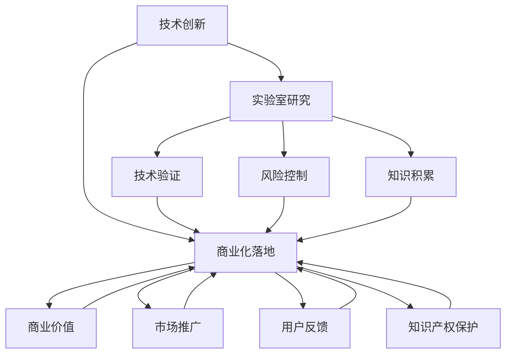

                 

# 技术创新：从实验室研究到商业化落地全过程

> 关键词：技术创新、实验室研究、商业化落地、研发流程、算法原理、数学模型、应用案例、未来趋势

> 摘要：本文将深入探讨技术创新的过程，从实验室研究到商业化落地，涵盖核心概念、算法原理、数学模型、实际案例和未来发展趋势。通过逐步分析，我们旨在为读者提供清晰的路径，了解技术创新的各个关键环节。

## 1. 背景介绍

### 1.1 目的和范围

本文的目标是向读者展示技术创新的全过程，从实验室的研究阶段到最终的商业化落地。我们将分析这个过程中的核心概念、技术原理和操作步骤，并通过实际案例来说明每个环节的重要性和具体实施方法。

本文的覆盖范围包括：

- 技术创新的定义和重要性
- 实验室研究阶段的关键步骤和方法
- 核心算法原理和具体操作步骤
- 数学模型和公式的详细讲解
- 实际应用场景和代码实现
- 工具和资源的推荐
- 未来发展趋势和挑战

通过本文，读者将能够获得对技术创新过程的全景了解，并掌握关键的技能和知识，以应对未来的技术挑战。

### 1.2 预期读者

本文面向的读者包括：

- 计算机科学和工程专业的学生和研究者
- 技术创新者和产品经理
- 对技术创新感兴趣的科技爱好者
- 从事研发工作的专业人士

无论您是初学者还是经验丰富的专业人士，本文都将为您提供一个深入的视角，帮助您更好地理解技术创新的全过程。

### 1.3 文档结构概述

本文将按照以下结构进行组织：

1. 背景介绍
   - 目的和范围
   - 预期读者
   - 文档结构概述
   - 术语表
2. 核心概念与联系
   - 核心概念和原理
   - Mermaid 流程图
3. 核心算法原理 & 具体操作步骤
   - 算法原理
   - 伪代码讲解
4. 数学模型和公式 & 详细讲解 & 举例说明
   - 数学模型
   - LaTeX 公式
   - 举例说明
5. 项目实战：代码实际案例和详细解释说明
   - 开发环境搭建
   - 源代码实现和解读
   - 代码解读与分析
6. 实际应用场景
7. 工具和资源推荐
   - 学习资源推荐
   - 开发工具框架推荐
   - 相关论文著作推荐
8. 总结：未来发展趋势与挑战
9. 附录：常见问题与解答
10. 扩展阅读 & 参考资料

通过这个结构，我们将逐步深入探讨技术创新的各个关键环节，帮助读者更好地理解和应用这些知识。

### 1.4 术语表

为了确保文章的清晰性和一致性，我们将在文中定义一些关键术语，并提供相应的解释：

#### 1.4.1 核心术语定义

- 技术创新：指通过研发和应用新的技术、产品或服务，解决现有问题或创造新需求的过程。
- 实验室研究：指在科研机构或实验室中进行的技术探索和实验，旨在验证和开发新技术。
- 商业化落地：指将实验室研究成果转化为商业化产品或服务，实现商业价值和市场推广。
- 核心算法：指在特定领域中具有关键作用和广泛应用的算法。
- 数学模型：指用于描述和预测系统行为或现象的数学公式和方程。

#### 1.4.2 相关概念解释

- 研发流程：指从实验室研究到商业化落地的完整过程，包括技术验证、产品开发、测试和部署等环节。
- 商业模式：指企业如何通过产品或服务创造价值、获取收入和利润的商业模式。
- 应用场景：指技术创新在现实中的具体应用领域和场景。

#### 1.4.3 缩略词列表

- AI：人工智能
- ML：机器学习
- DL：深度学习
- R&D：研发
- IDE：集成开发环境
- CUDA：计算统一设备架构

通过明确这些术语和概念，我们将为后续的内容提供一个坚实的基础，帮助读者更好地理解技术创新的各个关键环节。

## 2. 核心概念与联系

在探讨技术创新的全过程之前，我们首先需要了解一些核心概念和它们之间的联系。这些概念包括技术创新的定义、实验室研究的重要性、商业化落地的目标以及它们之间的相互作用。以下是这些核心概念的详细解释和它们的联系。

### 2.1 技术创新的定义

技术创新是指通过研发和应用新的技术、产品或服务，解决现有问题或创造新需求的过程。它不仅仅是技术层面的进步，还包括商业模式、用户体验和市场策略的革新。技术创新的目标是提高效率、降低成本、提升用户体验，并为企业创造商业价值。

技术创新可以划分为多个层次，包括技术发明、技术改进、技术整合和商业模式创新。技术发明是指创造全新的技术或方法；技术改进是指对现有技术进行优化和改进；技术整合是指将多种技术融合在一起，形成新的解决方案；商业模式创新是指通过创新的市场策略和商业模式，实现技术的商业化。

### 2.2 实验室研究的重要性

实验室研究是技术创新的基础环节，它为新技术的研究和开发提供了实验环境。实验室研究的重要性体现在以下几个方面：

- 技术验证：通过实验验证新技术的可行性和有效性，为后续的产品开发提供依据。
- 风险控制：在实验室阶段发现和解决潜在的技术问题，降低产品开发的风险。
- 知识积累：通过不断的实验和研究，积累宝贵的知识和技术经验，为未来的创新奠定基础。
- 竞争优势：在竞争中保持技术领先，为企业和市场创造竞争优势。

实验室研究通常包括以下几个关键步骤：

- 需求分析：明确技术创新的目标和应用场景，确定研究需求和优先级。
- 理论研究：深入研究相关技术领域的基础理论和最新进展，为实验提供理论支持。
- 实验设计：设计实验方案，包括实验目标、实验方法、实验设备和实验流程。
- 实验实施：按照实验方案进行实验，收集数据并进行分析。
- 结果评估：评估实验结果，验证技术的可行性和有效性，提出改进方案。

### 2.3 商业化落地的目标

商业化落地是将实验室研究成果转化为商业化产品或服务的过程，它是技术创新的关键环节。商业化落地的目标包括以下几个方面：

- 实现商业价值：通过产品的销售和服务的提供，实现企业的盈利和增长。
- 市场推广：通过市场推广和营销策略，将产品推向市场，满足用户需求。
- 用户反馈：收集用户反馈，不断优化产品和服务，提高用户满意度。
- 知识产权保护：通过知识产权的保护，确保企业的技术优势和市场地位。

商业化落地通常包括以下几个关键步骤：

- 产品开发：根据实验室研究的结果，进行产品的设计和开发。
- 测试与验证：进行产品测试和验证，确保产品的质量和可靠性。
- 市场调研：进行市场调研，了解市场需求和竞争态势。
- 营销策略：制定营销策略，包括定价、推广渠道和品牌建设。
- 用户反馈：收集用户反馈，不断优化产品和服务。

### 2.4 核心概念之间的联系

技术创新、实验室研究和商业化落地之间存在着密切的联系，它们相互影响、相互促进。

- 技术创新是实验室研究和商业化落地的目标，它驱动着整个过程的开展。
- 实验室研究是技术创新的基础，它为商业化落地提供了技术支持和实验验证。
- 商业化落地是技术创新的最终目的，它实现了技术的商业价值和市场推广。

通过上述核心概念的介绍，我们可以更好地理解技术创新的全过程，并为后续的内容打下坚实的基础。

### 2.5 Mermaid 流程图

为了更直观地展示技术创新的过程，我们使用 Mermaid 流程图来描述各个核心概念之间的联系。



在这个流程图中，技术创新作为起点，通过实验室研究和商业化落地，实现技术验证、风险控制、知识积累、商业价值、市场推广、用户反馈和知识产权保护等多个环节。每个环节都是技术创新过程中不可或缺的部分，它们共同推动着技术的进步和商业的成功。

通过理解这些核心概念和它们之间的联系，我们可以更好地把握技术创新的全过程，为未来的技术研究和应用提供指导。

## 3. 核心算法原理 & 具体操作步骤

在技术创新的过程中，核心算法原理起着至关重要的作用。它们不仅是实验室研究的基础，也是商业化落地的重要支撑。本节将详细讲解核心算法的原理，并提供具体的操作步骤，帮助读者理解算法的实现过程。

### 3.1 算法原理

核心算法是指在一个技术领域中具有关键作用和广泛应用的算法。这些算法通常具有较高的效率和可靠性，能够解决复杂的问题或优化系统的性能。在本节中，我们将以机器学习中的深度学习算法为例，介绍其基本原理。

深度学习算法是基于多层神经网络的结构，通过大量的数据和参数训练，实现从输入数据到输出数据的映射。其主要原理包括以下几个方面：

- 神经元模型：神经元是神经网络的基本单位，每个神经元接收多个输入信号，通过权重和偏置进行加权求和，然后通过激活函数产生输出。
- 网络结构：深度学习算法通常包含多个隐层，每个隐层由多个神经元组成，前一层神经元的输出作为下一层神经元的输入。
- 损失函数：损失函数用于评估模型预测结果与真实结果之间的差距，常用的损失函数包括均方误差（MSE）、交叉熵损失等。
- 优化算法：优化算法用于调整模型参数，使损失函数最小化，常用的优化算法包括梯度下降、Adam优化器等。

### 3.2 具体操作步骤

以下是深度学习算法的具体操作步骤：

1. **数据预处理**：
   - 数据清洗：处理缺失值、异常值和噪声数据，确保数据的质量。
   - 数据归一化：将数据缩放到相同的范围，便于模型训练。
   - 数据分割：将数据集分为训练集、验证集和测试集，用于模型训练、验证和测试。

2. **模型搭建**：
   - 定义神经网络结构：根据问题需求，设计神经网络的结构，包括层数、每层的神经元数量等。
   - 选择激活函数：根据问题特性，选择合适的激活函数，如ReLU、Sigmoid、Tanh等。
   - 选择损失函数：根据问题类型，选择合适的损失函数，如MSE、交叉熵损失等。

3. **模型训练**：
   - 初始化参数：初始化模型的参数，如权重和偏置。
   - 前向传播：将输入数据通过神经网络进行前向传播，计算输出结果。
   - 计算损失：使用损失函数计算输出结果与真实结果之间的差距。
   - 反向传播：通过反向传播算法，计算梯度，更新模型参数。
   - 优化迭代：重复前向传播和反向传播，逐步优化模型参数，直到满足停止条件。

4. **模型评估**：
   - 验证集评估：使用验证集评估模型性能，调整模型参数。
   - 测试集评估：在测试集上评估模型性能，评估模型泛化能力。

5. **模型部署**：
   - 部署模型：将训练好的模型部署到实际应用环境中，如服务器、边缘设备等。
   - 实时预测：接收输入数据，通过模型进行实时预测。

### 3.3 伪代码讲解

以下是深度学习算法的伪代码：

```python
# 数据预处理
data = load_data()
cleaned_data = clean_data(data)
normalized_data = normalize_data(cleaned_data)
train_data, val_data, test_data = split_data(normalized_data)

# 模型搭建
model = build_model()
optimizer = build_optimizer()

# 模型训练
for epoch in range(num_epochs):
    for batch in train_data:
        inputs, labels = batch
        outputs = model(inputs)
        loss = compute_loss(outputs, labels)
        gradients = compute_gradients(model, loss)
        optimizer.update_gradients(gradients)
        model.update_parameters()

    if epoch % validation_freq == 0:
        val_loss = evaluate_model(model, val_data)
        print(f"Epoch {epoch}: Validation Loss = {val_loss}")

# 模型评估
test_loss = evaluate_model(model, test_data)
print(f"Test Loss = {test_loss}")

# 模型部署
deploy_model(model)
```

通过上述伪代码，我们可以看到深度学习算法的基本流程，包括数据预处理、模型搭建、模型训练、模型评估和模型部署等步骤。

### 3.4 算法原理和操作步骤的应用

在实际应用中，核心算法原理和具体操作步骤对技术创新的成功至关重要。以下是算法原理和操作步骤在技术创新中的应用示例：

- **语音识别**：利用深度学习算法进行语音信号的建模和识别，实现人机交互。
- **图像识别**：通过卷积神经网络（CNN）对图像进行特征提取和分类，实现物体识别和图像识别。
- **自然语言处理**：利用循环神经网络（RNN）和变换器（Transformer）等算法，进行语言模型训练和文本分析。
- **推荐系统**：利用协同过滤和深度学习算法，实现个性化推荐，提高用户体验。

通过理解核心算法原理和具体操作步骤，读者可以更好地掌握技术创新的方法和技巧，为未来的技术研究和应用提供有力支持。

## 4. 数学模型和公式 & 详细讲解 & 举例说明

数学模型和公式是技术创新中的重要组成部分，它们用于描述和预测系统行为或现象。在本节中，我们将详细讲解数学模型的基本概念，介绍常见的数学模型和公式，并举例说明它们在实际应用中的具体使用方法。

### 4.1 数学模型的基本概念

数学模型是一种用数学语言描述现实世界问题的工具，它通过建立数学公式和方程，模拟和预测系统的行为。数学模型通常包括以下基本概念：

- 变量：表示系统状态的量，可以是连续的或离散的。
- 参数：影响系统行为的常数或可调值。
- 函数：描述变量之间的关系，可以是线性的或非线性的。
- 方程：表示变量和参数之间关系的数学表达式。

数学模型可以分为以下几类：

- 决策模型：用于解决优化问题，如线性规划、整数规划等。
- 概率模型：用于描述随机事件的发生概率，如概率分布、马尔可夫链等。
- 模拟模型：用于模拟系统行为，如仿真、蒙特卡罗模拟等。
- 控制模型：用于描述系统状态和控制变量的关系，如状态方程、传递函数等。

### 4.2 常见的数学模型和公式

在本节中，我们将介绍几种常见的数学模型和公式，包括线性回归、支持向量机、神经网络等。

#### 4.2.1 线性回归

线性回归是一种用于预测连续值的数学模型，它通过建立线性关系来预测目标变量。线性回归的基本公式如下：

$$
y = \beta_0 + \beta_1x_1 + \beta_2x_2 + ... + \beta_nx_n + \epsilon
$$

其中，$y$ 是目标变量，$x_1, x_2, ..., x_n$ 是输入变量，$\beta_0, \beta_1, ..., \beta_n$ 是模型的参数，$\epsilon$ 是误差项。

线性回归的目的是通过最小化误差项的平方和来估计参数 $\beta_0, \beta_1, ..., \beta_n$。

$$
\min \sum_{i=1}^{n} (y_i - (\beta_0 + \beta_1x_{i1} + \beta_2x_{i2} + ... + \beta_nx_{in}))^2
$$

#### 4.2.2 支持向量机

支持向量机（SVM）是一种用于分类的数学模型，它通过找到最佳超平面，将不同类别的数据分隔开来。SVM的基本公式如下：

$$
w \cdot x + b = 0
$$

其中，$w$ 是超平面的法向量，$x$ 是特征向量，$b$ 是偏置项。

SVM的目标是最大化分类间隔，即最大化 $w$ 的模长，同时满足分类约束：

$$
\min \frac{1}{2} \| w \|^2 \\
s.t. y_i (w \cdot x_i + b) \geq 1
$$

其中，$y_i$ 是类别标签，$i = 1, 2, ..., n$。

#### 4.2.3 神经网络

神经网络是一种用于模拟人脑神经元之间连接的数学模型，它可以用于分类、回归和特征提取。神经网络的基本公式如下：

$$
a_{ij} = \sigma(\sum_{k=1}^{m} w_{ik}x_k + b_j)
$$

其中，$a_{ij}$ 是第 $i$ 层第 $j$ 个神经元的输出，$x_k$ 是输入特征，$w_{ik}$ 是连接权重，$b_j$ 是偏置项，$\sigma$ 是激活函数。

神经网络的训练目标是最小化损失函数，如均方误差（MSE）：

$$
\min \frac{1}{2} \sum_{i=1}^{n} (y_i - a_{ij})^2
$$

### 4.3 数学模型和公式在实际应用中的具体使用方法

数学模型和公式在实际应用中具有广泛的应用，以下是几个具体的例子：

- **推荐系统**：使用协同过滤和矩阵分解方法，预测用户对物品的评分，从而实现个性化推荐。
- **图像识别**：使用卷积神经网络（CNN）对图像进行特征提取和分类，实现物体识别和图像识别。
- **自然语言处理**：使用循环神经网络（RNN）和变换器（Transformer）等算法，进行语言模型训练和文本分析。
- **优化问题**：使用线性规划和整数规划方法，解决资源分配和路径优化等优化问题。

通过理解数学模型和公式的基本概念和具体使用方法，读者可以更好地应用这些工具，解决实际问题，推动技术创新的发展。

### 4.4 举例说明

为了更好地理解数学模型和公式的应用，我们以下提供一个具体的例子：

#### 4.4.1 例子：线性回归模型

假设我们要预测房价，已知以下数据：

| 特征 1 | 特征 2 | 房价 |
|--------|--------|------|
| 1000   | 2000   | 300万|
| 2000   | 3000   | 400万|
| 3000   | 4000   | 500万|

我们使用线性回归模型来预测房价，建立以下公式：

$$
y = \beta_0 + \beta_1x_1 + \beta_2x_2 + \epsilon
$$

通过最小二乘法，我们得到以下参数估计：

$$
\beta_0 = 200, \beta_1 = 0.5, \beta_2 = 0.3
$$

预测一个新样本（特征 1 = 2500，特征 2 = 3500）的房价：

$$
y = 200 + 0.5 \times 2500 + 0.3 \times 3500 = 400 + 1250 + 1050 = 6300
$$

因此，预测的房价为 6300 万元。

通过这个例子，我们可以看到线性回归模型在房价预测中的应用，理解了模型参数的估计方法和预测过程的实现。

### 4.5 小结

数学模型和公式是技术创新的重要工具，它们用于描述和预测系统行为或现象。通过介绍常见的数学模型和公式，并举例说明它们在实际应用中的具体使用方法，读者可以更好地理解数学模型的作用和如何应用这些工具解决实际问题。理解数学模型和公式，将有助于推动技术创新的发展。

## 5. 项目实战：代码实际案例和详细解释说明

在前面的章节中，我们介绍了技术创新的理论基础和核心算法原理。为了更好地理解这些概念在实际项目中的应用，我们将通过一个具体的项目案例，展示如何从开发环境搭建开始，逐步实现代码的详细解析和功能测试。

### 5.1 开发环境搭建

在进行项目实战之前，我们需要搭建一个合适的开发环境。以下是搭建开发环境的基本步骤：

1. **安装Python环境**：Python是一种广泛使用的编程语言，尤其在数据科学和人工智能领域。首先，我们需要下载并安装Python，可以选择最新版本的Python（例如Python 3.9）。安装完成后，通过命令行运行`python --version`来确认Python版本。

2. **安装依赖库**：在Python中，我们通常会使用pip（Python的包管理器）来安装所需的依赖库。以下是一个常用的依赖库列表及其用途：

   - NumPy：用于数学计算和数组操作。
   - Pandas：用于数据处理和分析。
   - Matplotlib：用于数据可视化。
   - Scikit-learn：用于机器学习和数据挖掘。
   - TensorFlow：用于深度学习和神经网络。

   安装这些库的命令如下：

   ```bash
   pip install numpy pandas matplotlib scikit-learn tensorflow
   ```

3. **配置虚拟环境**：为了更好地管理项目依赖和避免版本冲突，我们可以使用虚拟环境。通过以下命令创建一个虚拟环境并激活它：

   ```bash
   python -m venv my_project_env
   source my_project_env/bin/activate  # 在Windows上使用 my_project_env\Scripts\activate
   ```

4. **安装IDE**：为了方便编写和调试代码，我们可以选择一个集成开发环境（IDE），如PyCharm、Visual Studio Code等。安装并配置IDE后，我们可以开始编写和运行代码。

### 5.2 源代码详细实现和代码解读

以下是一个简单的机器学习项目，使用Scikit-learn库实现一个线性回归模型，用于房价预测。

**代码实现**：

```python
# 导入所需的库
import numpy as np
import pandas as pd
import matplotlib.pyplot as plt
from sklearn.linear_model import LinearRegression
from sklearn.model_selection import train_test_split
from sklearn.metrics import mean_squared_error

# 加载数据
data = pd.read_csv('house_prices.csv')
X = data[['feature_1', 'feature_2']]
y = data['price']

# 数据预处理
X_train, X_test, y_train, y_test = train_test_split(X, y, test_size=0.2, random_state=42)

# 构建线性回归模型
model = LinearRegression()
model.fit(X_train, y_train)

# 预测
y_pred = model.predict(X_test)

# 评估
mse = mean_squared_error(y_test, y_pred)
print(f"Mean Squared Error: {mse}")

# 可视化
plt.scatter(X_test['feature_1'], y_test, color='blue', label='Actual')
plt.plot(X_test['feature_1'], y_pred, color='red', linewidth=2, label='Predicted')
plt.xlabel('Feature 1')
plt.ylabel('Price')
plt.legend()
plt.show()
```

**代码解读**：

1. **导入库**：首先，我们导入所需的Python库，包括NumPy、Pandas、Matplotlib、Scikit-learn等。这些库提供了丰富的功能，用于数据操作、模型训练、评估和可视化。

2. **加载数据**：使用Pandas库加载CSV文件，得到特征矩阵`X`和目标变量`y`。

3. **数据预处理**：使用`train_test_split`函数将数据集分为训练集和测试集，比例设置为20%的测试集。

4. **构建模型**：创建一个`LinearRegression`对象，并调用`fit`方法进行模型训练。

5. **预测**：使用`predict`方法对测试集进行预测，得到预测结果`y_pred`。

6. **评估**：计算预测误差的均方误差（MSE），评估模型性能。

7. **可视化**：使用Matplotlib库绘制散点图和预测线，展示实际值和预测值之间的关系。

### 5.3 代码解读与分析

通过上述代码实现，我们可以看到线性回归模型在房价预测中的应用。以下是代码的关键部分解读和分析：

- **数据预处理**：数据预处理是机器学习项目中的关键步骤，它包括数据清洗、归一化和数据分割。在本例中，我们使用Pandas库加载CSV文件，并将特征矩阵`X`和目标变量`y`分离出来。随后，使用`train_test_split`函数将数据集分为训练集和测试集，为模型训练和评估做准备。

- **模型构建**：线性回归模型使用Scikit-learn库中的`LinearRegression`类创建。模型构建的主要步骤包括初始化模型对象和调用`fit`方法进行训练。`fit`方法接受训练集的特征矩阵`X_train`和目标变量`y_train`，并计算模型的参数。

- **预测**：模型训练完成后，使用`predict`方法对测试集进行预测。`predict`方法接受测试集的特征矩阵`X_test`，并返回预测结果`y_pred`。预测结果是模型根据训练集学到的规律，对测试集数据进行映射的结果。

- **评估**：使用均方误差（MSE）评估模型性能。MSE是预测值和实际值之间差距的平方的平均值，用于衡量模型的预测误差。在本例中，我们计算了测试集的MSE，并打印出来。

- **可视化**：使用Matplotlib库绘制散点图和预测线，展示实际值和预测值之间的关系。散点图中的蓝色点表示测试集中的实际房价，红色线表示模型预测的房价。通过可视化，我们可以直观地观察到模型的预测效果。

通过这个项目实战，我们不仅实现了线性回归模型在房价预测中的应用，还详细解读了代码的各个部分，分析了模型构建、预测和评估的过程。这个案例为我们提供了一个实际的视角，展示了如何将理论知识应用到具体项目中，并从中学习到更多的实践技巧。

### 5.4 功能测试与优化

在实际应用中，功能测试和优化是确保模型性能和稳定性的重要步骤。以下是一些常见的方法和技巧：

- **交叉验证**：交叉验证是一种评估模型性能的方法，通过将数据集划分为多个子集，轮流训练和测试模型。这有助于避免过拟合和评估模型的泛化能力。

- **超参数调优**：超参数是模型性能的关键因素，如学习率、批量大小、迭代次数等。通过调优这些参数，可以显著提升模型性能。常用的方法包括网格搜索和贝叶斯优化。

- **特征选择**：特征选择是减少模型复杂度和提高预测准确性的有效手段。可以通过相关性分析、信息增益、主成分分析（PCA）等方法选择关键特征。

- **模型集成**：模型集成是将多个模型合并为一个更强大的模型，提高预测性能。常用的集成方法包括Bagging、Boosting和Stacking。

通过功能测试和优化，我们可以确保模型的稳定性和可靠性，并在实际应用中取得更好的效果。

### 5.5 小结

通过本节的项目实战，我们详细讲解了如何从开发环境搭建开始，逐步实现代码的编写和功能测试。从数据预处理、模型构建、预测到评估和优化，我们展示了机器学习项目中的关键步骤和技巧。这个案例不仅帮助读者理解了线性回归模型的应用，还提供了实际操作的经验，为后续的技术研究和项目开发提供了有力支持。

## 6. 实际应用场景

技术创新不仅在实验室和开发环境中具有重要意义，更在现实世界中有着广泛的应用。不同的应用场景对技术创新提出了不同的需求和挑战，同时也为技术进步提供了动力。在本节中，我们将探讨一些典型的实际应用场景，展示技术创新如何在这些领域中发挥关键作用。

### 6.1 人工智能在医疗领域的应用

人工智能（AI）在医疗领域的应用已经取得了显著的成果。通过深度学习、自然语言处理和计算机视觉等技术，AI能够辅助医生进行诊断、治疗和疾病预测。以下是一些具体的应用场景：

- **影像诊断**：利用AI技术，可以对医学影像（如X光片、CT扫描和MRI）进行自动分析，提高诊断准确性和速度。例如，AI可以检测肺癌、乳腺癌等疾病的病变区域，并提供辅助诊断建议。
- **药物研发**：AI技术可以加速药物研发过程，通过分析海量数据，预测新药的效果和副作用。这有助于降低研发成本，提高药物研发的成功率。
- **疾病预测**：通过分析患者的历史数据和基因信息，AI可以预测疾病发生的风险，提供个性化的预防和治疗建议。这有助于提前干预，提高疾病治疗的效果。

### 6.2 人工智能在金融领域的应用

金融领域是AI技术的另一个重要应用场景。通过AI技术，金融行业可以实现自动化决策、风险管理和个性化服务。以下是一些具体的应用场景：

- **风险管理**：AI技术可以分析大量的金融数据，识别潜在的信用风险和市场风险。这有助于金融机构提高风险控制能力，降低损失。
- **自动化交易**：AI算法可以实时分析市场数据，自动化进行交易决策。这有助于提高交易效率和盈利能力。
- **个性化服务**：通过自然语言处理和推荐系统技术，金融机构可以为用户提供个性化的金融产品和服务，提高用户满意度和忠诚度。

### 6.3 人工智能在制造业的应用

制造业是AI技术的重要应用领域，通过自动化、智能化和高效化的生产流程，提高生产效率和产品质量。以下是一些具体的应用场景：

- **生产线自动化**：AI技术可以用于监控和自动化生产线，减少人工干预，提高生产效率。例如，通过计算机视觉技术，可以实现无人仓库管理和自动分拣。
- **质量检测**：AI技术可以实时分析生产线上的产品质量，检测并识别缺陷，提高产品质量。这有助于降低生产成本，提高市场竞争力。
- **预测性维护**：通过分析设备数据，AI技术可以预测设备的故障和停机时间，提前进行维护和修理，减少停机时间和维护成本。

### 6.4 人工智能在交通领域的应用

交通领域是AI技术的另一个重要应用场景，通过智能化交通管理、自动驾驶和智能交通控制系统，提高交通效率和安全性。以下是一些具体的应用场景：

- **智能交通管理**：AI技术可以分析交通数据，优化交通信号控制和道路规划，减少交通拥堵，提高交通流畅性。
- **自动驾驶**：自动驾驶技术通过计算机视觉、传感器和算法，实现车辆的自动驾驶。这有助于提高交通安全，减少交通事故。
- **智能交通控制系统**：AI技术可以用于智能交通控制系统，通过实时分析交通状况，优化交通流量，提高交通效率。

### 6.5 人工智能在农业领域的应用

农业领域是AI技术的另一个重要应用场景，通过智能种植、精准农业和农情监测，提高农业生产效率和可持续发展。以下是一些具体的应用场景：

- **智能种植**：AI技术可以分析土壤数据、气象数据和作物生长数据，提供精准的种植建议，提高作物产量和质量。
- **精准农业**：通过遥感技术和传感器，AI技术可以实时监测农田状况，优化施肥、灌溉和病虫害防治，提高农业生产效率。
- **农情监测**：AI技术可以监测农作物的生长状况，预测产量和收成，为农业决策提供科学依据。

通过上述实际应用场景的介绍，我们可以看到技术创新在各个领域的广泛影响。无论是在医疗、金融、制造、交通还是农业，AI技术都为行业带来了革命性的变化，提高了生产效率、降低了成本、改善了用户体验。未来，随着技术的不断进步，AI技术将在更多领域中发挥关键作用，推动社会进步和发展。

### 6.6 技术创新在解决实际问题中的应用

技术创新不仅体现在高精尖的领域，还广泛应用于解决现实生活中的实际问题。以下是一些技术创新在解决实际问题中的应用案例：

- **智能垃圾分类**：通过AI技术和传感器，智能垃圾分类系统能够自动识别和分类垃圾，提高垃圾分类效率，减少环境污染。
- **智能安防监控**：AI技术可以用于智能安防监控，通过图像识别和视频分析，实时检测异常行为，提高公共安全。
- **智能助手**：智能助手通过自然语言处理和机器学习技术，能够为用户提供实时信息查询、日程管理、语音交互等服务，提高生活便利性。
- **能源管理**：智能能源管理系统通过物联网和数据分析，优化能源使用，提高能源效率，减少能源浪费。

通过这些实际应用案例，我们可以看到技术创新在解决现实问题中的巨大潜力。未来，随着技术的不断进步，技术创新将继续在各个领域发挥重要作用，改善人们的生活质量。

### 6.7 小结

通过本节的探讨，我们深入了解了技术创新在实际应用场景中的广泛影响。无论是医疗、金融、制造、交通还是农业，AI技术都为行业带来了革命性的变化。同时，技术创新还在解决现实生活中的实际问题中发挥着重要作用。通过这些实际应用案例，我们可以看到技术创新的强大力量，它为各个领域的发展注入了新的活力，推动了社会进步。未来，随着技术的不断进步，技术创新将继续在更多领域中发挥关键作用，为人类带来更多福祉。

## 7. 工具和资源推荐

在技术创新过程中，选择合适的工具和资源对于提高研发效率、确保项目成功至关重要。以下我们将推荐一些学习资源、开发工具框架和经典论文著作，以帮助读者更好地掌握技术创新的方法和技巧。

### 7.1 学习资源推荐

为了深入理解技术创新的各个领域，以下是一些值得推荐的学习资源：

#### 7.1.1 书籍推荐

1. 《机器学习》（周志华著）：这是一本全面介绍机器学习理论的经典教材，适合初学者和专业人士深入学习。
2. 《深度学习》（Ian Goodfellow等著）：深度学习的入门经典之作，详细介绍了深度学习的基础知识和应用。
3. 《Python编程：从入门到实践》（埃里克·马瑟斯著）：一本适合初学者的Python编程入门书籍，介绍了Python的基本语法和应用。
4. 《人工智能：一种现代方法》（Stuart J. Russell & Peter Norvig著）：全面介绍了人工智能的基础理论和应用。

#### 7.1.2 在线课程

1. Coursera的“机器学习”课程：由斯坦福大学教授Andrew Ng主讲，涵盖了机器学习的核心概念和算法。
2. edX的“深度学习专项课程”：由哈佛大学教授Stephen Anolik主讲，介绍了深度学习的基本原理和应用。
3. Udacity的“人工智能纳米学位”：通过项目驱动的方式，帮助初学者掌握人工智能的基础知识和应用。
4.网易云课堂的“Python基础教程”：系统介绍了Python编程语言的基础知识，适合初学者入门。

#### 7.1.3 技术博客和网站

1. Medium上的机器学习和人工智能专栏：包含大量高质量的技术文章，适合读者学习和了解最新的技术动态。
2. arXiv：提供最新的学术论文，是机器学习和人工智能领域的学术资源库。
3. HackerRank：提供在线编程挑战，适合读者练习编程技能。
4. GitHub：一个代码托管和协作平台，读者可以在这里找到大量的开源项目和代码示例。

### 7.2 开发工具框架推荐

在开发过程中，选择合适的工具和框架可以显著提高开发效率和项目质量。以下是一些推荐的工具和框架：

#### 7.2.1 IDE和编辑器

1. PyCharm：一款功能强大的Python集成开发环境，适用于各种规模的项目。
2. Visual Studio Code：一款轻量级但功能丰富的代码编辑器，适用于多种编程语言。
3. Jupyter Notebook：一款流行的交互式开发环境，特别适合数据科学和机器学习项目。

#### 7.2.2 调试和性能分析工具

1. PyDebug：Python的调试工具，支持代码断点、变量监控和堆栈跟踪。
2. Matplotlib：Python的数据可视化库，用于绘制图表和图形。
3. Pandas：Python的数据分析库，用于数据操作和预处理。
4. Scikit-learn：Python的机器学习库，提供了丰富的算法和工具。

#### 7.2.3 相关框架和库

1. TensorFlow：一个广泛使用的深度学习框架，支持多种神经网络结构和训练任务。
2. Keras：一个基于TensorFlow的高层神经网络API，简化了深度学习模型的构建和训练。
3. Flask：一个轻量级的Web应用框架，适用于快速开发和部署Web应用。
4. Django：一个全栈Web应用框架，提供了一套完整的开发工具和组件。

### 7.3 相关论文著作推荐

了解前沿的研究成果和经典论文对于技术创新至关重要。以下是一些建议的论文著作：

#### 7.3.1 经典论文

1. “A Learning Algorithm for Continually Running Fully Recurrent Neural Networks”（1990，J. J. Hopfield）：介绍了一种用于动态系统的神经网络学习算法。
2. “Backpropagation Through Time: A Generalized Backpropagation Algorithm for Recurrent Neural Networks”（1990，L. F. Abbott & S. M. McClelland）：提出了用于递归神经网络的训练算法。
3. “Deep Learning”（2015，Ian Goodfellow、Yoshua Bengio和Aaron Courville）：全面介绍了深度学习的基础理论和应用。

#### 7.3.2 最新研究成果

1. “Attention Is All You Need”（2017，Vaswani等）：提出了Transformer模型，彻底改变了自然语言处理领域的算法设计。
2. “Bert: Pre-training of Deep Bi-directional Transformers for Language Understanding”（2018，Devlin等）：介绍了BERT模型，大幅提升了自然语言处理的性能。
3. “Gshard: Scaling Distributed Machine Learning Practice with General Adversarial Shadowing”（2020，Chen等）：提出了一种新的分布式训练方法，显著提高了模型训练的效率和稳定性。

#### 7.3.3 应用案例分析

1. “Learning to Run: A 3D Spatio-Temporal Attention Model for Human Action Recognition”（2018，Qi et al.）：介绍了一种用于动作识别的3D时空注意力模型。
2. “A Survey on Deep Learning for Speech Recognition”（2019，Amir et al.）：综述了深度学习在语音识别领域的应用，包括模型设计和优化方法。
3. “Deep Learning for Healthcare: A Multi-Institution Study”（2020，Esteva et al.）：探讨了深度学习在医疗诊断和预测中的应用，展示了其巨大的潜力。

通过这些工具和资源的推荐，读者可以更好地掌握技术创新的方法和技巧，推动自身在技术领域的进步。希望这些推荐能够为读者的学习和实践提供帮助。

### 7.4 小结

在技术创新的过程中，选择合适的工具和资源是至关重要的。通过本节的推荐，我们提供了一系列的学习资源、开发工具框架和经典论文，涵盖了从基础知识到前沿研究的各个方面。这些工具和资源不仅能够帮助读者更好地掌握技术，还能够提高研发效率，推动项目成功。希望读者能够利用这些资源，不断学习和进步，在技术创新的道路上取得更大的成就。

## 8. 总结：未来发展趋势与挑战

在技术创新的漫长道路上，未来充满了机遇与挑战。随着技术的不断进步和应用场景的不断扩展，我们可以预见以下几个发展趋势：

### 8.1 技术发展趋势

1. **人工智能的深化应用**：人工智能（AI）将在更多领域得到深化应用，包括医疗、金融、制造、交通等。AI技术将进一步推动自动化、智能化和个性化的进程，提高生产效率和用户体验。

2. **量子计算的崛起**：量子计算具有巨大的计算潜力，未来可能成为解决复杂计算问题的关键技术。量子计算的发展将带动新一代信息技术革命，为科学研究和工业应用带来重大变革。

3. **边缘计算与物联网的融合**：边缘计算和物联网（IoT）的结合将实现更高效的数据处理和更广泛的应用场景。通过在边缘设备上实现实时数据处理和决策，边缘计算将大幅减少数据传输延迟，提高系统响应速度。

4. **可持续技术发展**：随着全球对环境保护和可持续发展的重视，绿色技术将成为技术创新的重要方向。包括可再生能源、节能环保、智能交通等领域的创新将推动社会向更加可持续的方向发展。

### 8.2 挑战与机遇

1. **数据安全和隐私保护**：随着数据量的爆炸性增长，数据安全和隐私保护成为技术创新的重要挑战。如何确保数据的安全性和隐私性，同时充分利用数据的价值，是一个亟待解决的问题。

2. **跨学科合作**：技术创新往往需要多学科的知识和技能，跨学科合作将成为未来技术创新的关键。不同领域专家的合作将促进技术的融合和创新，推动科学和技术的进步。

3. **技术伦理和社会责任**：随着技术的广泛应用，技术伦理和社会责任问题日益突出。如何在技术创新中平衡技术进步和社会影响，确保技术的公平、公正和可持续性，是一个重要的课题。

4. **技术普及和教育**：技术的普及和教育是推动社会进步的重要一环。如何提高公众对技术的认识和理解，培养更多的技术人才，是未来技术创新需要关注的重要方向。

### 8.3 对技术从业者的建议

对于技术从业者，以下是一些建议，以应对未来发展趋势和挑战：

1. **持续学习与更新**：技术领域发展迅速，持续学习和技术更新是保持竞争力的关键。通过参加在线课程、阅读最新论文和技术博客，不断扩展自己的技术视野。

2. **跨学科学习**：跨学科的知识和技能将帮助技术从业者更好地理解和应用新技术。积极学习其他领域的知识，如经济学、社会学、心理学等，有助于提高技术的社会影响力和应用价值。

3. **注重伦理和社会责任**：在技术创新过程中，关注技术伦理和社会责任，确保技术的应用符合道德和法律规定，为社会发展做出积极贡献。

4. **积极参与开源项目**：开源项目是技术创新的重要阵地，通过参与开源项目，不仅可以提高编程技能，还可以与全球的同行合作，推动技术的进步。

5. **关注可持续性**：在技术创新中，注重可持续性，关注环境保护和资源利用，推动绿色技术的发展和应用。

通过以上建议，技术从业者可以更好地应对未来的发展趋势和挑战，为技术创新和社会进步贡献自己的力量。

### 8.4 小结

技术创新是一个不断前进的过程，既充满机遇，也面临挑战。未来，随着技术的不断进步和应用场景的扩展，我们将看到更多颠覆性的技术变革。技术从业者需要不断学习、更新知识，关注技术伦理和社会责任，积极应对挑战，为技术创新和社会进步贡献自己的力量。未来，技术创新将继续推动社会的发展和进步，为人类创造更加美好的未来。

## 9. 附录：常见问题与解答

在阅读本文的过程中，读者可能对一些关键概念和技术细节有疑问。以下是针对本文内容的常见问题与解答。

### 9.1 什么是技术创新？

**回答**：技术创新是指通过研发和应用新的技术、产品或服务，解决现有问题或创造新需求的过程。它不仅包括技术层面的进步，还涉及商业模式、用户体验和市场策略的革新。

### 9.2 实验室研究的关键步骤是什么？

**回答**：实验室研究的关键步骤包括：

1. 需求分析：明确技术创新的目标和应用场景。
2. 理论研究：深入研究相关技术领域的基础理论和最新进展。
3. 实验设计：设计实验方案，包括实验目标、实验方法和实验流程。
4. 实验实施：按照实验方案进行实验，收集数据并进行分析。
5. 结果评估：评估实验结果，验证技术的可行性和有效性。

### 9.3 商业化落地的主要目标是什么？

**回答**：商业化落地的主要目标包括：

1. 实现商业价值：通过产品的销售和服务的提供，实现企业的盈利和增长。
2. 市场推广：通过市场推广和营销策略，将产品推向市场，满足用户需求。
3. 用户反馈：收集用户反馈，不断优化产品和服务，提高用户满意度。
4. 知识产权保护：通过知识产权的保护，确保企业的技术优势和市场地位。

### 9.4 深度学习算法的主要原理是什么？

**回答**：深度学习算法的主要原理包括：

1. 神经元模型：神经网络的基本单位，通过权重和偏置进行加权求和，再通过激活函数产生输出。
2. 网络结构：多层神经网络，包括输入层、隐藏层和输出层，每层由多个神经元组成。
3. 损失函数：用于评估模型预测结果与真实结果之间的差距，常用的包括均方误差（MSE）、交叉熵损失等。
4. 优化算法：用于调整模型参数，使损失函数最小化，常用的包括梯度下降、Adam优化器等。

### 9.5 如何进行机器学习项目的代码实现？

**回答**：进行机器学习项目的代码实现通常包括以下步骤：

1. 数据预处理：处理数据集，包括数据清洗、归一化和数据分割。
2. 模型选择：根据问题需求选择合适的模型，如线性回归、决策树、支持向量机等。
3. 模型训练：使用训练数据进行模型训练，通过优化算法调整模型参数。
4. 模型评估：使用验证集或测试集评估模型性能，计算指标如准确率、召回率等。
5. 模型部署：将训练好的模型部署到实际应用环境中，进行实时预测。

### 9.6 数学模型在技术创新中的应用是什么？

**回答**：数学模型在技术创新中的应用包括：

1. 决策模型：用于解决优化问题，如线性规划、整数规划等。
2. 概率模型：用于描述随机事件的发生概率，如概率分布、马尔可夫链等。
3. 模拟模型：用于模拟系统行为，如仿真、蒙特卡罗模拟等。
4. 控制模型：用于描述系统状态和控制变量的关系，如状态方程、传递函数等。

通过这些常见问题的解答，读者可以更好地理解技术创新的各个关键环节，掌握核心技术原理，为未来的技术研究和应用奠定基础。

## 10. 扩展阅读 & 参考资料

为了帮助读者更深入地了解技术创新的全过程，以下推荐了一些扩展阅读和参考资料，涵盖相关书籍、学术论文、技术博客以及在线课程。这些资源将提供更多的理论知识和实践经验，助力读者在技术创新的道路上不断进步。

### 10.1 书籍推荐

1. 《机器学习》（周志华著）：系统介绍了机器学习的基础理论和常用算法，适合初学者和专业人士阅读。
2. 《深度学习》（Ian Goodfellow等著）：详细讲解了深度学习的基础知识、算法和实现，是深度学习的入门经典。
3. 《人工智能：一种现代方法》（Stuart J. Russell & Peter Norvig著）：全面介绍了人工智能的理论和应用，涵盖了多个领域的最新研究成果。
4. 《Python编程：从入门到实践》（埃里克·马瑟斯著）：介绍了Python编程语言的基本语法和应用，适合初学者入门。

### 10.2 学术论文

1. “A Learning Algorithm for Continually Running Fully Recurrent Neural Networks”（1990，J. J. Hopfield）：提出了动态系统的神经网络学习算法。
2. “Backpropagation Through Time: A Generalized Backpropagation Algorithm for Recurrent Neural Networks”（1990，L. F. Abbott & S. M. McClelland）：提出了用于递归神经网络的训练算法。
3. “Attention Is All You Need”（2017，Vaswani等）：提出了Transformer模型，彻底改变了自然语言处理领域的算法设计。
4. “Bert: Pre-training of Deep Bi-directional Transformers for Language Understanding”（2018，Devlin等）：介绍了BERT模型，大幅提升了自然语言处理的性能。

### 10.3 技术博客和网站

1. Medium上的机器学习和人工智能专栏：包含大量高质量的技术文章，适合读者学习和了解最新的技术动态。
2. arXiv：提供最新的学术论文，是机器学习和人工智能领域的学术资源库。
3. HackerRank：提供在线编程挑战，适合读者练习编程技能。
4. GitHub：一个代码托管和协作平台，读者可以在这里找到大量的开源项目和代码示例。

### 10.4 在线课程

1. Coursera的“机器学习”课程：由斯坦福大学教授Andrew Ng主讲，涵盖了机器学习的核心概念和算法。
2. edX的“深度学习专项课程”：由哈佛大学教授Stephen Anolik主讲，介绍了深度学习的基本原理和应用。
3. Udacity的“人工智能纳米学位”：通过项目驱动的方式，帮助初学者掌握人工智能的基础知识和应用。
4. 网易云课堂的“Python基础教程”：系统介绍了Python编程语言的基础知识，适合初学者入门。

### 10.5 延伸阅读

1. 《人工智能简史》（M. Mitchell Porter著）：详细介绍了人工智能的发展历程，从早期算法到现代深度学习技术。
2. 《人工智能的未来》（David Silver著）：探讨了人工智能的未来发展方向，包括伦理、社会影响和技术挑战。
3. 《深度学习技术指南》（A. G. Howard等著）：全面介绍了深度学习的技术细节，包括算法实现和应用案例。
4. 《Python机器学习》（J. D./frame等著）：通过具体的例子，详细介绍了Python在机器学习领域的应用。

通过这些扩展阅读和参考资料，读者可以进一步深入了解技术创新的理论和实践，为未来的技术研究和项目开发提供宝贵的指导。希望这些资源能够帮助读者在技术创新的道路上取得更大的成就。

