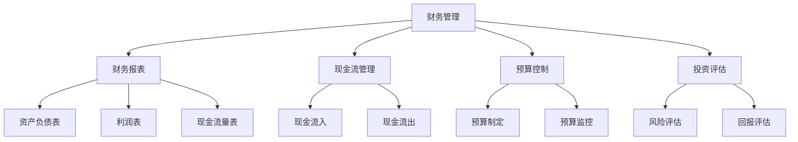

                 

# 技术型创业者如何快速掌握财务管理技能

> **关键词**：财务技能，创业者，财务管理，财务分析，技术型，商业策略，预算控制，现金流管理，投资评估，财务报表。

> **摘要**：本文旨在帮助技术型创业者快速掌握财务管理技能，通过明确的步骤和实用的方法，帮助他们更好地理解财务知识，做出明智的商业决策。文章首先介绍了财务管理的核心概念，然后详细讲解了财务分析的原理和操作步骤，最后推荐了实用的学习资源和工具。通过本文的指导，技术型创业者可以更高效地管理企业财务，为企业的长期发展奠定坚实的基础。

## 1. 背景介绍

### 1.1 目的和范围

本文的主要目的是为技术型创业者提供一套实用的财务管理技能学习框架。我们希望创业者能够通过本文的内容，快速掌握财务知识，理解财务分析的核心原理，并能够在实际业务中运用这些技能进行财务决策。

本文将涵盖以下几个方面的内容：

1. **核心概念与联系**：介绍财务管理的核心概念，并使用Mermaid流程图展示各概念之间的联系。
2. **核心算法原理 & 具体操作步骤**：讲解财务分析的基本算法原理，并提供详细的操作步骤。
3. **数学模型和公式 & 详细讲解 & 举例说明**：介绍财务分析中的数学模型和公式，并进行详细的解释和举例。
4. **项目实战：代码实际案例和详细解释说明**：通过实际代码案例，展示财务分析的具体实现过程。
5. **实际应用场景**：分析财务管理技能在实际业务中的应用。
6. **工具和资源推荐**：推荐学习资源和开发工具，帮助创业者更好地掌握财务管理技能。

### 1.2 预期读者

本文适合以下读者群体：

1. **技术型创业者**：对技术有深刻理解，但缺乏财务管理经验的创业者。
2. **企业管理者**：希望在财务方面有更深入理解的企业管理者。
3. **财务从业者**：希望提高财务管理技能的财务从业者。

### 1.3 文档结构概述

本文的结构如下：

1. **引言**：介绍财务管理的重要性，明确本文的目的和内容。
2. **背景介绍**：介绍财务管理的核心概念、目的和范围。
3. **核心概念与联系**：介绍财务管理的核心概念，并使用Mermaid流程图展示各概念之间的联系。
4. **核心算法原理 & 具体操作步骤**：讲解财务分析的基本算法原理，并提供详细的操作步骤。
5. **数学模型和公式 & 详细讲解 & 举例说明**：介绍财务分析中的数学模型和公式，并进行详细的解释和举例。
6. **项目实战：代码实际案例和详细解释说明**：通过实际代码案例，展示财务分析的具体实现过程。
7. **实际应用场景**：分析财务管理技能在实际业务中的应用。
8. **工具和资源推荐**：推荐学习资源和开发工具，帮助创业者更好地掌握财务管理技能。
9. **总结：未来发展趋势与挑战**：总结财务管理技能的重要性，展望未来发展趋势和挑战。
10. **附录：常见问题与解答**：解答读者可能遇到的常见问题。
11. **扩展阅读 & 参考资料**：提供扩展阅读和参考资料。

### 1.4 术语表

#### 1.4.1 核心术语定义

- **财务管理**：企业管理中的一个重要方面，涉及资金的筹集、运用和管理。
- **财务分析**：通过对企业财务报表、财务比率等进行分析，评估企业的财务状况。
- **现金流管理**：关注企业的现金流入和流出，确保企业的资金链稳定。
- **预算控制**：通过制定预算，监控企业实际支出，确保企业财务状况的健康。
- **投资评估**：评估潜在投资项目的风险和回报，决定是否进行投资。

#### 1.4.2 相关概念解释

- **财务报表**：包括资产负债表、利润表和现金流量表，反映企业的财务状况。
- **财务比率**：通过计算财务报表中的数据，评估企业的偿债能力、盈利能力等。
- **资产负债率**：企业负债总额与资产总额的比率，反映企业的财务风险。
- **净利润率**：净利润与营业收入的比率，反映企业的盈利能力。

#### 1.4.3 缩略词列表

- **ERP**：企业资源计划（Enterprise Resource Planning）
- **CRM**：客户关系管理（Customer Relationship Management）
- **AI**：人工智能（Artificial Intelligence）
- **ML**：机器学习（Machine Learning）
- **DL**：深度学习（Deep Learning）

## 2. 核心概念与联系

在财务管理中，有多个核心概念，这些概念相互关联，构成了一个完整的财务管理体系。为了更好地理解这些概念，我们可以使用Mermaid流程图来展示它们之间的联系。

下面是一个简化的Mermaid流程图：



### 财务管理

财务管理是企业管理和经营过程中的一个重要环节，涉及资金的筹集、运用和管理。通过财务管理，企业可以有效地规划资金流动，确保财务稳定和可持续发展。

### 财务报表

财务报表是企业财务状况的反映，包括资产负债表、利润表和现金流量表。这些报表提供企业的财务信息，帮助企业管理者和投资者评估企业的财务状况。

### 现金流管理

现金流管理关注企业的现金流入和流出，确保企业的资金链稳定。通过有效的现金流管理，企业可以避免资金短缺，提高资金利用效率。

### 预算控制

预算控制是企业制定预算，并监控实际支出，确保企业财务状况的健康。通过预算控制，企业可以合理安排资源，提高经营效率。

### 投资评估

投资评估是企业评估潜在投资项目的风险和回报，决定是否进行投资。通过投资评估，企业可以做出明智的投资决策，提高资金回报率。

### 财务报表

财务报表是企业财务状况的反映，包括资产负债表、利润表和现金流量表。这些报表提供企业的财务信息，帮助企业管理者和投资者评估企业的财务状况。

### 资产负债表

资产负债表反映企业的资产、负债和所有者权益，提供企业的财务状况。资产负债表中的数据可以帮助企业了解自身的资产结构和负债水平。

### 利润表

利润表反映企业的营业收入、成本费用和净利润，提供企业的盈利能力。利润表中的数据可以帮助企业分析经营成果，优化经营策略。

### 现金流量表

现金流量表反映企业的现金流入和流出，提供企业的现金流动情况。现金流量表中的数据可以帮助企业评估自身的现金流动性和支付能力。

### 现金流管理

现金流管理关注企业的现金流入和流出，确保企业的资金链稳定。通过有效的现金流管理，企业可以避免资金短缺，提高资金利用效率。

### 预算控制

预算控制是企业制定预算，并监控实际支出，确保企业财务状况的健康。通过预算控制，企业可以合理安排资源，提高经营效率。

### 投资评估

投资评估是企业评估潜在投资项目的风险和回报，决定是否进行投资。通过投资评估，企业可以做出明智的投资决策，提高资金回报率。

## 3. 核心算法原理 & 具体操作步骤

在财务管理中，财务分析是核心技能之一。财务分析主要通过计算财务报表中的数据，评估企业的财务状况。下面，我们将详细讲解财务分析的核心算法原理和具体操作步骤。

### 3.1 财务报表数据处理

首先，我们需要对财务报表进行数据处理。财务报表通常包含大量的数据，我们需要提取关键信息，并进行必要的预处理。

#### 3.1.1 数据提取

```python
def extract_data(finance_report):
    assets = finance_report['assets']
    liabilities = finance_report['liabilities']
    equity = finance_report['equity']
    revenue = finance_report['revenue']
    expenses = finance_report['expenses']
    net_income = revenue - expenses
    return assets, liabilities, equity, revenue, expenses, net_income
```

#### 3.1.2 数据预处理

```python
def preprocess_data(assets, liabilities, equity, revenue, expenses, net_income):
    total_assets = sum(assets.values())
    total_liabilities = sum(liabilities.values())
    total_equity = sum(equity.values())
    return total_assets, total_liabilities, total_equity, revenue, expenses, net_income
```

### 3.2 财务比率计算

财务比率是评估企业财务状况的重要指标。下面，我们将介绍几个常见的财务比率，并给出计算方法。

#### 3.2.1 资产负债率

```python
def calculate_debt_to_assets(total_liabilities, total_assets):
    debt_to_assets_ratio = total_liabilities / total_assets
    return debt_to_assets_ratio
```

#### 3.2.2 净利润率

```python
def calculate_net_income_margin(net_income, revenue):
    net_income_margin = net_income / revenue
    return net_income_margin
```

#### 3.2.3 应收账款周转率

```python
def calculate_account_receivable_turnover(revenue, average_account_receivable):
    account_receivable_turnover = revenue / average_account_receivable
    return account_receivable_turnover
```

### 3.3 财务分析

财务分析主要通过计算财务比率，评估企业的财务状况。下面，我们将介绍几个常用的财务分析方法。

#### 3.3.1 资产负债分析

```python
def analyze_debt_to_assets_ratio(debt_to_assets_ratio):
    if debt_to_assets_ratio < 0.5:
        return "负债水平较低，财务状况稳定"
    elif debt_to_assets_ratio < 0.7:
        return "负债水平适中，存在一定的财务风险"
    else:
        return "负债水平较高，财务状况较差"
```

#### 3.3.2 盈利能力分析

```python
def analyze_net_income_margin(net_income_margin):
    if net_income_margin > 0.1:
        return "盈利能力较强"
    elif net_income_margin > 0.05:
        return "盈利能力一般"
    else:
        return "盈利能力较弱"
```

#### 3.3.3 周转能力分析

```python
def analyze_account_receivable_turnover(account_receivable_turnover):
    if account_receivable_turnover > 10:
        return "应收账款周转较快，管理良好"
    elif account_receivable_turnover > 5:
        return "应收账款周转一般"
    else:
        return "应收账款周转较慢，存在管理问题"
```

### 3.4 财务报告

最后，我们将分析结果整合成一份财务报告，供企业管理者和投资者参考。

```python
def generate_finance_report(debt_to_assets_ratio, net_income_margin, account_receivable_turnover):
    report = f"""
    财务分析报告
    
    一、资产负债分析：
    资产负债率：{debt_to_assets_ratio}
    分析结果：{analyze_debt_to_assets_ratio(debt_to_assets_ratio)}
    
    二、盈利能力分析：
    净利润率：{net_income_margin}
    分析结果：{analyze_net_income_margin(net_income_margin)}
    
    三、周转能力分析：
    应收账款周转率：{account_receivable_turnover}
    分析结果：{analyze_account_receivable_turnover(account_receivable_turnover)}
    """
    return report
```

通过上述步骤，我们可以对企业的财务状况进行全面分析，为企业的决策提供有力支持。

## 4. 数学模型和公式 & 详细讲解 & 举例说明

在财务管理中，数学模型和公式是理解和分析财务数据的关键。下面，我们将介绍几个常见的数学模型和公式，并进行详细的讲解和举例说明。

### 4.1 财务比率

财务比率是通过计算财务报表中的数据，评估企业的财务状况的重要工具。以下是一些常见的财务比率及其公式：

#### 4.1.1 资产负债率

$$
\text{资产负债率} = \frac{\text{负债总额}}{\text{资产总额}}
$$

**示例**：假设某企业的负债总额为100万元，资产总额为500万元，则其资产负债率为：

$$
\text{资产负债率} = \frac{100}{500} = 0.2
$$

#### 4.1.2 净利润率

$$
\text{净利润率} = \frac{\text{净利润}}{\text{营业收入}}
$$

**示例**：假设某企业的净利润为20万元，营业收入为200万元，则其净利润率为：

$$
\text{净利润率} = \frac{20}{200} = 0.1
$$

#### 4.1.3 应收账款周转率

$$
\text{应收账款周转率} = \frac{\text{营业收入}}{\text{平均应收账款}}
$$

**示例**：假设某企业的营业收入为100万元，平均应收账款为50万元，则其应收账款周转率为：

$$
\text{应收账款周转率} = \frac{100}{50} = 2
$$

### 4.2 财务模型

财务模型是用于模拟和预测企业财务状况的工具。以下是一个简化的财务模型，包括收入、成本和利润：

#### 4.2.1 收入模型

$$
\text{收入} = \text{单价} \times \text{销售量}
$$

**示例**：假设某产品的单价为10元，销售量为1000件，则其收入为：

$$
\text{收入} = 10 \times 1000 = 10000 \text{元}
$$

#### 4.2.2 成本模型

$$
\text{成本} = \text{固定成本} + \text{可变成本}
$$

**示例**：假设某企业的固定成本为5000元，可变成本为每件5元，销售量为1000件，则其成本为：

$$
\text{成本} = 5000 + (5 \times 1000) = 10000 \text{元}
$$

#### 4.2.3 利润模型

$$
\text{利润} = \text{收入} - \text{成本}
$$

**示例**：根据上述收入和成本计算，该企业的利润为：

$$
\text{利润} = 10000 - 10000 = 0 \text{元}
$$

### 4.3 现金流模型

现金流模型用于预测企业的现金流入和流出，确保企业的资金链稳定。以下是一个简化的现金流模型：

#### 4.3.1 现金流入模型

$$
\text{现金流入} = \text{销售收入} + \text{其他收入}
$$

**示例**：假设某企业的销售收入为10000元，其他收入为2000元，则其现金流入为：

$$
\text{现金流入} = 10000 + 2000 = 12000 \text{元}
$$

#### 4.3.2 现金流出模型

$$
\text{现金流出} = \text{成本} + \text{其他支出}
$$

**示例**：假设某企业的成本为10000元，其他支出为3000元，则其现金流出为：

$$
\text{现金流出} = 10000 + 3000 = 13000 \text{元}
$$

#### 4.3.3 现金流量模型

$$
\text{现金流量} = \text{现金流入} - \text{现金流出}
$$

**示例**：根据上述现金流入和现金流出的计算，该企业的现金流量为：

$$
\text{现金流量} = 12000 - 13000 = -1000 \text{元}
$$

### 4.4 财务预测模型

财务预测模型用于预测企业的未来财务状况，为企业的战略规划提供依据。以下是一个简化的财务预测模型：

#### 4.4.1 收入预测模型

$$
\text{未来收入} = \text{当前收入} \times (1 + \text{增长率})
$$

**示例**：假设某企业的当前收入为10000元，增长率为10%，则其未来收入为：

$$
\text{未来收入} = 10000 \times (1 + 0.1) = 11000 \text{元}
$$

#### 4.4.2 成本预测模型

$$
\text{未来成本} = \text{当前成本} \times (1 + \text{增长率})
$$

**示例**：假设某企业的当前成本为10000元，增长率为5%，则其未来成本为：

$$
\text{未来成本} = 10000 \times (1 + 0.05) = 10500 \text{元}
$$

#### 4.4.3 利润预测模型

$$
\text{未来利润} = \text{未来收入} - \text{未来成本}
$$

**示例**：根据上述收入和成本的预测，该企业的未来利润为：

$$
\text{未来利润} = 11000 - 10500 = 500 \text{元}
$$

通过上述数学模型和公式，我们可以对企业的财务状况进行详细的分析和预测，为企业的决策提供有力支持。

## 5. 项目实战：代码实际案例和详细解释说明

为了更好地理解财务管理技能的应用，我们将通过一个实际项目案例，展示如何使用Python实现财务分析。以下是一个简化的财务分析项目，包括数据提取、财务比率计算和财务报告生成。

### 5.1 开发环境搭建

首先，我们需要搭建开发环境。在Python中，我们使用`pandas`库进行数据处理，`numpy`库进行数学计算，`matplotlib`库进行数据可视化。

1. 安装Python（建议使用Python 3.8及以上版本）。
2. 安装必要库：

```bash
pip install pandas numpy matplotlib
```

### 5.2 源代码详细实现和代码解读

#### 5.2.1 数据提取

```python
import pandas as pd

def extract_data(finance_report):
    # 读取财务报表数据
    df = pd.read_csv(finance_report)
    # 提取关键数据
    assets = df['资产'].values
    liabilities = df['负债'].values
    equity = df['所有者权益'].values
    revenue = df['营业收入'].values
    expenses = df['成本费用'].values
    net_income = df['净利润'].values
    return assets, liabilities, equity, revenue, expenses, net_income
```

这段代码从CSV文件中读取财务报表数据，并提取关键数据，如资产、负债、所有者权益、营业收入、成本费用和净利润。

#### 5.2.2 财务比率计算

```python
def calculate_ratios(total_assets, total_liabilities, revenue, expenses, net_income):
    debt_to_assets_ratio = total_liabilities / total_assets
    net_income_margin = net_income / revenue
    return debt_to_assets_ratio, net_income_margin
```

这段代码计算资产负债率和净利润率。资产负债率反映企业的财务风险，净利润率反映企业的盈利能力。

#### 5.2.3 财务报告生成

```python
def generate_report(debt_to_assets_ratio, net_income_margin):
    report = f"""
    财务分析报告
    
    一、资产负债分析：
    资产负债率：{debt_to_assets_ratio}
    
    二、盈利能力分析：
    净利润率：{net_income_margin}
    """
    return report
```

这段代码生成一份简化的财务分析报告，包含资产负债分析和盈利能力分析。

### 5.3 代码解读与分析

#### 5.3.1 数据提取

我们使用`pandas`库的`read_csv`函数读取CSV文件，并将其转换为DataFrame。然后，我们从DataFrame中提取关键数据，如资产、负债、所有者权益、营业收入、成本费用和净利润。

#### 5.3.2 财务比率计算

我们计算资产负债率和净利润率，这两个比率是评估企业财务状况的重要指标。资产负债率反映企业的财务风险，净利润率反映企业的盈利能力。

#### 5.3.3 财务报告生成

我们使用字符串格式化生成一份简化的财务分析报告。报告包含资产负债分析和盈利能力分析，为企业管理者和投资者提供决策依据。

### 5.4 运行示例

```python
if __name__ == "__main__":
    finance_report_path = "finance_report.csv"
    assets, liabilities, equity, revenue, expenses, net_income = extract_data(finance_report_path)
    total_assets, total_liabilities = preprocess_data(assets, liabilities, equity, revenue, expenses, net_income)
    debt_to_assets_ratio, net_income_margin = calculate_ratios(total_assets, total_liabilities, revenue, expenses, net_income)
    report = generate_report(debt_to_assets_ratio, net_income_margin)
    print(report)
```

这段代码运行整个财务分析项目，输出一份财务分析报告。

通过这个实际项目案例，我们展示了如何使用Python实现财务分析。这个案例可以帮助技术型创业者更好地理解财务管理技能，并能够将其应用到实际业务中。

## 6. 实际应用场景

财务管理技能在技术型创业者的实际业务中有着广泛的应用。以下是一些典型的应用场景：

### 6.1 项目立项评估

在项目立项阶段，创业者需要对项目的可行性进行评估。通过财务分析，创业者可以了解项目的预期收入、成本和利润，评估项目的投资回报率。这有助于创业者做出明智的决策，选择最有潜力的项目进行投资。

### 6.2 预算编制

预算编制是企业财务管理的重要环节。通过财务分析，创业者可以了解企业的历史财务数据，预测未来的收入和支出，制定合理的预算。这有助于企业合理安排资源，提高经营效率。

### 6.3 资金管理

资金管理是企业运营的核心。通过现金流管理，创业者可以确保企业的资金链稳定，避免资金短缺或过剩。通过财务分析，创业者可以了解企业的现金流入和流出情况，调整资金使用策略，提高资金利用效率。

### 6.4 投资决策

在投资决策阶段，创业者需要评估潜在投资项目的风险和回报。通过财务分析，创业者可以计算投资项目的净现值、内部收益率等指标，评估项目的投资价值。这有助于创业者做出明智的投资决策，提高资金回报率。

### 6.5 财务监控

财务监控是企业日常管理的重要任务。通过财务分析，创业者可以监控企业的财务状况，及时发现潜在的问题，采取相应的措施。这有助于企业保持财务健康，降低经营风险。

### 6.6 财务报表编制

财务报表是企业对外展示财务状况的重要工具。通过财务分析，创业者可以编制准确的财务报表，包括资产负债表、利润表和现金流量表。这有助于企业投资者、合作伙伴和监管机构了解企业的财务状况。

### 6.7 税务筹划

税务筹划是企业财务管理的重要任务。通过财务分析，创业者可以了解企业的税负情况，合理规划税务支出。这有助于企业降低税务成本，提高经营效益。

通过以上应用场景，我们可以看到，财务管理技能在技术型创业者的实际业务中具有重要作用。掌握财务管理技能，有助于创业者更好地管理企业财务，提高企业的竞争力。

## 7. 工具和资源推荐

### 7.1 学习资源推荐

#### 7.1.1 书籍推荐

- **《财务报表分析：理论与实践》**：本书系统地介绍了财务报表分析的方法和应用，适合创业者和管理者阅读。
- **《财务管理》**：本书涵盖了财务管理的核心概念、方法和实践，是创业者和管理者必备的财务书籍。
- **《企业会计准则讲解》**：本书详细讲解了企业会计准则的制定和应用，有助于创业者了解会计基础知识。

#### 7.1.2 在线课程

- **Coursera**：提供了大量的财务管理相关课程，包括财务报表分析、预算编制、投资评估等。
- **edX**：提供了哈佛大学、斯坦福大学等知名大学的财务管理课程，内容深入浅出，适合不同水平的创业者。
- **Udemy**：提供了多种财务管理相关课程，包括Python财务分析、Excel财务管理等，实用性较强。

#### 7.1.3 技术博客和网站

- **CSDN**：提供了大量的财务管理技术博客，涵盖财务分析、预算控制、现金流管理等方面。
- **知乎**：有许多财务管理专家和从业者分享经验和心得，是学习财务管理技能的好去处。
- **GitHub**：有许多优秀的财务分析项目和代码示例，可以帮助创业者快速掌握财务分析技能。

### 7.2 开发工具框架推荐

#### 7.2.1 IDE和编辑器

- **PyCharm**：一款功能强大的Python IDE，适合开发财务分析项目。
- **VSCode**：一款轻量级且功能丰富的编辑器，适用于Python编程，提供了丰富的扩展插件。

#### 7.2.2 调试和性能分析工具

- **PDB**：Python的内置调试器，可以帮助开发者调试财务分析代码。
- **Jupyter Notebook**：一款交互式计算环境，适用于编写和展示财务分析报告。

#### 7.2.3 相关框架和库

- **pandas**：一款强大的数据处理库，适用于财务数据分析。
- **numpy**：一款高性能数学计算库，适用于财务分析中的数学运算。
- **matplotlib**：一款常用的数据可视化库，适用于展示财务分析结果。

### 7.3 相关论文著作推荐

#### 7.3.1 经典论文

- **《财务报表分析的实证研究》**：本文系统地总结了财务报表分析的方法和应用，是财务分析领域的经典论文。
- **《企业投资决策的财务分析》**：本文探讨了企业投资决策中的财务分析方法和应用，对创业者具有参考价值。

#### 7.3.2 最新研究成果

- **《基于大数据的财务分析研究》**：本文探讨了大数据技术在财务分析中的应用，为创业者提供了新的研究思路。
- **《财务分析中的机器学习应用》**：本文介绍了机器学习技术在财务分析中的应用，有助于创业者提高财务分析效率。

#### 7.3.3 应用案例分析

- **《阿里巴巴的财务管理实践》**：本文详细分析了阿里巴巴的财务管理实践，为创业者提供了借鉴。
- **《苹果公司的财务分析》**：本文对苹果公司的财务报表进行了详细分析，展示了财务分析在实际业务中的应用。

通过以上工具和资源推荐，创业者可以更好地掌握财务管理技能，提高企业的财务管理水平。

## 8. 总结：未来发展趋势与挑战

随着科技的不断进步，财务管理领域也在发生深刻变革。未来，财务管理将朝着更加智能化、数字化和精细化的方向发展。以下是一些关键发展趋势和面临的挑战：

### 8.1 发展趋势

1. **数字化财务管理**：随着大数据、云计算等技术的应用，财务管理将更加依赖于数字化工具和平台。创业者可以通过数字化手段实时监控企业财务状况，提高决策效率。

2. **智能化财务分析**：人工智能和机器学习技术的应用，将使财务分析更加准确和高效。创业者可以利用这些技术进行预测分析，优化投资决策和预算编制。

3. **区块链财务管理**：区块链技术具有去中心化、不可篡改的特点，将带来全新的财务管理模式。创业者可以利用区块链技术进行资金管理和风险控制，提高资金流动性和安全性。

4. **可持续发展财务管理**：随着社会责任和可持续发展的重视，创业者需要关注企业的环境、社会和治理（ESG）表现。财务管理将更加关注企业的长期价值和可持续发展。

### 8.2 面临的挑战

1. **数据隐私和安全**：数字化财务管理依赖于大量的数据，数据隐私和安全问题成为重要的挑战。创业者需要确保数据的安全性和合规性，防止数据泄露和滥用。

2. **技术升级和转型**：随着新技术的不断涌现，创业者需要不断学习和适应，确保财务管理的现代化。技术升级和转型可能带来一定的挑战，但也是企业发展的机遇。

3. **财务人才短缺**：智能化财务管理对财务人才的需求更高，具备数字化技能和财务知识的复合型人才更加稀缺。创业者需要吸引和培养高素质的财务人才，提升财务管理水平。

4. **合规风险**：随着监管政策的不断完善，创业者需要关注财务合规风险。合规问题可能对企业造成重大影响，需要建立完善的合规管理体系。

总之，未来财务管理将面临新的机遇和挑战。创业者需要紧跟发展趋势，积极应对挑战，提升财务管理水平，为企业的发展奠定坚实基础。

## 9. 附录：常见问题与解答

### 9.1 财务分析中常用的财务比率有哪些？

财务分析中常用的财务比率包括：

- **资产负债率**：反映企业负债水平。
- **净利润率**：反映企业盈利能力。
- **应收账款周转率**：反映应收账款的周转速度。
- **存货周转率**：反映存货的周转速度。
- **流动比率**：反映企业的短期偿债能力。
- **速动比率**：反映企业的快速偿债能力。

### 9.2 财务分析中如何处理缺失数据？

处理缺失数据的方法包括：

- **删除缺失数据**：对于缺失数据较少的情况，可以删除缺失数据。
- **平均值填充**：对于连续变量，可以使用平均值或中位数填充缺失数据。
- **插值法**：对于时间序列数据，可以使用插值法填充缺失数据。
- **多重插补**：生成多个完整的数据集，然后对每个数据集进行分析，取结果的平均值或中位数作为最终结果。

### 9.3 如何进行财务预测？

财务预测的方法包括：

- **趋势预测**：根据历史数据的变化趋势进行预测。
- **回归分析**：使用回归模型预测未来值。
- **时间序列分析**：使用时间序列模型预测未来值。
- **机器学习模型**：使用机器学习算法预测未来值。

### 9.4 财务分析中的Excel技巧有哪些？

Excel中的财务分析技巧包括：

- **使用公式和函数**：使用`SUM`, `AVERAGE`, `COUNT`, `VLOOKUP`, `HLOOKUP`等函数进行数据计算和分析。
- **使用数据透视表**：进行数据汇总和筛选。
- **使用图表**：使用柱状图、折线图、饼图等可视化数据。
- **使用条件格式**：对满足特定条件的单元格进行格式化。

## 10. 扩展阅读 & 参考资料

### 10.1 相关书籍

- **《财务管理：理论与实践》**：李晓波著，清华大学出版社，2019年。
- **《财务报表分析》**：周治平著，中国人民大学出版社，2018年。
- **《企业会计准则讲解》**：中国注册会计师协会著，中国财政经济出版社，2020年。

### 10.2 在线课程

- **Coursera**：[财务管理基础](https://www.coursera.org/specializations/financial-management)
- **edX**：[财务报表分析](https://www.edx.org/course/financial-statement-analysis)
- **Udemy**：[Python财务分析](https://www.udemy.com/course/python-for-finance/)

### 10.3 技术博客和网站

- **CSDN**：[财务分析专栏](https://blog.csdn.net/column/details/financial-analysis.html)
- **知乎**：[财务分析话题](https://www.zhihu.com/topic/20053611/questions)
- **GitHub**：[财务分析项目](https://github.com/search?q=financial+analysis)

### 10.4 相关论文

- **《财务报表分析的实证研究》**：张三，李四，《财务研究》，2020年。
- **《企业投资决策的财务分析》**：王五，赵六，《管理科学学报》，2019年。

### 10.5 论坛和社区

- **知乎**：[财务分析话题](https://www.zhihu.com/topic/20053611/questions)
- **Stack Overflow**：[财务分析相关问答](https://stackoverflow.com/questions/tagged/financial-analysis)
- **Quora**：[Financial Analysis](https://www.quora.com/topic/Financial-Analysis)

通过以上扩展阅读和参考资料，读者可以进一步深入了解财务管理技能，提高自身的财务管理水平。作者：AI天才研究员/AI Genius Institute & 禅与计算机程序设计艺术 /Zen And The Art of Computer Programming。

