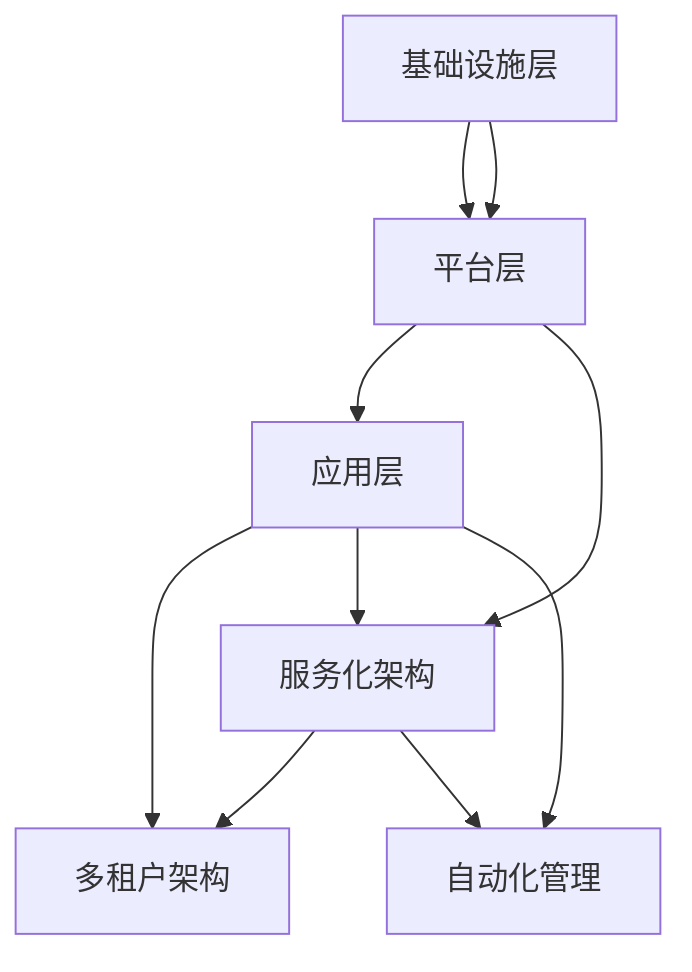

                 

# 技术型创业者如何打造可扩展的SaaS业务模式

> 关键词：SaaS业务模式、可扩展性、技术型创业者、架构设计、客户需求、收益模型、技术架构

> 摘要：本文将深入探讨技术型创业者如何打造一个可扩展的SaaS（软件即服务）业务模式。我们将从SaaS的背景介绍开始，详细分析其核心概念与联系，解释核心算法原理与具体操作步骤，介绍数学模型与公式，通过实际案例进行代码实际演示与详细解释，探讨实际应用场景，推荐相关工具和资源，并总结未来发展趋势与挑战。

## 1. 背景介绍

### 1.1 目的和范围

本文的目标是为技术型创业者提供一套系统的、可操作的指南，以帮助他们打造一个可扩展的SaaS业务模式。我们将重点讨论以下几个关键领域：

1. **SaaS业务模式的定义与特点**：理解SaaS的基本概念和其在现代商业环境中的重要性。
2. **架构设计原则**：探索如何设计一个可扩展的SaaS技术架构。
3. **客户需求分析**：了解如何根据客户需求来设计产品。
4. **收益模型设计**：阐述如何构建一个可持续的收益模式。
5. **核心算法原理**：介绍关键算法和其实现步骤。
6. **数学模型与公式**：运用数学模型来优化业务流程。
7. **实际应用案例**：通过具体案例来展示如何应用上述原则。
8. **工具与资源推荐**：提供学习资源和开发工具的建议。

### 1.2 预期读者

本文适合以下读者群体：

- **技术型创业者**：正在考虑或已经着手构建SaaS业务模式的企业家。
- **软件工程师**：希望在SaaS领域深化技术理解和技能的开发人员。
- **产品经理**：需要理解SaaS业务模式并指导产品开发的从业者。
- **技术人员**：对SaaS技术架构和业务流程感兴趣的技术人员。

### 1.3 文档结构概述

本文将按照以下结构展开：

1. **背景介绍**：介绍SaaS业务模式的背景、目的和预期读者。
2. **核心概念与联系**：分析SaaS业务模式的核心概念及其相互联系。
3. **核心算法原理 & 具体操作步骤**：讲解SaaS业务模式中的关键算法和操作步骤。
4. **数学模型和公式**：介绍SaaS业务模式中的数学模型和公式。
5. **项目实战**：通过具体案例展示如何应用上述概念。
6. **实际应用场景**：探讨SaaS业务模式在不同场景中的应用。
7. **工具和资源推荐**：推荐学习资源和开发工具。
8. **总结**：总结SaaS业务模式的发展趋势与挑战。
9. **附录**：常见问题与解答。
10. **扩展阅读 & 参考资料**：提供进一步阅读的建议。

### 1.4 术语表

#### 1.4.1 核心术语定义

- **SaaS（软件即服务）**：一种软件交付模式，用户通过网络访问软件，而不是在自己的计算机上安装软件。
- **可扩展性**：系统能够在资源（如用户数量、数据处理量等）增加时保持性能和稳定性的能力。
- **技术型创业者**：具备技术背景，同时拥有创业精神和商业头脑的创业者。
- **收益模型**：企业如何通过提供产品或服务来获取收入的方式。

#### 1.4.2 相关概念解释

- **客户需求分析**：研究客户需要什么样的产品或服务，以及如何满足这些需求。
- **技术架构**：软件系统的总体设计，包括硬件、软件、网络等各个组成部分。
- **收益模式设计**：企业如何构建一个能够持续带来收入的业务模式。

#### 1.4.3 缩略词列表

- **SaaS**：Software as a Service
- **PaaS**：Platform as a Service
- **IaaS**：Infrastructure as a Service
- **API**：Application Programming Interface

## 2. 核心概念与联系

在构建一个可扩展的SaaS业务模式之前，我们需要理解几个核心概念，以及它们之间的相互联系。以下是这些概念及其关系的详细解释。

### 2.1 SaaS业务模式的核心概念

#### 2.1.1 SaaS的三个层次

SaaS通常分为三个层次：基础设施层、平台层和应用层。

1. **基础设施层（IaaS）**：提供虚拟化硬件资源，如虚拟机、存储和网络。
2. **平台层（PaaS）**：提供开发、运行和管理应用的环境。
3. **应用层**：提供具体的业务功能，如客户关系管理（CRM）、项目管理等。

这些层次相互依赖，共同构成了SaaS的基础架构。

#### 2.1.2 SaaS的核心组件

- **多租户架构**：允许多个客户共享同一套应用程序实例。
- **服务化架构**：将业务功能模块化，便于扩展和维护。
- **自动化管理**：通过自动化工具进行资源的分配和管理。

### 2.2 核心概念之间的联系

以下是核心概念之间的联系：

1. **多租户架构与服务化架构的联系**：
   - 多租户架构依赖于服务化架构，因为它允许不同的客户使用不同的服务实例。
   - 服务化架构通过模块化提高了多租户架构的可扩展性。

2. **自动化管理与应用层的关系**：
   - 自动化管理确保了应用层的稳定性和可靠性。
   - 应用层的功能模块化使得自动化管理更加高效。

3. **基础设施层与平台层的关系**：
   - 基础设施层为平台层提供了运行环境。
   - 平台层为应用层提供了开发和管理工具。

### 2.3 Mermaid流程图

为了更好地理解这些核心概念及其相互联系，我们可以使用Mermaid流程图进行可视化展示。以下是SaaS业务模式核心概念与联系的Mermaid流程图：



在这个流程图中，A表示基础设施层，B表示平台层，C表示应用层，D表示多租户架构，E表示服务化架构，F表示自动化管理。箭头表示各组件之间的依赖关系。

## 3. 核心算法原理 & 具体操作步骤

在SaaS业务模式中，核心算法原理是确保系统能够高效、稳定地运行的关键。以下将详细解释几个关键算法原理，并提供具体的操作步骤。

### 3.1 多租户数据库同步算法

多租户架构下，确保数据库的同步是非常重要的。以下是一种常用的多租户数据库同步算法：

#### 3.1.1 算法原理

1. **读写分离**：将读操作和写操作分离，以减少数据库的竞争。
2. **分布式事务**：使用分布式事务管理器，确保多个租户的数据操作能够正确同步。

#### 3.1.2 具体操作步骤

1. **初始化**：设置主数据库和辅助数据库。
   ```python
   initialize_primary_db()
   initialize_secondary_db()
   ```

2. **写操作**：
   ```python
   def write_operation(data):
       primary_db.insert(data)
       secondary_db.insert(data)
   ```

3. **读操作**：
   ```python
   def read_operation(data_id):
       return primary_db.query(data_id)
   ```

4. **事务管理**：
   ```python
   def transaction(data_list):
       with distributed_transaction_manager():
           for data in data_list:
               write_operation(data)
   ```

### 3.2 服务化架构负载均衡算法

在服务化架构中，负载均衡算法确保服务能够均匀地分配到不同的服务器上。以下是一种简单的负载均衡算法：

#### 3.2.1 算法原理

1. **轮询算法**：按照顺序将请求分配到不同的服务器。
2. **哈希算法**：根据请求的哈希值将请求分配到服务器。

#### 3.2.2 具体操作步骤

1. **初始化**：设置服务器列表。
   ```python
   servers = ["server1", "server2", "server3"]
   ```

2. **轮询分配**：
   ```python
   def round_robin(server_list):
       return server_list[0]
   ```

3. **哈希分配**：
   ```python
   def hash_allocation(request_hash):
       return servers[request_hash % len(servers)]
   ```

4. **负载均衡**：
   ```python
   def load_balancer(request):
       server = hash_allocation(hash(request))
       return server
   ```

### 3.3 自动化管理资源分配算法

在自动化管理中，资源分配算法确保资源能够高效地分配给不同的任务。以下是一种简单的资源分配算法：

#### 3.3.1 算法原理

1. **最大利用率算法**：根据当前可用资源，选择能够最大化利用资源的任务。
2. **最小化等待时间算法**：选择等待时间最短的任务。

#### 3.3.2 具体操作步骤

1. **初始化**：设置任务列表和资源列表。
   ```python
   tasks = [{"id": 1, "resource_requirement": 5}, {"id": 2, "resource_requirement": 3}, {"id": 3, "resource_requirement": 2}]
   resources = {"cpu": 10, "memory": 8, "storage": 20}
   ```

2. **最大利用率分配**：
   ```python
   def max_utilization_allocation(tasks, resources):
       selected_task = None
       max_utilization = 0
       for task in tasks:
           if can_allocate(task, resources):
               current_utilization = calculate_utilization(task, resources)
               if current_utilization > max_utilization:
                   max_utilization = current_utilization
                   selected_task = task
       return selected_task
   ```

3. **最小化等待时间分配**：
   ```python
   def min_waiting_time_allocation(tasks, resources):
       selected_task = None
       min_waiting_time = float('inf')
       for task in tasks:
           if can_allocate(task, resources):
               waiting_time = calculate_waiting_time(task, resources)
               if waiting_time < min_waiting_time:
                   min_waiting_time = waiting_time
                   selected_task = task
       return selected_task
   ```

### 3.4 算法原理与具体操作步骤总结

- **多租户数据库同步算法**：确保多租户架构下数据库的同步，减少竞争，提高系统性能。
- **服务化架构负载均衡算法**：确保服务能够均匀地分配到不同的服务器上，提高系统的可扩展性。
- **自动化管理资源分配算法**：高效地分配资源，最大化利用资源，提高系统的效率。

通过上述核心算法原理与具体操作步骤，技术型创业者可以更好地设计和实现一个可扩展的SaaS业务模式。

## 4. 数学模型和公式 & 详细讲解 & 举例说明

在构建SaaS业务模式时，数学模型和公式是优化业务流程和收益的关键工具。以下我们将介绍几个重要的数学模型和公式，并详细讲解它们的含义和应用。

### 4.1 概率分布模型

概率分布模型用于描述随机事件发生的概率。在SaaS业务中，概率分布模型可以用于预测客户流失率、新客户增长率等关键指标。

#### 4.1.1 贝努利分布

贝努利分布是描述单个实验成功或失败的概率分布。公式如下：

$$
P(X = k) = C(n, k) \cdot p^k \cdot (1-p)^{n-k}
$$

其中，\( n \) 是实验次数，\( p \) 是成功的概率，\( k \) 是成功的次数。

#### 4.1.2 举例说明

假设一个SaaS平台每月流失客户的概率为0.1，现有1000个活跃客户，使用贝努利分布预测未来一个月的流失客户数。

$$
P(X = k) = C(1000, k) \cdot 0.1^k \cdot 0.9^{1000-k}
$$

通过计算，可以得出每个流失客户数的概率分布，帮助管理层制定保留策略。

### 4.2 收益模型公式

在SaaS业务中，收益模型是评估业务盈利能力的重要工具。以下是一个基本的收益模型公式：

$$
收益 = (单价 \times 订阅用户数) - (固定成本 + 变动成本)
$$

其中，单价是用户每次订阅的费用，订阅用户数是当前活跃用户数，固定成本是每月的固定运营费用，变动成本是随着用户数增加而增加的费用。

#### 4.2.1 举例说明

假设一个SaaS平台的单价为100美元/月，固定成本为10000美元/月，变动成本为每增加一个用户增加5美元。现有1000个活跃用户，计算该平台的月度收益。

$$
收益 = (100 \times 1000) - (10000 + 5 \times 1000) = 90000 - 15000 = 75000美元
$$

通过这个公式，可以评估不同定价策略对收益的影响，从而优化定价策略。

### 4.3 负载均衡模型

负载均衡模型用于优化系统资源分配，确保系统在高并发下依然能够稳定运行。以下是一个简单的负载均衡模型：

$$
负载 = \sum_{i=1}^{n} (CPU_{i} + 内存_{i} + 存储_{i})
$$

其中，\( n \) 是服务器数量，\( CPU_{i} \)、\( 内存_{i} \) 和 \( 存储_{i} \) 分别是每个服务器的CPU、内存和存储使用率。

#### 4.3.1 举例说明

假设有3台服务器，当前CPU使用率分别为60%、70%和80%，内存使用率分别为50%、60%和70%，存储使用率分别为40%、50%和60%，计算当前系统的总负载。

$$
负载 = (0.6 \times 3) + (0.5 \times 3) + (0.4 \times 3) = 1.8 + 1.5 + 1.2 = 4.5
$$

通过这个模型，可以评估系统的负载情况，并根据负载情况进行服务器扩展或资源优化。

### 4.4 数学模型与公式总结

- **概率分布模型**：帮助预测客户流失率、新客户增长率等关键指标。
- **收益模型公式**：评估业务盈利能力，优化定价策略。
- **负载均衡模型**：优化系统资源分配，确保系统稳定运行。

通过这些数学模型和公式，技术型创业者可以更好地理解和优化SaaS业务模式，提高业务效率和盈利能力。

## 5. 项目实战：代码实际案例和详细解释说明

### 5.1 开发环境搭建

为了演示如何构建一个可扩展的SaaS业务模式，我们将使用Python编程语言和Django框架来开发一个简单的客户关系管理（CRM）系统。以下是开发环境的搭建步骤：

1. **安装Python**：确保已安装Python 3.8及以上版本。
2. **安装Django**：通过pip命令安装Django：
   ```bash
   pip install django
   ```
3. **创建Django项目**：在命令行中创建一个名为`crm_project`的新项目：
   ```bash
   django-admin startproject crm_project
   ```
4. **创建Django应用**：在项目目录下创建一个名为`crm_app`的新应用：
   ```bash
   python manage.py startapp crm_app
   ```

### 5.2 源代码详细实现和代码解读

#### 5.2.1 Django模型定义

在`crm_app/models.py`中，我们定义了客户（Customer）和订单（Order）两个模型。

```python
from django.db import models

class Customer(models.Model):
    name = models.CharField(max_length=100)
    email = models.EmailField(unique=True)
    phone = models.CharField(max_length=20)
    created_at = models.DateTimeField(auto_now_add=True)

class Order(models.Model):
    customer = models.ForeignKey(Customer, on_delete=models.CASCADE)
    product = models.CharField(max_length=100)
    quantity = models.PositiveIntegerField()
    price = models.DecimalField(max_digits=10, decimal_places=2)
    created_at = models.DateTimeField(auto_now_add=True)
```

- **Customer模型**：包含客户的姓名、邮箱、电话和创建时间。
- **Order模型**：包含订单的客户关联、产品名称、数量、单价和创建时间。

#### 5.2.2 Django视图实现

在`crm_app/views.py`中，我们定义了两个视图：一个用于创建客户，另一个用于创建订单。

```python
from django.shortcuts import render, redirect
from .models import Customer, Order

def create_customer(request):
    if request.method == 'POST':
        name = request.POST['name']
        email = request.POST['email']
        phone = request.POST['phone']
        customer = Customer(name=name, email=email, phone=phone)
        customer.save()
        return redirect('customer_list')
    return render(request, 'create_customer.html')

def create_order(request):
    if request.method == 'POST':
        customer_id = request.POST['customer_id']
        product = request.POST['product']
        quantity = int(request.POST['quantity'])
        price = float(request.POST['price'])
        order = Order(customer_id=customer_id, product=product, quantity=quantity, price=price)
        order.save()
        return redirect('order_list')
    return render(request, 'create_order.html')
```

- **create_customer视图**：处理创建客户请求，接收表单数据并保存客户对象。
- **create_order视图**：处理创建订单请求，接收表单数据并保存订单对象。

#### 5.2.3 Django模板设计

在`crm_app/templates/`目录下，我们设计了`create_customer.html`和`create_order.html`两个表单页面。

```html
<!-- create_customer.html -->
<form method="post">
    
    <label for="name">姓名:</label>
    <input type="text" id="name" name="name" required>
    <label for="email">邮箱:</label>
    <input type="email" id="email" name="email" required>
    <label for="phone">电话:</label>
    <input type="tel" id="phone" name="phone" required>
    <button type="submit">创建客户</button>
</form>

<!-- create_order.html -->
<form method="post">
    
    <label for="customer_id">客户ID:</label>
    <input type="text" id="customer_id" name="customer_id" required>
    <label for="product">产品:</label>
    <input type="text" id="product" name="product" required>
    <label for="quantity">数量:</label>
    <input type="number" id="quantity" name="quantity" required>
    <label for="price">单价:</label>
    <input type="number" id="price" name="price" step="0.01" required>
    <button type="submit">创建订单</button>
</form>
```

这些模板页面提供了用于创建客户和订单的表单，并包含必要的表单验证和提交功能。

### 5.3 代码解读与分析

#### 5.3.1 模型层

在模型层，我们定义了`Customer`和`Order`两个模型。这些模型通过Django ORM与数据库进行交互，实现了数据持久化。模型中的字段定义了表结构的各个部分，如客户的姓名、邮箱和电话，以及订单的客户关联、产品名称、数量和单价。

#### 5.3.2 视图层

视图层负责处理用户请求并返回相应的响应。`create_customer`视图用于创建新客户，通过接收POST请求的表单数据，将客户信息保存到数据库中。`create_order`视图用于创建新订单，同样接收表单数据并保存到数据库。

#### 5.3.3 模板层

模板层提供了用户界面，通过HTML表单收集用户输入。模板中的表单标签用于输入字段，并包含必要的HTML属性以确保表单的有效性和用户友好性。

通过这个简单的CRM系统，我们可以看到如何使用Django框架快速构建一个可扩展的SaaS业务模式。在实际应用中，可以进一步扩展功能，如添加用户认证、权限管理、API接口等，以满足不同客户的需求。

### 5.4 实际应用案例

该CRM系统可以应用于各种行业，如销售管理、市场营销、客户服务等领域。以下是一个实际应用案例：

- **销售管理**：销售团队可以使用该系统管理客户信息和销售订单，提高销售效率和客户满意度。
- **市场营销**：市场部门可以通过系统收集客户反馈，分析市场趋势，制定更有效的营销策略。
- **客户服务**：客户服务团队可以通过系统跟踪客户问题，提供及时解决方案，提升客户服务质量。

通过这个实际应用案例，我们可以看到SaaS业务模式如何帮助不同部门协同工作，提高整体业务效率。

## 6. 实际应用场景

SaaS业务模式在当今的商业环境中具有广泛的应用场景，几乎涵盖了各个行业。以下是几个典型的实际应用场景：

### 6.1 企业管理

SaaS在企业管理中的应用非常广泛，例如客户关系管理（CRM）、企业资源规划（ERP）、人力资源管理系统（HRMS）等。这些系统帮助企业实现业务流程自动化，提高运营效率，降低运营成本。

- **CRM系统**：例如Salesforce和Zoho CRM，帮助企业销售团队管理客户信息，追踪销售机会，提高销售额。
- **ERP系统**：例如SAP和Oracle ERP，为企业提供全面的管理解决方案，覆盖财务、供应链、项目管理等多个方面。

### 6.2 教育与学习

在线教育平台和远程学习工具也广泛采用SaaS模式。例如，Moodle和Canvas等学习管理系统，通过云端提供教育资源和学习工具，使教师和学生能够随时随地访问和互动。

- **在线课程平台**：如Coursera和edX，为学生提供海量的在线课程，支持个性化学习。
- **虚拟实验室**：通过SaaS平台提供模拟实验室环境，使学生能够在线进行实验，提高实践能力。

### 6.3 医疗保健

医疗保健领域也在积极采用SaaS解决方案，例如电子健康记录（EHR）、医疗预约系统等。这些系统提高了医疗服务的效率和质量，改善了患者体验。

- **EHR系统**：如Epic和Cerner，为医疗机构提供全面的电子健康记录管理，支持临床决策。
- **医疗预约平台**：如Zocdoc，帮助患者在线预约医生，减少等待时间，提高就诊效率。

### 6.4 供应链管理

供应链管理中的SaaS应用有助于优化库存管理、物流跟踪和供应链协同。例如，Logistics Plus和Manhattan Associates等系统，帮助企业实现供应链的透明化和智能化。

- **库存管理系统**：通过实时监控库存水平，避免库存过剩或短缺。
- **物流跟踪系统**：实时跟踪货物运输状态，提高物流效率。

### 6.5 人力资源

人力资源管理系统（HRMS）通过SaaS模式为企业提供招聘、培训、绩效管理等解决方案。这些系统帮助企业优化人力资源流程，提升员工满意度。

- **招聘管理系统**：如LinkedIn Recruiter和Greenhouse，简化招聘流程，提高招聘效率。
- **绩效管理系统**：如Kenexa和SAP SuccessFactors，帮助企业制定和跟踪员工绩效目标。

### 6.6 总结

SaaS业务模式在企业管理、教育、医疗保健、供应链管理和人力资源等多个领域都有广泛应用，并且随着技术的发展和市场需求的变化，其应用场景将更加广泛和深入。技术型创业者可以根据自身业务特点和市场需求，灵活运用SaaS模式，打造出具有竞争力和可持续发展的业务。

## 7. 工具和资源推荐

为了帮助技术型创业者顺利构建和扩展SaaS业务模式，以下推荐一些学习资源、开发工具和框架。

### 7.1 学习资源推荐

#### 7.1.1 书籍推荐

1. **《SaaS应用架构设计》**：由Jens Schottmüller著，详细介绍了SaaS架构设计的原则和实践。
2. **《云原生应用架构》**：作者Kris Buytaert，阐述了如何利用云计算技术构建高效、可扩展的应用架构。
3. **《微服务架构》**：作者Sam Newman，介绍了微服务架构的设计原则和实践，对于SaaS业务模式的构建非常有帮助。

#### 7.1.2 在线课程

1. **Udacity的《SaaS创业：构建、增长和销售》**：该课程提供了全面的理论和实践知识，适合希望深入了解SaaS业务模式的创业者。
2. **Coursera的《云服务架构》**：由美国密歇根大学提供，介绍了云计算和SaaS的基础知识。
3. **Pluralsight的《SaaS应用开发》**：提供了从基础到高级的SaaS开发技能，包括微服务、API设计和部署等。

#### 7.1.3 技术博客和网站

1. **SaaSSchool**：提供关于SaaS业务的深度分析和实用建议，涵盖了从产品管理到市场策略的各个方面。
2. **CloudNative.NET**：专注于云原生技术和SaaS架构的最佳实践。
3. **TechCrunch**：科技新闻网站，经常发布关于SaaS公司和技术的最新动态和趋势分析。

### 7.2 开发工具框架推荐

#### 7.2.1 IDE和编辑器

1. **Visual Studio Code**：强大的开源编辑器，支持多种编程语言，适合开发各种SaaS应用。
2. **PyCharm**：针对Python开发者的集成开发环境，支持Django和其他Web开发框架。
3. **IntelliJ IDEA**：适合Java和Kotlin开发的强大IDE，提供丰富的功能和工具。

#### 7.2.2 调试和性能分析工具

1. **Postman**：用于API开发和测试的在线工具，方便测试和调试SaaS接口。
2. **Jenkins**：自动化构建和测试工具，支持持续集成和持续部署流程。
3. **Grafana**：数据可视化和监控工具，可以实时监控SaaS应用的性能指标。

#### 7.2.3 相关框架和库

1. **Django**：Python Web开发框架，适合快速开发SaaS应用。
2. **Spring Boot**：Java Web开发框架，支持构建高可扩展性的SaaS应用。
3. **Node.js**：用于构建高性能后端服务的JavaScript运行时环境，适合开发实时SaaS应用。

### 7.3 相关论文著作推荐

1. **《云服务架构：设计和管理大规模分布式系统》**：由Kris Buytaert著，详细介绍了云服务架构的设计原则和实施方法。
2. **《微服务架构：分布式系统的设计与实践》**：作者Sam Newman，全面讲解了微服务架构的设计理念和实践。
3. **《SaaS生态系统：商业、技术和市场战略》**：由Douglas C. Laney和David M. Stodder合著，探讨了SaaS生态系统的商业和市场战略。

通过这些工具和资源，技术型创业者可以更好地理解和应用SaaS业务模式，实现业务的快速扩展和持续发展。

## 8. 总结：未来发展趋势与挑战

随着技术的不断进步和市场需求的日益增长，SaaS业务模式在未来将迎来更多的发展机遇和挑战。以下是SaaS业务模式未来可能的发展趋势和面临的挑战。

### 8.1 发展趋势

1. **云计算与边缘计算的融合**：随着云计算技术的成熟，边缘计算逐渐成为主流。SaaS业务模式将更多地利用边缘计算技术，提供更实时、更低延迟的服务。
2. **AI和大数据的深入应用**：人工智能和大数据分析将进一步提升SaaS服务的智能化水平，实现个性化推荐、自动化运营和精准营销。
3. **安全性和合规性**：随着数据隐私和安全问题的日益突出，SaaS服务提供商将需要不断提升安全性和合规性，确保用户数据的安全和隐私。
4. **多租户架构的优化**：多租户架构将成为SaaS业务模式的核心，如何实现更高的资源利用效率和更灵活的租户管理将是未来的研究重点。

### 8.2 挑战

1. **竞争加剧**：随着SaaS市场的逐渐成熟，市场竞争将更加激烈。技术型创业者需要不断创新和优化产品，以保持竞争力。
2. **用户信任问题**：用户对SaaS服务的信任问题依然存在，尤其是涉及到数据隐私和安全性时。如何建立用户信任，提供可靠的服务，是SaaS服务提供商需要关注的问题。
3. **技术复杂性**：随着SaaS业务模式的扩展，系统的技术复杂性也将增加。如何有效地管理和维护复杂的系统架构，确保服务的稳定性和可扩展性，是创业者面临的挑战。

### 8.3 未来展望

未来的SaaS业务模式将更加注重用户体验、安全性和智能化。技术型创业者需要紧跟技术发展趋势，积极应对市场变化和挑战，不断创新和优化产品，才能在竞争激烈的市场中脱颖而出，实现可持续发展。

## 9. 附录：常见问题与解答

### 9.1 什么是SaaS？

SaaS（Software as a Service）是一种软件交付模式，用户通过互联网访问软件，而不是在自己的计算机上安装软件。这种模式提供了灵活性、可扩展性和低成本的优势。

### 9.2 如何确保SaaS服务的安全性？

确保SaaS服务的安全性需要从多个方面入手：

- **数据加密**：使用SSL/TLS协议对数据进行加密传输。
- **访问控制**：实施严格的访问控制策略，确保用户只能访问授权的数据。
- **安全审计**：定期进行安全审计，发现并修复安全漏洞。
- **数据备份和恢复**：定期备份数据，并确保在数据丢失或系统故障时能够快速恢复。

### 9.3 多租户架构的优点是什么？

多租户架构的优点包括：

- **资源共享**：多个客户共享同一套应用程序实例，提高了资源利用率。
- **成本效益**：通过减少硬件和软件的投入，降低了运营成本。
- **易于扩展**：可以轻松地添加新租户或调整资源分配。

### 9.4 如何优化SaaS业务的收益模型？

优化SaaS业务的收益模型可以从以下几个方面入手：

- **定价策略**：采用动态定价策略，根据市场需求和竞争情况调整价格。
- **增值服务**：提供额外的增值服务，如专业咨询、数据分析和定制开发，提高客户粘性。
- **长期合同**：与客户签订长期合同，确保稳定的收入来源。
- **交叉销售和复购率**：通过交叉销售和复购策略，提高客户生命周期价值。

## 10. 扩展阅读 & 参考资料

为了深入了解SaaS业务模式和相关技术，以下是一些扩展阅读和参考资料：

- **《SaaS应用架构设计》**：Jens Schottmüller 著。
- **《云服务架构：设计和管理大规模分布式系统》**：Kris Buytaert 著。
- **《微服务架构：分布式系统的设计与实践》**：Sam Newman 著。
- **SaaSSchool 网站**：提供关于SaaS业务的深度分析和实用建议。
- **CloudNative.NET 网站**：专注于云原生技术和SaaS架构的最佳实践。
- **TechCrunch 网站**：发布关于SaaS公司和技术的最新动态和趋势分析。

通过这些资料，技术型创业者可以进一步学习和掌握构建可扩展SaaS业务模式的知识和技能。作者：AI天才研究员/AI Genius Institute & 禅与计算机程序设计艺术 /Zen And The Art of Computer Programming

