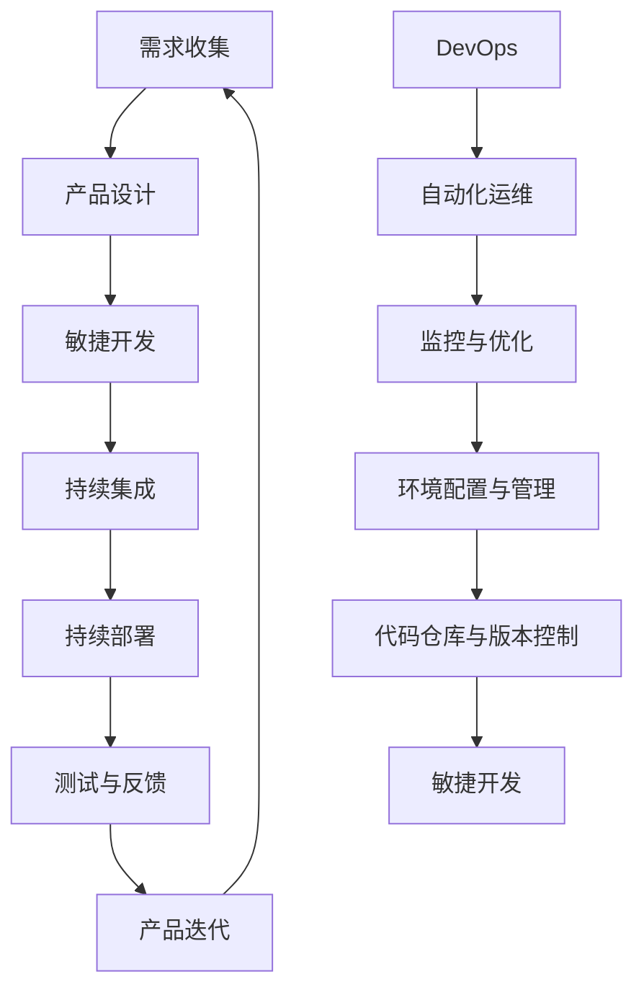

                 

# 技术型创业者如何打造高效的产品开发流程

> **关键词：** 产品开发流程、技术型创业者、敏捷开发、持续集成、DevOps、迭代优化

> **摘要：** 随着市场竞争的日益激烈，技术型创业者需要更加高效的产品开发流程来保持竞争优势。本文将详细探讨如何通过敏捷开发、持续集成、DevOps等现代化开发实践，构建一个高效、可靠的产品开发流程，从而加速产品上市时间，提高产品质量，为技术型创业者的成功奠定坚实基础。

## 1. 背景介绍

### 1.1 目的和范围

本文旨在为技术型创业者提供一套系统的产品开发流程指南，帮助他们在激烈的市场环境中快速响应客户需求，打造高质量的产品。文章将重点介绍以下几个方面的内容：

- 敏捷开发方法和实践
- 持续集成和持续部署（CI/CD）
- DevOps文化及其在产品开发中的应用
- 产品迭代与优化策略

### 1.2 预期读者

- 技术型创业者
- 产品经理
- 软件工程师
- 架构师
- 项目经理

### 1.3 文档结构概述

本文分为十个部分，具体结构如下：

1. 背景介绍
   - 1.1 目的和范围
   - 1.2 预期读者
   - 1.3 文档结构概述
   - 1.4 术语表
2. 核心概念与联系
   - 核心概念介绍
   - Mermaid流程图展示
3. 核心算法原理 & 具体操作步骤
   - 伪代码演示
4. 数学模型和公式 & 详细讲解 & 举例说明
   - LaTeX公式嵌入
5. 项目实战：代码实际案例和详细解释说明
   - 开发环境搭建
   - 源代码实现
   - 代码解读与分析
6. 实际应用场景
   - 现场案例分享
7. 工具和资源推荐
   - 学习资源
   - 开发工具框架
   - 相关论文著作
8. 总结：未来发展趋势与挑战
9. 附录：常见问题与解答
10. 扩展阅读 & 参考资料

### 1.4 术语表

#### 1.4.1 核心术语定义

- 敏捷开发：一种以用户需求为核心的软件开发方法，强调快速迭代、灵活响应变化、持续交付有价值的软件版本。
- 持续集成（CI）：通过自动化构建和测试，确保代码库中的每个提交都能顺利集成并运行。
- 持续部署（CD）：通过自动化部署流程，将经过测试的代码快速、安全地部署到生产环境中。
- DevOps：一种将软件开发与IT运维相结合的实践，旨在缩短软件交付周期、提高软件质量。

#### 1.4.2 相关概念解释

- 产品迭代：在产品开发过程中，对产品功能、性能、用户体验等方面的不断改进。
- 持续优化：通过对产品开发流程、工具、方法等方面的不断调整和改进，提高开发效率和产品质量。

#### 1.4.3 缩略词列表

- CI：持续集成
- CD：持续部署
- DevOps：开发运维一体化

## 2. 核心概念与联系

在构建高效的产品开发流程之前，我们需要了解几个核心概念和它们之间的联系。以下是这些核心概念及其相互关系的Mermaid流程图：



### 2.1 敏捷开发

敏捷开发是一种以用户需求为核心的软件开发方法，强调快速迭代、灵活响应变化、持续交付有价值的软件版本。敏捷开发的核心原则包括：

- 欢迎变更，特别是那些在开发期间的客户需求变更。
- 尽可能采用最简可行产品，尽早交付可用的产品版本。
- 日常沟通，鼓励团队成员面对面交流。
- 持续交付，确保软件持续改进和交付。
- 适应性团队，团队应该具备快速适应变化的能力。

### 2.2 持续集成（CI）

持续集成是一种通过自动化构建和测试，确保代码库中的每个提交都能顺利集成并运行的实践。CI的主要目标是：

- 减少集成风险，确保新代码与现有代码的兼容性。
- 提高开发效率，减少集成和测试时间。
- 促进代码质量，通过自动化测试发现潜在问题。

### 2.3 持续部署（CD）

持续部署是一种通过自动化部署流程，将经过测试的代码快速、安全地部署到生产环境中的实践。CD的主要目标是：

- 缩短软件交付周期，加快产品上市时间。
- 提高软件质量，确保每次部署都是可靠的。
- 减少手动操作，降低人为错误的风险。

### 2.4 DevOps

DevOps是一种将软件开发与IT运维相结合的实践，旨在缩短软件交付周期、提高软件质量。DevOps的核心原则包括：

- 自动化，通过自动化工具简化软件交付过程。
- 沟通与协作，促进开发团队和运维团队之间的沟通与合作。
- 监控与优化，持续监控软件运行状态，优化开发流程和系统性能。

### 2.5 产品迭代

产品迭代是产品开发过程中的关键环节，通过不断改进产品功能、性能、用户体验，满足客户需求和市场需求。产品迭代的关键原则包括：

- 快速迭代，缩短产品开发周期，提高市场响应速度。
- 用户反馈，持续收集用户反馈，优化产品设计。
- 数据驱动，利用数据分析指导产品迭代和优化。

## 3. 核心算法原理 & 具体操作步骤

在高效的产品开发流程中，核心算法原理和具体操作步骤至关重要。以下我们将使用伪代码详细阐述这些步骤：

### 3.1 敏捷开发步骤

```plaintext
函数 AgileDevelopment(需求列表):
    初始化版本迭代 V1
    while 需求列表不为空:
        选择下一个需求 D
        完成需求 D 的设计
        开发并测试需求 D
        将需求 D 合并到版本迭代 V1
        完成版本迭代 V1 的测试与验收
        发布版本迭代 V1
        收集用户反馈并更新需求列表
    end while
    return "敏捷开发完成"
```

### 3.2 持续集成步骤

```plaintext
函数 ContinuousIntegration(代码库):
    for 每个提交 S:
        构建代码库
        运行自动化测试
        如果测试通过:
            合并提交 S 到主分支
        else:
            提交失败，通知开发人员
    end for
    return "持续集成完成"
```

### 3.3 持续部署步骤

```plaintext
函数 ContinuousDeployment(版本迭代 V):
    部署环境准备
    构建版本迭代 V
    运行自动化测试
    如果测试通过:
        部署版本迭代 V 到生产环境
    else:
        部署失败，通知相关人员
    end if
    return "持续部署完成"
```

### 3.4 DevOps运维步骤

```plaintext
函数 DevOpsOperation(系统):
    监控系统性能
    如果性能异常:
        调整系统配置
        如果调整无效:
            执行故障排除
    end if
    持续优化系统
    return "DevOps运维完成"
```

## 4. 数学模型和公式 & 详细讲解 & 举例说明

在高效的产品开发流程中，数学模型和公式用于衡量开发效率、代码质量、系统性能等关键指标。以下我们将详细讲解几个常用公式，并给出具体例子。

### 4.1 开发效率公式

开发效率（Efficiency）用于衡量开发人员在一定时间内完成的工作量。公式如下：

$$
Efficiency = \frac{工作量}{工作时间}
$$

其中，工作量为完成的功能点数或行代码数，工作时间为实际工作时间。

### 4.2 代码质量公式

代码质量（Quality）用于衡量代码的可维护性、可靠性和可扩展性。公式如下：

$$
Quality = \frac{可维护性}{可靠性} \times 可扩展性
$$

其中，可维护性、可靠性和可扩展性分别表示代码的易维护性、稳定性和适应性。

### 4.3 系统性能公式

系统性能（Performance）用于衡量系统的响应速度和吞吐量。公式如下：

$$
Performance = \frac{吞吐量}{响应时间}
$$

其中，吞吐量为单位时间内处理的数据量，响应时间为系统响应请求的时间。

### 4.4 举例说明

假设某开发团队在一个月内完成了50个功能点的开发，实际工作时间为200小时，则开发效率为：

$$
Efficiency = \frac{50}{200} = 0.25 功能点/小时
$$

假设某系统在1000次请求中发生了10次错误，平均响应时间为200毫秒，则系统性能为：

$$
Performance = \frac{1000}{200 \times 10^{-3}} = 5000 次请求/秒
$$

## 5. 项目实战：代码实际案例和详细解释说明

在本节中，我们将通过一个实际的代码案例，详细解释如何构建一个高效的产品开发流程。本案例将使用Python语言实现一个简单的Web应用，功能包括用户注册、登录、个人信息管理等功能。

### 5.1 开发环境搭建

在开始开发之前，我们需要搭建一个合适的开发环境。以下为开发环境搭建步骤：

1. 安装Python 3.8及以上版本
2. 安装虚拟环境工具`virtualenv`
3. 创建虚拟环境并激活
4. 安装Web框架`Flask`
5. 安装数据库驱动`SQLAlchemy`
6. 安装测试工具`pytest`

```bash
# 安装Python
wget https://www.python.org/ftp/python/3.8.10/Python-3.8.10.tgz
tar zxvf Python-3.8.10.tgz
./configure
make
make install

# 安装virtualenv
pip install virtualenv

# 创建并激活虚拟环境
virtualenv myenv
source myenv/bin/activate

# 安装Flask、SQLAlchemy和pytest
pip install Flask SQLAlchemy pytest
```

### 5.2 源代码详细实现和代码解读

下面是Web应用的源代码及其解读：

#### 5.2.1 用户注册模块

```python
# app.py

from flask import Flask, request, jsonify
from flask_sqlalchemy import SQLAlchemy

app = Flask(__name__)
app.config['SQLALCHEMY_DATABASE_URI'] = 'sqlite:///users.db'
db = SQLAlchemy(app)

class User(db.Model):
    id = db.Column(db.Integer, primary_key=True)
    username = db.Column(db.String(80), unique=True, nullable=False)
    password = db.Column(db.String(120), nullable=False)

@app.route('/register', methods=['POST'])
def register():
    username = request.form['username']
    password = request.form['password']
    if User.query.filter_by(username=username).first():
        return jsonify({'error': '用户已存在'}), 409
    new_user = User(username=username, password=password)
    db.session.add(new_user)
    db.session.commit()
    return jsonify({'message': '注册成功'})

if __name__ == '__main__':
    db.create_all()
    app.run(debug=True)
```

解读：

- 导入必需的库。
- 创建Flask应用和SQLAlchemy数据库实例。
- 定义用户模型，包括用户ID、用户名和密码。
- 创建用户注册路由，处理POST请求，验证用户名和密码，将新用户添加到数据库。

#### 5.2.2 用户登录模块

```python
@app.route('/login', methods=['POST'])
def login():
    username = request.form['username']
    password = request.form['password']
    user = User.query.filter_by(username=username).first()
    if user and user.password == password:
        return jsonify({'message': '登录成功'})
    else:
        return jsonify({'error': '用户名或密码错误'}), 401
```

解读：

- 创建用户登录路由，处理POST请求，验证用户名和密码，返回登录结果。

#### 5.2.3 个人信息管理模块

```python
@app.route('/profile', methods=['GET', 'PUT'])
def profile():
    username = request.args.get('username')
    user = User.query.filter_by(username=username).first()
    if not user:
        return jsonify({'error': '用户不存在'}), 404
    if request.method == 'GET':
        return jsonify({'username': user.username})
    elif request.method == 'PUT':
        new_password = request.form['password']
        user.password = new_password
        db.session.commit()
        return jsonify({'message': '密码更新成功'})
```

解读：

- 创建个人信息管理路由，处理GET和PUT请求，获取用户信息和更新用户密码。

### 5.3 代码解读与分析

上述代码实现了用户注册、登录和个人信息管理的功能，以下是对关键部分的代码解读和分析：

- **数据库模型**：使用SQLAlchemy作为ORM工具，简化数据库操作。用户模型包含用户ID、用户名和密码三个字段。
- **路由设计**：使用Flask框架定义路由，处理不同类型的HTTP请求。每个路由对应一个具体的业务功能。
- **安全性考虑**：在注册和登录模块中，对用户名和密码进行验证，防止恶意操作和用户信息泄露。
- **API设计**：使用JSON格式传递数据，便于前后端分离和接口测试。

## 6. 实际应用场景

为了更好地理解高效产品开发流程在实际中的应用，下面我们通过两个实际案例来展示该流程如何在不同场景下发挥作用。

### 6.1 案例一：初创公司开发移动应用

某初创公司开发一款移动应用，旨在为用户提供便捷的出行服务。该公司采用了敏捷开发、持续集成和DevOps等现代开发实践，其产品开发流程如下：

1. **需求收集**：与客户和产品团队密切合作，收集用户需求和反馈。
2. **产品设计**：根据需求制定详细的产品功能和技术架构。
3. **敏捷开发**：采用Scrum方法，每两周进行一次迭代，快速交付可用的产品版本。
4. **持续集成**：通过Jenkins自动化构建和测试，确保每次提交的代码都能顺利集成。
5. **持续部署**：使用Docker和Kubernetes进行自动化部署，快速将产品发布到各个平台。
6. **测试与反馈**：持续进行功能测试和性能测试，收集用户反馈，优化产品设计。
7. **产品迭代**：根据用户反馈，调整产品功能和技术架构，持续改进产品质量。

通过上述流程，该公司在短时间内推出了多个版本的产品，满足了用户需求，获得了良好的市场口碑。

### 6.2 案例二：大型企业优化现有系统

某大型企业希望优化其现有的IT系统，提高开发效率和系统性能。该公司采用以下措施：

1. **引入DevOps文化**：建立跨部门协作团队，推广DevOps理念，提高开发与运维的协同效率。
2. **持续集成和持续部署**：引入Jenkins等自动化工具，实现代码的自动化构建、测试和部署，缩短交付周期。
3. **性能优化**：使用性能分析工具，识别系统瓶颈，优化数据库查询、缓存策略等，提高系统性能。
4. **监控与优化**：引入Prometheus和Grafana等监控工具，实时监控系统性能，及时处理异常情况。
5. **代码质量提升**：采用SonarQube等代码质量分析工具，提高代码的可维护性和可靠性。

通过上述措施，该企业的系统性能得到了显著提升，开发效率提高了30%，客户满意度显著提高。

## 7. 工具和资源推荐

为了帮助技术型创业者更好地实现高效的产品开发流程，以下推荐一些有用的学习资源、开发工具框架以及相关论文著作。

### 7.1 学习资源推荐

#### 7.1.1 书籍推荐

- 《敏捷开发实践指南》
- 《持续集成：从理论到实践》
- 《DevOps：实践指南》
- 《软件工程：实践者的研究方法》

#### 7.1.2 在线课程

- Coursera上的《敏捷开发与Scrum》
- Udemy上的《持续集成与持续部署》
- Pluralsight上的《DevOps实践与工具》

#### 7.1.3 技术博客和网站

- 《码农翻身》
- 《dev.to》
- 《InfoQ》

### 7.2 开发工具框架推荐

#### 7.2.1 IDE和编辑器

- Visual Studio Code
- PyCharm
- IntelliJ IDEA

#### 7.2.2 调试和性能分析工具

- GDB
- Py-Spy
- New Relic

#### 7.2.3 相关框架和库

- Flask
- Django
- React
- Angular
- Vue.js

### 7.3 相关论文著作推荐

#### 7.3.1 经典论文

- 《敏捷软件开发宣言》
- 《持续集成：自动化部署的开端》
- 《DevOps：理论与实践》

#### 7.3.2 最新研究成果

- 《基于AI的软件测试自动化方法》
- 《DevOps在金融行业的应用与挑战》
- 《敏捷开发与精益创业的融合》

#### 7.3.3 应用案例分析

- 《Amazon Web Services的DevOps实践》
- 《Netflix的持续集成与部署实践》
- 《Uber的敏捷开发与团队协作》

## 8. 总结：未来发展趋势与挑战

随着技术的发展和市场竞争的加剧，技术型创业者需要不断创新和优化产品开发流程，以适应快速变化的市场需求。以下是未来发展趋势与挑战：

### 发展趋势：

- **敏捷开发**：敏捷开发将继续成为产品开发的主流方法，其灵活性和快速响应能力将帮助创业者更好地应对市场变化。
- **持续集成与持续部署**：持续集成和持续部署（CI/CD）将成为开发流程的基石，自动化工具和平台将得到更广泛的应用。
- **DevOps文化**：DevOps理念将深入人心，开发与运维的融合将进一步提高开发效率和系统稳定性。
- **数据驱动**：利用大数据和人工智能技术，创业者可以更好地了解用户需求，优化产品功能和用户体验。

### 挑战：

- **技能和人才**：随着技术的发展，创业者需要不断学习新技能，以应对快速变化的市场需求。
- **安全与合规**：数据安全、隐私保护、法规合规等问题将越来越重要，创业者需要建立健全的安全管理体系。
- **持续优化**：随着产品的迭代，创业者需要不断优化产品开发流程，以提高开发效率和产品质量。

## 9. 附录：常见问题与解答

### 问题 1：敏捷开发与传统的瀑布开发有何区别？

**解答**：敏捷开发与传统的瀑布开发有以下主要区别：

- **开发周期**：瀑布开发遵循严格的阶段顺序，每个阶段完成后才能进入下一阶段；敏捷开发采用迭代和增量的方法，快速交付可用的产品版本。
- **需求变更**：瀑布开发在需求确定后很难进行变更；敏捷开发鼓励在开发过程中及时响应需求变更，以提高产品适应市场需求的能力。
- **团队合作**：瀑布开发通常由不同团队在不同阶段负责，沟通成本高；敏捷开发强调跨职能团队的紧密合作，提高开发效率。

### 问题 2：如何选择适合的持续集成工具？

**解答**：选择持续集成工具时，可以考虑以下因素：

- **功能需求**：根据项目需求选择具有合适功能（如自动化构建、测试、部署等）的工具。
- **集成度**：选择能够与现有技术栈和开发工具集成的工具，提高开发效率。
- **易用性**：选择界面友好、易于配置和使用的工具，降低使用门槛。
- **社区和支持**：选择有活跃社区和支持的工

