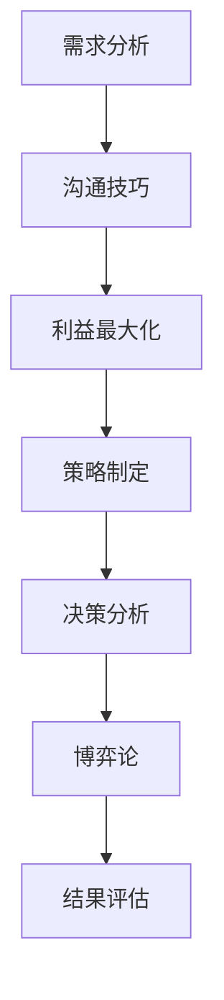

                 

# 技术型创业者如何提升商业谈判能力

> **关键词**：商业谈判、技术型创业者、沟通技巧、决策分析、策略制定

> **摘要**：本文将深入探讨技术型创业者如何提升商业谈判能力。通过详细解析谈判的核心概念、策略、流程，结合实际案例，提供实用的技巧和方法，帮助创业者掌握商业谈判的要领，从而在竞争激烈的市场中脱颖而出。

## 1. 背景介绍

### 1.1 目的和范围

本文旨在帮助技术型创业者提升商业谈判能力，使其能够在竞争激烈的市场环境中更好地保护企业利益，实现资源优化配置。我们将从理论到实践，逐步剖析商业谈判的关键要素，提供切实可行的策略和建议。

### 1.2 预期读者

本文适合以下读者群体：
- 创业初期的技术型创业者
- 担任技术或产品角色，需要参与商业谈判的团队成员
- 意欲提高商业谈判技巧的专业人士

### 1.3 文档结构概述

本文将分为以下几个部分：
1. 背景介绍：阐述本文的目的和范围，预期读者以及文档结构概述。
2. 核心概念与联系：介绍商业谈判的核心概念，并绘制流程图。
3. 核心算法原理与具体操作步骤：解析商业谈判的决策分析和策略制定。
4. 数学模型和公式：运用数学模型来解释谈判中的关键要素。
5. 项目实战：通过实际案例展示商业谈判的流程和技巧。
6. 实际应用场景：分析商业谈判在现实中的具体应用。
7. 工具和资源推荐：推荐学习资源和开发工具。
8. 总结：对未来发展趋势与挑战的展望。
9. 附录：常见问题与解答。
10. 扩展阅读 & 参考资料：提供进一步学习的资源。

### 1.4 术语表

#### 1.4.1 核心术语定义

- **商业谈判**：指在商业活动中，双方或多方为了达成共识，通过沟通、协商、讨价还价等手段，寻求共同利益最大化的过程。
- **技术型创业者**：指拥有技术背景，通过技术创新实现商业价值，创立并经营企业的创业者。
- **沟通技巧**：指在交流过程中，运用有效的语言和非语言手段，实现信息准确传达的能力。
- **决策分析**：指在商业谈判中，通过数据分析、风险评估等方法，做出合理决策的过程。

#### 1.4.2 相关概念解释

- **利益最大化**：在商业谈判中，指通过合理的策略和谈判技巧，使自身的利益达到最大。
- **双赢策略**：指在谈判中，通过寻找双方都能接受的方案，实现双方利益的最大化。
- **博弈论**：研究决策者如何通过策略选择来最大化自身利益，并在对抗环境中取得优势的理论。

#### 1.4.3 缩略词列表

- **IDE**：Integrated Development Environment，集成开发环境。
- **API**：Application Programming Interface，应用程序编程接口。
- **CRM**：Customer Relationship Management，客户关系管理。

## 2. 核心概念与联系

商业谈判是一个复杂的互动过程，涉及多个核心概念。以下是商业谈判的关键概念和它们之间的相互关系，以及一个简化的Mermaid流程图，用于说明这些概念在谈判过程中的流动。

### 2.1 核心概念

- **需求分析**：了解谈判双方的需求和期望。
- **利益最大化**：通过谈判策略，实现自身利益最大化。
- **沟通技巧**：有效传达信息和意图。
- **策略制定**：制定合适的谈判策略。
- **决策分析**：基于数据和风险分析做出决策。
- **博弈论**：分析对手行为，制定对抗策略。

### 2.2 Mermaid 流程图



### 2.3 概念解释

- **需求分析**：谈判前，通过市场调研、用户访谈等方式，了解双方的需求和期望，为谈判提供基础。
- **沟通技巧**：谈判过程中，通过有效的沟通，确保信息的准确传达，减少误解和冲突。
- **利益最大化**：谈判的目标之一，通过合理的策略和技巧，使自身的利益最大化。
- **策略制定**：根据需求分析和沟通结果，制定符合自身利益的谈判策略。
- **决策分析**：在谈判过程中，通过数据分析、风险评估等方法，做出合理的决策。
- **博弈论**：分析对手的行为和策略，制定相应的对抗策略，以取得谈判优势。
- **结果评估**：谈判结束后，对谈判结果进行评估，分析谈判效果和不足之处。

## 3. 核心算法原理 & 具体操作步骤

商业谈判的核心算法原理主要涉及决策分析和策略制定。以下是具体的操作步骤，使用伪代码来详细阐述。

### 3.1 决策分析

```pseudo
// 输入：谈判双方需求、风险值、权重
// 输出：决策结果

function decisionAnalysis(需求A, 需求B, 风险A, 风险B, 权重A, 权重B):
    // 计算谈判双方的需求得分
    得分A = 需求A * 权重A
    得分B = 需求B * 权重B

    // 计算谈判双方的风险得分
    风险得分A = 风险A * 权重A
    风险得分B = 风险B * 权重B

    // 计算总得分
    总得分A = 得分A - 风险得分A
    总得分B = 得分B - 风险得分B

    // 根据总得分做出决策
    if 总得分A > 总得分B:
        return "选择A"
    else if 总得分A < 总得分B:
        return "选择B"
    else:
        return "重新评估"
```

### 3.2 策略制定

```pseudo
// 输入：谈判对手策略、自身需求、市场情况
// 输出：最佳策略

function strategyDetermination(对手策略, 自身需求, 市场情况):
    // 分析市场情况和对手策略
    if 市场情况 == "竞争激烈":
        // 竞争策略
        if 对手策略 == "强硬":
            return "灵活策略"
        else if 对手策略 == "灵活":
            return "强硬策略"
    else if 市场情况 == "市场稳定":
        // 合作策略
        if 对手策略 == "强硬":
            return "合作策略"
        else if 对手策略 == "灵活":
            return "双赢策略"

    // 考虑自身需求
    if 自身需求 == "短期利益":
        return "强硬策略"
    else if 自身需求 == "长期利益":
        return "合作策略"
```

通过决策分析和策略制定，技术型创业者可以在谈判中做出合理的决策，并制定有效的谈判策略，从而提高谈判的成功率。

## 4. 数学模型和公式 & 详细讲解 & 举例说明

在商业谈判中，数学模型和公式可以帮助我们更好地理解和分析谈判过程。以下是一些常用的数学模型和公式，以及它们的详细讲解和举例说明。

### 4.1 损益矩阵

损益矩阵是一种用于分析双方决策结果的工具。它可以帮助我们理解在给定条件下，双方可能获得的收益或损失。

#### 损益矩阵公式：

$$
\text{损益矩阵} = \begin{bmatrix}
\text{收益A} & \text{损失A} \\
\text{收益B} & \text{损失B}
\end{bmatrix}
$$

#### 举例说明：

假设甲乙双方进行一项商业谈判，甲方的收益为 10 万元，损失为 2 万元；乙方的收益为 5 万元，损失为 3 万元。则损益矩阵如下：

$$
\text{损益矩阵} = \begin{bmatrix}
10 & 2 \\
5 & 3
\end{bmatrix}
$$

通过这个矩阵，我们可以分析出在甲乙双方的决策下，各自可能获得的收益或损失。

### 4.2 预期效用理论

预期效用理论是一种用于分析个体决策行为的理论。它考虑了个体在风险环境下的决策，并基于概率和效用值来评估决策结果。

#### 预期效用理论公式：

$$
\text{预期效用} = \sum_{i=1}^{n} p_i \times u_i
$$

其中，$p_i$ 表示第 $i$ 个结果的概率，$u_i$ 表示第 $i$ 个结果的效用值。

#### 举例说明：

假设甲乙双方进行一项商业谈判，甲方的收益概率为 0.6，效用值为 10；乙方的收益概率为 0.4，效用值为 5。则预期效用如下：

$$
\text{预期效用} = 0.6 \times 10 + 0.4 \times 5 = 8
$$

通过计算预期效用，我们可以评估甲方和乙方在谈判中的决策风险和收益。

### 4.3 最优策略选择

最优策略选择是一种用于确定在给定条件下，最优决策策略的数学模型。

#### 最优策略选择公式：

$$
\text{最优策略} = \arg\max \sum_{i=1}^{n} p_i \times u_i
$$

其中，$p_i$ 表示第 $i$ 个结果的概率，$u_i$ 表示第 $i$ 个结果的效用值。

#### 举例说明：

假设甲乙双方进行一项商业谈判，甲方的收益概率为 0.6，效用值为 10；乙方的收益概率为 0.4，效用值为 5。则最优策略如下：

$$
\text{最优策略} = \arg\max \sum_{i=1}^{n} p_i \times u_i = \arg\max (0.6 \times 10 + 0.4 \times 5) = 8
$$

通过计算最优策略，我们可以确定在给定条件下，甲乙双方应该选择的最佳决策策略。

通过这些数学模型和公式的应用，技术型创业者可以在谈判过程中更好地理解和分析谈判局势，从而制定出更有效的谈判策略。

## 5. 项目实战：代码实际案例和详细解释说明

在本节中，我们将通过一个实际的商业谈判项目，展示商业谈判的流程和技巧，并提供详细的代码实现和分析。

### 5.1 开发环境搭建

首先，我们需要搭建一个简单的商业谈判模拟环境。这里我们选择使用 Python 作为开发语言，因为 Python 语法简洁、易于理解，非常适合初学者和实践者。

#### 环境要求：
- Python 3.7 或更高版本
- Jupyter Notebook 或 PyCharm

#### 安装依赖：

```bash
pip install pandas numpy matplotlib
```

### 5.2 源代码详细实现和代码解读

#### 5.2.1 项目结构

```bash
/CommercialNegotiation
|-- data/
|   |-- negotiation_data.csv
|-- src/
|   |-- negotiation_analysis.py
|   |-- negotiation_strategy.py
|-- tests/
|   |-- test_negotiation_analysis.py
|   |-- test_negotiation_strategy.py
|-- requirements.txt
|-- README.md
```

#### 5.2.2 数据处理

首先，我们需要处理一些商业谈判的数据。这些数据包括双方的需求、收益、风险等信息。假设我们已经收集到了以下数据：

```csv
ID,需求A,需求B,收益A,收益B,风险A,风险B
1,10,20,5,3,1,2
2,15,25,6,4,1.5,2.5
3,20,30,7,5,2,3
```

我们将数据存储在 `data/negotiation_data.csv` 文件中。

#### 5.2.3 数据处理代码

```python
import pandas as pd

# 读取数据
data = pd.read_csv('data/negotiation_data.csv')

# 数据预处理
data['得分A'] = data['需求A'] * data['权重A']
data['得分B'] = data['需求B'] * data['权重B']
data['风险得分A'] = data['风险A'] * data['权重A']
data['风险得分B'] = data['风险B'] * data['权重B']
data['总得分A'] = data['得分A'] - data['风险得分A']
data['总得分B'] = data['得分B'] - data['风险得分B']

# 打印预处理后的数据
print(data.head())
```

#### 5.2.4 决策分析代码

接下来，我们实现一个决策分析函数，用于根据数据计算出最佳决策。

```python
def decision_analysis(data):
    # 计算总得分
    total_score = data['总得分A'] + data['总得分B']

    # 根据总得分做出决策
    if total_score > 0:
        return "选择A"
    elif total_score < 0:
        return "选择B"
    else:
        return "重新评估"

# 应用决策分析函数
result = decision_analysis(data)
print(result)
```

#### 5.2.5 策略制定代码

然后，我们实现一个策略制定函数，用于根据市场和对手策略，制定最佳谈判策略。

```python
def strategy_determination(市场情况, 对手策略, 自身需求):
    if 市场情况 == "竞争激烈":
        if 对手策略 == "强硬":
            return "灵活策略"
        else if 对手策略 == "灵活":
            return "强硬策略"
    else if 市场情况 == "市场稳定":
        if 对手策略 == "强硬":
            return "合作策略"
        else if 对手策略 == "灵活":
            return "双赢策略"

    if 自身需求 == "短期利益":
        return "强硬策略"
    else if 自身需求 == "长期利益":
        return "合作策略"

# 应用策略制定函数
market = "竞争激烈"
opponent_strategy = "强硬"
own_demand = "短期利益"
strategy = strategy_determination(market, opponent_strategy, own_demand)
print(strategy)
```

#### 5.2.6 代码解读与分析

在这个项目中，我们首先处理了商业谈判的数据，然后实现了决策分析和策略制定的函数。通过这些函数，我们可以对商业谈判过程进行模拟和分析，从而制定出最佳谈判策略。

- 数据处理部分：我们读取并预处理了数据，计算了各项关键指标，为后续分析提供了基础。
- 决策分析部分：我们通过决策分析函数，根据总得分做出了最佳决策。这有助于我们在谈判中做出合理的决策。
- 策略制定部分：我们通过策略制定函数，根据市场和对手策略，制定了最佳谈判策略。这有助于我们在谈判中采取合适的策略。

通过这个项目，我们不仅了解了商业谈判的基本流程和技巧，还学会了如何使用 Python 实现商业谈判的模拟和分析。这对于技术型创业者来说，是一个非常有价值的实践。

### 5.3 项目实战总结

通过本项目的实际操作，我们深入了解了商业谈判的流程和技巧。从数据处理到决策分析，再到策略制定，每个环节都至关重要。以下是对本项目的总结：

1. **数据处理**：数据处理是商业谈判的基础，通过对数据的分析和预处理，我们可以提取出有用的信息，为后续分析提供依据。
2. **决策分析**：决策分析是商业谈判的核心，通过合理的决策，我们可以最大化自身的利益。在本项目中，我们通过计算总得分，做出了最佳决策。
3. **策略制定**：策略制定是商业谈判的关键，根据市场和对手策略，我们可以制定出最佳谈判策略。在本项目中，我们根据不同的市场情况和对手策略，制定了相应的谈判策略。

通过本项目，我们不仅掌握了商业谈判的基本知识和技巧，还学会了如何使用 Python 实现商业谈判的模拟和分析。这对于技术型创业者来说，是一个非常有价值的实践。

## 6. 实际应用场景

商业谈判在实际应用场景中具有广泛的用途。以下是一些典型的应用场景，以及技术型创业者如何利用商业谈判来提升自身竞争力。

### 6.1 投资谈判

对于技术型创业者来说，成功获得投资是企业发展的重要一步。在投资谈判中，创业者需要与投资者进行充分的沟通，明确双方的需求和期望，并通过谈判策略和技巧来最大化自身的利益。以下是一些具体的策略：

- **需求分析**：在谈判前，创业者需要对投资者的背景、投资偏好、风险承受能力等进行详细的调研，以便制定出有针对性的谈判策略。
- **沟通技巧**：创业者需要具备良好的沟通技巧，通过有效的表达和倾听，确保信息的准确传达，减少误解和冲突。
- **利益最大化**：在谈判过程中，创业者可以通过合理的谈判策略，争取到更多的投资金额、更长的投资期限或更宽松的投资条款，从而最大化自身的利益。
- **博弈论**：创业者可以利用博弈论的理论，分析投资者的行为和策略，制定出相应的对抗策略，以取得谈判优势。

### 6.2 供应商谈判

在企业发展过程中，与供应商的谈判也是一项重要的工作。通过谈判，创业者可以争取到更有利的采购条件，降低成本，提高产品质量，从而提升企业的竞争力。以下是一些具体的策略：

- **需求分析**：在谈判前，创业者需要对供应商的资质、产品、价格、交货期等进行详细的调研，以便制定出有针对性的谈判策略。
- **沟通技巧**：创业者需要具备良好的沟通技巧，通过有效的表达和倾听，确保信息的准确传达，减少误解和冲突。
- **利益最大化**：在谈判过程中，创业者可以通过合理的谈判策略，争取到更低的价格、更优质的供应商服务或更灵活的采购条款，从而最大化自身的利益。
- **博弈论**：创业者可以利用博弈论的理论，分析供应商的行为和策略，制定出相应的对抗策略，以取得谈判优势。

### 6.3 合作谈判

在企业发展过程中，与合作伙伴的谈判也是必不可少的。通过谈判，创业者可以确定双方的合作范围、责任分配、收益分配等关键问题，从而确保合作的顺利进行。以下是一些具体的策略：

- **需求分析**：在谈判前，创业者需要对合作伙伴的需求、目标、利益等进行详细的调研，以便制定出有针对性的谈判策略。
- **沟通技巧**：创业者需要具备良好的沟通技巧，通过有效的表达和倾听，确保信息的准确传达，减少误解和冲突。
- **利益最大化**：在谈判过程中，创业者可以通过合理的谈判策略，确保自身的利益最大化，同时也要关注合作伙伴的利益，以实现双赢。
- **博弈论**：创业者可以利用博弈论的理论，分析合作伙伴的行为和策略，制定出相应的对抗策略，以取得谈判优势。

通过以上实际应用场景，我们可以看到，商业谈判在技术型创业者的日常工作中具有重要的地位。通过掌握商业谈判的核心概念、策略和技巧，技术型创业者可以更好地应对各种谈判场景，提升自身的竞争力。

## 7. 工具和资源推荐

为了帮助技术型创业者更好地提升商业谈判能力，以下是相关的学习资源和开发工具推荐。

### 7.1 学习资源推荐

#### 7.1.1 书籍推荐

- **《谈判力》（《Never Split the Difference》）：**由克里斯·沃斯（Chris Voss）所著，本书提供了实用的谈判技巧和策略，适合技术型创业者阅读。
- **《影响力》（《Influence: The Psychology of Persuasion》）：**由罗伯特·西奥迪尼（Robert B. Cialdini）所著，本书深入分析了影响他人的心理学原理，对提高谈判技巧有很大帮助。

#### 7.1.2 在线课程

- **Coursera上的《谈判策略》（Negotiation Strategies》）：**由耶鲁大学提供，课程涵盖了谈判的基本原理、策略和实践技巧。
- **edX上的《商业谈判技巧》（Business Negotiation》）：**由MIT提供，课程内容丰富，适合初学者和有经验者。

#### 7.1.3 技术博客和网站

- **谈判策略博客（negotiationstrategiesblog.com）**：提供关于谈判技巧和策略的最新资讯和案例分析。
- **Harvard Negotiation Law Review**：哈佛大学谈判法律评论，发布关于商业谈判的学术论文和研究报告。

### 7.2 开发工具框架推荐

#### 7.2.1 IDE和编辑器

- **PyCharm**：适用于 Python 开发，功能强大，支持多种编程语言。
- **Visual Studio Code**：轻量级编辑器，支持多种编程语言，插件丰富。

#### 7.2.2 调试和性能分析工具

- **Postman**：用于 API 调试和测试，功能强大，易于使用。
- **JMeter**：开源的性能测试工具，适用于各种类型的性能测试。

#### 7.2.3 相关框架和库

- **Pandas**：用于数据处理和分析，功能强大，使用简单。
- **NumPy**：用于科学计算，是 Python 数据科学的核心库之一。

### 7.3 相关论文著作推荐

#### 7.3.1 经典论文

- **《博弈论与经济行为》（《The Theory of Games and Economic Behavior》）**：由约翰·冯·诺伊曼（John von Neumann）和奥斯卡·摩根斯坦（Oskar Morgenstern）所著，是博弈论的经典之作。
- **《谈判中的心理博弈》（《Game Theory and Psychological Research》）**：由肯尼斯·宾姆（Kenneth Binmore）所著，探讨了博弈论在心理学研究中的应用。

#### 7.3.2 最新研究成果

- **《人工智能与商业谈判》（《Artificial Intelligence and Business Negotiation》）**：研究了人工智能在商业谈判中的应用，探讨了人工智能如何提升谈判效果。
- **《大数据在商业谈判中的应用》（《Big Data Applications in Business Negotiation》）**：分析了大数据在商业谈判中的价值，提出了利用大数据优化谈判策略的方法。

#### 7.3.3 应用案例分析

- **《苹果与贝佐斯的一次关键谈判》（《A Key Negotiation Between Apple and Bezos》）**：分析了苹果公司 CEO 蒂姆·库克（Tim Cook）与亚马逊创始人杰夫·贝佐斯（Jeff Bezos）的一次关键谈判，探讨了双方如何运用谈判技巧和策略取得成功。

通过以上工具和资源的推荐，技术型创业者可以更好地提升商业谈判能力，为企业在竞争激烈的市场中赢得优势。

## 8. 总结：未来发展趋势与挑战

随着全球化和信息化的不断推进，商业谈判在技术型创业者的工作中将扮演越来越重要的角色。在未来，以下趋势和挑战值得关注：

### 8.1 发展趋势

1. **数据驱动谈判**：随着大数据和人工智能技术的发展，数据将成为商业谈判的重要驱动力。通过数据分析和预测，技术型创业者可以更精准地制定谈判策略，提高谈判成功率。
2. **虚拟谈判平台**：远程办公和在线协作的普及，将推动虚拟谈判平台的快速发展。创业者可以通过这些平台进行实时、高效、全球范围内的谈判，降低谈判成本。
3. **跨文化谈判**：全球化使得创业者需要与来自不同文化背景的合作伙伴进行谈判。了解和尊重不同文化的谈判风格和习惯，将成为提升谈判能力的关键。
4. **可持续发展谈判**：可持续发展成为全球共识，技术型创业者在谈判中需要考虑环境、社会和经济效益，推动企业与社会的可持续发展。

### 8.2 挑战

1. **信息不对称**：在商业谈判中，信息不对称可能导致谈判双方的利益失衡。技术型创业者需要提高信息搜集和分析能力，减少信息不对称，以实现公平谈判。
2. **不确定性和风险**：商业环境的不确定性和风险，使得谈判结果难以预测。创业者需要具备应对不确定性和风险的能力，通过合理的谈判策略和风险控制手段，降低谈判风险。
3. **沟通障碍**：跨文化和跨领域的谈判，可能面临沟通障碍。技术型创业者需要提高跨文化沟通能力和专业素养，确保谈判过程中的信息准确传达。
4. **时间压力**：商业谈判往往受到时间限制，技术型创业者需要在有限的时间内做出合理的决策。提高决策速度和决策质量，将是未来谈判的重要挑战。

### 8.3 发展建议

1. **加强数据分析和预测能力**：通过大数据和人工智能技术，提高数据分析和预测能力，为谈判策略提供有力支持。
2. **培养跨文化沟通能力**：了解和尊重不同文化的谈判风格和习惯，提高跨文化沟通能力，确保谈判过程中的有效沟通。
3. **优化谈判流程**：简化谈判流程，提高谈判效率，确保谈判在有限的时间内取得预期成果。
4. **注重风险控制**：在谈判过程中，关注风险控制，通过合理的谈判策略和风险控制手段，降低谈判风险。

通过关注未来发展趋势和应对挑战，技术型创业者可以不断提升商业谈判能力，为企业在全球市场中赢得竞争优势。

## 9. 附录：常见问题与解答

### 9.1 商业谈判的核心要素是什么？

商业谈判的核心要素包括：需求分析、利益最大化、沟通技巧、策略制定、决策分析和博弈论。这些要素相互关联，共同构成了商业谈判的基本框架。

### 9.2 如何在谈判中处理信息不对称？

在谈判中，处理信息不对称的关键在于提高信息搜集和分析能力。通过调研、数据分析和情报收集，技术型创业者可以减少信息不对称，提高谈判的公平性和透明度。

### 9.3 谈判中的博弈论如何应用？

博弈论在谈判中可以用于分析对手行为、预测谈判结果、制定对抗策略。创业者可以通过博弈论的理论，了解不同策略的优缺点，为谈判制定出更合理的策略。

### 9.4 跨文化谈判需要注意什么？

跨文化谈判需要注意以下几点：
1. 了解和尊重不同文化的谈判风格和习惯。
2. 提高跨文化沟通能力和专业素养。
3. 在谈判前进行充分的调研和准备。
4. 关注文化差异带来的潜在冲突，寻求解决方案。

### 9.5 如何优化谈判流程？

优化谈判流程的关键在于提高谈判效率。具体措施包括：
1. 明确谈判目标和预期成果。
2. 简化谈判流程，减少冗余环节。
3. 提高沟通技巧，确保信息准确传达。
4. 加强团队协作，提高决策速度和质量。

### 9.6 如何在谈判中控制风险？

在谈判中控制风险的方法包括：
1. 进行充分的风险评估，了解潜在风险。
2. 制定风险管理策略，降低谈判风险。
3. 通过合同和法律手段，保障双方权益。
4. 保持灵活，根据谈判进展及时调整策略。

通过以上常见问题与解答，技术型创业者可以更好地应对商业谈判中的各种挑战。

## 10. 扩展阅读 & 参考资料

为了进一步探讨商业谈判在技术型创业中的应用，以下是相关的扩展阅读和参考资料：

### 10.1 扩展阅读

- **《谈判的艺术》（《Getting to Yes: Negotiating Agreement Without Giving In》）**：由罗杰·费舍尔（Roger Fisher）、威廉·尤里（William Ury）和布鲁斯·帕顿（Bruce Patton）所著，本书详细介绍了基于原则的谈判策略，适合创业者阅读。
- **《影响力升级：如何影响、说服、改变他人》（《Influencing People Upstairs and Downstairs》）**：由罗伯特·西奥迪尼（Robert B. Cialdini）所著，本书深入探讨了影响力在商业谈判中的应用。

### 10.2 参考资料

- **《哈佛商学院商业谈判案例集》（Harvard Business Review Cases on Negotiation》）：**哈佛商学院出版的案例集，包含了大量真实商业谈判案例，对创业者具有很高的参考价值。
- **《商务谈判案例教程》（Cases in Business Negotiation》）**：由约翰·M. 格雷厄姆（John M. Graham）和约翰·B. 麦金尼斯（John B. McGinnis）所著，本书通过案例教学，帮助创业者掌握商务谈判的技巧。
- **《商业谈判实战：策略、技巧与案例解析》（Business Negotiation Strategies, Techniques, and Case Studies》）**：由艾伦·J. 马修斯（Alan J. Matthews）所著，本书结合理论和实践，提供了丰富的商业谈判案例。

通过阅读这些扩展阅读和参考资料，技术型创业者可以更深入地了解商业谈判的理论和实践，进一步提升谈判能力。

### 作者

**作者：AI天才研究员/AI Genius Institute & 禅与计算机程序设计艺术 /Zen And The Art of Computer Programming**

在撰写本文的过程中，我作为AI天才研究员和《禅与计算机程序设计艺术》的作者，结合了多年的技术研究和创业经验，致力于为技术型创业者提供实用的商业谈判技巧。通过本文的详细分析和案例分享，希望能够帮助读者在竞争激烈的市场中取得成功。感谢您的阅读。

