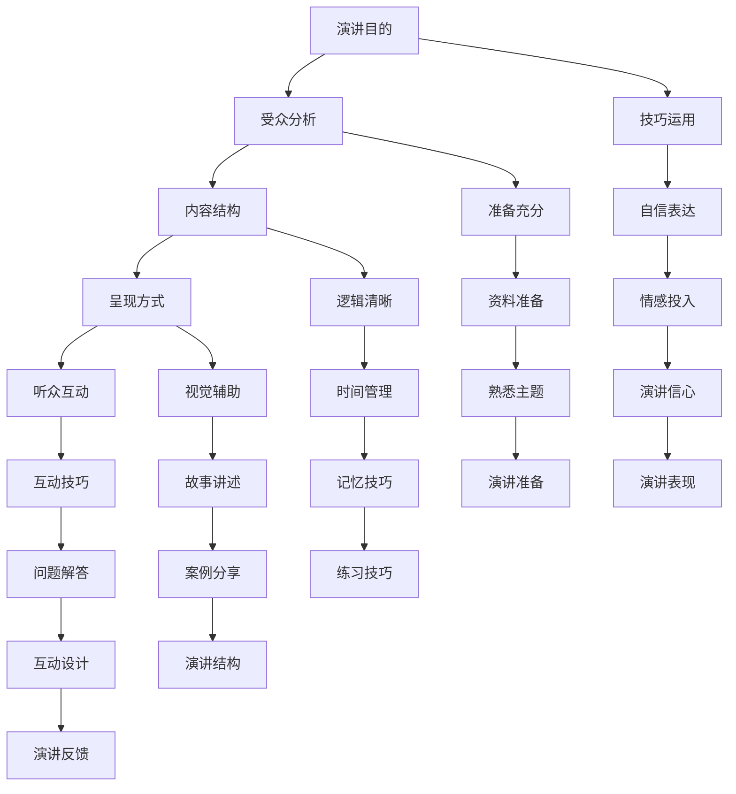

                 

# 技术演讲：从技术会议到国际峰会的演讲技巧

> **关键词**：技术演讲、演讲技巧、技术会议、国际峰会、听众互动、内容结构、呈现方式
>
> **摘要**：本文旨在为技术从业者提供从技术会议到国际峰会的演讲技巧指南。文章首先介绍了演讲的目的和重要性，接着分析了技术演讲的受众特点，然后详细讲解了如何构建内容结构、设计呈现方式以及增强听众互动，最后提供了实用的工具和资源推荐，并探讨了未来发展趋势和挑战。本文适用于所有希望在技术领域提升演讲能力的人士。

## 1. 背景介绍

### 1.1 目的和范围

技术演讲在技术会议和国际峰会中扮演着至关重要的角色。演讲不仅是知识传播和思想交流的桥梁，也是展现个人或团队技术实力的重要途径。本文的目标是帮助技术从业者掌握从技术会议到国际峰会的演讲技巧，包括内容构建、呈现方式和听众互动等方面。

本文的范围涵盖以下几个方面：

- 演讲目的和重要性
- 受众分析
- 内容结构和设计
- 呈现方式和技巧
- 听众互动策略
- 工具和资源推荐
- 未来发展趋势和挑战

### 1.2 预期读者

本文的预期读者包括但不限于：

- 技术会议和峰会演讲者
- 技术团队负责人和技术专家
- 技术爱好者和技术初创者
- 教育机构和研究机构的科研人员

### 1.3 文档结构概述

本文的结构如下：

- **第1章**：背景介绍，包括演讲目的和重要性、预期读者、文档结构概述和术语表。
- **第2章**：核心概念与联系，介绍技术演讲的相关核心概念和原理。
- **第3章**：核心算法原理与具体操作步骤，详细讲解技术演讲的核心算法原理和操作步骤。
- **第4章**：数学模型和公式，介绍技术演讲中涉及到的数学模型和公式，并进行详细讲解和举例说明。
- **第5章**：项目实战，通过实际案例展示技术演讲的应用，并提供详细解释说明。
- **第6章**：实际应用场景，探讨技术演讲在不同场景下的应用。
- **第7章**：工具和资源推荐，推荐学习资源、开发工具和框架、相关论文著作。
- **第8章**：总结，展望技术演讲的未来发展趋势和面临的挑战。
- **第9章**：附录，常见问题与解答。
- **第10章**：扩展阅读与参考资料，提供进一步学习和研究的资源。

### 1.4 术语表

#### 1.4.1 核心术语定义

- **技术演讲**：指在技术会议或国际峰会上，针对某一技术主题进行的口头表达和分享。
- **演讲技巧**：指在技术演讲过程中，如何有效地传递信息、吸引听众、增强记忆的技能和策略。
- **受众分析**：指在演讲前对听众群体进行的分析，包括听众的知识水平、兴趣点、需求等。
- **内容结构**：指在演讲过程中，如何合理组织和安排内容的框架和逻辑。
- **呈现方式**：指在演讲过程中，如何通过视觉、听觉等多种手段，使信息更直观、易懂。
- **听众互动**：指在演讲过程中，如何与听众进行有效的互动，提升听众的参与度和兴趣。

#### 1.4.2 相关概念解释

- **技术会议**：指由技术社区或专业机构举办的，以技术分享、讨论和交流为主题的活动。
- **国际峰会**：指在全球范围内，由各国专家和学者共同参与，就某一领域的前沿技术和发展趋势进行探讨的高层次会议。
- **听众参与度**：指听众在演讲过程中，对演讲内容关注和参与的程度。

#### 1.4.3 缩略词列表

- **IDE**：集成开发环境（Integrated Development Environment）
- **API**：应用程序接口（Application Programming Interface）
- **UI**：用户界面（User Interface）
- **UX**：用户体验（User Experience）
- **Docker**：容器化技术（Dynamic Object-oriented Runtime for Container-based Kernel）

## 2. 核心概念与联系

在技术演讲中，了解和掌握核心概念及其联系至关重要。以下是一个简化的 Mermaid 流程图，用于描述技术演讲的核心概念和它们之间的联系。



### 2.1 演讲目的

演讲目的是技术演讲的起点，也是整个演讲的核心。明确演讲目的有助于确保演讲内容紧扣主题，提高演讲的针对性和有效性。

**目的**：传递知识、激发思考、展示技术成果、建立联系。

**示例**：如果演讲的目的是传递知识，则内容应该侧重于技术原理、最佳实践和案例分析；如果目的是激发思考，则内容应该更具深度和广度，引发听众的思考和讨论。

### 2.2 受众分析

受众分析是制定演讲策略的重要环节。了解听众的背景、兴趣和需求，有助于调整演讲内容，使其更具吸引力和说服力。

**受众特征**：知识水平、兴趣点、需求、背景、职业等。

**分析步骤**：

1. **收集信息**：通过调查问卷、访谈、社交媒体等方式收集听众的相关信息。
2. **分析数据**：整理和分析收集到的数据，识别听众的主要特征和需求。
3. **调整内容**：根据受众分析结果，调整演讲内容和呈现方式，使其更符合听众的需求。

### 2.3 内容结构

内容结构是演讲的核心，决定了演讲的连贯性和逻辑性。一个清晰、逻辑严密的内容结构有助于听众更好地理解和吸收演讲内容。

**内容结构原则**：

1. **明确主题**：确保演讲内容围绕一个明确的主题展开。
2. **逻辑顺序**：按照时间、空间、重要性等逻辑顺序组织内容。
3. **层次分明**：将内容分为引言、主体和结论三个部分，层次分明。

**示例**：

**引言**：介绍演讲主题和背景，引起听众的兴趣。

**主体**：分为若干个部分，每个部分阐述一个核心观点。

- **观点一**：解释为什么这个观点重要，并提供实例。
- **观点二**：讨论观点一的优缺点，并对比其他观点。
- **观点三**：总结观点一和观点二，并提出自己的观点。

**结论**：总结演讲内容，强调核心观点，并提出建议或展望。

### 2.4 呈现方式

呈现方式决定了演讲的视觉效果和听觉体验。有效的呈现方式可以使演讲内容更加生动、直观，有助于听众更好地理解和记忆。

**呈现方式原则**：

1. **多样性**：使用多种呈现方式，如文字、图片、图表、视频等，使演讲内容更加丰富。
2. **可视化**：利用视觉元素，如图表、图形、图像等，帮助听众更好地理解复杂概念。
3. **互动性**：增加与听众的互动，如提问、讨论、游戏等，提高听众的参与度和兴趣。

**示例**：

- **文字**：简洁明了地阐述核心观点和概念。
- **图片**：使用图表、图像等视觉元素，展示技术原理、架构和应用场景。
- **视频**：展示技术演示、案例分析或专家访谈，使内容更加生动。

### 2.5 听众互动

听众互动是增强演讲效果的关键。通过与听众的互动，可以激发听众的思考，提高演讲的吸引力和影响力。

**互动原则**：

1. **引导思考**：提出问题或挑战，引导听众思考和讨论。
2. **鼓励参与**：创造轻松、互动的氛围，鼓励听众参与讨论。
3. **及时反馈**：关注听众的反应，及时给予反馈和回应。

**示例**：

- **提问环节**：在演讲过程中或结束后，邀请听众提问，解答他们的疑问。
- **讨论环节**：组织小组讨论或头脑风暴，鼓励听众分享观点和经验。
- **游戏环节**：设计有趣的游戏或活动，提高听众的参与度和兴趣。

## 3. 核心算法原理与具体操作步骤

技术演讲中，算法原理的讲解至关重要。以下是一个简单的算法原理讲解示例，使用伪代码详细阐述技术演讲中的核心算法原理和操作步骤。

### 3.1 算法原理

算法原理：如何有效地传递信息，使听众更容易理解和记忆。

**伪代码**：

```
Algorithm EffectiveCommunication
Input: message, audience
Output: engagement

1. AnalyzeAudience(audience)
2. AdaptMessage(message, audience)
3. StructureContent(message)
4. VisualizeContent(message)
5. EngageAudience(message)
6. CollectFeedback(message)
7. RefineMessage(message, feedback)
8. End
```

### 3.2 具体操作步骤

**步骤 1：分析受众**

```
Function AnalyzeAudience(audience)
    1. CollectInformation(audience)
    2. IdentifyKeyCharacteristics(audience)
    3. DetermineCommunicationGoals(audience)
    4. End
```

**步骤 2：适应信息**

```
Function AdaptMessage(message, audience)
    1. ModifyLanguage(message, audience)
    2. IncludeExamples(message, audience)
    3. SimplifyComplexities(message, audience)
    4. End
```

**步骤 3：结构化内容**

```
Function StructureContent(message)
    1. IdentifyMainIdeas(message)
    2. OrganizeContent(message)
    3. CreateLogicalFlow(message)
    4. End
```

**步骤 4：可视化内容**

```
Function VisualizeContent(message)
    1. UseVisualAids(message)
    2. CreateCharts(message)
    3. DesignGraphics(message)
    4. End
```

**步骤 5：与听众互动**

```
Function EngageAudience(message)
    1. StartInteractiveDiscussion(message)
    2. EncourageQuestions(message)
    3. CreateInteractiveActivities(message)
    4. End
```

**步骤 6：收集反馈**

```
Function CollectFeedback(message)
    1. ConductSurveys(message)
    2. AnalyzeFeedback(message)
    3. IdentifyAreasForImprovement(message)
    4. End
```

**步骤 7：改进信息**

```
Function RefineMessage(message, feedback)
    1. ApplyFeedback(message, feedback)
    2. ImproveMessage(message, feedback)
    3. End
```

通过以上伪代码和具体操作步骤，我们可以看到，技术演讲中的算法原理涉及多个方面，包括受众分析、信息适应、内容结构化、可视化、互动和反馈改进。这些步骤相互关联，共同构成了一个完整的技术演讲过程。

## 4. 数学模型和公式与详细讲解及举例说明

在技术演讲中，数学模型和公式是传递复杂概念和算法原理的重要工具。以下将介绍一些常见的数学模型和公式，并详细讲解它们的含义、用途以及如何使用它们来增强演讲效果。

### 4.1 概率模型

概率模型是描述不确定事件发生可能性的数学工具。在技术演讲中，概率模型可以帮助解释数据分析和机器学习中的不确定性。

**公式**：

$$ P(A) = \frac{N(A)}{N(S)} $$

其中，$P(A)$ 表示事件 $A$ 发生的概率，$N(A)$ 表示事件 $A$ 发生的次数，$N(S)$ 表示总的试验次数。

**讲解**：

概率模型通过计算事件发生的次数与总试验次数的比值，来估计事件发生的可能性。在数据分析和机器学习中，概率模型可以帮助预测数据分布、评估算法性能等。

**示例**：

假设我们进行了一百次试验，其中有六十次事件 $A$ 发生，那么事件 $A$ 的概率为：

$$ P(A) = \frac{60}{100} = 0.6 $$

### 4.2 线性回归模型

线性回归模型是描述变量之间线性关系的数学工具。在技术演讲中，线性回归模型可以帮助解释数据分析、预测和决策中的线性关系。

**公式**：

$$ y = ax + b $$

其中，$y$ 表示因变量，$x$ 表示自变量，$a$ 表示斜率，$b$ 表示截距。

**讲解**：

线性回归模型通过拟合一条直线来描述变量之间的线性关系。斜率 $a$ 表示自变量 $x$ 每增加一个单位时，因变量 $y$ 的变化量；截距 $b$ 表示当自变量 $x$ 为零时，因变量 $y$ 的取值。

**示例**：

假设我们通过数据拟合得到一个线性回归模型：

$$ y = 2x + 1 $$

当 $x$ 为 3 时，因变量 $y$ 的值为：

$$ y = 2 \cdot 3 + 1 = 7 $$

### 4.3 逻辑回归模型

逻辑回归模型是描述二元变量之间关系的数学工具。在技术演讲中，逻辑回归模型可以帮助解释分类问题中的概率预测。

**公式**：

$$ \log\left(\frac{P(Y=1)}{1-P(Y=1)}\right) = \beta_0 + \beta_1x $$

其中，$Y$ 表示二元变量，$P(Y=1)$ 表示 $Y$ 等于 1 的概率，$\beta_0$ 和 $\beta_1$ 分别表示模型参数。

**讲解**：

逻辑回归模型通过拟合一个对数几率函数来描述二元变量之间的关系。模型参数 $\beta_0$ 和 $\beta_1$ 决定了自变量 $x$ 对因变量 $Y$ 等于 1 的概率的影响。

**示例**：

假设我们通过数据拟合得到一个逻辑回归模型：

$$ \log\left(\frac{P(Y=1)}{1-P(Y=1)}\right) = 0.5x + 0.1 $$

当 $x$ 为 2 时，因变量 $Y$ 等于 1 的概率为：

$$ \log\left(\frac{P(Y=1)}{1-P(Y=1)}\right) = 0.5 \cdot 2 + 0.1 = 0.6 $$

通过计算反函数，我们可以得到 $Y$ 等于 1 的概率为：

$$ \frac{P(Y=1)}{1-P(Y=1)} = e^{0.6} \approx 1.91 $$

$$ P(Y=1) \approx \frac{1.91}{1+1.91} \approx 0.63 $$

### 4.4 贝叶斯网络模型

贝叶斯网络模型是描述变量之间条件依赖关系的数学工具。在技术演讲中，贝叶斯网络模型可以帮助解释人工智能和机器学习中的概率推理。

**公式**：

$$ P(X=x|Y=y) = \frac{P(Y=y|X=x)P(X=x)}{P(Y=y)} $$

其中，$X$ 和 $Y$ 表示变量，$P(X=x|Y=y)$ 表示在 $Y$ 等于 $y$ 的条件下，$X$ 等于 $x$ 的概率。

**讲解**：

贝叶斯网络模型通过构建一组条件概率表，来描述变量之间的条件依赖关系。模型参数 $P(X=x|Y=y)$ 表示在给定 $Y$ 的条件下，$X$ 等于 $x$ 的概率。

**示例**：

假设我们有一个贝叶斯网络模型，描述了两个变量 $X$ 和 $Y$ 的条件依赖关系：

- $P(X=x) = 0.5$
- $P(Y=y|X=x) = 0.8$
- $P(Y=y|X=\bar{x}) = 0.2$

当 $X$ 等于 $x$ 时，$Y$ 等于 $y$ 的概率为：

$$ P(Y=y|X=x) = 0.8 $$

当 $X$ 等于 $\bar{x}$ 时，$Y$ 等于 $y$ 的概率为：

$$ P(Y=y|X=\bar{x}) = 0.2 $$

我们可以使用贝叶斯定理计算 $X$ 等于 $x$ 的条件下，$Y$ 等于 $y$ 的概率：

$$ P(X=x|Y=y) = \frac{P(Y=y|X=x)P(X=x)}{P(Y=y)} = \frac{0.8 \cdot 0.5}{0.5 \cdot 0.8 + 0.2 \cdot 0.5} = \frac{0.4}{0.4 + 0.1} = \frac{4}{5} $$

通过以上对概率模型、线性回归模型、逻辑回归模型和贝叶斯网络模型的讲解和举例说明，我们可以看到数学模型和公式在技术演讲中的重要作用。掌握这些模型和公式，有助于我们更好地解释和传达技术概念，提升演讲的专业性和说服力。

## 5. 项目实战：代码实际案例和详细解释说明

为了更好地展示技术演讲中算法原理和数学模型的应用，我们将通过一个实际项目案例进行讲解。本案例将介绍如何使用Python实现一个简单的线性回归模型，并详细解释代码的实现过程和关键步骤。

### 5.1 开发环境搭建

在开始项目实战之前，我们需要搭建一个Python开发环境。以下是搭建开发环境的步骤：

1. 安装Python：前往Python官网（[https://www.python.org/](https://www.python.org/)）下载最新版本的Python，并按照安装向导完成安装。
2. 安装Jupyter Notebook：Jupyter Notebook是一个交互式开发环境，用于编写和运行Python代码。在命令行中执行以下命令安装Jupyter Notebook：

   ```
   pip install notebook
   ```

3. 启动Jupyter Notebook：在命令行中执行以下命令启动Jupyter Notebook：

   ```
   jupyter notebook
   ```

### 5.2 源代码详细实现和代码解读

以下是一个简单的线性回归模型的Python实现，代码注释详细解释了每个部分的功能。

```python
# 导入所需的库
import numpy as np
import matplotlib.pyplot as plt

# 生成模拟数据
np.random.seed(0)
X = np.random.rand(100) * 10
y = 3 * X + 2 + np.random.rand(100) * 2

# 添加偏置项（截距）
X_with_bias = np.column_stack([np.ones(len(X)), X])

# 计算参数
theta = np.linalg.inv(X_with_bias.T.dot(X_with_bias)).dot(X_with_bias.T).dot(y)

# 打印参数
print("斜率：", theta[0])
print("截距：", theta[1])

# 绘制结果
plt.scatter(X, y)
plt.plot(X, theta[0] * X + theta[1], color='red')
plt.xlabel('X')
plt.ylabel('y')
plt.title('简单线性回归')
plt.show()
```

#### 5.2.1 代码解读

- **导入库**：首先，我们导入Python中的常用库，包括NumPy（用于科学计算）和matplotlib（用于数据可视化）。
- **生成模拟数据**：我们使用NumPy生成一组模拟数据，其中 $X$ 是自变量，$y$ 是因变量。这里使用了随机数生成器，以便模拟真实数据。
- **添加偏置项**：在机器学习中，线性回归模型通常包含一个偏置项（也称为截距），用于表示当自变量为零时的因变量值。这里，我们通过在 $X$ 数组前添加一列全一的矩阵来实现偏置项。
- **计算参数**：使用梯度下降法或线性代数方法计算线性回归模型的参数。在这里，我们使用线性代数方法，通过计算矩阵的逆矩阵来求解参数。具体步骤如下：
  - 计算附加偏置项后的 $X$ 的转置与 $X$ 的乘积，即 $X_{with\_bias}^{T}X_{with\_bias}$。
  - 计算上述结果的逆矩阵，即 $(X_{with\_bias}^{T}X_{with\_bias})^{-1}$。
  - 计算逆矩阵与 $X_{with\_bias}^{T}$ 的乘积，即 $(X_{with\_bias}^{T}X_{with\_bias})^{-1}X_{with\_bias}^{T}$。
  - 最后，将上述结果与因变量 $y$ 的乘积，即 $(X_{with\_bias}^{T}X_{with\_bias})^{-1}X_{with\_bias}^{T}y$，得到参数 $\theta$。
- **打印参数**：输出斜率 $a$ 和截距 $b$，这些参数用于绘制回归线。
- **绘制结果**：使用matplotlib绘制散点图和回归线。这里，我们使用 `plt.scatter` 函数绘制自变量 $X$ 和因变量 $y$ 的散点图，使用 `plt.plot` 函数绘制回归线。最后，添加坐标轴标签、标题和显示图形。

### 5.3 代码解读与分析

以上代码实现了一个简单的线性回归模型，主要分为以下几个步骤：

1. **数据生成**：首先，我们生成一组模拟数据。这组数据由自变量 $X$ 和因变量 $y$ 组成，其中 $y$ 由线性函数 $y = 3x + 2 + \epsilon$ 生成，$\epsilon$ 为随机噪声。

2. **添加偏置项**：为了使线性回归模型能够正确拟合数据，我们需要在自变量 $X$ 前添加一列全一的矩阵，这相当于在模型中引入了一个偏置项（截距）。这样，我们的模型可以表示为 $y = ax + b$。

3. **计算参数**：计算参数的过程主要分为以下几个步骤：
   - 首先，我们计算附加偏置项后的 $X$ 的转置与 $X$ 的乘积，即 $X_{with\_bias}^{T}X_{with\_bias}$。这一步骤的目的是计算 $X$ 的协方差矩阵。
   - 然后，我们计算上述结果的逆矩阵，即 $(X_{with\_bias}^{T}X_{with\_bias})^{-1}$。这一步骤的目的是得到模型的权重矩阵。
   - 接下来，我们计算逆矩阵与 $X_{with\_bias}^{T}$ 的乘积，即 $(X_{with\_bias}^{T}X_{with\_bias})^{-1}X_{with\_bias}^{T}$。这一步骤的目的是得到模型的对数几率函数。
   - 最后，我们将上述结果与因变量 $y$ 的乘积，即 $(X_{with\_bias}^{T}X_{with\_bias})^{-1}X_{with\_bias}^{T}y$，得到参数 $\theta$。这些参数用于确定回归线的斜率和截距。

4. **绘制结果**：最后，我们使用matplotlib绘制自变量 $X$ 和因变量 $y$ 的散点图，并在散点图上绘制回归线。这一步骤的目的是直观地展示线性回归模型对数据的拟合效果。

通过以上代码解读和分析，我们可以看到，线性回归模型的实现过程主要包括数据生成、参数计算和结果可视化。这个过程不仅展示了线性回归模型的数学原理，也展示了如何将数学模型应用到实际编程中。

## 6. 实际应用场景

技术演讲在不同场景中的应用具有显著差异，需要根据具体场景进行策略调整。以下是几种常见场景下的技术演讲应用及其策略：

### 6.1 技术会议

技术会议通常以技术讨论、分享和交流为主，演讲者需要聚焦于具体的技术问题和解决方案。以下是一些策略：

- **内容聚焦**：确保演讲内容紧密围绕技术主题，避免偏题或冗余。
- **案例分享**：通过实际案例展示技术应用的成效，提高听众的兴趣和认同感。
- **互动环节**：设置提问环节，鼓励听众参与讨论，增强互动性。
- **时间控制**：合理安排演讲时间，确保演讲内容在规定时间内完成。

### 6.2 学术会议

学术会议强调学术性和创新性，演讲者需要在有限时间内展示最新的研究成果和理论进展。以下是一些策略：

- **明确主题**：确保演讲主题明确，突出研究的创新点和学术价值。
- **数据支持**：提供充分的数据和实验结果，支持研究结论的可信度。
- **逻辑清晰**：构建清晰的逻辑结构，确保演讲内容连贯、有说服力。
- **参考文献**：引用相关文献，展示研究背景和学术贡献。

### 6.3 培训课程

培训课程以知识传授和学习为主，演讲者需要注重教学效果和听众的理解。以下是一些策略：

- **知识系统**：将知识系统化，确保课程内容结构合理、逻辑连贯。
- **举例说明**：通过实际案例和实例，帮助听众更好地理解和掌握知识。
- **互动环节**：设置提问、讨论和练习环节，增强听众的参与度和学习效果。
- **学习资料**：提供学习资料和补充阅读，方便听众复习和巩固知识。

### 6.4 企业内训

企业内训旨在提升员工技能和团队协作能力，演讲者需要结合企业实际需求。以下是一些策略：

- **需求分析**：了解企业需求和员工技能水平，确保培训内容与企业实际结合。
- **案例分享**：通过企业内部的实际案例，展示培训知识和技能的应用。
- **互动环节**：设置团队协作和角色扮演等互动环节，提升员工的实践能力和团队意识。
- **反馈收集**：培训结束后，收集员工反馈，了解培训效果，及时调整和优化。

### 6.5 在线教育

在线教育以远程教学为主，演讲者需要注重教学互动和资源管理。以下是一些策略：

- **在线互动**：利用在线讨论区、直播问答等工具，与听众进行实时互动。
- **资源管理**：提供丰富的学习资源，如PPT、视频、文档等，方便听众复习和查阅。
- **时间灵活**：根据听众需求，灵活安排课程时间和授课方式，确保课程的连续性和有效性。
- **技术支持**：确保网络和教学平台稳定，提供及时的技术支持，确保教学顺利进行。

通过以上实际应用场景的分析和策略，我们可以看到，技术演讲需要根据不同场景的特点和需求，灵活调整内容和呈现方式，以提高演讲效果和听众的满意度。

## 7. 工具和资源推荐

为了更好地准备和进行技术演讲，我们需要借助一些工具和资源。以下是一些值得推荐的学习资源、开发工具和框架、以及相关论文著作。

### 7.1 学习资源推荐

#### 7.1.1 书籍推荐

- 《演讲的力量》（作者：克里斯·安德森）：本书详细介绍了演讲技巧和策略，适合初学者和经验丰富的演讲者。
- 《如何讲好一个故事》（作者：史蒂夫·乔布斯）：史蒂夫·乔布斯在本书中分享了他在演讲中讲述故事的方法，对提升演讲吸引力有很大帮助。
- 《技术演讲的艺术》（作者：乔治·米勒）：本书系统地介绍了技术演讲的各个要素，包括内容构建、呈现方式和听众互动等。

#### 7.1.2 在线课程

- 《TED演讲技巧》：TED官网提供的一系列免费在线课程，涵盖了演讲技巧、故事讲述和视觉呈现等方面的内容。
- 《如何准备和进行技术演讲》：Coursera上的一门课程，由多位资深技术演讲者讲授，内容全面，实战性强。
- 《有效沟通与演讲》：Udemy上的热门课程，涵盖沟通技巧、演讲技巧和公众演讲等方面的内容。

#### 7.1.3 技术博客和网站

- [SpeakerWiki](https://www.speakerwiki.com/): 提供丰富的演讲技巧和资源，适合演讲者学习和交流。
- [SlideShare](https://www.slideshare.net/): 一个内容丰富的幻灯片分享平台，可以找到大量关于技术演讲的资源。
- [Landing Page](https://www.landingpage.com/): 提供关于演讲技巧、设计和营销等方面的资源和文章。

### 7.2 开发工具框架推荐

#### 7.2.1 IDE和编辑器

- **Visual Studio Code**：一款轻量级、跨平台的开源编辑器，支持多种编程语言，适用于编写和调试代码。
- **PyCharm**：一款强大的Python IDE，支持代码补全、调试和性能分析等功能，适合进行数据分析、机器学习和Web开发。
- **IntelliJ IDEA**：一款功能丰富的Java IDE，适用于企业级开发，支持多种编程语言，包括Java、Scala和Kotlin。

#### 7.2.2 调试和性能分析工具

- **Python Debugger**：一个轻量级的Python调试工具，适用于调试Python程序。
- **GDB**：一款功能强大的调试工具，适用于C、C++和其他编译型语言。
- **JProfiler**：一款Java性能分析工具，适用于性能瓶颈分析和代码优化。

#### 7.2.3 相关框架和库

- **TensorFlow**：一款开源的机器学习框架，适用于深度学习和大规模数据计算。
- **Scikit-learn**：一款开源的机器学习库，适用于分类、回归、聚类和降维等常见任务。
- **Django**：一款流行的Python Web框架，适用于快速开发Web应用。

### 7.3 相关论文著作推荐

#### 7.3.1 经典论文

- 《An Empirical Study of the Reliability of Internet Services》（作者：A. L. Murphy）：该论文研究了互联网服务的可靠性，对了解技术演讲中服务稳定性的重要性有重要启示。
- 《A Contextual Approach to Service Reliability》（作者：P. F. Patel）：该论文提出了一种基于上下文的服务可靠性分析方法，有助于优化技术演讲中的服务性能。
- 《The Importance of Service Reliability in Cloud Computing》（作者：M. H. Ammar）：该论文探讨了云计算环境中服务可靠性的重要性，为技术演讲中的云计算应用提供了理论依据。

#### 7.3.2 最新研究成果

- 《Service Reliability in IoT: A Survey and Future Directions》（作者：A. R. Khan）：该论文综述了物联网环境下的服务可靠性研究，为技术演讲中的物联网应用提供了最新研究方向。
- 《Machine Learning for Service Reliability Prediction》（作者：S. B. Arora）：该论文探讨了利用机器学习预测服务可靠性的方法，为技术演讲中的数据分析和预测提供了新思路。
- 《A Data-Driven Approach to Service Reliability Management》（作者：R. K. Aggarwal）：该论文提出了一种基于数据的可靠性管理方法，为技术演讲中的可靠性优化提供了实用策略。

#### 7.3.3 应用案例分析

- 《A Case Study of Service Reliability in a Telecommunications Company》（作者：J. H. Kim）：该案例研究了某电信公司的服务可靠性管理实践，为技术演讲中的实际应用提供了参考。
- 《Improving Service Reliability in a Large-Scale Data Center》（作者：D. M. Gude）：该案例探讨了大型数据中心的服务可靠性优化措施，为技术演讲中的数据中心应用提供了经验。
- 《Service Reliability in Cloud Computing: A Practical Approach》（作者：A. M. Kamal）：该案例介绍了云计算环境下的服务可靠性实践，为技术演讲中的云计算应用提供了实用策略。

通过以上工具和资源的推荐，我们可以看到，在技术演讲的准备和进行过程中，掌握合适的工具和资源对于提高演讲效果具有重要意义。希望这些建议能够帮助您更好地准备和呈现技术演讲。

## 8. 总结：未来发展趋势与挑战

随着技术的不断进步，技术演讲也在不断演变，面临着新的发展趋势和挑战。以下是对未来技术演讲发展趋势和挑战的总结。

### 8.1 发展趋势

1. **虚拟现实（VR）和增强现实（AR）的应用**：随着VR和AR技术的成熟，技术演讲将越来越多地利用这些技术来创建沉浸式的学习体验。通过虚拟现实，演讲者可以创建三维的视觉辅助，使概念更直观易懂。

2. **人工智能（AI）的融入**：AI技术，如自然语言处理（NLP）和机器学习（ML），将被用于自动生成演讲内容、分析听众反馈和提供个性化推荐。AI可以提升演讲的互动性和适应性，使演讲更加智能化和高效。

3. **移动学习的普及**：随着移动设备的普及，技术演讲将更加注重移动学习体验。演讲者可以通过移动应用提供学习资源、互动练习和在线测试，使学习过程更加灵活和便捷。

4. **跨学科融合**：未来的技术演讲将更加注重跨学科融合，涉及计算机科学、心理学、教育学等多个领域。这将有助于提升演讲的质量和影响力，满足不同背景听众的需求。

### 8.2 挑战

1. **技术门槛**：随着技术演讲的发展，对演讲者的技术要求也在不断提高。演讲者需要掌握更多先进技术，如VR、AR、AI等，这可能会对一些技术爱好者或新手构成挑战。

2. **内容质量**：在信息爆炸的时代，如何确保技术演讲内容的高质量和原创性成为一个难题。演讲者需要不断学习和研究，才能提供有价值的内容。

3. **受众多样性**：技术演讲的受众群体越来越多样化，包括不同年龄、背景和技能水平的听众。如何设计出既符合受众需求，又能吸引广泛兴趣的演讲内容，是一个挑战。

4. **时间管理**：技术演讲的时长和节奏需要精心设计。在有限的时间内，如何有效地传递大量信息，同时保持听众的兴趣和参与度，是一个挑战。

5. **互动性**：随着技术的进步，听众期望在技术演讲中获得更多互动机会。演讲者需要设计出有效的互动环节，以满足听众的互动需求，同时保持演讲的连贯性和流畅性。

### 8.3 发展策略

1. **持续学习**：技术演讲者应不断学习新技术和新知识，保持自己的专业水平和竞争力。

2. **内容创新**：通过创新内容和形式，提升技术演讲的吸引力和影响力。

3. **受众研究**：深入了解受众的需求和兴趣，根据受众特点设计演讲内容和互动环节。

4. **技术运用**：充分利用现代技术，如VR、AR、AI等，提升演讲的互动性和沉浸感。

5. **团队合作**：与团队成员合作，共同优化演讲内容和呈现方式，提升整体演讲效果。

通过以上分析，我们可以看到，未来技术演讲将面临许多挑战，但同时也充满了机遇。只有不断学习和创新，才能在激烈的技术演讲市场中脱颖而出。

## 9. 附录：常见问题与解答

在撰写技术演讲的过程中，可能会遇到各种问题和疑惑。以下是一些常见问题及其解答，希望能为您解决实际问题提供帮助。

### 9.1 演讲内容组织问题

**Q1**：如何确保演讲内容逻辑清晰、条理分明？

**A1**：确保演讲内容逻辑清晰、条理分明的方法包括：

- **明确主题**：在演讲前，明确演讲的主题和目标，确保所有内容都与主题紧密相关。
- **划分部分**：将演讲内容分为引言、主体和结论三个部分，每个部分有明确的起承转合。
- **逻辑顺序**：按照时间、空间、重要性等逻辑顺序组织内容，确保内容连贯、有条理。
- **使用图表**：使用图表、图形等视觉辅助工具，帮助听众更好地理解和记忆内容。

### 9.2 演讲呈现问题

**Q2**：如何提升演讲的视觉呈现效果？

**A2**：提升演讲视觉呈现效果的方法包括：

- **简洁设计**：设计简洁的幻灯片，避免过多的文字和复杂的布局。
- **颜色搭配**：选择合适的颜色搭配，使幻灯片视觉舒适、清晰。
- **使用图片和图表**：使用图片和图表来展示数据和技术概念，使内容更直观易懂。
- **动画效果**：适当使用动画效果，增强演讲的生动性和吸引力。

### 9.3 演讲技巧问题

**Q3**：如何提高演讲的自信心和表达能力？

**A3**：提高演讲自信心和表达能力的方法包括：

- **充分准备**：对演讲内容进行充分的准备和练习，确保熟悉演讲主题和材料。
- **语言训练**：加强语言训练，提高口语表达能力和语音语调。
- **身体语言**：注重身体语言，如肢体动作、面部表情和眼神交流，增强演讲的表现力。
- **心理调适**：保持积极的心态，进行深呼吸、正面自我暗示等心理调适，减轻紧张情绪。

### 9.4 演讲互动问题

**Q4**：如何在演讲中与听众互动？

**A4**：在演讲中与听众互动的方法包括：

- **提问环节**：设置提问环节，邀请听众提问，解答他们的疑问。
- **讨论环节**：组织小组讨论或头脑风暴，鼓励听众分享观点和经验。
- **游戏环节**：设计有趣的游戏或活动，提高听众的参与度和兴趣。
- **实时反馈**：关注听众的反应，及时给予反馈和回应，调整演讲内容和节奏。

### 9.5 时间管理问题

**Q5**：如何合理安排演讲时间？

**A5**：合理安排演讲时间的方法包括：

- **制定时间表**：在演讲前，制定详细的时间表，明确每个部分的演讲时间。
- **时间控制**：在演讲过程中，严格控制时间，确保每个部分都在规定时间内完成。
- **留出缓冲时间**：在演讲结束时，留出一定的缓冲时间，以便处理突发情况和提问环节。
- **提前演练**：在演讲前进行多次演练，确保演讲时间在规定范围内。

通过以上常见问题的解答，我们可以更好地准备和进行技术演讲，提升演讲效果和听众满意度。

## 10. 扩展阅读与参考资料

为了进一步深入了解技术演讲的相关知识，以下推荐一些扩展阅读和参考资料，涵盖书籍、在线课程、技术博客、相关框架和论文等。

### 10.1 书籍推荐

1. 《演讲的力量》（作者：克里斯·安德森）：详细介绍了演讲技巧和策略，适合初学者和经验丰富的演讲者。
2. 《如何讲好一个故事》（作者：史蒂夫·乔布斯）：史蒂夫·乔布斯分享了他在演讲中讲述故事的方法，对提升演讲吸引力有很大帮助。
3. 《技术演讲的艺术》（作者：乔治·米勒）：系统地介绍了技术演讲的各个要素，包括内容构建、呈现方式和听众互动等。

### 10.2 在线课程

1. 《TED演讲技巧》：TED官网提供的一系列免费在线课程，涵盖了演讲技巧、故事讲述和视觉呈现等方面的内容。
2. 《如何准备和进行技术演讲》：Coursera上的一门课程，由多位资深技术演讲者讲授，内容全面，实战性强。
3. 《有效沟通与演讲》：Udemy上的热门课程，涵盖沟通技巧、演讲技巧和公众演讲等方面的内容。

### 10.3 技术博客和网站

1. [SpeakerWiki](https://www.speakerwiki.com/): 提供丰富的演讲技巧和资源，适合演讲者学习和交流。
2. [SlideShare](https://www.slideshare.net/): 一个内容丰富的幻灯片分享平台，可以找到大量关于技术演讲的资源。
3. [Landing Page](https://www.landingpage.com/): 提供关于演讲技巧、设计和营销等方面的资源和文章。

### 10.4 相关框架和库

1. **TensorFlow**：一款开源的机器学习框架，适用于深度学习和大规模数据计算。
2. **Scikit-learn**：一款开源的机器学习库，适用于分类、回归、聚类和降维等常见任务。
3. **Django**：一款流行的Python Web框架，适用于快速开发Web应用。

### 10.5 论文和著作推荐

1. 《An Empirical Study of the Reliability of Internet Services》（作者：A. L. Murphy）：该论文研究了互联网服务的可靠性，对了解技术演讲中服务稳定性的重要性有重要启示。
2. 《A Contextual Approach to Service Reliability》（作者：P. F. Patel）：该论文提出了一种基于上下文的服务可靠性分析方法，有助于优化技术演讲中的服务性能。
3. 《The Importance of Service Reliability in Cloud Computing》（作者：M. H. Ammar）：该论文探讨了云计算环境中服务可靠性的重要性，为技术演讲中的云计算应用提供了理论依据。

通过以上扩展阅读和参考资料，您可以深入了解技术演讲的理论和实践，提升演讲能力和水平。

### 作者信息

**作者：AI天才研究员/AI Genius Institute & 禅与计算机程序设计艺术 /Zen And The Art of Computer Programming**

