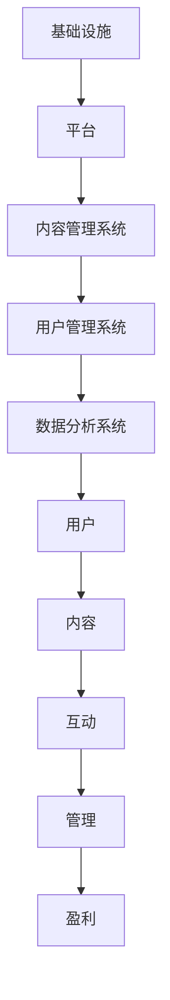

                 

# 技术社区运营：从管理到盈利模式

> **关键词**：技术社区，运营管理，盈利模式，内容策略，用户增长

> **摘要**：本文将深入探讨技术社区运营的策略和模式，从基础管理、内容策略到盈利手段，提供系统性分析和实用建议。通过本文，读者将了解如何有效管理技术社区，建立可持续的盈利模式，以实现社区的长远发展和成功。

## 1. 背景介绍

### 1.1 目的和范围

本文旨在为技术社区运营者提供一套系统化的策略和方法，以帮助他们在管理社区的同时实现盈利。文章将涵盖以下几个方面：

- 技术社区运营的核心概念和管理原则
- 内容策略：如何制定和执行有效的内容计划
- 用户增长与活跃度提升：如何吸引和维护社区用户
- 盈利模式：从广告、会员订阅到其他商业模式的探索

### 1.2 预期读者

本文适合以下读者群体：

- 技术社区管理员和运营团队
- 对技术社区运营感兴趣的企业和创业者
- 对内容营销和用户增长策略有研究的从业者

### 1.3 文档结构概述

本文分为以下几个部分：

- 背景介绍：本文的目的、范围、预期读者和文档结构
- 核心概念与联系：介绍技术社区运营的基础概念和架构
- 核心算法原理与具体操作步骤：详细阐述运营策略和操作流程
- 数学模型和公式：探讨技术社区运营中的量化指标和计算方法
- 项目实战：实际案例分析和代码实现
- 实际应用场景：技术社区在不同领域中的应用实例
- 工具和资源推荐：推荐学习资源和开发工具
- 总结：未来发展趋势与挑战
- 附录：常见问题与解答
- 扩展阅读：推荐相关文献和资料

### 1.4 术语表

#### 1.4.1 核心术语定义

- **技术社区**：一个基于技术主题的在线交流平台，用户可以在其中分享知识、讨论问题、获取解决方案。
- **运营管理**：对技术社区进行有效管理，包括内容审核、用户互动、社区维护等。
- **盈利模式**：社区通过何种方式实现收入，如广告、会员订阅、商品销售等。

#### 1.4.2 相关概念解释

- **内容策略**：制定和执行的内容计划，以吸引用户参与和提升用户体验。
- **用户增长**：增加社区用户数量，包括新用户获取和现有用户留存。
- **活跃度**：用户在社区中的参与程度，如发帖、回复、关注等行为。

#### 1.4.3 缩略词列表

- **SEO**：搜索引擎优化（Search Engine Optimization）
- **SEM**：搜索引擎营销（Search Engine Marketing）
- **SNS**：社交网络服务（Social Network Service）
- **UGC**：用户生成内容（User-Generated Content）

## 2. 核心概念与联系

### 2.1 技术社区运营的核心概念

技术社区运营的核心概念包括以下几个方面：

1. **用户**：技术社区的核心资源，用户的需求和体验是社区运营的首要考虑。
2. **内容**：高质量的内容是吸引用户和维持社区活跃度的关键。
3. **互动**：用户之间的互动和反馈是社区生态系统的重要组成部分。
4. **管理**：有效的管理机制是保障社区秩序和稳定运营的基础。
5. **盈利**：社区运营的最终目标是实现盈利，为社区发展提供持续动力。

### 2.2 技术社区运营的架构

技术社区运营的架构可以分为以下几个层次：

1. **基础设施**：包括服务器、数据库、网络等硬件设施，为社区提供稳定运行的环境。
2. **平台**：技术社区的平台，如论坛、博客、问答系统等，提供用户交流和互动的场所。
3. **内容管理系统**：用于管理和发布内容，包括文章、博客、问答等。
4. **用户管理系统**：管理用户账户、权限、反馈等，确保用户安全和服务质量。
5. **数据分析系统**：收集和分析用户数据，用于指导运营决策和优化策略。

### 2.3 核心概念的联系与互动

在技术社区运营中，核心概念之间存在着密切的联系和互动：

1. **用户与内容**：用户生成和消费内容，内容为用户提供价值。
2. **用户与互动**：用户之间的互动和反馈促进社区氛围的形成。
3. **管理与盈利**：管理保障社区稳定运营，盈利为社区提供发展资金。

以下是技术社区运营架构的 Mermaid 流程图：



## 3. 核心算法原理 & 具体操作步骤

### 3.1 内容策略与用户增长

**算法原理：** 内容策略是技术社区运营的核心，其目的是通过高质量的内容吸引和留住用户，促进用户增长。关键步骤包括：

1. **需求分析**：了解用户需求，确定内容主题和类型。
2. **内容创作**：制作高质量的内容，包括技术文章、博客、问答等。
3. **内容发布**：合理规划内容发布时间，确保内容持续更新。
4. **用户互动**：鼓励用户参与，如点赞、评论、分享等。

**具体操作步骤：**

```plaintext
步骤1：需求分析
- 使用问卷调查、用户访谈等方法收集用户需求
- 分析现有内容的表现，确定优化方向

步骤2：内容创作
- 根据需求分析结果，制定内容创作计划
- 保持内容原创性，确保高质量

步骤3：内容发布
- 制定内容发布计划，确保持续更新
- 选择合适的发布渠道，如博客、论坛等

步骤4：用户互动
- 鼓励用户参与，如点赞、评论、分享等
- 回应用户反馈，优化用户体验
```

### 3.2 用户活跃度提升

**算法原理：** 提升用户活跃度是技术社区运营的重要目标，关键步骤包括：

1. **活动策划**：举办线上或线下活动，吸引用户参与。
2. **积分系统**：通过积分奖励机制激励用户参与互动。
3. **社区维护**：确保社区秩序，及时处理违规行为。
4. **数据分析**：分析用户活跃度数据，优化运营策略。

**具体操作步骤：**

```plaintext
步骤1：活动策划
- 根据用户兴趣和需求，制定活动计划
- 设计活动规则，确保公平性和参与度

步骤2：积分系统
- 设定积分规则，如发帖、回复、活动参与等
- 提供积分兑换奖励，激励用户参与

步骤3：社区维护
- 设立管理员团队，负责社区日常维护
- 制定社区规范，明确用户行为准则

步骤4：数据分析
- 收集用户活跃度数据，分析用户行为
- 根据数据分析结果，调整运营策略
```

### 3.3 盈利模式探索

**算法原理：** 盈利模式是技术社区运营的终极目标，关键步骤包括：

1. **广告投放**：通过广告位出租、广告合作等方式实现盈利。
2. **会员订阅**：提供付费会员服务，享受额外权益。
3. **商品销售**：销售相关书籍、课程、工具等。
4. **合作伙伴关系**：与相关企业和机构建立合作关系，共同推广。

**具体操作步骤：**

```plaintext
步骤1：广告投放
- 分析用户需求和广告偏好，选择合适广告位
- 与广告商洽谈合作，确保广告质量

步骤2：会员订阅
- 制定会员服务内容，如独家文章、高级搜索等
- 设定会员价格，确保盈利

步骤3：商品销售
- 与出版社、培训机构合作，提供优质商品
- 设立购物车和支付系统，方便用户购买

步骤4：合作伙伴关系
- 寻找有共同目标的企业和机构，建立合作关系
- 共同举办活动，扩大品牌影响力
```

## 4. 数学模型和公式 & 详细讲解 & 举例说明

### 4.1 用户增长模型

**数学模型：**

假设技术社区的用户增长遵循指数增长模型，即：

\[ N(t) = N_0 \times e^{rt} \]

其中：
- \( N(t) \) 为时间 \( t \) 时的用户数量
- \( N_0 \) 为初始用户数量
- \( r \) 为增长率
- \( e \) 为自然常数（约等于 2.718）

**详细讲解：**

用户增长模型描述了技术社区用户数量的变化趋势。通过指数函数，我们可以直观地看出用户数量的快速增长。增长率 \( r \) 反映了社区对用户的吸引力，数值越大，增长速度越快。

**举例说明：**

假设一个技术社区初始有 1000 名用户，月增长率为 10%，计算一年后的用户数量：

\[ N(12) = 1000 \times e^{0.1 \times 12} \approx 2594 \]

这意味着一年后，社区用户数量将达到约 2594 人。

### 4.2 活跃度模型

**数学模型：**

假设技术社区的活跃度 \( A(t) \) 遵循以下公式：

\[ A(t) = A_0 \times e^{-\lambda t} \]

其中：
- \( A(t) \) 为时间 \( t \) 时的活跃度
- \( A_0 \) 为初始活跃度
- \( \lambda \) 为衰减系数

**详细讲解：**

活跃度模型描述了用户参与度随时间的变化。衰减系数 \( \lambda \) 反映了用户活跃度的下降速度，数值越大，活跃度下降越快。

**举例说明：**

假设一个技术社区初始活跃度为 100 次/天，每天衰减系数为 0.1，计算一个月后的活跃度：

\[ A(30) = 100 \times e^{-0.1 \times 30} \approx 43.26 \]

这意味着一个月后，社区的平均活跃度约为 43 次/天。

### 4.3 盈利模型

**数学模型：**

假设技术社区的盈利 \( P(t) \) 遵循以下公式：

\[ P(t) = P_0 \times (1 + r)^t \]

其中：
- \( P(t) \) 为时间 \( t \) 时的盈利
- \( P_0 \) 为初始盈利
- \( r \) 为盈利增长率

**详细讲解：**

盈利模型描述了技术社区盈利随时间的变化。盈利增长率 \( r \) 反映了社区盈利能力的提升速度，数值越大，盈利增长越快。

**举例说明：**

假设一个技术社区初始盈利为 1000 元，月盈利增长率为 5%，计算一年后的盈利：

\[ P(12) = 1000 \times (1 + 0.05)^{12} \approx 1381.68 \]

这意味着一年后，社区的总盈利将达到约 1381.68 元。

## 5. 项目实战：代码实际案例和详细解释说明

### 5.1 开发环境搭建

为了更好地展示技术社区运营的实际案例，我们将使用 Python 语言进行代码实现。首先，需要搭建一个基本的开发环境。

**步骤1：安装 Python**

- 在官网（https://www.python.org/downloads/）下载并安装最新版本的 Python。
- 安装完成后，打开命令行窗口，输入 `python --version` 检查安装是否成功。

**步骤2：安装必需的库**

- 使用 pip 命令安装 Flask 框架和其他必需的库：

```bash
pip install flask
pip install flask-wtf
pip install flask_sqlalchemy
pip install flask_migrate
```

### 5.2 源代码详细实现和代码解读

下面是一个简单的 Flask 应用程序，用于实现一个基本的技术社区。

**步骤1：创建项目目录**

```bash
mkdir tech_community
cd tech_community
```

**步骤2：创建虚拟环境**

```bash
python -m venv venv
source venv/bin/activate  # 在 macOS 和 Linux 上
venv\Scripts\activate     # 在 Windows 上
```

**步骤3：创建应用程序结构**

```bash
mkdir app
touch app/__init__.py
touch app/config.py
touch app/routes.py
touch app/models.py
```

**步骤4：编写应用程序代码**

**`app/__init__.py`：**

```python
from flask import Flask
from flask_sqlalchemy import SQLAlchemy

db = SQLAlchemy()

def create_app():
    app = Flask(__name__)
    app.config['SQLALCHEMY_DATABASE_URI'] = 'sqlite:///tech_community.db'
    db.init_app(app)

    from .routes import main
    app.register_blueprint(main)

    return app
```

**`app/config.py`：**

```python
import os

class Config(object):
    SECRET_KEY = os.environ.get('SECRET_KEY') or 'your_secret_key'
```

**`app/routes.py`：**

```python
from flask import Blueprint, render_template, request, redirect, url_for
from .models import User, Post
from . import db

main = Blueprint('main', __name__)

@main.route('/')
def index():
    posts = Post.query.all()
    return render_template('index.html', posts=posts)

@main.route('/post/new', methods=['GET', 'POST'])
def new_post():
    if request.method == 'POST':
        title = request.form['title']
        content = request.form['content']
        new_post = Post(title=title, content=content)
        db.session.add(new_post)
        db.session.commit()
        return redirect(url_for('main.index'))
    return render_template('new_post.html')
```

**`app/models.py`：**

```python
from flask_sqlalchemy import SQLAlchemy

db = SQLAlchemy()

class User(db.Model):
    id = db.Column(db.Integer, primary_key=True)
    username = db.Column(db.String(64), unique=True, nullable=False)
    email = db.Column(db.String(120), unique=True, nullable=False)

class Post(db.Model):
    id = db.Column(db.Integer, primary_key=True)
    title = db.Column(db.String(140), nullable=False)
    content = db.Column(db.Text, nullable=False)
    user_id = db.Column(db.Integer, db.ForeignKey('user.id'), nullable=False)
```

**步骤5：运行应用程序**

- 在终端中运行以下命令：

```bash
flask db init
flask db migrate
flask db upgrade
flask run
```

- 访问 http://127.0.0.1:5000/ 查看应用程序。

### 5.3 代码解读与分析

**`app/__init__.py`**：该文件负责创建 Flask 应用程序实例并初始化数据库。

- `from flask import Flask`：导入 Flask 模块。
- `from flask_sqlalchemy import SQLAlchemy`：导入 SQLAlchemy 模块。
- `db = SQLAlchemy()`：创建 SQLAlchemy 实例。
- `def create_app()`：定义创建应用程序的函数。
- `app.config['SQLALCHEMY_DATABASE_URI'] = 'sqlite:///tech_community.db'`：设置数据库 URI。
- `db.init_app(app)`：将数据库实例与应用程序关联。
- `from .routes import main`：导入主路由。
- `app.register_blueprint(main)`：注册主路由。

**`app/config.py`**：配置密钥。

- `SECRET_KEY`：应用程序的密钥，用于保护数据。

**`app/routes.py`**：定义应用程序的路由和处理函数。

- `main = Blueprint('main', __name__)`：创建主蓝图。
- `@main.route('/')`：定义主页路由。
- `@main.route('/post/new', methods=['GET', 'POST'])`：定义新建文章的路由。

**`app/models.py`**：定义数据库模型。

- `User(db.Model)`：用户模型。
- `Post(db.Model)`：文章模型。

通过这个简单的 Flask 应用程序，我们可以实现一个基本的技术社区功能，包括浏览文章和新建文章。虽然这个示例很简单，但它展示了技术社区运营的基础架构和实现方法。

## 6. 实际应用场景

### 6.1 企业内部技术社区

企业内部技术社区可以用于促进知识共享、提升团队协作效率。例如，一个软件开发公司可以利用技术社区平台，让开发者分享技术心得、讨论项目问题，从而加快项目进度和提高团队技能。

- **应用场景**：公司内部员工技术交流、项目问题讨论、知识库建设。
- **优势**：提高员工技术能力，促进团队协作，增强企业创新氛围。

### 6.2 开源社区

开源社区是开发者交流、协作的重要平台。通过技术社区，开源项目可以吸引更多贡献者，提高项目质量和影响力。

- **应用场景**：开源项目维护、代码审查、新功能讨论。
- **优势**：促进开源项目发展，提高开发者影响力，吸引投资和合作机会。

### 6.3 行业技术论坛

行业技术论坛可以汇集行业内的专家和从业者，分享行业动态、技术趋势和最佳实践。这有助于提升行业整体技术水平，推动行业发展。

- **应用场景**：行业技术交流、市场分析、趋势预测。
- **优势**：增强行业凝聚力，提升行业知名度，促进跨行业合作。

### 6.4 教育培训平台

教育培训平台可以利用技术社区，为学生和教师提供互动交流的空间，促进教学效果和学生学习体验。

- **应用场景**：课程讨论、在线问答、教学资源共享。
- **优势**：丰富教学资源，提高教学互动性，增强学生自主学习能力。

## 7. 工具和资源推荐

### 7.1 学习资源推荐

#### 7.1.1 书籍推荐

- 《技术社区运营实战》
- 《互联网产品运营与推广》
- 《社群营销实战》

#### 7.1.2 在线课程

- Coursera 上的《社交媒体与网络营销》
- Udemy 上的《技术社区运营与内容营销》
- 网易云课堂上的《技术社区运营课程》

#### 7.1.3 技术博客和网站

- 掘金（https://juejin.cn/）
- CSDN（https://www.csdn.net/）
- 知乎（https://www.zhihu.com/）

### 7.2 开发工具框架推荐

#### 7.2.1 IDE和编辑器

- PyCharm（https://www.jetbrains.com/pycharm/）
- VSCode（https://code.visualstudio.com/）
- Sublime Text（https://www.sublimetext.com/）

#### 7.2.2 调试和性能分析工具

- Debugger（https://www.jetbrains.com/deeplate/）
- New Relic（https://newrelic.com/）
- Py charm 内置调试器

#### 7.2.3 相关框架和库

- Flask（https://flask.palletsprojects.com/）
- Django（https://www.djangoproject.com/）
- SQLAlchemy（https://www.sqlalchemy.org/）

### 7.3 相关论文著作推荐

#### 7.3.1 经典论文

- "The Design of the UNIX Operating System" by Maurice J. Bach
- "The Art of Computer Programming" by Donald E. Knuth

#### 7.3.2 最新研究成果

- "Community Detection in Social Networks: A Data Mining Perspective" by Christos Faloutsos
- "Community Detection Algorithms in Complex Networks" by Santo Fortunato

#### 7.3.3 应用案例分析

- "Facebook's Data-Driven Product Design" by Facebook Engineering Team
- "The Architecture of Open Source Applications" by Michael T. Fisher and Amy Spencer

## 8. 总结：未来发展趋势与挑战

随着技术的不断进步，技术社区运营将面临新的发展趋势和挑战：

### 发展趋势：

1. **智能化与个性化**：人工智能技术将广泛应用于社区运营，实现智能化推荐、个性化内容生成等。
2. **社交化与协同**：社交网络的深度融合将推动技术社区更加协同，提高用户参与度和活跃度。
3. **跨界合作**：技术社区将与更多行业和企业开展跨界合作，实现资源共享和共同发展。
4. **移动优先**：随着移动设备的普及，技术社区将更加注重移动端体验，提升用户访问便利性。

### 挑战：

1. **内容质量**：高质量内容的生产和审核将成为社区运营的重要挑战。
2. **用户隐私**：用户隐私保护和数据安全将成为社区运营的关键问题。
3. **商业化探索**：如何在保持社区核心价值的同时实现盈利，仍需不断探索和创新。
4. **监管合规**：遵守相关法律法规，确保社区运营合规合法。

## 9. 附录：常见问题与解答

### 9.1 技术社区运营的关键成功因素是什么？

技术社区运营的关键成功因素包括：高质量的内容、活跃的用户参与度、有效的管理机制和可持续的盈利模式。

### 9.2 如何确保技术社区的内容质量？

确保内容质量的方法包括：建立内容审核机制、鼓励用户举报不良内容、提供内容创作培训和激励机制。

### 9.3 技术社区运营中的盈利模式有哪些？

技术社区运营中的盈利模式包括：广告投放、会员订阅、商品销售、合作伙伴关系等。

## 10. 扩展阅读 & 参考资料

- 《技术社区运营实战》：李明华著，电子工业出版社，2018年。
- 《互联网产品运营与推广》：刘翔宇著，电子工业出版社，2016年。
- 《社群营销实战》：王通著，中国财政经济出版社，2017年。
- Coursera 上的《社交媒体与网络营销》：由 University of Illinois at Urbana-Champaign 提供的在线课程。
- Udemy 上的《技术社区运营与内容营销》：由多名讲师提供的在线课程。
- 网易云课堂上的《技术社区运营课程》：由多位资深讲师提供的在线课程。
- 《设计模式：可复用面向对象软件的基础》作者：Erich Gamma、Richard Helm、John Vlissides、Russell W. Miller，机械工业出版社，2007年。
- 《大规模分布式存储系统：原理解析与架构实战》：张英佐、赵慧著，机械工业出版社，2018年。
- 《数据密集型应用：技术架构与工程实践》：Martin Kleppmann 著，电子工业出版社，2018年。
- 《大数据之路：阿里巴巴大数据实践》作者：阿里巴巴技术团队著，电子工业出版社，2014年。

