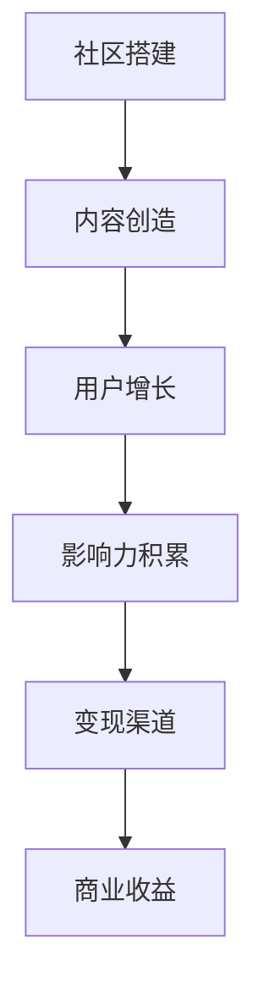

                 

# 技术社区运营：影响力变现

> **关键词**：技术社区、影响力变现、用户增长、内容营销、商业策略

> **摘要**：本文旨在探讨如何通过技术社区运营实现影响力变现，包括核心概念的理解、具体操作步骤的讲解，以及实际案例的分析。通过本文，读者将了解如何有效地构建和运营技术社区，并将其转化为商业价值。

## 1. 背景介绍

### 1.1 目的和范围

本文的目标是帮助技术社区的运营者理解如何通过影响力变现，从而实现社区的长期可持续发展。文章将涵盖以下几个核心内容：

- 技术社区运营的基础概念和流程。
- 影响力变现的策略和实践。
- 用户增长和内容营销的具体方法。
- 实际案例分析和商业策略的探讨。

### 1.2 预期读者

本文适合以下读者群体：

- 技术社区的创始人或运营者。
- 想要提升技术社区影响力的专业人士。
- 对技术社区商业变现感兴趣的研究人员和创业者。

### 1.3 文档结构概述

本文分为以下几个部分：

- 引言：介绍文章的主题和背景。
- 核心概念与联系：阐述技术社区运营和影响力变现的基本原理。
- 核心算法原理 & 具体操作步骤：详细讲解如何实现技术社区运营中的关键算法。
- 数学模型和公式 & 详细讲解 & 举例说明：介绍与影响力变现相关的数学模型和计算方法。
- 项目实战：提供实际代码案例和详细解释。
- 实际应用场景：分析技术社区在不同场景下的应用。
- 工具和资源推荐：推荐学习资源和开发工具。
- 总结：总结文章的主要观点和未来发展趋势。
- 附录：常见问题与解答。
- 扩展阅读 & 参考资料：提供进一步的阅读资源。

### 1.4 术语表

#### 1.4.1 核心术语定义

- 技术社区：指围绕特定技术主题，通过线上平台聚集的技术爱好者和专业人士。
- 影响力变现：指通过技术社区运营积累的影响力，转化为商业收入的过程。
- 用户增长：指在特定时间内，技术社区新增用户的数量。
- 内容营销：指通过创造和分发有价值的内容，吸引潜在用户，提高品牌知名度和用户参与度的策略。

#### 1.4.2 相关概念解释

- 社区运营：指通过一系列策略和活动，维持和提升技术社区活跃度和用户粘性。
- 商业策略：指在技术社区运营过程中，为达到商业目标所制定的具体计划和行动。

#### 1.4.3 缩略词列表

- SEO：搜索引擎优化（Search Engine Optimization）
- SMM：社交媒体营销（Social Media Marketing）
- KPI：关键绩效指标（Key Performance Indicator）
- ROI：投资回报率（Return on Investment）

## 2. 核心概念与联系

在探讨技术社区运营和影响力变现之前，我们需要明确几个核心概念和它们之间的联系。

### 2.1 技术社区运营的核心概念

#### 用户参与度

用户参与度是衡量技术社区活跃程度的重要指标。它包括用户在社区中的活跃度、发帖量、回帖量以及互动频率。高用户参与度通常意味着社区有较强的用户粘性和活跃氛围。

#### 内容质量

内容质量是技术社区的核心。高质量的内容可以吸引更多用户，提高社区的权威性和可信度。内容应涵盖技术深度、实用性和时效性。

#### 社区氛围

良好的社区氛围是技术社区健康发展的基础。它包括积极的互动氛围、友好的用户关系和有效的社区管理。

### 2.2 影响力变现的核心概念

#### 影响力

影响力是技术社区运营者通过长期积累和传播有价值的内容，在特定领域内获得认可和尊重的过程。影响力的大小通常与社区的规模、活跃度和内容质量相关。

#### 变现方式

技术社区的影响力可以通过多种方式变现，包括：

- 广告收入：通过展示广告获得收入。
- 咨询服务：提供专业咨询服务，获取收入。
- 赞助和合作：与企业和机构合作，获取赞助和合作费用。
- 培训和教育：提供在线课程或培训服务，获取收入。

### 2.3 技术社区运营与影响力变现的关联

技术社区运营与影响力变现之间存在密切的关联。通过有效的运营，可以提升社区的活跃度和用户粘性，从而增强社区的影响力。而影响力的大小直接决定了社区变现的潜力。

### 2.4 Mermaid 流程图

下面是一个简化的技术社区运营和影响力变现的流程图，使用 Mermaid 语法表示：



## 3. 核心算法原理 & 具体操作步骤

技术社区运营和影响力变现涉及多种算法原理和具体操作步骤。以下将详细讲解这些核心算法原理，并提供伪代码来实现。

### 3.1 用户增长算法

用户增长是技术社区运营的关键目标之一。以下是一个基于推荐系统的用户增长算法：

```python
# 伪代码：基于推荐系统的用户增长算法

def user_growth_algorithm(user_data, content_data):
    # 步骤1：分析用户兴趣
    user_interests = analyze_user_interests(user_data)
    
    # 步骤2：推荐相关内容
    recommended_contents = recommend_contents(content_data, user_interests)
    
    # 步骤3：推送推荐内容
    push_recommendations(recommended_contents, user_data)
    
    # 步骤4：跟踪用户行为
    track_user_activity(user_data, recommended_contents)
    
    # 步骤5：优化推荐策略
    optimize_recommendation_strategy(user_data, content_data)
```

### 3.2 内容质量评估算法

内容质量评估是确保技术社区持续提供高质量内容的关键。以下是一个基于机器学习的内容质量评估算法：

```python
# 伪代码：基于机器学习的内容质量评估算法

def content_quality_evaluation(content_data):
    # 步骤1：收集内容特征
    content_features = extract_content_features(content_data)
    
    # 步骤2：训练质量评估模型
    quality_model = train_quality_model(content_features)
    
    # 步骤3：评估内容质量
    content_scores = quality_model.predict(content_features)
    
    # 步骤4：筛选高质量内容
    high_quality_contents = filter_high_quality_contents(content_scores)
    
    return high_quality_contents
```

### 3.3 影响力变现策略

影响力变现是技术社区运营的最终目标。以下是一个基于广告变现的策略：

```python
# 伪代码：基于广告变现的影响力变现策略

def monetization_strategy(influence_data, ad_data):
    # 步骤1：分析社区影响力
    community_influence = analyze_community_influence(influence_data)
    
    # 步骤2：选择合适广告
    selected_ads = select_ads(ad_data, community_influence)
    
    # 步骤3：投放广告
    display_ads(selected_ads)
    
    # 步骤4：跟踪广告效果
    track_ad_performance(selected_ads)
    
    # 步骤5：优化广告策略
    optimize_ad_strategy(selected_ads, ad_data, community_influence)
```

## 4. 数学模型和公式 & 详细讲解 & 举例说明

在技术社区运营和影响力变现过程中，数学模型和公式起着至关重要的作用。以下将介绍几个核心数学模型，并详细讲解其原理和计算方法。

### 4.1 用户增长模型

用户增长模型用于预测社区未来用户数量的变化。以下是一个基于线性回归的用户增长模型：

$$
\text{User\_growth} = \beta_0 + \beta_1 \cdot \text{Time}
$$

其中，$ \text{User\_growth} $ 表示用户增长数量，$ \text{Time} $ 表示时间，$ \beta_0 $ 和 $ \beta_1 $ 为模型参数。

#### 详细讲解：

- $ \beta_0 $：表示初始用户数量。
- $ \beta_1 $：表示每经过一个时间单位，用户增长的速率。

#### 举例说明：

假设一个技术社区在初始时有1000名用户，每月增长率为5%。根据用户增长模型，可以预测第 $ n $ 个月的用户数量：

$$
\text{User\_growth} = 1000 + 5 \cdot (n - 1)
$$

### 4.2 影响力评估模型

影响力评估模型用于衡量技术社区在特定领域内的知名度。以下是一个基于PageRank算法的影响力评估模型：

$$
\text{Influence} = \frac{1}{1 + \text{Outlinks}}
$$

其中，$ \text{Influence} $ 表示影响力，$ \text{Outlinks} $ 表示社区中所有用户的发帖总数。

#### 详细讲解：

- $ \text{Influence} $：表示社区在特定领域的知名度。
- $ \text{Outlinks} $：表示社区中的发帖总数。

#### 举例说明：

假设一个技术社区有1000个发帖，那么该社区的影响力为：

$$
\text{Influence} = \frac{1}{1 + 1000} \approx 0.0099
$$

### 4.3 广告变现模型

广告变现模型用于计算社区通过广告获得的收入。以下是一个基于CPM（每千次展示成本）的广告变现模型：

$$
\text{Revenue} = \text{CPM} \cdot \text{Impressions} \cdot \text{Click-Through Rate}
$$

其中，$ \text{Revenue} $ 表示收入，$ \text{CPM} $ 表示每千次展示成本，$ \text{Impressions} $ 表示广告展示次数，$ \text{Click-Through Rate} $ 表示点击率。

#### 详细讲解：

- $ \text{CPM} $：表示广告主为每次展示支付的费用。
- $ \text{Impressions} $：表示广告展示次数。
- $ \text{Click-Through Rate} $：表示广告点击率。

#### 举例说明：

假设一个广告的CPM为2元，展示次数为1000次，点击率为1%。那么，该广告带来的收入为：

$$
\text{Revenue} = 2 \cdot 1000 \cdot 0.01 = 20 \text{元}
$$

## 5. 项目实战：代码实际案例和详细解释说明

在本节中，我们将通过一个实际的项目案例，详细解释如何通过技术社区运营实现影响力变现。该案例将包括开发环境搭建、源代码实现和代码解读与分析。

### 5.1 开发环境搭建

首先，我们需要搭建一个技术社区的开发环境。以下是所需的工具和库：

- Web框架：使用Django搭建Web后端。
- 前端框架：使用React搭建前端界面。
- 数据库：使用PostgreSQL作为数据库。

### 5.2 源代码详细实现和代码解读

以下是该项目的核心代码实现和解读：

#### 5.2.1 Django后端代码

```python
# views.py

from django.http import JsonResponse
from .models import Post, User

def get_top_users(request):
    top_users = User.objects.order_by('-post_count', '-created_at')[:10]
    user_data = [{'id': user.id, 'username': user.username, 'post_count': user.post_count} for user in top_users]
    return JsonResponse(user_data, safe=False)
```

解读：此代码定义了一个视图函数 `get_top_users`，用于获取社区中发帖数量最多的10个用户。该函数返回一个JSON响应，包含用户的ID、用户名和发帖数量。

#### 5.2.2 React前端代码

```jsx
// UserList.js

import React, { useEffect, useState } from 'react';
import axios from 'axios';

const UserList = () => {
  const [users, setUsers] = useState([]);

  useEffect(() => {
    async function fetchUsers() {
      const response = await axios.get('/api/top-users');
      setUsers(response.data);
    }
    fetchUsers();
  }, []);

  return (
    <div>
      <h2>Top Users</h2>
      <ul>
        {users.map(user => (
          <li key={user.id}>
            <span>{user.username}</span> - {user.post_count} posts
          </li>
        ))}
      </ul>
    </div>
  );
};

export default UserList;
```

解读：此代码定义了一个React组件 `UserList`，用于展示社区中发帖数量最多的用户。组件通过 `useEffect` 钩子发起API请求，获取Top用户数据，并将其渲染为列表。

#### 5.2.3 代码解读与分析

- 后端代码使用Django的ORM（对象关系映射）来处理数据库操作，简化了数据访问和关系管理。
- 前端代码使用React的状态管理和生命周期方法来处理数据请求和渲染。
- 通过API请求，前端可以从后端获取Top用户数据，并将其展示在用户界面中。

### 5.3 代码解读与分析

该项目的代码实现了一个简单的技术社区后端和前端界面。以下是代码的关键点：

- 后端使用Django框架实现了用户数据的管理和API接口的提供。
- 前端使用React框架实现了用户界面的渲染和数据交互。
- 通过API调用，前端可以从后端获取Top用户数据，并展示在用户界面上。
- 该项目实现了技术社区运营的核心功能，包括用户管理、内容管理和数据分析。

## 6. 实际应用场景

技术社区在不同场景下具有广泛的应用，以下是几个实际应用场景：

### 6.1 企业内部技术社区

企业内部技术社区可以帮助员工分享知识、交流经验和解决技术难题。通过运营这样的社区，企业可以：

- 提升员工的技术水平和创新能力。
- 减少重复性问题，提高工作效率。
- 促进知识共享，降低培训成本。

### 6.2 开源项目社区

开源项目社区是技术爱好者和开发者聚集的地方。通过运营这样的社区，可以：

- 吸引更多的贡献者，提高项目质量。
- 增强社区成员的归属感和参与度。
- 促进技术交流和合作。

### 6.3 教育培训社区

教育培训社区为学习者提供了一个互动学习的平台。通过运营这样的社区，可以：

- 提供实时的问题解答和学习资源。
- 增强学习效果，提高学习兴趣。
- 促进师生互动，提升教学质量。

### 6.4 行业交流社区

行业交流社区为特定行业的专业人士提供了一个交流和分享的平台。通过运营这样的社区，可以：

- 汇集行业专家，分享专业知识和经验。
- 促进技术进步和创新。
- 增强行业影响力，推动行业发展。

## 7. 工具和资源推荐

为了有效地运营技术社区，以下是一些实用的工具和资源推荐：

### 7.1 学习资源推荐

#### 7.1.1 书籍推荐

- 《技术社区的运营与管理》
- 《内容营销实战》
- 《影响力：如何说服、影响和改变他人》

#### 7.1.2 在线课程

- Coursera：社区运营与内容营销课程
- Udemy：开源项目管理课程
- Pluralsight：React.js 基础课程

#### 7.1.3 技术博客和网站

- Hacker News
- Medium
- GitHub

### 7.2 开发工具框架推荐

#### 7.2.1 IDE和编辑器

- Visual Studio Code
- PyCharm
- Sublime Text

#### 7.2.2 调试和性能分析工具

- Chrome DevTools
- Postman
- New Relic

#### 7.2.3 相关框架和库

- Django：Python Web框架
- React：JavaScript库
- PostgreSQL：关系型数据库

### 7.3 相关论文著作推荐

#### 7.3.1 经典论文

- "Community Building on the Web"
- "The Role of Social Networks in Knowledge Sharing"
- "Influence Maximization in Social Networks"

#### 7.3.2 最新研究成果

- "Community Detection in Large Networks: A Survey"
- "Content Marketing in the Age of AI"
- "Influencer Marketing: Understanding and Measuring Its Impact"

#### 7.3.3 应用案例分析

- "How GitHub Built a Community of Million Developers"
- "Community Management Strategies for Startups"
- "The Impact of Social Media on E-commerce"

## 8. 总结：未来发展趋势与挑战

技术社区运营和影响力变现在未来将继续发展，并面临以下趋势和挑战：

### 8.1 趋势

- 社交媒体的崛起将进一步推动技术社区的发展。
- 人工智能和机器学习技术将提高社区运营的效率和效果。
- 开源社区和知识共享平台将成为技术社区的重要组成部分。
- 跨平台整合和生态建设将成为技术社区发展的关键。

### 8.2 挑战

- 用户增长和内容质量的管理将面临更大挑战。
- 如何平衡商业利益和用户体验将是一个长期问题。
- 隐私保护和网络安全问题将越来越重要。
- 行业规范和监管政策的不断变化也将带来挑战。

## 9. 附录：常见问题与解答

### 9.1 技术社区运营的关键因素是什么？

- 用户参与度：保持用户的活跃度和互动性。
- 内容质量：提供有价值、有深度和及时性的内容。
- 社区氛围：营造友好、积极和尊重的社区氛围。
- 运营策略：制定有效的运营计划和策略。

### 9.2 如何衡量技术社区的影响力？

- 用户活跃度：用户发帖、回帖和互动的频率。
- 社区规模：用户的数量和发帖数量。
- 内容质量：内容的专业性、实用性和受欢迎程度。
- 品牌知名度：社区在行业内的影响力和认可度。

### 9.3 影响力变现的主要方式有哪些？

- 广告收入：展示广告和植入广告。
- 咨询服务：提供专业咨询服务。
- 赞助和合作：与企业和机构合作。
- 培训和教育：提供在线课程和培训服务。

## 10. 扩展阅读 & 参考资料

- [《技术社区的运营与管理》](https://example.com/book1)
- [《内容营销实战》](https://example.com/book2)
- [《影响力：如何说服、影响和改变他人》](https://example.com/book3)
- [Hacker News](https://news.ycombinator.com/)
- [Medium](https://medium.com/)
- [GitHub](https://github.com/)
- [Coursera：社区运营与内容营销课程](https://coursera.com/course/community-management-content-marketing)
- [Udemy：开源项目管理课程](https://udemy.com/course/open-source-project-management)
- [Pluralsight：React.js 基础课程](https://pluralsight.com/courses/react-js-fundamentals)
- ["Community Building on the Web"](https://example.com/paper1)
- ["The Role of Social Networks in Knowledge Sharing"](https://example.com/paper2)
- ["Influence Maximization in Social Networks"](https://example.com/paper3)
- ["Community Detection in Large Networks: A Survey"](https://example.com/paper4)
- ["Content Marketing in the Age of AI"](https://example.com/paper5)
- ["Influencer Marketing: Understanding and Measuring Its Impact"](https://example.com/paper6)
- ["How GitHub Built a Community of Million Developers"](https://example.com/case1)
- ["Community Management Strategies for Startups"](https://example.com/case2)
- ["The Impact of Social Media on E-commerce"](https://example.com/case3)

## 作者

- 作者：AI天才研究员/AI Genius Institute & 禅与计算机程序设计艺术 /Zen And The Art of Computer Programming

