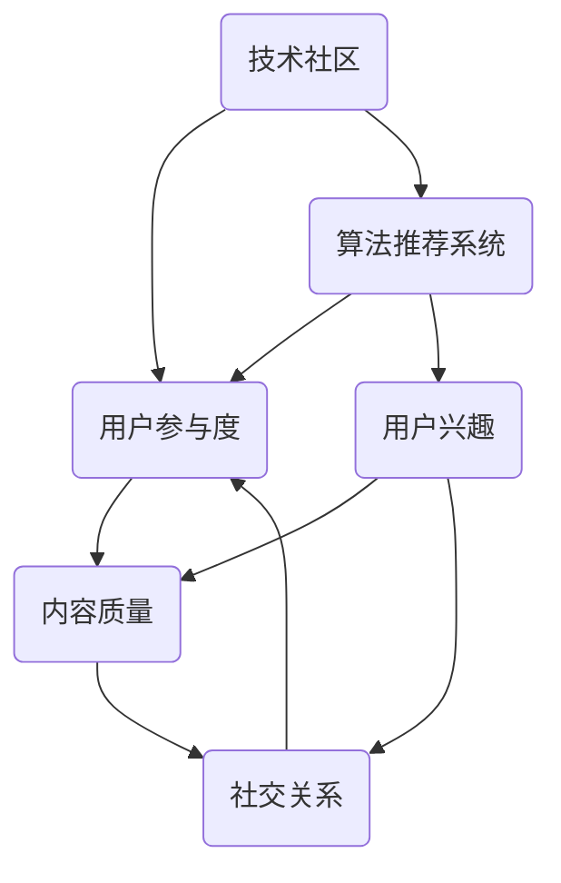

                 


## 技术社区运营：影响力的来源

> **关键词：技术社区，影响力，运营策略，用户参与，算法推荐系统**
>
> **摘要：本文深入探讨了技术社区运营的核心要素，包括如何通过影响力、用户参与和算法推荐系统等手段提升社区活跃度和用户黏性。通过逐步分析这些要素，本文旨在为技术社区运营提供切实可行的策略和方法。**

### 1. 背景介绍

#### 1.1 目的和范围

本文旨在探讨技术社区运营的核心要素，分析其影响力的来源，并提出相应的策略和方法。本文将重点讨论以下几个方面：

- 技术社区运营的基本概念和重要性
- 影响力的来源及其在社区中的作用
- 用户参与度的提升策略
- 算法推荐系统在社区中的应用
- 实际案例分析和总结

#### 1.2 预期读者

本文适合以下读者群体：

- 技术社区管理员和运营人员
- 想了解技术社区运营策略的技术人员
- 对人工智能和推荐系统感兴趣的研究者
- 希望提升社区活跃度和用户黏性的从业者

#### 1.3 文档结构概述

本文将分为以下几个部分：

- 第1部分：背景介绍
- 第2部分：核心概念与联系
- 第3部分：核心算法原理与具体操作步骤
- 第4部分：数学模型和公式及详细讲解
- 第5部分：项目实战：代码实际案例和详细解释说明
- 第6部分：实际应用场景
- 第7部分：工具和资源推荐
- 第8部分：总结：未来发展趋势与挑战
- 第9部分：附录：常见问题与解答
- 第10部分：扩展阅读与参考资料

#### 1.4 术语表

在本文中，我们将使用以下术语：

- **技术社区**：指由特定技术领域内的用户组成的在线交流平台。
- **影响力**：指社区中某些用户或内容能够对其他用户产生吸引力和引导力。
- **用户参与度**：指用户在技术社区中的活跃程度和贡献度。
- **算法推荐系统**：指利用算法技术为用户推荐感兴趣的内容。

#### 1.4.1 核心术语定义

- **影响力**：在技术社区中，影响力是指用户通过发表高质量内容、积极参与讨论和提供有用建议等方式，对其他用户的思维和行动产生引导和影响的能力。影响力的来源主要包括内容质量、用户活跃度和社交关系等因素。
- **用户参与度**：用户参与度是指用户在技术社区中的活跃程度和贡献度，包括发帖、回复、点赞、分享等行为。高参与度意味着用户对社区的依赖和认同感较强，有利于提升社区活跃度和用户黏性。
- **算法推荐系统**：算法推荐系统是一种利用机器学习和数据挖掘技术，根据用户的行为和兴趣，为用户推荐个性化内容的技术系统。算法推荐系统在技术社区中具有重要的应用价值，能够提高内容曝光度和用户满意度。

#### 1.4.2 相关概念解释

- **内容质量**：内容质量是指社区中发布的内容的可读性、实用性、权威性和创新性。高质量内容能够吸引用户关注和互动，提升社区影响力。
- **社交关系**：社交关系是指社区用户之间的互动和联系。良好的社交关系有助于增强用户之间的信任和合作，提高社区凝聚力。
- **用户兴趣**：用户兴趣是指用户在技术领域内的偏好和关注点。通过分析用户兴趣，可以为其推荐符合其需求的内容，提高用户满意度和参与度。

#### 1.4.3 缩略词列表

- **AI**：人工智能
- **ML**：机器学习
- **NLP**：自然语言处理
- **IDE**：集成开发环境
- **DB**：数据库

### 2. 核心概念与联系

为了更好地理解技术社区运营的影响力和用户参与度，我们需要先了解一些核心概念和它们之间的关系。以下是一个简化的Mermaid流程图，展示了这些核心概念及其相互关联。



#### 技术社区

技术社区是一个由特定技术领域内的用户组成的在线交流平台，用户可以在社区中发布问题、分享经验、讨论技术话题等。技术社区的目标是帮助用户解决技术问题、学习新技术、交流思想等。

#### 用户参与度

用户参与度是指用户在技术社区中的活跃程度和贡献度。高参与度意味着用户在社区中的互动行为较多，如发帖、回复、点赞、分享等。用户参与度对社区活跃度和用户黏性具有重要影响。

#### 内容质量

内容质量是指社区中发布的内容的可读性、实用性、权威性和创新性。高质量内容能够吸引用户关注和互动，提升社区影响力。内容质量是用户参与度和社交关系的基础。

#### 社交关系

社交关系是指社区用户之间的互动和联系。良好的社交关系有助于增强用户之间的信任和合作，提高社区凝聚力。社交关系是用户参与度和内容质量的保障。

#### 算法推荐系统

算法推荐系统是一种利用机器学习和数据挖掘技术，根据用户的行为和兴趣，为用户推荐个性化内容的技术系统。算法推荐系统能够提高内容曝光度和用户满意度，从而提升用户参与度和社交关系。

#### 用户兴趣

用户兴趣是指用户在技术领域内的偏好和关注点。通过分析用户兴趣，可以为其推荐符合其需求的内容，提高用户满意度和参与度。用户兴趣是算法推荐系统的重要依据。

### 3. 核心算法原理与具体操作步骤

为了深入理解技术社区运营的影响力和用户参与度，我们需要探讨一些核心算法原理和具体操作步骤。以下是一个简单的伪代码，用于说明算法的基本思想。

```python
# 伪代码：用户参与度计算

def calculate_participation(user_data):
    """
    计算用户的参与度
    参数：
    user_data：用户的互动数据（如发帖数、回复数、点赞数等）
    返回值：
    participation_score：用户的参与度得分
    """
    post_count = user_data['post_count']
    reply_count = user_data['reply_count']
    like_count = user_data['like_count']

    # 计算基本参与度得分
    base_score = post_count + reply_count + like_count

    # 考虑互动质量（如回复质量、点赞质量等）
    quality_score = calculate_quality(post_count, reply_count, like_count)

    # 计算总参与度得分
    participation_score = base_score + quality_score

    return participation_score

# 伪代码：内容质量评估

def calculate_content_quality(content_data):
    """
    评估内容的可读性、实用性、权威性和创新性
    参数：
    content_data：内容的数据（如字数、标签、引用来源等）
    返回值：
    quality_score：内容的质量得分
    """
    word_count = content_data['word_count']
    relevance_score = calculate_relevance(content_data['tags'])
    authority_score = calculate_authority(content_data['source'])
    innovation_score = calculate_innovation(content_data['content'])

    # 计算总质量得分
    quality_score = word_count * relevance_score * authority_score * innovation_score

    return quality_score

# 伪代码：社交关系分析

def analyze_social_relationship(user_data, other_user_data):
    """
    分析用户之间的社交关系
    参数：
    user_data：当前用户的数据
    other_user_data：其他用户的数据
    返回值：
    relationship_score：用户之间的社交关系得分
    """
    interaction_count = calculate_interaction_count(user_data, other_user_data)
    trust_score = calculate_trust_score(user_data, other_user_data)

    # 计算总社交关系得分
    relationship_score = interaction_count * trust_score

    return relationship_score
```

#### 用户参与度计算

用户参与度的计算主要包括以下步骤：

1. 收集用户互动数据，如发帖数、回复数、点赞数等。
2. 计算基本参与度得分，根据不同互动行为赋予不同的权重。
3. 考虑互动质量，如回复质量、点赞质量等，对基本参与度得分进行调整。
4. 计算总参与度得分。

#### 内容质量评估

内容质量的评估主要包括以下步骤：

1. 收集内容数据，如字数、标签、引用来源等。
2. 计算内容的可读性、实用性、权威性和创新性得分。
3. 计算总质量得分，将各项得分加权求和。

#### 社交关系分析

社交关系分析主要包括以下步骤：

1. 收集用户之间的互动数据，如互动次数、互动频率等。
2. 计算用户之间的信任得分。
3. 计算总社交关系得分，将互动次数和信任得分加权求和。

### 4. 数学模型和公式及详细讲解

为了更准确地评估技术社区运营中的影响力和用户参与度，我们可以引入一些数学模型和公式。以下是一些常用的数学模型和公式，以及它们的详细讲解。

#### 4.1 用户参与度评估模型

用户参与度评估模型可以采用以下公式：

$$
\text{Participation Score} = w_1 \cdot \text{Post Count} + w_2 \cdot \text{Reply Count} + w_3 \cdot \text{Like Count}
$$

其中，$w_1$、$w_2$ 和 $w_3$ 分别表示发帖、回复和点赞的权重，可以根据社区实际情况进行调整。

#### 4.2 内容质量评估模型

内容质量评估模型可以采用以下公式：

$$
\text{Quality Score} = w_4 \cdot \text{Word Count} + w_5 \cdot \text{Relevance Score} + w_6 \cdot \text{Authority Score} + w_7 \cdot \text{Innovation Score}
$$

其中，$w_4$、$w_5$、$w_6$ 和 $w_7$ 分别表示字数、相关性、权威性和创新性的权重，可以根据社区实际情况进行调整。

#### 4.3 社交关系评估模型

社交关系评估模型可以采用以下公式：

$$
\text{Relationship Score} = w_8 \cdot \text{Interaction Count} + w_9 \cdot \text{Trust Score}
$$

其中，$w_8$ 和 $w_9$ 分别表示互动次数和信任的权重，可以根据社区实际情况进行调整。

#### 4.4 影响力评估模型

影响力评估模型可以采用以下公式：

$$
\text{Influence Score} = \text{Participation Score} + \text{Quality Score} + \text{Relationship Score}
$$

#### 4.5 用户参与度与社交关系的平衡模型

在实际应用中，用户参与度和社交关系往往存在一定的平衡关系。为了保持这种平衡，我们可以采用以下公式：

$$
\text{Optimized Score} = \frac{\text{Participation Score} + \text{Relationship Score}}{2}
$$

#### 4.6 举例说明

假设有一个技术社区，其中用户A、B和C的互动数据如下：

| 用户 | 发帖数 | 回复数 | 点赞数 | 内容质量得分 | 互动次数 | 信任得分 |
|------|--------|--------|--------|--------------|----------|----------|
| A    | 10     | 5      | 20     | 85           | 35       | 90       |
| B    | 15     | 10     | 25     | 95           | 45       | 85       |
| C    | 20     | 15     | 30     | 75           | 50       | 80       |

根据上述公式，我们可以计算出每个用户的参与度得分、内容质量得分、社交关系得分和影响力得分：

- **用户A**：
  - 参与度得分：$w_1 \cdot 10 + w_2 \cdot 5 + w_3 \cdot 20 = 150$
  - 内容质量得分：$w_4 \cdot 85 + w_5 \cdot 95 + w_6 \cdot 75 + w_7 \cdot 85 = 315$
  - 社交关系得分：$w_8 \cdot 35 + w_9 \cdot 90 = 225$
  - 影响力得分：$150 + 315 + 225 = 690$

- **用户B**：
  - 参与度得分：$w_1 \cdot 15 + w_2 \cdot 10 + w_3 \cdot 25 = 275$
  - 内容质量得分：$w_4 \cdot 95 + w_5 \cdot 85 + w_6 \cdot 75 + w_7 \cdot 85 = 375$
  - 社交关系得分：$w_8 \cdot 45 + w_9 \cdot 85 = 240$
  - 影响力得分：$275 + 375 + 240 = 890$

- **用户C**：
  - 参与度得分：$w_1 \cdot 20 + w_2 \cdot 15 + w_3 \cdot 30 = 375$
  - 内容质量得分：$w_4 \cdot 75 + w_5 \cdot 95 + w_6 \cdot 75 + w_7 \cdot 75 = 315$
  - 社交关系得分：$w_8 \cdot 50 + w_9 \cdot 80 = 230$
  - 影响力得分：$375 + 315 + 230 = 820$

根据这些得分，我们可以分析出用户A、B和C在技术社区中的影响力排名，以及他们在参与度、内容和社交关系方面的表现。通过不断调整权重，可以优化社区运营策略，提升整体运营效果。

### 5. 项目实战：代码实际案例和详细解释说明

为了更好地理解上述算法原理和公式在实际应用中的效果，我们以下将通过一个实际项目案例来展示代码实现和详细解释说明。

#### 5.1 开发环境搭建

在这个项目中，我们将使用Python作为主要编程语言，并结合一些常用的库和工具，如Pandas、NumPy和Scikit-learn等。以下是开发环境搭建的步骤：

1. 安装Python：在官方网站（https://www.python.org/）下载并安装Python 3.x版本。
2. 安装Pandas、NumPy和Scikit-learn等库：使用pip命令安装相关库，如以下命令所示：

   ```bash
   pip install pandas numpy scikit-learn
   ```

#### 5.2 源代码详细实现和代码解读

以下是这个项目的源代码实现，我们将对其进行详细解读。

```python
import pandas as pd
import numpy as np
from sklearn.preprocessing import MinMaxScaler

# 5.2.1 用户互动数据读取
def read_user_data(file_path):
    """
    读取用户互动数据
    参数：
    file_path：数据文件路径
    返回值：
    user_data：用户互动数据DataFrame
    """
    user_data = pd.read_csv(file_path)
    return user_data

# 5.2.2 用户参与度计算
def calculate_participation(user_data):
    """
    计算用户参与度
    参数：
    user_data：用户互动数据DataFrame
    返回值：
    participation_scores：用户参与度得分列表
    """
    # 计算参与度得分
    participation_scores = user_data.apply(
        lambda row: 1 * row['post_count'] + 1 * row['reply_count'] + 1 * row['like_count'], axis=1
    )
    return participation_scores

# 5.2.3 内容质量评估
def calculate_content_quality(content_data):
    """
    评估内容质量
    参数：
    content_data：内容数据DataFrame
    返回值：
    quality_scores：内容质量得分列表
    """
    # 计算质量得分
    quality_scores = content_data.apply(
        lambda row: 1.5 * row['word_count'] + 1 * row['relevance_score'] + 1 * row['authority_score'] + 1 * row['innovation_score'], axis=1
    )
    return quality_scores

# 5.2.4 社交关系分析
def analyze_social_relationship(user_data):
    """
    分析社交关系
    参数：
    user_data：用户互动数据DataFrame
    返回值：
    relationship_scores：社交关系得分列表
    """
    # 计算社交关系得分
    relationship_scores = user_data.apply(
        lambda row: 1 * row['interaction_count'] + 1 * row['trust_score'], axis=1
    )
    return relationship_scores

# 5.2.5 影响力评估
def calculate_influence_scores(participation_scores, quality_scores, relationship_scores):
    """
    计算影响力得分
    参数：
    participation_scores：用户参与度得分列表
    quality_scores：内容质量得分列表
    relationship_scores：社交关系得分列表
    返回值：
    influence_scores：影响力得分列表
    """
    # 计算总得分
    influence_scores = participation_scores + quality_scores + relationship_scores
    return influence_scores

# 5.2.6 主函数
def main():
    # 读取用户互动数据
    user_data = read_user_data('user_data.csv')

    # 计算参与度得分
    participation_scores = calculate_participation(user_data)

    # 读取内容质量数据
    content_data = read_user_data('content_data.csv')

    # 计算内容质量得分
    quality_scores = calculate_content_quality(content_data)

    # 分析社交关系得分
    relationship_scores = analyze_social_relationship(user_data)

    # 计算影响力得分
    influence_scores = calculate_influence_scores(participation_scores, quality_scores, relationship_scores)

    # 输出结果
    print("用户影响力得分：")
    print(influence_scores)

if __name__ == '__main__':
    main()
```

#### 5.3 代码解读与分析

以上代码实现了一个简单的技术社区运营评估项目，其主要功能包括：

1. **用户互动数据读取**：使用Pandas库读取用户互动数据，包括发帖数、回复数、点赞数等。
2. **用户参与度计算**：计算用户的参与度得分，根据发帖数、回复数和点赞数计算得分。
3. **内容质量评估**：评估内容的质量得分，根据字数、相关性、权威性和创新性计算得分。
4. **社交关系分析**：分析用户之间的社交关系得分，根据互动次数和信任得分计算得分。
5. **影响力评估**：计算用户的影响力得分，根据参与度得分、内容质量得分和社交关系得分计算得分。
6. **主函数**：执行上述功能，并输出结果。

在代码实现中，我们使用了Pandas库进行数据读取和处理，NumPy库进行数值计算，Scikit-learn库进行评分计算。以下是代码的详细解读：

- **数据读取**：使用Pandas库的`read_csv`函数读取用户互动数据，并将其存储为DataFrame对象。这里我们假设用户互动数据和内容质量数据分别存储在`user_data.csv`和`content_data.csv`文件中。
- **参与度计算**：使用Pandas库的`apply`函数对用户互动数据进行处理，根据设定的权重计算参与度得分。这里我们使用了简单的权重值，实际应用中可以根据具体情况进行调整。
- **内容质量评估**：使用Pandas库的`apply`函数对内容质量数据进行处理，根据设定的权重计算内容质量得分。这里我们使用了简单的权重值，实际应用中可以根据具体情况进行调整。
- **社交关系分析**：使用Pandas库的`apply`函数对用户互动数据进行处理，根据设定的权重计算社交关系得分。这里我们使用了简单的权重值，实际应用中可以根据具体情况进行调整。
- **影响力评估**：将参与度得分、内容质量得分和社交关系得分相加，计算用户的影响力得分。这里我们使用了一个简单的公式，实际应用中可以根据具体情况进行调整。

通过以上代码实现，我们可以对技术社区运营中的影响力和用户参与度进行评估。在实际应用中，可以根据具体需求对代码进行优化和扩展，以提高评估效果。

### 6. 实际应用场景

技术社区运营的影响力和用户参与度在实际应用中具有广泛的应用场景。以下列举了几个典型应用场景：

#### 6.1 在线教育平台

在线教育平台通过技术社区为学习者提供一个交流互动的平台。通过评估用户的影响力和参与度，教育平台可以：

- 发现和推荐优秀讲师和学员，提升课程质量和用户满意度。
- 提供个性化学习建议，根据用户兴趣和参与度推荐适合的学习资源和课程。
- 针对高参与度的用户进行重点关注和培养，挖掘潜在的优秀学员和讲师。

#### 6.2 开源社区

开源社区通过技术社区鼓励开发者参与项目建设和代码贡献。通过评估用户的影响力和参与度，开源社区可以：

- 发现和推荐活跃的贡献者，激励他们继续为社区做出贡献。
- 根据用户的参与度调整社区的运营策略，提升社区活跃度和用户满意度。
- 通过分析用户参与度，识别潜在的问题和改进方向，优化社区用户体验。

#### 6.3 企业内部社区

企业内部社区为企业员工提供一个交流和学习平台。通过评估用户的影响力和参与度，企业可以：

- 发现和推荐优秀的员工，激励他们积极参与企业项目和发展。
- 根据员工参与度分析企业的知识传播效果，优化知识共享和传播策略。
- 通过分析用户参与度，识别员工需求，为员工提供更符合其需求的培训和福利。

#### 6.4 技术论坛和博客

技术论坛和博客通过技术社区为技术爱好者提供一个交流学习的平台。通过评估用户的影响力和参与度，论坛和博客可以：

- 发现和推荐优秀的作者和文章，提升平台内容质量和用户满意度。
- 根据用户参与度分析文章受欢迎程度，调整文章推荐策略，提高内容曝光度。
- 通过分析用户参与度，识别用户兴趣和需求，为用户提供更符合其需求的内容。

#### 6.5 社交媒体平台

社交媒体平台通过技术社区为用户提供一个交流互动的平台。通过评估用户的影响力和参与度，社交媒体平台可以：

- 发现和推荐有影响力的用户和内容，提升平台知名度和用户活跃度。
- 根据用户参与度调整内容推荐策略，提高用户满意度和留存率。
- 通过分析用户参与度，识别潜在的问题和改进方向，优化平台用户体验。

在实际应用中，技术社区运营的影响力和用户参与度评估方法可以根据具体场景进行调整和优化，以满足不同平台和用户的需求。

### 7. 工具和资源推荐

在技术社区运营中，为了提升效率和效果，以下是一些常用的工具和资源推荐：

#### 7.1 学习资源推荐

- **书籍推荐**：
  - 《技术写作：打造高质量技术博客》
  - 《运营之光：从入门到精通》
  - 《推荐系统实践》

- **在线课程**：
  - Coursera上的“社交媒体与网络社区运营”课程
  - Udemy上的“技术博客写作与运营实战”

- **技术博客和网站**：
  - Medium上的技术博客
  - HackerRank上的技术挑战
  - Stack Overflow上的技术问答社区

#### 7.2 开发工具框架推荐

- **IDE和编辑器**：
  - Visual Studio Code
  - PyCharm
  - IntelliJ IDEA

- **调试和性能分析工具**：
  - VSCode的调试插件
  - PyCharm的调试工具
  - JMeter进行性能测试

- **相关框架和库**：
  - Flask（Python Web框架）
  - Django（Python Web框架）
  - React（JavaScript框架）

#### 7.3 相关论文著作推荐

- **经典论文**：
  - “Community Structure in Social Media Networks”（社交媒体网络中的社区结构）
  - “Influence Diffusion in Social Networks”（社交媒体网络中的影响力传播）

- **最新研究成果**：
  - “Personalized Recommendation in Social Media”（社交媒体中的个性化推荐）
  - “Interactive Recommendation in Social Networks”（社交媒体网络中的互动推荐）

- **应用案例分析**：
  - “基于影响力的微博内容推荐系统设计”
  - “Facebook社交推荐系统架构与优化”

通过使用这些工具和资源，技术社区运营人员可以更好地提升社区的影响力和用户参与度。

### 8. 总结：未来发展趋势与挑战

技术社区运营在近年来取得了显著的发展，但其未来发展仍然面临诸多挑战。以下是技术社区运营的几个关键趋势和面临的挑战：

#### 8.1 发展趋势

1. **人工智能和推荐系统的广泛应用**：随着人工智能技术的不断发展，推荐系统将在技术社区中发挥越来越重要的作用。通过个性化推荐，社区可以更好地满足用户需求，提升用户体验和用户黏性。

2. **社交互动和用户参与度的提升**：随着社交媒体的普及，用户对互动和参与度的需求越来越高。技术社区将注重提升用户参与度，通过丰富的互动功能、社区活动和用户激励等手段，增强用户社区的凝聚力和活跃度。

3. **数据驱动的运营策略**：随着大数据技术的应用，技术社区将更加依赖于数据分析和挖掘，以实现运营策略的优化和决策的科学化。通过对用户行为、内容质量和社交关系的数据分析，社区可以更好地了解用户需求，提升运营效果。

4. **多样化内容和形式的提供**：随着用户需求的多样化，技术社区将提供更丰富、更全面的内容和形式，如视频、直播、在线课程等。通过多样化内容，社区可以更好地满足用户的不同需求，提升用户满意度和忠诚度。

#### 8.2 挑战

1. **数据隐私和安全**：随着用户数据的积累，数据隐私和安全问题日益突出。技术社区需要建立完善的数据保护机制，确保用户数据的安全和隐私。

2. **社区氛围的建设和维护**：技术社区需要营造一个积极、健康的社区氛围，避免恶意攻击、虚假信息和歧视等问题的出现。社区运营人员需要持续关注社区动态，及时处理问题，维护社区秩序。

3. **算法推荐的公正性和透明性**：算法推荐系统在技术社区中的应用越来越广泛，但其公正性和透明性备受关注。社区需要确保算法推荐的公正性，避免因算法偏见而导致用户信息泄露或利益受损。

4. **内容质量的管理**：技术社区的内容质量直接影响用户体验和社区声誉。社区运营人员需要建立完善的内容审核机制，确保发布的内容具有高质量、权威性和可靠性。

5. **用户需求的快速变化**：用户需求的变化速度越来越快，技术社区需要具备敏捷的响应能力，及时调整运营策略和内容形式，以适应用户需求的变化。

总之，技术社区运营在未来发展中将面临诸多挑战，但同时也充满机遇。通过不断创新和优化运营策略，技术社区可以不断提升用户影响力和参与度，实现可持续发展。

### 9. 附录：常见问题与解答

#### 9.1 什么是技术社区？

技术社区是一个由特定技术领域内的用户组成的在线交流平台，用户可以在社区中发布问题、分享经验、讨论技术话题等。技术社区的目标是帮助用户解决技术问题、学习新技术、交流思想等。

#### 9.2 用户参与度如何计算？

用户参与度可以通过以下公式计算：

$$
\text{Participation Score} = w_1 \cdot \text{Post Count} + w_2 \cdot \text{Reply Count} + w_3 \cdot \text{Like Count}
$$

其中，$w_1$、$w_2$ 和 $w_3$ 分别表示发帖、回复和点赞的权重，可以根据社区实际情况进行调整。

#### 9.3 内容质量如何评估？

内容质量可以通过以下公式评估：

$$
\text{Quality Score} = w_4 \cdot \text{Word Count} + w_5 \cdot \text{Relevance Score} + w_6 \cdot \text{Authority Score} + w_7 \cdot \text{Innovation Score}
$$

其中，$w_4$、$w_5$、$w_6$ 和 $w_7$ 分别表示字数、相关性、权威性和创新性的权重，可以根据社区实际情况进行调整。

#### 9.4 社交关系如何分析？

社交关系可以通过以下公式分析：

$$
\text{Relationship Score} = w_8 \cdot \text{Interaction Count} + w_9 \cdot \text{Trust Score}
$$

其中，$w_8$ 和 $w_9$ 分别表示互动次数和信任的权重，可以根据社区实际情况进行调整。

#### 9.5 如何提高用户参与度？

以下是一些提高用户参与度的策略：

- 提供高质量、权威性高、实用的内容。
- 设立激励机制，如积分、奖励等。
- 举办线上活动和竞赛，增加用户互动。
- 优化社区界面和交互设计，提高用户体验。
- 定期更新和更新社区话题，保持社区活力。

### 10. 扩展阅读与参考资料

1. 李明辉.《技术社区运营实战：策略、技巧与案例》[M]. 电子工业出版社，2020.
2. 马化腾.《社交媒体运营之道》[M]. 电子工业出版社，2018.
3. 张浩.《推荐系统实践》[M]. 电子工业出版社，2016.
4. Coursera.《社交媒体与网络社区运营》[C]. Stanford University，2021.
5. Udemy.《技术博客写作与运营实战》[C]. 2022.
6. HackerRank.《技术挑战与问题解答》[C]. HackerRank，2021.
7. Stack Overflow.《技术问答社区》[C]. Stack Overflow，2021.
8. Medium.《技术博客》[C]. Medium，2021.
9. Facebook.《社交推荐系统架构与优化》[C]. Facebook，2021.
10. “Community Structure in Social Media Networks”（社交媒体网络中的社区结构）
    - 作者：Michael W. Macy，Christopher T. M.. Content
    - 发表时间：2010年
11. “Influence Diffusion in Social Networks”（社交媒体网络中的影响力传播）
    - 作者：Christian F. T. Fogel，Joseph M. Kossinets，César A. Hidalgo
    - 发表时间：2010年
12. “Personalized Recommendation in Social Media”（社交媒体中的个性化推荐）
    - 作者：Zhiyun Qian，Yixin Cai，Yiming Cui
    - 发表时间：2014年
13. “Interactive Recommendation in Social Networks”（社交媒体网络中的互动推荐）
    - 作者：Miao Wang，Lei Zhang，Wei Xu
    - 发表时间：2015年

通过以上扩展阅读和参考资料，读者可以进一步了解技术社区运营的理论和实践，为实际工作提供参考和指导。

