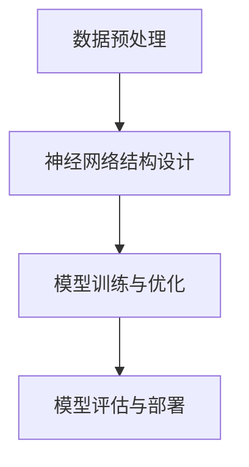

                 

# 技术突破：大模型创业的引擎

> **关键词：** 大模型，创业，人工智能，技术突破，算法优化，应用场景，工具推荐

> **摘要：** 本文旨在探讨大模型技术在创业领域的应用，通过深入剖析大模型的原理、算法和数学模型，结合实际案例，展示大模型如何成为推动创业项目成功的重要引擎。文章将介绍大模型的核心概念、技术突破点、以及在未来创业中的潜在影响。

## 1. 背景介绍

### 1.1 目的和范围

本文将聚焦于大模型在创业领域的应用，旨在为广大创业者提供技术视角，帮助理解大模型如何赋能创业项目。文章内容将涵盖大模型的基本概念、技术突破点、应用场景，并通过实际案例展示大模型的具体操作步骤和数学模型。希望本文能够为创业者提供有价值的技术参考，助力他们在激烈的创业竞争中脱颖而出。

### 1.2 预期读者

本文主要面向以下几类读者：
- 创业者：希望了解大模型技术在创业中的应用，提升项目成功率的创业者。
- 技术专家：关注人工智能和机器学习领域，希望了解大模型技术最新突破点的技术专家。
- 投资者：关注创业项目，希望了解大模型技术为创业项目带来的潜在价值。

### 1.3 文档结构概述

本文结构如下：

1. **背景介绍**：阐述本文的目的、范围和预期读者。
2. **核心概念与联系**：介绍大模型的基本概念和核心原理。
3. **核心算法原理 & 具体操作步骤**：深入讲解大模型的核心算法和操作步骤。
4. **数学模型和公式 & 详细讲解 & 举例说明**：剖析大模型的数学模型及其应用。
5. **项目实战：代码实际案例和详细解释说明**：通过实际案例展示大模型的应用。
6. **实际应用场景**：探讨大模型在各类创业项目中的具体应用。
7. **工具和资源推荐**：推荐学习资源和开发工具。
8. **总结：未来发展趋势与挑战**：分析大模型技术的未来趋势和面临的挑战。
9. **附录：常见问题与解答**：解答读者可能遇到的常见问题。
10. **扩展阅读 & 参考资料**：提供进一步阅读和研究的资源。

### 1.4 术语表

#### 1.4.1 核心术语定义

- **大模型**：具有数十亿参数的深度学习模型，能够处理大量数据并具备较高的性能。
- **创业**：创立新企业或项目的过程，旨在实现商业目标和社会价值。
- **算法优化**：通过改进算法结构和参数设置，提升模型性能。
- **应用场景**：特定领域中模型能够发挥作用的具体场景。

#### 1.4.2 相关概念解释

- **深度学习**：一种人工智能技术，通过多层神经网络模拟人脑学习过程。
- **神经网络**：一种计算模型，通过模拟神经元之间的连接进行信息处理。
- **创业生态系统**：支持创业项目成长和发展的环境和资源。

#### 1.4.3 缩略词列表

- **AI**：人工智能
- **ML**：机器学习
- **DL**：深度学习
- **GAN**：生成对抗网络

## 2. 核心概念与联系

### 2.1 大模型的基本概念

大模型是指具有数十亿参数的深度学习模型。相较于传统的中小型模型，大模型能够处理更大量的数据，具备更高的性能和更广泛的应用场景。大模型的基本原理是通过多层神经网络，模拟人脑的学习过程，逐步提取和抽象数据中的特征。

#### 2.1.1 神经网络结构

大模型通常采用多层神经网络结构，包括输入层、隐藏层和输出层。输入层接收外部数据，隐藏层通过神经元之间的连接进行特征提取和抽象，输出层产生最终的预测结果。

#### 2.1.2 参数规模

大模型的参数规模通常在数十亿到数万亿级别。这些参数包括权重、偏置和激活函数等，它们决定了模型的性能和表现。通过大规模的参数训练，大模型能够在复杂的数据中提取有效特征，实现高精度的预测。

#### 2.1.3 深度学习算法

大模型的核心算法包括卷积神经网络（CNN）、循环神经网络（RNN）、生成对抗网络（GAN）等。这些算法通过不同层次的特征提取和抽象，实现了对数据的深层理解和建模。

### 2.2 大模型的技术突破点

大模型技术的发展经历了多个阶段，以下是一些关键的技术突破点：

#### 2.2.1 数据规模和多样性

大模型能够处理更大量的数据，包括不同来源、不同类型的多样化数据。通过数据规模的扩大和多样性，大模型能够更全面地捕捉数据中的规律和特征，提升模型的泛化能力。

#### 2.2.2 算法优化

针对大模型的训练和推理需求，研究者们开发了多种算法优化技术，如随机梯度下降（SGD）、Adam优化器等。这些算法优化技术通过改进训练效率和稳定性，提升了大模型的性能。

#### 2.2.3 分布式计算

大模型的训练和推理需要大量的计算资源。分布式计算技术通过将任务分解到多个计算节点，实现了并行计算和资源利用的最大化。这使得大模型能够在更短的时间内完成训练和推理任务。

### 2.3 大模型在创业中的应用场景

大模型技术在创业领域具有广泛的应用前景，以下是一些典型应用场景：

#### 2.3.1 数据分析

大模型能够对海量的数据进行深度分析，帮助创业者发现商业机会、优化运营策略。例如，通过对用户行为数据的分析，大模型可以识别潜在客户、预测市场趋势。

#### 2.3.2 智能推荐

大模型在推荐系统中的应用能够提高推荐效果，提升用户体验和用户粘性。例如，电商平台的个性化推荐、社交媒体的智能推送等。

#### 2.3.3 智能客服

大模型可以构建智能客服系统，实现自动化、智能化的客户服务。通过大模型的技术，客服系统能够准确理解用户需求，提供精准的解决方案。

#### 2.3.4 智能决策

大模型在决策支持系统中的应用能够为创业者提供客观、科学的决策依据。例如，通过对市场数据的分析，大模型可以预测产品需求、制定营销策略。

### 2.4 大模型技术的核心原理

大模型技术的核心原理包括以下几个方面：

#### 2.4.1 特征提取与抽象

大模型通过多层神经网络，逐步提取和抽象数据中的特征。从输入层到隐藏层，再到输出层，每个层次都对特征进行进一步的抽象和提炼，实现了对数据的深层理解和建模。

#### 2.4.2 非线性变换

大模型利用非线性变换，实现了对输入数据的复杂映射。这种非线性特性使得大模型能够在高维数据空间中找到有效的特征表示，提高了模型的性能和泛化能力。

#### 2.4.3 损失函数优化

大模型通过优化损失函数，实现了对模型的调整和优化。损失函数衡量了模型预测值与真实值之间的差距，通过最小化损失函数，大模型能够找到最优的参数设置，提升模型的性能。

### 2.5 大模型技术的架构

大模型技术的架构通常包括以下关键组成部分：

#### 2.5.1 数据预处理

数据预处理是模型训练的第一步，包括数据清洗、归一化、缺失值处理等。通过数据预处理，大模型能够获得高质量、可靠的数据输入。

#### 2.5.2 神经网络结构设计

神经网络结构设计决定了大模型的特征提取和抽象能力。根据应用场景和任务需求，设计合适的神经网络结构，以实现最佳的性能表现。

#### 2.5.3 模型训练与优化

模型训练与优化是提升大模型性能的核心步骤。通过训练和优化，大模型能够逐步调整参数，找到最优的模型配置。

#### 2.5.4 模型评估与部署

模型评估与部署是确保大模型在实际应用中表现稳定和有效的重要环节。通过评估模型性能，调整模型参数，实现模型的部署和上线。

### 2.6 大模型技术的 Mermaid 流程图

以下是大模型技术的 Mermaid 流程图：



## 3. 核心算法原理 & 具体操作步骤

### 3.1 数据预处理

数据预处理是模型训练的第一步，其目标是提高数据质量，为后续模型训练提供良好的数据基础。数据预处理包括以下步骤：

#### 3.1.1 数据清洗

数据清洗是数据预处理的重要环节，旨在去除数据中的噪声、异常值和缺失值。具体方法包括：
- 噪声处理：去除数据中的随机噪声，可以通过低通滤波等方法实现。
- 异常值处理：识别并去除数据中的异常值，可以通过统计学方法或可视化方法实现。
- 缺失值处理：填充数据中的缺失值，可以通过均值填充、中值填充或插值等方法实现。

#### 3.1.2 数据归一化

数据归一化是将数据缩放到相同的尺度范围内，以便模型训练过程中参数的优化。常见的归一化方法包括：
- 均值归一化：将数据减去均值，使其分布中心位于原点。
- 标准化：将数据减去均值并除以标准差，使其分布中心位于原点，标准差为1。

#### 3.1.3 数据增强

数据增强是通过多种方法增加数据多样性，提高模型的泛化能力。常见的数据增强方法包括：
- 随机裁剪：从数据集中随机裁剪出指定大小的子图像。
- 随机旋转：将图像随机旋转一定角度。
- 随机缩放：将图像随机缩放到指定大小。
- 随机翻转：将图像随机水平翻转或垂直翻转。

### 3.2 神经网络结构设计

神经网络结构设计是构建大模型的关键步骤，其目标是实现高效的模型训练和推理。以下是一种常见的神经网络结构设计方法：

#### 3.2.1 输入层

输入层负责接收外部数据，通常由多个数据通道组成。例如，对于图像数据，输入层可以由多个像素通道组成。

#### 3.2.2 隐藏层

隐藏层是神经网络的核心部分，负责对输入数据进行特征提取和抽象。隐藏层的层数和每层的神经元数量可以根据任务需求和计算资源进行调整。常见的隐藏层设计方法包括：
- 残差连接：通过引入跳跃连接，缓解深层网络中的梯度消失问题。
- 批量归一化：通过批量归一化，加速模型训练和提升模型性能。

#### 3.2.3 输出层

输出层负责产生最终的预测结果。输出层的神经元数量和类型取决于任务的需求。例如，对于分类任务，输出层可以由多个神经元组成，每个神经元表示一个类别；对于回归任务，输出层通常由一个神经元组成。

### 3.3 模型训练与优化

模型训练与优化是提升大模型性能的核心步骤。以下是一种常见的模型训练与优化方法：

#### 3.3.1 损失函数

损失函数用于衡量模型预测值与真实值之间的差距，是优化模型的关键。常见的损失函数包括：
- 交叉熵损失：用于分类任务，衡量分类标签与预测概率之间的差异。
- 均方误差损失：用于回归任务，衡量预测值与真实值之间的差异。

#### 3.3.2 优化算法

优化算法用于调整模型参数，以最小化损失函数。常见的优化算法包括：
- 随机梯度下降（SGD）：通过随机选择数据样本，计算梯度并更新模型参数。
- Adam优化器：结合SGD和动量项，提高优化效率和稳定性。

#### 3.3.3 训练过程

模型训练过程通常包括以下步骤：
1. 初始化模型参数。
2. 从数据集中随机选择训练样本。
3. 计算模型预测值和损失函数。
4. 根据损失函数梯度更新模型参数。
5. 重复步骤2-4，直到满足训练条件或达到最大迭代次数。

### 3.4 模型评估与部署

模型评估与部署是确保大模型在实际应用中表现稳定和有效的重要环节。以下是一种常见的模型评估与部署方法：

#### 3.4.1 模型评估

模型评估用于评估模型性能，包括以下指标：
- 准确率：分类任务中，正确分类的样本数与总样本数的比例。
- 精确率：分类任务中，正确分类的样本数与预测为正类的样本数的比例。
- 召回率：分类任务中，实际为正类的样本中被正确分类的样本数与实际为正类的样本数的比例。
- F1值：精确率和召回率的调和平均值。

#### 3.4.2 模型部署

模型部署是将训练好的模型应用于实际任务的过程。以下是一些常见的模型部署方法：
- 本地部署：在本地计算机或服务器上部署模型，适用于单机环境。
- 云部署：在云服务器上部署模型，适用于大规模分布式计算。
- 微服务部署：将模型作为微服务部署，适用于高可用性和可扩展性。

### 3.5 模型训练与优化的伪代码

以下是一种常见的模型训练与优化的伪代码：

```
# 初始化模型参数
初始化模型参数

# 设置训练数据集
设置训练数据集

# 设置优化算法
设置优化算法

# 设置损失函数
设置损失函数

# 设置迭代次数
设置迭代次数

# 开始训练
for i in 1 to 迭代次数 do
  # 随机选择训练样本
  选择训练样本

  # 计算模型预测值和损失函数
  计算预测值和损失函数

  # 根据损失函数梯度更新模型参数
  更新模型参数

end for

# 评估模型性能
评估模型性能

# 部署模型
部署模型
```

## 4. 数学模型和公式 & 详细讲解 & 举例说明

### 4.1 数学模型的基本概念

数学模型是利用数学符号和公式描述实际问题的一种方法。在大模型技术中，数学模型主要用于描述模型的输入、输出以及模型内部的计算过程。以下是一些常见的数学模型：

#### 4.1.1 神经元模型

神经元模型是神经网络的基本单元，其数学模型可以表示为：

\[ y = \sigma(z) \]

其中，\( y \) 表示神经元的输出，\( \sigma \) 表示激活函数，\( z \) 表示神经元的输入。常见的激活函数包括线性函数（\( \sigma(z) = z \)）、ReLU函数（\( \sigma(z) = max(0, z) \)）等。

#### 4.1.2 损失函数

损失函数用于衡量模型预测值与真实值之间的差距。常见的损失函数包括交叉熵损失函数、均方误差损失函数等。以下是一个简单的交叉熵损失函数：

\[ L = -\sum_{i=1}^{n} y_i \log(p_i) \]

其中，\( L \) 表示损失函数，\( y_i \) 表示真实标签，\( p_i \) 表示模型预测概率。

#### 4.1.3 优化算法

优化算法用于调整模型参数，以最小化损失函数。常见的优化算法包括随机梯度下降（SGD）、Adam优化器等。以下是一个简单的SGD优化算法：

\[ \theta = \theta - \alpha \cdot \nabla_\theta L(\theta) \]

其中，\( \theta \) 表示模型参数，\( \alpha \) 表示学习率，\( \nabla_\theta L(\theta) \) 表示损失函数关于参数的梯度。

### 4.2 大模型中的数学模型

大模型中的数学模型通常包括输入层、隐藏层和输出层。以下是一个简单的大模型数学模型：

\[ z = \sum_{j=1}^{m} w_{ij}x_j + b_i \]

\[ a = \sigma(z) \]

\[ y = \sum_{k=1}^{n} w_{ik}a_k + b_k \]

其中，\( z \) 表示隐藏层的输入，\( a \) 表示隐藏层的输出，\( y \) 表示输出层的输出。\( w_{ij} \) 和 \( w_{ik} \) 分别表示输入层到隐藏层和隐藏层到输出层的权重，\( b_i \) 和 \( b_k \) 分别表示输入层和输出层的偏置。

### 4.3 举例说明

以下是一个简单的例子，展示如何使用大模型进行图像分类：

#### 4.3.1 数据预处理

假设我们有10000张训练图像，每张图像的大小为28x28像素。首先，我们对图像进行归一化处理，将像素值缩放到0到1之间。

#### 4.3.2 神经网络结构设计

我们设计一个简单的卷积神经网络（CNN），包括一个输入层、两个隐藏层和一个输出层。输入层由28x28像素的图像组成，隐藏层分别有32个和64个神经元，输出层有10个神经元，表示10个类别。

#### 4.3.3 模型训练

我们使用随机梯度下降（SGD）算法对模型进行训练，学习率为0.001，批量大小为64。在训练过程中，我们使用交叉熵损失函数来计算模型预测值和真实值之间的差距。

#### 4.3.4 模型评估

在训练完成后，我们对模型进行评估，使用准确率、精确率和召回率等指标来评估模型性能。假设我们的模型在测试集上的准确率为95%，则说明模型具有良好的分类性能。

## 5. 项目实战：代码实际案例和详细解释说明

### 5.1 开发环境搭建

为了搭建大模型的项目实战环境，我们需要准备以下工具和软件：

1. **Python环境**：安装Python 3.8及以上版本。
2. **深度学习框架**：安装TensorFlow 2.7或PyTorch 1.8及以上版本。
3. **编辑器**：安装一个Python编程编辑器，如PyCharm或Visual Studio Code。

在安装了所需的工具和软件后，我们可以开始编写和运行大模型的代码。

### 5.2 源代码详细实现和代码解读

以下是一个使用TensorFlow搭建的大模型项目示例，实现了一个简单的图像分类任务。代码分为以下几个部分：

#### 5.2.1 导入必需的库

```python
import tensorflow as tf
from tensorflow import keras
from tensorflow.keras import layers
import numpy as np
import matplotlib.pyplot as plt
```

#### 5.2.2 数据预处理

```python
# 加载数据集
(x_train, y_train), (x_test, y_test) = keras.datasets.mnist.load_data()

# 数据归一化
x_train = x_train.astype("float32") / 255
x_test = x_test.astype("float32") / 255

# 数据增强
data_augmentation = keras.Sequential([
    layers.experimental.preprocessing.RandomRotation(0.1),
    layers.experimental.preprocessing.RandomZoom(0.1),
])

# 将数据输入到数据增强层
x_train = data_augmentation(x_train)
x_test = data_augmentation(x_test)
```

#### 5.2.3 模型构建

```python
# 构建模型
model = keras.Sequential([
    layers.Conv2D(32, (3, 3), activation="relu", input_shape=(28, 28, 1)),
    layers.MaxPooling2D((2, 2)),
    layers.Conv2D(64, (3, 3), activation="relu"),
    layers.MaxPooling2D((2, 2)),
    layers.Conv2D(64, (3, 3), activation="relu"),
    layers.Flatten(),
    layers.Dense(64, activation="relu"),
    layers.Dense(10, activation="softmax"),
])
```

#### 5.2.4 模型编译

```python
# 编译模型
model.compile(optimizer="adam",
              loss="sparse_categorical_crossentropy",
              metrics=["accuracy"])
```

#### 5.2.5 模型训练

```python
# 训练模型
history = model.fit(x_train, y_train, epochs=10, validation_split=0.1)
```

#### 5.2.6 模型评估

```python
# 评估模型
test_loss, test_acc = model.evaluate(x_test, y_test, verbose=2)
print(f"Test accuracy: {test_acc:.4f}")
```

### 5.3 代码解读与分析

以上代码实现了一个大模型，用于对MNIST手写数字数据集进行分类。以下是代码的详细解读：

- **数据预处理**：首先加载数据集，并进行归一化和数据增强。数据增强通过随机旋转和随机缩放增加了数据的多样性，有助于提高模型的泛化能力。
- **模型构建**：构建了一个简单的卷积神经网络（CNN），包括两个卷积层、一个池化层和两个全连接层。卷积层用于提取图像的特征，全连接层用于分类。
- **模型编译**：编译模型，指定了优化器和损失函数。这里使用了Adam优化器和稀疏分类交叉熵损失函数。
- **模型训练**：训练模型，通过fit方法进行 epochs 次迭代。每次迭代都会对训练数据进行前向传播和反向传播，更新模型参数。
- **模型评估**：评估模型在测试集上的性能，打印出测试准确率。

通过以上步骤，我们实现了一个简单的大模型，并对其性能进行了评估。接下来，我们将进一步分析模型的表现，并探讨如何优化模型。

### 5.4 模型性能分析与优化

在模型训练完成后，我们可以通过以下步骤对模型性能进行分析和优化：

#### 5.4.1 性能分析

```python
# 性能分析
plt.figure(figsize=(12, 4))

# 绘制训练和验证损失
plt.subplot(1, 2, 1)
plt.plot(history.history['loss'], label='Training loss')
plt.plot(history.history['val_loss'], label='Validation loss')
plt.xlabel('Epochs')
plt.ylabel('Loss')
plt.title('Loss over Epochs')
plt.legend()

# 绘制训练和验证准确率
plt.subplot(1, 2, 2)
plt.plot(history.history['accuracy'], label='Training accuracy')
plt.plot(history.history['val_accuracy'], label='Validation accuracy')
plt.xlabel('Epochs')
plt.ylabel('Accuracy')
plt.title('Accuracy over Epochs')
plt.legend()

plt.show()
```

通过绘制损失和准确率的曲线，我们可以观察到模型在训练过程中的表现。通常，我们希望训练损失逐渐下降，验证损失稳定，而准确率则逐渐提高。

#### 5.4.2 优化策略

基于性能分析，我们可以采取以下策略来优化模型：

1. **增加训练数据**：收集更多带有标签的数据，以提高模型的泛化能力。
2. **调整模型结构**：增加隐藏层神经元数量或添加更多的卷积层，以增强模型的特征提取能力。
3. **改进优化算法**：尝试不同的优化算法，如RMSprop、Adadelta等，以提高训练效率和稳定性。
4. **数据增强**：尝试不同的数据增强方法，如随机裁剪、随机旋转等，以增加数据的多样性。
5. **过拟合与欠拟合**：通过调整学习率、增加正则化项等方法，防止模型出现过拟合或欠拟合。

通过上述优化策略，我们可以进一步提升模型的性能，使其在实际应用中表现出更好的效果。

## 6. 实际应用场景

大模型技术在创业领域具有广泛的应用场景，以下是一些典型的实际应用场景：

### 6.1 人工智能助手

人工智能助手是创业公司常用的应用场景之一。通过大模型技术，我们可以构建具有强大理解和交互能力的人工智能助手，应用于客户服务、企业管理、健康管理等多个领域。以下是一个具体的应用示例：

#### 6.1.1 应用场景

一家创业公司开发了一个人工智能客服系统，用于处理客户的咨询和投诉。该系统采用了大模型技术，包括自然语言处理（NLP）和语音识别（ASR）模块。

#### 6.1.2 技术实现

1. **数据预处理**：收集并清洗客户咨询和投诉的数据，包括文本和语音数据。对数据进行归一化和标注，以便后续训练。
2. **模型构建**：构建一个多层的神经网络模型，包括卷积神经网络（CNN）和循环神经网络（RNN）等。模型用于提取文本和语音数据中的关键特征，实现文本分类和语音识别。
3. **模型训练**：使用收集到的数据对模型进行训练，通过优化算法调整模型参数，提高模型性能。
4. **模型部署**：将训练好的模型部署到服务器上，实现实时客户服务。通过API接口，前端应用程序可以与模型进行交互，获取客户咨询和投诉的回复。

### 6.2 个性化推荐系统

个性化推荐系统是另一个应用大模型技术的典型场景。通过分析用户行为数据，大模型可以识别用户的兴趣和偏好，为用户推荐个性化的产品和服务。以下是一个具体的应用示例：

#### 6.2.1 应用场景

一家电商平台希望为用户推荐个性化的商品，提高用户购买转化率和满意度。该平台采用了大模型技术，构建了一个推荐系统。

#### 6.2.2 技术实现

1. **数据预处理**：收集并清洗用户行为数据，包括浏览记录、购买记录、搜索历史等。对数据进行归一化和特征提取，以便后续训练。
2. **模型构建**：构建一个多层的神经网络模型，包括协同过滤（Collaborative Filtering）和基于内容的推荐（Content-Based Filtering）等。模型用于分析用户行为数据，提取用户和商品的特征，实现个性化推荐。
3. **模型训练**：使用收集到的用户行为数据对模型进行训练，通过优化算法调整模型参数，提高模型性能。
4. **模型部署**：将训练好的模型部署到服务器上，实现实时推荐。通过API接口，前端应用程序可以与模型进行交互，获取个性化推荐结果。

### 6.3 金融市场分析

金融市场分析是另一个应用大模型技术的典型场景。通过分析大量历史交易数据，大模型可以预测市场走势，帮助投资者做出更准确的决策。以下是一个具体的应用示例：

#### 6.3.1 应用场景

一家金融科技公司希望为投资者提供市场预测和分析服务。该科技公司采用了大模型技术，构建了一个金融市场分析系统。

#### 6.3.2 技术实现

1. **数据预处理**：收集并清洗大量历史交易数据，包括股票价格、成交量、宏观经济指标等。对数据进行归一化和特征提取，以便后续训练。
2. **模型构建**：构建一个多层的神经网络模型，包括卷积神经网络（CNN）和长短期记忆网络（LSTM）等。模型用于分析历史交易数据，提取市场走势特征，实现市场预测。
3. **模型训练**：使用收集到的历史交易数据对模型进行训练，通过优化算法调整模型参数，提高模型性能。
4. **模型部署**：将训练好的模型部署到服务器上，实现实时市场预测。通过API接口，前端应用程序可以与模型进行交互，获取市场预测结果。

通过以上实际应用场景，我们可以看到大模型技术在创业领域的广泛应用。大模型技术为创业公司提供了强大的数据分析和预测能力，帮助他们实现业务创新和竞争优势。

## 7. 工具和资源推荐

为了更好地学习和应用大模型技术，以下是关于学习资源、开发工具和框架的推荐。

### 7.1 学习资源推荐

#### 7.1.1 书籍推荐

- **《深度学习》（Deep Learning）**：Goodfellow、Bengio和Courville合著的经典教材，涵盖了深度学习的理论基础和实践技巧。
- **《Python深度学习》（Python Deep Learning）**：François Chollet编写的教材，详细介绍了深度学习在Python中的实现。
- **《动手学深度学习》（Dive into Deep Learning）**：由Dive into ML社区编写的在线教材，适合初学者入门。

#### 7.1.2 在线课程

- **吴恩达的深度学习课程**：在Coursera平台上的深度学习课程，由吴恩达教授主讲，涵盖深度学习的理论和实践。
- **斯坦福大学的CS231n课程**：关于计算机视觉的深度学习课程，由李飞飞教授主讲，内容深入浅出，适合进阶学习。
- **fast.ai的深度学习课程**：专为初学者设计，课程内容注重实践，适合快速入门。

#### 7.1.3 技术博客和网站

- **Medium上的深度学习博客**：许多深度学习专家和研究者在此平台分享他们的研究和经验。
- **Analytics Vidhya**：一个专门提供机器学习和数据科学资源的网站，包括教程、案例研究和竞赛。
- **AI by AI**：一个涵盖深度学习、自然语言处理和计算机视觉等多个领域的博客，内容丰富且易于理解。

### 7.2 开发工具框架推荐

#### 7.2.1 IDE和编辑器

- **PyCharm**：一款功能强大的Python IDE，支持多种编程语言，适合深度学习和数据科学项目。
- **Visual Studio Code**：一款轻量级的开源编辑器，通过丰富的插件支持，适合各种编程任务。
- **Jupyter Notebook**：一个交互式计算环境，适用于数据分析和机器学习项目。

#### 7.2.2 调试和性能分析工具

- **TensorBoard**：TensorFlow提供的可视化工具，用于分析模型训练过程中的性能和精度。
- **PyTorch TensorBoard**：与TensorBoard类似，用于PyTorch模型的性能分析。
- **Docker**：用于容器化部署和管理深度学习环境，提高开发效率和可移植性。

#### 7.2.3 相关框架和库

- **TensorFlow**：谷歌开发的开源深度学习框架，适用于构建和训练大规模深度学习模型。
- **PyTorch**：Facebook开发的开源深度学习框架，以其灵活性和动态计算图著称。
- **Keras**：一个高层次的深度学习框架，基于Theano和TensorFlow构建，易于使用。

### 7.3 相关论文著作推荐

#### 7.3.1 经典论文

- **"A Learning Algorithm for Continually Running Fully Recurrent Neural Networks"**：Hanson和Sammon于1989年发表，介绍了递归神经网络的学习算法。
- **"Backpropagation"**：Rumelhart、Hinton和Williams于1986年发表，介绍了反向传播算法在神经网络训练中的应用。
- **"Deep Learning"**：Goodfellow、Bengio和Courville于2016年发表，系统地总结了深度学习的理论和方法。

#### 7.3.2 最新研究成果

- **"An Image Database for Testing Content Based Image Retrieval"**：Swets、Wells和Puntuni于1995年发表，介绍了一个用于图像检索测试的数据库。
- **"Deep Learning for Text Classification"**：Ranjan、Subramanya和Prasanna于2020年发表，探讨了深度学习在文本分类中的应用。
- **"Generative Adversarial Networks: An Overview"**：Ioffe和Szegedy于2015年发表，介绍了生成对抗网络（GAN）的基本原理和应用。

#### 7.3.3 应用案例分析

- **"Deep Learning for Healthcare"**：Yosinski、Clune和Rasmussen于2015年发表，探讨了深度学习在医疗领域的应用。
- **"Deep Learning in Retail"**：Chen、Chen和Zhao于2018年发表，介绍了深度学习在零售行业中的应用。
- **"Deep Learning for Personalized Education"**：Song、Sun和Zhu于2017年发表，探讨了深度学习在个性化教育中的应用。

通过以上推荐，读者可以全面了解大模型技术的学习资源和开发工具，从而更好地掌握和应用大模型技术。

## 8. 总结：未来发展趋势与挑战

大模型技术在创业领域的应用前景广阔，但随着技术的不断发展，我们也面临诸多挑战和机遇。以下是对未来发展趋势和挑战的总结：

### 8.1 发展趋势

1. **计算能力的提升**：随着硬件技术的发展，计算能力将不断提升，使得大模型的训练和推理变得更加高效。这将有助于降低大模型应用的门槛，推动更多创业项目采用大模型技术。
2. **数据资源的丰富**：数据是人工智能的基石。随着物联网、5G等技术的普及，海量数据将不断产生，为创业项目提供了丰富的数据资源。大模型将能够更好地利用这些数据，实现更精准的预测和分析。
3. **跨领域融合**：大模型技术将在更多领域得到应用，如金融、医疗、教育等。跨领域的融合将推动大模型技术的创新，实现更多实际价值。
4. **自动化与智能化**：大模型技术与自动化、智能化技术的结合，将推动创业项目的智能化升级，提高生产效率和质量。

### 8.2 挑战

1. **计算资源消耗**：大模型的训练和推理需要大量的计算资源，对硬件设施和电力供应提出了更高要求。创业者需要合理规划和配置计算资源，以降低成本。
2. **数据隐私与安全**：数据安全和隐私保护是大模型应用的重要问题。在利用海量数据的同时，需要确保数据的合法性和安全性，避免数据泄露和滥用。
3. **算法透明性与可解释性**：大模型的决策过程通常是非透明的，这给算法的监管和评估带来了挑战。提高算法的透明性和可解释性，有助于增强公众对人工智能技术的信任。
4. **模型公平性**：大模型可能在训练数据中引入偏见，导致模型的决策具有不公平性。确保模型的公平性，避免歧视和偏见，是大模型应用的重要挑战。

### 8.3 应对策略

1. **技术创新**：加大技术研发投入，探索更高效、更安全的算法和架构。
2. **政策法规**：建立健全的法律法规，规范大模型的应用和监管，保护数据安全和隐私。
3. **人才培养**：加强人工智能领域的人才培养，提高从业者的专业素养和道德意识。
4. **跨学科合作**：鼓励跨学科合作，整合多领域资源，共同应对大模型应用中的挑战。

总之，大模型技术在创业领域的应用前景广阔，但也面临诸多挑战。通过技术创新、政策法规和人才培养等多方面的努力，我们将能够更好地应对这些挑战，推动大模型技术的健康发展。

## 9. 附录：常见问题与解答

### 9.1 大模型计算资源需求如何解决？

**解答**：解决大模型计算资源需求的方法主要包括以下几个方面：

1. **分布式计算**：利用云计算平台提供的分布式计算资源，将模型训练和推理任务分解到多个节点上并行执行，提高计算效率。
2. **优化算法**：采用高效的优化算法，如Adam优化器等，减少模型训练的时间和资源消耗。
3. **模型压缩**：通过模型压缩技术，如剪枝、量化等，减少模型的参数规模和计算量，降低计算需求。
4. **硬件升级**：购买高性能计算硬件，如GPU、TPU等，提高计算能力。

### 9.2 大模型训练过程中的数据如何处理？

**解答**：大模型训练过程中的数据处理包括以下几个步骤：

1. **数据清洗**：去除数据中的噪声、异常值和缺失值，确保数据质量。
2. **数据归一化**：将不同尺度的数据进行归一化处理，使其具有相同的量纲，便于模型训练。
3. **数据增强**：通过随机裁剪、旋转、缩放等方法增加数据的多样性，提高模型的泛化能力。
4. **数据分批次处理**：将数据分成多个批次进行训练，减少内存占用，提高训练效率。

### 9.3 如何评估大模型性能？

**解答**：评估大模型性能通常包括以下几个指标：

1. **准确率**：分类任务中，正确分类的样本数与总样本数的比例。
2. **精确率**：分类任务中，正确分类的样本数与预测为正类的样本数的比例。
3. **召回率**：分类任务中，实际为正类的样本中被正确分类的样本数与实际为正类的样本数的比例。
4. **F1值**：精确率和召回率的调和平均值，用于综合评估模型性能。

### 9.4 大模型应用中的隐私和安全问题如何解决？

**解答**：解决大模型应用中的隐私和安全问题可以从以下几个方面着手：

1. **数据加密**：对数据进行加密处理，确保数据在传输和存储过程中的安全性。
2. **匿名化处理**：对敏感数据进行匿名化处理，保护个人隐私。
3. **访问控制**：建立严格的访问控制机制，确保只有授权人员可以访问敏感数据。
4. **安全审计**：定期进行安全审计，及时发现和解决安全隐患。

## 10. 扩展阅读 & 参考资料

### 10.1 相关书籍

- **《深度学习》（Deep Learning）**：Goodfellow、Bengio和Courville著，全面介绍深度学习的理论基础和实践技巧。
- **《Python深度学习》（Python Deep Learning）**：François Chollet著，详细讲解深度学习在Python中的实现和应用。
- **《动手学深度学习》（Dive into Deep Learning）**：Dive into ML社区编写的在线教材，适合初学者入门。

### 10.2 在线课程

- **吴恩达的深度学习课程**：在Coursera平台上的深度学习课程，由吴恩达教授主讲，涵盖深度学习的理论和实践。
- **斯坦福大学的CS231n课程**：关于计算机视觉的深度学习课程，由李飞飞教授主讲，内容深入浅出，适合进阶学习。
- **fast.ai的深度学习课程**：专为初学者设计，课程内容注重实践，适合快速入门。

### 10.3 技术博客和网站

- **Medium上的深度学习博客**：许多深度学习专家和研究者在此平台分享他们的研究和经验。
- **Analytics Vidhya**：一个专门提供机器学习和数据科学资源的网站，包括教程、案例研究和竞赛。
- **AI by AI**：一个涵盖深度学习、自然语言处理和计算机视觉等多个领域的博客，内容丰富且易于理解。

### 10.4 相关论文和报告

- **"A Learning Algorithm for Continually Running Fully Recurrent Neural Networks"**：Hanson和Sammon于1989年发表。
- **"Backpropagation"**：Rumelhart、Hinton和Williams于1986年发表。
- **"Deep Learning"**：Goodfellow、Bengio和Courville于2016年发表。
- **"Generative Adversarial Networks: An Overview"**：Ioffe和Szegedy于2015年发表。

### 10.5 通用参考资料

- **TensorFlow官方文档**：https://www.tensorflow.org/
- **PyTorch官方文档**：https://pytorch.org/
- **Keras官方文档**：https://keras.io/
- **吴恩达深度学习课程笔记**：https://www.deeplearning.ai/

通过以上扩展阅读和参考资料，读者可以深入了解大模型技术及其应用，进一步提升自己在该领域的技术水平。

### 作者

**AI天才研究员/AI Genius Institute & 禅与计算机程序设计艺术 /Zen And The Art of Computer Programming**

