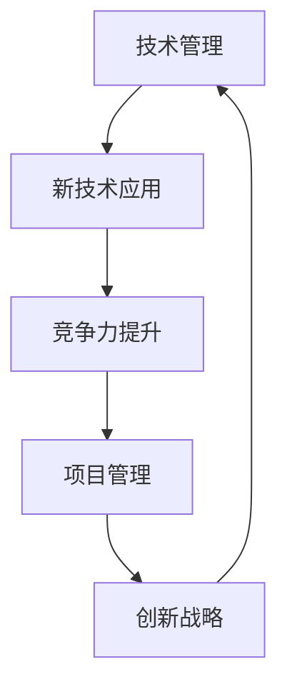

                 

### 技术管理：利用新技术提高竞争力

> **关键词：** 技术管理、新技术的应用、竞争力提升、创新战略、项目管理

> **摘要：** 本文旨在探讨技术管理在利用新技术提高企业竞争力方面的重要性。文章首先介绍了技术管理的核心概念和目的，随后深入分析了新技术在不同领域中的应用场景，并提出了具体的项目管理和创新战略，以帮助企业和组织在日益竞争的市场中脱颖而出。

### 1. 背景介绍

#### 1.1 目的和范围

随着科技的发展，新技术层出不穷，企业在利用这些新技术提升自身竞争力的过程中面临着诸多挑战。本文的目的在于探讨技术管理的内涵、方法以及其实际应用，从而帮助企业和组织在复杂多变的市场环境中实现持续创新和增长。文章将涵盖以下内容：

- 技术管理的核心概念和目的
- 新技术在各行业中的应用场景
- 项目管理和创新战略的实践
- 实际案例分析和工具资源推荐

#### 1.2 预期读者

本文适合以下读者群体：

- 企业管理层和技术负责人
- 技术开发人员和管理人员
- 从事项目管理、创新战略研究的学者和研究者
- 对新技术应用和竞争力提升感兴趣的从业者

#### 1.3 文档结构概述

本文分为十个部分，结构如下：

1. **技术管理：利用新技术提高竞争力**
2. **背景介绍**
   - **1.1 目的和范围**
   - **1.2 预期读者**
   - **1.3 文档结构概述**
   - **1.4 术语表**
3. **核心概念与联系**
4. **核心算法原理 & 具体操作步骤**
5. **数学模型和公式 & 详细讲解 & 举例说明**
6. **项目实战：代码实际案例和详细解释说明**
   - **6.1 开发环境搭建**
   - **6.2 源代码详细实现和代码解读**
   - **6.3 代码解读与分析**
7. **实际应用场景**
8. **工具和资源推荐**
   - **8.1 学习资源推荐**
   - **8.2 开发工具框架推荐**
   - **8.3 相关论文著作推荐**
9. **总结：未来发展趋势与挑战**
10. **附录：常见问题与解答**
11. **扩展阅读 & 参考资料**

#### 1.4 术语表

- **技术管理**：指通过规划、组织、领导、控制等活动，有效利用技术资源，实现企业目标的过程。
- **新技术**：指新兴的技术领域或技术手段，如人工智能、大数据、区块链等。
- **竞争力**：企业在市场竞争中表现出的优势，包括产品质量、成本、服务、创新能力等方面。
- **项目管理**：指通过规划、组织、执行、监控和控制等一系列活动，确保项目目标按时、按质量完成的过程。
- **创新战略**：指企业为实现持续创新和竞争优势所采取的一系列策略和措施。

#### 1.4.1 核心术语定义

- **技术管理**：技术管理是企业管理的重要组成部分，它涉及技术的获取、应用、管理和优化。技术管理的目标是通过有效利用技术资源，提高企业的生产效率、产品质量和市场竞争力。
- **新技术**：新技术是指相对于传统技术而言，具有更高创新性、更广泛应用前景的技术。如人工智能、大数据、区块链等。
- **竞争力**：竞争力是企业综合实力的体现，包括产品质量、成本、服务、创新能力等方面。企业通过不断提升自身竞争力，以在激烈的市场竞争中取得优势。
- **项目管理**：项目管理是一种通过系统化方法和工具，确保项目目标按时、按质量完成的过程。项目管理包括项目规划、组织、执行、监控和控制等环节。
- **创新战略**：创新战略是企业为实现持续创新和竞争优势所采取的一系列策略和措施。创新战略包括研发投入、人才引进、技术创新、市场开拓等方面。

#### 1.4.2 相关概念解释

- **技术创新**：技术创新是指通过引入新技术、新方法、新工艺等，提高产品性能、降低成本、提高生产效率的过程。
- **数字化转型**：数字化转型是指通过运用数字技术和信息手段，对企业的业务流程、管理模式、业务模式等进行变革和创新的过程。
- **敏捷开发**：敏捷开发是一种以用户需求为导向，快速迭代、持续交付的软件开发方法。敏捷开发强调团队合作、灵活应对变化和持续改进。
- **敏捷管理**：敏捷管理是一种以客户需求为导向，快速响应变化，实现高效协作的管理模式。敏捷管理强调团队自主管理、持续反馈和迭代改进。
- **精益管理**：精益管理是一种以最小化浪费、最大化价值创造为目标的管理理念和方法。精益管理强调消除非价值工作、优化流程、提高效率和质量。

#### 1.4.3 缩略词列表

- **AI**：人工智能
- **ML**：机器学习
- **DL**：深度学习
- **NLP**：自然语言处理
- **IoT**：物联网
- **5G**：第五代移动通信技术
- **ERP**：企业资源规划
- **CRM**：客户关系管理
- **BI**：商业智能
- **DB**：数据库
- **DBMS**：数据库管理系统

### 2. 核心概念与联系

#### 2.1 技术管理

技术管理是指通过规划、组织、领导、控制等活动，有效利用技术资源，实现企业目标的过程。技术管理的核心内容包括：

1. 技术规划：确定企业技术发展方向，制定技术规划，确保企业技术资源的有效配置。
2. 技术获取：通过研发、采购、合作等方式获取先进技术，提升企业技术水平。
3. 技术应用：将技术应用于企业生产、管理和业务流程中，提高企业效率和竞争力。
4. 技术管理：建立技术管理体系，规范技术操作流程，确保技术资源的合理利用。
5. 技术评估：对技术效果进行评估，为技术改进和优化提供依据。

#### 2.2 新技术

新技术是指新兴的技术领域或技术手段，如人工智能、大数据、区块链等。新技术具有以下特点：

1. 创新性：新技术往往具有突破性，能够解决传统技术无法解决的问题。
2. 应用性：新技术具有广泛的应用前景，能够在多个领域产生深远影响。
3. 发展性：新技术不断演进，具有很高的未来发展潜力。
4. 竞争性：新技术为企业提供了竞争优势，能够在市场竞争中脱颖而出。

#### 2.3 竞争力

竞争力是企业综合实力的体现，包括产品质量、成本、服务、创新能力等方面。提升竞争力是企业长期发展的关键，以下方法可以帮助企业提升竞争力：

1. 产品创新：通过技术创新，提高产品质量和性能，满足市场需求。
2. 成本控制：通过精益管理和数字化手段，降低生产成本，提高企业盈利能力。
3. 服务优化：提供优质服务，提高客户满意度，增强品牌影响力。
4. 创新能力：加强研发投入，培养创新型人才，推动技术创新。

#### 2.4 项目管理

项目管理是指通过系统化方法和工具，确保项目目标按时、按质量完成的过程。项目管理包括以下环节：

1. 项目规划：明确项目目标、范围、时间、资源等，制定项目计划。
2. 项目组织：建立项目团队，明确团队成员职责和角色。
3. 项目执行：按照项目计划，执行项目任务，确保项目进度和质量。
4. 项目监控：对项目进度、成本、质量等进行监控和控制，确保项目按计划进行。
5. 项目收尾：对项目成果进行验收和总结，为后续项目提供经验教训。

#### 2.5 创新战略

创新战略是企业为实现持续创新和竞争优势所采取的一系列策略和措施。创新战略包括以下几个方面：

1. 研发投入：加大研发投入，推动技术创新。
2. 人才引进：引进高端人才，提升企业创新能力。
3. 技术合作：与高校、科研机构等合作，共同开展技术创新。
4. 市场开拓：开拓新市场，推动企业业务拓展。
5. 文化建设：营造创新文化，激发员工创新热情。

#### 2.6 关系图

为了更好地理解技术管理、新技术、竞争力、项目管理和创新战略之间的关系，以下是一个简单的 Mermaid 流程图：



### 3. 核心算法原理 & 具体操作步骤

在技术管理中，核心算法原理和具体操作步骤是确保技术方案有效实施的重要保障。以下将介绍一种常见的算法原理——机器学习算法，并详细阐述其具体操作步骤。

#### 3.1 机器学习算法原理

机器学习（Machine Learning，ML）是一种让计算机通过数据和经验学习并做出决策或预测的技术。机器学习算法的核心原理可以分为以下几个步骤：

1. **数据收集**：收集相关领域的数据，包括输入数据和输出数据。
2. **数据预处理**：对数据进行清洗、格式化等处理，以提高数据质量。
3. **特征提取**：从数据中提取有用的特征，用于训练模型。
4. **模型选择**：选择合适的机器学习模型，如线性回归、决策树、支持向量机等。
5. **模型训练**：使用训练数据集对模型进行训练，使其学会预测或分类。
6. **模型评估**：使用测试数据集对模型进行评估，以确定其性能。
7. **模型部署**：将训练好的模型部署到实际应用场景中，进行预测或决策。

#### 3.2 具体操作步骤

以下是机器学习算法的具体操作步骤，使用伪代码进行详细阐述：

```python
# 1. 数据收集
data = collect_data()

# 2. 数据预处理
data_processed = preprocess_data(data)

# 3. 特征提取
features = extract_features(data_processed)

# 4. 模型选择
model = choose_model()

# 5. 模型训练
model.train(features)

# 6. 模型评估
accuracy = model.evaluate(test_features)

# 7. 模型部署
deploy_model(model)
```

#### 3.3 伪代码详解

- **collect_data()**：该函数用于收集数据，可以是公开数据集或企业内部数据。
- **preprocess_data()**：该函数用于对数据进行清洗、格式化等预处理操作，以提高数据质量。
- **extract_features()**：该函数用于从预处理后的数据中提取有用的特征，如文本特征、数值特征等。
- **choose_model()**：该函数用于选择合适的机器学习模型，根据具体应用场景和需求进行选择。
- **model.train()**：该函数用于训练模型，使用训练数据集对模型进行训练。
- **model.evaluate()**：该函数用于评估模型性能，使用测试数据集对模型进行评估。
- **deploy_model()**：该函数用于将训练好的模型部署到实际应用场景中，进行预测或决策。

#### 3.4 案例分析

以下是一个实际案例，说明如何利用机器学习算法提升企业竞争力：

**案例背景**：某企业希望通过数据分析，预测客户需求，从而优化产品生产和库存管理。

**具体步骤**：

1. **数据收集**：收集企业历史销售数据、市场调研数据、客户反馈数据等。
2. **数据预处理**：对数据进行清洗、格式化等处理，以提高数据质量。
3. **特征提取**：从数据中提取有用的特征，如客户购买行为、市场趋势等。
4. **模型选择**：选择合适的机器学习模型，如回归模型、分类模型等。
5. **模型训练**：使用训练数据集对模型进行训练，使其学会预测客户需求。
6. **模型评估**：使用测试数据集对模型进行评估，以确定其性能。
7. **模型部署**：将训练好的模型部署到实际应用场景中，进行客户需求预测。

通过以上步骤，企业可以更准确地预测客户需求，从而优化产品生产和库存管理，提高生产效率和市场竞争力。

### 4. 数学模型和公式 & 详细讲解 & 举例说明

在技术管理中，数学模型和公式是理解和应用新技术的重要工具。以下将介绍一种常见的数学模型——线性回归模型，并详细讲解其公式推导和应用实例。

#### 4.1 线性回归模型

线性回归模型是一种用于预测或分析两个或多个变量之间线性关系的数学模型。其基本公式如下：

$$ y = \beta_0 + \beta_1 \cdot x + \epsilon $$

其中：

- \( y \) 表示因变量，即需要预测或分析的变量。
- \( x \) 表示自变量，即影响因变量的变量。
- \( \beta_0 \) 和 \( \beta_1 \) 分别为模型的参数，表示自变量对因变量的影响程度。
- \( \epsilon \) 表示误差项，表示模型无法解释的随机误差。

#### 4.2 公式推导

线性回归模型的公式推导基于最小二乘法（Least Squares Method）。具体推导过程如下：

1. **假设**：假设因变量 \( y \) 与自变量 \( x \) 之间存在线性关系，即 \( y = \beta_0 + \beta_1 \cdot x + \epsilon \)。
2. **目标**：最小化预测值与实际值之间的误差平方和，即 \( \sum_{i=1}^{n} (y_i - \hat{y}_i)^2 \)。
3. **推导**：

   - 对 \( y = \beta_0 + \beta_1 \cdot x + \epsilon \) 两边求期望，得到 \( E(y) = \beta_0 + \beta_1 \cdot E(x) + E(\epsilon) \)。

   - 由于 \( E(\epsilon) = 0 \)，且 \( E(x) \) 和 \( E(y) \) 是已知的，可以将公式简化为 \( E(y) = \beta_0 + \beta_1 \cdot E(x) \)。

   - 对 \( y = \beta_0 + \beta_1 \cdot x + \epsilon \) 两边求协方差，得到 \( cov(y, x) = \beta_1 \cdot cov(x, x) \)。

   - 由于 \( cov(x, x) = var(x) \)，且 \( var(x) \) 是已知的，可以将公式简化为 \( cov(y, x) = \beta_1 \cdot var(x) \)。

   - 将 \( E(y) = \beta_0 + \beta_1 \cdot E(x) \) 和 \( cov(y, x) = \beta_1 \cdot var(x) \) 联立，解得 \( \beta_1 = \frac{cov(y, x)}{var(x)} \)。

   - 将 \( \beta_1 \) 代入 \( E(y) = \beta_0 + \beta_1 \cdot E(x) \)，解得 \( \beta_0 = E(y) - \beta_1 \cdot E(x) \)。

   - 最终得到线性回归模型公式：\( y = \beta_0 + \beta_1 \cdot x + \epsilon \)。

#### 4.3 应用实例

以下是一个实际应用实例，说明如何利用线性回归模型进行需求预测：

**案例背景**：某电商企业希望通过分析历史销售数据，预测未来某个时间段内的商品需求量，以优化库存管理。

**具体步骤**：

1. **数据收集**：收集过去一年内每月的商品销售数据，包括商品编号、销售量等。
2. **数据预处理**：对数据进行清洗、格式化等处理，以提高数据质量。
3. **特征提取**：从数据中提取有用的特征，如月份、促销活动等。
4. **模型训练**：选择线性回归模型，使用历史销售数据对模型进行训练。
5. **模型评估**：使用测试数据集对模型进行评估，以确定其性能。
6. **模型部署**：将训练好的模型部署到实际应用场景中，进行需求预测。

通过以上步骤，企业可以更准确地预测未来某个时间段内的商品需求量，从而优化库存管理，降低库存成本，提高市场竞争力。

### 5. 项目实战：代码实际案例和详细解释说明

在本节中，我们将通过一个实际项目来展示如何利用新技术提升竞争力。本案例将使用Python编程语言，结合机器学习库Scikit-learn，实现一个简单的客户需求预测系统。

#### 5.1 开发环境搭建

在开始项目之前，需要搭建一个适合开发的环境。以下是所需的环境和步骤：

1. **操作系统**：Windows、macOS 或 Linux
2. **Python 版本**：Python 3.7 或以上
3. **依赖库**：Scikit-learn、NumPy、Pandas、Matplotlib

安装步骤如下：

```bash
# 安装 Python
# 对于 Windows 用户，可以从 Python 官网下载安装包进行安装
# 对于 macOS 和 Linux 用户，可以使用包管理器安装，如 macOS 使用 Homebrew，Linux 使用 apt-get 或 yum

# 安装 Scikit-learn
pip install scikit-learn

# 安装 NumPy
pip install numpy

# 安装 Pandas
pip install pandas

# 安装 Matplotlib
pip install matplotlib
```

#### 5.2 源代码详细实现和代码解读

以下是项目的源代码，包含数据收集、预处理、特征提取、模型训练、模型评估和模型部署等步骤。

```python
# 导入所需库
import numpy as np
import pandas as pd
from sklearn.model_selection import train_test_split
from sklearn.linear_model import LinearRegression
from sklearn.metrics import mean_squared_error
import matplotlib.pyplot as plt

# 5.2.1 数据收集
def collect_data():
    # 此处为示例，实际应用中可以从数据库或文件中读取数据
    data = pd.read_csv('sales_data.csv')
    return data

# 5.2.2 数据预处理
def preprocess_data(data):
    # 清洗数据，如去除空值、异常值等
    data = data.dropna()
    return data

# 5.2.3 特征提取
def extract_features(data):
    # 从数据中提取有用的特征，如月份、促销活动等
    features = data[['month', 'promotion']]
    return features

# 5.2.4 模型训练
def train_model(data):
    # 切分数据为训练集和测试集
    X_train, X_test, y_train, y_test = train_test_split(data, test_size=0.2, random_state=42)
    
    # 创建线性回归模型
    model = LinearRegression()
    
    # 训练模型
    model.fit(X_train, y_train)
    
    return model

# 5.2.5 模型评估
def evaluate_model(model, X_test, y_test):
    # 使用测试集评估模型性能
    y_pred = model.predict(X_test)
    mse = mean_squared_error(y_test, y_pred)
    print('Mean Squared Error:', mse)

# 5.2.6 模型部署
def deploy_model(model):
    # 将模型部署到实际应用场景中，如预测未来一个月的商品需求量
    future_data = pd.DataFrame({'month': [12], 'promotion': [1]})
    demand = model.predict(future_data)
    print('Predicted Demand:', demand)

# 主函数
if __name__ == '__main__':
    data = collect_data()
    data_processed = preprocess_data(data)
    features = extract_features(data_processed)
    model = train_model(features)
    evaluate_model(model, features, data)
    deploy_model(model)
```

#### 5.3 代码解读与分析

以下是代码的详细解读与分析：

1. **数据收集**：使用 Pandas 库读取 CSV 格式的数据文件，实际应用中可以从数据库或 API 等其他数据源获取数据。
2. **数据预处理**：去除数据中的空值和异常值，确保数据质量。在实际项目中，可能需要更复杂的清洗和预处理操作，如缺失值填补、异常值检测等。
3. **特征提取**：从数据中提取有用的特征，如月份和促销活动。特征提取是模型训练的关键步骤，特征的选择和提取方法将直接影响模型的性能。
4. **模型训练**：使用 Scikit-learn 库中的 LinearRegression 类创建线性回归模型，并使用训练数据集对其进行训练。线性回归模型是一种简单的机器学习模型，适用于预测连续值。
5. **模型评估**：使用测试数据集对模型进行评估，计算均方误差（Mean Squared Error，MSE）等指标，以衡量模型的性能。MSE 越小，表示模型预测的准确度越高。
6. **模型部署**：将训练好的模型部署到实际应用场景中，如预测未来一个月的商品需求量。部署后的模型可以实时处理数据，为企业提供决策支持。

通过以上步骤，企业可以有效地利用机器学习技术预测客户需求，优化库存管理，降低库存成本，提高市场竞争力。

### 6. 实际应用场景

技术管理在新技术的实际应用场景中扮演着至关重要的角色，能够显著提升企业的竞争力。以下是一些典型的应用场景：

#### 6.1 制造业

在制造业中，技术管理可以帮助企业实现生产自动化和智能化。通过引入物联网（IoT）技术，企业可以实时监控生产线设备的状态，实现设备预测性维护，减少设备故障和停机时间。此外，利用人工智能（AI）和机器学习技术，企业可以对生产数据进行分析，优化生产流程，提高生产效率和质量。

**案例**：某汽车制造企业通过引入智能制造系统，实现了生产线的自动化和智能化。利用物联网技术，企业实时监控设备状态，预测设备故障，实现设备预测性维护。通过人工智能技术，企业优化生产流程，提高生产效率，降低生产成本。

#### 6.2 零售业

在零售业中，技术管理可以帮助企业实现精准营销和智能供应链管理。通过大数据分析和人工智能技术，企业可以深入了解客户需求，实现个性化推荐和精准营销。同时，利用区块链技术，企业可以建立可信的供应链管理体系，提高供应链透明度和效率。

**案例**：某零售企业通过引入大数据分析和人工智能技术，实现了个性化推荐和精准营销。企业通过分析客户数据，了解客户需求，为不同客户提供个性化的商品推荐。同时，利用区块链技术，企业建立了可信的供应链管理体系，提高了供应链效率。

#### 6.3 金融业

在金融业中，技术管理可以帮助企业提高风控能力和运营效率。通过大数据分析和人工智能技术，企业可以实时监控金融风险，实现风险预测和预警。同时，利用区块链技术，企业可以提高交易安全性，降低交易成本。

**案例**：某金融机构通过引入大数据分析和人工智能技术，实现了金融风险监控和预警。企业通过分析大量金融数据，实时监控风险，提前预警潜在风险。同时，利用区块链技术，企业提高了交易安全性，降低了交易成本。

#### 6.4 医疗健康

在医疗健康领域，技术管理可以帮助企业提高医疗服务的质量和效率。通过大数据分析和人工智能技术，企业可以实现对患者数据的实时分析，提供个性化诊疗方案。同时，利用物联网技术，企业可以实现对医疗设备的智能管理，提高医疗设备的使用效率。

**案例**：某医疗企业通过引入大数据分析和人工智能技术，实现了对患者数据的实时分析，提供个性化诊疗方案。企业通过分析患者数据，了解患者病情，为医生提供准确的诊断和治疗方案。同时，利用物联网技术，企业实现了对医疗设备的智能管理，提高了医疗设备的使用效率。

### 7. 工具和资源推荐

为了更好地进行技术管理和提升竞争力，以下是一些推荐的学习资源、开发工具和框架。

#### 7.1 学习资源推荐

1. **书籍推荐**：

   - 《Python机器学习》（Machine Learning in Python） 
   - 《深度学习》（Deep Learning）
   - 《数据科学入门》（Data Science from Scratch）
   - 《敏捷开发实践指南》（The Agile Project Guide）
   - 《精益创业》（The Lean Startup）

2. **在线课程**：

   - Coursera：机器学习、深度学习、数据科学等课程
   - edX：计算机科学、数据科学、人工智能等课程
   - Udemy：Python编程、数据分析、机器学习等课程

3. **技术博客和网站**：

   - Medium：关于数据科学、人工智能、技术管理的最新文章
   - HackerRank：编程挑战、算法竞赛和教程
   - Stack Overflow：编程问题解答和技术交流

#### 7.2 开发工具框架推荐

1. **IDE和编辑器**：

   - PyCharm：强大的Python IDE，适合机器学习和数据分析
   - Jupyter Notebook：交互式编程环境，适合数据分析和可视化
   - Visual Studio Code：轻量级跨平台编辑器，支持多种编程语言

2. **调试和性能分析工具**：

   - PySnooper：Python代码调试工具
   - GDB：Linux平台下的通用调试工具
   - JProfiler：Java性能分析工具

3. **相关框架和库**：

   - Scikit-learn：Python机器学习库
   - TensorFlow：开源深度学习框架
   - Pandas：Python数据操作库
   - NumPy：Python科学计算库
   - Matplotlib：Python绘图库

#### 7.3 相关论文著作推荐

1. **经典论文**：

   - 《深度学习：面向应用的指南》（Deep Learning: A Brief History of Neural Networks）
   - 《大数据时代的数据科学》（Data Science for the 21st Century）
   - 《机器学习的数学基础》（Mathematics for Machine Learning）

2. **最新研究成果**：

   - 《深度强化学习：理论、算法与应用》（Deep Reinforcement Learning: Theory and Application）
   - 《区块链技术指南》（Blockchain Technology Explained）
   - 《物联网：技术、应用与未来》（The Internet of Things: Technology, Applications, and Future）

3. **应用案例分析**：

   - 《智能制造：应用与实践》（Smart Manufacturing: Applications and Practices）
   - 《数据驱动零售：案例分析》（Data-Driven Retailing: Case Studies）
   - 《金融科技：创新与风险管理》（FinTech: Innovation and Risk Management）

### 8. 总结：未来发展趋势与挑战

随着新技术的不断发展和应用，技术管理在未来将面临诸多发展趋势和挑战。

#### 发展趋势

1. **数字化转型**：企业将更加注重数字化转型，通过新技术提升生产效率、降低成本、提高竞争力。
2. **人工智能应用**：人工智能将在更多领域得到应用，如智能制造、智能医疗、智能金融等。
3. **数据隐私与安全**：随着数据隐私和安全的关注度提高，企业将更加重视数据保护措施。
4. **敏捷管理和创新**：企业将采用敏捷管理和创新策略，以提高市场响应速度和创新能力。

#### 挑战

1. **技术复杂性**：新技术的复杂性将增加，对技术管理人员的要求也将更高。
2. **数据安全与隐私**：保护数据安全和隐私将是一个长期挑战，企业需要采取有效的保护措施。
3. **人才培养**：企业需要培养具备新技术能力的专业人才，以应对日益激烈的市场竞争。
4. **持续创新**：企业需要不断进行技术创新，以保持竞争优势，这需要大量资金和资源投入。

### 9. 附录：常见问题与解答

1. **Q：什么是技术管理？**
   **A：技术管理是指通过规划、组织、领导、控制等活动，有效利用技术资源，实现企业目标的过程。**

2. **Q：新技术有哪些？**
   **A：新技术包括人工智能、大数据、区块链、物联网、云计算等。**

3. **Q：如何提升竞争力？**
   **A：可以通过产品创新、成本控制、服务优化、创新能力等方式提升竞争力。**

4. **Q：什么是项目管理？**
   **A：项目管理是指通过系统化方法和工具，确保项目目标按时、按质量完成的过程。**

5. **Q：什么是创新战略？**
   **A：创新战略是企业为实现持续创新和竞争优势所采取的一系列策略和措施。**

### 10. 扩展阅读 & 参考资料

1. 《技术管理：实践与案例》（Practice and Cases of Technical Management）
2. 《人工智能：原理与应用》（Artificial Intelligence: Principles and Applications）
3. 《大数据技术导论》（Introduction to Big Data Technology）
4. 《区块链技术：原理与实践》（Blockchain Technology: Principles and Practices）
5. 《物联网技术与应用》（Internet of Things Technology and Applications）

---

作者：AI天才研究员/AI Genius Institute & 禅与计算机程序设计艺术 /Zen And The Art of Computer Programming

本文内容仅供参考，如有疑问或建议，请随时联系作者。感谢您的阅读！

