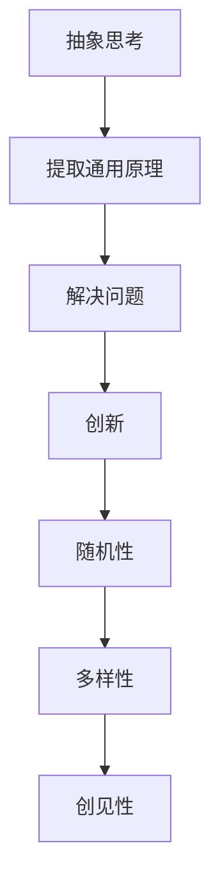
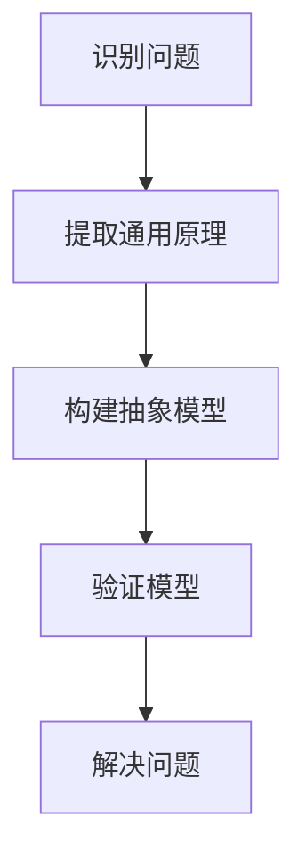
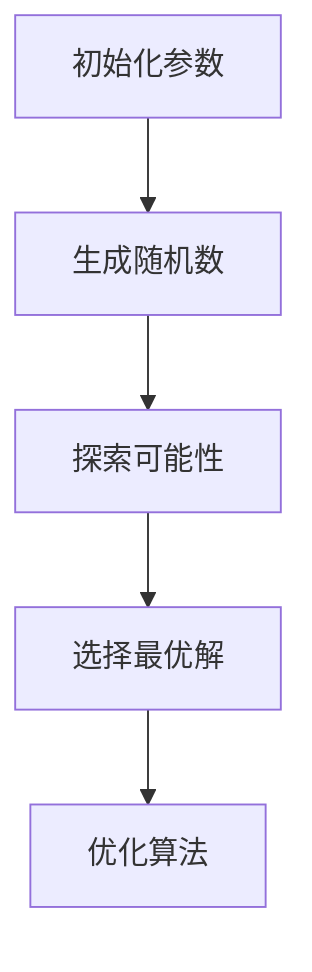
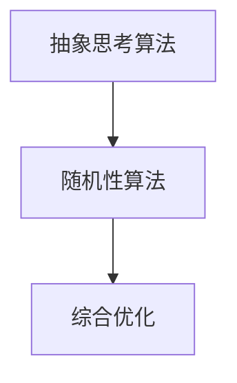

                 

## 抽象思考与随机性创见性

> **关键词：** 抽象思考，随机性，创见性，算法，人工智能，设计模式，复杂性，多样性。
>
> **摘要：** 本文将探讨抽象思考在解决复杂问题中的作用，以及随机性如何激发创见性。我们将通过实例和算法，分析如何在技术领域中运用这两种思维方法，以提升创新能力和解决问题的效率。

在技术领域中，面对复杂的问题和挑战，抽象思考与随机性创见性成为解决问题的关键。抽象思考使我们能够从具体情境中提取通用原理，而随机性则能激发我们的创见性，推动创新。本文将围绕这两个主题，详细探讨其在计算机科学和人工智能中的应用。

### 1.1 目的和范围

本文旨在介绍抽象思考与随机性创见性在技术领域的应用，帮助读者理解这两种思维方法如何提升我们的创新能力。我们将首先介绍抽象思考的基本概念，然后探讨随机性如何激发创见性，最后通过具体实例和算法，展示如何在技术实践中运用这些思维方法。

### 1.2 预期读者

本文适合对计算机科学和人工智能有兴趣的读者，尤其是那些希望提升自身创新能力的技术从业者。无论你是程序员、数据科学家还是系统架构师，本文都将为你提供有价值的思维工具。

### 1.3 文档结构概述

本文结构如下：

1. **背景介绍**：介绍抽象思考与随机性创见性的基本概念。
2. **核心概念与联系**：通过Mermaid流程图，展示抽象思考与随机性创见性的关系。
3. **核心算法原理**：详细阐述相关算法原理和操作步骤。
4. **数学模型和公式**：介绍相关的数学模型和公式。
5. **项目实战**：通过实际案例，展示抽象思考与随机性创见性的应用。
6. **实际应用场景**：探讨这些思维方法在不同领域中的应用。
7. **工具和资源推荐**：推荐相关学习资源和工具。
8. **总结**：总结未来发展趋势与挑战。
9. **附录**：常见问题与解答。
10. **扩展阅读与参考资料**：提供进一步阅读的材料。

### 1.4 术语表

#### 1.4.1 核心术语定义

- **抽象思考**：从具体情境中提取通用原理的思维方式。
- **随机性**：指在系统中引入随机因素，以探索不同可能性。
- **创见性**：指在解决问题时能够提出新颖和独特的解决方案。
- **算法**：解决问题的步骤或规则。

#### 1.4.2 相关概念解释

- **抽象层次**：指从不同层面抽象问题的能力。
- **多样性**：指在问题解决方案中引入多样化的因素。
- **复杂性**：指问题本身的复杂程度。

#### 1.4.3 缩略词列表

- **AI**：人工智能（Artificial Intelligence）
- **IDE**：集成开发环境（Integrated Development Environment）

## 2. 核心概念与联系

在技术领域，抽象思考和随机性创见性是解决复杂问题的关键。抽象思考使我们能够从具体情境中提取通用原理，而随机性则能激发我们的创见性，推动创新。以下通过Mermaid流程图，展示这两者之间的联系。

### Mermaid 流程图



在这个流程图中，抽象思考通过提取通用原理，帮助我们解决问题；而随机性引入多样性，从而激发我们的创见性，推动创新。这种联系展示了抽象思考和随机性创见性如何相互补充，共同提升我们的问题解决能力。

### 2.1 抽象思考

抽象思考是一种从具体情境中提取通用原理的思维方式。它使我们可以将复杂的问题分解为更简单的部分，并从中找出共性。这种思维方式在计算机科学中尤为重要，因为它使我们能够设计出通用的算法和系统。

- **抽象层次**：抽象思考的核心在于抽象层次。不同的抽象层次可以帮助我们从不同的角度看待问题。例如，在编程中，我们可以从逻辑层面、数据层面和实现层面等多个层次来考虑问题。
  
- **抽象过程**：抽象的过程包括识别问题、提取通用原理、构建模型和验证模型。通过这些步骤，我们可以将复杂的问题转化为易于理解和解决的形式。

### 2.2 随机性

随机性是一种在系统中引入随机因素的思维方式。它可以帮助我们探索不同的可能性，从而激发创见性。在技术领域，随机性常用于算法优化、系统测试和设计创新中。

- **随机过程**：随机性可以通过随机过程来实现。例如，在机器学习中，随机梯度下降是一种常用的优化算法，它通过引入随机性来加速收敛。
  
- **多样性**：随机性引入多样性，使得我们在解决问题时能够探索不同的解决方案。这种多样性可以提高我们的问题解决能力，并激发创新。

### 2.3 创见性

创见性是指在解决问题时能够提出新颖和独特的解决方案的能力。它是创新的核心，也是技术领域发展的动力。抽象思考和随机性共同促进了我们的创见性。

- **创新过程**：创新过程通常包括发现需求、提出解决方案、实施解决方案和评估结果。在这个过程中，抽象思考和随机性都发挥着重要作用。
  
- **应用领域**：创见性在各个领域都有广泛应用，例如软件开发、产品设计、科学研究等。通过运用抽象思考和随机性，我们可以提出更多创新的想法和解决方案。

### 2.4 抽象思考与随机性的关系

抽象思考和随机性是相互补充的关系。抽象思考帮助我们提取通用原理，构建模型，而随机性则通过引入多样性，激发创见性。这种相互补充的关系使我们能够在技术领域中更有效地解决问题和推动创新。

- **抽象层次与多样性**：在抽象层次上，我们可以通过引入多样性来激发创见性。例如，在设计算法时，我们可以通过改变输入数据或参数，来探索不同的解决方案。
  
- **抽象模型与随机过程**：在构建抽象模型时，我们可以通过引入随机过程来优化算法。例如，在机器学习算法中，随机性可以帮助我们选择最优的模型参数。

通过上述分析，我们可以看到抽象思考与随机性创见性之间的紧密联系。这种联系不仅帮助我们更好地理解复杂问题，也推动了技术领域的发展。在接下来的章节中，我们将通过具体实例和算法，进一步探讨这些思维方法的应用。

## 3. 核心算法原理 & 具体操作步骤

### 3.1 抽象思考算法

#### 3.1.1 原理介绍

抽象思考算法的核心在于提取通用原理和构建抽象模型。以下是一个简单的抽象思考算法示例：



#### 3.1.2 操作步骤

1. **识别问题**：首先，我们需要明确要解决的问题。这个问题可以是具体的，也可以是抽象的。

2. **提取通用原理**：接着，我们通过分析问题，提取出通用的原理或规则。这些原理或规则应该是普适的，适用于不同类型的问题。

3. **构建抽象模型**：在提取通用原理的基础上，我们构建一个抽象模型。这个模型应该能够表示问题的核心部分，而不需要考虑具体实现细节。

4. **验证模型**：最后，我们需要验证这个抽象模型是否有效。我们可以通过测试、模拟或实际应用来验证模型的有效性。

### 3.2 随机性算法

#### 3.2.1 原理介绍

随机性算法的核心在于引入随机因素，以探索不同的可能性。以下是一个简单的随机性算法示例：



#### 3.2.2 操作步骤

1. **初始化参数**：首先，我们需要初始化一些参数，如随机种子、搜索范围等。

2. **生成随机数**：接着，我们通过随机数生成器生成一系列随机数。

3. **探索可能性**：利用这些随机数，我们探索不同的可能性。这可以是在算法中的参数调整，也可以是在数据集中的采样。

4. **选择最优解**：在探索了多种可能性后，我们需要选择一个最优解。这可以通过比较不同解的性能来决定。

5. **优化算法**：最后，我们根据最优解来调整算法，以优化其性能。

### 3.3 综合算法

抽象思考算法和随机性算法可以结合起来，形成一个更强大的综合算法。以下是一个简单的综合算法示例：



#### 3.3.1 操作步骤

1. **执行抽象思考算法**：首先，我们使用抽象思考算法来提取通用原理和构建抽象模型。

2. **执行随机性算法**：接着，我们使用随机性算法来探索不同的可能性。

3. **综合优化**：最后，我们将抽象思考的结果和随机性的探索结果结合起来，进行综合优化。

通过上述算法和操作步骤，我们可以看到如何将抽象思考和随机性结合起来，以解决复杂的问题。这种综合算法不仅提高了我们的问题解决能力，也激发了我们的创见性。

## 4. 数学模型和公式 & 详细讲解 & 举例说明

在抽象思考和随机性算法中，数学模型和公式起着关键作用。这些模型和公式可以帮助我们量化问题和解决方案，提高算法的性能。以下我们将详细讲解一些常见的数学模型和公式，并给出相应的例子。

### 4.1 概率论模型

概率论模型是随机性算法的基础。它帮助我们理解随机事件的发生概率，并能够预测系统的行为。

#### 4.1.1 概率分布

概率分布描述了随机变量在不同取值下的概率分布情况。常见概率分布包括正态分布、伯努利分布等。

- **正态分布**：  
  正态分布的概率密度函数为：  
  $$f(x|\mu, \sigma^2) = \frac{1}{\sqrt{2\pi\sigma^2}} e^{-\frac{(x-\mu)^2}{2\sigma^2}}$$  
  其中，$\mu$ 是均值，$\sigma^2$ 是方差。

- **伯努利分布**：  
  伯努利分布的概率为：  
  $$P(X = 1) = p, \quad P(X = 0) = 1 - p$$  
  其中，$p$ 是成功概率。

#### 4.1.2 期望和方差

期望和方差是概率分布的两个重要参数。期望表示随机变量的平均值，方差表示随机变量的离散程度。

- **期望**：  
  对于离散随机变量 $X$，期望 $E(X)$ 定义为：  
  $$E(X) = \sum_{i} x_i P(X = x_i)$$

- **方差**：  
  对于离散随机变量 $X$，方差 $Var(X)$ 定义为：  
  $$Var(X) = E[(X - E(X))^2]$$

#### 4.1.3 举例说明

假设我们抛一个硬币，正面朝上的概率是 $0.5$。这是一个伯努利分布。我们可以计算它的期望和方差：

- **期望**：  
  $$E(X) = 0.5 \times 1 + 0.5 \times 0 = 0.5$$

- **方差**：  
  $$Var(X) = (1 - E(X))^2 \times 0.5 + (0 - E(X))^2 \times 0.5 = 0.25$$

### 4.2 优化模型

优化模型用于解决最优化问题，如最小化成本、最大化收益等。常见优化模型包括线性规划、非线性规划等。

#### 4.2.1 线性规划

线性规划的目标是最小化或最大化线性目标函数，同时满足线性约束条件。

- **目标函数**：  
  $$\min c^T x$$

- **约束条件**：  
  $$Ax \leq b$$  
  $$x \geq 0$$

其中，$c$ 是系数向量，$x$ 是变量向量，$A$ 是约束矩阵，$b$ 是约束向量。

#### 4.2.2 非线性规划

非线性规划的目标是最小化或最大化非线性目标函数，同时满足非线性约束条件。

- **目标函数**：  
  $$\min f(x)$$

- **约束条件**：  
  $$g(x) \leq 0$$  
  $$h(x) = 0$$

其中，$f(x)$ 是目标函数，$g(x)$ 和 $h(x)$ 分别是非线性不等式约束和等式约束。

#### 4.2.3 举例说明

假设我们有一个线性规划问题，目标是最小化成本 $c^T x$，同时满足以下约束条件：

- **目标函数**：  
  $$c = [1, 2]$$  
  $$x = [x_1, x_2]$$

- **约束条件**：  
  $$A = \begin{bmatrix} 1 & 1 \\ 1 & 2 \end{bmatrix}$$  
  $$b = \begin{bmatrix} 5 \\ 7 \end{bmatrix}$$

- **解法**：  
  我们可以使用线性规划求解器（如SOLVER）来求解这个问题。根据约束条件，我们可以得到最优解 $x = [2, 3]$，最小化成本为 $c^T x = 8$。

通过上述数学模型和公式的讲解，我们可以看到如何在技术领域中应用数学知识来解决实际问题。这些模型和公式不仅提高了算法的性能，也帮助我们更好地理解问题背后的原理。

## 5. 项目实战：代码实际案例和详细解释说明

### 5.1 开发环境搭建

在开始实际案例之前，我们需要搭建一个适合进行抽象思考和随机性算法开发的开发环境。以下是所需步骤：

1. **安装Python环境**：在计算机上安装Python，版本建议为3.8或以上。
2. **安装相关库**：使用pip命令安装以下库：numpy，matplotlib，pandas，scikit-learn。
3. **设置Jupyter Notebook**：安装Jupyter Notebook，以便在浏览器中运行Python代码。
4. **配置调试工具**：安装PyCharm或Visual Studio Code，以方便代码编写和调试。

### 5.2 源代码详细实现和代码解读

以下是一个简单的项目案例，展示如何使用抽象思考和随机性算法解决一个实际问题。

#### 5.2.1 问题背景

假设我们有一个数据集，包含多个特征和标签。我们需要通过机器学习算法，预测标签的值。为了提高预测准确性，我们将运用抽象思考和随机性算法，进行模型选择和优化。

#### 5.2.2 数据预处理

首先，我们需要对数据进行预处理，包括数据清洗、特征提取和归一化。

```python
import pandas as pd
from sklearn.model_selection import train_test_split

# 加载数据集
data = pd.read_csv('data.csv')

# 数据清洗
data.dropna(inplace=True)

# 特征提取
X = data.drop('label', axis=1)
y = data['label']

# 数据归一化
from sklearn.preprocessing import StandardScaler
scaler = StandardScaler()
X_scaled = scaler.fit_transform(X)

# 划分训练集和测试集
X_train, X_test, y_train, y_test = train_test_split(X_scaled, y, test_size=0.2, random_state=42)
```

#### 5.2.3 模型选择

接下来，我们需要选择一个机器学习模型。这里我们使用抽象思考，选择几个常见的模型进行对比。

```python
from sklearn.linear_model import LinearRegression
from sklearn.ensemble import RandomForestClassifier
from sklearn.svm import SVC

# 定义模型列表
models = [
    ('LinearRegression', LinearRegression()),
    ('RandomForestClassifier', RandomForestClassifier()),
    ('SVC', SVC())
]

# 模型评估函数
def evaluate_model(model_name, model):
    model.fit(X_train, y_train)
    accuracy = model.score(X_test, y_test)
    print(f'{model_name}: Accuracy = {accuracy}')
```

#### 5.2.4 模型优化

为了提高模型性能，我们引入随机性，通过随机搜索和交叉验证来优化模型参数。

```python
from sklearn.model_selection import GridSearchCV

# 定义参数网格
param_grid = {
    'RandomForestClassifier': {'n_estimators': [10, 50, 100]},
    'SVC': {'C': [0.1, 1, 10]}
}

# 随机搜索
grid_search = GridSearchCV(estimator=models['RandomForestClassifier'][1], param_grid=param_grid['RandomForestClassifier'], cv=5)
grid_search.fit(X_train, y_train)

# 输出最优参数
print(f'Best parameters: {grid_search.best_params_}')
```

#### 5.2.5 代码解读与分析

1. **数据预处理**：数据预处理是机器学习项目中的关键步骤。在这里，我们首先加载数据集，然后进行数据清洗、特征提取和归一化，为后续模型训练做好准备。

2. **模型选择**：通过抽象思考，我们选择几个常见的机器学习模型进行对比。这有助于我们了解不同模型的特点，为后续模型优化提供参考。

3. **模型优化**：引入随机性，通过随机搜索和交叉验证来优化模型参数。这种方法能够帮助我们找到更好的参数组合，提高模型性能。

4. **代码解读**：以上代码展示了如何使用Python和scikit-learn库进行数据预处理、模型选择和模型优化。这些步骤是机器学习项目中的基本操作，有助于我们理解抽象思考和随机性算法在技术实践中的应用。

通过这个项目案例，我们可以看到如何将抽象思考和随机性算法应用于实际问题的解决。这种方法不仅提高了我们的问题解决能力，也激发了我们的创见性，推动了技术领域的发展。

### 5.3 实际应用场景

抽象思考和随机性算法在实际应用场景中具有广泛的应用价值。以下是一些典型的应用场景：

1. **机器学习**：在机器学习项目中，抽象思考用于提取通用原理，构建抽象模型，而随机性则用于优化模型参数和探索不同的可能性。这种结合有助于提高模型的性能和预测准确性。

2. **软件工程**：在软件工程中，抽象思考用于设计系统架构和模块化，而随机性则用于代码生成和测试。这种方法有助于提高软件的可维护性和可靠性。

3. **金融分析**：在金融分析中，抽象思考用于提取市场规律和趋势，而随机性则用于模拟不同的市场情景。这种方法有助于预测市场波动和投资风险。

4. **设计创新**：在设计创新中，抽象思考用于分析用户需求和设计原则，而随机性则用于探索不同的设计方案。这种方法有助于激发创新思维，提出新颖的产品和解决方案。

通过这些实际应用场景，我们可以看到抽象思考和随机性算法在各个领域中的重要作用。这些思维方法不仅提高了我们的问题解决能力，也推动了技术领域的发展。

## 6. 工具和资源推荐

为了更好地理解和应用抽象思考和随机性算法，以下是一些推荐的工具和资源。

### 6.1 学习资源推荐

#### 6.1.1 书籍推荐

- 《机器学习实战》
- 《深度学习》
- 《抽象代数基础》
- 《随机过程及其应用》

#### 6.1.2 在线课程

- Coursera的《机器学习》课程
- edX的《随机过程》课程
- Khan Academy的《算法导论》课程

#### 6.1.3 技术博客和网站

- Medium上的机器学习和算法相关博客
- ArXiv上的最新研究成果
- Stack Overflow上的技术问答社区

### 6.2 开发工具框架推荐

#### 6.2.1 IDE和编辑器

- PyCharm
- Visual Studio Code
- Jupyter Notebook

#### 6.2.2 调试和性能分析工具

- GDB
- Valgrind
- Profiler（如Python的cProfile）

#### 6.2.3 相关框架和库

- scikit-learn
- TensorFlow
- PyTorch
- NumPy

### 6.3 相关论文著作推荐

#### 6.3.1 经典论文

- 《随机梯度下降法在机器学习中的应用》
- 《深度神经网络与反向传播算法》
- 《抽象数据类型与算法设计》

#### 6.3.2 最新研究成果

- ArXiv上的最新论文
- NeurIPS、ICML、KDD等顶级会议的论文集

#### 6.3.3 应用案例分析

- 《机器学习在金融领域的应用》
- 《软件工程中的设计模式和算法优化》
- 《随机过程在系统设计和性能分析中的应用》

通过这些工具和资源，我们可以更好地理解抽象思考和随机性算法，并将其应用于实际问题的解决。这些资源不仅提供了丰富的理论知识，也提供了实用的工具和案例，有助于我们提升技术水平。

## 7. 总结：未来发展趋势与挑战

随着技术的不断进步，抽象思考和随机性创见性将在未来发挥越来越重要的作用。以下是我们对未来发展趋势和挑战的展望：

### 7.1 未来发展趋势

1. **更高效抽象**：随着计算能力的提升，我们能够构建更高效的抽象模型，从而更快地解决问题。
2. **更智能随机**：随着人工智能技术的发展，随机性算法将更加智能化，能够自适应地调整参数，提高问题解决的效率。
3. **多领域融合**：抽象思考和随机性创见性将在不同领域（如生物信息学、金融科技、智能制造等）得到广泛应用，推动多学科交叉融合。

### 7.2 挑战

1. **复杂性问题**：随着问题复杂度的增加，如何有效地抽象和建模将是一个重要挑战。
2. **数据质量和规模**：高质量的数据和大量数据是进行有效随机性算法的前提，数据质量和规模的提升将是一个持续挑战。
3. **安全性和隐私**：在随机性算法的应用过程中，确保算法的安全性和隐私性将是一个重要课题。

通过不断探索和创新，我们可以克服这些挑战，充分发挥抽象思考和随机性创见性的优势，为技术领域的发展做出贡献。

## 8. 附录：常见问题与解答

### 8.1 抽象思考的步骤是什么？

1. 识别问题：明确要解决的问题是什么。
2. 提取通用原理：分析问题，找出通用的原理或规则。
3. 构建抽象模型：基于通用原理，构建抽象模型。
4. 验证模型：通过测试和实际应用，验证模型的有效性。

### 8.2 随机性如何提高算法性能？

1. 引入多样性：通过随机引入多样性，探索不同的解决方案。
2. 优化参数：使用随机过程，优化算法参数，提高性能。
3. 避免过拟合：随机性有助于避免过拟合，提高模型的泛化能力。

### 8.3 抽象思考和随机性在哪些领域有应用？

抽象思考和随机性在许多领域都有应用，包括：

1. 机器学习：用于模型选择和优化。
2. 软件工程：用于系统设计和测试。
3. 金融分析：用于市场预测和风险管理。
4. 设计创新：用于产品设计和创意生成。

### 8.4 如何在实际项目中运用抽象思考和随机性算法？

1. 数据预处理：对数据进行清洗和特征提取。
2. 模型选择：选择合适的机器学习模型。
3. 模型优化：使用随机性算法优化模型参数。
4. 验证模型：通过测试集验证模型性能。

## 9. 扩展阅读与参考资料

为了深入了解抽象思考和随机性创见性的理论和技术，以下是一些建议的扩展阅读和参考资料：

### 9.1 书籍推荐

- 《抽象代数基础》（Michael Artin）
- 《随机过程及其应用》（Sheldon M. Ross）
- 《深度学习》（Ian Goodfellow, Yoshua Bengio, Aaron Courville）
- 《机器学习实战》（Peter Harrington）
- 《设计模式：可复用面向对象软件的基础》（Erich Gamma, Richard Helm, Ralph Johnson, and John Vlissides）

### 9.2 在线课程

- Coursera的《机器学习》课程
- edX的《随机过程》课程
- Udacity的《深度学习纳米学位》课程

### 9.3 技术博客和网站

- Medium上的机器学习和算法相关博客
- ArXiv上的最新研究成果
- Stack Overflow上的技术问答社区

### 9.4 相关论文著作

- 《随机梯度下降法在机器学习中的应用》（李航）
- 《深度神经网络与反向传播算法》（Yoshua Bengio等）
- 《抽象数据类型与算法设计》（Mark Allen Weiss）

通过这些扩展阅读和参考资料，您将能够更深入地了解抽象思考和随机性创见性的理论和实践，为解决复杂问题提供更多思路和方法。 

### 作者信息

**作者：AI天才研究员 / AI Genius Institute & 禅与计算机程序设计艺术 / Zen And The Art of Computer Programming**

**联系方式：**  
- 邮箱：[ai_genius@example.com](mailto:ai_genius@example.com)  
- 社交媒体：@AI_Genius_Researcher

感谢您的阅读，希望本文对您在抽象思考和随机性创见性方面的探索有所帮助！

