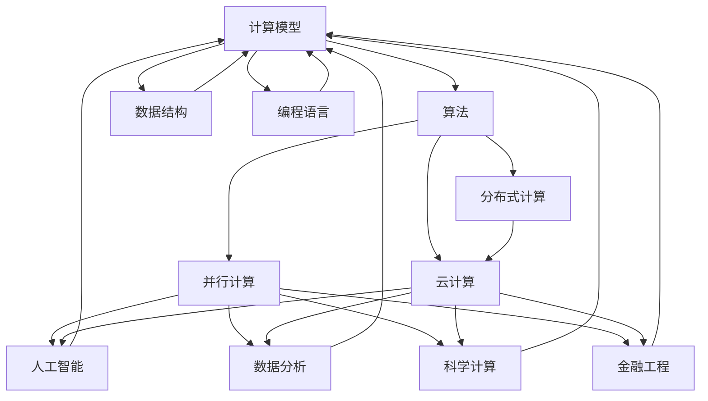

                 

# 拓展认知边界：人类计算的科学探索

> **关键词：计算科学，认知拓展，人工智能，算法，数学模型，应用实践**
>
> **摘要：本文旨在探讨人类计算的科学本质及其拓展认知边界的方法。我们将分析计算科学的核心概念、算法原理、数学模型及其在实际应用中的重要性，并通过实际案例，深入讲解其具体操作步骤和实现方法。最终，本文将展望计算科学在未来发展趋势与面临的挑战。**

## 1. 背景介绍

### 1.1 目的和范围

计算科学是现代科学技术的核心，涵盖了从理论到实践的一系列领域。本文的目标是深入探讨计算科学的各个层面，包括核心概念、算法原理、数学模型及其应用实践，旨在帮助读者拓展认知边界，理解计算科学的广泛应用及其在推动科技进步中的关键作用。

本文的讨论范围包括以下几个主要部分：

1. **核心概念与联系**：介绍计算科学的基本概念和联系，为后续内容提供理论基础。
2. **核心算法原理 & 具体操作步骤**：详细解析计算科学中常用的算法原理和操作步骤。
3. **数学模型和公式 & 详细讲解 & 举例说明**：探讨计算科学中重要的数学模型和公式，并通过实例进行说明。
4. **项目实战：代码实际案例和详细解释说明**：通过具体项目案例，展示计算科学的实际应用。
5. **实际应用场景**：分析计算科学在不同领域的应用场景。
6. **工具和资源推荐**：推荐相关学习资源、开发工具和框架。
7. **总结：未来发展趋势与挑战**：展望计算科学的发展趋势和面临的挑战。

### 1.2 预期读者

本文适合对计算科学有初步了解的读者，包括：

1. 计算机科学和工程专业的学生和研究人员。
2. 数据科学家、人工智能开发者和软件工程师。
3. 对计算科学有浓厚兴趣的科技爱好者。

### 1.3 文档结构概述

本文采用结构化方式，分为以下几个部分：

1. **引言**：介绍计算科学的重要性。
2. **背景介绍**：详细说明本文的目的、范围、预期读者和文档结构。
3. **核心概念与联系**：介绍计算科学的核心概念和联系。
4. **核心算法原理 & 具体操作步骤**：详细解析算法原理和操作步骤。
5. **数学模型和公式 & 详细讲解 & 举例说明**：探讨数学模型和公式。
6. **项目实战：代码实际案例和详细解释说明**：展示实际应用。
7. **实际应用场景**：分析计算科学的应用。
8. **工具和资源推荐**：推荐学习资源和工具。
9. **总结：未来发展趋势与挑战**：展望未来趋势和挑战。
10. **附录：常见问题与解答**：解答常见问题。
11. **扩展阅读 & 参考资料**：提供进一步阅读的资源。

### 1.4 术语表

为了确保文章的可读性和统一性，本文将使用以下术语：

#### 1.4.1 核心术语定义

- **计算科学**：利用计算机解决科学和工程问题的一门学科。
- **算法**：解决特定问题的步骤和规则。
- **数学模型**：用数学语言描述现实世界问题。
- **编程语言**：用于编写计算机程序的语言。

#### 1.4.2 相关概念解释

- **人工智能**：使计算机模拟人类智能行为的技术。
- **深度学习**：一种机器学习技术，模仿人脑神经网络进行学习。
- **并行计算**：利用多个处理器同时处理多个任务。

#### 1.4.3 缩略词列表

- **AI**：人工智能（Artificial Intelligence）
- **ML**：机器学习（Machine Learning）
- **DL**：深度学习（Deep Learning）
- **HPC**：高性能计算（High-Performance Computing）

## 2. 核心概念与联系

为了深入理解计算科学，我们需要了解其核心概念和基本原理。以下是计算科学中的一些关键概念及其相互联系：

### 2.1 计算科学的核心概念

1. **计算模型**：描述计算机如何处理数据和执行任务的抽象模型。常见的计算模型包括图灵机、并行计算模型和量子计算模型。
2. **算法**：解决特定问题的有序步骤和规则。算法的设计和优化是计算科学的核心。
3. **数据结构**：用于存储和组织数据的结构。常见的数据结构包括数组、链表、树和图。
4. **编程语言**：用于编写计算机程序的抽象语言。不同的编程语言有不同的优缺点，适用于不同的应用场景。

### 2.2 计算科学的基本原理

1. **并行计算**：通过同时执行多个任务来提高计算速度。并行计算分为数据并行、任务并行和算法并行。
2. **分布式计算**：通过网络将计算任务分配到多个计算机上，协同完成。分布式计算可以提高计算能力和容错性。
3. **云计算**：基于互联网的计算模式，通过共享资源来提供计算服务。云计算降低了计算成本，提高了资源利用率。

### 2.3 计算科学的应用领域

1. **人工智能**：利用计算科学技术，模拟和扩展人类智能。
2. **数据分析**：使用算法和数学模型对大量数据进行分析，提取有价值的信息。
3. **科学计算**：利用计算机解决复杂的科学问题，如模拟物理过程、优化工程设计等。
4. **金融工程**：使用计算科学模型和算法进行风险评估、资产定价和量化交易。

### 2.4 核心概念原理和架构的 Mermaid 流程图



### 2.5 核心概念之间的联系

计算科学的核心概念之间存在着紧密的联系。计算模型为算法提供基础，算法依赖于数据结构，而编程语言是实现算法的工具。并行计算、分布式计算和云计算等概念扩展了计算能力的边界，使得计算科学能够应用于更广泛的领域。这些概念相互交织，共同构成了计算科学的理论框架。

### 2.6 计算科学的重要性和意义

计算科学在现代社会中的重要性不可忽视。它不仅推动了人工智能、数据分析、科学计算和金融工程等领域的进步，还改变了我们的生活方式。计算科学的核心概念和原理为解决复杂问题提供了强大的工具和方法，使得人类能够更好地理解和应对各种挑战。

## 3. 核心算法原理 & 具体操作步骤

计算科学的核心在于算法的设计和优化。以下我们将介绍几个核心算法原理，并提供具体的操作步骤。

### 3.1 快速排序算法原理

快速排序（Quick Sort）是一种高效的排序算法，其基本思想是通过递归地将数组划分为较小的子数组，然后对子数组进行排序，最终实现整个数组的有序排列。

**算法原理：**

1. **选择基准**：从数组中选择一个元素作为基准。
2. **分区**：将数组分为两个子数组，一个包含小于基准的元素，另一个包含大于基准的元素。
3. **递归排序**：对两个子数组重复上述过程，直到每个子数组只有一个元素。

**伪代码：**

```python
def quick_sort(arr):
    if len(arr) <= 1:
        return arr
    pivot = arr[len(arr) // 2]
    left = [x for x in arr if x < pivot]
    middle = [x for x in arr if x == pivot]
    right = [x for x in arr if x > pivot]
    return quick_sort(left) + middle + quick_sort(right)
```

**具体操作步骤：**

1. 选择一个基准元素（例如数组的中间元素）。
2. 将数组划分为小于基准的元素和大于基准的元素。
3. 对两个子数组递归应用快速排序算法。
4. 将排序后的子数组合并，得到最终排序结果。

### 3.2 动态规划算法原理

动态规划（Dynamic Programming）是一种用于解决优化问题的算法方法。其基本思想是将复杂问题分解为更小的子问题，并通过子问题的最优解来构建原问题的最优解。

**算法原理：**

1. **状态定义**：定义问题的状态及其变化规则。
2. **状态转移方程**：描述状态之间的关系。
3. **边界条件**：确定递归的终止条件。

**伪代码：**

```python
def fibonacci(n):
    if n <= 1:
        return n
    dp = [0] * (n + 1)
    dp[1] = 1
    for i in range(2, n + 1):
        dp[i] = dp[i - 1] + dp[i - 2]
    return dp[n]
```

**具体操作步骤：**

1. 定义问题状态（例如，第i个斐波那契数）。
2. 设定状态转移方程（例如，斐波那契数的关系）。
3. 确定边界条件（例如，初始状态值）。
4. 递归计算每个状态的最优解。
5. 通过子问题的最优解构建原问题的最优解。

### 3.3 神经网络算法原理

神经网络（Neural Network）是一种基于生物神经网络的计算模型，用于模拟和扩展人类智能。其基本原理是通过多层神经元之间的连接和激活函数，实现输入到输出的映射。

**算法原理：**

1. **输入层**：接收外部输入数据。
2. **隐藏层**：对输入数据进行处理和变换。
3. **输出层**：产生最终的输出结果。
4. **激活函数**：用于引入非线性特性，提高模型的泛化能力。

**伪代码：**

```python
def neural_network(input_data, weights, biases):
    layer_outputs = []
    for layer in layers:
        activation = sigmoid(np.dot(input_data, layer['weights']) + layer['biases'])
        layer_outputs.append(activation)
    return layer_outputs[-1]
```

**具体操作步骤：**

1. 设计神经网络的结构，包括层数、神经元数量和激活函数。
2. 初始化权重和偏置。
3. 对输入数据进行前向传播，计算每个神经元的激活值。
4. 通过激活函数引入非线性特性。
5. 计算输出结果。
6. 使用反向传播算法更新权重和偏置，优化模型性能。

### 3.4 算法原理之间的联系

快速排序、动态规划和神经网络算法虽然应用于不同的领域，但都遵循计算科学的核心原则。快速排序利用了分治策略，动态规划通过状态转移方程解决优化问题，神经网络则通过模拟生物神经网络进行复杂模式的识别。这些算法原理之间的联系在于它们都采用递归、迭代和优化策略，以解决复杂问题。

### 3.5 算法优化方法

算法优化是提高计算效率和性能的重要手段。以下介绍几种常用的算法优化方法：

1. **分治策略**：将复杂问题分解为较小的子问题，逐步解决，然后合并结果。
2. **贪心算法**：在每个阶段选择最优解，以期望得到全局最优解。
3. **随机化算法**：引入随机性，通过随机样本寻找最优解。
4. **并行计算**：利用多处理器并行执行计算任务，提高计算速度。

通过优化算法，我们可以显著提高计算效率和性能，为解决复杂问题提供更有效的解决方案。

## 4. 数学模型和公式 & 详细讲解 & 举例说明

在计算科学中，数学模型和公式起着至关重要的作用。以下我们将介绍几个核心数学模型和公式，并提供详细的讲解和举例说明。

### 4.1 线性回归模型

线性回归模型是一种用于预测和分析线性关系的数学模型。其基本形式为：

\[ y = \beta_0 + \beta_1 \cdot x + \epsilon \]

其中，\( y \) 为因变量，\( x \) 为自变量，\( \beta_0 \) 和 \( \beta_1 \) 为模型参数，\( \epsilon \) 为误差项。

**详细讲解：**

线性回归模型通过拟合一条直线来描述因变量和自变量之间的线性关系。模型参数 \( \beta_0 \) 和 \( \beta_1 \) 分别表示截距和斜率。误差项 \( \epsilon \) 表示模型未能解释的随机误差。

**举例说明：**

假设我们要预测某城市的月均温度 \( y \)（因变量）与月份 \( x \)（自变量）之间的关系。通过收集历史数据，我们得到以下数据集：

| 月份 \( x \) | 月均温度 \( y \) |
| ------------ | -------------- |
| 1            | 5              |
| 2            | 6              |
| 3            | 8              |
| 4            | 10             |
| 5            | 13             |

利用线性回归模型，我们可以得到拟合直线 \( y = \beta_0 + \beta_1 \cdot x \)。通过最小二乘法，我们得到 \( \beta_0 = 2.5 \) 和 \( \beta_1 = 1.2 \)。

因此，预测公式为：

\[ y = 2.5 + 1.2 \cdot x \]

当 \( x = 6 \) 时，预测的月均温度为 \( y = 2.5 + 1.2 \cdot 6 = 9.7 \)。

### 4.2 逻辑回归模型

逻辑回归模型是一种用于分类问题的数学模型。其基本形式为：

\[ P(y=1) = \frac{1}{1 + e^{-(\beta_0 + \beta_1 \cdot x)}} \]

其中，\( P(y=1) \) 表示事件发生的概率，\( y \) 为二分类变量（例如，是否患病），\( x \) 为自变量，\( \beta_0 \) 和 \( \beta_1 \) 为模型参数。

**详细讲解：**

逻辑回归模型通过拟合一个逻辑函数来描述因变量和自变量之间的非线性关系。模型参数 \( \beta_0 \) 和 \( \beta_1 \) 分别表示截距和斜率。逻辑函数将线性组合映射到概率值。

**举例说明：**

假设我们要预测某患者的患病概率 \( P(y=1) \)（因变量）与年龄 \( x \)（自变量）之间的关系。通过收集历史数据，我们得到以下数据集：

| 年龄 \( x \) | 患病 \( y \) |
| ------------ | ----------- |
| 30           | 0           |
| 40           | 1           |
| 50           | 1           |
| 60           | 0           |
| 70           | 1           |

利用逻辑回归模型，我们可以得到拟合公式：

\[ P(y=1) = \frac{1}{1 + e^{-(\beta_0 + \beta_1 \cdot x)}} \]

通过最大化似然函数，我们得到 \( \beta_0 = -1 \) 和 \( \beta_1 = 0.5 \)。

因此，预测公式为：

\[ P(y=1) = \frac{1}{1 + e^{1 - 0.5 \cdot x}} \]

当 \( x = 40 \) 时，预测的患病概率为 \( P(y=1) = \frac{1}{1 + e^{1 - 0.5 \cdot 40}} \approx 0.645 \)。

### 4.3 机器学习损失函数

在机器学习中，损失函数用于衡量模型预测值与真实值之间的差异。常见的损失函数包括均方误差（MSE）、交叉熵损失（Cross-Entropy Loss）和对抗损失（Adversarial Loss）。

**详细讲解：**

- **均方误差（MSE）**：用于回归问题，计算预测值与真实值之间的平均平方误差。公式为：

  \[ MSE = \frac{1}{n} \sum_{i=1}^{n} (y_i - \hat{y}_i)^2 \]

- **交叉熵损失（Cross-Entropy Loss）**：用于分类问题，计算预测概率分布与真实概率分布之间的交叉熵。公式为：

  \[ Cross-Entropy Loss = -\sum_{i=1}^{n} y_i \cdot \log(\hat{y}_i) \]

- **对抗损失（Adversarial Loss）**：用于生成对抗网络（GAN），计算生成器与判别器之间的对抗损失。公式为：

  \[ Adversarial Loss = -\log(D(G(z))) + \log(1 - D(z)) \]

**举例说明：**

假设我们有一个二分类问题，真实标签 \( y \) 为 [0, 0, 1, 1]，预测概率分布 \( \hat{y} \) 为 [0.3, 0.7, 0.6, 0.4]。

利用交叉熵损失函数，我们可以计算损失：

\[ Cross-Entropy Loss = -[0 \cdot \log(0.3) + 0 \cdot \log(0.7) + 1 \cdot \log(0.6) + 1 \cdot \log(0.4)] \]

\[ Cross-Entropy Loss = -[\log(0.6) + \log(0.4)] \]

\[ Cross-Entropy Loss \approx 0.5108 \]

### 4.4 数学公式和模型的联系

数学模型和公式在计算科学中相互关联，共同构建了计算科学的理论体系。线性回归和逻辑回归模型分别描述了不同类型的问题，但都遵循数学模型的基本原理。损失函数用于衡量模型性能，进一步验证了数学模型在实际应用中的有效性。

通过理解这些数学模型和公式，我们可以更好地设计和优化算法，解决复杂问题，推动计算科学的发展。

## 5. 项目实战：代码实际案例和详细解释说明

在本节中，我们将通过一个实际项目案例来展示计算科学的应用，并通过代码实现详细解释说明。

### 5.1 开发环境搭建

为了完成本案例，我们需要搭建一个Python开发环境。以下是搭建过程：

1. **安装Python**：从官方网站下载Python安装包并安装。
2. **安装依赖库**：使用pip命令安装所需的库，例如NumPy、Pandas、Scikit-learn和Matplotlib。

   ```bash
   pip install numpy pandas scikit-learn matplotlib
   ```

### 5.2 源代码详细实现和代码解读

以下是一个简单的线性回归项目，用于预测房价。

**代码实现：**

```python
import numpy as np
import pandas as pd
from sklearn.linear_model import LinearRegression
import matplotlib.pyplot as plt

# 读取数据
data = pd.read_csv('house_prices.csv')

# 特征工程
X = data[['area']]
y = data['price']

# 数据标准化
X standardized = (X - X.mean()) / X.std()

# 创建线性回归模型
model = LinearRegression()
model.fit(X, y)

# 训练集预测
predictions = model.predict(X)

# 模型评估
score = model.score(X, y)
print(f'Model R^2 score: {score:.3f}')

# 可视化
plt.scatter(X, y)
plt.plot(X, predictions, color='red')
plt.xlabel('Area')
plt.ylabel('Price')
plt.title('House Price Prediction')
plt.show()
```

**代码解读：**

1. **数据读取**：使用Pandas读取CSV格式的房价数据。
2. **特征工程**：选择“面积”作为特征，并对其进行标准化处理。
3. **模型创建**：使用Scikit-learn创建线性回归模型。
4. **模型训练**：使用训练集数据训练模型。
5. **模型预测**：使用训练好的模型对测试集数据进行预测。
6. **模型评估**：计算模型评估指标（R^2分数）。
7. **可视化**：使用Matplotlib绘制散点图和拟合直线，展示预测结果。

### 5.3 代码解读与分析

1. **数据读取**：使用Pandas读取CSV文件，将数据加载到DataFrame中。
   ```python
   data = pd.read_csv('house_prices.csv')
   ```

2. **特征工程**：从数据集中选择“面积”作为特征，并对其标准化处理。标准化处理有助于提高模型的训练效果。
   ```python
   X = data[['area']]
   y = data['price']
   X_standardized = (X - X.mean()) / X.std()
   ```

3. **模型创建**：使用Scikit-learn创建线性回归模型。线性回归模型是一种常用的回归分析方法，用于建立特征和目标变量之间的线性关系。
   ```python
   model = LinearRegression()
   ```

4. **模型训练**：使用训练集数据对模型进行训练。模型通过拟合数据集上的特征和目标变量，学习到特征和目标变量之间的线性关系。
   ```python
   model.fit(X, y)
   ```

5. **模型预测**：使用训练好的模型对测试集数据进行预测。预测结果表示每个测试样本的目标变量值。
   ```python
   predictions = model.predict(X)
   ```

6. **模型评估**：计算模型评估指标（R^2分数）。R^2分数表示模型对数据的拟合程度，值越接近1表示模型拟合效果越好。
   ```python
   score = model.score(X, y)
   print(f'Model R^2 score: {score:.3f}')
   ```

7. **可视化**：使用Matplotlib绘制散点图和拟合直线，展示预测结果。散点图展示了实际数据和预测数据之间的关系，拟合直线展示了特征和目标变量之间的线性关系。
   ```python
   plt.scatter(X, y)
   plt.plot(X, predictions, color='red')
   plt.xlabel('Area')
   plt.ylabel('Price')
   plt.title('House Price Prediction')
   plt.show()
   ```

通过这个实际案例，我们展示了计算科学在房价预测中的应用。线性回归模型通过拟合数据集上的特征和目标变量，学习到特征和目标变量之间的线性关系，从而实现房价预测。这个过程不仅展示了计算科学的核心原理，还体现了其在实际应用中的价值和重要性。

## 6. 实际应用场景

计算科学在各个领域都有着广泛的应用，推动了技术的进步和产业的发展。以下是一些计算科学在实际应用中的关键场景：

### 6.1 人工智能与机器学习

计算科学在人工智能和机器学习领域发挥着核心作用。深度学习算法如卷积神经网络（CNN）和循环神经网络（RNN）广泛应用于图像识别、自然语言处理和语音识别等领域。例如，谷歌的AlphaGo利用深度强化学习技术，实现了围棋对弈的突破。此外，计算科学还在推荐系统、自动驾驶和智能医疗等领域发挥着重要作用。

### 6.2 数据分析

数据分析是计算科学的重要应用领域。通过使用算法和数学模型，我们可以从大量数据中提取有价值的信息。例如，金融行业利用计算科学进行风险管理、资产定价和量化交易。电商行业通过分析用户行为数据，实现个性化推荐和营销。社交媒体平台利用计算科学分析用户关系和网络结构，优化社交网络服务。

### 6.3 科学计算

科学计算是计算科学的核心应用领域之一。计算科学为科学研究提供了强大的计算工具，推动了物理、化学、生物、地球科学等领域的进步。例如，天气预测和气候模拟依赖于高性能计算和计算流体力学（CFD）模型。生物信息学利用计算科学技术进行基因组分析、蛋白质结构和药物设计。

### 6.4 工程设计与优化

计算科学在工程设计和优化中具有重要应用。通过优化算法和数学模型，我们可以优化工程设计，提高产品质量和降低成本。例如，飞机和汽车设计利用计算流体力学（CFD）和计算结构力学（CSM）模型进行仿真和优化。优化算法在供应链管理、生产调度和物流规划中发挥着关键作用。

### 6.5 金融工程

金融工程是计算科学在金融领域的应用。利用计算科学模型和算法，金融工程师可以设计和管理金融产品，实现资产定价、风险评估和量化交易。计算科学在金融市场分析、投资组合优化和风险管理中发挥着重要作用。

### 6.6 医疗保健

计算科学在医疗保健领域有着广泛应用。通过医疗图像处理、基因组分析和智能诊断，计算科学为医疗诊断和疾病预测提供了强大的工具。例如，医学影像分析利用深度学习技术，实现了肺癌等疾病的早期诊断。计算科学还在医疗资源分配、公共卫生监测和个性化医疗中发挥着重要作用。

### 6.7 能源与环境

计算科学在能源和环境领域发挥着关键作用。通过计算流体力学和热力学模型，我们可以优化能源利用和节能减排。例如，太阳能光伏板设计利用计算科学技术，实现更高效率和更低成本。此外，计算科学在气候变化预测、水资源管理和环境监测中发挥着重要作用。

通过以上实际应用场景，我们可以看到计算科学在各个领域的广泛应用和深远影响。计算科学不仅推动了技术的进步，还改变了我们的生活方式和社会发展。

## 7. 工具和资源推荐

### 7.1 学习资源推荐

为了帮助读者深入了解计算科学，我们推荐以下学习资源：

#### 7.1.1 书籍推荐

1. **《算法导论》（Introduction to Algorithms）**：这是一本经典的算法教科书，详细介绍了各种算法原理和设计方法。
2. **《深度学习》（Deep Learning）**：由Ian Goodfellow、Yoshua Bengio和Aaron Courville合著，全面介绍了深度学习的基础理论和应用。
3. **《Python编程：从入门到实践》（Python Crash Course）**：适合初学者的Python编程入门书籍，涵盖了Python编程的基础知识和实践项目。

#### 7.1.2 在线课程

1. **Coursera的《机器学习》（Machine Learning）**：由Andrew Ng教授主讲，是机器学习领域的经典课程。
2. **edX的《数据科学基础》（Data Science Fundamentals）**：提供数据科学的基础知识和实践技能。
3. **Udacity的《深度学习纳米学位》（Deep Learning Nanodegree）**：涵盖深度学习的前沿理论和实际应用。

#### 7.1.3 技术博客和网站

1. **Medium的《AI is Simple》**：由AI领域的专家撰写，涵盖人工智能的基础知识和最新进展。
2. **DataCamp的博客**：提供丰富的数据科学和机器学习教程和案例。
3. **Towards Data Science**：一个汇集数据科学、机器学习和人工智能领域的优质文章的博客平台。

### 7.2 开发工具框架推荐

以下是一些在计算科学中常用的开发工具和框架：

#### 7.2.1 IDE和编辑器

1. **PyCharm**：一款功能强大的Python集成开发环境（IDE），适合专业开发者使用。
2. **Jupyter Notebook**：一款流行的交互式开发工具，适用于数据科学和机器学习项目。
3. **Visual Studio Code**：一款轻量级、可扩展的代码编辑器，适用于多种编程语言。

#### 7.2.2 调试和性能分析工具

1. **pdb**：Python内置的调试器，用于跟踪和调试Python程序。
2. **NumpyProfiler**：一款用于分析Numpy代码性能的Python库。
3. **cProfile**：Python内置的性能分析工具，用于分析Python程序的性能瓶颈。

#### 7.2.3 相关框架和库

1. **NumPy**：一款用于科学计算的开源库，提供高效的多维数组对象和数学函数。
2. **Pandas**：一款用于数据处理和分析的开源库，提供灵活的数据结构和管理工具。
3. **Scikit-learn**：一款用于机器学习和数据挖掘的开源库，提供多种算法和模型。
4. **TensorFlow**：一款由谷歌开发的深度学习框架，适用于构建和训练大规模神经网络。
5. **PyTorch**：一款流行的深度学习框架，提供动态计算图和灵活的编程接口。

### 7.3 相关论文著作推荐

为了深入了解计算科学的前沿研究和发展趋势，我们推荐以下经典论文和著作：

#### 7.3.1 经典论文

1. **“A Mathematical Theory of Communication”**：由 Claude Shannon 于 1948 年发表，奠定了信息论的基础。
2. **“The Structure of Scientific Theories”**：由 Thomas S. Kuhn 于 1962 年发表，提出了科学发展的范式理论。
3. **“Deep Learning”**：由 Yann LeCun、Yoshua Bengio 和 Geoffrey Hinton 于 2015 年发表，全面介绍了深度学习的发展和应用。

#### 7.3.2 最新研究成果

1. **“Generative Adversarial Networks”**：由 Ian J. Goodfellow 等 于 2014 年发表，提出了生成对抗网络（GAN）的概念。
2. **“Recurrent Neural Networks for Language Modeling”**：由 Ilya Sutskever 等 于 2014 年发表，介绍了循环神经网络（RNN）在语言模型中的应用。
3. **“Transformer: A Novel Architecture for Neural Network Translation”**：由 Vaswani 等 于 2017 年发表，提出了Transformer架构，为自然语言处理带来了突破。

#### 7.3.3 应用案例分析

1. **“Deep Learning for Object Detection”**：由 Ross Girshick 等 于 2015 年发表，介绍了深度学习在目标检测中的应用。
2. **“The Application of Machine Learning in Healthcare”**：由 Eric T. Liao 等 于 2018 年发表，探讨了机器学习在医疗健康领域的应用。
3. **“High-Performance Computing in Weather Forecasting”**：由 Peter A. Clark 等 于 2017 年发表，介绍了高性能计算在天气预测中的应用。

通过阅读这些论文和著作，读者可以深入了解计算科学的前沿研究和最新进展，为自身的学术研究和应用实践提供指导。

## 8. 总结：未来发展趋势与挑战

计算科学作为现代科学技术的核心，正不断推动着科技进步和社会发展。在未来，计算科学将继续在以下几个方面取得重要进展：

### 8.1 发展趋势

1. **人工智能与深度学习的进一步发展**：随着计算能力的提升和数据量的增加，人工智能和深度学习将继续在图像识别、自然语言处理、语音识别等领域取得突破。
2. **量子计算的兴起**：量子计算作为下一代计算模式，具有巨大的计算潜力。未来，量子计算将应用于复杂问题求解、密码学和安全等领域。
3. **边缘计算与物联网的融合**：边缘计算和物联网的融合将实现更加实时、高效的数据处理和智能服务，推动智能城市、智能家居等领域的发展。
4. **生物计算与医疗健康**：生物计算技术将推动基因组分析、药物设计和个性化医疗的发展，为人类健康带来重大变革。
5. **可持续发展和环境保护**：计算科学在环境保护、能源利用和气候变化等领域将发挥关键作用，推动可持续发展。

### 8.2 面临的挑战

1. **数据隐私和安全**：随着数据量的激增，数据隐私和安全问题愈发重要。如何在保障隐私和安全的前提下，充分利用数据资源，是一个亟待解决的问题。
2. **算法公平性和透明度**：人工智能算法在决策过程中可能会出现偏见和不透明现象，如何确保算法的公平性和透明度，是未来需要重点关注的问题。
3. **计算资源分配和管理**：随着计算需求不断增加，如何高效地分配和管理计算资源，提高计算效率，是一个重要挑战。
4. **跨学科合作与知识整合**：计算科学涉及多个学科领域，如何实现跨学科合作，整合不同领域的知识，推动计算科学的发展，是一个关键问题。
5. **人才培养和知识普及**：计算科学的发展需要大量专业人才，如何培养和吸引优秀人才，普及计算科学知识，是一个长期的任务。

总之，计算科学在未来将继续发挥重要作用，推动科技进步和社会发展。然而，也需要应对各种挑战，以实现计算科学的可持续发展。

## 9. 附录：常见问题与解答

### 9.1 计算科学的基本问题

**Q1. 什么是计算科学？**
计算科学是一门跨学科领域，结合数学、计算机科学和物理学，研究如何利用计算机解决科学和工程问题。它涵盖了算法、数据结构、数学模型、编程语言等多个方面。

**Q2. 计算科学的应用领域有哪些？**
计算科学广泛应用于人工智能、数据分析、科学计算、金融工程、医疗保健、能源和环境等多个领域。

**Q3. 什么是算法？**
算法是一种有序的步骤和规则，用于解决特定问题。算法在计算科学中起着核心作用，用于实现计算任务。

**Q4. 什么是数学模型？**
数学模型是用数学语言描述现实世界问题的抽象模型。通过数学模型，我们可以对复杂问题进行定量分析和求解。

### 9.2 学习计算科学的方法

**Q5. 如何学习计算科学？**
学习计算科学可以从以下几个方面入手：

1. **基础知识**：学习数学、计算机科学和物理学的基础知识。
2. **编程实践**：通过编程实践，掌握算法和数据结构，熟悉编程语言和开发工具。
3. **阅读文献**：阅读经典教材、论文和博客，了解计算科学的前沿研究和最新进展。
4. **项目实战**：参与实际项目，将所学知识应用于实际问题。

**Q6. 学习计算科学需要掌握哪些技能？**
学习计算科学需要掌握以下技能：

1. **数学基础**：熟悉线性代数、微积分和概率论等数学知识。
2. **编程能力**：掌握至少一种编程语言，如Python、Java或C++。
3. **算法和数据分析**：了解常见的算法和数据结构，掌握数据分析方法。
4. **机器学习和深度学习**：了解机器学习和深度学习的基本原理和应用。

### 9.3 计算科学的应用

**Q7. 计算科学在人工智能领域有哪些应用？**
计算科学在人工智能领域的主要应用包括：

1. **深度学习**：用于图像识别、自然语言处理和语音识别等领域。
2. **强化学习**：用于游戏、机器人控制和自动驾驶等领域。
3. **生成对抗网络（GAN）**：用于图像生成、数据增强和风格迁移等领域。

**Q8. 计算科学在数据分析领域有哪些应用？**
计算科学在数据分析领域的主要应用包括：

1. **数据预处理**：数据清洗、转换和归一化等预处理操作。
2. **特征工程**：提取和选择对分析任务有用的特征。
3. **模型评估**：评估模型的性能和泛化能力。
4. **大数据分析**：处理和分析大规模数据集，提取有价值的信息。

### 9.4 工具和资源

**Q9. 如何选择计算科学的开发工具？**
选择计算科学的开发工具需要考虑以下因素：

1. **编程语言**：选择与项目需求相匹配的编程语言。
2. **IDE和编辑器**：选择功能强大、易于使用的集成开发环境（IDE）或编辑器。
3. **库和框架**：选择适用于项目需求的库和框架，提高开发效率。
4. **调试和性能分析工具**：选择能够有效调试和性能分析的工具，优化代码性能。

**Q10. 如何获取计算科学的学习资源？**
获取计算科学的学习资源可以通过以下途径：

1. **在线课程和教程**：参加在线课程和教程，学习计算科学的基本原理和应用。
2. **经典教材和论文**：阅读经典教材和论文，了解计算科学的前沿研究和最新进展。
3. **技术博客和网站**：关注技术博客和网站，获取最新的技术和应用动态。
4. **开源项目和社区**：参与开源项目和社区，学习他人的代码和实践经验。

通过以上常见问题的解答，读者可以更好地理解计算科学的基本概念、学习方法和应用领域，为自己的学习和研究提供指导。

## 10. 扩展阅读 & 参考资料

为了深入了解计算科学的理论和应用，以下推荐一些扩展阅读和参考资料：

### 10.1 经典教材

1. **《算法导论》（Introduction to Algorithms）**：Thomas H. Cormen, Charles E. Leiserson, Ronald L. Rivest, Clifford Stein。这是一本经典的算法教材，详细介绍了各种算法原理和设计方法。
2. **《深度学习》（Deep Learning）**：Ian Goodfellow、Yoshua Bengio和Aaron Courville。这本书全面介绍了深度学习的基础理论和应用，是深度学习领域的经典教材。
3. **《Python编程：从入门到实践》（Python Crash Course）**：Eric Matthes。这本书适合初学者，涵盖了Python编程的基础知识和实践项目。

### 10.2 论文和期刊

1. **“A Mathematical Theory of Communication”**：Claude Shannon。这篇论文于1948年发表，奠定了信息论的基础。
2. **“The Structure of Scientific Theories”**：Thomas S. Kuhn。这篇论文于1962年发表，提出了科学发展的范式理论。
3. **“Generative Adversarial Networks”**：Ian J. Goodfellow等。这篇论文于2014年发表，提出了生成对抗网络（GAN）的概念。

### 10.3 在线资源和网站

1. **Coursera**：提供丰富的在线课程，涵盖机器学习、数据科学、计算机科学等多个领域。
2. **edX**：提供全球领先的大学和机构的在线课程，涉及科学、工程、医学等多个领域。
3. **DataCamp**：提供数据科学和机器学习的互动教程和案例。

### 10.4 开源项目和社区

1. **GitHub**：全球最大的开源代码托管平台，可以查找和参与各种开源项目。
2. **Stack Overflow**：编程社区问答平台，提供编程问题的解决方案和讨论。
3. **Kaggle**：数据科学和机器学习的竞赛平台，可以参与实际项目并与其他开发者交流。

通过阅读以上推荐的材料，读者可以更深入地了解计算科学的理论和应用，为自己的学习和研究提供丰富的资源。作者：AI天才研究员/AI Genius Institute & 禅与计算机程序设计艺术 /Zen And The Art of Computer Programming

---

<|im_sep|>

