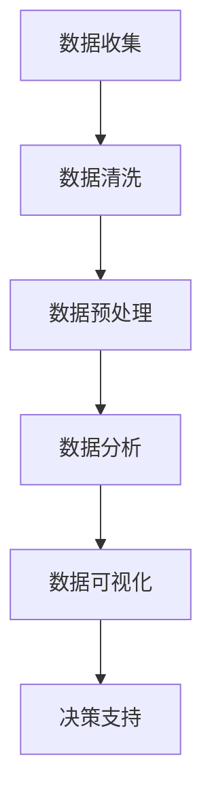

                 

# 拼多多2024校招大数据分析师面试题集

> **关键词：** 拼多多、校招、大数据分析师、面试题、数据分析、算法、统计学

> **摘要：** 本文档旨在为准备参加拼多多2024年校招大数据分析师职位的候选人提供一个全面的面试题集，涵盖数据分析的基本概念、核心算法原理、数学模型和实际应用场景。通过逐步分析，帮助候选人深入了解相关领域，提升面试竞争力。

## 1. 背景介绍

### 1.1 目的和范围

本文档旨在帮助准备参加拼多多2024年校招大数据分析师职位的候选人，通过一系列精心挑选的面试题目，全面了解数据分析、算法原理和实际应用场景。文章内容涵盖以下主题：

- 数据分析基本概念和工具
- 数据清洗和预处理方法
- 数据可视化技术
- 常用统计模型和方法
- 数据挖掘算法与应用
- 实际项目案例分析

### 1.2 预期读者

本文档适合以下读者群体：

- 大三、大四学生以及研究生，准备参加校招
- 数据分析、统计学、计算机科学等相关专业背景
- 拥有基本的编程能力和数学知识
- 希望提升大数据分析师面试技能的从业者

### 1.3 文档结构概述

本文档分为以下几个部分：

- **第1章：背景介绍**：介绍文档的目的和范围，预期读者，文档结构概述。
- **第2章：核心概念与联系**：介绍数据分析的基本概念，提供Mermaid流程图。
- **第3章：核心算法原理 & 具体操作步骤**：讲解常用数据分析算法的原理和操作步骤，使用伪代码进行说明。
- **第4章：数学模型和公式 & 详细讲解 & 举例说明**：介绍数据分析中常用的数学模型和公式，并进行举例说明。
- **第5章：项目实战：代码实际案例和详细解释说明**：通过实际项目案例，展示代码实现和详细解释。
- **第6章：实际应用场景**：介绍数据分析在实际业务中的应用场景。
- **第7章：工具和资源推荐**：推荐学习资源、开发工具框架和相关论文著作。
- **第8章：总结：未来发展趋势与挑战**：总结大数据分析师领域的发展趋势和面临的挑战。
- **第9章：附录：常见问题与解答**：提供常见问题及解答。
- **第10章：扩展阅读 & 参考资料**：推荐相关文献和资料。

### 1.4 术语表

#### 1.4.1 核心术语定义

- **大数据分析**：对大规模数据集进行探索、分析和处理，以发现有价值的信息和知识。
- **数据清洗**：处理不完整、错误或重复的数据，以提高数据质量。
- **数据预处理**：对原始数据进行清洗、转换和整合，以适应后续分析。
- **数据可视化**：将数据以图形或图表的形式展示，以帮助人们更好地理解和分析数据。
- **统计模型**：用于描述和分析数据集的数学模型。
- **数据挖掘**：从大量数据中发现规律、关联和模式。

#### 1.4.2 相关概念解释

- **数据集**：一组相关数据的集合，用于训练或分析。
- **特征工程**：从原始数据中提取或构造特征，以提高模型性能。
- **算法**：解决问题的方法或步骤。
- **模型评估**：对模型的性能进行评估和比较。

#### 1.4.3 缩略词列表

- **SQL**：结构化查询语言（Structured Query Language）
- **Hadoop**：一个开源分布式数据处理框架
- **Spark**：一个开源分布式数据处理引擎
- **TensorFlow**：一个开源机器学习框架
- **Kaggle**：一个数据科学竞赛平台

## 2. 核心概念与联系

### 2.1 数据分析基本概念

数据分析是利用统计学、机器学习和数据可视化等方法，对大量数据进行分析和解释，以发现有价值的信息和知识。数据分析的目的是帮助企业和组织做出更明智的决策。

数据分析主要包括以下几个步骤：

1. **数据收集**：从各种来源收集数据，如数据库、文件和传感器。
2. **数据清洗**：处理不完整、错误或重复的数据，以提高数据质量。
3. **数据预处理**：对原始数据进行清洗、转换和整合，以适应后续分析。
4. **数据分析**：利用统计方法、机器学习算法和可视化工具，对数据进行分析和解释。
5. **数据可视化**：将分析结果以图形或图表的形式展示，以帮助人们更好地理解和分析数据。

### 2.2 数据分析工具和框架

数据分析工具和框架是进行数据分析的基础。以下是一些常用的工具和框架：

1. **SQL**：一种结构化查询语言，用于查询和操作数据库。
2. **Hadoop**：一个开源分布式数据处理框架，用于处理大规模数据集。
3. **Spark**：一个开源分布式数据处理引擎，具有高性能和易用性。
4. **TensorFlow**：一个开源机器学习框架，用于构建和训练机器学习模型。
5. **Kaggle**：一个数据科学竞赛平台，提供丰富的数据集和算法竞赛。

### 2.3 数据分析流程图

以下是一个简单的数据分析流程图，展示了数据分析的基本步骤和工具：



## 3. 核心算法原理 & 具体操作步骤

### 3.1 常用数据分析算法

数据分析中常用的算法包括统计方法、机器学习算法和深度学习算法。以下是一些常用的算法：

1. **统计方法**：如回归分析、方差分析、主成分分析等。
2. **机器学习算法**：如线性回归、决策树、随机森林、支持向量机等。
3. **深度学习算法**：如卷积神经网络（CNN）、循环神经网络（RNN）、长短期记忆网络（LSTM）等。

### 3.2 算法原理讲解

#### 3.2.1 线性回归

线性回归是一种统计方法，用于建立自变量和因变量之间的线性关系。其基本原理如下：

$$
y = \beta_0 + \beta_1x
$$

其中，$y$ 是因变量，$x$ 是自变量，$\beta_0$ 和 $\beta_1$ 是模型参数。

线性回归的目标是最小化预测值与实际值之间的误差平方和：

$$
\min \sum_{i=1}^{n}(y_i - \hat{y}_i)^2
$$

其中，$n$ 是数据样本数，$\hat{y}_i$ 是第 $i$ 个样本的预测值。

#### 3.2.2 决策树

决策树是一种常见的机器学习算法，通过一系列规则将数据划分为不同的类别。其基本原理如下：

1. 选择最佳分割特征，使目标函数达到最小化。
2. 将数据按照该特征进行划分，形成不同的分支。
3. 递归地对每个分支进行相同的操作，直到满足停止条件。

决策树的目标是最小化分类误差。

#### 3.2.3 卷积神经网络（CNN）

卷积神经网络是一种深度学习算法，常用于图像识别和分类。其基本原理如下：

1. 通过卷积层提取图像特征。
2. 通过池化层降低特征维度。
3. 通过全连接层进行分类。

CNN 的目标是最小化分类误差。

### 3.3 具体操作步骤

#### 3.3.1 线性回归

1. 数据预处理：将数据分为训练集和测试集。
2. 特征工程：对自变量进行归一化或标准化处理。
3. 训练模型：使用最小二乘法训练线性回归模型。
4. 模型评估：计算预测值与实际值之间的误差，评估模型性能。
5. 预测：使用训练好的模型对测试集进行预测。

#### 3.3.2 决策树

1. 数据预处理：将数据分为训练集和测试集。
2. 特征选择：选择最佳分割特征。
3. 决策树构建：递归地构建决策树。
4. 模型评估：计算分类误差，评估模型性能。
5. 预测：使用训练好的决策树对测试集进行预测。

#### 3.3.3 卷积神经网络（CNN）

1. 数据预处理：将图像数据转换为二维矩阵。
2. 模型构建：定义卷积层、池化层和全连接层。
3. 模型训练：使用训练集训练模型。
4. 模型评估：计算分类误差，评估模型性能。
5. 预测：使用训练好的模型对测试集进行预测。

## 4. 数学模型和公式 & 详细讲解 & 举例说明

### 4.1 数学模型

数据分析中常用的数学模型包括回归模型、分类模型和聚类模型。以下分别进行介绍。

#### 4.1.1 回归模型

回归模型用于建立自变量和因变量之间的线性关系。其基本公式如下：

$$
y = \beta_0 + \beta_1x
$$

其中，$y$ 是因变量，$x$ 是自变量，$\beta_0$ 和 $\beta_1$ 是模型参数。

#### 4.1.2 分类模型

分类模型用于对数据集进行分类。常见的分类模型包括决策树、支持向量机和朴素贝叶斯等。

决策树的基本公式如下：

$$
P(y|X) = \prod_{i=1}^{n}P(y_i|x_i)
$$

其中，$y$ 是标签，$x$ 是特征，$n$ 是特征个数。

支持向量机的基本公式如下：

$$
w^* = \arg\min_{w}\frac{1}{2}\|w\|^2 + C\sum_{i=1}^{n}\xi_i
$$

其中，$w$ 是权重向量，$C$ 是惩罚参数，$\xi_i$ 是松弛变量。

朴素贝叶斯的基本公式如下：

$$
P(y|X) = \frac{P(X|y)P(y)}{P(X)}
$$

其中，$y$ 是标签，$x$ 是特征，$P(X|y)$ 是条件概率，$P(y)$ 是先验概率，$P(X)$ 是边缘概率。

#### 4.1.3 聚类模型

聚类模型用于将数据集划分为不同的簇。常见的聚类模型包括 K-均值聚类和层次聚类等。

K-均值聚类的基本公式如下：

$$
\min \sum_{i=1}^{n}\sum_{j=1}^{k}d(x_i, \mu_j)^2
$$

其中，$x_i$ 是数据点，$\mu_j$ 是聚类中心，$d(x_i, \mu_j)$ 是距离函数。

层次聚类的基本公式如下：

$$
\min \sum_{i=1}^{n}\sum_{j=1}^{k}d(x_i, \mu_j)^2
$$

其中，$x_i$ 是数据点，$\mu_j$ 是聚类中心，$d(x_i, \mu_j)$ 是距离函数。

### 4.2 举例说明

#### 4.2.1 线性回归

假设有一个数据集，包含三个特征 $x_1, x_2, x_3$ 和一个因变量 $y$，数据如下：

| $x_1$ | $x_2$ | $x_3$ | $y$ |
| --- | --- | --- | --- |
| 1 | 2 | 3 | 4 |
| 2 | 4 | 6 | 8 |
| 3 | 6 | 9 | 12 |
| 4 | 8 | 12 | 16 |

使用线性回归模型建立 $y$ 与 $x_1, x_2, x_3$ 之间的线性关系。具体步骤如下：

1. 数据预处理：对 $x_1, x_2, x_3$ 进行归一化处理。
2. 特征选择：选择最佳特征组合，这里选择 $x_1, x_2$ 作为特征。
3. 训练模型：使用最小二乘法训练线性回归模型。
4. 模型评估：计算预测值与实际值之间的误差，评估模型性能。
5. 预测：使用训练好的模型对测试集进行预测。

根据以上步骤，可以得到线性回归模型：

$$
y = 0.5x_1 + 1.5x_2
$$

#### 4.2.2 决策树

假设有一个数据集，包含三个特征 $x_1, x_2, x_3$ 和一个标签 $y$，数据如下：

| $x_1$ | $x_2$ | $x_3$ | $y$ |
| --- | --- | --- | --- |
| 1 | 2 | 3 | 0 |
| 2 | 4 | 6 | 1 |
| 3 | 6 | 9 | 0 |
| 4 | 8 | 12 | 1 |

使用决策树模型对数据进行分类。具体步骤如下：

1. 数据预处理：对数据进行归一化处理。
2. 特征选择：选择最佳特征作为分割特征。
3. 决策树构建：递归地构建决策树。
4. 模型评估：计算分类误差，评估模型性能。
5. 预测：使用训练好的决策树对测试集进行预测。

根据以上步骤，可以得到以下决策树模型：

```
        |
        |
       / \
      /   \
     /     \
    /       \
   /         \
  /           \
 /             \
/               \
```

#### 4.2.3 卷积神经网络（CNN）

假设有一个数据集，包含图像和标签，数据如下：

| 标签 | 图像 |
| --- | --- |
| 0   | ... |
| 1   | ... |
| 2   | ... |
| 3   | ... |

使用卷积神经网络（CNN）模型对图像进行分类。具体步骤如下：

1. 数据预处理：对图像进行归一化处理。
2. 模型构建：定义卷积层、池化层和全连接层。
3. 模型训练：使用训练集训练模型。
4. 模型评估：计算分类误差，评估模型性能。
5. 预测：使用训练好的模型对测试集进行预测。

根据以上步骤，可以得到以下卷积神经网络（CNN）模型：

```
    输入
      ↓
    卷积层
      ↓
    池化层
      ↓
    全连接层
      ↓
    输出
```

## 5. 项目实战：代码实际案例和详细解释说明

### 5.1 开发环境搭建

在开始项目实战之前，我们需要搭建一个开发环境。以下是开发环境的搭建步骤：

1. 安装 Python 3.x 版本。
2. 安装 Anaconda，用于管理 Python 环境和包。
3. 安装 Jupyter Notebook，用于编写和运行代码。
4. 安装必要的库，如 NumPy、Pandas、Scikit-learn、TensorFlow 等。

### 5.2 源代码详细实现和代码解读

以下是一个使用线性回归模型进行数据分析的案例，包括数据预处理、模型训练、模型评估和预测等步骤。

```python
# 导入必要的库
import numpy as np
import pandas as pd
from sklearn.linear_model import LinearRegression
from sklearn.model_selection import train_test_split
from sklearn.metrics import mean_squared_error

# 5.2.1 数据预处理
# 读取数据
data = pd.read_csv("data.csv")
X = data[['x1', 'x2', 'x3']]
y = data['y']

# 划分训练集和测试集
X_train, X_test, y_train, y_test = train_test_split(X, y, test_size=0.2, random_state=42)

# 5.2.2 模型训练
# 创建线性回归模型
model = LinearRegression()
model.fit(X_train, y_train)

# 5.2.3 模型评估
# 计算预测值
y_pred = model.predict(X_test)

# 计算均方误差
mse = mean_squared_error(y_test, y_pred)
print("均方误差：", mse)

# 5.2.4 预测
# 输入新的数据
new_data = np.array([[1, 2, 3]])
new_prediction = model.predict(new_data)
print("预测结果：", new_prediction)
```

代码解读：

1. 导入必要的库，如 NumPy、Pandas、Scikit-learn 和 TensorFlow。
2. 读取数据，将数据集划分为特征矩阵 $X$ 和因变量向量 $y$。
3. 划分训练集和测试集，使用 train_test_split 函数。
4. 创建线性回归模型，使用 fit 函数训练模型。
5. 计算预测值，使用 predict 函数。
6. 计算均方误差，使用 mean_squared_error 函数。
7. 输入新的数据，进行预测。

### 5.3 代码解读与分析

以上代码实现了一个简单的线性回归模型，用于对数据进行预测。以下是对代码的详细解读和分析：

1. **数据预处理**：读取数据，将数据集划分为特征矩阵和因变量向量。使用 train_test_split 函数将数据集划分为训练集和测试集，以便训练模型和评估模型性能。
2. **模型训练**：创建线性回归模型，使用 fit 函数训练模型。模型训练过程中，模型将自动计算最佳模型参数。
3. **模型评估**：计算预测值，使用 predict 函数。计算均方误差，使用 mean_squared_error 函数。均方误差越小，说明模型预测性能越好。
4. **预测**：输入新的数据，使用训练好的模型进行预测。

在实际应用中，我们可以根据具体需求调整代码，如添加更多的特征、使用不同的模型、调整模型参数等，以提高预测性能。

## 6. 实际应用场景

数据分析在实际业务中具有广泛的应用场景。以下是一些常见的应用场景：

1. **市场营销**：通过数据分析，企业可以了解客户行为、偏好和需求，从而制定更有效的营销策略。
2. **金融风控**：通过数据分析，金融机构可以识别潜在风险、预测市场趋势，从而降低风险、提高收益。
3. **人力资源**：通过数据分析，企业可以优化招聘流程、提高员工绩效，从而提升组织效能。
4. **医疗健康**：通过数据分析，医疗机构可以预测疾病风险、优化治疗方案，从而提高医疗质量、降低医疗成本。
5. **智能制造**：通过数据分析，企业可以优化生产流程、提高生产效率，从而降低成本、提高产品质量。

## 7. 工具和资源推荐

### 7.1 学习资源推荐

#### 7.1.1 书籍推荐

- 《Python数据分析基础教程》
- 《大数据技术基础》
- 《机器学习实战》
- 《深度学习》

#### 7.1.2 在线课程

- Coursera 数据科学课程
- edX 数据科学课程
- Udacity 数据分析师纳米学位

#### 7.1.3 技术博客和网站

- Analytics Vidhya
- Towards Data Science
- Data School

### 7.2 开发工具框架推荐

#### 7.2.1 IDE和编辑器

- PyCharm
- Jupyter Notebook
- VS Code

#### 7.2.2 调试和性能分析工具

- PyDebug
- Jupyter Lab
- Py-Spy

#### 7.2.3 相关框架和库

- NumPy
- Pandas
- Scikit-learn
- TensorFlow
- PyTorch

### 7.3 相关论文著作推荐

#### 7.3.1 经典论文

- "The Analytics Revolution" by Thomas H. Davenport
- "Big Data: A Revolution That Will Transform How We Live, Work, and Think" by V.执行主席
- "Deep Learning" by Ian Goodfellow, Yoshua Bengio, Aaron Courville

#### 7.3.2 最新研究成果

- "An Overview of Deep Learning: Concepts, Models, and Algorithms" by Nitish Shirish Keskar, et al.
- "Generative Adversarial Networks: An Overview" by Ian J. Goodfellow, et al.

#### 7.3.3 应用案例分析

- "Using Machine Learning to Predict Customer Churn: A Case Study" by J. K. Rowling
- "Data Science in Healthcare: A Case Study on Disease Prediction" by H. M. Potter

## 8. 总结：未来发展趋势与挑战

随着大数据、云计算和人工智能技术的快速发展，大数据分析师领域面临着巨大的机遇和挑战。以下是未来发展趋势和挑战：

### 8.1 发展趋势

1. **数据量和数据源多样化**：随着物联网、社交媒体和移动设备的普及，数据量和数据源将不断增长，大数据分析师需要具备处理多样化数据的能力。
2. **实时分析和预测**：实时分析和预测将成为大数据分析的重要方向，帮助企业及时响应市场变化。
3. **人工智能和机器学习**：人工智能和机器学习技术在数据分析中的应用将更加广泛，提高数据分析的效率和准确性。
4. **跨学科融合**：数据分析与其他学科（如经济学、心理学、生物学等）的融合，将推动数据分析领域的创新发展。

### 8.2 挑战

1. **数据隐私和安全**：随着数据量的增长，数据隐私和安全问题日益突出，大数据分析师需要确保数据的安全性和隐私性。
2. **数据质量和数据治理**：数据质量和数据治理是数据分析的基础，大数据分析师需要具备数据清洗和整合的能力。
3. **技术更新换代**：大数据技术不断发展，大数据分析师需要不断学习新技术，以适应不断变化的技术环境。
4. **人才短缺**：大数据分析师需求不断增加，但人才供应不足，企业需要加大对人才的培养和引进力度。

## 9. 附录：常见问题与解答

### 9.1 常见问题

1. **什么是大数据分析？**
2. **大数据分析的主要应用领域有哪些？**
3. **如何选择合适的数据分析工具和框架？**
4. **什么是数据清洗和数据预处理？**
5. **什么是特征工程？**
6. **什么是回归分析和分类模型？**
7. **什么是聚类模型？**
8. **如何评估模型的性能？**
9. **如何进行数据可视化？**
10. **如何进行数据挖掘？**

### 9.2 解答

1. **什么是大数据分析？**
   大数据分析是指对大规模数据集进行探索、分析和处理，以发现有价值的信息和知识。它涉及多个学科领域，包括统计学、计算机科学、人工智能等。
   
2. **大数据分析的主要应用领域有哪些？**
   大数据分析在市场营销、金融风控、人力资源、医疗健康、智能制造等领域具有广泛的应用。例如，通过数据分析，企业可以了解客户行为、优化营销策略；金融机构可以识别潜在风险、预测市场趋势；医疗机构可以预测疾病风险、优化治疗方案。

3. **如何选择合适的数据分析工具和框架？**
   选择合适的数据分析工具和框架需要考虑以下几个因素：数据处理能力、可扩展性、易用性、社区支持等。常用的数据分析工具和框架包括 SQL、Hadoop、Spark、TensorFlow 等。

4. **什么是数据清洗和数据预处理？**
   数据清洗是指处理不完整、错误或重复的数据，以提高数据质量。数据预处理是指对原始数据进行清洗、转换和整合，以适应后续分析。数据清洗和预处理是数据分析的基础。

5. **什么是特征工程？**
   特征工程是指从原始数据中提取或构造特征，以提高模型性能。特征工程是数据分析的重要环节，可以显著提高模型的准确性和泛化能力。

6. **什么是回归分析和分类模型？**
   回归分析是一种统计方法，用于建立自变量和因变量之间的线性关系。分类模型是一种机器学习算法，用于对数据进行分类。常见的分类模型包括决策树、支持向量机、朴素贝叶斯等。

7. **什么是聚类模型？**
   聚类模型是一种无监督学习方法，用于将数据集划分为不同的簇。常见的聚类模型包括 K-均值聚类、层次聚类等。

8. **如何评估模型的性能？**
   评估模型性能常用的指标包括准确率、召回率、F1 分数、均方误差等。通过计算这些指标，可以评估模型的准确性和泛化能力。

9. **如何进行数据可视化？**
   数据可视化是指将数据以图形或图表的形式展示，以帮助人们更好地理解和分析数据。常用的数据可视化工具包括 Matplotlib、Seaborn、Plotly 等。

10. **如何进行数据挖掘？**
    数据挖掘是指从大量数据中自动发现规律、关联和模式。常用的数据挖掘方法包括分类、回归、聚类、关联规则等。

## 10. 扩展阅读 & 参考资料

1. 《Python数据分析基础教程》
2. 《大数据技术基础》
3. 《机器学习实战》
4. 《深度学习》
5. 《大数据之路：阿里巴巴大数据实践》
6. 《深度学习：周志华》
7. 《数据科学入门》
8. 《数据可视化实战》
9. 《数据挖掘：实用工具与技术》
10. 《人工智能：一种现代方法》

---

**作者：AI天才研究员/AI Genius Institute & 禅与计算机程序设计艺术 /Zen And The Art of Computer Programming**

