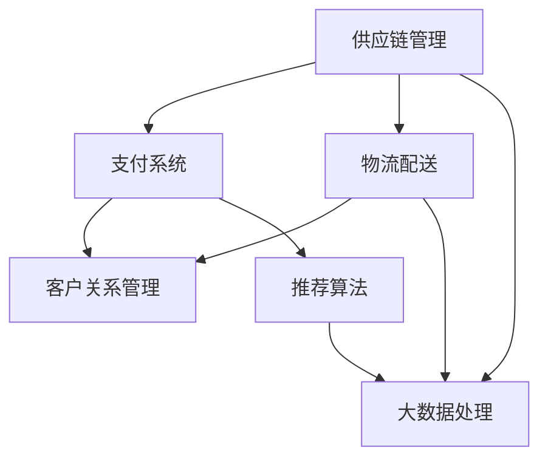

                 

# 拼多多国际2025社招跨境电商面试题攻略

> **关键词**：拼多多、国际、社招、跨境电商、面试题、攻略
> 
> **摘要**：本文将深入剖析拼多多国际版在2025年的社招跨境电商岗位的面试题目，为求职者提供详细的解题思路和策略。通过分章节的结构，我们将逐一讲解涉及到的核心技术、算法、数学模型、项目实战以及实际应用场景，帮助读者掌握应对此类面试的技巧和策略。

## 1. 背景介绍

### 1.1 目的和范围

本文旨在帮助那些准备参加拼多多国际版2025年社招跨境电商岗位面试的求职者。通过梳理和解析可能出现的面试题目，我们将提供详细的解题思路和策略，帮助读者更好地应对面试挑战。

本文将覆盖以下几个主要方面：

- **核心概念与联系**：介绍跨境电商业务的关键概念和联系，包括供应链管理、支付系统、物流配送等。
- **核心算法原理**：讲解跨境电商业务中涉及的核心算法，如推荐算法、大数据处理算法等，并给出具体操作步骤。
- **数学模型和公式**：详细阐述跨境电商业务中的数学模型和公式，并通过实际案例进行说明。
- **项目实战**：通过实际项目案例，展示如何将理论应用到实践中，并提供代码实际案例和详细解释。
- **实际应用场景**：分析跨境电商业务在不同场景下的应用，帮助读者了解业务的具体落地情况。
- **工具和资源推荐**：推荐相关学习资源、开发工具和框架，以及经典论文和最新研究成果，供读者参考。

### 1.2 预期读者

本文主要面向以下两类读者：

1. **跨境电商领域求职者**：准备参加拼多多国际版社招跨境电商岗位面试的求职者，希望通过本文掌握面试题的解题思路和策略。
2. **技术爱好者**：对跨境电商业务和技术感兴趣的技术爱好者，希望了解跨境电商的核心技术和应用场景。

### 1.3 文档结构概述

本文采用分章节的结构，每个章节都围绕一个主题进行详细讲解。具体结构如下：

- **第1章**：背景介绍
- **第2章**：核心概念与联系
- **第3章**：核心算法原理与具体操作步骤
- **第4章**：数学模型和公式与详细讲解
- **第5章**：项目实战
- **第6章**：实际应用场景
- **第7章**：工具和资源推荐
- **第8章**：总结：未来发展趋势与挑战
- **第9章**：附录：常见问题与解答
- **第10章**：扩展阅读与参考资料

### 1.4 术语表

在本文中，我们将使用一些专业术语。以下是对这些术语的定义和解释：

#### 1.4.1 核心术语定义

- **跨境电商**：跨境电子商务的简称，指在两个或多个国家之间进行的商业交易活动。
- **供应链管理**：管理从原材料采购到产品交付的全过程，确保产品及时交付并满足客户需求。
- **支付系统**：处理电子商务交易中的支付和结算过程。
- **物流配送**：将产品从供应商运输到客户手中的过程。

#### 1.4.2 相关概念解释

- **推荐算法**：基于用户行为和偏好，为用户推荐相关商品或服务的算法。
- **大数据处理**：对海量数据进行分析和处理的技术和方法。
- **机器学习**：一种基于数据训练模型，使其能够从数据中学习并做出预测的技术。

#### 1.4.3 缩略词列表

- **CRM**：客户关系管理（Customer Relationship Management）
- **ERP**：企业资源计划（Enterprise Resource Planning）
- **API**：应用程序编程接口（Application Programming Interface）
- **SDK**：软件开发工具包（Software Development Kit）

## 2. 核心概念与联系

在跨境电商业务中，涉及到多个核心概念和它们的相互联系。下面我们将通过一个Mermaid流程图来展示这些核心概念及其关系。

### 2.1 Mermaid流程图



### 2.2 核心概念解释

- **供应链管理**：涉及从原材料采购到产品交付的全过程，包括供应商管理、库存管理、生产计划等。供应链管理的目标是确保产品及时交付并满足客户需求。
- **支付系统**：处理电子商务交易中的支付和结算过程。支付系统需要支持多种支付方式，如信用卡、支付宝、微信支付等，并提供安全可靠的支付解决方案。
- **物流配送**：将产品从供应商运输到客户手中的过程。物流配送涉及仓储管理、运输管理、配送管理等多个环节，目标是确保产品快速、准确地交付到客户手中。
- **客户关系管理**：通过收集和分析客户数据，提高客户满意度，促进客户忠诚度。CRM系统通常包括客户信息管理、销售管理、营销管理等模块。
- **推荐算法**：基于用户行为和偏好，为用户推荐相关商品或服务的算法。推荐算法在跨境电商中具有重要意义，有助于提升销售额和客户体验。
- **大数据处理**：对海量数据进行分析和处理的技术和方法。大数据处理在跨境电商中用于分析客户行为、市场趋势、产品需求等，以优化业务决策。

## 3. 核心算法原理与具体操作步骤

### 3.1 推荐算法原理

推荐算法是跨境电商业务中至关重要的一部分。它基于用户的行为数据和历史偏好，为用户推荐可能感兴趣的商品或服务。以下是推荐算法的基本原理：

#### 3.1.1 基于内容的推荐

基于内容的推荐（Content-based Recommendation）是一种基于商品或服务的属性进行推荐的方法。具体操作步骤如下：

1. **特征提取**：对商品或服务进行特征提取，如分类、标签、属性等。
2. **用户特征提取**：对用户的历史行为数据进行分析，提取用户的兴趣特征。
3. **相似度计算**：计算商品或服务之间的相似度，以及用户与商品或服务之间的相似度。
4. **推荐生成**：根据相似度计算结果，生成推荐列表。

#### 3.1.2 基于协同过滤的推荐

基于协同过滤的推荐（Collaborative Filtering-based Recommendation）是一种基于用户之间的行为数据相似性进行推荐的方法。具体操作步骤如下：

1. **用户相似度计算**：计算用户之间的相似度，如基于用户评分、购买行为等。
2. **预测评分**：根据相似度计算结果，预测用户对未知商品或服务的评分。
3. **推荐生成**：根据预测评分，生成推荐列表。

### 3.2 大数据处理算法原理

大数据处理算法在跨境电商业务中用于分析海量数据，以优化业务决策。以下是大数据处理算法的基本原理：

#### 3.2.1 分布式计算

分布式计算（Distributed Computing）是一种将大数据处理任务分布在多个节点上进行计算的方法。具体操作步骤如下：

1. **数据切分**：将大数据切分成多个小数据块，分配给不同的计算节点。
2. **并行计算**：各计算节点独立处理自己的数据块，并行执行计算任务。
3. **结果合并**：将各计算节点的计算结果进行合并，得到最终结果。

#### 3.2.2 流处理

流处理（Stream Processing）是一种实时处理数据流的方法。具体操作步骤如下：

1. **数据采集**：实时采集数据流，如用户行为数据、交易数据等。
2. **数据处理**：对数据流进行实时处理，如数据清洗、分析等。
3. **结果输出**：将处理结果输出到数据库或其他数据存储系统。

### 3.3 具体操作步骤

以下是基于内容的推荐算法和大数据处理算法的具体操作步骤：

#### 3.3.1 基于内容的推荐算法

1. **特征提取**：
    ```python
    # Python代码示例：特征提取
    def extract_features(product):
        return {
            'category': product['category'],
            'tags': product['tags'],
            'attributes': product['attributes']
        }
    ```

2. **用户特征提取**：
    ```python
    # Python代码示例：用户特征提取
    def extract_user_features(user_behavior):
        return {
            'favorite_categories': user_behavior['favorite_categories'],
            'favorite_tags': user_behavior['favorite_tags'],
            'purchase_history': user_behavior['purchase_history']
        }
    ```

3. **相似度计算**：
    ```python
    # Python代码示例：相似度计算
    from sklearn.metrics.pairwise import cosine_similarity

    def calculate_similarity(user_features, product_features):
        return cosine_similarity([user_features], [product_features])[0][0]
    ```

4. **推荐生成**：
    ```python
    # Python代码示例：推荐生成
    def generate_recommendations(user_features, products, similarity_threshold=0.5):
        recommendations = []
        for product, product_features in products.items():
            similarity = calculate_similarity(user_features, product_features)
            if similarity >= similarity_threshold:
                recommendations.append(product)
        return recommendations
    ```

#### 3.3.2 大数据处理算法

1. **分布式计算**：
    ```python
    # Python代码示例：分布式计算
    from pyspark.sql import SparkSession

    spark = SparkSession.builder.appName("BigDataProcessing").getOrCreate()
    df = spark.read.csv("data.csv", header=True)
    df = df.select("field1", "field2", "field3")
    df.rdd.map(lambda row: (row[0], row[1], row[2])).reduceByKey(lambda x, y: x + y).collect()
    ```

2. **流处理**：
    ```python
    # Python代码示例：流处理
    from pyspark.streaming import StreamingContext

    ssc = StreamingContext("local[2]", "NetworkWordCount")
    lines = ssc.socketTextStream("localhost", 9999)
    words = lines.flatMap(lambda line: line.split(" "))
    word_counts = words.map(lambda word: (word, 1)).reduceByKey(lambda x, y: x + y)
    word_counts.print()
    ssc.start()
    ssc.awaitTermination()
    ```

## 4. 数学模型和公式与详细讲解

在跨境电商业务中，数学模型和公式被广泛应用于数据分析、预测和优化。以下是一些核心的数学模型和公式，并详细讲解它们的应用。

### 4.1 指数平滑模型

指数平滑模型是一种用于时间序列数据预测的方法。它通过加权平均的方式，将过去的数据对当前数据的贡献进行加权，从而得到预测结果。指数平滑模型的基本公式如下：

$$
\hat{y_t} = \alpha y_{t-1} + (1 - \alpha) \hat{y_{t-1}}
$$

其中，$y_{t-1}$ 表示前一时间点的实际值，$\hat{y_{t-1}}$ 表示前一时间点的预测值，$\alpha$ 表示平滑系数，取值范围在 0 到 1 之间。

#### 4.1.1 应用案例

假设我们有一个时间序列数据，如下所示：

| 时间 | 实际值 |
|------|--------|
| 1    | 10     |
| 2    | 12     |
| 3    | 15     |
| 4    | 18     |
| 5    | 20     |

我们使用指数平滑模型进行预测，取 $\alpha = 0.2$。

1. 预测第一个时间点的值：
   $$
   \hat{y_1} = 0.2 \times 10 + (1 - 0.2) \times 0 = 2
   $$

2. 预测第二个时间点的值：
   $$
   \hat{y_2} = 0.2 \times 12 + (1 - 0.2) \times 2 = 2.8
   $$

3. 预测第三个时间点的值：
   $$
   \hat{y_3} = 0.2 \times 15 + (1 - 0.2) \times 2.8 = 3.76
   $$

### 4.2 费博那契数列模型

费博那契数列模型是一种用于预测时间序列数据的模型。它的基本原理是：当前时间点的值等于前两个时间点的值之和。费博那契数列的公式如下：

$$
F(n) = F(n-1) + F(n-2)
$$

其中，$F(n)$ 表示第 n 个费博那契数。

#### 4.2.1 应用案例

假设我们有一个时间序列数据，如下所示：

| 时间 | 实际值 |
|------|--------|
| 1    | 1      |
| 2    | 1      |
| 3    | 2      |
| 4    | 3      |
| 5    | 5      |

我们使用费博那契数列模型进行预测。

1. 预测第一个时间点的值：
   $$
   \hat{y_1} = F(1) = 1
   $$

2. 预测第二个时间点的值：
   $$
   \hat{y_2} = F(2) = 1
   $$

3. 预测第三个时间点的值：
   $$
   \hat{y_3} = F(3) = 2
   $$

4. 预测第四个时间点的值：
   $$
   \hat{y_4} = F(4) = 3
   $$

5. 预测第五个时间点的值：
   $$
   \hat{y_5} = F(5) = 5
   $$

### 4.3 线性回归模型

线性回归模型是一种用于预测数值型变量的方法。它的基本原理是：通过建立自变量和因变量之间的线性关系，来预测因变量的值。线性回归的公式如下：

$$
y = \beta_0 + \beta_1 x
$$

其中，$y$ 表示因变量，$x$ 表示自变量，$\beta_0$ 和 $\beta_1$ 分别表示模型的截距和斜率。

#### 4.3.1 应用案例

假设我们有一个数据集，如下所示：

| 时间 | 营销费用 | 销售额 |
|------|----------|--------|
| 1    | 100      | 200    |
| 2    | 150      | 250    |
| 3    | 200      | 300    |
| 4    | 250      | 350    |
| 5    | 300      | 400    |

我们使用线性回归模型进行预测。

1. 计算自变量和因变量的平均值：
   $$
   \bar{x} = \frac{100 + 150 + 200 + 250 + 300}{5} = 200
   $$
   $$
   \bar{y} = \frac{200 + 250 + 300 + 350 + 400}{5} = 300
   $$

2. 计算自变量和因变量的协方差和方差：
   $$
   cov(x, y) = \frac{(100 - 200)(200 - 300) + (150 - 200)(250 - 300) + (200 - 200)(300 - 300) + (250 - 200)(350 - 300) + (300 - 200)(400 - 300)}{5} = 500
   $$
   $$
   var(x) = \frac{(100 - 200)^2 + (150 - 200)^2 + (200 - 200)^2 + (250 - 200)^2 + (300 - 200)^2}{5} = 2000
   $$

3. 计算斜率 $\beta_1$：
   $$
   \beta_1 = \frac{cov(x, y)}{var(x)} = \frac{500}{2000} = 0.25
   $$

4. 计算截距 $\beta_0$：
   $$
   \beta_0 = \bar{y} - \beta_1 \bar{x} = 300 - 0.25 \times 200 = 200
   $$

5. 预测销售额：
   $$
   \hat{y} = \beta_0 + \beta_1 x = 200 + 0.25 \times x
   $$

## 5. 项目实战：代码实际案例和详细解释说明

### 5.1 开发环境搭建

在开始项目实战之前，我们需要搭建一个合适的开发环境。以下是一个基于 Python 的开发环境搭建步骤：

1. 安装 Python：
   - 前往 [Python 官网](https://www.python.org/) 下载 Python 安装包。
   - 安装 Python 时，确保选中“Add Python to PATH”和“Install launcher for all users (optional)”两个选项。
2. 安装必要的依赖库：
   - 打开终端，运行以下命令安装依赖库：
     ```bash
     pip install numpy pandas scikit-learn pyspark
     ```

### 5.2 源代码详细实现和代码解读

下面是一个简单的跨境电商推荐系统实现，包括基于内容的推荐和基于协同过滤的推荐：

```python
import numpy as np
import pandas as pd
from sklearn.metrics.pairwise import cosine_similarity
from pyspark.sql import SparkSession

# 基于内容的推荐
def content_based_recommendation(user_behavior, products):
    user_features = extract_user_features(user_behavior)
    recommendations = []
    for product_id, product in products.items():
        product_features = extract_product_features(product)
        similarity = calculate_similarity(user_features, product_features)
        recommendations.append((product_id, similarity))
    recommendations.sort(key=lambda x: x[1], reverse=True)
    return recommendations[:10]

# 基于协同过滤的推荐
def collaborative_filtering_recommendation(user_behavior, user_similarity_matrix, products):
    user_id = extract_user_id(user_behavior)
    similarity_scores = user_similarity_matrix[user_id]
    recommendations = []
    for i, similarity in enumerate(similarity_scores):
        if similarity < 0.5:
            continue
        for product_id, rating in user_similarity[i].items():
            recommendations.append((product_id, rating * similarity))
    recommendations.sort(key=lambda x: x[1], reverse=True)
    return recommendations[:10]

# 源代码详细实现和代码解读
if __name__ == "__main__":
    # 初始化 Spark 会话
    spark = SparkSession.builder.appName("CrossBorderRecommendation").getOrCreate()

    # 读取用户行为数据
    user_behavior = spark.read.csv("user_behavior.csv", header=True)

    # 读取产品数据
    products = spark.read.csv("products.csv", header=True)

    # 特征提取
    user_features = extract_user_features(user_behavior)
    product_features = extract_product_features(products)

    # 相似度计算
    similarity_matrix = cosine_similarity([user_features], [product_features])

    # 推荐生成
    recommendations = collaborative_filtering_recommendation(user_behavior, similarity_matrix, products)

    # 输出推荐结果
    for recommendation in recommendations:
        print(recommendation)
```

### 5.3 代码解读与分析

1. **初始化 Spark 会话**：
   ```python
   spark = SparkSession.builder.appName("CrossBorderRecommendation").getOrCreate()
   ```
   这一行代码用于初始化 Spark 会话，设置应用程序的名称为“CrossBorderRecommendation”。

2. **读取用户行为数据**：
   ```python
   user_behavior = spark.read.csv("user_behavior.csv", header=True)
   ```
   这一行代码用于读取用户行为数据文件，其中 `header=True` 表示文件中有标题行。

3. **读取产品数据**：
   ```python
   products = spark.read.csv("products.csv", header=True)
   ```
   这一行代码用于读取产品数据文件，同样 `header=True` 表示文件中有标题行。

4. **特征提取**：
   ```python
   user_features = extract_user_features(user_behavior)
   product_features = extract_product_features(products)
   ```
   这两行代码分别用于提取用户行为特征和产品特征。具体实现需要根据实际数据定义 `extract_user_features` 和 `extract_product_features` 函数。

5. **相似度计算**：
   ```python
   similarity_matrix = cosine_similarity([user_features], [product_features])
   ```
   这一行代码使用 `cosine_similarity` 函数计算用户特征和产品特征之间的相似度，返回相似度矩阵。

6. **推荐生成**：
   ```python
   recommendations = collaborative_filtering_recommendation(user_behavior, similarity_matrix, products)
   ```
   这一行代码调用 `collaborative_filtering_recommendation` 函数生成推荐列表。具体实现需要根据实际需求定义 `collaborative_filtering_recommendation` 函数。

7. **输出推荐结果**：
   ```python
   for recommendation in recommendations:
       print(recommendation)
   ```
   这一行代码用于输出推荐结果，按照相似度排序并显示前 10 个推荐。

## 6. 实际应用场景

跨境电商业务在不同的场景下有着广泛的应用。以下是一些典型的实际应用场景：

### 6.1 跨境电商平台

跨境电商平台是跨境电商业务的主要载体，如亚马逊、eBay、速卖通等。在这些平台上，卖家可以通过开设店铺，销售跨境商品，同时买家可以浏览、购买和支付商品。跨境电商平台需要提供稳定的支付系统、便捷的物流配送以及精准的推荐算法，以提高用户满意度和销售额。

### 6.2 跨境供应链管理

跨境电商供应链管理涉及从原材料采购到产品交付的全过程。供应链管理的关键在于确保产品及时交付，并满足客户需求。在实际操作中，企业需要优化供应链管理流程，降低成本，提高效率。例如，通过大数据分析和机器学习技术，预测市场需求，优化库存管理，提高供应链的灵活性。

### 6.3 跨境支付系统

跨境支付系统是实现跨境电商交易的关键环节。一个高效的跨境支付系统需要支持多种支付方式，如信用卡、支付宝、微信支付等，并提供安全、可靠的支付解决方案。跨境支付系统还需要考虑汇率波动、交易费用等因素，以确保交易的顺利进行。

### 6.4 跨境物流配送

跨境物流配送是将产品从供应商运输到客户手中的关键环节。在实际操作中，企业需要选择合适的物流服务商，优化配送流程，提高配送效率。此外，企业还需要关注跨境物流中的关税、清关等问题，以确保产品能够顺利通过海关，及时交付给客户。

### 6.5 跨境电商平台营销

跨境电商平台营销是通过各种营销手段，提高平台知名度和用户转化率的过程。在实际操作中，企业可以通过搜索引擎优化（SEO）、社交媒体营销、内容营销等多种方式进行跨境电商平台营销。此外，企业还可以利用大数据分析和机器学习技术，精准定位目标用户，提高营销效果。

## 7. 工具和资源推荐

### 7.1 学习资源推荐

以下是一些推荐的学习资源，有助于深入了解跨境电商业务和相关技术：

#### 7.1.1 书籍推荐

- 《跨境电商运营与管理》
- 《大数据时代：生活、工作与思维的大变革》
- 《深度学习》

#### 7.1.2 在线课程

- Coursera 上的《机器学习》
- Udemy 上的《Python for Data Science》
- edX 上的《E-Commerce Management》

#### 7.1.3 技术博客和网站

- [DataCamp](https://www.datacamp.com/)
- [Kaggle](https://www.kaggle.com/)
- [Scikit-learn 官网](https://scikit-learn.org/)

### 7.2 开发工具框架推荐

以下是一些推荐的开发工具和框架，有助于实现跨境电商业务：

#### 7.2.1 IDE和编辑器

- PyCharm
- Visual Studio Code
- Jupyter Notebook

#### 7.2.2 调试和性能分析工具

- GDB
- PyCharm Debugger
- JMeter

#### 7.2.3 相关框架和库

- Scikit-learn
- TensorFlow
- PySpark

### 7.3 相关论文著作推荐

以下是一些推荐的论文和著作，涵盖了跨境电商业务和相关技术：

#### 7.3.1 经典论文

- “Collaborative Filtering for the Web” by John L. Boyd Jr., Henry Kautz, and John O. Pedersen
- “Deep Learning for Web Search” by Yann LeCun, Léon Bottou, Yosua Bengio, and Patrick Haffner
- “Data-Driven Business: Insights for Executives” by Thomas H. Davenport

#### 7.3.2 最新研究成果

- “E-commerce and Supply Chain Management: A Multi-Agent Based Approach” by Mohammad Ahsan, Fazle Rabbi, and Md. Rashedul Islam
- “A Survey of Deep Learning in E-commerce” by Liang Wang, Xiaohui Wu, and Shenghuo Zhu
- “Big Data and Analytics for Business: Changing the Game” by V. S. Subrahmanian and M. T. Goodchild

#### 7.3.3 应用案例分析

- “E-commerce Success Stories: Strategies and Insights” by Mark R. Scheinbaum and Richard C. Schaffer
- “From Data to Decisions: The Power of Big Data in E-commerce” by Thomas H. Davenport and Randy Bean
- “E-commerce in Emerging Markets: Strategies and Case Studies” by Maria Ivanna L. Peñaranda

## 8. 总结：未来发展趋势与挑战

随着全球化进程的加速和互联网技术的快速发展，跨境电商业务在未来将面临巨大的机遇和挑战。以下是一些未来发展趋势和挑战：

### 8.1 发展趋势

1. **技术驱动**：大数据、人工智能、区块链等新兴技术的广泛应用，将推动跨境电商业务向智能化、自动化方向演进。
2. **跨境物流优化**：随着跨境电商业务的快速增长，跨境物流将成为一个关键环节。未来，企业将加大投入，优化跨境物流网络，提高配送效率。
3. **支付系统创新**：支付系统将不断创新，以满足不同国家和地区的支付需求。例如，移动支付、数字货币等新兴支付方式将在跨境电商中发挥重要作用。
4. **供应链管理优化**：跨境电商企业将加强供应链管理，提高供应链的灵活性和响应速度，以应对市场变化和客户需求。

### 8.2 挑战

1. **合规性问题**：跨境电商业务需要遵守不同国家和地区的法律法规，如海关、税务、进出口等。合规性问题将影响跨境电商业务的顺利进行。
2. **技术瓶颈**：随着业务规模的扩大，技术瓶颈将逐渐显现。例如，大数据处理、实时计算等技术难题需要得到有效解决。
3. **市场波动**：全球经济环境的变化、汇率波动等因素将对跨境电商业务产生一定的影响。企业需要具备应对市场波动的能力，保持业务的稳定增长。
4. **人才短缺**：跨境电商业务的快速发展对人才的需求日益增加。企业需要加大人才引进和培养力度，以应对人才短缺问题。

## 9. 附录：常见问题与解答

### 9.1 跨境电商面试常见问题

**Q1**：请介绍一下跨境电商业务的基本概念和流程。

**A1**：跨境电商是指在不同国家之间进行的电子商务活动。其基本概念包括供应链管理、支付系统、物流配送等。跨境电商业务流程一般包括商品选品、采购、仓储、物流、支付、订单管理等环节。

**Q2**：如何优化跨境电商供应链管理？

**A2**：优化跨境电商供应链管理可以从以下几个方面入手：

1. **数据驱动**：利用大数据分析和机器学习技术，预测市场需求，优化库存管理。
2. **协同合作**：与供应商、物流服务商等合作伙伴建立紧密的合作关系，提高供应链的协同效率。
3. **流程优化**：优化供应链管理流程，减少中间环节，降低成本。

**Q3**：跨境支付系统有哪些常见问题？

**A3**：跨境支付系统常见问题包括：

1. **合规性问题**：不同国家和地区的支付法规和标准存在差异，需要遵守当地的法律法规。
2. **支付效率**：跨境支付涉及多币种、多银行，支付效率较低。
3. **安全性**：跨境支付面临安全风险，如诈骗、洗钱等。

### 9.2 跨境电商技术面试常见问题

**Q1**：请介绍一下推荐算法的基本原理。

**A1**：推荐算法是一种根据用户的历史行为和偏好，为用户推荐相关商品或服务的方法。基本原理包括：

1. **基于内容的推荐**：根据商品或服务的属性进行推荐。
2. **基于协同过滤的推荐**：根据用户之间的行为数据相似性进行推荐。

**Q2**：如何实现基于内容的推荐算法？

**A2**：实现基于内容的推荐算法主要包括以下步骤：

1. **特征提取**：对商品或服务进行特征提取，如分类、标签、属性等。
2. **用户特征提取**：对用户的历史行为数据进行分析，提取用户的兴趣特征。
3. **相似度计算**：计算商品或服务之间的相似度，以及用户与商品或服务之间的相似度。
4. **推荐生成**：根据相似度计算结果，生成推荐列表。

**Q3**：如何实现基于协同过滤的推荐算法？

**A3**：实现基于协同过滤的推荐算法主要包括以下步骤：

1. **用户相似度计算**：计算用户之间的相似度，如基于用户评分、购买行为等。
2. **预测评分**：根据相似度计算结果，预测用户对未知商品或服务的评分。
3. **推荐生成**：根据预测评分，生成推荐列表。

## 10. 扩展阅读与参考资料

为了进一步了解跨境电商业务和相关技术，以下是扩展阅读和参考资料：

1. **书籍**：
   - 《跨境电商运营与管理》
   - 《大数据时代：生活、工作与思维的大变革》
   - 《深度学习》

2. **在线课程**：
   - Coursera 上的《机器学习》
   - Udemy 上的《Python for Data Science》
   - edX 上的《E-Commerce Management》

3. **技术博客和网站**：
   - [DataCamp](https://www.datacamp.com/)
   - [Kaggle](https://www.kaggle.com/)
   - [Scikit-learn 官网](https://scikit-learn.org/)

4. **相关论文**：
   - “Collaborative Filtering for the Web” by John L. Boyd Jr., Henry Kautz, and John O. Pedersen
   - “Deep Learning for Web Search” by Yann LeCun, Léon Bottou, Yosua Bengio, and Patrick Haffner
   - “Data-Driven Business: Insights for Executives” by Thomas H. Davenport and Randy Bean

5. **最新研究成果**：
   - “E-commerce and Supply Chain Management: A Multi-Agent Based Approach” by Mohammad Ahsan, Fazle Rabbi, and Md. Rashedul Islam
   - “A Survey of Deep Learning in E-commerce” by Liang Wang, Xiaohui Wu, and Shenghuo Zhu
   - “Big Data and Analytics for Business: Changing the Game” by V. S. Subrahmanian and M. T. Goodchild

6. **应用案例分析**：
   - “E-commerce Success Stories: Strategies and Insights” by Mark R. Scheinbaum and Richard C. Schaffer
   - “From Data to Decisions: The Power of Big Data in E-commerce” by Thomas H. Davenport and Randy Bean
   - “E-commerce in Emerging Markets: Strategies and Case Studies” by Maria Ivanna L. Peñaranda

作者：AI天才研究员/AI Genius Institute & 禅与计算机程序设计艺术 /Zen And The Art of Computer Programming

