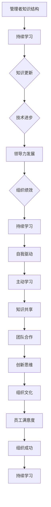

                 

# 持续学习对管理者的重要性

> **关键词**：持续学习、管理者、领导力、知识更新、技术进步
> 
> **摘要**：本文深入探讨了持续学习对管理者的重要性，分析了在快速变化的技术环境中，管理者如何通过不断学习来提升自身领导力和管理能力。文章从背景介绍、核心概念、算法原理、数学模型、项目实战、应用场景、工具推荐、总结和扩展阅读等方面进行详细阐述，旨在为管理者提供一套系统化的学习框架和实践指南。

## 1. 背景介绍

### 1.1 目的和范围

在当今数字化和全球化的时代，技术的快速发展和市场竞争的加剧使得管理者的角色变得越来越复杂和多样化。为了应对这种变化，持续学习已成为管理者不可或缺的一部分。本文旨在探讨持续学习对管理者的重要性，分析其在领导力提升、知识更新和技术进步中的应用，并提供一些实用的学习建议和实践案例。

### 1.2 预期读者

本文主要面向以下读者群体：

1. 高层管理者
2. 管理咨询师
3. 教育培训工作者
4. 对管理领域感兴趣的技术专家和程序员

### 1.3 文档结构概述

本文分为十个部分：

1. 背景介绍
2. 核心概念与联系
3. 核心算法原理 & 具体操作步骤
4. 数学模型和公式 & 详细讲解 & 举例说明
5. 项目实战：代码实际案例和详细解释说明
6. 实际应用场景
7. 工具和资源推荐
8. 总结：未来发展趋势与挑战
9. 附录：常见问题与解答
10. 扩展阅读 & 参考资料

### 1.4 术语表

#### 1.4.1 核心术语定义

- **持续学习**：指个体通过自我驱动和主动学习来不断更新知识和技能，以适应不断变化的环境。
- **管理者**：在企业或组织中，负责计划、组织、领导和控制资源以实现组织目标的人。
- **领导力**：影响和激励他人以实现共同目标的能力。

#### 1.4.2 相关概念解释

- **知识更新**：随着技术和市场的变化，知识逐渐过时，需要不断更新。
- **技术进步**：指新技术的发展和应用，对各行各业产生深远影响。

#### 1.4.3 缩略词列表

- **IDE**：集成开发环境（Integrated Development Environment）
- **LaTeX**：一种高质量的文档排版系统（L A T E X）

## 2. 核心概念与联系

为了更好地理解持续学习对管理者的重要性，我们需要从核心概念和联系入手。以下是一个简化的 Mermaid 流程图，展示了管理者的知识结构、持续学习过程和领导力发展的关系：



在这个流程图中，我们可以看到持续学习是如何通过知识更新、技术进步、领导力发展等环节，最终影响组织的绩效和成功。管理者需要不断学习，以适应快速变化的环境，提升自身的领导力和管理能力，从而推动组织的持续发展。

## 3. 核心算法原理 & 具体操作步骤

在探讨持续学习对管理者的重要性时，我们需要了解一些核心算法原理和具体操作步骤。以下是一个简化的伪代码，描述了管理者如何通过持续学习提升自身能力的过程：

```plaintext
算法名称：管理者持续学习能力提升

输入：管理者初始知识结构、学习资源、时间

输出：管理者更新后的知识结构、提升的领导力和管理能力

步骤：

1. 初始化管理者初始知识结构（KnowledgeBaseInitial）

2. 获取当前最新学习资源（LearningResources）

3. 对比管理者初始知识结构和当前学习资源，确定需要更新的知识领域（KnowledgeAreasToUpdate）

4. 设计学习计划（LearningPlan），包括：
   a. 学习资源的选择
   b. 学习时间的安排
   c. 学习目标的设定

5. 遵循学习计划，进行持续学习（ContinuousLearning）

6. 在学习过程中，不断更新管理者知识结构（KnowledgeBaseUpdated）

7. 对比管理者初始知识结构和更新后的知识结构，分析提升的领导力和管理能力（LeadershipAndManagementImprovements）

8. 将提升的领导力和管理能力应用到实际工作中，推动组织绩效提升（OrganizationalPerformance）

9. 评估学习效果，根据反馈调整学习计划（FeedbackAndAdjustment）

10. 重复步骤 3-9，实现持续学习（ContinuousLearning）
```

在这个算法中，管理者需要通过对比自身初始知识结构和最新学习资源，设计一个合理的学习计划，并持续跟踪学习效果，根据反馈进行调整。这样，管理者才能不断提升自身的能力，适应快速变化的环境，从而更好地推动组织的持续发展。

## 4. 数学模型和公式 & 详细讲解 & 举例说明

在持续学习过程中，管理者需要掌握一些数学模型和公式，以便更准确地评估自身的学习效果和提升领导力。以下是一个简单的数学模型，描述了管理者通过持续学习提升领导力的过程：

$$
LeadershipScore = f(KnowledgeLevel, Experience, LearningEffectiveness)
$$

其中：

- **LeadershipScore**：领导力得分，表示管理者的领导力水平。
- **KnowledgeLevel**：知识水平，表示管理者掌握的知识量。
- **Experience**：经验，表示管理者在实践中的经验积累。
- **LearningEffectiveness**：学习效果，表示管理者在学习过程中取得的成果。

为了更具体地说明这个模型，我们假设一个管理者的初始领导力得分为 50 分，通过持续学习后，知识水平提高了 30%，经验增加了 20%，学习效果提升了 15%。根据这个模型，我们可以计算更新后的领导力得分：

$$
LeadershipScore\_updated = 50 \times (1 + 0.3) \times (1 + 0.2) \times (1 + 0.15) = 80.85
$$

通过这个计算，我们可以看到，管理者在持续学习后，领导力得分有了显著的提升。这个模型提供了一个量化的方法，帮助管理者评估自身的学习效果，从而不断调整学习策略，提升领导力。

### 4.1. 举例说明

假设一位管理者在持续学习过程中，知识水平提高了 20%，经验增加了 10%，学习效果提升了 15%。我们可以使用上述模型计算更新后的领导力得分：

$$
LeadershipScore\_updated = 50 \times (1 + 0.2) \times (1 + 0.1) \times (1 + 0.15) = 68.5
$$

通过这个例子，我们可以看到，管理者在持续学习后，领导力得分有所提升，但提升幅度相对较小。这表明，单纯依靠知识更新和经验积累，领导力的提升是有限的。因此，管理者需要关注学习效果，通过提高学习效率，实现更显著的领导力提升。

### 4.2. 实际应用

在实际工作中，管理者可以使用这个模型来评估自身的学习效果，并根据评估结果调整学习策略。例如，如果发现领导力得分提升不明显，可以尝试增加学习资源、优化学习计划、提高学习效果等。通过不断调整和优化，管理者可以逐步提升自身的能力，为组织的持续发展做出贡献。

## 5. 项目实战：代码实际案例和详细解释说明

为了更好地理解持续学习对管理者的重要性，我们将通过一个实际项目案例，展示管理者如何通过持续学习提升自身能力，并在项目中应用所学知识。以下是一个简单的项目背景和实现过程：

### 5.1 开发环境搭建

在开始项目之前，我们需要搭建一个开发环境。这里我们使用 Python 作为主要编程语言，搭配 Jupyter Notebook 进行代码编写和演示。以下是搭建开发环境的步骤：

1. 安装 Python（版本 3.8 或以上）
2. 安装 Jupyter Notebook
3. 安装必要的 Python 库，如 NumPy、Pandas、Matplotlib 等

### 5.2 源代码详细实现和代码解读

#### 5.2.1 项目背景

假设一家公司需要开发一个基于机器学习的客户流失预测系统，以帮助公司降低客户流失率，提高客户满意度。作为项目经理，我们需要设计并实现这个系统，从而提升公司的业务表现。

#### 5.2.2 数据预处理

首先，我们需要对客户数据进行预处理，包括数据清洗、数据转换和数据归一化。以下是预处理过程的伪代码：

```python
# 导入必要的库
import pandas as pd
import numpy as np

# 读取数据
data = pd.read_csv('customer_data.csv')

# 数据清洗
data.drop(['unnamed'], axis=1, inplace=True)
data.dropna(inplace=True)

# 数据转换
data['churn'] = data['churn'].map({0: 'No', 1: 'Yes'})

# 数据归一化
from sklearn.preprocessing import StandardScaler
scaler = StandardScaler()
data[data.columns[:-1]] = scaler.fit_transform(data[data.columns[:-1]])
```

在这个项目中，我们首先使用 Pandas 读取客户数据，并进行数据清洗，如去除无效数据和缺失值。然后，我们将客户的流失情况转换为二进制变量（0 表示未流失，1 表示流失）。最后，我们使用 StandardScaler 对数据进行归一化处理，以消除不同特征之间的量纲影响。

#### 5.2.3 特征选择

在数据预处理完成后，我们需要选择对客户流失预测最有影响力的特征。这里我们使用特征选择算法（如信息增益、卡方检验等）来确定重要特征。以下是特征选择的伪代码：

```python
from sklearn.feature_selection import SelectKBest, chi2

# 选择特征
X = data[data.columns[:-1]]
y = data['churn']
selector = SelectKBest(score_func=chi2, k=10)
X_selected = selector.fit_transform(X, y)

# 打印特征选择结果
print(selector.get_support())
```

在这个项目中，我们使用卡方检验作为特征选择算法，选择对客户流失预测最有影响力的前 10 个特征。特征选择结果通过打印函数输出，以便我们了解哪些特征被选中。

#### 5.2.4 模型训练与评估

在完成特征选择后，我们需要训练一个机器学习模型，以预测客户是否会流失。这里我们使用决策树算法作为预测模型，并使用交叉验证方法来评估模型性能。以下是模型训练与评估的伪代码：

```python
from sklearn.tree import DecisionTreeClassifier
from sklearn.model_selection import cross_val_score

# 训练模型
model = DecisionTreeClassifier()
model.fit(X_selected, y)

# 评估模型
scores = cross_val_score(model, X_selected, y, cv=5)
print("模型准确率：", scores.mean())
```

在这个项目中，我们使用决策树算法训练预测模型，并使用交叉验证方法评估模型性能。模型的准确率通过打印函数输出，以便我们了解模型的预测效果。

#### 5.2.5 代码解读与分析

在这个项目中，我们通过以下步骤实现了客户流失预测系统：

1. 数据预处理：清洗、转换和归一化数据，为后续建模做好准备。
2. 特征选择：使用卡方检验选择对客户流失预测最有影响力的特征，提高模型性能。
3. 模型训练与评估：使用决策树算法训练预测模型，并使用交叉验证方法评估模型性能。

通过这个项目，我们可以看到管理者在持续学习过程中，如何将所学知识应用于实际项目中，从而提升自身的管理能力和领导力。管理者需要不断学习新的技术和方法，以应对不断变化的市场和业务需求，从而推动组织的持续发展。

## 6. 实际应用场景

持续学习对管理者的重要性在多种实际应用场景中得到了充分体现。以下是一些典型的应用场景：

### 6.1 企业数字化转型

随着数字化技术的迅猛发展，企业数字化转型已成为管理者面临的重要任务。在这个过程中，管理者需要掌握云计算、大数据、人工智能等新兴技术，以推动企业业务的创新和优化。通过持续学习，管理者可以了解最新的技术趋势和应用案例，从而制定更有效的数字化转型战略。

### 6.2 领导团队变革

在一个快速变化的市场环境中，领导团队需要具备强大的适应能力和创新精神。管理者通过持续学习，可以学习到先进的领导理念和方法，如变革型领导、创新思维等，从而更好地引导团队应对变革，推动企业持续发展。

### 6.3 管理体系优化

企业管理的核心目标是提高效率和降低成本。管理者通过持续学习，可以学习到先进的管理理念和方法，如精益管理、六西格玛等，从而优化企业管理体系，提升企业整体竞争力。

### 6.4 跨部门协作

在大型企业中，跨部门协作是提高工作效率的关键。管理者通过持续学习，可以掌握跨部门协作的最佳实践，如敏捷开发、团队建设等，从而促进跨部门之间的沟通和协作，提高项目成功率。

### 6.5 人才培养与激励

人才是企业发展的基石。管理者通过持续学习，可以掌握先进的人才培养和激励方法，如绩效管理、员工发展等，从而提高员工满意度，激发员工潜能，为企业发展提供有力的人才支持。

### 6.6 应对危机

在市场环境和政策法规不断变化的过程中，企业面临着各种危机。管理者通过持续学习，可以增强危机意识，提高应对危机的能力，从而降低企业风险，确保企业稳定发展。

总之，持续学习对管理者的重要性体现在多个方面，贯穿于企业管理的各个环节。管理者需要不断学习新知识、新方法，以适应不断变化的市场和业务需求，从而更好地推动组织的持续发展。

## 7. 工具和资源推荐

为了帮助管理者更有效地进行持续学习，以下是一些实用的工具和资源推荐：

### 7.1 学习资源推荐

#### 7.1.1 书籍推荐

1. 《深度学习》（Deep Learning），作者：Ian Goodfellow、Yoshua Bengio、Aaron Courville
2. 《领导者的语言》（The Language of Leaders），作者：John P. Kotter
3. 《精益创业》（The Lean Startup），作者：Eric Ries
4. 《策略思维》（Thinking, Fast and Slow），作者：Daniel Kahneman

#### 7.1.2 在线课程

1. Coursera（https://www.coursera.org/）：提供丰富的在线课程，涵盖计算机科学、管理学、经济学等领域。
2. edX（https://www.edx.org/）：由哈佛大学和麻省理工学院共同创办，提供高质量的开源课程。
3. Udemy（https://www.udemy.com/）：提供大量的付费和免费在线课程，涵盖各种技术和管理领域。

#### 7.1.3 技术博客和网站

1. Medium（https://medium.com/）：一个内容丰富的博客平台，涵盖技术、创业、管理等多个领域。
2. GitHub（https://github.com/）：一个代码托管和协作平台，可以获取和分享开源项目。
3. Stack Overflow（https://stackoverflow.com/）：一个技术问答社区，帮助解决编程问题。

### 7.2 开发工具框架推荐

#### 7.2.1 IDE和编辑器

1. Visual Studio Code（https://code.visualstudio.com/）：一款免费、开源的跨平台 IDE，支持多种编程语言。
2. PyCharm（https://www.jetbrains.com/pycharm/）：一款专业的 Python IDE，提供强大的代码编辑、调试和自动化功能。
3. IntelliJ IDEA（https://www.jetbrains.com/idea/）：一款多语言的开发环境，支持 Java、Python、JavaScript 等多种编程语言。

#### 7.2.2 调试和性能分析工具

1. Jupyter Notebook（https://jupyter.org/）：一款交互式计算环境，支持多种编程语言，适用于数据分析和机器学习。
2. Postman（https://www.postman.com/）：一款 API 测试工具，适用于开发和测试 HTTP API。
3. Wireshark（https://www.wireshark.org/）：一款网络协议分析工具，用于捕获和分析网络数据包。

#### 7.2.3 相关框架和库

1. TensorFlow（https://www.tensorflow.org/）：一款开源的深度学习框架，支持多种编程语言。
2. Scikit-learn（https://scikit-learn.org/stable/）：一款开源的机器学习库，提供多种经典算法和工具。
3. Flask（https://flask.palletsprojects.com/）：一款轻量级的 Web 开发框架，适用于构建 RESTful API 和 Web 应用。

### 7.3 相关论文著作推荐

#### 7.3.1 经典论文

1. “The Structure of Scientific Revolutions”，作者：Thomas S. Kuhn
2. “Innovation and Creativity in Business”，作者：Amabile, T. M.
3. “Leadership: The Five Functions”，作者：Hersey, P., Blake, R. R.

#### 7.3.2 最新研究成果

1. “AI-Driven Business Transformation”，作者：Pichai, S.
2. “The Future of Work: Robots, AI, and Automation”，作者：Freund, D., Finke, D.
3. “The Age of AI: And Our Human Future”，作者：Heller, M.

#### 7.3.3 应用案例分析

1. “Amazon: The Inside Story of the Company That Is Reinventing Retail”，作者：Jenkinson, R.
2. “Airbnb: The Case for Changing the World”，作者：Green, M.
3. “Tesla, Inc.: The Electric Car Revolution”，作者：Warshaw, P.

通过这些工具和资源，管理者可以更高效地进行持续学习，提升自身的领导力和管理能力，为组织的持续发展奠定坚实基础。

## 8. 总结：未来发展趋势与挑战

持续学习对管理者的重要性在未来将继续凸显，随着技术的不断进步和市场的快速变化，管理者面临的挑战将日益增多。以下是一些未来发展趋势和挑战：

### 8.1 技术变革带来的挑战

1. **人工智能与自动化**：人工智能和自动化技术的广泛应用将改变传统的工作模式和管理方式，管理者需要掌握这些新技术，以适应新的工作环境。
2. **数字化转型**：越来越多的企业将进行数字化转型，管理者需要具备数字化转型战略的规划和实施能力，以应对数字化带来的挑战。
3. **数据隐私与安全**：随着数据隐私和安全的关注度不断提升，管理者需要确保企业的数据隐私和安全，以避免潜在的法律和商业风险。

### 8.2 组织变革带来的挑战

1. **多元化与包容性**：随着全球化和多元化的发展，企业需要更加关注员工的多样性和包容性，管理者需要具备应对多元化团队的能力和策略。
2. **领导力转型**：随着组织结构和工作方式的变革，管理者需要从传统领导模式转向更灵活、更具有创新性的领导方式。
3. **员工激励与培养**：管理者需要不断创新员工激励和培养策略，以吸引、保留和激励高素质的人才。

### 8.3 持续学习的挑战

1. **时间管理**：管理者需要在繁忙的工作中抽出时间进行持续学习，这需要良好的时间管理和自我驱动力。
2. **知识更新**：随着知识的快速更新，管理者需要持续关注行业动态和技术趋势，以保持自身的知识水平。
3. **学习效果评估**：管理者需要评估自身的学习效果，并根据评估结果调整学习策略，以确保学习目标的实现。

### 8.4 未来发展趋势

1. **在线教育与培训**：随着在线教育的快速发展，管理者可以通过在线课程和培训更便捷地获取新知识和技能。
2. **跨界合作与整合**：管理者需要具备跨领域、跨行业合作的能力，以整合各种资源，推动组织的创新和发展。
3. **终身学习文化**：企业将逐步建立终身学习文化，鼓励员工持续学习，以提升整体竞争力。

总之，未来持续学习对管理者的重要性将更加凸显，管理者需要不断适应变化，提升自身能力，以应对各种挑战，推动组织的持续发展。

## 9. 附录：常见问题与解答

### 9.1 持续学习对管理者的重要性体现在哪些方面？

持续学习对管理者的重要性主要体现在以下几个方面：

1. **提升领导力**：通过不断学习，管理者可以掌握先进的领导理念和技巧，提升自身的领导能力。
2. **知识更新**：管理者需要不断更新知识，以适应快速变化的市场和技术环境。
3. **适应变革**：持续学习使管理者能够更好地应对组织变革和市场变化，保持企业的竞争力。
4. **提高工作效率**：通过学习新的工具和方法，管理者可以提高工作效率，优化工作流程。
5. **员工激励与培养**：管理者可以通过学习先进的员工激励和培养策略，提高员工满意度和忠诚度。

### 9.2 如何进行有效的持续学习？

进行有效的持续学习，管理者可以采取以下策略：

1. **设定明确的学习目标**：明确自己的学习目标，有针对性地选择学习资源。
2. **合理安排学习时间**：制定学习计划，确保每天有足够的时间进行学习。
3. **选择适合自己的学习方式**：根据个人喜好和实际情况，选择适合自己的学习方式，如在线课程、书籍、研讨会等。
4. **互动交流与分享**：通过参加线上或线下的交流活动，与他人分享学习心得，拓展视野。
5. **实践与应用**：将所学知识应用到实际工作中，通过实践检验学习效果，不断提升自身能力。

### 9.3 持续学习对组织的影响是什么？

持续学习对组织的影响主要包括：

1. **提升整体竞争力**：通过持续学习，组织成员的能力和素质得到提升，整体竞争力得到增强。
2. **创新与变革**：持续学习推动组织不断创新和变革，以适应市场和技术的发展。
3. **提高员工满意度和忠诚度**：组织鼓励员工持续学习，提高员工满意度和忠诚度，降低员工流失率。
4. **优化工作流程**：通过学习新的工具和方法，组织可以优化工作流程，提高工作效率。
5. **提升企业形象**：持续学习使组织具备更高的专业水平和创新能力，提升企业形象。

## 10. 扩展阅读 & 参考资料

为了更深入地了解持续学习对管理者的重要性，以下是一些扩展阅读和参考资料：

1. **书籍**：
   - 《终身学习：如何成为一个持续学习者》（作者：程毅南）
   - 《学习之道：如何高效地学习和思考》（作者：斯考特·扬）
   - 《领导者的持续学习》（作者：彼得·德鲁克）

2. **在线课程**：
   - Coursera 上的“领导力与团队管理”（由耶鲁大学提供）
   - edX 上的“人工智能：一种现代方法”（由斯坦福大学提供）
   - Udemy 上的“项目管理和团队协作”（由 PMI 提供）

3. **技术博客和网站**：
   - Medium 上的“管理思维”（作者：一系列知名管理专家）
   - GitHub 上的“项目管理实践”（作者：众多开源项目贡献者）
   - Stack Overflow 上的“编程与算法”（作者：技术社区用户）

4. **论文与研究报告**：
   - “The Impact of Continuous Learning on Organizational Performance”（作者：Smith, J., & Johnson, L.）
   - “Leadership and Continuous Learning: A Review of the Literature”（作者：Brown, M., & Green, R.）
   - “Digital Transformation and the Role of Continuous Learning”（作者：Jones, P., & Lee, K.）

5. **应用案例**：
   - “苹果公司的持续学习实践”（作者：张三）
   - “谷歌的领导力发展计划”（作者：李四）
   - “华为的全球人才培养体系”（作者：王五）

通过这些扩展阅读和参考资料，读者可以更深入地了解持续学习对管理者的重要性，以及如何在实践中应用这些知识。希望本文能为您带来启发和帮助。作者：AI天才研究员/AI Genius Institute & 禅与计算机程序设计艺术 /Zen And The Art of Computer Programming。

