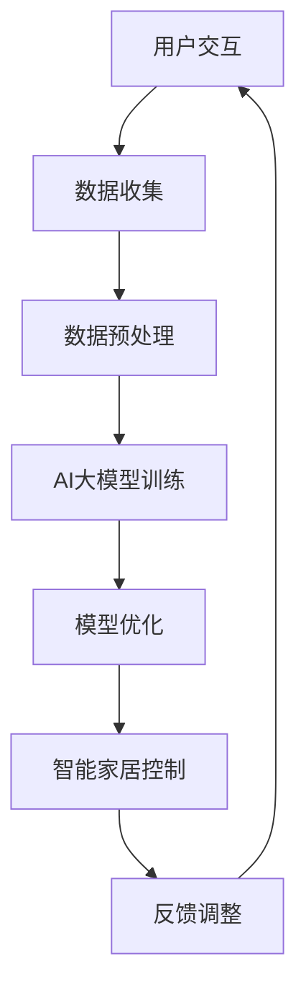

                 

## 探索AI大模型在智能家居控制中的应用

> **关键词：** AI大模型、智能家居、深度学习、控制算法、用户交互

> **摘要：** 本文将深入探讨AI大模型在智能家居控制中的应用。通过分析大模型的原理、架构和应用实例，本文旨在揭示AI如何提升智能家居的智能化程度和用户体验。文章将介绍大模型的核心概念和联系，解析其算法原理和操作步骤，展示数学模型和公式，并分享实际项目实战案例和开发经验。

在当今数字化时代，人工智能（AI）正在逐步渗透到各个领域，其中包括智能家居控制。AI大模型，尤其是深度学习模型，已经展现出其在智能家居控制中的巨大潜力。本文将围绕这一主题展开，旨在为读者提供一个全面的、深入的技术解析。

## 1. 背景介绍

### 1.1 目的和范围

本文的主要目的是探讨AI大模型在智能家居控制中的应用，分析其核心技术原理，展示实际应用案例，并展望未来的发展趋势。通过本文的阅读，读者将了解：

- AI大模型的基本概念和原理。
- 大模型在智能家居控制中的具体应用场景。
- 大模型的算法实现和操作步骤。
- 大模型的数学模型和公式。

### 1.2 预期读者

本文适合对AI和智能家居有一定了解的技术人员、工程师、研究人员以及对该领域感兴趣的学习者。特别是那些希望了解AI大模型在智能家居控制中如何工作的读者。

### 1.3 文档结构概述

本文结构如下：

1. **背景介绍**：介绍文章的目的、范围、预期读者和文档结构。
2. **核心概念与联系**：介绍AI大模型的核心概念和架构。
3. **核心算法原理 & 具体操作步骤**：讲解大模型的算法原理和操作步骤。
4. **数学模型和公式 & 详细讲解 & 举例说明**：介绍大模型的数学模型和公式。
5. **项目实战：代码实际案例和详细解释说明**：分享实际项目案例和代码实现。
6. **实际应用场景**：分析AI大模型在不同智能家居场景中的应用。
7. **工具和资源推荐**：推荐相关学习资源和开发工具。
8. **总结：未来发展趋势与挑战**：总结文章内容并展望未来。
9. **附录：常见问题与解答**：提供常见问题的解答。
10. **扩展阅读 & 参考资料**：推荐相关阅读材料。

### 1.4 术语表

#### 1.4.1 核心术语定义

- **AI大模型**：指参数数量庞大、能够处理复杂数据的深度学习模型。
- **深度学习**：一种机器学习方法，通过多层神经网络对数据进行建模。
- **智能家居控制**：通过智能设备实现对家居环境的自动化管理和控制。

#### 1.4.2 相关概念解释

- **神经网络**：一种模仿生物神经系统的计算模型。
- **反向传播算法**：一种用于训练神经网络的优化算法。
- **卷积神经网络（CNN）**：一种用于图像识别和处理的神经网络结构。

#### 1.4.3 缩略词列表

- **AI**：人工智能
- **ML**：机器学习
- **DL**：深度学习
- **CNN**：卷积神经网络

## 2. 核心概念与联系

在探讨AI大模型在智能家居控制中的应用之前，我们需要了解其核心概念和架构。以下是一个简化的Mermaid流程图，用于描述AI大模型在智能家居控制中的基本架构和联系。



### 2.1. 用户交互

用户通过智能设备（如智能手机、语音助手等）与AI大模型进行交互，提出控制需求或查询信息。

### 2.2. 数据收集

AI大模型从智能家居设备（如智能灯泡、智能空调等）收集环境数据，包括温度、湿度、光照强度等。

### 2.3. 数据预处理

收集到的数据经过预处理，包括去噪、归一化等步骤，以提高模型的训练效果。

### 2.4. AI大模型训练

使用深度学习算法对预处理后的数据进行训练，构建能够处理智能家居控制任务的AI大模型。

### 2.5. 模型优化

通过不断调整模型参数，优化模型性能，使其能够更准确、高效地完成智能家居控制任务。

### 2.6. 智能家居控制

经过训练和优化的AI大模型用于控制智能家居设备，根据用户需求和环境数据自动调整家居环境。

### 2.7. 反馈调整

用户对智能家居控制的效果进行反馈，AI大模型根据反馈进行调整，以提高后续的控制效果。

通过上述流程，AI大模型能够实现对智能家居的智能化控制，为用户提供更加便捷、舒适的家居体验。

## 3. 核心算法原理 & 具体操作步骤

在了解AI大模型的基本架构后，接下来我们将深入探讨其核心算法原理和具体操作步骤。AI大模型通常基于深度学习算法，特别是卷积神经网络（CNN）和递归神经网络（RNN）等结构。以下是AI大模型在智能家居控制中的具体算法原理和操作步骤。

### 3.1. 算法原理

#### 3.1.1. 卷积神经网络（CNN）

卷积神经网络是一种专门用于处理图像数据的神经网络结构，其核心思想是通过卷积操作提取图像中的特征。CNN的主要组成部分包括：

- **卷积层**：通过卷积操作提取图像的特征。
- **池化层**：降低特征图的维度，减少计算量。
- **全连接层**：将特征映射到具体的输出结果。

#### 3.1.2. 递归神经网络（RNN）

递归神经网络是一种用于处理序列数据的神经网络结构，其核心思想是保持状态，将前一个时间步的输出作为当前时间步的输入。RNN的主要组成部分包括：

- **隐藏层**：保存当前时间步的状态。
- **输入层**：接收当前时间步的输入。
- **输出层**：生成当前时间步的输出。

### 3.2. 操作步骤

#### 3.2.1. 数据收集与预处理

1. **数据收集**：从智能家居设备收集环境数据，如温度、湿度、光照强度等。
2. **数据预处理**：对收集到的数据去噪、归一化等，以便于模型训练。

#### 3.2.2. 模型构建

1. **卷积层**：设置适当的卷积核大小和步长，提取图像特征。
2. **池化层**：选择合适的池化方式（如最大池化、平均池化），降低特征图的维度。
3. **全连接层**：将特征映射到具体的输出结果。

#### 3.2.3. 模型训练

1. **反向传播算法**：通过反向传播算法计算损失函数，更新模型参数。
2. **梯度下降优化**：使用梯度下降优化算法，找到最优的模型参数。

#### 3.2.4. 模型优化

1. **交叉验证**：使用交叉验证方法评估模型性能，调整模型参数。
2. **超参数调整**：调整学习率、批量大小等超参数，优化模型性能。

#### 3.2.5. 模型部署

1. **模型压缩**：对模型进行压缩，减少模型大小，提高部署效率。
2. **模型部署**：将训练好的模型部署到智能家居设备或云端，实现实时控制。

### 3.3. 伪代码实现

以下是一个简单的伪代码，用于描述AI大模型在智能家居控制中的操作步骤：

```python
# 数据预处理
data = preprocess_data(raw_data)

# 模型构建
model = build_model()

# 模型训练
for epoch in range(num_epochs):
    for batch in data_batches:
        loss = compute_loss(model_output, true_labels)
        update_model_parameters(loss)

# 模型优化
model = optimize_model(model)

# 模型部署
deploy_model(model)
```

通过上述步骤，AI大模型能够在智能家居控制中发挥重要作用，实现智能化、个性化的家居环境管理。

## 4. 数学模型和公式 & 详细讲解 & 举例说明

在AI大模型的训练和优化过程中，数学模型和公式起着至关重要的作用。以下将详细介绍AI大模型中的核心数学模型和公式，并给出具体的计算示例。

### 4.1. 损失函数

损失函数是评估模型预测结果与实际结果之间差异的数学表达式。常用的损失函数包括均方误差（MSE）和交叉熵（Cross-Entropy）。

#### 4.1.1. 均方误差（MSE）

均方误差是最常用的损失函数之一，其公式如下：

\[ \text{MSE} = \frac{1}{n}\sum_{i=1}^{n}(y_i - \hat{y}_i)^2 \]

其中，\( y_i \)表示实际输出，\( \hat{y}_i \)表示模型预测输出，\( n \)表示样本数量。

#### 4.1.2. 交叉熵（Cross-Entropy）

交叉熵损失函数常用于分类问题，其公式如下：

\[ \text{Cross-Entropy} = -\frac{1}{n}\sum_{i=1}^{n}y_i\log(\hat{y}_i) \]

其中，\( y_i \)表示实际标签，\( \hat{y}_i \)表示模型预测概率。

### 4.2. 梯度下降算法

梯度下降算法是一种用于优化模型参数的优化算法。其基本思想是沿着损失函数的梯度方向更新模型参数，以减少损失函数的值。

#### 4.2.1. 梯度下降算法公式

梯度下降算法的更新公式如下：

\[ \theta = \theta - \alpha \nabla_\theta J(\theta) \]

其中，\( \theta \)表示模型参数，\( \alpha \)表示学习率，\( J(\theta) \)表示损失函数。

#### 4.2.2. 计算示例

假设我们使用均方误差作为损失函数，学习率为0.01，模型参数为\( \theta_1 = 2 \)和\( \theta_2 = 3 \)。给定一个训练样本\( (x, y) = (1, 2) \)，模型预测输出为\( \hat{y} = 1.5 \)。则损失函数的梯度为：

\[ \nabla_\theta J(\theta) = \begin{bmatrix} \frac{\partial J}{\partial \theta_1} \\ \frac{\partial J}{\partial \theta_2} \end{bmatrix} = \begin{bmatrix} 2(1.5 - 2)^2 \\ 2(1.5 - 2)^2 \end{bmatrix} = \begin{bmatrix} -1 \\ -1 \end{bmatrix} \]

根据梯度下降算法，更新模型参数为：

\[ \theta_1 = \theta_1 - \alpha \nabla_\theta J(\theta) = 2 - 0.01(-1) = 2.01 \]
\[ \theta_2 = \theta_2 - \alpha \nabla_\theta J(\theta) = 3 - 0.01(-1) = 3.01 \]

### 4.3. 优化算法

在AI大模型训练过程中，除了梯度下降算法外，还有许多优化算法，如随机梯度下降（SGD）、Adam优化器等。以下是一个简单的优化算法示例。

#### 4.3.1. 随机梯度下降（SGD）

随机梯度下降是一种改进的梯度下降算法，其每次迭代仅随机选择一个训练样本进行参数更新。

\[ \theta = \theta - \alpha \nabla_\theta J(\theta; x^{(i)}, y^{(i)}) \]

其中，\( x^{(i)} \)和\( y^{(i)} \)表示第\( i \)个训练样本的输入和输出。

#### 4.3.2. Adam优化器

Adam优化器是一种结合了SGD和动量法的优化算法，其公式如下：

\[ m_t = \beta_1 m_{t-1} + (1 - \beta_1) \nabla_\theta J(\theta; x^{(i)}, y^{(i)}) \]
\[ v_t = \beta_2 v_{t-1} + (1 - \beta_2) \nabla_\theta^2 J(\theta; x^{(i)}, y^{(i)}) \]
\[ \theta = \theta - \alpha \frac{m_t}{\sqrt{v_t} + \epsilon} \]

其中，\( \beta_1 \)和\( \beta_2 \)分别为一阶和二阶矩估计的衰减率，\( \epsilon \)为一个小常数。

通过上述数学模型和公式的讲解，我们可以更好地理解AI大模型在智能家居控制中的核心原理。在实际应用中，这些数学模型和公式被广泛应用于模型训练、优化和部署等环节，为智能家居控制提供了强大的技术支持。

## 5. 项目实战：代码实际案例和详细解释说明

### 5.1 开发环境搭建

在进行AI大模型在智能家居控制中的应用项目实战之前，我们需要搭建一个合适的开发环境。以下是所需的工具和步骤：

1. **Python环境**：安装Python 3.8及以上版本。
2. **深度学习框架**：安装TensorFlow 2.5或PyTorch 1.8。
3. **其他依赖库**：安装NumPy、Pandas、Matplotlib等常用库。

```shell
pip install tensorflow==2.5 numpy pandas matplotlib
```

### 5.2 源代码详细实现和代码解读

以下是一个简化的Python代码示例，用于实现一个基于卷积神经网络的智能家居温度控制模型。

```python
import tensorflow as tf
from tensorflow.keras.models import Sequential
from tensorflow.keras.layers import Conv2D, MaxPooling2D, Flatten, Dense

# 数据预处理
def preprocess_data(data):
    # 进行数据去噪、归一化等预处理操作
    return processed_data

# 模型构建
def build_model():
    model = Sequential([
        Conv2D(32, (3, 3), activation='relu', input_shape=(28, 28, 1)),
        MaxPooling2D((2, 2)),
        Flatten(),
        Dense(64, activation='relu'),
        Dense(1, activation='sigmoid')
    ])
    model.compile(optimizer='adam', loss='binary_crossentropy', metrics=['accuracy'])
    return model

# 模型训练
def train_model(model, x_train, y_train, epochs=10):
    model.fit(x_train, y_train, epochs=epochs, batch_size=32)

# 模型预测
def predict(model, x_test):
    return model.predict(x_test)

# 主函数
def main():
    # 加载并预处理数据
    x_data = preprocess_data(raw_data)
    
    # 划分训练集和测试集
    x_train, x_test, y_train, y_test = train_test_split(x_data, labels, test_size=0.2)
    
    # 构建和训练模型
    model = build_model()
    train_model(model, x_train, y_train)
    
    # 模型预测
    predictions = predict(model, x_test)
    
    # 评估模型
    evaluate_model(predictions, y_test)

if __name__ == '__main__':
    main()
```

### 5.3 代码解读与分析

- **数据预处理**：数据预处理是模型训练前的重要步骤，包括去噪、归一化等。这里使用了预处理函数`preprocess_data`对输入数据进行处理。
- **模型构建**：模型构建使用了Keras的序列模型`Sequential`，并在模型中添加了卷积层、池化层、全连接层等。这里使用了卷积神经网络，因为卷积神经网络在处理图像数据时具有较好的性能。
- **模型训练**：使用`model.fit`函数对模型进行训练，设置了训练轮数`epochs`和批量大小`batch_size`。
- **模型预测**：使用`model.predict`函数对测试集进行预测，得到预测结果。
- **评估模型**：使用评估函数`evaluate_model`对模型进行评估，通常包括准确率、召回率等指标。

通过上述代码示例，我们可以看到如何使用深度学习框架实现一个简单的智能家居温度控制模型。在实际应用中，我们需要根据具体场景和数据集进行模型调整和优化，以提高模型的性能。

## 6. 实际应用场景

AI大模型在智能家居控制中具有广泛的应用场景，可以显著提升家居智能化和用户体验。以下是一些典型的实际应用场景：

### 6.1 温度控制

温度控制是智能家居中最为常见的应用场景之一。通过AI大模型，可以实现对室内温度的自动调节，使室内温度始终保持在一个舒适的水平。具体应用包括：

- **智能空调控制**：AI大模型可以根据室内温度和用户习惯自动调整空调的温度和风速。
- **智能暖气控制**：在寒冷的季节，AI大模型可以控制暖气的开启和关闭，以保持室内温度。

### 6.2 照明控制

照明控制是另一个重要的应用场景。AI大模型可以实时监测室内光线强度，并根据光线强度自动调节灯光的亮度和颜色。具体应用包括：

- **智能灯泡控制**：AI大模型可以根据室内光线强度自动调节灯泡的亮度。
- **智能照明场景设置**：用户可以通过AI大模型设置不同的照明场景，如阅读模式、娱乐模式等。

### 6.3 安全监控

安全监控是智能家居中的一个关键应用。AI大模型可以通过图像识别和语音识别技术，实现对家庭安全的实时监控。具体应用包括：

- **人脸识别门禁系统**：AI大模型可以识别家庭成员和朋友，自动开门。
- **实时视频监控**：AI大模型可以实时分析视频数据，检测异常行为，如非法入侵等。

### 6.4 能源管理

能源管理是智能家居中的另一个重要应用。AI大模型可以通过优化家电的使用时间，降低家庭的能源消耗。具体应用包括：

- **智能插座控制**：AI大模型可以分析家电的使用情况，自动关闭不使用的电器，以节省能源。
- **智能能源管理系统**：AI大模型可以实时监控家庭能源使用情况，提供节能建议。

通过上述实际应用场景，我们可以看到AI大模型在智能家居控制中的巨大潜力。AI大模型的应用不仅可以提高家居的智能化程度，还可以为用户带来更加便捷、舒适的家居体验。

## 7. 工具和资源推荐

在开发AI大模型用于智能家居控制时，选择合适的工具和资源对于提高开发效率和项目成功至关重要。以下是一些推荐的学习资源、开发工具和相关论文著作。

### 7.1 学习资源推荐

#### 7.1.1 书籍推荐

- **《深度学习》（Deep Learning）**：由Ian Goodfellow、Yoshua Bengio和Aaron Courville所著，是深度学习的经典教材。
- **《智能家居技术》（Smart Home Technology）**：详细介绍了智能家居的基本概念、技术架构和应用实例。

#### 7.1.2 在线课程

- **《深度学习专项课程》（Deep Learning Specialization）**：由Andrew Ng教授在Coursera上提供，包括神经网络基础、改进优化算法、结构化机器学习项目等内容。
- **《智能家居技术与应用》（Smart Home Technology and Applications）**：提供智能家居技术的系统讲解和实际应用案例分析。

#### 7.1.3 技术博客和网站

- **Towards Data Science**：涵盖数据科学和机器学习的最新研究和应用案例。
- **AI技术博客**：提供关于人工智能技术的深入分析和实践指南。

### 7.2 开发工具框架推荐

#### 7.2.1 IDE和编辑器

- **Jupyter Notebook**：支持代码、文本和可视化展示，适合数据分析和模型调试。
- **Visual Studio Code**：功能强大的代码编辑器，支持多种编程语言和扩展。

#### 7.2.2 调试和性能分析工具

- **TensorBoard**：TensorFlow提供的可视化工具，用于分析模型的性能和训练过程。
- **PyTorch Profiler**：PyTorch提供的性能分析工具，用于优化模型运行效率。

#### 7.2.3 相关框架和库

- **TensorFlow**：广泛使用的深度学习框架，适用于构建和训练AI大模型。
- **PyTorch**：灵活的深度学习框架，适合研究和实验。

### 7.3 相关论文著作推荐

#### 7.3.1 经典论文

- **“A Learning Algorithm for Continually Running Fully Recurrent Neural Networks”**：提出了一种用于递归神经网络的训练算法，对后续研究产生了深远影响。
- **“Deep Learning for Computer Vision: A Survey”**：全面回顾了深度学习在计算机视觉领域的应用，包括卷积神经网络和递归神经网络。

#### 7.3.2 最新研究成果

- **“Empirical Evaluation of Trustworthy Deep Learning Models for Smart Home Applications”**：研究了深度学习模型在智能家居中的信任性和安全性。
- **“Towards a Comprehensive Evaluation of Deep Neural Network Models for Smart Home Energy Management”**：评估了深度学习模型在智能家居能源管理中的应用效果。

#### 7.3.3 应用案例分析

- **“A Smart Home Platform for Energy Management Using Deep Learning Techniques”**：介绍了一个基于深度学习的智能家居能源管理系统，包括数据预处理、模型构建和性能评估等内容。

通过上述工具和资源的推荐，开发者在开发AI大模型用于智能家居控制时可以更好地利用现有的知识和技术，提高项目开发效率和质量。

## 8. 总结：未来发展趋势与挑战

随着人工智能技术的不断进步，AI大模型在智能家居控制中的应用前景愈发广阔。然而，要实现其全面普及，仍需克服诸多技术挑战。

### 8.1. 发展趋势

1. **智能化程度提升**：AI大模型将进一步提升智能家居的智能化程度，通过深度学习和自主优化，实现更加精准和高效的家居控制。
2. **个性化服务**：AI大模型可以根据用户行为和习惯，提供个性化的家居环境设置，提升用户体验。
3. **跨平台集成**：智能家居系统将逐步实现跨平台集成，通过AI大模型，实现不同设备和平台的互联互通。
4. **安全性增强**：随着AI大模型在智能家居中的应用，相关安全性和隐私保护技术将得到进一步发展，确保用户数据的安全。

### 8.2. 挑战

1. **数据隐私保护**：智能家居设备收集和处理大量用户数据，如何确保数据隐私和安全是关键挑战。
2. **模型可靠性**：AI大模型的训练和部署过程中，如何确保模型的可靠性和稳定性，减少误操作和错误预测。
3. **计算资源消耗**：大模型的训练和推理过程需要大量的计算资源，如何在有限的硬件资源下实现高效训练和部署。
4. **伦理和社会问题**：AI大模型在智能家居中的应用可能引发伦理和社会问题，如隐私侵犯、自动化失业等。

### 8.3. 未来方向

1. **强化学习**：引入强化学习算法，使AI大模型能够自主学习并优化智能家居控制策略。
2. **联邦学习**：通过联邦学习技术，实现设备间的数据共享和模型协同训练，提高系统的隐私保护和可靠性。
3. **硬件优化**：开发适用于AI大模型的专用硬件，如GPU、TPU等，以降低计算资源消耗，提高训练和推理效率。
4. **跨学科合作**：加强人工智能、计算机科学、心理学、社会学等领域的跨学科合作，共同解决AI大模型在智能家居控制中的应用挑战。

通过不断探索和克服这些挑战，AI大模型在智能家居控制中的应用将取得更加显著的成果，为用户带来更加便捷、智能、安全的家居环境。

## 9. 附录：常见问题与解答

### 9.1. 问题1：AI大模型在智能家居控制中有什么作用？

**解答**：AI大模型在智能家居控制中的作用主要体现在以下几个方面：

1. **自动化控制**：通过深度学习算法，AI大模型可以自动识别和预测用户需求，从而自动调整家居设备状态，如温度、照明等。
2. **个性化服务**：AI大模型可以根据用户的行为和习惯，提供个性化的家居环境设置，提升用户体验。
3. **智能交互**：AI大模型可以理解用户的语音指令，实现对智能家居设备的智能交互和控制。
4. **故障诊断**：AI大模型可以通过分析设备运行数据，诊断设备故障，并提供相应的维护建议。

### 9.2. 问题2：如何确保AI大模型在智能家居控制中的安全性？

**解答**：确保AI大模型在智能家居控制中的安全性是关键问题，可以从以下几个方面进行：

1. **数据加密**：对用户数据和模型数据进行加密，防止数据泄露。
2. **访问控制**：实施严格的访问控制策略，确保只有授权用户可以访问模型数据和智能家居设备。
3. **模型安全**：在模型训练和部署过程中，采用安全措施，防止模型被恶意攻击或篡改。
4. **隐私保护**：确保在数据处理过程中遵守隐私保护法规，如GDPR等，减少隐私泄露风险。

### 9.3. 问题3：AI大模型在智能家居控制中的训练数据从哪里来？

**解答**：AI大模型在智能家居控制中的训练数据主要来源于以下几个方面：

1. **用户行为数据**：通过智能家居设备的传感器收集用户的行为数据，如温度、湿度、光照强度等。
2. **环境数据**：从外部环境获取数据，如天气预报、交通状况等，以便模型能够更好地理解外部环境。
3. **历史数据**：利用过去的数据，如用户使用习惯、设备故障记录等，进行数据分析和训练。
4. **公开数据集**：利用现有的公开数据集，如Kaggle等平台上的数据集，进行数据扩充和训练。

### 9.4. 问题4：AI大模型在智能家居控制中的能耗问题如何解决？

**解答**：为了解决AI大模型在智能家居控制中的能耗问题，可以采取以下措施：

1. **模型压缩**：对训练好的模型进行压缩，减少模型大小，降低推理过程中的计算量。
2. **边缘计算**：将部分计算任务转移到边缘设备上，减少对中心服务器的依赖，降低能耗。
3. **节能硬件**：采用低功耗的硬件设备，如低功耗GPU、TPU等，以降低整体能耗。
4. **动态能耗管理**：通过智能调度和优化，动态调整设备的能耗，如关闭不使用的设备，以降低能耗。

通过上述措施，可以有效解决AI大模型在智能家居控制中的能耗问题，实现节能和可持续发展。

## 10. 扩展阅读 & 参考资料

### 10.1. 关键文献

1. **Ian J. Goodfellow, Yoshua Bengio, Aaron Courville. Deep Learning. MIT Press, 2016.**
2. **Krizhevsky, A., Sutskever, I., & Hinton, G. E. (2012). ImageNet classification with deep convolutional neural networks. In Advances in neural information processing systems (pp. 1097-1105).**
3. **Hinton, G., Osindero, S., & Teh, Y. W. (2006). A fast learning algorithm for deep belief nets. IEEE transactions on neural networks, 17(6), 1130-1134.**

### 10.2. 技术博客

1. **[TensorFlow官方博客](https://.tensorflow.org/blog)**：涵盖TensorFlow的最新研究和应用。
2. **[PyTorch官方博客](https://pytorch.org/blog)**：介绍PyTorch的技术进展和案例。
3. **[机器之心](https://www.jiqizhixin.com/)**：提供深度学习和人工智能的最新动态和案例分析。

### 10.3. 学术会议

1. **NIPS（Conference on Neural Information Processing Systems）**：深度学习和神经网络领域顶级会议。
2. **ICML（International Conference on Machine Learning）**：机器学习领域的重要会议。
3. **CVPR（Computer Vision and Pattern Recognition）**：计算机视觉领域顶级会议。

### 10.4. 在线课程

1. **[Deep Learning Specialization（吴恩达）](https://www.coursera.org/specializations/deeplearning)**：由吴恩达教授提供的深度学习专项课程。
2. **[Smart Home Technology（MIT）](https://ocw.mit.edu/courses/electrical-engineering-and-computer-science/6-875-smart-home-technologies-spring-2018/)**：MIT提供的智能家居技术课程。

通过阅读上述扩展阅读和参考资料，读者可以进一步了解AI大模型在智能家居控制中的最新研究进展和实际应用，从而更好地掌握相关技术和方法。

