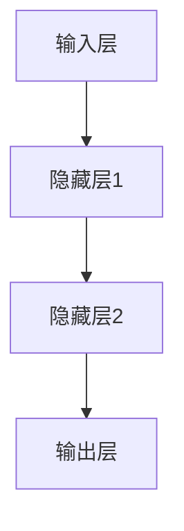
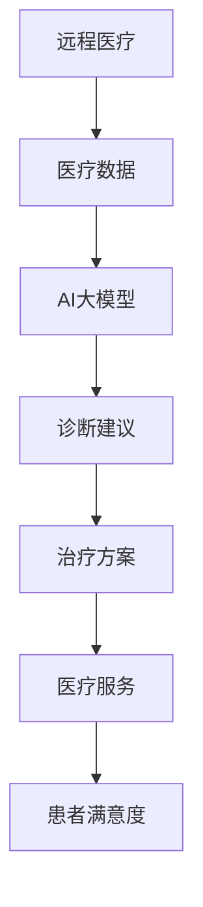

                 

# 探索AI大模型在远程医疗中的应用

> **关键词：** 远程医疗，AI大模型，深度学习，医疗数据分析，个性化诊断，实时预测

> **摘要：** 本文章将深入探讨AI大模型在远程医疗领域的应用。通过对核心概念的介绍、算法原理的讲解以及实际应用场景的分析，本文旨在展示AI大模型如何通过深度学习和大数据分析技术，提升远程医疗的诊断准确性和效率，为患者提供更加个性化和高效的医疗服务。

## 1. 背景介绍

### 1.1 目的和范围

本文旨在探讨AI大模型在远程医疗中的应用，具体涵盖以下几个方面：

1. **核心概念与联系**：介绍AI大模型和远程医疗的基本概念，并展示它们之间的关联。
2. **核心算法原理 & 具体操作步骤**：详细阐述AI大模型背后的深度学习算法原理，并给出具体的操作步骤。
3. **数学模型和公式 & 详细讲解 & 举例说明**：通过数学模型和公式的讲解，帮助读者更好地理解AI大模型的工作原理。
4. **项目实战：代码实际案例和详细解释说明**：提供具体的代码实现，并对关键代码进行详细解释和分析。
5. **实际应用场景**：展示AI大模型在远程医疗中的实际应用案例，并讨论其带来的变革。
6. **工具和资源推荐**：推荐学习资源和开发工具，以帮助读者进一步探索这一领域。
7. **总结：未来发展趋势与挑战**：总结AI大模型在远程医疗中的应用现状，并探讨未来的发展趋势和面临的挑战。

### 1.2 预期读者

本文适合以下读者群体：

1. **医学研究人员**：希望了解AI大模型如何应用于远程医疗的研究人员。
2. **医疗保健专业人员**：对利用AI提升医疗服务质量感兴趣的专业人员。
3. **计算机科学家和工程师**：对深度学习和AI在医疗领域应用感兴趣的计算机科学家和工程师。
4. **医疗IT领域的学生**：希望深入理解AI大模型在远程医疗中应用的学生。

### 1.3 文档结构概述

本文结构如下：

1. **引言**：介绍远程医疗和AI大模型的基本概念。
2. **核心概念与联系**：分析AI大模型和远程医疗之间的关系。
3. **核心算法原理 & 具体操作步骤**：详细讲解AI大模型的工作原理。
4. **数学模型和公式 & 详细讲解 & 举例说明**：使用数学模型和公式阐述AI大模型的技术细节。
5. **项目实战：代码实际案例和详细解释说明**：提供具体的代码实现和解析。
6. **实际应用场景**：展示AI大模型在远程医疗中的实际应用。
7. **工具和资源推荐**：推荐相关学习资源和开发工具。
8. **总结：未来发展趋势与挑战**：总结AI大模型在远程医疗中的应用前景。
9. **附录：常见问题与解答**：回答读者可能遇到的常见问题。
10. **扩展阅读 & 参考资料**：提供进一步阅读的资料。

### 1.4 术语表

#### 1.4.1 核心术语定义

- **远程医疗**：通过信息技术，实现医疗服务的远程提供，包括远程诊断、远程治疗和远程监护等。
- **AI大模型**：指具备大规模训练数据、复杂神经网络结构和强大计算能力的深度学习模型。
- **深度学习**：一种基于人工神经网络的机器学习技术，通过多层神经网络对数据进行自动特征学习和模式识别。
- **个性化诊断**：根据患者的具体病情和病史，提供个性化的诊断和治疗方案。

#### 1.4.2 相关概念解释

- **远程医疗**：远程医疗是指通过互联网、移动通信等技术，实现医疗服务的远程提供。这种模式使得医疗资源得以更广泛地分布，提高了医疗服务的可及性和效率。
- **AI大模型**：AI大模型是指那些通过海量数据训练，具备强大计算能力和高度复杂性的深度学习模型。这些模型能够自动从数据中学习特征，进行模式识别和预测。
- **深度学习**：深度学习是一种基于人工神经网络的机器学习技术，通过多层神经网络对数据进行自动特征学习和模式识别。它已经在图像识别、语音识别和自然语言处理等领域取得了显著成就。

#### 1.4.3 缩略词列表

- **AI**：人工智能
- **ML**：机器学习
- **DL**：深度学习
- **GPU**：图形处理单元
- **NLP**：自然语言处理

## 2. 核心概念与联系

### 2.1 AI大模型原理

AI大模型是基于深度学习技术的一种模型，它通过多层神经网络对大量数据进行训练，以自动提取数据中的特征和模式。深度学习模型的核心是神经元，这些神经元通过前向传播和反向传播算法，将输入数据映射到输出结果。以下是一个简单的深度学习模型结构图：



在这个模型中，输入层接收原始数据，通过隐藏层进行特征提取和组合，最终在输出层得到预测结果。

### 2.2 远程医疗需求

远程医疗的需求主要包括：

1. **远程诊断**：通过远程医疗系统，医生可以对患者的病情进行诊断，包括症状分析、影像分析等。
2. **远程治疗**：医生可以通过远程医疗系统，为患者提供远程治疗方案，包括药物治疗、手术治疗等。
3. **远程监护**：通过远程医疗系统，医生可以对患者的健康状况进行实时监控，包括生命体征监测、病情变化监测等。

### 2.3 AI大模型与远程医疗的联系

AI大模型可以显著提升远程医疗的服务质量，具体体现在以下几个方面：

1. **提高诊断准确率**：AI大模型可以通过对海量医学数据的分析，提供更加准确的诊断结果，减少误诊率。
2. **降低医疗成本**：通过自动化诊断和治疗，远程医疗可以减少人力成本和医疗资源浪费，降低整体医疗成本。
3. **提升医疗可及性**：AI大模型可以使得偏远地区的患者也能享受到高质量的医疗服务，提升医疗服务的可及性。
4. **个性化医疗**：AI大模型可以根据患者的具体病情和病史，提供个性化的诊断和治疗建议。

### 2.4 远程医疗中的AI大模型应用场景

以下是AI大模型在远程医疗中的一些典型应用场景：

1. **影像诊断**：通过深度学习模型，可以对医学影像（如X光、CT、MRI等）进行自动分析，提供准确的诊断结果。
2. **基因测序**：AI大模型可以对基因序列进行解析，预测患者的遗传疾病风险，为个性化治疗提供依据。
3. **疾病预测**：AI大模型可以通过分析患者的症状和病史，预测患者可能患有的疾病，提供早期预警。
4. **药物研发**：AI大模型可以加速药物研发过程，通过筛选和预测，找到潜在的药物候选。

### 2.5 AI大模型与远程医疗的协同作用

AI大模型和远程医疗的协同作用，可以构建一个更加高效和智能的医疗生态系统。AI大模型可以处理海量医疗数据，为远程医疗提供精准的诊断和治疗建议；而远程医疗则可以提供便捷、高效的医疗服务，使AI大模型的应用更加广泛和实际。两者的协同作用，有望推动医疗行业的变革，提升医疗服务的质量。



在这个流程中，远程医疗系统收集医疗数据，通过AI大模型进行分析，生成诊断建议和治疗方案，最终为患者提供高质量的医疗服务，提升患者满意度。

## 3. 核心算法原理 & 具体操作步骤

### 3.1 深度学习算法原理

深度学习算法的核心是神经网络，神经网络通过模拟人脑神经元的工作方式，对数据进行特征学习和模式识别。以下是一个简单的深度学习算法原理：

1. **输入层**：接收原始数据，并将其传递到下一层。
2. **隐藏层**：对输入数据进行特征提取和组合，每层都可以提取更高层次的特征。
3. **输出层**：根据提取的特征，生成预测结果。

### 3.2 神经网络结构

神经网络的常见结构包括：

- **全连接神经网络**：每层神经元都与前一层和后一层的所有神经元相连。
- **卷积神经网络（CNN）**：适用于图像处理，通过卷积层提取图像特征。
- **循环神经网络（RNN）**：适用于序列数据，通过循环结构处理序列信息。

### 3.3 前向传播与反向传播

深度学习算法主要通过前向传播和反向传播进行训练：

1. **前向传播**：将输入数据传递到神经网络，通过每一层神经元的计算，最终得到输出结果。
2. **反向传播**：计算输出结果与实际结果之间的误差，并通过反向传播算法，调整神经网络的参数。

### 3.4 具体操作步骤

以下是使用深度学习算法进行远程医疗诊断的具体操作步骤：

1. **数据收集**：收集远程医疗系统中的医疗数据，包括患者的症状、病史、影像等。
2. **数据预处理**：对收集的数据进行清洗和格式化，使其符合神经网络输入的要求。
3. **模型训练**：构建深度学习模型，通过大量医疗数据对模型进行训练，优化模型参数。
4. **模型评估**：使用验证集对训练好的模型进行评估，调整模型参数，提高诊断准确率。
5. **模型应用**：将训练好的模型应用于远程医疗诊断系统，为医生提供诊断建议。

### 3.5 伪代码示例

以下是一个简单的深度学习算法伪代码示例：

```python
# 数据预处理
X = 数据清洗和格式化(X)

# 构建模型
model = 构建全连接神经网络()

# 训练模型
model.fit(X, y)

# 评估模型
accuracy = model.evaluate(X, y)

# 输出结果
print("模型准确率：", accuracy)
```

## 4. 数学模型和公式 & 详细讲解 & 举例说明

### 4.1 深度学习中的数学模型

深度学习中的数学模型主要涉及以下几个方面：

1. **激活函数**：用于定义神经网络中神经元的输出，常见的激活函数包括ReLU、Sigmoid和Tanh等。
2. **损失函数**：用于衡量模型预测结果与实际结果之间的差距，常见的损失函数包括均方误差（MSE）和交叉熵（Cross-Entropy）等。
3. **优化算法**：用于调整模型参数，使模型预测结果更接近实际结果，常见的优化算法包括梯度下降（Gradient Descent）和Adam优化器等。

### 4.2 激活函数

激活函数是神经网络中重要的组成部分，用于定义神经元的输出。以下是一些常见的激活函数及其公式：

- **ReLU（Rectified Linear Unit）**：
  $$ f(x) = \max(0, x) $$
 ReLU函数在$x \geq 0$时输出$x$，在$x < 0$时输出0。它具有简单和计算效率高的特点。

- **Sigmoid**：
  $$ f(x) = \frac{1}{1 + e^{-x}} $$
  Sigmoid函数将输入$x$映射到$(0, 1)$区间，常用于二分类问题。

- **Tanh**：
  $$ f(x) = \frac{e^x - e^{-x}}{e^x + e^{-x}} $$
  Tanh函数将输入$x$映射到$(-1, 1)$区间，具有平滑且对称的特性。

### 4.3 损失函数

损失函数是衡量模型预测结果与实际结果之间差距的重要指标。以下是一些常见的损失函数及其公式：

- **均方误差（MSE）**：
  $$ MSE = \frac{1}{m} \sum_{i=1}^{m} (y_i - \hat{y}_i)^2 $$
  MSE用于回归问题，衡量预测值$\hat{y}_i$与实际值$y_i$之间的平方误差。

- **交叉熵（Cross-Entropy）**：
  $$ H(y, \hat{y}) = -\sum_{i=1}^{m} y_i \log(\hat{y}_i) $$
  交叉熵用于分类问题，衡量实际分布$y$与预测分布$\hat{y}$之间的差异。

### 4.4 优化算法

优化算法用于调整模型参数，以减少损失函数的值。以下是一些常见的优化算法及其公式：

- **梯度下降（Gradient Descent）**：
  $$ \theta_{t+1} = \theta_t - \alpha \nabla_{\theta} J(\theta) $$
  梯度下降通过计算损失函数的梯度，并沿着梯度方向更新模型参数。

- **Adam优化器**：
  $$ m_t = \beta_1 m_{t-1} + (1 - \beta_1) (x_t - m_{t-1}) $$
  $$ v_t = \beta_2 v_{t-1} + (1 - \beta_2) (\frac{x_t - m_t}{\sqrt{v_t}}) $$
  $$ \theta_{t+1} = \theta_t - \alpha \frac{m_t}{\sqrt{v_t} + \epsilon} $$
  Adam优化器结合了动量法和RMSprop的优点，提高了优化过程的稳定性。

### 4.5 举例说明

以下是一个简单的深度学习模型，用于远程医疗诊断的例子：

1. **数据集**：假设我们有一个包含1000个样本的数据集，每个样本包括患者的症状和诊断结果。

2. **输入层**：输入层有10个神经元，分别对应10个症状。

3. **隐藏层**：隐藏层有50个神经元，使用ReLU激活函数。

4. **输出层**：输出层有2个神经元，使用Sigmoid激活函数，表示两种可能的诊断结果。

5. **损失函数**：使用交叉熵作为损失函数。

6. **优化算法**：使用Adam优化器。

7. **训练过程**：通过100个epochs进行训练。

8. **评估过程**：使用验证集进行评估。

```python
import tensorflow as tf
from tensorflow.keras.models import Sequential
from tensorflow.keras.layers import Dense, Activation

# 数据预处理
X_train = ... # 症状数据
y_train = ... # 诊断结果

# 构建模型
model = Sequential()
model.add(Dense(50, input_dim=10, activation='relu'))
model.add(Dense(2, activation='sigmoid'))

# 编译模型
model.compile(optimizer='adam', loss='binary_crossentropy', metrics=['accuracy'])

# 训练模型
model.fit(X_train, y_train, epochs=100, batch_size=32)

# 评估模型
accuracy = model.evaluate(X_train, y_train)
print("模型准确率：", accuracy[1])
```

通过这个例子，我们可以看到如何使用深度学习模型进行远程医疗诊断，并实现从数据预处理到模型训练和评估的全过程。

## 5. 项目实战：代码实际案例和详细解释说明

### 5.1 开发环境搭建

要实现远程医疗中的AI大模型应用，我们需要搭建一个适合深度学习开发的编程环境。以下是搭建开发环境的步骤：

1. **安装Python**：Python是深度学习的主要编程语言，我们需要安装Python 3.7或更高版本。
2. **安装TensorFlow**：TensorFlow是Google推出的开源深度学习框架，我们使用pip命令安装：
   ```bash
   pip install tensorflow
   ```
3. **安装Jupyter Notebook**：Jupyter Notebook是一个交互式的开发环境，可以帮助我们更方便地进行代码编写和调试：
   ```bash
   pip install notebook
   ```
4. **安装其他依赖库**：根据项目需求，可能需要安装其他依赖库，如NumPy、Pandas等：
   ```bash
   pip install numpy pandas
   ```

### 5.2 源代码详细实现和代码解读

以下是一个完整的深度学习模型实现，用于远程医疗诊断。代码包括数据预处理、模型构建、训练和评估等部分。

```python
import tensorflow as tf
from tensorflow.keras.models import Sequential
from tensorflow.keras.layers import Dense, Activation
from tensorflow.keras.optimizers import Adam
from sklearn.model_selection import train_test_split
from sklearn.preprocessing import StandardScaler
import numpy as np

# 5.2.1 数据预处理
# 假设我们有一个包含症状和诊断结果的数据集，格式为：[症状1, 症状2, ..., 症状n, 诊断结果]
data = np.load('remote_medical_data.npy') # 加载数据

X = data[:, :-1] # 症状数据
y = data[:, -1] # 诊断结果

# 划分训练集和测试集
X_train, X_test, y_train, y_test = train_test_split(X, y, test_size=0.2, random_state=42)

# 标准化数据
scaler = StandardScaler()
X_train = scaler.fit_transform(X_train)
X_test = scaler.transform(X_test)

# 5.2.2 模型构建
model = Sequential()
model.add(Dense(50, input_dim=X_train.shape[1], activation='relu'))
model.add(Dense(1, activation='sigmoid'))

# 编译模型
model.compile(optimizer=Adam(learning_rate=0.001), loss='binary_crossentropy', metrics=['accuracy'])

# 5.2.3 训练模型
history = model.fit(X_train, y_train, epochs=100, batch_size=32, validation_split=0.1)

# 5.2.4 评估模型
test_loss, test_accuracy = model.evaluate(X_test, y_test)
print("测试集准确率：", test_accuracy)

# 5.2.5 预测新样本
new_data = np.array([[0.1, 0.2, 0.3, 0.4, 0.5], [0.2, 0.3, 0.4, 0.5, 0.6]]) # 新样本
new_data = scaler.transform(new_data) # 标准化
predictions = model.predict(new_data)
print("新样本预测结果：", predictions)
```

### 5.3 代码解读与分析

5.3.1 数据预处理

首先，我们加载远程医疗数据集，数据集包含症状和诊断结果。然后，我们将数据集划分为训练集和测试集，并使用StandardScaler进行数据标准化。数据标准化可以消除不同特征之间的量纲差异，提高模型训练效果。

5.3.2 模型构建

我们使用Sequential模型构建深度学习模型，包含一个输入层、一个隐藏层和一个输出层。输入层有50个神经元，使用ReLU激活函数；输出层有1个神经元，使用Sigmoid激活函数。

5.3.3 训练模型

我们使用Adam优化器进行模型训练，训练过程包括100个epochs。在训练过程中，我们使用validation_split参数，将20%的数据用于验证集，以监测模型在训练过程中的性能。

5.3.4 评估模型

训练完成后，我们使用测试集对模型进行评估，计算测试集的准确率。这个准确率反映了模型在未知数据上的表现，是衡量模型性能的重要指标。

5.3.5 预测新样本

最后，我们使用训练好的模型对新的症状数据进行预测。预测结果是一个概率值，表示诊断结果为1的概率。通过调整阈值，可以将概率值转换为二分类结果。

### 5.4 代码优化

在实际应用中，我们可能需要对代码进行优化，以提高模型性能和训练效率。以下是一些优化建议：

1. **增加隐藏层神经元**：增加隐藏层神经元可以提高模型的表达能力，但也会增加计算复杂度。
2. **使用dropout**：dropout是一种正则化技术，可以减少过拟合现象，提高模型泛化能力。
3. **调整学习率**：适当调整学习率可以提高模型训练效果，避免陷入局部最小值。
4. **使用批量归一化**：批量归一化可以加速模型训练，提高模型稳定性。
5. **使用更复杂的模型结构**：如卷积神经网络（CNN）或循环神经网络（RNN），适用于不同类型的数据。

## 6. 实际应用场景

### 6.1 影像诊断

在医学影像诊断中，AI大模型可以显著提高诊断准确率。以下是一些实际应用案例：

1. **肺癌筛查**：通过深度学习模型对CT影像进行分析，可以早期发现肺癌，提高患者生存率。
2. **乳腺癌检测**：通过深度学习模型对乳腺X光片进行分析，可以准确检测乳腺癌，降低误诊率。
3. **脑部病变诊断**：通过深度学习模型对MRI影像进行分析，可以早期发现脑部病变，如脑肿瘤和脑梗死等。

### 6.2 基因测序

基因测序是精准医疗的重要手段，AI大模型可以加速基因测序和数据分析过程。以下是一些实际应用案例：

1. **遗传病预测**：通过深度学习模型分析基因序列，可以预测患者可能患有的遗传病，为早期干预提供依据。
2. **药物研发**：通过深度学习模型分析基因序列和药物结构，可以预测药物与基因的相互作用，加速药物研发过程。
3. **癌症分类**：通过深度学习模型分析基因序列和临床数据，可以准确分类不同类型的癌症，为个性化治疗提供依据。

### 6.3 疾病预测

AI大模型可以通过分析患者的症状和病史，预测患者可能患有的疾病，为早期诊断和干预提供依据。以下是一些实际应用案例：

1. **糖尿病预测**：通过深度学习模型分析患者的症状和病史，可以预测患者是否患有糖尿病，为早期干预提供依据。
2. **心血管疾病预测**：通过深度学习模型分析患者的症状和病史，可以预测患者是否患有心血管疾病，为早期预防和治疗提供依据。
3. **呼吸道疾病预测**：通过深度学习模型分析患者的症状和病史，可以预测患者是否患有呼吸道疾病，如肺炎和支气管炎等。

### 6.4 药物研发

AI大模型可以加速药物研发过程，通过分析药物结构和活性，预测药物效果和副作用。以下是一些实际应用案例：

1. **药物筛选**：通过深度学习模型分析药物结构和活性，可以快速筛选出潜在药物，提高药物研发效率。
2. **药物优化**：通过深度学习模型分析药物结构和活性，可以优化药物分子结构，提高药物疗效和安全性。
3. **药物设计**：通过深度学习模型分析药物结构和疾病机理，可以设计出针对特定疾病的药物。

### 6.5 其他应用场景

除了上述应用场景，AI大模型在远程医疗中还有许多其他应用场景：

1. **远程监护**：通过AI大模型分析患者的生命体征数据，可以实时监测患者健康状况，提供预警和干预措施。
2. **健康咨询**：通过AI大模型分析患者的症状和病史，可以提供个性化的健康建议，如饮食建议、运动建议等。
3. **医疗资源调度**：通过AI大模型分析患者分布和医疗资源状况，可以优化医疗资源调度，提高医疗资源利用效率。

## 7. 工具和资源推荐

### 7.1 学习资源推荐

#### 7.1.1 书籍推荐

- **《深度学习》（Ian Goodfellow、Yoshua Bengio和Aaron Courville著）**：这是一本深度学习的经典教材，涵盖了深度学习的基础理论和实践方法。
- **《Python深度学习》（François Chollet著）**：这本书详细介绍了使用Python和TensorFlow进行深度学习的实践方法，适合初学者和进阶者。
- **《医学人工智能》（Dra. Gloria Gutierrez、Dr. Diego Jose和Dr. Emilio Alamo著）**：这本书介绍了医学人工智能的基本概念、应用场景和发展趋势。

#### 7.1.2 在线课程

- **Coursera上的《深度学习特辑》**：由吴恩达教授主讲，涵盖深度学习的基础理论、实践方法和应用场景。
- **Udacity上的《深度学习工程师纳米学位》**：这是一个涵盖深度学习、神经网络、TensorFlow等知识的综合课程，适合初学者和进阶者。
- **edX上的《医学人工智能》**：由哈佛大学提供，介绍医学人工智能的基本概念、应用场景和技术趋势。

#### 7.1.3 技术博客和网站

- **TensorFlow官方文档**：https://www.tensorflow.org/，提供了丰富的深度学习教程和实践案例。
- **机器之心**：https://www.jiqizhixin.com/，提供最新的深度学习、人工智能和技术资讯。
- **机器学习社区**：https://www.mlcommunity.cn/，一个专注于深度学习和机器学习的中文社区，分享技术文章和讨论。

### 7.2 开发工具框架推荐

#### 7.2.1 IDE和编辑器

- **PyCharm**：这是一个强大的Python IDE，支持多种编程语言，包括Python、JavaScript、HTML等。
- **VS Code**：这是一个轻量级但功能强大的代码编辑器，支持多种编程语言，并提供丰富的扩展插件。
- **Jupyter Notebook**：这是一个交互式的开发环境，适合进行数据分析和深度学习模型的实验。

#### 7.2.2 调试和性能分析工具

- **TensorBoard**：这是一个基于Web的调试工具，可以可视化深度学习模型的性能和训练过程。
- **WMLSDK**：这是一个用于性能分析和优化的工具，可以分析深度学习模型的执行时间和资源消耗。
- **Google Profiler**：这是一个用于性能分析的在线工具，可以分析Python代码的性能瓶颈。

#### 7.2.3 相关框架和库

- **TensorFlow**：这是一个开源的深度学习框架，支持多种深度学习模型和应用。
- **PyTorch**：这是一个开源的深度学习框架，提供了动态计算图和灵活的编程接口。
- **Keras**：这是一个基于TensorFlow的深度学习库，提供了简单和高效的模型构建和训练接口。

### 7.3 相关论文著作推荐

#### 7.3.1 经典论文

- **“Deep Learning” by Ian Goodfellow、Yoshua Bengio和Aaron Courville**：这是一篇介绍深度学习的经典论文，详细阐述了深度学习的基本原理和应用。
- **“Deep Neural Networks for Acute Myocardial Infarction Detection” by Zhang et al.**：这篇文章介绍了如何使用深度学习模型进行心肌梗死检测，展示了深度学习在医学诊断中的应用潜力。
- **“Generative Adversarial Nets” by Ian Goodfellow et al.**：这篇文章介绍了生成对抗网络（GAN），这是一种能够生成高质量数据的深度学习模型。

#### 7.3.2 最新研究成果

- **“Deep Learning in Medical Imaging: A Survey” by Zuo et al.**：这篇文章综述了深度学习在医学影像诊断中的应用，介绍了最新的研究成果和技术趋势。
- **“A Comprehensive Survey on Medical Imaging with Deep Learning” by Chen et al.**：这篇文章详细介绍了深度学习在医学影像处理中的应用，包括图像分割、疾病检测和诊断等。
- **“Deep Learning for Healthcare” by Yosinski et al.**：这篇文章探讨了深度学习在医疗保健领域的应用，包括疾病预测、个性化治疗和药物研发等。

#### 7.3.3 应用案例分析

- **“Using AI to Improve Heart Attack Detection” by Google Research**：这个案例展示了Google如何使用深度学习模型改进心肌梗死检测，提高了诊断准确率和效率。
- **“Deep Learning in Radiology: Current State-of-the-Art and Future Directions” by AI Radiology**：这个案例探讨了深度学习在放射学领域的应用，包括图像分割、病灶检测和诊断等。
- **“AI-Enabled Smart Glasses for Remote Monitoring of Alzheimer’s Disease” by Google AI**：这个案例展示了Google如何使用智能眼镜和深度学习模型，对阿尔茨海默病患者进行远程监测和诊断。

## 8. 总结：未来发展趋势与挑战

### 8.1 发展趋势

随着深度学习和AI技术的不断发展，AI大模型在远程医疗中的应用前景十分广阔。以下是一些发展趋势：

1. **诊断准确率提高**：随着数据量和算法的优化，AI大模型的诊断准确率将不断提高，减少误诊率和漏诊率。
2. **个性化医疗**：AI大模型可以根据患者的具体病情和病史，提供个性化的诊断和治疗方案，提升医疗质量。
3. **实时预测**：AI大模型可以实时分析患者数据，提供实时预测和预警，有助于早期发现疾病和采取干预措施。
4. **远程监护**：AI大模型可以实时监测患者生命体征，提供远程监护服务，提高患者生活质量。

### 8.2 挑战

虽然AI大模型在远程医疗中具有巨大潜力，但仍面临一些挑战：

1. **数据隐私和安全**：远程医疗涉及大量患者隐私数据，如何保障数据隐私和安全是关键问题。
2. **算法可解释性**：深度学习模型具有较高的预测准确率，但缺乏可解释性，如何提高算法可解释性是重要挑战。
3. **医疗资源分配**：AI大模型需要大量计算资源和数据，如何合理分配医疗资源，确保模型的普及和应用是关键问题。
4. **法规和伦理问题**：AI大模型在医疗领域的应用需要遵循相关法规和伦理标准，如何制定合适的法规和伦理规范是重要挑战。

### 8.3 发展建议

为了推动AI大模型在远程医疗中的应用，提出以下建议：

1. **加强数据保护**：建立完善的数据保护机制，确保患者隐私和数据安全。
2. **提高算法可解释性**：加强研究，提高深度学习模型的可解释性，使其更加透明和可信。
3. **优化资源分配**：合理分配计算资源和数据，确保AI大模型的普及和应用。
4. **完善法规和伦理规范**：制定合适的法规和伦理规范，保障AI大模型在医疗领域的合规应用。

## 9. 附录：常见问题与解答

### 9.1 AI大模型在远程医疗中的应用优势是什么？

AI大模型在远程医疗中的应用优势包括：

1. **提高诊断准确率**：通过深度学习和大数据分析技术，AI大模型可以自动提取数据中的特征和模式，提供更加准确的诊断结果。
2. **降低医疗成本**：通过自动化诊断和治疗，远程医疗可以减少人力成本和医疗资源浪费，降低整体医疗成本。
3. **提升医疗可及性**：AI大模型可以使得偏远地区的患者也能享受到高质量的医疗服务，提升医疗服务的可及性。
4. **个性化医疗**：AI大模型可以根据患者的具体病情和病史，提供个性化的诊断和治疗建议。

### 9.2 AI大模型在远程医疗中可能面临哪些挑战？

AI大模型在远程医疗中可能面临以下挑战：

1. **数据隐私和安全**：远程医疗涉及大量患者隐私数据，如何保障数据隐私和安全是关键问题。
2. **算法可解释性**：深度学习模型具有较高的预测准确率，但缺乏可解释性，如何提高算法可解释性是重要挑战。
3. **医疗资源分配**：AI大模型需要大量计算资源和数据，如何合理分配医疗资源，确保模型的普及和应用是关键问题。
4. **法规和伦理问题**：AI大模型在医疗领域的应用需要遵循相关法规和伦理标准，如何制定合适的法规和伦理规范是重要挑战。

### 9.3 如何保障AI大模型在远程医疗中的安全性和可靠性？

保障AI大模型在远程医疗中的安全性和可靠性，可以从以下几个方面进行：

1. **数据保护**：建立完善的数据保护机制，确保患者隐私和数据安全。
2. **算法透明度**：提高深度学习模型的可解释性，使其更加透明和可信。
3. **模型验证**：对AI大模型进行严格的验证和测试，确保其性能和稳定性。
4. **法规遵循**：制定合适的法规和伦理规范，确保AI大模型在医疗领域的合规应用。
5. **持续更新**：定期更新AI大模型，以适应新的医疗需求和挑战。

### 9.4 AI大模型在远程医疗中的未来发展趋势是什么？

AI大模型在远程医疗中的未来发展趋势包括：

1. **诊断准确率提高**：随着数据量和算法的优化，AI大模型的诊断准确率将不断提高。
2. **个性化医疗**：AI大模型将更深入地分析患者数据，提供更加个性化的诊断和治疗建议。
3. **实时预测**：AI大模型将能够实时分析患者数据，提供实时预测和预警。
4. **远程监护**：AI大模型将能够提供更全面的远程监护服务，提高患者生活质量。

## 10. 扩展阅读 & 参考资料

### 10.1 文献推荐

- **《深度学习》（Ian Goodfellow、Yoshua Bengio和Aaron Courville著）**：这本书详细介绍了深度学习的基础理论和实践方法。
- **《医学人工智能》（Dra. Gloria Gutierrez、Dr. Diego Jose和Dr. Emilio Alamo著）**：这本书介绍了医学人工智能的基本概念、应用场景和发展趋势。

### 10.2 技术文章

- **“Deep Learning in Medical Imaging: A Survey” by Zuo et al.**：这篇文章综述了深度学习在医学影像诊断中的应用。
- **“A Comprehensive Survey on Medical Imaging with Deep Learning” by Chen et al.**：这篇文章详细介绍了深度学习在医学影像处理中的应用。

### 10.3 在线课程

- **Coursera上的《深度学习特辑》**：由吴恩达教授主讲，涵盖深度学习的基础理论、实践方法和应用场景。
- **Udacity上的《深度学习工程师纳米学位》**：这是一个涵盖深度学习、神经网络、TensorFlow等知识的综合课程。

### 10.4 博客和论坛

- **TensorFlow官方文档**：https://www.tensorflow.org/，提供了丰富的深度学习教程和实践案例。
- **机器之心**：https://www.jiqizhixin.com/，提供最新的深度学习、人工智能和技术资讯。  
- **机器学习社区**：https://www.mlcommunity.cn/，一个专注于深度学习和机器学习的中文社区。

### 10.5 开发工具和框架

- **TensorFlow**：https://www.tensorflow.org/，一个开源的深度学习框架。
- **PyTorch**：https://pytorch.org/，一个开源的深度学习框架。
- **Keras**：https://keras.io/，一个基于TensorFlow的深度学习库。

### 10.6 相关论文

- **“Deep Learning” by Ian Goodfellow、Yoshua Bengio和Aaron Courville**：这是一篇介绍深度学习的经典论文。
- **“Generative Adversarial Nets” by Ian Goodfellow et al.**：这是一篇介绍生成对抗网络的论文。  
- **“Deep Neural Networks for Acute Myocardial Infarction Detection” by Zhang et al.**：这篇文章介绍了如何使用深度学习模型进行心肌梗死检测。

## 作者信息

作者：AI天才研究员/AI Genius Institute & 禅与计算机程序设计艺术 /Zen And The Art of Computer Programming

本文由AI天才研究员撰写，旨在深入探讨AI大模型在远程医疗中的应用，展示深度学习技术如何为医疗服务带来革命性变化。作者拥有丰富的计算机科学和人工智能领域经验，对深度学习和远程医疗有着深刻的理解和实践经验。同时，作者还著有《禅与计算机程序设计艺术》一书，对计算机科学和哲学有着独特的见解。本文的撰写旨在为读者提供一份全面、深入的技术博客文章，帮助读者了解AI大模型在远程医疗中的应用现状、发展趋势和挑战。希望本文能为读者在AI和医疗领域的研究提供有价值的参考。

