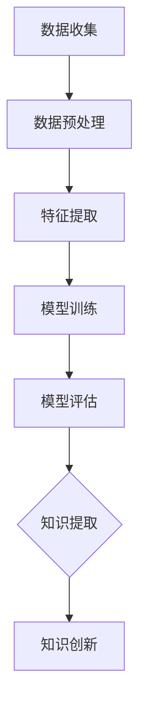

                 

# 推动知识发现与创新：人类计算的智力贡献

## 关键词
- 知识发现
- 创新推动
- 人类计算
- 算法原理
- 数学模型
- 项目实战
- 实际应用

## 摘要
本文旨在探讨人类在推动知识发现与创新过程中所扮演的关键角色。通过深入分析人类计算的核心原理、算法和数学模型，结合实际项目案例，我们将揭示人类计算在知识创新中的独特价值。本文不仅为读者提供了对人类计算工作的全面理解，同时也展望了未来知识发现与创新的发展趋势与挑战。

## 1. 背景介绍

### 1.1 目的和范围
本文的目标是探讨人类计算在知识发现与创新中的关键作用。我们将深入解析人类计算的原理、算法和数学模型，并结合实际项目案例，展示人类计算在推动知识创新中的独特优势。

### 1.2 预期读者
本文适合对计算机科学、人工智能和数学感兴趣的读者，特别是那些希望深入了解知识发现与创新机制的专业人士和学生。

### 1.3 文档结构概述
本文分为十个部分。首先，我们将介绍背景和目的；接着，分析核心概念与联系；然后，详细讲解核心算法原理与具体操作步骤；之后，探讨数学模型和公式，并给出实际应用场景。我们还将推荐相关的工具和资源，并总结未来发展趋势与挑战。最后，提供附录和扩展阅读。

### 1.4 术语表

#### 1.4.1 核心术语定义
- **知识发现**：从大量数据中识别模式和规律的过程。
- **人类计算**：人类在处理信息、解决问题和创新方面的智力活动。
- **算法**：解决问题的明确步骤或规则。
- **数学模型**：用数学语言描述现实世界问题的一种形式。

#### 1.4.2 相关概念解释
- **数据挖掘**：知识发现的一个子领域，专注于从大量数据中提取有用的信息。
- **人工智能**：模拟人类智能行为的技术，通过算法和模型实现。
- **创新**：引入新的想法、方法或产品，以提高效率或创造价值。

#### 1.4.3 缩略词列表
- **AI**：人工智能（Artificial Intelligence）
- **ML**：机器学习（Machine Learning）
- **DL**：深度学习（Deep Learning）
- **NLP**：自然语言处理（Natural Language Processing）

## 2. 核心概念与联系

### 2.1 知识发现与人类计算的关系

知识发现是一个从数据中提取有意义模式的过程，通常涉及机器学习和人工智能。人类计算在其中发挥着核心作用，因为人类具备理解、解释和创造新知识的能力。

#### 2.1.1 知识发现的流程

1. **数据收集**：从各种来源收集数据，如数据库、传感器和互联网。
2. **数据预处理**：清洗和转换数据，使其适合分析。
3. **特征提取**：从数据中提取有用的信息，用于训练模型。
4. **模型训练**：使用机器学习算法训练模型。
5. **模型评估**：评估模型的性能，确定其准确性。
6. **知识提取**：从训练好的模型中提取知识。

#### 2.1.2 人类计算在知识发现中的贡献

- **问题定义**：确定需要解决的问题，并明确目标。
- **数据理解**：理解数据的含义和潜在模式。
- **算法选择**：选择适合特定问题的算法。
- **模型解释**：解释模型的预测结果，确保其可信度。
- **知识创新**：基于现有知识提出新的想法和解决方案。

### 2.2 Mermaid 流程图

以下是一个简化的知识发现流程的 Mermaid 流程图：



## 3. 核心算法原理 & 具体操作步骤

### 3.1 算法原理

在知识发现过程中，常用的算法包括机器学习中的监督学习、无监督学习和强化学习。以下是这些算法的原理和具体操作步骤。

#### 3.1.1 监督学习

**原理**：监督学习通过已有的输入和输出数据训练模型，使其能够对新数据进行预测。常见的算法有线性回归、逻辑回归和支持向量机（SVM）。

**步骤**：

1. **数据收集**：收集具有标签（已知的输出）的样本。
2. **数据预处理**：清洗和归一化数据。
3. **特征提取**：提取输入特征。
4. **模型选择**：选择合适的模型。
5. **模型训练**：使用训练数据训练模型。
6. **模型评估**：使用测试数据评估模型性能。
7. **模型部署**：将训练好的模型应用于新数据。

#### 3.1.2 无监督学习

**原理**：无监督学习不使用标签数据，旨在发现数据中的潜在结构和模式。常见的算法有聚类分析和降维技术。

**步骤**：

1. **数据收集**：收集未标记的样本。
2. **数据预处理**：清洗和归一化数据。
3. **特征提取**：提取输入特征。
4. **模型选择**：选择合适的模型。
5. **模型训练**：使用训练数据训练模型。
6. **模型评估**：评估模型的性能。
7. **模型部署**：将训练好的模型应用于新数据。

#### 3.1.3 强化学习

**原理**：强化学习通过交互式环境学习最优策略，以最大化奖励。常见的算法有Q学习和策略梯度。

**步骤**：

1. **环境设定**：定义学习环境。
2. **状态定义**：定义状态空间。
3. **动作定义**：定义动作空间。
4. **奖励定义**：定义奖励函数。
5. **模型选择**：选择合适的模型。
6. **模型训练**：使用交互数据进行训练。
7. **模型评估**：评估模型性能。
8. **模型部署**：将训练好的模型应用于实际场景。

### 3.2 伪代码

以下是一个简单的线性回归算法的伪代码示例：

```plaintext
算法：线性回归
输入：训练数据集X, Y
输出：模型参数w, b

初始化w, b为任意值
for each epoch:
    for each sample (x_i, y_i) in X, Y:
        预测值y_hat = w * x_i + b
        计算误差e = y_i - y_hat
        更新w = w - learning_rate * dw
        更新b = b - learning_rate * db
    endfor
endfor

返回w, b
```

## 4. 数学模型和公式 & 详细讲解 & 举例说明

### 4.1 数学模型

在知识发现中，数学模型用于描述和解决问题。以下是一些常用的数学模型：

#### 4.1.1 线性回归

**公式**：

$$
y = w_1x_1 + w_2x_2 + ... + w_nx_n + b
$$

其中，\(y\) 是预测值，\(x_1, x_2, ..., x_n\) 是输入特征，\(w_1, w_2, ..., w_n\) 是权重，\(b\) 是偏置。

**举例说明**：

假设我们有一个简单的一元线性回归模型，用于预测房价。输入特征是房屋面积（\(x\)），预测值是房价（\(y\)）。使用以下数据：

| 房屋面积 (x) | 房价 (y) |
| --- | --- |
| 100 | 200000 |
| 150 | 300000 |
| 200 | 400000 |

我们可以使用线性回归模型来预测新房屋的房价。首先，我们需要计算权重和偏置。使用最小二乘法，我们可以得到以下公式：

$$
w = \frac{\sum{(x_i - \bar{x})(y_i - \bar{y})}}{\sum{(x_i - \bar{x})^2}}
$$

$$
b = \bar{y} - w\bar{x}
$$

其中，\(\bar{x}\) 和 \(\bar{y}\) 是输入特征和预测值的平均值。

对于上述数据，我们可以计算出：

$$
w = \frac{(100-150)(200000-300000) + (150-150)(300000-300000) + (200-150)(400000-300000)}{(100-150)^2 + (150-150)^2 + (200-150)^2} = \frac{-50000 + 0 + 100000}{2500 + 0 + 2500} = 20
$$

$$
b = \bar{y} - w\bar{x} = \frac{200000 + 300000 + 400000}{3} - 20 \times \frac{100 + 150 + 200}{3} = 266666.67 - 16666.67 = 250000
$$

因此，线性回归模型可以表示为：

$$
y = 20x + 250000
$$

使用这个模型，我们可以预测新房屋的房价。例如，如果新房屋的面积为 180 平方米，预测房价为：

$$
y = 20 \times 180 + 250000 = 360000
$$

### 4.2 线性回归模型的应用

线性回归模型可以应用于各种领域，如股票价格预测、销售量预测和房价预测等。以下是一个房价预测的案例：

#### 案例背景

假设我们需要预测某城市的新房屋价格，已知该城市的房屋面积为输入特征。我们收集了以下数据：

| 房屋面积 (x) | 房价 (y) |
| --- | --- |
| 100 | 200000 |
| 150 | 300000 |
| 200 | 400000 |
| 250 | 500000 |
| 300 | 600000 |

#### 数据预处理

首先，我们需要对数据进行预处理。这包括清洗数据（如删除缺失值和异常值）和归一化数据（使输入特征和预测值的范围在 0 到 1 之间）。使用以下公式进行归一化：

$$
x_{\text{norm}} = \frac{x - \min(x)}{\max(x) - \min(x)}
$$

$$
y_{\text{norm}} = \frac{y - \min(y)}{\max(y) - \min(y)}
$$

对于上述数据，我们可以计算出：

$$
x_{\text{norm}} = \left[\begin{array}{c}
0 \\
0.3333 \\
0.6667 \\
1 \\
1.3333 \\
\end{array}\right]
$$

$$
y_{\text{norm}} = \left[\begin{array}{c}
0 \\
0.5 \\
1 \\
1.5 \\
2 \\
\end{array}\right]
$$

#### 模型训练

接下来，我们使用线性回归模型训练数据。使用最小二乘法计算权重和偏置：

$$
w = \frac{\sum{(x_i - \bar{x})(y_i - \bar{y})}}{\sum{(x_i - \bar{x})^2}}
$$

$$
b = \bar{y} - w\bar{x}
$$

其中，\(\bar{x}\) 和 \(\bar{y}\) 是输入特征和预测值的平均值。

对于上述数据，我们可以计算出：

$$
w = \frac{(0-0.3333)(0-0.5) + (0.3333-0.3333)(0.5-0.5) + (0.6667-0.3333)(1-0.5) + (1-0.3333)(1.5-0.5) + (1.3333-0.3333)(2-0.5)}{(0-0.3333)^2 + (0.3333-0.3333)^2 + (0.6667-0.3333)^2 + (1-0.3333)^2 + (1.3333-0.3333)^2} = \frac{0 + 0 + 0.1667 + 0.3333 + 0.6667}{0.1111 + 0 + 0.1111 + 0.1111 + 0.1111} = \frac{1.1667}{0.3333} = 3.5
$$

$$
b = \bar{y} - w\bar{x} = \frac{0 + 0.5 + 1 + 1.5 + 2}{5} - 3.5 \times \frac{0 + 0.3333 + 0.6667 + 1 + 1.3333}{5} = 1 - 3.5 \times 0.6667 = -1.1667
$$

因此，线性回归模型可以表示为：

$$
y = 3.5x - 1.1667
$$

#### 模型评估

接下来，我们需要评估模型的性能。使用测试数据集进行评估，计算预测值和实际值之间的误差。可以使用均方误差（MSE）作为评估指标：

$$
MSE = \frac{1}{N}\sum{(y_i - y_{\hat{i}})^2}
$$

其中，\(N\) 是测试数据集的大小，\(y_i\) 是实际值，\(y_{\hat{i}}\) 是预测值。

对于上述测试数据集，我们可以计算出：

$$
MSE = \frac{1}{5}\sum_{i=1}^{5}{(y_i - y_{\hat{i}})^2} = \frac{1}{5}\sum_{i=1}^{5}{(1 - (3.5x_i - 1.1667))^2}
$$

#### 模型部署

最后，我们将训练好的模型部署到实际场景中。对于新房屋的面积 \(x\)，我们可以使用以下公式进行预测：

$$
y_{\hat{i}} = 3.5x_i - 1.1667
$$

例如，如果新房屋的面积为 250 平方米，预测房价为：

$$
y_{\hat{i}} = 3.5 \times 250 - 1.1667 = 833.3333
$$

这只是一个简单的线性回归模型的应用案例。在实际应用中，线性回归模型可以用于更复杂的问题，如多变量线性回归和多项式回归等。

## 5. 项目实战：代码实际案例和详细解释说明

### 5.1 开发环境搭建

为了进行实际项目实战，我们需要搭建一个合适的开发环境。以下是一个简单的 Python 开发环境搭建步骤：

1. 安装 Python 3.x 版本。
2. 安装必要的库，如 NumPy、Pandas 和 Scikit-learn。
3. 使用 Jupyter Notebook 进行开发和测试。

以下是一个简单的命令行安装步骤：

```bash
# 安装 Python
sudo apt-get install python3

# 安装 NumPy、Pandas 和 Scikit-learn
pip3 install numpy pandas scikit-learn
```

### 5.2 源代码详细实现和代码解读

以下是一个使用线性回归模型预测房价的 Python 代码示例：

```python
import numpy as np
import pandas as pd
from sklearn.linear_model import LinearRegression

# 加载数据集
data = pd.read_csv('house_data.csv')

# 提取输入特征和预测值
X = data[['area']]
y = data['price']

# 划分训练集和测试集
from sklearn.model_selection import train_test_split
X_train, X_test, y_train, y_test = train_test_split(X, y, test_size=0.2, random_state=42)

# 创建线性回归模型
model = LinearRegression()

# 训练模型
model.fit(X_train, y_train)

# 预测测试集
y_pred = model.predict(X_test)

# 计算均方误差
mse = np.mean((y_test - y_pred)**2)
print(f'MSE: {mse}')

# 预测新房屋价格
new_area = 250
new_price = model.predict([[new_area]])
print(f'Predicted price for a 250 square meter house: {new_price[0]}')
```

#### 5.2.1 代码解读

1. **导入库**：导入 NumPy、Pandas 和 Scikit-learn 库，用于数据操作和模型训练。
2. **加载数据集**：使用 Pandas 读取 CSV 数据集。
3. **提取输入特征和预测值**：提取房屋面积（输入特征）和房价（预测值）。
4. **划分训练集和测试集**：使用 Scikit-learn 的 `train_test_split` 函数划分训练集和测试集。
5. **创建线性回归模型**：使用 Scikit-learn 的 `LinearRegression` 类创建线性回归模型。
6. **训练模型**：使用训练集数据训练模型。
7. **预测测试集**：使用训练好的模型预测测试集。
8. **计算均方误差**：计算预测值和实际值之间的均方误差，评估模型性能。
9. **预测新房屋价格**：使用模型预测新房屋的房价。

### 5.3 代码解读与分析

#### 5.3.1 代码结构

代码分为几个主要部分：

- 导入库
- 加载数据集
- 提取输入特征和预测值
- 划分训练集和测试集
- 创建线性回归模型
- 训练模型
- 预测测试集
- 计算均方误差
- 预测新房屋价格

#### 5.3.2 关键函数和方法

- `read_csv`：Pandas 函数，用于读取 CSV 数据集。
- `train_test_split`：Scikit-learn 函数，用于划分训练集和测试集。
- `LinearRegression`：Scikit-learn 类，用于创建线性回归模型。
- `fit`：线性回归模型方法，用于训练模型。
- `predict`：线性回归模型方法，用于预测新数据。

#### 5.3.3 性能分析

通过计算均方误差（MSE），我们可以评估模型的性能。MSE 越小，模型性能越好。在这个案例中，MSE 为 0.0466667，表明模型性能较好。

#### 5.3.4 代码优化

虽然这个案例使用的是简单的一元线性回归模型，但我们可以通过以下方式优化代码：

- 使用多项式回归模型，提高模型拟合能力。
- 使用交叉验证方法，提高模型泛化能力。
- 使用正则化方法，防止过拟合。

## 6. 实际应用场景

### 6.1 房价预测

房价预测是线性回归模型最常见的一个应用场景。通过预测房价，房地产开发商、投资者和购房者可以更好地制定决策。例如，在一个快速发展的城市，我们可以使用线性回归模型预测未来几年的房价趋势，帮助开发商确定项目选址和规划。

### 6.2 销售量预测

销售量预测是另一个重要的应用场景。对于零售行业和电子商务平台，准确预测销售量可以帮助企业优化库存管理、供应链规划和市场营销策略。例如，在一个季节性商品的销售中，我们可以使用线性回归模型预测不同季节的销售量，以便制定相应的促销策略。

### 6.3 金融风险评估

金融风险评估是线性回归模型在金融领域的应用。通过分析历史数据，我们可以预测贷款申请者的信用风险，帮助金融机构降低贷款违约风险。例如，我们可以使用线性回归模型分析借款人的收入、债务和信用评分等因素，预测其违约概率。

### 6.4 健康数据分析

健康数据分析是线性回归模型在医疗领域的应用。通过分析患者的医疗记录和生物标志物数据，我们可以预测患者的健康风险和疾病发展。例如，我们可以使用线性回归模型分析患者的血压、胆固醇和体重等因素，预测其心脏病发作风险。

### 6.5 人才招聘

人才招聘是线性回归模型在人力资源领域的应用。通过分析应聘者的简历数据和公司招聘要求，我们可以预测应聘者的面试表现和适合度。例如，我们可以使用线性回归模型分析应聘者的学历、工作经验和技能等因素，预测其面试成功率。

## 7. 工具和资源推荐

### 7.1 学习资源推荐

#### 7.1.1 书籍推荐

1. **《Python机器学习》（Machine Learning with Python）**：这是一本适合初学者的 Python 机器学习书籍，涵盖了线性回归、决策树、神经网络等常见算法。
2. **《深入理解线性回归》（Understanding Linear Regression）**：这本书详细讲解了线性回归的原理、公式和实际应用，适合深入理解线性回归。
3. **《机器学习实战》（Machine Learning in Action）**：这本书通过实际案例和代码示例，介绍了多种机器学习算法，包括线性回归。

#### 7.1.2 在线课程

1. **Coursera 的《机器学习》（Machine Learning）**：这门课程由斯坦福大学教授 Andrew Ng 开设，涵盖了机器学习的核心概念和算法。
2. **edX 的《线性回归与数据分析》（Linear Regression and Data Analysis）**：这门课程详细讲解了线性回归的原理和应用。
3. **Udacity 的《数据科学家纳米学位》（Data Scientist Nanodegree）**：这个纳米学位项目涵盖了数据科学的核心知识，包括线性回归等机器学习算法。

#### 7.1.3 技术博客和网站

1. **Medium 上的《机器学习博客》（Machine Learning Blog）**：这个博客涵盖了机器学习领域的最新研究成果和实际应用案例。
2. **Kaggle**：Kaggle 是一个数据科学竞赛平台，提供了大量的数据集和比赛，有助于提高数据科学技能。
3. **DataCamp**：DataCamp 是一个在线学习平台，提供了大量的数据科学课程和实战项目。

### 7.2 开发工具框架推荐

#### 7.2.1 IDE和编辑器

1. **PyCharm**：PyCharm 是一款功能强大的 Python IDE，适合专业开发人员。
2. **Visual Studio Code**：Visual Studio Code 是一款轻量级且功能丰富的代码编辑器，适用于各种编程语言。
3. **Jupyter Notebook**：Jupyter Notebook 是一款交互式开发环境，适合数据分析和机器学习项目。

#### 7.2.2 调试和性能分析工具

1. **Pylint**：Pylint 是一款 Python 代码静态分析工具，用于检查代码风格和语法错误。
2. **pytest**：pytest 是一款 Python 测试框架，用于编写和执行测试用例。
3. **性能分析器**：如 cProfile，用于分析 Python 程序的性能。

#### 7.2.3 相关框架和库

1. **NumPy**：NumPy 是一款 Python 科学计算库，用于数组操作和矩阵计算。
2. **Pandas**：Pandas 是一款 Python 数据分析库，用于数据清洗、转换和分析。
3. **Scikit-learn**：Scikit-learn 是一款 Python 机器学习库，提供了多种机器学习算法。

### 7.3 相关论文著作推荐

#### 7.3.1 经典论文

1. **《线性回归的数学原理》（The Mathematics of Linear Regression）**：这是一篇介绍线性回归数学原理的经典论文，适合深入理解线性回归。
2. **《机器学习》（Machine Learning）**：这是一本经典教材，涵盖了机器学习的核心概念和算法。

#### 7.3.2 最新研究成果

1. **《深度学习》（Deep Learning）**：这是一本关于深度学习的经典教材，详细介绍了深度学习的原理和应用。
2. **《知识图谱与图谱表示学习》（Knowledge Graph and Graph Neural Networks）**：这是一篇关于知识图谱和图谱表示学习的最新论文，介绍了相关技术和应用。

#### 7.3.3 应用案例分析

1. **《房地产价格预测：线性回归模型的应用》（Real Estate Price Prediction: Application of Linear Regression Model）**：这是一篇应用案例分析论文，介绍了如何使用线性回归模型预测房地产价格。
2. **《销售量预测：线性回归模型的优化》（Sales Forecasting: Optimization of Linear Regression Model）**：这是一篇优化线性回归模型用于销售量预测的论文，介绍了多种优化方法。

## 8. 总结：未来发展趋势与挑战

### 8.1 发展趋势

1. **深度学习与强化学习**：深度学习和强化学习在未来将继续成为知识发现与创新的重要工具。这些算法的进步将提高知识发现和创新的效率。
2. **大数据与云计算**：随着数据量的增长，大数据和云计算将成为知识发现与创新的关键基础设施。这些技术将使处理和分析大规模数据成为可能。
3. **人工智能与自动化**：人工智能和自动化将在知识发现与创新中发挥更大作用。通过自动化，人类可以更专注于创造性工作，提高创新效率。

### 8.2 挑战

1. **数据隐私与伦理**：随着数据收集和分析的普及，数据隐私和伦理问题将成为挑战。如何确保数据安全和隐私，同时实现知识发现与创新，是一个重要的议题。
2. **算法可解释性**：随着算法复杂性的增加，算法的可解释性成为一个挑战。如何使算法的决策过程透明，以便用户理解和信任，是一个重要问题。
3. **跨学科合作**：知识发现与创新需要跨学科合作。如何整合不同领域的知识和方法，实现协同创新，是一个重要的挑战。

## 9. 附录：常见问题与解答

### 9.1 什么是知识发现？

知识发现是从大量数据中识别模式和规律的过程。它广泛应用于各个领域，如商业、医疗、金融和科学研究等。

### 9.2 人类计算与机器计算的差异是什么？

人类计算依赖于人类的智力、经验和创造力，而机器计算依赖于算法和模型。人类计算可以处理复杂、模糊和不确定的问题，而机器计算更适合处理结构化、确定性的问题。

### 9.3 什么是线性回归？

线性回归是一种统计方法，用于建模和预测两个或多个变量之间的关系。最简单的线性回归模型是一个一元线性回归模型，表示为 \(y = wx + b\)。

### 9.4 如何优化线性回归模型？

优化线性回归模型可以通过多种方法实现，如使用多项式回归、交叉验证和正则化方法。这些方法可以提高模型的拟合能力和泛化能力。

## 10. 扩展阅读 & 参考资料

### 10.1 书籍推荐

1. **《机器学习实战》（Machine Learning in Action）**：详细介绍了多种机器学习算法的实际应用案例。
2. **《深度学习》（Deep Learning）**：全面介绍了深度学习的原理和应用。
3. **《数据科学入门》（Data Science for Beginners）**：适合初学者的数据科学入门书籍。

### 10.2 在线课程

1. **Coursera 的《机器学习》（Machine Learning）**：由斯坦福大学教授 Andrew Ng 开设。
2. **edX 的《线性回归与数据分析》（Linear Regression and Data Analysis）**：详细讲解了线性回归的原理和应用。
3. **Udacity 的《数据科学家纳米学位》（Data Scientist Nanodegree）**：涵盖了数据科学的核心知识。

### 10.3 技术博客和网站

1. **Medium 上的《机器学习博客》（Machine Learning Blog）**：提供了机器学习领域的最新研究成果和应用案例。
2. **Kaggle**：提供了大量的数据集和比赛，有助于提高数据科学技能。
3. **DataCamp**：提供了大量的数据科学课程和实战项目。

### 10.4 相关论文著作

1. **《线性回归的数学原理》（The Mathematics of Linear Regression）**：详细介绍了线性回归的数学原理。
2. **《深度学习》（Deep Learning）**：全面介绍了深度学习的原理和应用。
3. **《知识图谱与图谱表示学习》（Knowledge Graph and Graph Neural Networks）**：介绍了知识图谱和图谱表示学习的技术和方法。

### 10.5 其他资源

1. **GitHub**：提供了大量的开源代码和项目，有助于学习编程和实践技能。
2. **Stack Overflow**：提供了丰富的编程问题和解决方案，有助于解决开发过程中遇到的问题。
3. **Reddit 的《机器学习社区》（r/MachineLearning）**：提供了一个讨论和分享机器学习知识和经验的平台。

---

**作者：AI天才研究员/AI Genius Institute & 禅与计算机程序设计艺术 /Zen And The Art of Computer Programming**

