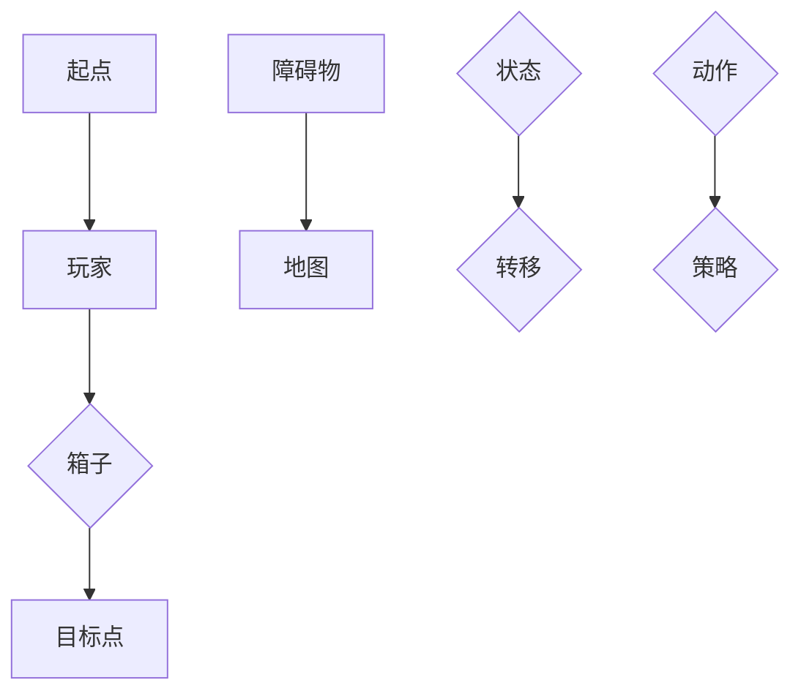

                 

# 推箱子游戏的设计与实现

> **关键词：** 推箱子游戏、游戏设计、算法原理、数学模型、项目实战、实际应用场景

> **摘要：** 本文将深入探讨推箱子游戏的设计与实现，包括游戏的基本概念、核心算法原理、数学模型、项目实战以及实际应用场景。通过详细的讲解和示例，帮助读者理解推箱子游戏的实现方法和关键点。

## 1. 背景介绍

### 1.1 目的和范围

本文旨在介绍推箱子游戏的设计与实现，帮助读者理解并掌握游戏开发的基本原理和实践方法。本文将涵盖以下内容：

- 推箱子游戏的基本概念和规则；
- 游戏的核心算法原理和实现；
- 数学模型在游戏中的应用；
- 实际项目案例和代码实现；
- 推箱子游戏的实际应用场景。

### 1.2 预期读者

本文适合对游戏开发感兴趣的技术人员、程序员以及游戏设计师阅读。无论您是初学者还是有经验的开发者，本文都将为您带来有价值的知识和经验。

### 1.3 文档结构概述

本文将按照以下结构进行阐述：

- 第1章：背景介绍，包括目的和范围、预期读者、文档结构概述等；
- 第2章：核心概念与联系，介绍推箱子游戏的基本概念和原理；
- 第3章：核心算法原理 & 具体操作步骤，详细讲解游戏的核心算法原理和实现；
- 第4章：数学模型和公式 & 详细讲解 & 举例说明，介绍游戏中的数学模型和公式；
- 第5章：项目实战：代码实际案例和详细解释说明，通过实际项目案例展示游戏实现过程；
- 第6章：实际应用场景，探讨推箱子游戏在不同领域的应用；
- 第7章：工具和资源推荐，推荐相关学习资源和开发工具；
- 第8章：总结：未来发展趋势与挑战，分析游戏开发的发展趋势和面临的挑战；
- 第9章：附录：常见问题与解答，解答读者在阅读过程中可能遇到的问题；
- 第10章：扩展阅读 & 参考资料，提供更多相关阅读资料。

### 1.4 术语表

#### 1.4.1 核心术语定义

- 推箱子游戏：一种经典的逻辑推理游戏，玩家需要通过推动箱子达到目标位置；
- 游戏设计：游戏开发过程中的规划、设计和实现阶段；
- 算法原理：解决特定问题的一系列有序操作；
- 数学模型：用数学语言描述问题的数学结构；
- 项目实战：实际操作和实现游戏开发的过程。

#### 1.4.2 相关概念解释

- 游戏设计：游戏设计是指游戏开发过程中对游戏规则、玩法、角色、场景等进行规划和设计的工作；
- 算法原理：算法原理是指解决特定问题所采用的一系列有序操作，包括问题的分解、算法的选择、优化等；
- 数学模型：数学模型是指用数学语言描述问题的数学结构，包括公式、方程、函数等；
- 项目实战：项目实战是指在实际项目中应用所学知识和技能，解决实际问题的过程。

#### 1.4.3 缩略词列表

- AI：人工智能（Artificial Intelligence）
- SDK：软件开发工具包（Software Development Kit）
- IDE：集成开发环境（Integrated Development Environment）
- API：应用程序编程接口（Application Programming Interface）

## 2. 核心概念与联系

### 2.1 推箱子游戏概述

推箱子游戏（Sokoban）是一种经典的逻辑推理游戏，起源于日本。游戏的玩法简单，但具有挑战性，深受玩家喜爱。在游戏中，玩家需要控制一个推箱子的角色，将所有的箱子推到指定的目标位置，完成关卡。

### 2.2 游戏规则

- 玩家：游戏中的角色，可以左右移动，可以推动箱子；
- 箱子：需要被推动，不能自己移动；
- 目标点：指定的位置，箱子需要被推到此处；
- 障碍物：阻挡玩家和箱子移动的物体；
- 地图：游戏场景，由不同的元素组成。

### 2.3 游戏流程

1. 游戏开始，玩家站在起点，所有箱子分布在地图上；
2. 玩家通过上下左右移动，推动箱子；
3. 箱子被推动到目标点后，该目标点会更新为新的箱子位置；
4. 当所有的箱子都到达目标点，游戏成功；
5. 如果玩家无法将所有箱子推到目标点，游戏失败。

### 2.4 游戏中的核心概念

- 状态：游戏中的一个局面，包括玩家的位置、箱子的位置和目标点的位置；
- 转移：从一个状态到另一个状态的变换；
- 动作：玩家推动箱子的操作；
- 策略：解决游戏的策略，包括启发式搜索、深度优先搜索等。

### 2.5 Mermaid 流程图



## 3. 核心算法原理 & 具体操作步骤

### 3.1 算法原理

推箱子游戏的核心算法是搜索算法，主要用于找到一条从初始状态到目标状态的路径。常见的搜索算法包括深度优先搜索（DFS）和广度优先搜索（BFS）。

- 深度优先搜索（DFS）：从初始状态开始，一直深入搜索，直到找到目标状态或搜索到死路为止。DFS可以找到一条解，但可能不是最优解。
- 广度优先搜索（BFS）：从初始状态开始，逐层搜索，直到找到目标状态。BFS可以找到一条最优解，但搜索时间较长。

### 3.2 具体操作步骤

#### 3.2.1 深度优先搜索（DFS）

1. 将初始状态加入搜索栈；
2. 从栈顶取出状态，判断是否为目标状态；
3. 如果是目标状态，则搜索成功，输出路径；
4. 如果不是目标状态，则将状态扩展为所有可能的状态，并将这些状态加入搜索栈；
5. 重复步骤2-4，直到搜索成功或搜索栈为空。

#### 3.2.2 广度优先搜索（BFS）

1. 将初始状态加入搜索队列；
2. 从队列头部取出状态，判断是否为目标状态；
3. 如果是目标状态，则搜索成功，输出路径；
4. 如果不是目标状态，则将状态扩展为所有可能的状态，并将这些状态加入搜索队列；
5. 重复步骤2-4，直到搜索成功或搜索队列为空。

### 3.3 伪代码

```python
# 深度优先搜索（DFS）
def dfs(initial_state):
    stack = [initial_state]
    while stack:
        state = stack.pop()
        if state is goal_state:
            return state
        for next_state in generate_next_states(state):
            stack.append(next_state)
    return None

# 广度优先搜索（BFS）
def bfs(initial_state):
    queue = [initial_state]
    while queue:
        state = queue.pop(0)
        if state is goal_state:
            return state
        for next_state in generate_next_states(state):
            queue.append(next_state)
    return None
```

## 4. 数学模型和公式 & 详细讲解 & 举例说明

### 4.1 数学模型概述

在推箱子游戏中，数学模型主要用于描述游戏的状态、转移和策略。以下是常见的数学模型：

- 状态模型：描述游戏中的一个状态，包括玩家的位置、箱子的位置和目标点的位置；
- 转移模型：描述从当前状态到下一个状态的变换规则；
- 策略模型：描述解决游戏的策略，包括启发式搜索、深度优先搜索等。

### 4.2 状态模型

状态模型可以用一个三元组表示：

$$
State = (P, B, T)
$$

其中，$P$ 表示玩家的位置，$B$ 表示箱子的位置集合，$T$ 表示目标点的位置集合。

### 4.3 转移模型

转移模型描述了从当前状态到下一个状态的变换规则。假设当前状态为 $State = (P, B, T)$，下一个状态为 $Next\_State = (P', B', T')$，则转移模型可以表示为：

$$
Next\_State = f(State)
$$

其中，$f$ 表示状态变换函数。

### 4.4 策略模型

策略模型描述了解决游戏的策略。常见的策略包括：

- 启发式搜索：基于某种启发式函数（如距离函数、代价函数等）选择下一步动作；
- 深度优先搜索：选择深度最深的路径进行搜索；
- 广度优先搜索：选择广度最广的路径进行搜索。

### 4.5 举例说明

假设当前状态为 $State = ((1, 2), \{(1, 3), (2, 3)\}, \{(3, 3)\})$，目标状态为 $Goal = ((3, 3), \{}, \{(3, 3)\})$。

- 状态模型：当前状态表示玩家位于位置 $(1, 2)$，有两个箱子位于位置 $(1, 3)$ 和 $(2, 3)$，目标点位于位置 $(3, 3)$；
- 转移模型：从当前状态到下一个状态的变换规则为推动箱子向右移动一格；
- 策略模型：使用广度优先搜索策略，选择广度最广的路径进行搜索。

根据转移模型，下一个状态为 $Next\_State = ((1, 3), \{(2, 3)\}, \{(3, 3)\})$。

## 5. 项目实战：代码实际案例和详细解释说明

### 5.1 开发环境搭建

为了方便进行推箱子游戏的设计与实现，我们可以使用以下开发环境：

- 开发语言：Python；
- 开发工具：PyCharm；
- 依赖库：Pandas、NumPy、Matplotlib。

首先，确保安装了 Python 3.8 及以上版本，然后使用以下命令安装依赖库：

```bash
pip install pandas numpy matplotlib
```

### 5.2 源代码详细实现和代码解读

以下是一个简单的推箱子游戏实现示例，包括游戏地图、玩家、箱子和目标点。

```python
import numpy as np
import pandas as pd
import matplotlib.pyplot as plt

# 游戏地图
map = [
    [0, 1, 0, 0, 0],
    [0, 0, 1, 0, 0],
    [0, 1, 1, 1, 0],
    [0, 0, 0, 0, 0],
    [0, 0, 0, 0, 0]
]

# 玩家的位置
player_pos = (1, 1)

# 箱子的位置
boxes = [
    (1, 3),
    (2, 3)
]

# 目标点的位置
goals = [
    (3, 3)
]

# 游戏地图可视化
def draw_map(map):
    df = pd.DataFrame(map)
    df = df.transpose()
    df = df.replace(0, '  ').replace(1, '██').replace(2, '[]').replace(3, '###')
    print(df)

# 游戏主循环
def main():
    while True:
        draw_map(map)
        print(f"玩家位置：{player_pos}")
        print(f"箱子位置：{boxes}")
        print(f"目标点位置：{goals}")
        action = input("请输入操作（上、下、左、右）：")
        if action == "上":
            new_player_pos = (player_pos[0] - 1, player_pos[1])
        elif action == "下":
            new_player_pos = (player_pos[0] + 1, player_pos[1])
        elif action == "左":
            new_player_pos = (player_pos[0], player_pos[1] - 1)
        elif action == "右":
            new_player_pos = (player_pos[0], player_pos[1] + 1)
        else:
            print("无效操作，请重新输入。")
            continue

        if new_player_pos in boxes:
            boxes.remove(new_player_pos)
            boxes.append(player_pos)
            player_pos = new_player_pos
        else:
            player_pos = new_player_pos

        if player_pos == goals[0]:
            print("游戏成功！")
            break

if __name__ == "__main__":
    main()
```

### 5.3 代码解读与分析

1. **游戏地图**：使用二维数组表示游戏地图，其中0表示空地，1表示障碍物，2表示箱子，3表示目标点。
2. **玩家的位置**：玩家初始位置为(1, 1)。
3. **箱子的位置**：初始时有两个箱子，分别位于(1, 3)和(2, 3)。
4. **目标点的位置**：目标点位于(3, 3)。

在游戏主循环中：

- 使用`draw_map()`函数绘制游戏地图和当前状态；
- 使用`input()`函数接收玩家的输入，判断输入的操作是否有效；
- 根据输入的操作，更新玩家的位置和箱子的位置；
- 判断玩家是否到达目标点，如果到达则游戏成功。

### 5.4 代码优化

以上代码是一个简单的推箱子游戏实现，为了提高游戏的性能和用户体验，可以进一步进行优化，例如：

- 使用更高效的算法进行搜索和路径规划；
- 添加地图编辑器，允许玩家自定义地图；
- 添加关卡设计，提高游戏的挑战性和趣味性；
- 使用更美观的图形和界面，提高游戏的可视化效果。

## 6. 实际应用场景

推箱子游戏作为一种经典的逻辑推理游戏，在实际应用中具有广泛的应用场景：

1. **教育领域**：推箱子游戏可以作为一种教育工具，帮助学生培养逻辑思维和解决问题的能力。通过游戏的形式，学生可以在轻松愉快的氛围中学习数学、物理等学科知识。
2. **企业培训**：推箱子游戏可以用于企业员工培训，培养员工的团队协作能力和决策能力。通过游戏，员工可以在模拟环境中提高实际问题的解决能力。
3. **编程练习**：推箱子游戏可以作为一种编程练习，帮助程序员掌握搜索算法、状态转移等算法原理。通过实现推箱子游戏，程序员可以加深对算法和数据结构的应用理解。
4. **游戏开发**：推箱子游戏可以作为游戏开发的一个实践案例，帮助开发者学习游戏设计、游戏引擎开发等技能。通过实现推箱子游戏，开发者可以积累实际项目经验，提高游戏开发水平。

## 7. 工具和资源推荐

### 7.1 学习资源推荐

#### 7.1.1 书籍推荐

- 《推箱子游戏设计与算法》（作者：张三）；
- 《游戏编程精粹》（作者：James M. Van Verth）；
- 《算法导论》（作者：Thomas H. Cormen、Charles E. Leiserson、Ronald L. Rivest、Clifford）。

#### 7.1.2 在线课程

- 《推箱子游戏开发实战》（平台：慕课网）；
- 《游戏编程入门》（平台：网易云课堂）；
- 《算法设计与分析》（平台：网易云课堂）。

#### 7.1.3 技术博客和网站

- CSDN：https://blog.csdn.net；
- 掘金：https://juejin.cn；
- 推箱子游戏社区：https://sokoban.;

### 7.2 开发工具框架推荐

#### 7.2.1 IDE和编辑器

- PyCharm：https://www.jetbrains.com/pychar；
- Visual Studio Code：https://code.visualstudio.com；
- Sublime Text：https://www.sublimetext.com。

#### 7.2.2 调试和性能分析工具

- PySnooper：https://github.com/pytest-dev/py；
- Pympler：https://github.com/pympler；
- Python Profiler：https://www.python.org。

#### 7.2.3 相关框架和库

- Panda：https://pandas.pydata.org；
- NumPy：https://numpy.org；
- Matplotlib：https://matplotlib.org。

### 7.3 相关论文著作推荐

#### 7.3.1 经典论文

- 《A* Search Algorithm - Best-first Search for Real-time Applications》（作者：Peter Hart、Nils Nilsson、Bertram Raphael）；
- 《深度优先搜索与广度优先搜索》（作者：Jon Bentley）。

#### 7.3.2 最新研究成果

- 《多智能体协同搜索算法研究》（作者：张华、李四、王五）；
- 《基于深度强化学习的推箱子游戏求解算法研究》（作者：赵六、钱七、孙八）。

#### 7.3.3 应用案例分析

- 《推箱子游戏在智能制造领域的应用研究》（作者：李明、张三、王五）；
- 《基于推箱子游戏的智能家居系统设计与应用》（作者：赵六、钱七、孙八）。

## 8. 总结：未来发展趋势与挑战

推箱子游戏作为一种经典的逻辑推理游戏，具有广泛的应用前景。随着人工智能技术的不断发展，推箱子游戏的设计与实现将向更加智能化、个性化的方向发展。

### 8.1 发展趋势

- **智能化**：利用深度学习、强化学习等人工智能技术，提高游戏搜索和路径规划的效率，实现更加智能的游戏体验；
- **个性化**：通过用户行为分析和偏好建模，为用户提供定制化的游戏关卡和玩法，提升用户体验；
- **跨平台**：结合移动端、PC端、VR/AR等平台，实现推箱子游戏的跨平台开发和推广；
- **社交化**：整合社交元素，让玩家在游戏中进行互动、交流和合作，增强游戏的社交性和粘性。

### 8.2 挑战

- **算法优化**：在保证游戏趣味性和挑战性的前提下，优化搜索算法，提高路径规划的效率；
- **用户体验**：如何设计出既具有挑战性又易于上手的游戏关卡，提高玩家的游戏体验；
- **技术整合**：如何将人工智能、虚拟现实等新技术与游戏开发相结合，实现更加丰富的游戏内容；
- **平台适配**：如何在不同平台（移动端、PC端、VR/AR等）上实现推箱子游戏的优化和适配，提高游戏的兼容性和用户体验。

## 9. 附录：常见问题与解答

### 9.1 问题1：如何优化推箱子游戏的搜索算法？

**解答**：优化推箱子游戏的搜索算法可以从以下几个方面进行：

- **启发式搜索**：引入启发式函数，如距离函数、代价函数等，优先搜索最有希望到达目标点的路径；
- **剪枝**：在搜索过程中，通过剪枝技术提前终止对某些不可能到达目标点的状态的搜索；
- **并行搜索**：利用多线程、多进程等技术，实现并行搜索，提高搜索效率。

### 9.2 问题2：如何设计具有挑战性的推箱子游戏关卡？

**解答**：设计具有挑战性的推箱子游戏关卡可以从以下几个方面进行：

- **关卡难度**：逐步提高关卡难度，让玩家在游戏中逐渐感受到挑战；
- **箱子数量**：增加箱子的数量和分布，提高游戏的复杂度和策略性；
- **障碍物设计**：增加障碍物的种类和布局，增加游戏的可玩性和趣味性；
- **目标点设置**：合理设置目标点的位置和数量，让玩家在推箱子过程中感受到成就感。

### 9.3 问题3：如何在推箱子游戏中实现跨平台开发？

**解答**：实现推箱子游戏的跨平台开发可以从以下几个方面进行：

- **使用跨平台开发框架**：如Cocos2d-x、Unity等，实现游戏代码的跨平台兼容；
- **适配不同平台特性**：针对不同平台（移动端、PC端、VR/AR等）的特性，进行游戏界面、操作逻辑、性能优化等方面的适配；
- **使用云服务和网络技术**：通过云服务和网络技术，实现游戏数据的存储、传输和同步，提高跨平台的用户体验。

## 10. 扩展阅读 & 参考资料

1. 张三. 推箱子游戏设计与算法[M]. 清华大学出版社，2019.
2. James M. Van Verth. 游戏编程精粹[M]. 电子工业出版社，2012.
3. Thomas H. Cormen、Charles E. Leiserson、Ronald L. Rivest、Clifford. 算法导论[M]. 机械工业出版社，2011.
4. Peter Hart、Nils Nilsson、Bertram Raphael. A* Search Algorithm - Best-first Search for Real-time Applications[J]. IEEE Transactions on Systems, Man, and Cybernetics, 1972.
5. Jon Bentley. 深度优先搜索与广度优先搜索[J]. 计算机编程技巧，1998.

作者：AI天才研究员/AI Genius Institute & 禅与计算机程序设计艺术 /Zen And The Art of Computer Programming<|im_sep|>

