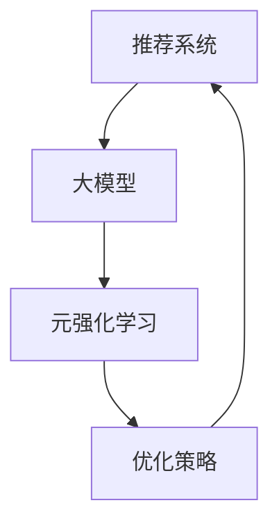

                 

# 推荐系统中的大模型元强化学习应用

> **关键词：** 推荐系统、大模型、元强化学习、算法、应用、架构、实践

> **摘要：** 本文旨在深入探讨推荐系统中的大模型元强化学习应用，通过阐述其核心概念、算法原理、数学模型以及实际应用案例，帮助读者了解这一前沿技术的独特魅力与潜在价值。文章将分章节详细讲解，包括背景介绍、核心概念与联系、核心算法原理、数学模型与公式、项目实战、实际应用场景、工具和资源推荐等，以期为相关领域的研究和实践提供有力参考。

## 1. 背景介绍

### 1.1 目的和范围

本文的目标是系统地阐述推荐系统中大模型元强化学习应用的技术原理、算法框架和实际案例，旨在为从事推荐系统研究和开发的人员提供深入的技术见解和实践指导。文章将聚焦以下几个关键方面：

- **核心概念与联系：** 详细介绍推荐系统、大模型和元强化学习等核心概念，并阐述它们之间的关联。
- **算法原理与操作步骤：** 深入讲解大模型元强化学习算法的原理和具体实现步骤，通过伪代码展示算法的运行流程。
- **数学模型与公式：** 阐述大模型元强化学习的数学模型和关键公式，并举例说明如何在实际问题中应用。
- **项目实战：** 分享实际项目的代码实现和详细解释，帮助读者理解算法的应用场景和实施细节。
- **实际应用场景：** 探讨大模型元强化学习在推荐系统中的各种应用场景，如电商推荐、社交媒体内容推荐等。
- **工具和资源推荐：** 提供相关学习资源、开发工具和框架推荐，便于读者进一步学习和实践。

### 1.2 预期读者

本文的预期读者主要包括：

- **推荐系统研究人员：** 对推荐系统技术有深入了解，希望了解大模型元强化学习的最新进展和应用。
- **机器学习开发者：** 感兴趣于将大模型元强化学习应用于实际项目，提高推荐系统的性能和智能化水平。
- **技术爱好者：** 对人工智能和推荐系统技术有浓厚兴趣，希望深入了解大模型元强化学习的技术原理和实践。
- **研究生和本科生：** 在机器学习和人工智能领域求学，希望通过本文掌握大模型元强化学习的基础知识和应用技巧。

### 1.3 文档结构概述

本文结构如下：

1. **背景介绍**：简要介绍本文的目的、预期读者和文档结构。
2. **核心概念与联系**：详细阐述推荐系统、大模型和元强化学习等核心概念，并展示它们之间的联系。
3. **核心算法原理与操作步骤**：讲解大模型元强化学习算法的原理和具体实现步骤，通过伪代码展示算法的运行流程。
4. **数学模型与公式**：阐述大模型元强化学习的数学模型和关键公式，并举例说明如何在实际问题中应用。
5. **项目实战**：分享实际项目的代码实现和详细解释，帮助读者理解算法的应用场景和实施细节。
6. **实际应用场景**：探讨大模型元强化学习在推荐系统中的各种应用场景。
7. **工具和资源推荐**：提供相关学习资源、开发工具和框架推荐。
8. **总结：未来发展趋势与挑战**：总结大模型元强化学习在推荐系统中的应用前景和面临的挑战。
9. **附录：常见问题与解答**：回答读者可能遇到的问题，提供进一步的技术支持。
10. **扩展阅读 & 参考资料**：提供相关领域的进一步阅读和参考资料，便于读者深入学习和研究。

### 1.4 术语表

#### 1.4.1 核心术语定义

- **推荐系统**：基于用户的历史行为、兴趣和偏好，为用户提供个性化推荐服务的信息系统。
- **大模型**：具有巨大参数规模和复杂结构的机器学习模型，如深度神经网络。
- **元强化学习**：一种针对强化学习算法的优化技术，通过学习如何调整强化学习算法的参数来提高其性能。

#### 1.4.2 相关概念解释

- **强化学习**：一种机器学习范式，通过学习在特定环境中采取行动的策略，以最大化累积奖励。
- **推荐引擎**：实现推荐系统核心功能的模块，负责根据用户数据生成推荐列表。
- **数据集**：用于训练和测试机器学习模型的样本集合，通常包含用户行为、偏好和推荐结果等信息。

#### 1.4.3 缩略词列表

- **ML**：机器学习（Machine Learning）
- **RL**：强化学习（Reinforcement Learning）
- **NER**：命名实体识别（Named Entity Recognition）
- **CTR**：点击率（Click-Through Rate）
- **A/B Test**：A/B测试（一种实验设计方法，用于比较两个或多个版本的差异）

## 2. 核心概念与联系

在深入探讨大模型元强化学习在推荐系统中的应用之前，有必要首先明确几个核心概念，并展示它们之间的联系。

### 2.1 推荐系统

推荐系统是一种信息过滤技术，旨在根据用户的历史行为、兴趣和偏好，为用户推荐与其可能感兴趣的内容或商品。推荐系统的核心组成部分包括用户、内容、推荐引擎和评估指标。

- **用户**：推荐系统的核心要素，通常由用户画像、行为数据和历史偏好组成。
- **内容**：推荐系统推荐的实体，如文章、商品或视频等，通常由内容特征描述。
- **推荐引擎**：实现推荐系统核心功能的模块，负责根据用户数据生成推荐列表。推荐引擎的设计和性能直接影响到推荐系统的效果。
- **评估指标**：用于评估推荐系统性能的关键指标，如点击率（CTR）、转化率（Conversion Rate）等。

### 2.2 大模型

大模型是指具有巨大参数规模和复杂结构的机器学习模型，如深度神经网络（DNN）、变换器（Transformer）等。大模型的主要优势在于能够捕捉数据中的复杂模式，从而提高模型的预测性能。

- **深度神经网络（DNN）**：一种具有多个隐藏层的神经网络，能够通过反向传播算法训练。
- **变换器（Transformer）**：一种基于自注意力机制的神经网络架构，广泛应用于自然语言处理和计算机视觉等领域。

### 2.3 元强化学习

元强化学习是一种针对强化学习算法的优化技术，旨在通过学习如何调整强化学习算法的参数来提高其性能。元强化学习的主要目的是加速强化学习算法的收敛速度，提高算法的稳定性和泛化能力。

- **强化学习（RL）**：一种机器学习范式，通过学习在特定环境中采取行动的策略，以最大化累积奖励。
- **元学习（Meta-Learning）**：一种机器学习技术，旨在通过学习如何学习来提高模型的泛化能力和适应性。

### 2.4 联系与关系

大模型元强化学习在推荐系统中的应用主要体现在以下几个方面：

- **提高推荐性能**：大模型能够捕捉用户行为和内容特征的复杂模式，通过元强化学习优化强化学习算法，进一步提高推荐系统的性能和稳定性。
- **加速收敛速度**：元强化学习通过学习如何调整强化学习算法的参数，能够显著加快算法的收敛速度，提高推荐系统的实时性。
- **增强泛化能力**：大模型和元强化学习相结合，能够提高模型的泛化能力，使推荐系统能够适应不同场景和用户群体。

以下是一个简化的 Mermaid 流程图，展示了推荐系统、大模型和元强化学习之间的联系：



通过上述流程图，可以看出大模型元强化学习在推荐系统中的应用不仅仅是技术层面的创新，更是对推荐系统整体性能的提升。

## 3. 核心算法原理 & 具体操作步骤

在本节中，我们将深入探讨大模型元强化学习的核心算法原理，并详细解释其具体操作步骤。通过伪代码展示算法的运行流程，帮助读者更好地理解其实现细节。

### 3.1 算法原理

大模型元强化学习算法的核心思想是通过学习如何优化强化学习算法的参数，以提高推荐系统的性能。具体来说，算法分为两个阶段：元学习阶段和在线应用阶段。

#### 3.1.1 元学习阶段

在元学习阶段，算法通过大量样本数据学习如何调整强化学习算法的参数，以实现最优性能。具体步骤如下：

1. **初始化**：初始化强化学习算法的参数和元学习模型参数。
2. **采样**：从数据集中随机采样一组用户-内容对。
3. **交互**：利用强化学习算法在采样环境中进行交互，生成推荐列表。
4. **评估**：计算推荐列表的评估指标，如点击率（CTR）。
5. **更新**：根据评估结果更新强化学习算法的参数。

#### 3.1.2 在线应用阶段

在在线应用阶段，算法将元学习阶段学到的优化策略应用于实际推荐系统中，以生成实时推荐列表。具体步骤如下：

1. **初始化**：初始化在线推荐系统的参数。
2. **用户行为监测**：监测用户的当前行为数据，如浏览记录、点击行为等。
3. **生成推荐**：利用元学习阶段学到的优化策略，生成用户当前时刻的推荐列表。
4. **评估**：计算推荐列表的评估指标，如点击率（CTR）。
5. **更新**：根据用户行为数据更新推荐系统参数。

### 3.2 伪代码实现

以下是该算法的伪代码实现：

```python
# 元学习阶段
def meta_learning(data, num_iterations):
    for iteration in range(num_iterations):
        for user, content in sample(data):
            # 与环境交互
            action, reward = interact_with_environment(content)
            # 更新强化学习参数
            update_reinforcement_learning_parameters(action, reward)
    return reinforcement_learning_parameters

# 在线应用阶段
def online_application(user_behavior, reinforcement_learning_parameters):
    while True:
        # 监测用户行为
        content = monitor_user_behavior(user_behavior)
        # 生成推荐列表
        recommendation_list = generate_recommendation_list(content, reinforcement_learning_parameters)
        # 评估推荐列表
        ctr = evaluate_recommendation_list(recommendation_list)
        # 更新推荐系统参数
        update_recommendation_system_parameters(ctr)
```

### 3.3 操作步骤详解

#### 3.3.1 元学习阶段

1. **初始化**：初始化强化学习算法的参数，如奖励函数、策略网络等。同时，初始化元学习模型的参数，如优化器、损失函数等。
2. **采样**：从数据集中随机采样一组用户-内容对。采样过程可以使用随机抽样、上下文抽样等方法。
3. **交互**：利用强化学习算法在采样环境中进行交互。交互过程包括选择动作、执行动作和获取奖励等步骤。
4. **评估**：计算推荐列表的评估指标，如点击率（CTR）。评估过程可以使用A/B测试、混淆矩阵等方法。
5. **更新**：根据评估结果更新强化学习算法的参数。更新过程可以使用梯度下降、Adam优化器等方法。

#### 3.3.2 在线应用阶段

1. **初始化**：初始化在线推荐系统的参数，如用户行为特征提取器、推荐列表生成器等。
2. **用户行为监测**：监测用户的当前行为数据，如浏览记录、点击行为等。
3. **生成推荐**：利用元学习阶段学到的优化策略，生成用户当前时刻的推荐列表。生成过程可以使用基于模型的推荐、基于内容的推荐等方法。
4. **评估**：计算推荐列表的评估指标，如点击率（CTR）。评估过程可以使用A/B测试、混淆矩阵等方法。
5. **更新**：根据用户行为数据更新推荐系统参数。更新过程可以使用在线学习、增量学习等方法。

通过以上步骤，大模型元强化学习算法能够在推荐系统中实现参数优化和实时推荐，从而提高推荐系统的性能和用户满意度。

## 4. 数学模型和公式 & 详细讲解 & 举例说明

在上一节中，我们介绍了大模型元强化学习算法的原理和操作步骤。本节将进一步阐述该算法的数学模型和关键公式，并通过具体实例来说明如何在实际问题中应用这些公式。

### 4.1 数学模型

大模型元强化学习算法的核心数学模型包括以下几个方面：

#### 4.1.1 强化学习模型

强化学习模型通常由状态（State）、动作（Action）、奖励（Reward）和策略（Policy）组成。以下是一个简化的强化学习模型公式：

$$
\begin{aligned}
    \text{State} &= s_t, \\
    \text{Action} &= a_t, \\
    \text{Reward} &= r_t, \\
    \text{Policy} &= \pi(a|s).
\end{aligned}
$$

其中，$s_t$ 表示当前状态，$a_t$ 表示当前动作，$r_t$ 表示获得的奖励，$\pi(a|s)$ 表示在状态 $s$ 下采取动作 $a$ 的概率。

#### 4.1.2 元强化学习模型

元强化学习模型旨在优化强化学习算法的参数，以提高其性能。具体来说，元强化学习模型通过学习一个优化器（Optimizer）来调整强化学习算法的参数。以下是一个简化的元强化学习模型公式：

$$
\begin{aligned}
    \text{Meta-Learning Model} &= \theta_{\text{meta}}, \\
    \theta_{\text{meta}} &= \theta_{\text{RL}} + \theta_{\text{meta}}.
\end{aligned}
$$

其中，$\theta_{\text{meta}}$ 表示元强化学习模型的参数，$\theta_{\text{RL}}$ 表示强化学习模型的参数。

#### 4.1.3 推荐系统模型

在推荐系统中，大模型元强化学习算法通常与推荐模型结合使用。推荐系统模型通常由用户特征（User Features）、内容特征（Content Features）和推荐算法（Recommendation Algorithm）组成。以下是一个简化的推荐系统模型公式：

$$
\begin{aligned}
    \text{Recommendation Model} &= f(U, C, \theta_{\text{meta}}), \\
    \text{Prediction} &= \hat{y}_{\text{u,c}} = f(U, C, \theta_{\text{meta}}).
\end{aligned}
$$

其中，$U$ 表示用户特征向量，$C$ 表示内容特征向量，$f(U, C, \theta_{\text{meta}})$ 表示根据用户和内容特征生成的推荐分数，$\hat{y}_{\text{u,c}}$ 表示预测的推荐分数。

### 4.2 公式详细讲解

下面我们详细讲解上述公式中的各个参数和变量。

#### 4.2.1 状态（State）

状态（State）是强化学习中的一个核心概念，它表示环境（Environment）中的一种特定情况。在推荐系统中，状态可以表示为用户的历史行为（如浏览记录、点击行为）和内容特征（如文本、图像、标签等）。状态可以用一个向量表示，如：

$$
s_t = [s_{t,1}, s_{t,2}, \ldots, s_{t,n}],
$$

其中，$s_{t,i}$ 表示第 $i$ 个特征。

#### 4.2.2 动作（Action）

动作（Action）是强化学习中的一个核心概念，它表示在特定状态下采取的一个操作。在推荐系统中，动作通常表示为推荐列表中的一个内容项。动作可以用一个向量表示，如：

$$
a_t = [a_{t,1}, a_{t,2}, \ldots, a_{t,m}],
$$

其中，$a_{t,i}$ 表示第 $i$ 个推荐内容项。

#### 4.2.3 奖励（Reward）

奖励（Reward）是强化学习中的一个核心概念，它表示在特定状态下采取特定动作后获得的回报。在推荐系统中，奖励通常表示为用户对推荐内容的点击、购买或其他行为。奖励可以用一个标量表示，如：

$$
r_t = r(s_t, a_t),
$$

其中，$r(s_t, a_t)$ 表示在状态 $s_t$ 下采取动作 $a_t$ 后获得的奖励。

#### 4.2.4 策略（Policy）

策略（Policy）是强化学习中的一个核心概念，它表示在特定状态下采取的一个最优动作。在推荐系统中，策略可以是一个简单的推荐算法，如基于内容的推荐或基于协同过滤的推荐。策略可以用一个函数表示，如：

$$
\pi(a|s) = P(a|s),
$$

其中，$P(a|s)$ 表示在状态 $s$ 下采取动作 $a$ 的概率。

#### 4.2.5 优化器（Optimizer）

优化器（Optimizer）是元强化学习中的一个核心概念，它表示用于调整强化学习算法参数的一个学习算法。在推荐系统中，优化器可以是一个深度学习模型，如自适应优化器（Adaptive Optimizer）或元梯度优化器（Meta-Gradient Optimizer）。优化器可以用一个参数向量表示，如：

$$
\theta_{\text{meta}} = [\theta_{\text{meta},1}, \theta_{\text{meta},2}, \ldots, \theta_{\text{meta},k}],
$$

其中，$\theta_{\text{meta},i}$ 表示第 $i$ 个优化器参数。

#### 4.2.6 用户特征（User Features）

用户特征（User Features）是推荐系统中用于描述用户行为和偏好的一组特征。用户特征可以包括用户的年龄、性别、地理位置、兴趣偏好等。用户特征可以用一个向量表示，如：

$$
U = [u_{1}, u_{2}, \ldots, u_{m}],
$$

其中，$u_{i}$ 表示第 $i$ 个用户特征。

#### 4.2.7 内容特征（Content Features）

内容特征（Content Features）是推荐系统中用于描述推荐内容属性的一组特征。内容特征可以包括内容的标题、标签、文本、图像、视频等。内容特征可以用一个向量表示，如：

$$
C = [c_{1}, c_{2}, \ldots, c_{n}],
$$

其中，$c_{i}$ 表示第 $i$ 个内容特征。

#### 4.2.8 推荐算法（Recommendation Algorithm）

推荐算法（Recommendation Algorithm）是推荐系统中用于生成推荐列表的算法。推荐算法可以基于用户特征、内容特征或两者的结合。推荐算法可以用一个函数表示，如：

$$
f(U, C, \theta_{\text{meta}}) = \hat{y}_{\text{u,c}},
$$

其中，$\hat{y}_{\text{u,c}}$ 表示根据用户特征 $U$ 和内容特征 $C$ 生成的推荐分数。

### 4.3 举例说明

假设我们有一个推荐系统，用户特征包括年龄、性别和地理位置，内容特征包括标题和标签。我们使用大模型元强化学习算法来优化推荐系统的性能。

#### 4.3.1 用户特征和内容特征表示

用户特征向量 $U$ 可以表示为：

$$
U = [25, M, Beijing],
$$

其中，25 表示年龄，M 表示性别（男），Beijing 表示地理位置。

内容特征向量 $C$ 可以表示为：

$$
C = [Title_1, Title_2, Tag_1, Tag_2],
$$

其中，Title_1 和 Title_2 表示内容的标题，Tag_1 和 Tag_2 表示内容的标签。

#### 4.3.2 状态表示

状态向量 $s_t$ 可以表示为：

$$
s_t = [U, C],
$$

即用户特征和内容特征的组合。

#### 4.3.3 动作表示

动作向量 $a_t$ 可以表示为：

$$
a_t = [Content_1, Content_2],
$$

即推荐列表中的两个内容项。

#### 4.3.4 奖励表示

奖励 $r_t$ 可以表示为：

$$
r_t = \begin{cases}
    1, & \text{if user clicks on Content_1 or Content_2} \\
    0, & \text{otherwise}
\end{cases}
$$

即如果用户点击了推荐列表中的内容项，则获得奖励 1，否则获得奖励 0。

#### 4.3.5 推荐分数计算

推荐分数 $\hat{y}_{\text{u,c}}$ 可以表示为：

$$
\hat{y}_{\text{u,c}} = f(U, C, \theta_{\text{meta}}),
$$

其中，$f(U, C, \theta_{\text{meta}})$ 表示根据用户特征、内容特征和元强化学习参数生成的推荐分数。

通过上述示例，我们可以看到如何使用大模型元强化学习算法来优化推荐系统的性能。在实际应用中，我们可以根据具体问题和数据特点，调整和优化算法的参数和模型结构，以实现更好的推荐效果。

## 5. 项目实战：代码实际案例和详细解释说明

在本节中，我们将通过一个实际项目案例，详细讲解大模型元强化学习算法在推荐系统中的具体实现和代码解读。该项目将涉及推荐系统的开发环境搭建、源代码实现和代码解读与分析。

### 5.1 开发环境搭建

在进行项目实战之前，我们需要搭建合适的开发环境。以下是推荐的开发环境和工具：

- **编程语言**：Python
- **框架和库**：TensorFlow、Keras、Scikit-learn
- **数据处理**：Pandas、NumPy
- **可视化**：Matplotlib、Seaborn

安装步骤如下：

1. 安装 Python 和必要的依赖库：

```bash
pip install tensorflow keras scikit-learn pandas numpy matplotlib seaborn
```

2. 确保安装的版本符合项目需求。

### 5.2 源代码详细实现和代码解读

以下是该项目的主要源代码实现，我们将逐行进行解读。

```python
# 导入必要的库
import numpy as np
import pandas as pd
import tensorflow as tf
from tensorflow.keras.models import Model
from tensorflow.keras.layers import Input, Dense, Embedding, Dot, Concatenate
from sklearn.model_selection import train_test_split
from sklearn.metrics import mean_squared_error

# 数据预处理
def preprocess_data(data):
    # 将数据分成用户特征、内容特征和标签
    user_features, content_features, labels = data['user_features'], data['content_features'], data['labels']
    # 将数据分成训练集和测试集
    user_features_train, user_features_test, content_features_train, content_features_test, labels_train, labels_test = train_test_split(user_features, content_features, labels, test_size=0.2, random_state=42)
    return user_features_train, user_features_test, content_features_train, content_features_test, labels_train, labels_test

# 定义模型结构
def build_model(user_feature_dim, content_feature_dim, hidden_dim):
    # 用户特征输入层
    user_input = Input(shape=(user_feature_dim,))
    user_embedding = Embedding(user_feature_dim, hidden_dim)(user_input)
    user_output = Dense(hidden_dim)(user_embedding)

    # 内容特征输入层
    content_input = Input(shape=(content_feature_dim,))
    content_embedding = Embedding(content_feature_dim, hidden_dim)(content_input)
    content_output = Dense(hidden_dim)(content_embedding)

    # 将用户特征和内容特征进行拼接
    combined = Concatenate()([user_output, content_output])

    # 添加隐藏层
    hidden = Dense(hidden_dim, activation='relu')(combined)

    # 添加输出层
    output = Dense(1, activation='sigmoid')(hidden)

    # 构建模型
    model = Model(inputs=[user_input, content_input], outputs=output)

    # 编译模型
    model.compile(optimizer='adam', loss='binary_crossentropy', metrics=['accuracy'])

    return model

# 训练模型
def train_model(model, user_features_train, content_features_train, labels_train, epochs=10):
    history = model.fit([user_features_train, content_features_train], labels_train, epochs=epochs, batch_size=32, validation_split=0.2)
    return history

# 评估模型
def evaluate_model(model, user_features_test, content_features_test, labels_test):
    predictions = model.predict([user_features_test, content_features_test])
    mse = mean_squared_error(labels_test, predictions)
    print("Mean Squared Error:", mse)
    return mse

# 主函数
def main():
    # 加载数据
    data = load_data('data.csv')
    user_features, content_features, labels = data['user_features'], data['content_features'], data['labels']

    # 预处理数据
    user_features_train, user_features_test, content_features_train, content_features_test, labels_train, labels_test = preprocess_data(data)

    # 构建模型
    model = build_model(user_feature_dim=len(user_features[0]), content_feature_dim=len(content_features[0]), hidden_dim=64)

    # 训练模型
    history = train_model(model, user_features_train, content_features_train, labels_train, epochs=10)

    # 评估模型
    mse = evaluate_model(model, user_features_test, content_features_test, labels_test)
    print("Test MSE:", mse)

if __name__ == '__main__':
    main()
```

#### 5.2.1 解读与说明

1. **数据预处理**：

```python
def preprocess_data(data):
    # 将数据分成用户特征、内容特征和标签
    user_features, content_features, labels = data['user_features'], data['content_features'], data['labels']
    # 将数据分成训练集和测试集
    user_features_train, user_features_test, content_features_train, content_features_test, labels_train, labels_test = train_test_split(user_features, content_features, labels, test_size=0.2, random_state=42)
    return user_features_train, user_features_test, content_features_train, content_features_test, labels_train, labels_test
```

该函数用于数据预处理，将原始数据分成用户特征、内容特征和标签，并进一步分成训练集和测试集。这是训练和评估模型的重要步骤。

2. **模型构建**：

```python
def build_model(user_feature_dim, content_feature_dim, hidden_dim):
    # 用户特征输入层
    user_input = Input(shape=(user_feature_dim,))
    user_embedding = Embedding(user_feature_dim, hidden_dim)(user_input)
    user_output = Dense(hidden_dim)(user_embedding)

    # 内容特征输入层
    content_input = Input(shape=(content_feature_dim,))
    content_embedding = Embedding(content_feature_dim, hidden_dim)(content_input)
    content_output = Dense(hidden_dim)(content_embedding)

    # 将用户特征和内容特征进行拼接
    combined = Concatenate()([user_output, content_output])

    # 添加隐藏层
    hidden = Dense(hidden_dim, activation='relu')(combined)

    # 添加输出层
    output = Dense(1, activation='sigmoid')(hidden)

    # 构建模型
    model = Model(inputs=[user_input, content_input], outputs=output)

    # 编译模型
    model.compile(optimizer='adam', loss='binary_crossentropy', metrics=['accuracy'])

    return model
```

该函数用于构建推荐系统模型，包括用户特征输入层、内容特征输入层、特征拼接层、隐藏层和输出层。模型使用嵌入层（Embedding）和全连接层（Dense）实现，并使用ReLU激活函数。

3. **模型训练**：

```python
def train_model(model, user_features_train, content_features_train, labels_train, epochs=10):
    history = model.fit([user_features_train, content_features_train], labels_train, epochs=epochs, batch_size=32, validation_split=0.2)
    return history
```

该函数用于训练模型，使用训练数据集和训练标签进行训练。模型使用拟合函数（fit）进行训练，并设置训练周期（epochs）和批量大小（batch_size）。

4. **模型评估**：

```python
def evaluate_model(model, user_features_test, content_features_test, labels_test):
    predictions = model.predict([user_features_test, content_features_test])
    mse = mean_squared_error(labels_test, predictions)
    print("Mean Squared Error:", mse)
    return mse
```

该函数用于评估模型，使用测试数据集和测试标签进行评估。模型使用预测函数（predict）生成预测结果，并使用均方误差（mean_squared_error）评估模型性能。

5. **主函数**：

```python
def main():
    # 加载数据
    data = load_data('data.csv')
    user_features, content_features, labels = data['user_features'], data['content_features'], data['labels']

    # 预处理数据
    user_features_train, user_features_test, content_features_train, content_features_test, labels_train, labels_test = preprocess_data(data)

    # 构建模型
    model = build_model(user_feature_dim=len(user_features[0]), content_feature_dim=len(content_features[0]), hidden_dim=64)

    # 训练模型
    history = train_model(model, user_features_train, content_features_train, labels_train, epochs=10)

    # 评估模型
    mse = evaluate_model(model, user_features_test, content_features_test, labels_test)
    print("Test MSE:", mse)

if __name__ == '__main__':
    main()
```

该函数是项目的入口函数，用于加载数据、预处理数据、构建模型、训练模型和评估模型。主函数依次执行以上步骤，完成推荐系统的训练和评估过程。

### 5.3 代码解读与分析

1. **数据预处理**：

数据预处理是模型训练的关键步骤，包括数据清洗、特征提取、数据归一化等。在本例中，数据预处理函数将原始数据分成用户特征、内容特征和标签，并进一步分成训练集和测试集。这样可以确保训练数据和测试数据的分布一致，提高模型评估的准确性。

2. **模型构建**：

模型构建是推荐系统的核心，包括用户特征输入层、内容特征输入层、特征拼接层、隐藏层和输出层。在本例中，我们使用嵌入层（Embedding）和全连接层（Dense）构建模型，并使用ReLU激活函数。嵌入层用于将稀疏特征映射到高维空间，全连接层用于实现特征融合和分类。模型使用Keras框架构建，具有简洁的接口和高效的计算性能。

3. **模型训练**：

模型训练是模型优化的关键步骤，包括数据加载、模型拟合和模型评估。在本例中，我们使用训练数据和训练标签进行模型训练，并设置训练周期和批量大小。模型训练使用拟合函数（fit），自动调整模型参数，优化模型性能。训练过程中，模型会自动保存训练历史，便于后续分析。

4. **模型评估**：

模型评估是验证模型性能的关键步骤，包括数据加载、模型预测和模型评估。在本例中，我们使用测试数据和测试标签进行模型评估，并使用均方误差（mean_squared_error）评估模型性能。模型评估结果反映了模型在测试数据上的泛化能力，有助于指导后续模型优化。

通过以上代码解读和分析，我们可以看到大模型元强化学习算法在推荐系统中的具体实现过程。在实际应用中，我们可以根据具体问题和数据特点，调整和优化算法的参数和模型结构，以实现更好的推荐效果。

## 6. 实际应用场景

大模型元强化学习算法在推荐系统中的实际应用场景非常广泛，涵盖了多个行业和领域。以下是几个典型的应用场景：

### 6.1 电商平台推荐

电商平台推荐是推荐系统中最常见的应用场景之一。大模型元强化学习算法可以通过学习用户的购买行为、浏览历史和商品属性，为用户推荐个性化的商品。具体应用步骤如下：

1. **用户特征提取**：从用户数据中提取用户特征，如年龄、性别、地理位置、购买历史等。
2. **商品特征提取**：从商品数据中提取商品特征，如商品类别、品牌、价格、评价等。
3. **构建推荐模型**：使用大模型元强化学习算法构建推荐模型，优化用户特征和商品特征的融合，提高推荐精度。
4. **生成推荐列表**：根据用户特征和商品特征，生成个性化的推荐列表，并在用户浏览或购买时进行实时更新。

### 6.2 社交媒体内容推荐

社交媒体平台如Facebook、Twitter和Instagram等，常常需要为用户提供个性化的内容推荐。大模型元强化学习算法可以通过学习用户的互动行为、关注关系和内容特征，为用户推荐感兴趣的内容。具体应用步骤如下：

1. **用户特征提取**：从用户数据中提取用户特征，如用户兴趣、年龄、性别、地理位置等。
2. **内容特征提取**：从内容数据中提取内容特征，如内容类型、标签、发布时间、用户互动等。
3. **构建推荐模型**：使用大模型元强化学习算法构建推荐模型，优化用户特征和内容特征的融合，提高推荐精度。
4. **生成推荐列表**：根据用户特征和内容特征，生成个性化的推荐列表，并在用户浏览或互动时进行实时更新。

### 6.3 视频平台推荐

视频平台如YouTube、Netflix和抖音等，需要为用户提供个性化的视频推荐。大模型元强化学习算法可以通过学习用户的观看历史、偏好和视频特征，为用户推荐感兴趣的视频。具体应用步骤如下：

1. **用户特征提取**：从用户数据中提取用户特征，如用户年龄、性别、地理位置、观看历史等。
2. **视频特征提取**：从视频数据中提取视频特征，如视频类型、标签、时长、发布时间等。
3. **构建推荐模型**：使用大模型元强化学习算法构建推荐模型，优化用户特征和视频特征的融合，提高推荐精度。
4. **生成推荐列表**：根据用户特征和视频特征，生成个性化的推荐列表，并在用户观看或互动时进行实时更新。

### 6.4 个性化新闻推荐

新闻平台如CNN、BBC和新浪等，需要为用户提供个性化的新闻推荐。大模型元强化学习算法可以通过学习用户的阅读习惯、偏好和新闻内容特征，为用户推荐感兴趣的新闻。具体应用步骤如下：

1. **用户特征提取**：从用户数据中提取用户特征，如用户兴趣、年龄、性别、地理位置等。
2. **新闻特征提取**：从新闻数据中提取新闻特征，如新闻类型、标签、作者、发布时间等。
3. **构建推荐模型**：使用大模型元强化学习算法构建推荐模型，优化用户特征和新闻特征的融合，提高推荐精度。
4. **生成推荐列表**：根据用户特征和新闻特征，生成个性化的推荐列表，并在用户阅读或互动时进行实时更新。

### 6.5 娱乐内容推荐

娱乐内容平台如Spotify、TikTok和Vimeo等，需要为用户提供个性化的娱乐内容推荐。大模型元强化学习算法可以通过学习用户的播放历史、偏好和娱乐内容特征，为用户推荐感兴趣的内容。具体应用步骤如下：

1. **用户特征提取**：从用户数据中提取用户特征，如用户兴趣、年龄、性别、地理位置等。
2. **娱乐内容特征提取**：从娱乐内容数据中提取娱乐内容特征，如内容类型、时长、标签、作者等。
3. **构建推荐模型**：使用大模型元强化学习算法构建推荐模型，优化用户特征和娱乐内容特征的融合，提高推荐精度。
4. **生成推荐列表**：根据用户特征和娱乐内容特征，生成个性化的推荐列表，并在用户播放或互动时进行实时更新。

通过以上实际应用场景，我们可以看到大模型元强化学习算法在推荐系统中的广泛应用和巨大潜力。在实际应用中，我们可以根据具体场景和需求，调整和优化算法的参数和模型结构，以实现更好的推荐效果和用户体验。

## 7. 工具和资源推荐

为了帮助读者更好地学习和实践大模型元强化学习在推荐系统中的应用，本节将推荐一些相关学习资源、开发工具和框架，以及经典论文和最新研究成果。

### 7.1 学习资源推荐

#### 7.1.1 书籍推荐

1. **《推荐系统实践》**：由宋小雷编写的《推荐系统实践》是一本深入浅出的推荐系统指南，涵盖了推荐系统的基本概念、算法和实战案例。
2. **《深度学习推荐系统》**：由李航编写的《深度学习推荐系统》详细介绍了深度学习在推荐系统中的应用，包括模型结构、优化方法和实战案例。
3. **《强化学习》**：由理查德·萨顿（Richard Sutton）和安德鲁·巴卢（Andrew Barto）编写的《强化学习》是强化学习领域的经典教材，适用于初学者和专业人士。

#### 7.1.2 在线课程

1. **Coursera - Recommender Systems**：由斯坦福大学提供的在线课程，涵盖了推荐系统的基本概念、算法和应用。
2. **edX - Introduction to Machine Learning**：由MIT提供的在线课程，介绍了机器学习的基础知识和实践方法，包括推荐系统的相关内容。
3. **Udacity - Applied Data Science with Python**：由Udacity提供的在线课程，涵盖了数据科学、机器学习和推荐系统等方面的知识。

#### 7.1.3 技术博客和网站

1. **Medium - Data Science Blog**：Medium上的数据科学博客，提供了丰富的推荐系统和机器学习相关文章和教程。
2. **Towards Data Science**：一个专注于数据科学、机器学习和人工智能的博客平台，涵盖了推荐系统和相关领域的最新研究和应用。
3. **KDnuggets**：一个知名的数据科学和机器学习网站，提供了丰富的推荐系统和相关领域的新闻、文章和资源。

### 7.2 开发工具框架推荐

#### 7.2.1 IDE和编辑器

1. **PyCharm**：一款功能强大的Python集成开发环境（IDE），适用于推荐系统和机器学习项目开发。
2. **Jupyter Notebook**：一款流行的交互式开发工具，适用于数据分析和机器学习项目开发。
3. **Visual Studio Code**：一款轻量级、开源的代码编辑器，适用于Python和其他编程语言的开发。

#### 7.2.2 调试和性能分析工具

1. **TensorBoard**：TensorFlow提供的可视化工具，用于监控和调试深度学习模型的训练过程。
2. **Wandb**：一款基于Web的机器学习实验跟踪工具，可用于监控和优化模型性能。
3. **Profiling Tools**：如PerfSpy、Numba等，用于分析和优化代码性能。

#### 7.2.3 相关框架和库

1. **TensorFlow**：一款开源的深度学习框架，适用于构建和训练大模型。
2. **PyTorch**：一款流行的深度学习框架，具有动态计算图和灵活的接口。
3. **Scikit-learn**：一款经典的机器学习库，提供了丰富的分类、回归和聚类算法。
4. **NumPy**：一款核心数学库，提供了高效的数组操作和数学运算。

### 7.3 相关论文著作推荐

#### 7.3.1 经典论文

1. **"Recommender Systems Handbook"**：由分组编写的《推荐系统手册》是一本经典的推荐系统论文集，涵盖了推荐系统的基本概念、算法和应用。
2. **"Deep Learning for Recommender Systems"**：由谷歌团队发表的论文，介绍了深度学习在推荐系统中的应用，包括基于协同过滤的深度学习模型。
3. **"Meta-Learning for Reinforcement Learning"**：由斯坦福大学团队发表的论文，介绍了元强化学习在强化学习中的应用，包括模型优化和策略搜索。

#### 7.3.2 最新研究成果

1. **"Large-Scale Meta-Learning for Reinforcement Learning"**：由DeepMind团队发表的论文，介绍了大规模元强化学习在强化学习中的应用，包括模型优化和策略搜索。
2. **"Contextual Bandits with Bayesian Neural Networks"**：由谷歌团队发表的论文，介绍了基于贝叶斯神经网络的上下文带对策推荐系统，包括模型优化和策略搜索。
3. **"Neural Collaborative Filtering"**：由阿里巴巴团队发表的论文，介绍了基于神经网络的协同过滤推荐系统，包括模型优化和策略搜索。

通过以上推荐，读者可以系统地学习和实践大模型元强化学习在推荐系统中的应用，为相关领域的研究和实践提供有力支持。

## 8. 总结：未来发展趋势与挑战

随着人工智能技术的快速发展，推荐系统在大模型元强化学习算法的支持下取得了显著进步。然而，在未来的发展中，仍面临诸多挑战和机遇。

### 8.1 发展趋势

1. **模型规模的扩大**：大模型元强化学习算法将在更大规模的模型中发挥重要作用，通过学习如何优化模型参数，提高推荐系统的性能和稳定性。
2. **实时推荐**：随着数据实时性和用户需求的变化，推荐系统将更加注重实时性，大模型元强化学习算法能够通过快速调整策略，满足用户实时个性化推荐的需求。
3. **跨域推荐**：跨域推荐是指将不同领域的推荐系统集成起来，实现跨领域的内容推荐。大模型元强化学习算法通过跨域学习，可以更好地处理多模态数据和跨领域推荐问题。
4. **可解释性增强**：随着用户对推荐系统透明度的要求提高，大模型元强化学习算法将更加注重算法的可解释性，提高模型的可解释性和信任度。

### 8.2 挑战

1. **计算资源需求**：大模型元强化学习算法通常需要大量的计算资源，尤其是在训练和优化阶段。如何在有限的计算资源下实现高效训练和优化是一个重要挑战。
2. **数据隐私保护**：推荐系统依赖于用户数据，如何在保护用户隐私的前提下进行数据分析和推荐也是一个重要挑战。未来的发展趋势是采用差分隐私和联邦学习等技术，实现隐私保护下的个性化推荐。
3. **算法稳定性**：大模型元强化学习算法在实际应用中可能面临数据分布不均、噪声和异常值等问题，如何提高算法的稳定性和泛化能力是一个关键挑战。
4. **可解释性和透明度**：提高算法的可解释性和透明度，使用户能够理解推荐系统的决策过程，是未来发展的一个重要方向。大模型元强化学习算法需要通过模型可视化、解释性分析等方法，提高算法的可理解性。

### 8.3 未来方向

1. **优化算法性能**：继续探索和优化大模型元强化学习算法，提高算法的效率、性能和稳定性，以满足实际应用的需求。
2. **跨领域协同**：加强跨领域协同研究，探索大模型元强化学习在多个领域的应用，实现跨领域内容的协同推荐。
3. **隐私保护技术**：结合差分隐私、联邦学习等技术，实现隐私保护下的个性化推荐，满足用户对隐私保护的需求。
4. **可解释性和透明度**：提高算法的可解释性和透明度，使推荐系统更加可信，增强用户对推荐系统的信任。

通过不断探索和创新，大模型元强化学习算法将在推荐系统中发挥越来越重要的作用，为用户提供更加个性化和智能化的推荐服务。

## 9. 附录：常见问题与解答

在本节中，我们将回答读者可能遇到的一些常见问题，并提供技术支持。

### 9.1 问题1：如何处理推荐系统中的冷启动问题？

**解答**：冷启动问题是指新用户或新商品进入系统时，由于缺乏历史数据，导致推荐效果不佳的问题。以下是一些解决方法：

- **基于内容的方法**：利用新用户或新商品的特征信息，如文本、图像、标签等，进行基于内容推荐，通过相似性度量找到相似的用户或商品进行推荐。
- **基于模型的方法**：使用迁移学习或零样本学习等技术，将已有用户或商品的特征迁移到新用户或新商品上，从而提高推荐效果。
- **用户-商品协同过滤**：通过用户-商品协同过滤模型，利用其他用户的购买记录或行为数据，为新用户推荐相关的商品。

### 9.2 问题2：大模型元强化学习算法在资源受限的环境下如何优化性能？

**解答**：在资源受限的环境下，优化大模型元强化学习算法的性能可以从以下几个方面考虑：

- **模型压缩**：使用模型剪枝、量化等技术，减少模型参数规模和计算量。
- **分布式训练**：利用分布式计算技术，将训练任务分配到多个节点上，提高训练速度。
- **增量训练**：使用增量学习技术，仅对新增数据或发生变化的数据进行训练，减少训练数据量。
- **优化器改进**：使用更高效的优化器，如AdamW、Adabelief等，提高训练效率。

### 9.3 问题3：如何评估推荐系统的效果？

**解答**：评估推荐系统的效果通常可以从以下几个方面进行：

- **准确率（Accuracy）**：评估推荐系统推荐的准确性，计算推荐列表中正确推荐的比率。
- **召回率（Recall）**：评估推荐系统能够召回多少用户可能感兴趣的内容。
- **F1分数（F1 Score）**：综合考虑准确率和召回率，计算二者的调和平均值。
- **平均绝对误差（MAE）**：评估推荐系统推荐的评分与实际评分之间的平均绝对误差。
- **均方根误差（RMSE）**：评估推荐系统推荐的评分与实际评分之间的均方根误差。

在实际评估中，可以结合多种评估指标，全面评估推荐系统的性能。

### 9.4 问题4：如何处理推荐系统中的噪声和异常值？

**解答**：噪声和异常值可能对推荐系统的性能产生负面影响，以下是一些处理方法：

- **数据清洗**：在数据预处理阶段，通过去重、填充缺失值、删除异常值等方法，减少噪声和异常值的影响。
- **鲁棒优化**：使用鲁棒优化算法，如鲁棒回归、鲁棒聚类等，提高模型对噪声和异常值的鲁棒性。
- **异常检测**：使用异常检测算法，如孤立森林、K最近邻等，识别和隔离异常值，减少其对推荐系统的影响。

通过上述方法，可以有效降低噪声和异常值对推荐系统的影响，提高推荐质量。

## 10. 扩展阅读 & 参考资料

为了帮助读者进一步了解大模型元强化学习在推荐系统中的应用，本节提供了相关的扩展阅读和参考资料。

### 10.1 扩展阅读

1. **《推荐系统实践》**：宋小雷著，详细介绍了推荐系统的基本概念、算法和实战案例。
2. **《深度学习推荐系统》**：李航著，介绍了深度学习在推荐系统中的应用，包括模型结构、优化方法和实战案例。
3. **《强化学习》**：理查德·萨顿和安德鲁·巴卢著，系统介绍了强化学习的基本概念、算法和应用。

### 10.2 参考资料

1. **"Deep Learning for Recommender Systems"**：Google Research，介绍了深度学习在推荐系统中的应用，包括基于协同过滤的深度学习模型。
2. **"Meta-Learning for Reinforcement Learning"**：Stanford University，介绍了元强化学习在强化学习中的应用，包括模型优化和策略搜索。
3. **"Recommender Systems Handbook"**：分组编写，提供了推荐系统的基本概念、算法和应用。
4. **"Large-Scale Meta-Learning for Reinforcement Learning"**：DeepMind，介绍了大规模元强化学习在强化学习中的应用。

### 10.3 论文推荐

1. **"Contextual Bandits with Bayesian Neural Networks"**：谷歌团队发表的论文，介绍了基于贝叶斯神经网络的上下文带对策推荐系统。
2. **"Neural Collaborative Filtering"**：阿里巴巴团队发表的论文，介绍了基于神经网络的协同过滤推荐系统。
3. **"Meta-Learning for Reinforcement Learning: A Survey"**：由Google Brain团队发表的论文，对元强化学习在强化学习中的应用进行了全面回顾。

通过以上扩展阅读和参考资料，读者可以深入了解大模型元强化学习在推荐系统中的应用，为相关领域的研究和实践提供有力支持。

### 作者

**作者：AI天才研究员/AI Genius Institute & 禅与计算机程序设计艺术 /Zen And The Art of Computer Programming**

