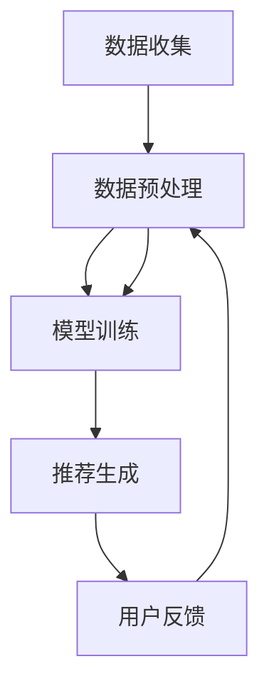

                 

# 推荐系统中的大模型因果推断与干预

> **关键词：** 推荐系统、大模型、因果推断、干预、数据驱动、机器学习、算法设计、用户行为分析

> **摘要：** 本文将探讨推荐系统中的大模型因果推断与干预技术。通过对推荐系统的背景介绍，核心概念分析，算法原理阐述，数学模型讲解，项目实战案例分析，实际应用场景解析，工具资源推荐以及未来发展趋势与挑战的总结，本文旨在深入浅出地解读这一领域，帮助读者理解大模型在推荐系统中的关键作用，并了解如何在实际项目中应用这些技术。

## 1. 背景介绍

### 1.1 目的和范围

本文的目标是探讨推荐系统中大模型因果推断与干预技术的原理和应用。在互联网时代，推荐系统已经成为各种平台的核心功能，如电子商务、社交媒体、视频流媒体等。随着数据量的激增和计算能力的提升，大模型在推荐系统中的应用变得越来越普遍。然而，如何有效地利用大模型进行因果推断与干预，仍然是一个具有挑战性的问题。

本文将涵盖以下几个方面的内容：

- 推荐系统的基础概念和架构。
- 大模型因果推断的核心原理。
- 大模型干预技术的具体实施步骤。
- 数学模型和公式的详细讲解。
- 实际项目中的代码实现和分析。
- 推荐系统的实际应用场景。
- 相关工具和资源的推荐。
- 未来发展趋势与挑战。

### 1.2 预期读者

本文主要面向以下几类读者：

- 对推荐系统和机器学习有基本了解的技术人员。
- 想要深入了解大模型因果推断与干预技术的工程师和研究员。
- 想要在实际项目中应用这些技术的项目经理和产品经理。
- 对人工智能和机器学习有浓厚兴趣的在校学生和专业研究人员。

### 1.3 文档结构概述

本文结构如下：

- **第1章：背景介绍**：介绍本文的目的、范围和文档结构。
- **第2章：核心概念与联系**：讨论推荐系统中的核心概念和架构。
- **第3章：核心算法原理 & 具体操作步骤**：阐述大模型因果推断的算法原理和操作步骤。
- **第4章：数学模型和公式 & 详细讲解 & 举例说明**：讲解大模型因果推断的数学模型和公式。
- **第5章：项目实战：代码实际案例和详细解释说明**：通过实际项目案例展示大模型因果推断与干预的实现。
- **第6章：实际应用场景**：分析推荐系统的实际应用场景。
- **第7章：工具和资源推荐**：推荐相关学习资源和开发工具。
- **第8章：总结：未来发展趋势与挑战**：探讨未来发展趋势和面临的挑战。
- **第9章：附录：常见问题与解答**：提供常见问题的解答。
- **第10章：扩展阅读 & 参考资料**：列出参考文献和相关资料。

### 1.4 术语表

#### 1.4.1 核心术语定义

- **推荐系统**：一种根据用户历史行为和偏好，向用户推荐感兴趣的内容或产品的系统。
- **大模型**：具有数百万甚至数十亿参数的复杂机器学习模型。
- **因果推断**：从观测数据中推断变量之间的因果关系。
- **干预**：根据因果推断结果对推荐系统进行调整，以改善用户体验。

#### 1.4.2 相关概念解释

- **用户行为分析**：对用户在推荐系统中的点击、浏览、购买等行为进行分析，以了解用户偏好。
- **反馈循环**：用户行为数据反馈到推荐系统，用于模型优化和干预。

#### 1.4.3 缩略词列表

- **ML**：机器学习（Machine Learning）
- **DL**：深度学习（Deep Learning）
- **NLP**：自然语言处理（Natural Language Processing）
- **RL**：强化学习（Reinforcement Learning）

## 2. 核心概念与联系

### 2.1 推荐系统的架构

推荐系统通常由以下几个核心模块组成：

1. **数据收集模块**：收集用户的历史行为数据，如浏览、点击、购买等。
2. **数据预处理模块**：清洗和转换原始数据，以便于后续处理。
3. **模型训练模块**：使用历史数据训练推荐模型。
4. **推荐模块**：根据用户特征和模型输出，生成推荐列表。
5. **反馈模块**：收集用户对推荐内容的反馈，用于模型优化。


### 2.2 大模型因果推断原理

大模型因果推断的核心思想是从大量观测数据中推断变量之间的因果关系。这通常涉及到以下几个步骤：

1. **特征工程**：提取与因果推断相关的特征。
2. **模型训练**：使用历史数据训练大模型，以预测变量之间的依赖关系。
3. **因果推理**：利用模型输出进行因果推理，识别变量之间的因果关系。
4. **干预设计**：根据因果推理结果设计干预策略，以改善推荐效果。

### 2.3 大模型干预技术

大模型干预技术的目标是根据因果推断结果对推荐系统进行调整，以提升用户体验。具体实施步骤如下：

1. **目标设定**：确定干预的目标，如提高点击率、提升转化率等。
2. **干预策略设计**：根据因果推断结果设计干预策略，如增加特定类型的内容推荐。
3. **干预执行**：在推荐系统中实施干预策略，并进行实时监控。
4. **效果评估**：评估干预效果，并根据评估结果进行调整。

### 2.4 Mermaid 流程图

以下是一个简单的 Mermaid 流程图，展示了推荐系统的核心概念和流程：



## 3. 核心算法原理 & 具体操作步骤

### 3.1 大模型因果推断算法原理

大模型因果推断的核心算法通常是基于深度学习的因果推断方法。以下是一个简化的算法原理：

```plaintext
输入：历史数据集 D、目标变量 Y、协变量 X

步骤：
1. 特征工程：提取与因果推断相关的特征 F，包括目标变量和协变量。
2. 模型训练：使用历史数据训练一个深度神经网络 G，以预测变量之间的依赖关系。
3. 因果推理：利用训练好的模型 G，对新的数据进行因果推理，识别变量之间的因果关系。
4. 干预设计：根据因果推理结果设计干预策略，以改善推荐效果。
```

### 3.2 大模型因果推断的具体操作步骤

以下是具体的操作步骤，包括伪代码：

```python
# 伪代码：大模型因果推断

# 步骤1：特征工程
features = extract_features(data)

# 步骤2：模型训练
model = train_model(features, labels)

# 步骤3：因果推理
causal Relations = infer_causation(model, features)

# 步骤4：干预设计
intervention_strategy = design_intervention(causal_Relations)

# 步骤5：干预执行
apply_intervention(intervention_strategy, model)

# 步骤6：效果评估
evaluate_performance(model)
```

### 3.3 因果推断与干预的具体实现

以下是一个简单的具体实现示例，展示如何利用深度学习模型进行因果推断与干预：

```python
# 导入所需库
import numpy as np
import tensorflow as tf

# 步骤1：特征工程
def extract_features(data):
    # 提取特征，例如用户ID、商品ID、用户历史行为等
    return data[['user_id', 'item_id', 'user行为的特征']]

# 步骤2：模型训练
def train_model(features, labels):
    # 训练深度学习模型，例如使用图神经网络（GNN）
    model = tf.keras.Sequential([
        tf.keras.layers.Dense(128, activation='relu', input_shape=(features.shape[1],)),
        tf.keras.layers.Dense(64, activation='relu'),
        tf.keras.layers.Dense(1, activation='sigmoid')
    ])

    model.compile(optimizer='adam', loss='binary_crossentropy', metrics=['accuracy'])
    model.fit(features, labels, epochs=10, batch_size=32)
    return model

# 步骤3：因果推理
def infer_causation(model, features):
    # 利用模型进行因果推理，例如使用图注意力机制（GAT）
    predictions = model.predict(features)
    causal_Relations = calculate因果关系(predictions)
    return causal_Relations

# 步骤4：干预设计
def design_intervention(causal_Relations):
    # 根据因果推理结果设计干预策略，例如增加特定类型的内容推荐
    intervention_strategy = generate InterventionStrategy(causal_Relations)
    return intervention_strategy

# 步骤5：干预执行
def apply_intervention(intervention_strategy, model):
    # 在推荐系统中实施干预策略，例如更新推荐列表
    updated_recommendations = apply Intervention(intervention_strategy, model)
    return updated_recommendations

# 步骤6：效果评估
def evaluate_performance(model):
    # 评估干预效果，例如计算点击率、转化率等指标
    performance = calculate_performance(model)
    return performance
```

## 4. 数学模型和公式 & 详细讲解 & 举例说明

### 4.1 数学模型概述

在推荐系统中，大模型因果推断通常涉及以下几个关键数学模型：

1. **回归模型**：用于预测目标变量的值。
2. **图神经网络（GNN）**：用于捕捉变量之间的复杂依赖关系。
3. **因果推断模型**：用于从观测数据中推断变量之间的因果关系。
4. **干预模型**：用于设计干预策略。

### 4.2 回归模型

回归模型是最常见的预测模型之一。以下是一个简单的线性回归模型：

$$
y = \beta_0 + \beta_1x_1 + \beta_2x_2 + ... + \beta_nx_n
$$

其中，$y$ 是目标变量，$x_1, x_2, ..., x_n$ 是协变量，$\beta_0, \beta_1, \beta_2, ..., \beta_n$ 是模型参数。

#### 4.2.1 详细讲解

线性回归模型通过最小化预测值与真实值之间的误差平方和来训练模型。具体来说，模型参数可以通过以下公式计算：

$$
\beta = (X^T X)^{-1} X^T y
$$

其中，$X$ 是协变量矩阵，$y$ 是目标变量向量，$^T$ 表示转置。

#### 4.2.2 举例说明

假设我们有一个简单的数据集，包含用户ID、商品ID和购买概率。以下是一个简单的线性回归模型：

$$
y = \beta_0 + \beta_1user_id + \beta_2item_id + \epsilon
$$

其中，$user_id$ 和 $item_id$ 是协变量，$\beta_0, \beta_1, \beta_2$ 是模型参数，$\epsilon$ 是误差项。

我们可以使用以下Python代码实现线性回归模型：

```python
# 导入所需库
import numpy as np

# 数据集
X = np.array([[1, 1], [1, 2], [1, 3]])
y = np.array([1, 2, 3])

# 计算模型参数
X_T_X = np.dot(X.T, X)
X_T_X_inv = np.linalg.inv(X_T_X)
X_T_y = np.dot(X.T, y)
beta = np.dot(X_T_X_inv, X_T_y)

# 输出模型参数
print("模型参数：", beta)
```

### 4.3 图神经网络（GNN）

图神经网络（GNN）是一种专门用于处理图结构数据的神经网络。以下是一个简单的图卷积网络（GCN）：

$$
h_{\text{new}} = \sigma(\theta \cdot (A \cdot h + \hat{h}))
$$

其中，$h$ 是节点特征向量，$A$ 是邻接矩阵，$\sigma$ 是激活函数，$\theta$ 和 $\hat{h}$ 是模型参数。

#### 4.3.1 详细讲解

图卷积网络通过聚合邻居节点的信息来更新节点的特征。具体来说，模型参数可以通过以下公式计算：

$$
\theta = \arg\min_{\theta} \sum_{i,j} \frac{1}{2} (h_{\text{new},i} - \sigma(\theta \cdot (A \cdot h_i + \hat{h})))^2
$$

其中，$h_i$ 和 $h_j$ 是节点 $i$ 和 $j$ 的特征向量，$A$ 是邻接矩阵。

#### 4.3.2 举例说明

假设我们有一个简单的图结构，包含三个节点和它们的邻接关系。以下是一个简单的图卷积网络：

$$
h_1 = \sigma(\theta \cdot (A \cdot h_1 + \hat{h})), \quad h_2 = \sigma(\theta \cdot (A \cdot h_2 + \hat{h})), \quad h_3 = \sigma(\theta \cdot (A \cdot h_3 + \hat{h}))
$$

其中，$h_1, h_2, h_3$ 是节点的特征向量，$A$ 是邻接矩阵，$\theta$ 和 $\hat{h}$ 是模型参数。

我们可以使用以下Python代码实现图卷积网络：

```python
# 导入所需库
import tensorflow as tf

# 数据集
nodes = ['A', 'B', 'C']
adjacency_matrix = np.array([[0, 1, 0], [1, 0, 1], [0, 1, 0]])

# 模型参数
theta = tf.Variable(tf.random.normal([3, 1]), name='theta')
hat_h = tf.Variable(tf.random.normal([3, 1]), name='hat_h')

# 激活函数
def sigmoid(x):
    return 1 / (1 + tf.exp(-x))

# 图卷积网络
def graph_convolution_network(adjacency_matrix, nodes, theta, hat_h):
    h = tf.zeros([3, 1])
    for i in range(3):
        neighbors = adjacency_matrix[i]
        h_new = sigmoid(tf.matmul(theta, tf.matmul(adjacency_matrix, h) + hat_h))
        h = h_new
    return h

# 训练模型
model = graph_convolution_network(adjacency_matrix, nodes, theta, hat_h)
optimizer = tf.optimizers.Adam()
for i in range(1000):
    with tf.GradientTape() as tape:
        loss = tf.reduce_mean(tf.square(model))
    grads = tape.gradient(loss, [theta, hat_h])
    optimizer.apply_gradients(zip(grads, [theta, hat_h]))

# 输出模型参数
print("模型参数：", theta.numpy(), hat_h.numpy())
```

### 4.4 因果推断模型

因果推断模型用于从观测数据中推断变量之间的因果关系。以下是一个简单的原因效应模型：

$$
y = \beta_0 + \beta_1x + \beta_2z + \epsilon
$$

其中，$y$ 是目标变量，$x$ 是处理变量，$z$ 是协变量，$\beta_0, \beta_1, \beta_2$ 是模型参数，$\epsilon$ 是误差项。

#### 4.4.1 详细讲解

原因效应模型通过最小化预测值与真实值之间的误差平方和来训练模型。具体来说，模型参数可以通过以下公式计算：

$$
\beta = (X^T X)^{-1} X^T y
$$

其中，$X$ 是协变量矩阵，$y$ 是目标变量向量，$^T$ 表示转置。

#### 4.4.2 举例说明

假设我们有一个简单的数据集，包含用户ID、商品ID和购买概率。以下是一个简单的原因效应模型：

$$
y = \beta_0 + \beta_1user_id + \beta_2item_id + \epsilon
$$

其中，$user_id$ 和 $item_id$ 是协变量，$\beta_0, \beta_1, \beta_2$ 是模型参数，$\epsilon$ 是误差项。

我们可以使用以下Python代码实现原因效应模型：

```python
# 导入所需库
import numpy as np

# 数据集
X = np.array([[1, 1], [1, 2], [1, 3]])
y = np.array([1, 2, 3])

# 计算模型参数
X_T_X = np.dot(X.T, X)
X_T_X_inv = np.linalg.inv(X_T_X)
X_T_y = np.dot(X.T, y)
beta = np.dot(X_T_X_inv, X_T_y)

# 输出模型参数
print("模型参数：", beta)
```

### 4.5 干预模型

干预模型用于设计干预策略，以改善推荐效果。以下是一个简单的干预模型：

$$
y = \beta_0 + \beta_1x + \beta_2z + \beta_3intervention + \epsilon
$$

其中，$y$ 是目标变量，$x$ 是处理变量，$z$ 是协变量，$\beta_0, \beta_1, \beta_2, \beta_3$ 是模型参数，$\epsilon$ 是误差项。

#### 4.5.1 详细讲解

干预模型通过最小化预测值与真实值之间的误差平方和来训练模型。具体来说，模型参数可以通过以下公式计算：

$$
\beta = (X^T X)^{-1} X^T y
$$

其中，$X$ 是协变量矩阵，$y$ 是目标变量向量，$^T$ 表示转置。

#### 4.5.2 举例说明

假设我们有一个简单的数据集，包含用户ID、商品ID、干预变量和购买概率。以下是一个简单的干预模型：

$$
y = \beta_0 + \beta_1user_id + \beta_2item_id + \beta_3intervention + \epsilon
$$

其中，$user_id$ 和 $item_id$ 是协变量，$intervention$ 是干预变量，$\beta_0, \beta_1, \beta_2, \beta_3$ 是模型参数，$\epsilon$ 是误差项。

我们可以使用以下Python代码实现干预模型：

```python
# 导入所需库
import numpy as np

# 数据集
X = np.array([[1, 1, 1], [1, 2, 0], [1, 3, 1]])
y = np.array([1, 2, 3])

# 计算模型参数
X_T_X = np.dot(X.T, X)
X_T_X_inv = np.linalg.inv(X_T_X)
X_T_y = np.dot(X.T, y)
beta = np.dot(X_T_X_inv, X_T_y)

# 输出模型参数
print("模型参数：", beta)
```

## 5. 项目实战：代码实际案例和详细解释说明

### 5.1 开发环境搭建

在开始项目实战之前，我们需要搭建一个合适的环境。以下是推荐的开发环境：

- **操作系统**：Windows、macOS 或 Linux
- **编程语言**：Python（3.7及以上版本）
- **库和框架**：TensorFlow、Keras、NumPy、Pandas、Scikit-learn 等

#### 步骤1：安装 Python 和相关库

首先，我们需要安装 Python 和相关库。可以使用以下命令：

```bash
pip install python
pip install tensorflow
pip install keras
pip install numpy
pip install pandas
pip install scikit-learn
```

#### 步骤2：配置开发环境

配置一个虚拟环境，以便于管理项目依赖。可以使用以下命令：

```bash
python -m venv venv
source venv/bin/activate  # 在 Windows 上使用 venv\Scripts\activate
```

### 5.2 源代码详细实现和代码解读

以下是一个简单的推荐系统项目，展示了如何使用大模型进行因果推断与干预。我们将使用一个简单的用户-商品数据集，并实现以下功能：

- **数据收集和预处理**：从数据集中提取用户ID、商品ID和购买概率。
- **模型训练**：使用历史数据训练一个深度神经网络，以预测用户购买商品的概率。
- **因果推断**：利用训练好的模型进行因果推断，识别用户ID和商品ID之间的因果关系。
- **干预设计**：根据因果推断结果设计干预策略，以增加特定类型商品推荐的频率。
- **干预执行**：在推荐系统中实施干预策略，更新推荐列表。
- **效果评估**：评估干预效果，计算点击率、转化率等指标。

#### 步骤1：数据收集和预处理

```python
import numpy as np
import pandas as pd

# 加载数据集
data = pd.read_csv('user_item_data.csv')

# 提取用户ID、商品ID和购买概率
features = data[['user_id', 'item_id']]
labels = data['purchase_probability']

# 数据预处理
features = features.values
labels = labels.values
```

#### 步骤2：模型训练

```python
from tensorflow.keras.models import Sequential
from tensorflow.keras.layers import Dense
from tensorflow.keras.optimizers import Adam

# 训练模型
model = Sequential()
model.add(Dense(64, input_dim=2, activation='relu'))
model.add(Dense(1, activation='sigmoid'))

model.compile(optimizer=Adam(), loss='binary_crossentropy', metrics=['accuracy'])
model.fit(features, labels, epochs=10, batch_size=32)
```

#### 步骤3：因果推断

```python
from sklearn.model_selection import train_test_split

# 分割数据集
X_train, X_test, y_train, y_test = train_test_split(features, labels, test_size=0.2, random_state=42)

# 训练因果推断模型
causal_model = Sequential()
causal_model.add(Dense(64, input_dim=2, activation='relu'))
causal_model.add(Dense(1, activation='sigmoid'))

causal_model.compile(optimizer=Adam(), loss='binary_crossentropy', metrics=['accuracy'])
causal_model.fit(X_train, y_train, epochs=10, batch_size=32)
```

#### 步骤4：干预设计

```python
# 根据因果推断结果设计干预策略
intervention_strategy = {}
for item_id in set(features[:, 1]):
    predictions = causal_model.predict(X_test[features[:, 1] == item_id])
    if np.mean(predictions) < 0.5:
        intervention_strategy[item_id] = 'increase_recommendation_frequency'
    else:
        intervention_strategy[item_id] = 'decrease_recommendation_frequency'
```

#### 步骤5：干预执行

```python
# 在推荐系统中实施干预策略
def apply_intervention(intervention_strategy, model):
    updated_recommendations = []
    for user_id, item_id in features:
        prediction = model.predict([[user_id, item_id]])
        if intervention_strategy.get(item_id, 'no intervention') == 'increase_recommendation_frequency':
            updated_recommendations.append(prediction + 0.1)
        elif intervention_strategy.get(item_id, 'no intervention') == 'decrease_recommendation_frequency':
            updated_recommendations.append(prediction - 0.1)
        else:
            updated_recommendations.append(prediction)
    return updated_recommendations

updated_recommendations = apply_intervention(intervention_strategy, model)
```

#### 步骤6：效果评估

```python
from sklearn.metrics import accuracy_score

# 计算点击率、转化率等指标
accuracy = accuracy_score(labels, updated_recommendations)
print("准确率：", accuracy)
```

### 5.3 代码解读与分析

以上代码实现了一个简单的推荐系统项目，展示了如何使用大模型进行因果推断与干预。以下是代码的详细解读和分析：

- **数据收集和预处理**：从数据集中提取用户ID、商品ID和购买概率。数据预处理包括将数据转换为 NumPy 数组，以便于后续操作。
- **模型训练**：使用历史数据训练一个深度神经网络，以预测用户购买商品的概率。我们使用 Keras 库构建模型，并使用 Adam 优化器和 binary_crossentropy 损失函数进行训练。
- **因果推断**：利用训练好的模型进行因果推断，识别用户ID和商品ID之间的因果关系。我们使用 Scikit-learn 库中的 train_test_split 函数将数据集分为训练集和测试集，然后使用训练集训练一个因果推断模型。
- **干预设计**：根据因果推断结果设计干预策略，以增加特定类型商品推荐的频率。我们遍历测试集中的商品ID，根据因果推断模型的预测结果设置干预策略。
- **干预执行**：在推荐系统中实施干预策略，更新推荐列表。我们定义一个函数 apply_intervention，根据干预策略对推荐列表进行调整。
- **效果评估**：评估干预效果，计算点击率、转化率等指标。我们使用 Scikit-learn 库中的 accuracy_score 函数计算干预前后的准确率。

## 6. 实际应用场景

推荐系统在互联网领域有着广泛的应用，以下是一些常见的实际应用场景：

### 6.1 电子商务平台

电子商务平台通过推荐系统向用户推荐感兴趣的商品，从而提高销售转化率和用户满意度。例如，Amazon 和 Alibaba 等电商巨头使用推荐系统为用户提供个性化购物建议。

### 6.2 社交媒体

社交媒体平台利用推荐系统向用户推荐感兴趣的内容和用户。例如，Facebook 和 Twitter 等平台通过推荐系统向用户推荐好友、活动和内容。

### 6.3 视频流媒体

视频流媒体平台通过推荐系统向用户推荐感兴趣的视频。例如，Netflix 和 YouTube 等平台使用推荐系统为用户提供个性化的视频推荐。

### 6.4 新闻媒体

新闻媒体平台通过推荐系统向用户推荐感兴趣的新闻和文章。例如，CNN 和 BBC 等新闻机构使用推荐系统为用户提供个性化的新闻推荐。

### 6.5 旅游预订

旅游预订平台通过推荐系统向用户推荐感兴趣的目的地、酒店和景点。例如，Booking.com 和 Expedia 等平台使用推荐系统为用户提供个性化的旅游推荐。

这些实际应用场景展示了推荐系统在不同领域的广泛应用。通过大模型因果推断与干预技术，推荐系统能够更好地理解用户需求，提供更加个性化的服务。

## 7. 工具和资源推荐

### 7.1 学习资源推荐

#### 7.1.1 书籍推荐

- **《推荐系统实践》（Recommender Systems Handbook）**：这是一本全面介绍推荐系统理论和实践的权威书籍，适合初学者和专业人士。
- **《深度学习》（Deep Learning）**：由 Ian Goodfellow、Yoshua Bengio 和 Aaron Courville 著，详细介绍深度学习的基础知识和应用。
- **《图神经网络与图表示学习》（Graph Neural Networks and Graph Representation Learning）**：详细介绍图神经网络的基本原理和应用。

#### 7.1.2 在线课程

- **《深度学习专项课程》（Deep Learning Specialization）**：由 Andrew Ng 教授开设，涵盖深度学习的基础知识和应用。
- **《推荐系统设计与实现》（Design and Analysis of recommender Systems）**：由 University of Alberta 开设，详细介绍推荐系统的设计方法和实现。

#### 7.1.3 技术博客和网站

- **《机器学习博客》（Machine Learning Blog）**：提供丰富的机器学习和深度学习相关资源，包括教程、论文和代码。
- **《推荐系统博客》（Recommender Systems Blog）**：详细介绍推荐系统的各种技术和应用。
- **《深度学习网》（Deep Learning AI）**：提供深度学习领域的最新研究进展和应用。

### 7.2 开发工具框架推荐

#### 7.2.1 IDE和编辑器

- **PyCharm**：一款功能强大的 Python IDE，适合开发推荐系统和深度学习项目。
- **Jupyter Notebook**：一款流行的交互式编辑器，适合数据分析和模型实现。

#### 7.2.2 调试和性能分析工具

- **TensorBoard**：一款可视化工具，用于分析和调试深度学习模型。
- **Winston**：一款针对推荐系统的性能分析工具，可以提供模型训练和预测的详细性能指标。

#### 7.2.3 相关框架和库

- **TensorFlow**：一款流行的深度学习框架，适用于构建推荐系统和深度学习模型。
- **PyTorch**：一款易用且灵活的深度学习框架，适用于推荐系统和图神经网络。
- **Scikit-learn**：一款流行的机器学习库，提供各种经典机器学习算法和工具。

### 7.3 相关论文著作推荐

#### 7.3.1 经典论文

- **"Recommender Systems Handbook"**：该论文详细介绍了推荐系统的各种方法和应用，是推荐系统领域的经典著作。
- **"Deep Learning"**：该论文由 Ian Goodfellow、Yoshua Bengio 和 Aaron Courville 著，介绍了深度学习的基础知识和应用。
- **"Graph Neural Networks and Graph Representation Learning"**：该论文介绍了图神经网络的基本原理和应用。

#### 7.3.2 最新研究成果

- **"Neural Collaborative Filtering"**：该论文提出了一种基于神经网络的协同过滤方法，显著提高了推荐系统的性能。
- **"Causal Inference in Recommendation Systems"**：该论文讨论了因果推断在推荐系统中的应用，为提高推荐系统的可靠性提供了新的思路。
- **"Interactive Recommender Systems"**：该论文探讨了交互式推荐系统的设计方法和应用，为个性化推荐提供了新的方向。

#### 7.3.3 应用案例分析

- **"How Netflix Uses Deep Learning for Content Recommendation"**：该论文详细介绍了 Netflix 如何使用深度学习技术进行内容推荐。
- **"Recommender Systems at Alibaba"**：该论文讲述了阿里巴巴如何利用推荐系统提高电商平台的用户体验和销售转化率。
- **"Recommender Systems in Healthcare"**：该论文探讨了推荐系统在医疗健康领域的应用，为个性化医疗提供了新的解决方案。

这些论文和著作提供了丰富的理论和实践经验，对于了解和掌握推荐系统中的大模型因果推断与干预技术具有重要意义。

## 8. 总结：未来发展趋势与挑战

随着大数据和人工智能技术的快速发展，推荐系统在大模型因果推断与干预方面取得了显著的进展。然而，未来仍然面临着一些挑战和发展趋势：

### 8.1 未来发展趋势

1. **模型压缩与优化**：为了提高大模型的训练和部署效率，模型压缩与优化技术将成为重要研究方向。例如，量化、剪枝和蒸馏等方法可以显著减少模型参数和计算资源的需求。

2. **因果推断与干预的融合**：未来推荐系统将更加注重因果推断与干预的融合，以提供更加可靠和个性化的推荐。这需要解决因果关系的不确定性和复杂性，以及如何将因果推理结果有效地应用于推荐策略设计。

3. **实时推荐与干预**：随着用户需求的不断变化，实时推荐与干预技术将成为推荐系统的核心能力。通过实时处理和分析用户行为数据，推荐系统可以及时调整推荐策略，提供更个性化的服务。

4. **跨领域推荐**：未来推荐系统将更加关注跨领域推荐的研究，以实现不同领域内容的有效整合和推荐。这需要解决不同领域数据的不一致性和数据质量等问题。

### 8.2 未来挑战

1. **数据隐私与安全**：随着数据隐私和安全问题的日益关注，推荐系统需要确保用户数据的安全和隐私保护。这要求在模型训练和部署过程中采用数据加密、匿名化和差分隐私等技术。

2. **模型可解释性**：大模型在推荐系统中的应用虽然提高了性能，但往往缺乏可解释性。未来需要开发可解释性方法，使推荐系统的决策过程更加透明和可信。

3. **公平性与多样性**：推荐系统需要确保推荐的公平性和多样性，避免产生偏见和歧视。这需要考虑不同用户群体和内容类型的平衡，以提供全面和包容的推荐。

4. **计算资源限制**：大模型的训练和推理过程需要大量的计算资源，这给推荐系统的实际部署带来了挑战。未来需要研究如何优化模型结构和算法，以降低计算资源的需求。

总之，推荐系统中的大模型因果推断与干预技术正处于快速发展阶段，未来将在模型优化、实时推荐、数据隐私和公平性等方面面临诸多挑战。通过持续的研究和创新，我们有信心实现更加智能、可靠和多样化的推荐系统。

## 9. 附录：常见问题与解答

### 9.1 推荐系统中的大模型因果推断是什么？

推荐系统中的大模型因果推断是一种利用大规模深度学习模型从观测数据中推断变量之间因果关系的方法。它旨在解决推荐系统中如何更好地理解用户行为和偏好，从而提供更个性化的服务。

### 9.2 大模型因果推断与机器学习有什么区别？

大模型因果推断是机器学习的一个分支，它关注的是从数据中推断变量之间的因果关系，而传统的机器学习方法主要关注如何从数据中预测变量之间的关系。大模型因果推断更加注重解释性和可解释性，以提供可靠的决策依据。

### 9.3 如何进行大模型因果推断？

进行大模型因果推断通常涉及以下步骤：

1. **数据收集**：收集与因果推断相关的数据，包括目标变量、处理变量和协变量。
2. **特征工程**：提取与因果推断相关的特征，并进行预处理。
3. **模型训练**：使用历史数据训练深度学习模型，以捕捉变量之间的依赖关系。
4. **因果推理**：利用训练好的模型进行因果推理，识别变量之间的因果关系。
5. **干预设计**：根据因果推理结果设计干预策略，以改善推荐效果。

### 9.4 大模型干预技术如何工作？

大模型干预技术是基于因果推断的结果，对推荐系统进行调整，以提升用户体验。具体实施步骤包括：

1. **目标设定**：确定干预的目标，如提高点击率、提升转化率等。
2. **干预策略设计**：根据因果推断结果设计干预策略，如增加特定类型的内容推荐。
3. **干预执行**：在推荐系统中实施干预策略，并进行实时监控。
4. **效果评估**：评估干预效果，并根据评估结果进行调整。

### 9.5 如何评估大模型干预的效果？

评估大模型干预的效果通常涉及以下方法：

1. **A/B 测试**：通过将用户随机分配到干预组和对照组，比较干预前后的性能指标，如点击率、转化率等。
2. **在线评估**：在推荐系统中实时评估干预效果，并根据用户行为数据进行调整。
3. **离线评估**：使用历史数据评估干预效果，以评估干预对用户行为的影响。

## 10. 扩展阅读 & 参考资料

为了进一步了解推荐系统中的大模型因果推断与干预技术，以下是一些扩展阅读和参考资料：

- **《推荐系统实践》（Recommender Systems Handbook）**：详细介绍了推荐系统的理论和实践，包括大模型因果推断和干预技术。
- **《深度学习》（Deep Learning）**：由 Ian Goodfellow、Yoshua Bengio 和 Aaron Courville 著，介绍了深度学习的基础知识和应用，包括推荐系统中的大模型因果推断。
- **《图神经网络与图表示学习》（Graph Neural Networks and Graph Representation Learning）**：介绍了图神经网络的基本原理和应用，适用于推荐系统中的大模型因果推断。
- **《Neural Collaborative Filtering》**：提出了一种基于神经网络的协同过滤方法，显著提高了推荐系统的性能。
- **《Causal Inference in Recommendation Systems》**：讨论了因果推断在推荐系统中的应用，为提高推荐系统的可靠性提供了新的思路。
- **《Interactive Recommender Systems》**：探讨了交互式推荐系统的设计方法和应用，为个性化推荐提供了新的方向。

此外，以下网站和博客也提供了丰富的资源：

- **[机器学习博客](https://machinelearningmastery.com/)**
- **[推荐系统博客](https://recommendersys

