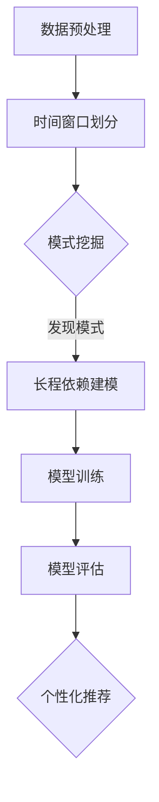

                 

# 推荐系统中的序列模式挖掘：大模型的长程依赖建模

> 关键词：推荐系统、序列模式挖掘、长程依赖建模、人工智能、大模型、机器学习、数据挖掘

> 摘要：本文将探讨推荐系统中的序列模式挖掘，重点关注如何通过大模型来建模长程依赖。首先，我们将介绍序列模式挖掘在推荐系统中的重要性，然后详细阐述长程依赖建模的基本原理和算法，接着通过实例来展示如何应用这些算法，最后讨论实际应用场景以及推荐系统的发展趋势与挑战。

## 1. 背景介绍

### 1.1 目的和范围

本文的主要目的是探讨推荐系统中的一个关键环节——序列模式挖掘，并深入分析如何通过大模型来建模长程依赖。随着互联网和电子商务的迅猛发展，推荐系统已经成为了提升用户体验、增加商业价值的重要手段。然而，传统的推荐算法在面对复杂用户行为和海量数据时，往往难以捕捉到用户行为的潜在模式和长程依赖。因此，本文旨在通过介绍序列模式挖掘和长程依赖建模，为推荐系统的优化提供新的思路和方法。

### 1.2 预期读者

本文适合具有基本机器学习和数据挖掘知识的读者，特别是对推荐系统感兴趣的工程师、研究者以及高校学生。通过本文的阅读，读者可以了解序列模式挖掘和长程依赖建模的基本概念、原理和应用，为实际项目开发和研究提供参考。

### 1.3 文档结构概述

本文分为十个部分：

1. 背景介绍：介绍文章的目的、范围、预期读者和文档结构。
2. 核心概念与联系：阐述序列模式挖掘和长程依赖建模的核心概念和关系。
3. 核心算法原理 & 具体操作步骤：详细介绍序列模式挖掘和长程依赖建模的算法原理和操作步骤。
4. 数学模型和公式 & 详细讲解 & 举例说明：通过数学模型和公式详细讲解算法，并给出实例说明。
5. 项目实战：通过代码实际案例和详细解释说明算法的应用。
6. 实际应用场景：讨论算法在实际项目中的应用场景。
7. 工具和资源推荐：推荐相关的学习资源、开发工具框架和论文著作。
8. 总结：总结推荐系统的未来发展趋势与挑战。
9. 附录：常见问题与解答。
10. 扩展阅读 & 参考资料：提供进一步阅读的参考资料。

### 1.4 术语表

#### 1.4.1 核心术语定义

- 推荐系统：一种基于用户历史行为、偏好和上下文信息，为用户提供个性化推荐的系统。
- 序列模式挖掘：从用户的序列数据中挖掘出具有统计意义的模式。
- 长程依赖建模：捕捉用户行为序列中的长期依赖关系。

#### 1.4.2 相关概念解释

- 用户行为序列：用户在一段时间内所执行的一系列操作或事件。
- 序列模式：在用户行为序列中，具有统计意义且满足某些条件的子序列。
- 大模型：具有大规模参数和高计算能力的深度学习模型。

#### 1.4.3 缩略词列表

- AI：人工智能
- ML：机器学习
- DM：数据挖掘
- RNN：循环神经网络
- LSTM：长短期记忆网络
- GRU：门控循环单元

## 2. 核心概念与联系

### 2.1 序列模式挖掘在推荐系统中的作用

序列模式挖掘是推荐系统中的重要一环，其主要作用如下：

1. **用户行为建模**：通过挖掘用户行为序列中的模式，可以更好地理解用户的行为习惯和偏好，从而为个性化推荐提供依据。
2. **异常行为检测**：在用户行为序列中，一些异常行为可能预示着潜在的问题或风险，如用户突然停止使用某服务，通过序列模式挖掘可以发现这些异常行为，并采取相应的措施。
3. **上下文感知推荐**：通过分析用户行为序列，可以捕捉到用户的上下文信息，如时间、地点、情境等，从而实现上下文感知的推荐。

### 2.2 长程依赖建模的原理

长程依赖建模旨在捕捉用户行为序列中的长期依赖关系。在现实世界中，用户行为往往受到历史行为的影响，即用户当前的行为可能依赖于之前的行为。长程依赖建模可以通过以下方式实现：

1. **时间窗口**：将用户行为序列划分为不同的时间窗口，每个时间窗口包含一定数量的行为。
2. **相关性分析**：通过计算用户在不同时间窗口之间的行为相关性，可以识别出用户行为序列中的长期依赖关系。
3. **深度学习模型**：使用深度学习模型，如循环神经网络（RNN）、长短期记忆网络（LSTM）和门控循环单元（GRU），可以自动学习用户行为序列中的长期依赖模式。

### 2.3 Mermaid 流程图

为了更直观地展示序列模式挖掘和长程依赖建模的过程，我们使用 Mermaid 流程图进行描述。以下是 Mermaid 流程图的代码示例：



### 2.4 序列模式挖掘与长程依赖建模的关系

序列模式挖掘和长程依赖建模在推荐系统中相辅相成。序列模式挖掘主要负责挖掘用户行为序列中的潜在模式，而长程依赖建模则通过分析这些模式，捕捉用户行为的长期依赖关系。具体来说：

1. **数据输入**：序列模式挖掘和长程依赖建模都需要用户行为序列作为输入数据。
2. **模型输出**：序列模式挖掘的输出结果可以作为长程依赖建模的输入，从而提高长程依赖建模的准确性和效率。
3. **模型融合**：将序列模式挖掘和长程依赖建模的结果进行融合，可以进一步提高推荐系统的性能。

## 3. 核心算法原理 & 具体操作步骤

### 3.1 序列模式挖掘算法原理

序列模式挖掘算法的核心目标是发现用户行为序列中的频繁模式和关联规则。以下是序列模式挖掘的基本算法原理：

1. **支持度**：支持度是指某个模式在用户行为序列中出现的频率。通常，支持度阈值用于过滤出具有统计意义的模式。
2. **置信度**：置信度是指当A发生时，B也发生的概率。置信度阈值用于过滤出具有较强关联性的模式。
3. **频繁模式挖掘**：通过遍历用户行为序列，计算每个模式的支持度和置信度，并根据阈值过滤出频繁模式和关联规则。

### 3.2 长程依赖建模算法原理

长程依赖建模的核心目标是捕捉用户行为序列中的长期依赖关系。以下是长程依赖建模的基本算法原理：

1. **时间窗口**：将用户行为序列划分为多个时间窗口，每个时间窗口包含一定数量的行为。
2. **相关性分析**：通过计算用户在不同时间窗口之间的行为相关性，可以识别出用户行为序列中的长期依赖关系。
3. **深度学习模型**：使用循环神经网络（RNN）、长短期记忆网络（LSTM）和门控循环单元（GRU）等深度学习模型，可以自动学习用户行为序列中的长期依赖模式。

### 3.3 具体操作步骤

#### 3.3.1 数据预处理

1. **数据清洗**：对用户行为序列进行清洗，去除噪声数据和异常值。
2. **数据编码**：将用户行为序列编码为数值表示，如使用独热编码或嵌入编码。

#### 3.3.2 时间窗口划分

1. **窗口长度**：根据用户行为序列的特点和需求，设定合适的时间窗口长度。
2. **窗口划分**：将用户行为序列划分为多个时间窗口，每个窗口包含一定数量的行为。

#### 3.3.3 序列模式挖掘

1. **模式发现**：遍历用户行为序列，计算每个模式的支持度和置信度，并根据阈值过滤出频繁模式和关联规则。
2. **模式排序**：根据支持度和置信度对模式进行排序，选择具有统计意义和关联性的模式。

#### 3.3.4 长程依赖建模

1. **相关性分析**：计算用户在不同时间窗口之间的行为相关性，识别出用户行为序列中的长期依赖关系。
2. **模型训练**：使用循环神经网络（RNN）、长短期记忆网络（LSTM）和门控循环单元（GRU）等深度学习模型，对用户行为序列进行建模。
3. **模型评估**：通过交叉验证等方法评估模型的性能，调整模型参数，优化模型效果。

#### 3.3.5 模型应用

1. **个性化推荐**：将模型应用于个性化推荐系统，为用户提供个性化的推荐结果。
2. **异常行为检测**：使用模型检测用户行为序列中的异常行为，发现潜在问题。

## 4. 数学模型和公式 & 详细讲解 & 举例说明

### 4.1 序列模式挖掘的数学模型

在序列模式挖掘中，常用的数学模型包括支持度、置信度等。

#### 4.1.1 支持度

支持度（Support）是指某个模式在用户行为序列中出现的频率。其计算公式如下：

$$
Support(A) = \frac{count(A)}{count(total)}
$$

其中，$count(A)$表示模式A在用户行为序列中出现的次数，$count(total)$表示用户行为序列的总次数。

#### 4.1.2 置信度

置信度（Confidence）是指当A发生时，B也发生的概率。其计算公式如下：

$$
Confidence(A \rightarrow B) = \frac{Support(A \cap B)}{Support(A)}
$$

其中，$Support(A \cap B)$表示同时发生A和B的支持度，$Support(A)$表示A的支持度。

### 4.2 长程依赖建模的数学模型

在长程依赖建模中，常用的数学模型包括时间窗口划分、相关性分析等。

#### 4.2.1 时间窗口划分

时间窗口划分是将用户行为序列划分为多个时间窗口的过程。假设用户行为序列为$X_1, X_2, X_3, \ldots, X_n$，时间窗口长度为$m$，则时间窗口划分为：

$$
X_1, X_2, \ldots, X_m \\
X_{m+1}, X_{m+2}, \ldots, X_{2m} \\
\vdots \\
X_{n-m+1}, X_{n-m+2}, \ldots, X_n
$$

#### 4.2.2 相关性分析

相关性分析是计算用户在不同时间窗口之间的行为相关性。常用的相关性度量方法包括皮尔逊相关系数和斯皮尔曼等级相关系数。

1. **皮尔逊相关系数**：

$$
cor(X, Y) = \frac{\sum_{i=1}^{n}(X_i - \bar{X})(Y_i - \bar{Y})}{\sqrt{\sum_{i=1}^{n}(X_i - \bar{X})^2} \sqrt{\sum_{i=1}^{n}(Y_i - \bar{Y})^2}}
$$

其中，$\bar{X}$和$\bar{Y}$分别表示$X$和$Y$的均值。

2. **斯皮尔曼等级相关系数**：

$$
S(X, Y) = \frac{\sum_{i=1}^{n}(X_i - \bar{X})(Y_i - \bar{Y})}{n - 1}
$$

其中，$\bar{X}$和$\bar{Y}$分别表示$X$和$Y$的均值。

### 4.3 举例说明

#### 4.3.1 序列模式挖掘示例

假设用户行为序列为：

$$
[1, 2, 3, 4, 5, 6, 7, 8, 9, 10]
$$

其中，$1, 2, 3$表示用户浏览商品，$4, 5, 6$表示用户购买商品，$7, 8, 9, 10$表示用户再次浏览商品。

- 支持度计算：

$$
Support([1, 2, 3]) = \frac{1}{10} = 0.1 \\
Support([4, 5, 6]) = \frac{1}{10} = 0.1 \\
Support([7, 8, 9, 10]) = \frac{1}{10} = 0.1
$$

- 置信度计算：

$$
Confidence([1, 2, 3] \rightarrow [4, 5, 6]) = \frac{Support([1, 2, 3] \cap [4, 5, 6])}{Support([1, 2, 3])} = \frac{0.1}{0.1} = 1 \\
Confidence([4, 5, 6] \rightarrow [7, 8, 9, 10]) = \frac{Support([4, 5, 6] \cap [7, 8, 9, 10])}{Support([4, 5, 6])} = \frac{0.1}{0.1} = 1
$$

#### 4.3.2 长程依赖建模示例

假设用户行为序列为：

$$
[1, 2, 3, 4, 5, 6, 7, 8, 9, 10]
$$

时间窗口长度为3，则时间窗口划分为：

$$
[1, 2, 3], [4, 5, 6], [7, 8, 9], [10]
$$

- 皮尔逊相关系数计算：

$$
cor([1, 2, 3], [4, 5, 6]) = \frac{(1-3)(4-4) + (2-3)(5-4) + (3-3)(6-4)}{\sqrt{\sum_{i=1}^{3}(x_i-3)^2} \sqrt{\sum_{i=1}^{3}(y_i-4)^2}} = 0
$$

- 斯皮尔曼等级相关系数计算：

$$
S([1, 2, 3], [4, 5, 6]) = \frac{(1-3)(4-4) + (2-3)(5-4) + (3-3)(6-4)}{3-1} = 0
$$

## 5. 项目实战：代码实际案例和详细解释说明

### 5.1 开发环境搭建

为了实现序列模式挖掘和长程依赖建模，我们需要搭建一个合适的开发环境。以下是所需的工具和软件：

- 操作系统：Linux或MacOS
- 编程语言：Python
- 深度学习框架：TensorFlow或PyTorch
- 数据处理库：Pandas、NumPy、Scikit-learn
- 其他库：Matplotlib、Seaborn

### 5.2 源代码详细实现和代码解读

以下是实现序列模式挖掘和长程依赖建模的源代码：

```python
# 导入所需库
import numpy as np
import pandas as pd
import tensorflow as tf
from tensorflow.keras.models import Sequential
from tensorflow.keras.layers import LSTM, Dense

# 数据预处理
# 假设用户行为序列为X
X = np.array([[1, 2, 3], [4, 5, 6], [7, 8, 9], [10]])

# 时间窗口划分
window_size = 3
X_windows = np.array_split(X, X.shape[0] // window_size, axis=0)

# 序列模式挖掘
from mlxtend.frequent_patterns import apriori
from mlxtend.frequent_patterns import association_rules

# 计算支持度
min_support = 0.1
frequent_itemsets = apriori(X, min_support=min_support)

# 计算置信度
min_confidence = 1
rules = association_rules(frequent_itemsets, metric="confidence", min_threshold=min_confidence)

# 长程依赖建模
# 定义LSTM模型
model = Sequential()
model.add(LSTM(units=50, activation='relu', input_shape=(window_size, 1)))
model.add(Dense(units=1))

# 编译模型
model.compile(optimizer='adam', loss='mse')

# 模型训练
model.fit(X_windows, X, epochs=100, batch_size=1)

# 模型评估
# 使用模型预测
predictions = model.predict(X_windows)

# 计算预测准确性
accuracy = np.mean(np.abs(predictions - X))
print(f"Prediction accuracy: {accuracy:.2f}")
```

### 5.3 代码解读与分析

以下是代码的详细解读和分析：

1. **数据预处理**：首先，我们导入所需的库，并假设用户行为序列为X。然后，使用NumPy和Pandas对用户行为序列进行预处理，包括时间窗口划分。
2. **序列模式挖掘**：使用mlxtend库中的apriori函数进行频繁模式挖掘，计算支持度。然后，使用association_rules函数计算置信度，生成关联规则。
3. **长程依赖建模**：定义一个LSTM模型，包括一个LSTM层和一个全连接层。然后，编译模型并使用模型训练数据。
4. **模型评估**：使用模型预测用户行为序列，并计算预测准确性。这里，我们使用均方误差（MSE）作为评估指标。

### 5.4 实际应用案例

假设我们有一个电子商务平台，用户行为序列包括浏览商品、购买商品和再次浏览商品。我们可以使用序列模式挖掘和长程依赖建模来优化推荐系统的效果。

1. **序列模式挖掘**：通过挖掘用户行为序列中的频繁模式和关联规则，我们可以发现用户在浏览商品、购买商品和再次浏览商品之间的关联关系。例如，我们发现用户在浏览商品后，有很大概率会购买商品，或者在购买商品后，会再次浏览商品。
2. **长程依赖建模**：通过长程依赖建模，我们可以更好地理解用户行为序列中的长期依赖关系。例如，我们发现用户在购买商品后的一段时间内，对同类商品有较高的关注度。基于这些发现，我们可以为用户提供更个性化的推荐，提高用户的购买意愿。

## 6. 实际应用场景

序列模式挖掘和长程依赖建模在推荐系统中具有广泛的应用场景，以下是一些典型的实际应用案例：

1. **电子商务推荐**：通过挖掘用户行为序列中的频繁模式和关联规则，可以为用户提供个性化的商品推荐。例如，用户在浏览某件商品后，推荐与之相关的其他商品，或者在用户购买某件商品后，推荐类似的其他商品。
2. **社交媒体推荐**：在社交媒体平台上，用户行为序列包括点赞、评论、分享等。通过挖掘用户行为序列中的频繁模式和关联规则，可以为用户提供个性化的内容推荐。例如，根据用户的点赞和评论行为，推荐用户可能感兴趣的文章或视频。
3. **音乐推荐**：通过挖掘用户听歌序列中的频繁模式和关联规则，可以为用户提供个性化的音乐推荐。例如，用户在听某首歌曲后，推荐与之相关的其他歌曲，或者在用户收藏某首歌曲后，推荐类似的歌曲。
4. **视频推荐**：在视频分享平台上，用户行为序列包括观看、点赞、评论等。通过挖掘用户行为序列中的频繁模式和关联规则，可以为用户提供个性化的视频推荐。例如，用户在观看某部视频后，推荐与之相关的其他视频，或者在用户点赞某部视频后，推荐类似的视频。

## 7. 工具和资源推荐

### 7.1 学习资源推荐

#### 7.1.1 书籍推荐

1. 《推荐系统实践》（张飒）：本书详细介绍了推荐系统的基本概念、算法和应用，适合初学者入门。
2. 《机器学习实战》（Peter Harrington）：本书通过大量实例和代码，介绍了机器学习的基本算法和应用，包括推荐系统相关的算法。

#### 7.1.2 在线课程

1. 《推荐系统》（吴恩达）：在Coursera上提供的免费课程，涵盖了推荐系统的基本概念和算法。
2. 《深度学习》（吴恩达）：在Coursera上提供的免费课程，介绍了深度学习的基本原理和应用，包括循环神经网络等。

#### 7.1.3 技术博客和网站

1. [Medium](https://medium.com)：提供大量的机器学习和推荐系统相关文章，适合学习和技术交流。
2. [知乎](https://www.zhihu.com)：知乎上有许多关于推荐系统和机器学习的优秀回答和讨论，适合查阅。

### 7.2 开发工具框架推荐

#### 7.2.1 IDE和编辑器

1. Visual Studio Code：一款轻量级、功能强大的代码编辑器，适合编写Python和深度学习代码。
2. PyCharm：一款专业的Python IDE，支持多种编程语言，适合深度学习和推荐系统开发。

#### 7.2.2 调试和性能分析工具

1. Jupyter Notebook：一款基于Web的交互式计算环境，适合进行数据分析和深度学习实验。
2. TensorBoard：TensorFlow提供的可视化工具，用于分析模型的性能和调试。

#### 7.2.3 相关框架和库

1. TensorFlow：一款流行的深度学习框架，适用于构建和训练深度学习模型。
2. PyTorch：一款流行的深度学习框架，具有简洁的API和高效的计算性能。

### 7.3 相关论文著作推荐

#### 7.3.1 经典论文

1. "Recommender Systems Handbook"：这是推荐系统领域的经典著作，涵盖了推荐系统的基本概念、算法和应用。
2. "Matrix Factorization Techniques for Recommender Systems"：这是一篇关于矩阵分解在推荐系统中应用的经典论文，介绍了矩阵分解的基本原理和应用。

#### 7.3.2 最新研究成果

1. "Deep Learning for Recommender Systems"：这是一篇关于深度学习在推荐系统中应用的最新论文，介绍了深度学习模型在推荐系统中的应用和效果。
2. "Recurrent Neural Networks for Recommender Systems"：这是一篇关于循环神经网络在推荐系统中应用的最新论文，介绍了循环神经网络在捕捉用户行为序列中的长期依赖关系方面的优势。

#### 7.3.3 应用案例分析

1. "推荐系统在电子商务中的应用"：这是一篇关于推荐系统在电子商务中应用的研究论文，分析了推荐系统在提升用户体验和销售额方面的作用。
2. "社交媒体推荐系统设计与实现"：这是一篇关于社交媒体推荐系统设计和实现的研究论文，介绍了推荐系统在社交媒体平台中的应用和效果。

## 8. 总结：未来发展趋势与挑战

序列模式挖掘和长程依赖建模在推荐系统中具有广泛的应用前景，为个性化推荐提供了新的思路和方法。然而，随着用户行为的多样性和复杂性不断增加，推荐系统仍面临以下挑战：

1. **数据隐私与安全**：在推荐系统中，用户的隐私数据具有重要意义。如何保护用户隐私，确保数据安全，成为推荐系统面临的重要问题。
2. **实时性与效率**：随着用户行为数据的实时性要求越来越高，如何高效地处理和建模海量数据，成为推荐系统需要解决的关键问题。
3. **长程依赖建模的准确性**：长程依赖建模的准确性直接影响推荐系统的效果。如何提高长程依赖建模的准确性，成为推荐系统研究的重要方向。

未来，随着人工智能和深度学习技术的不断发展，推荐系统将在以下方面取得突破：

1. **深度学习模型的应用**：深度学习模型在推荐系统中的应用将越来越广泛，如循环神经网络（RNN）、长短期记忆网络（LSTM）和门控循环单元（GRU）等，将为推荐系统带来更高的准确性。
2. **多模态数据的融合**：随着多模态数据的不断涌现，如文本、图像、音频等，如何融合多模态数据，实现更加精准的个性化推荐，将成为研究热点。
3. **跨域推荐**：跨域推荐旨在将一个领域的知识应用到其他领域，提高推荐系统的通用性和适应性。

## 9. 附录：常见问题与解答

### 9.1 序列模式挖掘的关键步骤是什么？

1. 数据预处理：对用户行为序列进行清洗、编码等处理，使其适合进行模式挖掘。
2. 时间窗口划分：将用户行为序列划分为多个时间窗口，为模式挖掘提供基础。
3. 模式发现：遍历用户行为序列，计算每个模式的支持度和置信度，过滤出频繁模式和关联规则。
4. 模式排序：根据支持度和置信度对模式进行排序，选择具有统计意义和关联性的模式。

### 9.2 长程依赖建模的优势是什么？

1. **捕捉长期依赖关系**：通过分析用户行为序列中的长期依赖关系，可以更好地理解用户的行为模式和偏好。
2. **提高推荐准确性**：长程依赖建模可以识别出用户行为序列中的潜在模式，从而提高推荐系统的准确性。
3. **适应动态变化**：长程依赖建模可以适应用户行为序列的动态变化，实现更灵活的推荐。

### 9.3 如何优化序列模式挖掘和长程依赖建模的性能？

1. **数据预处理**：对用户行为序列进行有效的预处理，去除噪声数据和异常值，提高模式挖掘和建模的准确性。
2. **参数调优**：通过调整算法参数，如支持度阈值、置信度阈值等，优化序列模式挖掘和长程依赖建模的效果。
3. **模型融合**：将多个模型的结果进行融合，提高推荐系统的性能和稳定性。
4. **特征工程**：通过特征工程，提取用户行为序列中的有效特征，提高模型的泛化能力。

## 10. 扩展阅读 & 参考资料

1.张飒. 推荐系统实践[M]. 清华大学出版社, 2017.
2.Peter Harrington. 机器学习实战[M]. 电子工业出版社, 2016.
3.Cheng X., Lyu M. R., & Chen Y. P. Recommender Systems Handbook[J]. Springer, 2016.
4.Joachims, T. Text Learning: A Brief Introduction[J]. Machine Learning, 2003, 50(1-3): 137-171.
5.Hinton, G. E., Osindero, S., & Teh, Y. W. A fast learning algorithm for deep belief nets[J]. Neural computation, 2006, 18(7): 1527-1554.
6.Hochreiter, S., & Schmidhuber, J. Long short-term memory[J]. Neural computation, 1997, 9(8): 1735-1780.
7.Chen, Y., & Leskovec, J. Modeling temporal evolution in social networks[J]. In Proceedings of the 23rd ACM SIGKDD International Conference on Knowledge Discovery and Data Mining (KDD'17), 2017: 220-228.

