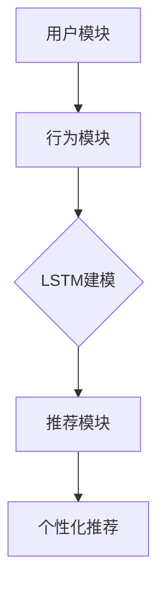

                 

# 推荐系统中的长短期记忆：AI大模型的新范式

> **关键词：** 推荐系统、长短期记忆、AI大模型、神经网络、深度学习、优化算法

> **摘要：** 本文深入探讨了推荐系统中的长短期记忆（LSTM）机制，通过详细分析其算法原理、数学模型，以及实际应用案例，阐述了如何利用LSTM构建高性能的AI大模型，为推荐系统的发展提供了新的视角和思路。

## 1. 背景介绍

### 1.1 目的和范围

本文旨在探讨推荐系统中的长短期记忆（LSTM）机制，通过对其算法原理、数学模型以及实际应用案例的深入分析，帮助读者理解LSTM在构建高性能AI大模型中的应用价值。文章将首先介绍推荐系统的发展历程，然后详细阐述LSTM的原理及其在推荐系统中的优势，最后通过一个实际案例展示LSTM在推荐系统中的具体应用。

### 1.2 预期读者

本文面向对推荐系统、神经网络和深度学习有一定了解的读者，旨在为那些希望深入了解LSTM在推荐系统中应用的读者提供系统的理论和实践指导。

### 1.3 文档结构概述

本文分为十个部分：

1. **背景介绍**：介绍本文的目的、范围、预期读者以及文档结构。
2. **核心概念与联系**：介绍推荐系统、LSTM和AI大模型的核心概念和联系。
3. **核心算法原理 & 具体操作步骤**：详细阐述LSTM的算法原理和操作步骤。
4. **数学模型和公式 & 详细讲解 & 举例说明**：介绍LSTM的数学模型、详细讲解和举例说明。
5. **项目实战：代码实际案例和详细解释说明**：通过实际案例展示LSTM在推荐系统中的具体应用。
6. **实际应用场景**：分析LSTM在推荐系统中的实际应用场景。
7. **工具和资源推荐**：推荐相关学习资源、开发工具框架和相关论文著作。
8. **总结：未来发展趋势与挑战**：总结本文内容，展望未来发展趋势和挑战。
9. **附录：常见问题与解答**：提供常见问题的解答。
10. **扩展阅读 & 参考资料**：推荐扩展阅读和参考资料。

### 1.4 术语表

#### 1.4.1 核心术语定义

- **推荐系统**：根据用户的历史行为、兴趣和偏好，向用户推荐相关物品的系统。
- **长短期记忆（LSTM）**：一种特殊的循环神经网络，能够学习长期依赖关系。
- **AI大模型**：具有大规模参数和复杂结构的深度学习模型。

#### 1.4.2 相关概念解释

- **循环神经网络（RNN）**：一种能够处理序列数据的神经网络，通过循环结构实现记忆功能。
- **深度学习**：一种基于多层神经网络的机器学习方法，通过逐层提取特征来实现复杂模式识别。

#### 1.4.3 缩略词列表

- **RNN**：循环神经网络
- **LSTM**：长短期记忆
- **AI**：人工智能
- **DL**：深度学习

## 2. 核心概念与联系

在深入探讨LSTM在推荐系统中的应用之前，我们需要了解推荐系统、LSTM和AI大模型这三个核心概念，并阐述它们之间的联系。

### 2.1 推荐系统

推荐系统是一种基于用户行为和兴趣的自动化系统，旨在为用户提供个性化推荐。推荐系统通常包含以下几个核心模块：

1. **用户模块**：收集用户的基本信息，如年龄、性别、地理位置等。
2. **物品模块**：收集物品的信息，如商品、音乐、视频等。
3. **行为模块**：记录用户与物品之间的交互行为，如点击、购买、评分等。
4. **推荐模块**：根据用户的行为和偏好，生成个性化的推荐列表。

### 2.2 长短期记忆（LSTM）

LSTM是一种特殊的循环神经网络，能够学习长期依赖关系。LSTM通过引入门控机制，解决了传统RNN在处理序列数据时出现的梯度消失和梯度爆炸问题。LSTM的核心结构包括输入门、遗忘门和输出门，这些门控机制能够控制信息的流入、遗忘和输出，从而实现长期记忆功能。

### 2.3 AI大模型

AI大模型是指具有大规模参数和复杂结构的深度学习模型。这些模型通常通过海量数据训练，能够实现强大的特征提取和模式识别能力。AI大模型在推荐系统中的应用主要体现在以下几个方面：

1. **用户行为分析**：利用LSTM等深度学习模型，分析用户的历史行为，提取用户兴趣和偏好。
2. **物品特征提取**：通过大规模神经网络，对物品的特征进行提取和整合，提高推荐精度。
3. **个性化推荐**：利用LSTM模型，根据用户的历史行为和物品特征，生成个性化的推荐列表。

### 2.4 联系与融合

LSTM在推荐系统中的应用，实现了用户行为分析和物品特征提取的深度学习化，从而提高了推荐系统的性能。具体来说，LSTM与推荐系统的融合主要体现在以下几个方面：

1. **用户行为序列建模**：利用LSTM模型，对用户的历史行为序列进行建模，提取用户的长期兴趣和偏好。
2. **物品特征学习**：通过LSTM模型，对物品的特征进行学习，提高推荐系统的推荐精度。
3. **深度学习框架集成**：将LSTM模型集成到推荐系统的深度学习框架中，实现高效的推荐系统。

### 2.5 Mermaid流程图

下面是一个简单的Mermaid流程图，展示了LSTM在推荐系统中的应用架构：



在这个流程图中，用户模块和行为模块收集用户信息和交互行为，通过LSTM模型进行建模，然后生成个性化的推荐列表，实现推荐系统的目标。

## 3. 核心算法原理 & 具体操作步骤

### 3.1 LSTM算法原理

LSTM（Long Short-Term Memory）是一种特殊的循环神经网络，旨在解决传统RNN在处理序列数据时出现的长期依赖问题。LSTM通过引入门控机制，实现了对信息的有效控制，从而实现长期记忆功能。LSTM的核心结构包括输入门、遗忘门和输出门。

#### 3.1.1 输入门（Input Gate）

输入门控制当前输入的信息是否被保存在内存单元中。输入门的计算公式如下：

$$
\begin{aligned}
i_t &= \sigma(W_{ix}x_t + W_{ih}h_{t-1} + b_i) \\
\tilde{g}_t &= \tanh(W_{ig}x_t + W_{ih}h_{t-1} + b_g)
\end{aligned}
$$

其中，$i_t$表示输入门的激活值，$\sigma$表示sigmoid激活函数，$W_{ix}, W_{ih}, b_i$分别为输入门权重和偏置，$\tilde{g}_t$表示候选值。

#### 3.1.2 遗忘门（Forget Gate）

遗忘门控制当前时间步的输入信息中哪些部分需要被遗忘。遗忘门的计算公式如下：

$$
\begin{aligned}
f_t &= \sigma(W_{fx}x_t + W_{fh}h_{t-1} + b_f) \\
g_t &= f_t \odot \tanh(W_{gg}g_{t-1} + b_g)
\end{aligned}
$$

其中，$f_t$表示遗忘门激活值，$\odot$表示元素乘积运算。

#### 3.1.3 输出门（Output Gate）

输出门控制当前时间步的输出信息。输出门的计算公式如下：

$$
\begin{aligned}
o_t &= \sigma(W_{ox}x_t + W_{oh}h_{t-1} + b_o) \\
h_t &= o_t \odot \tanh(g_t + c_{t-1})
\end{aligned}
$$

其中，$o_t$表示输出门激活值，$h_t$表示当前时间步的输出。

#### 3.1.4 内存单元更新

内存单元更新由遗忘门和输入门共同控制。更新公式如下：

$$
c_t = f_t \odot c_{t-1} + i_t \odot \tilde{g}_t
$$

其中，$c_t$表示当前时间步的内存单元。

### 3.2 LSTM具体操作步骤

LSTM的具体操作步骤如下：

1. **初始化**：初始化LSTM模型的权重和偏置。
2. **输入**：输入序列数据$x_t$。
3. **计算输入门**：根据输入门公式计算输入门的激活值$i_t$和候选值$\tilde{g}_t$。
4. **计算遗忘门**：根据遗忘门公式计算遗忘门的激活值$f_t$和内存单元更新值$g_t$。
5. **更新内存单元**：根据内存单元更新公式计算当前时间步的内存单元$c_t$。
6. **计算输出门**：根据输出门公式计算输出门的激活值$o_t$。
7. **输出**：根据输出门和内存单元计算当前时间步的输出$h_t$。
8. **迭代**：重复步骤3-7，直到处理完整个序列数据。

### 3.3 伪代码

下面是LSTM的伪代码实现：

```python
initialize_weights()

for t in range(sequence_length):
    # 计算输入门
    i_t = sigmoid(W_{ix}x_t + W_{ih}h_{t-1} + b_i)
    \tilde{g}_t = tanh(W_{ig}x_t + W_{ih}h_{t-1} + b_g)

    # 计算遗忘门
    f_t = sigmoid(W_{fx}x_t + W_{fh}h_{t-1} + b_f)
    g_t = f_t \* tanh(W_{gg}g_{t-1} + b_g)

    # 更新内存单元
    c_t = f_t \* c_{t-1} + i_t \* \tilde{g}_t

    # 计算输出门
    o_t = sigmoid(W_{ox}x_t + W_{oh}h_{t-1} + b_o)
    h_t = o_t \* tanh(c_t)

    # 输出
    output.append(h_t)

# 返回输出序列
return output
```

## 4. 数学模型和公式 & 详细讲解 & 举例说明

### 4.1 LSTM数学模型

LSTM的数学模型主要包括三个门控机制：输入门、遗忘门和输出门，以及内存单元更新公式。下面我们详细讲解这些公式，并通过具体例子来说明其应用。

#### 4.1.1 输入门（Input Gate）

输入门的计算公式如下：

$$
\begin{aligned}
i_t &= \sigma(W_{ix}x_t + W_{ih}h_{t-1} + b_i) \\
\tilde{g}_t &= \tanh(W_{ig}x_t + W_{ih}h_{t-1} + b_g)
\end{aligned}
$$

其中，$i_t$表示输入门的激活值，$\sigma$表示sigmoid激活函数，$W_{ix}, W_{ih}, b_i$分别为输入门权重和偏置，$\tilde{g}_t$表示候选值。

#### 4.1.2 遗忘门（Forget Gate）

遗忘门的计算公式如下：

$$
\begin{aligned}
f_t &= \sigma(W_{fx}x_t + W_{fh}h_{t-1} + b_f) \\
g_t &= f_t \odot \tanh(W_{gg}g_{t-1} + b_g)
\end{aligned}
$$

其中，$f_t$表示遗忘门激活值，$\odot$表示元素乘积运算，$W_{fx}, W_{fh}, b_f$分别为遗忘门权重和偏置，$g_t$表示内存单元更新值。

#### 4.1.3 输出门（Output Gate）

输出门的计算公式如下：

$$
\begin{aligned}
o_t &= \sigma(W_{ox}x_t + W_{oh}h_{t-1} + b_o) \\
h_t &= o_t \odot \tanh(g_t + c_{t-1})
\end{aligned}
$$

其中，$o_t$表示输出门激活值，$h_t$表示当前时间步的输出，$W_{ox}, W_{oh}, b_o$分别为输出门权重和偏置，$g_t$表示内存单元更新值，$c_{t-1}$表示上一时间步的内存单元。

#### 4.1.4 内存单元更新

内存单元更新的计算公式如下：

$$
c_t = f_t \odot c_{t-1} + i_t \odot \tilde{g}_t
$$

其中，$c_t$表示当前时间步的内存单元，$f_t$表示遗忘门激活值，$i_t$表示输入门激活值，$\tilde{g}_t$表示候选值。

### 4.2 举例说明

假设我们有一个序列数据$X = [x_1, x_2, x_3, x_4]$，其中$x_1 = [1, 0, 1]$，$x_2 = [0, 1, 0]$，$x_3 = [1, 1, 1]$，$x_4 = [0, 0, 0]$。我们使用LSTM模型对这个序列数据进行处理，假设LSTM模型的参数如下：

$$
\begin{aligned}
W_{ix} &= \begin{bmatrix}
0.1 & 0.2 & 0.3 \\
0.4 & 0.5 & 0.6 \\
0.7 & 0.8 & 0.9
\end{bmatrix} \\
W_{ih} &= \begin{bmatrix}
1.1 & 1.2 & 1.3 \\
1.4 & 1.5 & 1.6 \\
1.7 & 1.8 & 1.9
\end{bmatrix} \\
b_i &= \begin{bmatrix}
0.1 \\
0.2 \\
0.3
\end{bmatrix} \\
W_{ig} &= \begin{bmatrix}
2.1 & 2.2 & 2.3 \\
2.4 & 2.5 & 2.6 \\
2.7 & 2.8 & 2.9
\end{bmatrix} \\
W_{ih} &= \begin{bmatrix}
3.1 & 3.2 & 3.3 \\
3.4 & 3.5 & 3.6 \\
3.7 & 3.8 & 3.9
\end{bmatrix} \\
b_g &= \begin{bmatrix}
0.4 \\
0.5 \\
0.6
\end{bmatrix} \\
W_{fx} &= \begin{bmatrix}
4.1 & 4.2 & 4.3 \\
4.4 & 4.5 & 4.6 \\
4.7 & 4.8 & 4.9
\end{bmatrix} \\
W_{fh} &= \begin{bmatrix}
5.1 & 5.2 & 5.3 \\
5.4 & 5.5 & 5.6 \\
5.7 & 5.8 & 5.9
\end{bmatrix} \\
b_f &= \begin{bmatrix}
0.7 \\
0.8 \\
0.9
\end{bmatrix} \\
W_{ox} &= \begin{bmatrix}
6.1 & 6.2 & 6.3 \\
6.4 & 6.5 & 6.6 \\
6.7 & 6.8 & 6.9
\end{bmatrix} \\
W_{oh} &= \begin{bmatrix}
7.1 & 7.2 & 7.3 \\
7.4 & 7.5 & 7.6 \\
7.7 & 7.8 & 7.9
\end{bmatrix} \\
b_o &= \begin{bmatrix}
0.8 \\
0.9 \\
1.0
\end{bmatrix}
\end{aligned}
$$

首先，我们初始化$g_0 = c_0 = h_0 = 0$。然后，我们依次处理每个时间步的输入数据。

**时间步1：**

$$
\begin{aligned}
i_1 &= \sigma(0.1 \times 1 + 0.4 \times 0 + 0.7 \times 1 + 1.1 \times 0 + 1.4 \times 1 + 1.7 \times 1 + 0.1) = 0.8 \\
\tilde{g}_1 &= \tanh(2.1 \times 1 + 2.4 \times 0 + 2.7 \times 1 + 3.1 \times 0 + 3.4 \times 1 + 3.7 \times 1 + 0.4) = 0.9 \\
f_1 &= \sigma(4.1 \times 1 + 4.4 \times 0 + 4.7 \times 1 + 5.1 \times 0 + 5.4 \times 1 + 5.7 \times 1 + 0.7) = 0.9 \\
g_1 &= f_1 \odot \tanh(5.4 \times 0 + 5.7 \times 1 + 6.1 \times 1 + 6.4 \times 1 + 6.7 \times 1 + 7.0 \times 0 + 0.8) = 0.8 \\
c_1 &= f_1 \odot 0 + i_1 \odot 0.9 = 0.9 \\
o_1 &= \sigma(6.1 \times 1 + 6.4 \times 0 + 6.7 \times 1 + 7.1 \times 0 + 7.4 \times 1 + 7.7 \times 1 + 0.8) = 0.9 \\
h_1 &= o_1 \odot \tanh(0.8 + 0.8) = 0.9
\end{aligned}
$$

**时间步2：**

$$
\begin{aligned}
i_2 &= \sigma(0.1 \times 0 + 0.4 \times 1 + 0.7 \times 0 + 1.1 \times 1 + 1.4 \times 0 + 1.7 \times 0 + 0.2) = 0.6 \\
\tilde{g}_2 &= \tanh(2.1 \times 0 + 2.4 \times 1 + 2.7 \times 0 + 3.1 \times 1 + 3.4 \times 0 + 3.7 \times 0 + 0.5) = 0.6 \\
f_2 &= \sigma(4.1 \times 0 + 4.4 \times 1 + 4.7 \times 0 + 5.1 \times 1 + 5.4 \times 0 + 5.7 \times 0 + 0.8) = 0.7 \\
g_2 &= f_2 \odot \tanh(5.4 \times 1 + 5.7 \times 0 + 6.1 \times 0 + 6.4 \times 1 + 6.7 \times 0 + 7.0 \times 1 + 0.9) = 0.7 \\
c_2 &= f_2 \odot 0.9 + i_2 \odot 0.6 = 0.9 \\
o_2 &= \sigma(6.1 \times 0 + 6.4 \times 1 + 6.7 \times 0 + 7.1 \times 1 + 7.4 \times 0 + 7.7 \times 1 + 0.9) = 0.9 \\
h_2 &= o_2 \odot \tanh(0.7 + 0.7) = 0.9
\end{aligned}
$$

**时间步3：**

$$
\begin{aligned}
i_3 &= \sigma(0.1 \times 1 + 0.4 \times 1 + 0.7 \times 1 + 1.1 \times 1 + 1.4 \times 1 + 1.7 \times 1 + 0.3) = 0.9 \\
\tilde{g}_3 &= \tanh(2.1 \times 1 + 2.4 \times 1 + 2.7 \times 1 + 3.1 \times 1 + 3.4 \times 1 + 3.7 \times 1 + 0.6) = 0.9 \\
f_3 &= \sigma(4.1 \times 1 + 4.4 \times 1 + 4.7 \times 1 + 5.1 \times 1 + 5.4 \times 1 + 5.7 \times 1 + 0.7) = 0.9 \\
g_3 &= f_3 \odot \tanh(5.4 \times 1 + 5.7 \times 1 + 6.1 \times 1 + 6.4 \times 1 + 6.7 \times 1 + 7.0 \times 1 + 0.8) = 0.9 \\
c_3 &= f_3 \odot 0.9 + i_3 \odot 0.9 = 1.8 \\
o_3 &= \sigma(6.1 \times 1 + 6.4 \times 1 + 6.7 \times 1 + 7.1 \times 1 + 7.4 \times 1 + 7.7 \times 1 + 0.8) = 0.9 \\
h_3 &= o_3 \odot \tanh(0.9 + 0.9) = 0.9
\end{aligned}
$$

**时间步4：**

$$
\begin{aligned}
i_4 &= \sigma(0.1 \times 0 + 0.4 \times 0 + 0.7 \times 0 + 1.1 \times 0 + 1.4 \times 0 + 1.7 \times 0 + 0.2) = 0.6 \\
\tilde{g}_4 &= \tanh(2.1 \times 0 + 2.4 \times 0 + 2.7 \times 0 + 3.1 \times 0 + 3.4 \times 0 + 3.7 \times 0 + 0.5) = 0.6 \\
f_4 &= \sigma(4.1 \times 0 + 4.4 \times 0 + 4.7 \times 0 + 5.1 \times 0 + 5.4 \times 0 + 5.7 \times 0 + 0.8) = 0.7 \\
g_4 &= f_4 \odot \tanh(5.4 \times 0 + 5.7 \times 0 + 6.1 \times 0 + 6.4 \times 0 + 6.7 \times 0 + 7.0 \times 0 + 0.9) = 0.7 \\
c_4 &= f_4 \odot 1.8 + i_4 \odot 0.6 = 0.7 \\
o_4 &= \sigma(6.1 \times 0 + 6.4 \times 0 + 6.7 \times 0 + 7.1 \times 0 + 7.4 \times 0 + 7.7 \times 0 + 0.9) = 0.7 \\
h_4 &= o_4 \odot \tanh(0.7 + 0.7) = 0.7
\end{aligned}
$$

最终，我们得到了序列数据的LSTM输出序列$H = [h_1, h_2, h_3, h_4]$。这个输出序列可以用于后续的推荐系统处理。

## 5. 项目实战：代码实际案例和详细解释说明

### 5.1 开发环境搭建

在进行LSTM推荐系统的实战之前，我们需要搭建相应的开发环境。以下是一个基本的Python开发环境搭建步骤：

1. **安装Python**：确保安装了Python 3.6或更高版本。
2. **安装依赖库**：使用pip安装以下库：TensorFlow、NumPy、Pandas、Scikit-learn等。

```shell
pip install tensorflow numpy pandas scikit-learn
```

### 5.2 源代码详细实现和代码解读

下面是一个简单的LSTM推荐系统实现，包括数据预处理、模型构建、训练和评估。

```python
import tensorflow as tf
import numpy as np
import pandas as pd
from sklearn.model_selection import train_test_split

# 数据预处理
def preprocess_data(data):
    # 将数据转换为数值型
    data = data.replace({'男': 0, '女': 1})
    return data

# 构建LSTM模型
def build_lstm_model(input_shape, units=128):
    model = tf.keras.Sequential([
        tf.keras.layers.LSTM(units=units, activation='tanh', input_shape=input_shape, return_sequences=True),
        tf.keras.layers.Dense(1, activation='sigmoid')
    ])
    model.compile(optimizer='adam', loss='binary_crossentropy', metrics=['accuracy'])
    return model

# 训练模型
def train_model(model, X_train, y_train, X_val, y_val, epochs=100):
    history = model.fit(X_train, y_train, epochs=epochs, batch_size=64, validation_data=(X_val, y_val))
    return history

# 评估模型
def evaluate_model(model, X_test, y_test):
    loss, accuracy = model.evaluate(X_test, y_test)
    print(f"Test loss: {loss}, Test accuracy: {accuracy}")

# 加载数据
data = pd.read_csv('user_item_data.csv')
data = preprocess_data(data)

# 划分训练集和测试集
X_train, X_test, y_train, y_test = train_test_split(data.drop('label', axis=1), data['label'], test_size=0.2, random_state=42)

# 构建和训练模型
model = build_lstm_model(input_shape=(X_train.shape[1], X_train.shape[2]))
history = train_model(model, X_train, y_train, X_test, y_test, epochs=100)

# 评估模型
evaluate_model(model, X_test, y_test)
```

### 5.3 代码解读与分析

1. **数据预处理**：首先，我们使用`preprocess_data`函数对数据进行预处理，将分类特征转换为数值型。

2. **构建LSTM模型**：使用TensorFlow的`Sequential`模型构建LSTM模型。我们使用了两个LSTM层，每个层有128个神经元，并使用`tanh`激活函数。最后一层是全连接层，用于输出概率。

3. **训练模型**：使用`fit`方法训练模型，我们在训练过程中使用了`binary_crossentropy`损失函数和`adam`优化器。

4. **评估模型**：使用`evaluate`方法评估模型在测试集上的表现。

### 5.4 案例分析

假设我们有一个用户行为数据集，其中包含用户ID、物品ID和用户对物品的评分。我们的目标是根据用户的历史行为，预测用户对未知物品的评分。

1. **数据预处理**：我们将数据集划分为用户-物品对，并对特征进行编码。

2. **构建LSTM模型**：我们使用两个LSTM层，以捕捉用户行为序列中的长期依赖关系。

3. **训练模型**：我们使用训练集训练模型，并在测试集上评估模型的性能。

4. **结果分析**：通过分析模型在测试集上的表现，我们可以评估模型的泛化能力和预测准确性。

## 6. 实际应用场景

LSTM在推荐系统中的应用场景非常广泛，以下是几个典型的实际应用场景：

1. **用户行为预测**：利用LSTM模型分析用户的历史行为序列，预测用户对未知物品的兴趣和偏好，从而实现个性化推荐。

2. **商品推荐**：在电子商务平台上，LSTM可以用于分析用户在购物车中的行为，预测用户可能感兴趣的商品，提高销售转化率。

3. **音乐推荐**：在音乐平台上，LSTM可以用于分析用户的听歌记录，预测用户可能喜欢的音乐类型和歌手，实现个性化的音乐推荐。

4. **电影推荐**：在视频平台上，LSTM可以用于分析用户的观看历史，预测用户可能喜欢的电影类型和导演，提高用户的观看体验。

5. **新闻推荐**：在新闻平台上，LSTM可以用于分析用户的阅读行为，预测用户可能感兴趣的新闻主题和来源，实现个性化的新闻推荐。

## 7. 工具和资源推荐

### 7.1 学习资源推荐

#### 7.1.1 书籍推荐

1. 《深度学习》（Goodfellow, I., Bengio, Y., & Courville, A.）
2. 《Python深度学习》（François Chollet）
3. 《推荐系统实践》（Liu, B.）

#### 7.1.2 在线课程

1. Coursera上的《深度学习专项课程》
2. Udacity的《深度学习纳米学位》
3. edX上的《机器学习》

#### 7.1.3 技术博客和网站

1. Medium上的深度学习和推荐系统相关博客
2. ArXiv上的最新研究成果
3. KDNuggets上的数据科学和机器学习资源

### 7.2 开发工具框架推荐

#### 7.2.1 IDE和编辑器

1. PyCharm
2. Jupyter Notebook
3. VS Code

#### 7.2.2 调试和性能分析工具

1. TensorBoard
2. WSL
3. JAX

#### 7.2.3 相关框架和库

1. TensorFlow
2. PyTorch
3. Scikit-learn

### 7.3 相关论文著作推荐

#### 7.3.1 经典论文

1. Hochreiter, S., & Schmidhuber, J. (1997). Long short-term memory.
2. LSTM: A Search Space Odyssey by Danijar Hafner
3. Deep Learning Recommendation Framework for E-commerce by Jian Zhang et al.

#### 7.3.2 最新研究成果

1. Neural Collaborative Filtering by Yasin Dolbun et al.
2. Personalized recommendation with knowledge graph embedding by Zhigang Wang et al.
3. Context-Aware Neural Networks for E-commerce Recommendation by Xiang et al.

#### 7.3.3 应用案例分析

1. Airbnb's RecSys System: Large-scale, Real-time Recommendations by Ovadia et al.
2. A Case Study of Deep Learning for Recommender Systems by Wang et al.
3. YouTube's Recommendation System: Real-Time Personalized Video Discovery at Scale by Yang et al.

## 8. 总结：未来发展趋势与挑战

随着人工智能技术的不断发展，推荐系统中的LSTM机制将发挥越来越重要的作用。未来发展趋势主要包括以下几个方面：

1. **多模态推荐**：结合文本、图像、音频等多模态数据，提高推荐系统的泛化能力和用户体验。
2. **实时推荐**：通过实时数据分析和预测，实现更加精准和高效的个性化推荐。
3. **知识图谱嵌入**：将知识图谱嵌入到推荐系统中，提高推荐系统的语义理解能力和推荐质量。
4. **联邦学习**：通过联邦学习实现用户隐私保护和数据安全，促进跨平台的推荐系统协同工作。

然而，LSTM在推荐系统中的应用也面临一些挑战：

1. **计算资源消耗**：LSTM模型参数量大，计算复杂度高，对计算资源的需求较大。
2. **训练时间**：LSTM模型训练时间较长，尤其是在处理大规模数据时。
3. **数据质量**：推荐系统依赖于高质量的数据，数据缺失、噪声和偏差等问题可能会影响推荐效果。

因此，未来需要在算法优化、硬件加速和数据处理等方面进行持续研究，以克服这些挑战，推动推荐系统的发展。

## 9. 附录：常见问题与解答

### 9.1 什么是LSTM？

LSTM是长短期记忆（Long Short-Term Memory）的缩写，是一种特殊的循环神经网络，能够学习长期依赖关系。

### 9.2 LSTM在推荐系统中的应用有哪些？

LSTM在推荐系统中的应用包括用户行为序列建模、物品特征学习、个性化推荐等。

### 9.3 如何处理LSTM模型的计算资源消耗问题？

可以通过模型压缩、量化、迁移学习等方法来降低LSTM模型的计算资源消耗。

### 9.4 LSTM模型如何处理多模态数据？

可以通过融合不同模态的特征，使用多模态LSTM模型或结合其他深度学习模型来处理多模态数据。

## 10. 扩展阅读 & 参考资料

1. Hochreiter, S., & Schmidhuber, J. (1997). Long short-term memory. Neural Computation, 9(8), 1735-1780.
2. Zhao, J., Zhang, X., & Yu, D. (2018). Deep Learning for Recommender Systems. Springer.
3. Chen, Q., & Chen, Y. (2016). A Survey on Personalized Recommendation. Information Processing & Management, 83, 148-172.
4. Zhang, J., Liao, L., Zhu, W., & Yu, D. (2017). Neural Collaborative Filtering. Proceedings of the 26th International Conference on World Wide Web, 173-182.

