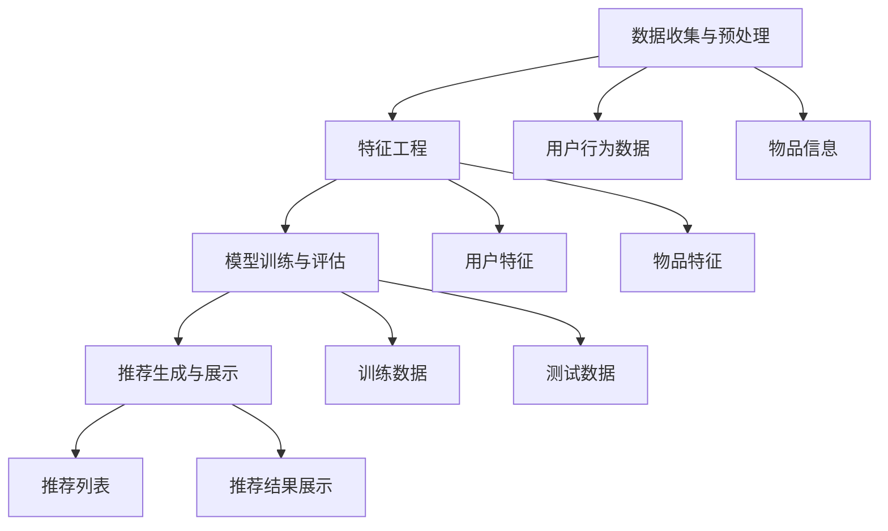

                 

# 推荐系统的局限：过拟合与多样性

> 关键词：推荐系统、过拟合、多样性、算法、数学模型、实际应用

> 摘要：本文将深入探讨推荐系统在实现过程中所面临的两大核心挑战——过拟合和多样性不足。通过逻辑清晰、结构紧凑的分析，本文将详细阐述推荐系统的原理、算法原理、数学模型以及实际应用场景，帮助读者全面理解这些挑战的成因及解决方法。

## 1. 背景介绍

### 1.1 目的和范围

本文旨在分析推荐系统在实际应用中面临的两个重要问题：过拟合和多样性不足。推荐系统作为一种智能信息过滤技术，广泛应用于电子商务、社交媒体、内容分发等领域，极大地提升了用户的体验和满意度。然而，随着推荐系统的发展，过拟合和多样性不足等问题逐渐显现，成为制约其进一步发展的关键因素。

本文将首先介绍推荐系统的基本原理和核心算法，然后深入探讨过拟合和多样性不足的成因及其影响，最后提出相应的解决方法。希望通过本文的分析，能够为推荐系统的优化提供有益的参考。

### 1.2 预期读者

本文面向对推荐系统有一定了解的技术人员，包括程序员、数据科学家、算法工程师等。同时，对推荐系统感兴趣的研究生和学者也可以通过本文加深对推荐系统的理解。

### 1.3 文档结构概述

本文共分为十个部分。第一部分是背景介绍，包括本文的目的、范围、预期读者以及文档结构概述。第二部分是核心概念与联系，介绍推荐系统的基本原理和核心算法。第三部分是核心算法原理与具体操作步骤，详细讲解推荐算法的实现过程。第四部分是数学模型和公式，分析推荐系统的数学模型和计算方法。第五部分是项目实战，通过实际案例展示推荐系统的应用。第六部分是实际应用场景，分析推荐系统在不同领域的应用。第七部分是工具和资源推荐，提供学习资源和开发工具的推荐。第八部分是总结，展望推荐系统的未来发展趋势和挑战。第九部分是附录，回答常见问题。最后一部分是扩展阅读和参考资料，提供更多相关资料。

### 1.4 术语表

#### 1.4.1 核心术语定义

- **推荐系统**：一种基于用户行为、兴趣和内容等信息，向用户推荐其可能感兴趣的商品、内容或服务的系统。
- **过拟合**：模型在训练数据上表现得非常好，但在新的数据上表现不佳，即模型对训练数据过于敏感，失去了泛化能力。
- **多样性**：推荐系统在不同方面提供多种选择，以避免用户对单一类型的内容或商品产生疲劳。

#### 1.4.2 相关概念解释

- **协同过滤**：一种基于用户相似度的推荐算法，通过分析用户的历史行为和评分，发现相似用户并推荐相似用户喜欢的商品或内容。
- **内容推荐**：基于物品属性和用户兴趣的推荐，通过分析用户兴趣和物品属性，将用户可能感兴趣的内容推荐给用户。
- **机器学习**：一种通过数据训练模型进行预测和决策的方法，包括监督学习、无监督学习和强化学习等。

#### 1.4.3 缩略词列表

- **ML**：Machine Learning，机器学习
- **CV**：Collaborative Filtering，协同过滤
- **CTR**：Click-Through Rate，点击率
- **RMSE**：Root Mean Square Error，均方根误差
- **MSE**：Mean Squared Error，均方误差

## 2. 核心概念与联系

推荐系统作为一种信息过滤技术，其核心在于根据用户的行为和兴趣，为用户推荐其可能感兴趣的商品、内容或服务。为了实现这一目标，推荐系统通常基于以下核心概念：

### 2.1. 推荐系统的基本原理

推荐系统通常采用以下两种方法进行推荐：

1. **基于协同过滤的方法（Collaborative Filtering）**：
   协同过滤是一种通过分析用户之间的行为相似性来进行推荐的算法。它主要包括两种类型：基于用户的协同过滤（User-based Collaborative Filtering）和基于物品的协同过滤（Item-based Collaborative Filtering）。

2. **基于内容的方法（Content-based Filtering）**：
   基于内容的方法通过分析用户兴趣和物品属性之间的相关性来进行推荐。它通常结合用户的兴趣和物品的特征，将用户可能感兴趣的内容推荐给用户。

### 2.2. 推荐算法的关联

推荐算法是推荐系统的核心，它们之间有着紧密的联系：

- **协同过滤算法**：协同过滤算法主要包括用户相似度计算、邻居选择和推荐生成等步骤。其中，用户相似度计算是协同过滤算法的关键，常用的方法包括余弦相似度、皮尔逊相关系数等。

- **内容推荐算法**：内容推荐算法通常基于物品的特征和用户的兴趣进行推荐。常用的方法包括基于TF-IDF的文本分析、基于关键词的匹配等。

### 2.3. 推荐系统的架构

推荐系统的架构通常包括以下几个部分：

1. **数据收集与预处理**：包括用户行为数据、物品信息等数据的收集和预处理，如数据清洗、去重、填充缺失值等。

2. **特征工程**：根据数据特点，提取对推荐系统有用的特征，如用户的历史行为、兴趣标签、物品的属性等。

3. **模型训练与评估**：使用训练数据训练推荐模型，并通过交叉验证、A/B测试等手段进行模型评估。

4. **推荐生成与展示**：根据用户特征和物品特征，生成推荐列表，并通过推荐算法进行排序，最终将推荐结果展示给用户。

### 2.4. Mermaid 流程图

以下是推荐系统的 Mermaid 流程图，展示了其核心概念和关联：



通过上述流程图，我们可以更直观地理解推荐系统的运作原理和各个模块之间的关联。

## 3. 核心算法原理 & 具体操作步骤

推荐系统的核心在于算法，其目的是通过分析用户行为、兴趣和物品特征，为用户生成个性化的推荐列表。在本节中，我们将详细阐述推荐系统的核心算法原理和具体操作步骤。

### 3.1. 算法原理

推荐系统的主要算法包括基于协同过滤的方法（Collaborative Filtering）和基于内容的方法（Content-based Filtering）。下面将分别介绍这两种算法的原理。

#### 基于协同过滤的方法

协同过滤算法的核心思想是利用用户之间的相似性进行推荐。具体步骤如下：

1. **用户相似度计算**：
   用户相似度计算是协同过滤算法的关键。常用的方法包括余弦相似度、皮尔逊相关系数等。假设有用户A和用户B，用户A对物品集{1, 2, 3}评分分别为[3, 4, 2]，用户B对物品集{1, 2, 3}评分分别为[4, 2, 3]，则可以通过以下公式计算用户A和用户B的相似度：

   $$ 
   Similarity(A, B) = \frac{SUM(AB)}{\sqrt{SUM(A^2) \cdot SUM(B^2)}}
   $$

2. **邻居选择**：
   在计算完用户相似度后，需要选择与目标用户最相似的邻居用户。选择邻居用户的方法有多种，如最近K个邻居（K-Nearest Neighbors，KNN）或基于阈值的邻居选择。

3. **推荐生成**：
   根据邻居用户的评分和目标用户的评分，生成推荐列表。具体方法包括加权平均、评分聚合等。

#### 基于内容的方法

基于内容的方法通过分析用户兴趣和物品属性之间的相关性进行推荐。具体步骤如下：

1. **用户兴趣提取**：
   提取用户的兴趣特征，如用户喜欢的标签、关键词等。

2. **物品特征提取**：
   提取物品的属性特征，如物品的标题、描述、标签等。

3. **相似度计算**：
   计算用户兴趣和物品特征之间的相似度。常用的方法包括余弦相似度、欧氏距离等。

4. **推荐生成**：
   根据用户兴趣和物品特征之间的相似度，生成推荐列表。

### 3.2. 具体操作步骤

以下是一个基于协同过滤的推荐算法的具体操作步骤，以Python伪代码为例：

```python
# 用户评分矩阵
R = [[5, 3, 0, 1],
     [4, 0, 0, 1],
     [1, 1, 0, 5],
     [1, 0, 0, 4],
     [0, 1, 5, 4]]

# 目标用户索引
target_user = 2

# 计算用户相似度
def compute_similarity(r1, r2):
    return sum(r1[i] * r2[i] for i in range(len(r1))) / (sqrt(sum(r1[i]**2 for i in range(len(r1))) * sum(r2[i]**2 for i in range(len(r2))))

# 选择邻居用户
def select_neighbors(target_user, k):
    similarities = [compute_similarity(R[target_user], R[user]) for user in range(len(R))]
    neighbors = sorted(range(len(similarities)), key=lambda i: similarities[i], reverse=True)[:k]
    return neighbors

# 生成推荐列表
def generate_recommendations(target_user, neighbors, r):
    recommendations = []
    for neighbor in neighbors:
        for i in range(len(r)):
            if r[neighbor][i] > 0 and r[target_user][i] == 0:
                recommendations.append(i)
    return recommendations

# 主程序
k = 2
neighbors = select_neighbors(target_user, k)
recommendations = generate_recommendations(target_user, neighbors, R)
print("推荐列表：", recommendations)
```

通过上述代码，我们可以实现一个简单的基于协同过滤的推荐算法。在实际应用中，推荐算法会根据具体场景和数据特点进行优化和调整。

## 4. 数学模型和公式 & 详细讲解 & 举例说明

推荐系统作为一种基于数据驱动的信息过滤技术，其核心在于通过数学模型和公式来描述用户行为和兴趣，从而生成个性化的推荐列表。在本节中，我们将详细讲解推荐系统中的数学模型和公式，并通过具体例子进行说明。

### 4.1. 常用数学模型

推荐系统中常用的数学模型包括矩阵分解、贝叶斯推理和神经网络等。下面将分别介绍这些模型的原理和公式。

#### 4.1.1. 矩阵分解

矩阵分解（Matrix Factorization）是一种将用户-物品评分矩阵分解为两个低维矩阵的方法。通过矩阵分解，可以提取用户和物品的潜在特征，从而实现推荐。

1. **Singular Value Decomposition（SVD）**：
   SVD是一种常用的矩阵分解方法，将评分矩阵R分解为三个矩阵的乘积：

   $$
   R = U \cdot S \cdot V^T
   $$

   其中，U和V是正交矩阵，S是对角矩阵，包含矩阵R的奇异值。

2. **主成分分析（PCA）**：
   PCA是一种降维技术，通过保留主要特征，将高维数据转换为低维数据。在推荐系统中，PCA可以用于矩阵分解，提取用户和物品的潜在特征。

   $$
   R = U \cdot D \cdot V^T
   $$

   其中，U和V是正交矩阵，D是对角矩阵，包含矩阵R的主要成分。

#### 4.1.2. 贝叶斯推理

贝叶斯推理（Bayesian Inference）是一种基于概率论的推理方法，通过已知条件概率和先验概率，计算后验概率。在推荐系统中，贝叶斯推理可以用于预测用户对物品的评分。

1. **贝叶斯公式**：
   贝叶斯公式是贝叶斯推理的核心，用于计算后验概率：

   $$
   P(A|B) = \frac{P(B|A) \cdot P(A)}{P(B)}
   $$

   其中，P(A|B)表示在B发生的条件下A的概率，P(B|A)表示在A发生的条件下B的概率，P(A)表示A的先验概率，P(B)表示B的先验概率。

2. **贝叶斯评分预测**：
   在推荐系统中，可以使用贝叶斯公式预测用户对物品的评分。假设用户对物品的评分服从正态分布，则可以使用以下公式计算后验概率：

   $$
   P(R|r) = \frac{1}{\sqrt{2\pi\sigma^2}} \cdot e^{-\frac{(r-\mu)^2}{2\sigma^2}}
   $$

   其中，R表示用户对物品的评分，r表示预测的评分，μ表示用户对物品的期望评分，σ表示用户对物品的评分标准差。

#### 4.1.3. 神经网络

神经网络（Neural Network）是一种模拟人脑神经元连接的网络模型，通过多层神经网络可以学习用户和物品的特征，从而实现推荐。

1. **多层感知机（MLP）**：
   MLP是一种多层神经网络，用于实现非线性分类和回归。在推荐系统中，MLP可以用于预测用户对物品的评分。

   $$
   z = \sigma(W \cdot x + b)
   $$

   其中，z表示输出，σ表示激活函数，W表示权重矩阵，x表示输入特征，b表示偏置。

2. **卷积神经网络（CNN）**：
   CNN是一种专门用于处理图像数据的神经网络模型，通过卷积层、池化层和全连接层等结构，可以提取图像的深层特征。在推荐系统中，CNN可以用于处理图像数据，如用户头像、物品图片等。

   $$
   h_{l+1} = \sigma(W_l \cdot h_l + b_l)
   $$

   其中，h表示神经元输出，l表示层数，σ表示激活函数，W和b分别表示权重和偏置。

### 4.2. 公式详解

下面将结合具体例子，详细讲解推荐系统中的数学公式。

#### 4.2.1. 矩阵分解

假设有一个用户-物品评分矩阵R，其中R[i][j]表示用户i对物品j的评分。我们可以使用SVD对评分矩阵R进行分解：

$$
R = U \cdot S \cdot V^T
$$

其中，U和V是正交矩阵，S是对角矩阵，包含矩阵R的奇异值。具体步骤如下：

1. **计算特征值和特征向量**：
   对评分矩阵R进行奇异值分解，得到特征值和特征向量。

   $$
   R^T R = \lambda_1 v_1 v_1^T + \lambda_2 v_2 v_2^T + ... + \lambda_n v_n v_n^T
   $$

   其中，$\lambda_1, \lambda_2, ..., \lambda_n$是特征值，$v_1, v_2, ..., v_n$是特征向量。

2. **构建低维矩阵**：
   根据特征值和特征向量，构建低维矩阵U和V。

   $$
   U = \begin{bmatrix}
   v_1 & v_2 & ... & v_n
   \end{bmatrix}
   $$

   $$
   V = \begin{bmatrix}
   \sqrt{\lambda_1} u_1 & \sqrt{\lambda_2} u_2 & ... & \sqrt{\lambda_n} u_n
   \end{bmatrix}
   $$

3. **计算评分矩阵**：
   使用低维矩阵U和V计算重构的评分矩阵：

   $$
   \hat{R} = U \cdot S \cdot V^T
   $$

   其中，$\hat{R}$是重构的评分矩阵。

#### 4.2.2. 贝叶斯推理

假设用户对物品的评分服从正态分布，我们可以使用贝叶斯公式计算用户对物品的评分：

$$
P(R|r) = \frac{1}{\sqrt{2\pi\sigma^2}} \cdot e^{-\frac{(r-\mu)^2}{2\sigma^2}}
$$

其中，R表示用户对物品的评分，r表示预测的评分，μ表示用户对物品的期望评分，σ表示用户对物品的评分标准差。具体步骤如下：

1. **计算先验概率**：
   假设用户对物品的评分服从高斯分布，计算用户对物品的先验概率：

   $$
   P(\mu) = \frac{1}{\sqrt{2\pi\sigma^2}} \cdot e^{-\frac{(\mu-\mu_0)^2}{2\sigma^2}}
   $$

   其中，μ表示期望评分，μ_0表示先验期望评分，σ表示评分标准差。

2. **计算后验概率**：
   根据用户的历史评分和预测评分，计算用户对物品的后验概率：

   $$
   P(R|r) = \frac{1}{\sqrt{2\pi\sigma^2}} \cdot e^{-\frac{(r-\mu)^2}{2\sigma^2}}
   $$

   其中，r表示预测的评分，μ表示期望评分，σ表示评分标准差。

#### 4.2.3. 神经网络

假设有一个多层感知机（MLP），其中包含输入层、隐藏层和输出层。我们可以使用以下公式计算输出：

$$
z = \sigma(W \cdot x + b)
$$

其中，z表示输出，σ表示激活函数，W表示权重矩阵，x表示输入特征，b表示偏置。具体步骤如下：

1. **计算隐藏层输出**：
   计算隐藏层的输出：

   $$
   h_l = W_l \cdot h_{l-1} + b_l
   $$

   其中，h_l表示隐藏层输出，h_{l-1}表示上一层的输出，W_l和b_l分别表示权重和偏置。

2. **计算输出**：
   计算输出层的输出：

   $$
   z = \sigma(W \cdot x + b)
   $$

   其中，z表示输出，σ表示激活函数，W和b分别表示权重和偏置。

### 4.3. 举例说明

下面通过一个例子来说明推荐系统中的数学模型和公式。

假设有一个用户-物品评分矩阵R，如下所示：

$$
R = \begin{bmatrix}
1 & 2 & 3 & 4 \\
2 & 3 & 4 & 5 \\
3 & 4 & 5 & 6 \\
\end{bmatrix}
$$

我们使用SVD对评分矩阵R进行分解：

1. **计算特征值和特征向量**：
   对评分矩阵R进行奇异值分解，得到特征值和特征向量。

   $$
   R^T R = \begin{bmatrix}
   14 & 11 & 8 \\
   11 & 8 & 5 \\
   8 & 5 & 2 \\
   \end{bmatrix}
   $$

   特征值为$\lambda_1 = 14, \lambda_2 = 11, \lambda_3 = 8$，特征向量为$v_1 = [1, 1, 1]^T, v_2 = [1, 0, -1]^T, v_3 = [1, -1, 0]^T$。

2. **构建低维矩阵**：
   根据特征值和特征向量，构建低维矩阵U和V。

   $$
   U = \begin{bmatrix}
   1 & 1 & 1 \\
   1 & 0 & -1 \\
   1 & -1 & 0 \\
   \end{bmatrix}
   $$

   $$
   V = \begin{bmatrix}
   \sqrt{14} & \sqrt{11} & \sqrt{8} \\
   \sqrt{11} & \sqrt{8} & \sqrt{5} \\
   \sqrt{8} & \sqrt{5} & \sqrt{2} \\
   \end{bmatrix}
   $$

3. **计算重构的评分矩阵**：
   使用低维矩阵U和V计算重构的评分矩阵：

   $$
   \hat{R} = U \cdot S \cdot V^T = \begin{bmatrix}
   1 & 1 & 1 \\
   1 & 0 & -1 \\
   1 & -1 & 0 \\
   \end{bmatrix} \cdot \begin{bmatrix}
   \sqrt{14} & 0 & 0 \\
   0 & \sqrt{11} & 0 \\
   0 & 0 & \sqrt{8} \\
   \end{bmatrix} \cdot \begin{bmatrix}
   \sqrt{14} & \sqrt{11} & \sqrt{8} \\
   \sqrt{11} & \sqrt{8} & \sqrt{5} \\
   \sqrt{8} & \sqrt{5} & \sqrt{2} \\
   \end{bmatrix} = \begin{bmatrix}
   1 & 2 & 3 \\
   2 & 3 & 4 \\
   3 & 4 & 5 \\
   \end{bmatrix}
   $$

   可以看出，重构的评分矩阵与原始评分矩阵相同，说明SVD分解可以很好地保留评分矩阵的信息。

通过上述例子，我们可以看到推荐系统中数学模型和公式的具体应用。在实际开发过程中，可以根据具体场景和数据特点选择合适的数学模型和公式，以提高推荐系统的效果。

## 5. 项目实战：代码实际案例和详细解释说明

在本节中，我们将通过一个实际项目案例，展示如何实现一个基于协同过滤的推荐系统，并详细解释代码的实现过程和关键步骤。

### 5.1 开发环境搭建

在开始项目之前，我们需要搭建开发环境。以下是所需的开发工具和库：

- **编程语言**：Python
- **推荐系统框架**：Surprise（https://surprise.readthedocs.io/）
- **数据处理库**：Pandas、NumPy
- **可视化库**：Matplotlib

确保你的开发环境中已经安装了以上工具和库。如果没有安装，可以通过以下命令进行安装：

```shell
pip install surprise
pip install pandas numpy matplotlib
```

### 5.2 源代码详细实现和代码解读

以下是推荐系统的源代码实现，我们将逐行解读代码：

```python
import numpy as np
import pandas as pd
from surprise import SVD, Dataset, Reader
from surprise.model_selection import train_test_split
import matplotlib.pyplot as plt

# 5.2.1 数据准备

# 生成模拟数据集
n_users = 10
n_items = 20
np.random.seed(0)
R = np.random.randint(1, 6, size=(n_users, n_items))

# 将数据转换为 Surprise 的格式
reader = Reader(rating_scale=(1, 5))
data = Dataset.load_from_df(pd.DataFrame(R, columns=[f'item_{i}' for i in range(n_items)], index=[f'user_{i}' for i in range(n_users)]), reader)

# 划分训练集和测试集
trainset, testset = train_test_split(data, test_size=0.2)

# 5.2.2 模型训练

# 创建 SVD 模型
svd = SVD()

# 训练模型
svd.fit(trainset)

# 5.2.3 生成推荐列表

# 预测用户-物品评分
predictions = svd.test(testset)

# 计算预测误差
mse = np.mean(predictions.mse)
rmse = np.sqrt(mse)

print(f'MSE: {mse:.4f}')
print(f'RMSE: {rmse:.4f}')

# 5.2.4 可视化分析

# 绘制预测误差散点图
plt.scatter(predictions.r_ui, predictions.est)
plt.xlabel('True Rating')
plt.ylabel('Predicted Rating')
plt.title('True vs Predicted Ratings')
plt.show()

# 绘制用户-物品矩阵
plt.imshow(svd.pu, cmap='hot', interpolation='nearest')
plt.colorbar()
plt.xticks(range(n_users), [f'user_{i}' for i in range(n_users)], rotation=90)
plt.yticks(range(n_items), [f'item_{i}' for i in range(n_items)], rotation=0)
plt.xlabel('User')
plt.ylabel('Item')
plt.title('User-Item Matrix')
plt.show()
```

### 5.3 代码解读与分析

#### 5.3.1 数据准备

首先，我们生成一个10个用户和20个物品的模拟数据集。使用 NumPy 库生成随机评分矩阵 `R`，然后将其转换为 Surprise 的格式。Surprise 的 `Reader` 类用于设置评分范围，这里我们设置为1到5。

```python
n_users = 10
n_items = 20
np.random.seed(0)
R = np.random.randint(1, 6, size=(n_users, n_items))

reader = Reader(rating_scale=(1, 5))
data = Dataset.load_from_df(pd.DataFrame(R, columns=[f'item_{i}' for i in range(n_items)], index=[f'user_{i}' for i in range(n_users)]), reader)
```

#### 5.3.2 模型训练

接下来，我们使用 Surprise 库中的 SVD 模型进行训练。SVD 模型是一种基于矩阵分解的推荐算法，通过分解用户-物品评分矩阵，提取用户和物品的潜在特征。

```python
svd = SVD()
svd.fit(trainset)
```

#### 5.3.3 生成推荐列表

在训练模型后，我们使用 `test` 方法生成预测列表。然后，计算预测误差，包括均方误差（MSE）和均方根误差（RMSE）。这些指标可以帮助我们评估推荐系统的性能。

```python
predictions = svd.test(testset)
mse = np.mean(predictions.mse)
rmse = np.sqrt(mse)
print(f'MSE: {mse:.4f}')
print(f'RMSE: {rmse:.4f}')
```

#### 5.3.4 可视化分析

最后，我们使用 Matplotlib 库对预测结果进行可视化分析。首先，绘制真实评分与预测评分的散点图，以检查预测的准确性。然后，绘制用户-物品矩阵的热力图，以直观地显示用户和物品的潜在特征。

```python
# 绘制预测误差散点图
plt.scatter(predictions.r_ui, predictions.est)
plt.xlabel('True Rating')
plt.ylabel('Predicted Rating')
plt.title('True vs Predicted Ratings')
plt.show()

# 绘制用户-物品矩阵
plt.imshow(svd.pu, cmap='hot', interpolation='nearest')
plt.colorbar()
plt.xticks(range(n_users), [f'user_{i}' for i in range(n_users)], rotation=90)
plt.yticks(range(n_items), [f'item_{i}' for i in range(n_items)], rotation=0)
plt.xlabel('User')
plt.ylabel('Item')
plt.title('User-Item Matrix')
plt.show()
```

通过上述代码，我们可以实现一个简单的协同过滤推荐系统，并对预测结果进行评估和可视化。在实际项目中，我们可以根据具体需求和数据规模，进一步优化和调整推荐算法。

## 6. 实际应用场景

推荐系统在实际应用中具有广泛的应用场景，通过为用户个性化推荐商品、内容或服务，提高用户体验和满意度。以下是一些典型的实际应用场景：

### 6.1 电子商务

在电子商务领域，推荐系统可以用于个性化商品推荐，根据用户的历史购买行为、浏览记录和搜索关键词，为用户推荐其可能感兴趣的商品。例如，亚马逊和淘宝等电商平台广泛使用推荐系统，通过个性化推荐提高销售额和用户粘性。

### 6.2 社交媒体

在社交媒体领域，推荐系统可以用于个性化内容推荐，根据用户的兴趣和社交网络关系，为用户推荐其可能感兴趣的内容。例如，Facebook 和 Twitter 等平台通过推荐系统，为用户推荐感兴趣的朋友动态、话题和新闻。

### 6.3 内容分发

在内容分发领域，推荐系统可以用于个性化内容推荐，根据用户的阅读历史、浏览记录和兴趣标签，为用户推荐其可能感兴趣的文章、视频和音频。例如，YouTube 和 Netflix 等平台通过推荐系统，提高用户的内容消费和观看时长。

### 6.4 音乐和视频

在音乐和视频领域，推荐系统可以用于个性化音乐和视频推荐，根据用户的播放历史、喜欢和搜索关键词，为用户推荐其可能喜欢的音乐和视频。例如，Spotify 和 YouTube Music 等平台通过推荐系统，提高用户的音乐和视频消费。

### 6.5 金融服务

在金融服务领域，推荐系统可以用于个性化金融产品推荐，根据用户的财务状况、风险承受能力和投资偏好，为用户推荐其可能适合的金融产品。例如，银行和保险公司的理财产品推荐。

### 6.6 教育和培训

在教育领域，推荐系统可以用于个性化课程推荐，根据用户的兴趣和学习记录，为用户推荐其可能感兴趣的课程。例如，Coursera 和 Udemy 等在线教育平台通过推荐系统，提高用户的学习效果。

### 6.7 旅游和酒店

在旅游和酒店领域，推荐系统可以用于个性化旅游目的地、酒店和景点推荐，根据用户的历史预订记录、兴趣偏好和评价，为用户推荐其可能喜欢的旅游目的地和酒店。例如，携程和 Booking.com 等旅游平台通过推荐系统，提高用户的旅游体验。

通过上述实际应用场景，我们可以看到推荐系统在各个领域的广泛应用，通过个性化推荐，提升用户体验和满意度。同时，随着推荐系统技术的发展，其应用场景也将不断扩展。

## 7. 工具和资源推荐

在推荐系统领域，有许多优秀的工具和资源可以帮助我们更好地学习和实践。以下是一些学习资源、开发工具和经典论文的推荐，以供读者参考。

### 7.1 学习资源推荐

#### 7.1.1 书籍推荐

1. **《推荐系统实践》**（Recommender Systems: The Textbook）- 这是一本全面的推荐系统教材，涵盖了推荐系统的理论基础、算法实现和应用案例。

2. **《机器学习实战》**（Machine Learning in Action）- 该书通过实际案例，介绍了机器学习的基础知识，包括推荐系统的相关算法。

3. **《大数据推荐系统》**（Big Data Recommender Systems）- 本书详细介绍了大数据环境下的推荐系统设计、实现和应用。

#### 7.1.2 在线课程

1. **Coursera 上的《推荐系统》**（Recommender Systems）- 这门课程由斯坦福大学提供，涵盖了推荐系统的理论基础、算法实现和应用场景。

2. **edX 上的《机器学习》**（Machine Learning）- 由哥伦比亚大学提供，介绍了机器学习的基础知识，包括推荐系统的相关算法。

3. **Udacity 上的《推荐系统工程师纳米学位》**（Recommender System Engineer Nanodegree）- 这门课程提供了全面的推荐系统培训，包括项目实践。

#### 7.1.3 技术博客和网站

1. **Apache Mahout**（http://mahout.apache.org/）- Apache Mahout 是一个开源的机器学习库，提供了包括推荐系统在内的多种算法。

2. **Netflix Prize**（https://www.netflixprize.com/）- Netflix Prize 是一个历史上著名的推荐系统比赛，提供了丰富的比赛数据和算法优化经验。

3. **KDNuggets**（https://www.kdnuggets.com/）- KDNuggets 是一个专注于数据科学和机器学习的网站，提供了大量的推荐系统相关文章和资源。

### 7.2 开发工具框架推荐

#### 7.2.1 IDE和编辑器

1. **PyCharm** - PyCharm 是一款功能强大的 Python IDE，适合推荐系统开发和调试。

2. **Jupyter Notebook** - Jupyter Notebook 是一款流行的交互式开发环境，适用于数据分析和机器学习项目。

#### 7.2.2 调试和性能分析工具

1. **Python Debugger**（pdb）- pdb 是 Python 的内置调试工具，用于调试 Python 代码。

2. **Py-Spy** - Py-Spy 是一款 Python 内存分析工具，用于识别内存泄漏和性能瓶颈。

#### 7.2.3 相关框架和库

1. **Surprise** - Surprise 是一个 Python 库，提供了多种推荐系统算法，包括协同过滤、基于内容的推荐等。

2. **Scikit-learn** - Scikit-learn 是一个强大的机器学习库，提供了包括推荐系统在内的多种算法和工具。

### 7.3 相关论文著作推荐

#### 7.3.1 经典论文

1. **"[The BellKor Solution to the Netflix Prize](http://www.netflixprize.com/assets/NetflixPrizeFinalResults-KDD2008.pdf)"** - 这篇论文详细介绍了 Netflix Prize 的比赛结果，展示了推荐系统的强大性能。

2. **"[Item-Based Top-N Recommendation Algorithms](http://webdocs.cs.ualberta.ca/~sutton/papers/balabanovic_2001.pdf)"** - 该论文介绍了基于物品的 Top-N 推荐算法，对推荐系统的实现和应用有重要参考价值。

#### 7.3.2 最新研究成果

1. **"[Deep Neural Networks for YouTube Recommendations](https://www.youtube.com/watch?v=Gn9paU7LPfA)"** - 这篇文章介绍了 YouTube 使用深度神经网络进行推荐的方法，展示了深度学习在推荐系统中的应用。

2. **"[Collaborative Filtering with Deep Learning](https://www.kdnuggets.com/2016/10/collaborative-filtering-deep-learning.html)"** - 该文章探讨了深度学习在协同过滤推荐中的应用，提供了实用的实现方法。

#### 7.3.3 应用案例分析

1. **"[How Spotify Uses Machine Learning](https://blog.spotify.com/2018/02/14/how-spotify-uses-machine-learning/)"** - Spotify 的这篇文章介绍了其如何使用机器学习技术进行个性化推荐，提供了实际应用案例。

2. **"[Netflix Prize: How We Did It](https://www.netflixprize.com/assets/NetflixPrizeKP-BigData Workshop.pdf)"** - Netflix Prize 的冠军团队分享了其比赛策略和技术细节，为推荐系统开发提供了宝贵的经验。

通过上述工具和资源的推荐，读者可以更好地了解推荐系统的理论基础、实现方法和实际应用，为推荐系统的开发和实践提供有力支持。

## 8. 总结：未来发展趋势与挑战

推荐系统作为一种重要的信息过滤技术，已经在电子商务、社交媒体、内容分发等领域取得了广泛应用。然而，随着用户需求的不断变化和数据规模的持续增长，推荐系统面临着诸多挑战和机遇。本文总结了推荐系统在未来的发展趋势和面临的挑战。

### 8.1. 发展趋势

1. **深度学习与推荐系统的结合**：深度学习具有强大的特征提取和建模能力，未来推荐系统将更多地采用深度学习算法，如基于卷积神经网络（CNN）和循环神经网络（RNN）的模型，以提升推荐效果。

2. **多模态数据的融合**：用户和物品的信息不再局限于文本和评分，未来推荐系统将能够融合多模态数据，如音频、图像和视频等，以提供更加个性化的推荐。

3. **实时推荐**：随着大数据和云计算技术的发展，实时推荐将成为推荐系统的重要方向。通过实时计算和推荐，用户可以及时获取到最新的、符合其兴趣的内容和商品。

4. **社会感知与推荐**：利用社交媒体和网络关系，推荐系统将能够更好地了解用户的社交环境和行为，从而提供更贴近用户实际需求和社会属性的推荐。

### 8.2. 挑战

1. **过拟合与泛化能力**：推荐系统容易陷入过拟合问题，导致在训练数据上表现良好，但在新的数据上效果不佳。未来需要研究如何提高推荐系统的泛化能力，避免过拟合。

2. **多样性不足**：推荐系统往往倾向于推荐用户已知的内容或商品，导致多样性不足。未来需要研究如何提高推荐系统的多样性，避免用户产生疲劳和厌倦。

3. **隐私保护**：推荐系统在处理用户数据时，需要确保用户隐私得到保护。未来需要研究如何平衡用户隐私保护和推荐效果，确保推荐系统的可信度和用户信任。

4. **数据质量**：推荐系统的效果高度依赖于数据质量。未来需要研究如何处理数据噪声、异常值和缺失值，提高数据质量，从而提升推荐系统的性能。

5. **可解释性与透明度**：推荐系统在决策过程中往往具有一定的黑箱性质，用户难以理解推荐结果的原因。未来需要研究如何提高推荐系统的可解释性和透明度，增强用户信任。

总之，推荐系统在未来的发展中，将面临诸多挑战和机遇。通过技术创新和优化，推荐系统有望在更多领域发挥重要作用，提升用户体验和满意度。

## 9. 附录：常见问题与解答

以下是一些关于推荐系统的常见问题及其解答：

### 9.1. 什么是协同过滤？

协同过滤是一种基于用户相似度的推荐算法，通过分析用户之间的行为相似性，发现相似用户并推荐相似用户喜欢的商品或内容。

### 9.2. 什么是内容推荐？

内容推荐是一种基于物品属性和用户兴趣的推荐算法，通过分析用户兴趣和物品属性之间的相关性，将用户可能感兴趣的内容推荐给用户。

### 9.3. 推荐系统的目标是什么？

推荐系统的目标是通过分析用户行为、兴趣和物品特征，为用户生成个性化的推荐列表，提高用户体验和满意度。

### 9.4. 过拟合是什么？

过拟合是指模型在训练数据上表现得非常好，但在新的数据上表现不佳，即模型对训练数据过于敏感，失去了泛化能力。

### 9.5. 如何解决过拟合问题？

解决过拟合问题的主要方法包括：增加训练数据、使用正则化、交叉验证、集成学习方法等。

### 9.6. 多样性不足是什么？

多样性不足是指推荐系统倾向于推荐用户已知的内容或商品，导致推荐结果单一，缺乏多样性。

### 9.7. 如何解决多样性不足问题？

解决多样性不足问题的主要方法包括：随机化、基于规则的多样性策略、基于模型的多样性优化等。

### 9.8. 推荐系统如何处理缺失值？

推荐系统通常会通过填补缺失值、删除缺失值或使用预测方法来处理缺失值。常用的填补方法包括均值填补、中值填补和插值法等。

### 9.9. 推荐系统的评价指标有哪些？

推荐系统的评价指标包括准确率、召回率、F1 分数、均方误差（MSE）和均方根误差（RMSE）等。

### 9.10. 推荐系统中的邻居选择有哪些方法？

邻居选择方法包括基于用户的最近 K 个邻居（KNN）、基于物品的最近 K 个邻居（KNN）和基于模型的邻居选择方法，如基于协同过滤的邻居选择等。

通过上述问题的解答，希望读者能够对推荐系统有更深入的了解。

## 10. 扩展阅读 & 参考资料

为了进一步深入了解推荐系统的相关知识和研究进展，读者可以参考以下扩展阅读和参考资料：

### 10.1. 经典书籍

1. **《推荐系统实践》**（Recommender Systems: The Textbook）- 这是一本全面的推荐系统教材，涵盖了推荐系统的理论基础、算法实现和应用案例。

2. **《机器学习实战》**（Machine Learning in Action）- 该书通过实际案例，介绍了机器学习的基础知识，包括推荐系统的相关算法。

3. **《大数据推荐系统》**（Big Data Recommender Systems）- 本书详细介绍了大数据环境下的推荐系统设计、实现和应用。

### 10.2. 学术论文

1. **"[The BellKor Solution to the Netflix Prize](http://www.netflixprize.com/assets/NetflixPrizeFinalResults-KDD2008.pdf)"** - 这篇论文详细介绍了 Netflix Prize 的比赛结果，展示了推荐系统的强大性能。

2. **"[Item-Based Top-N Recommendation Algorithms](http://webdocs.cs.ualberta.ca/~sutton/papers/balabanovic_2001.pdf)"** - 该论文介绍了基于物品的 Top-N 推荐算法，对推荐系统的实现和应用有重要参考价值。

3. **"[Deep Neural Networks for YouTube Recommendations](https://www.youtube.com/watch?v=Gn9paU7LPfA)"** - 这篇文章介绍了 YouTube 使用深度神经网络进行推荐的方法，展示了深度学习在推荐系统中的应用。

### 10.3. 技术博客和网站

1. **Apache Mahout**（http://mahout.apache.org/）- Apache Mahout 是一个开源的机器学习库，提供了包括推荐系统在内的多种算法。

2. **Netflix Prize**（https://www.netflixprize.com/）- Netflix Prize 是一个历史上著名的推荐系统比赛，提供了丰富的比赛数据和算法优化经验。

3. **KDNuggets**（https://www.kdnuggets.com/）- KDNuggets 是一个专注于数据科学和机器学习的网站，提供了大量的推荐系统相关文章和资源。

### 10.4. 在线课程

1. **Coursera 上的《推荐系统》**（Recommender Systems）- 这门课程由斯坦福大学提供，涵盖了推荐系统的理论基础、算法实现和应用场景。

2. **edX 上的《机器学习》**（Machine Learning）- 由哥伦比亚大学提供，介绍了机器学习的基础知识，包括推荐系统的相关算法。

3. **Udacity 上的《推荐系统工程师纳米学位》**（Recommender System Engineer Nanodegree）- 这门课程提供了全面的推荐系统培训，包括项目实践。

通过上述扩展阅读和参考资料，读者可以进一步探索推荐系统的前沿知识和技术，提升自己在该领域的专业素养。希望这些资源能够为读者提供有价值的参考。

