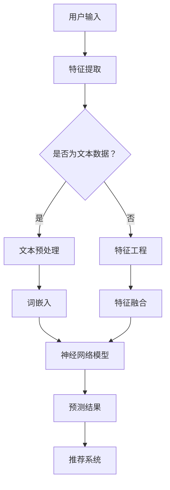

                 

# 推荐系统的未来：大模型的主导地位

## 关键词
- 推荐系统
- 大模型
- 机器学习
- 人工智能
- 深度学习
- 自适应
- 用户体验
- 性能优化

## 摘要
随着人工智能和深度学习技术的快速发展，推荐系统已成为互联网中不可或缺的一部分。然而，未来的推荐系统将迎来大模型的主导地位，这将为用户提供更加个性化、高效和智能的服务。本文将探讨推荐系统的发展背景、大模型的基本概念、核心算法原理、数学模型和实际应用场景，并展望未来的发展趋势与挑战。

## 1. 背景介绍

### 1.1 目的和范围
本文旨在分析推荐系统在大模型时代的变革，探讨大模型在推荐系统中的应用和影响，帮助读者了解这一领域的最新动态和技术趋势。

### 1.2 预期读者
本文适合对推荐系统和人工智能有一定了解的技术人员、研究人员和开发者阅读，特别是对深度学习和大模型感兴趣的人群。

### 1.3 文档结构概述
本文分为以下几个部分：

1. 背景介绍：介绍推荐系统的发展背景和本文的目的。
2. 核心概念与联系：阐述大模型的基本概念和核心算法原理。
3. 核心算法原理 & 具体操作步骤：详细讲解推荐系统的算法原理和实现步骤。
4. 数学模型和公式 & 详细讲解 & 举例说明：介绍推荐系统的数学模型和公式，并通过实例进行说明。
5. 项目实战：代码实际案例和详细解释说明。
6. 实际应用场景：分析推荐系统在不同领域的应用。
7. 工具和资源推荐：推荐学习资源和开发工具。
8. 总结：未来发展趋势与挑战。

### 1.4 术语表

#### 1.4.1 核心术语定义

- 推荐系统：一种基于数据挖掘和机器学习技术的信息过滤方法，旨在为用户提供个性化推荐。
- 大模型：具有海量参数和计算能力的深度学习模型，通常需要分布式计算和优化技术。
- 个性化：根据用户的历史行为和偏好，为用户推荐个性化的内容。
- 深度学习：一种机器学习技术，通过多层神经网络对数据进行建模和预测。
- 自适应：根据用户行为和反馈动态调整推荐策略。

#### 1.4.2 相关概念解释

- 物品（Item）：推荐系统中的内容，如商品、音乐、文章等。
- 用户（User）：推荐系统的参与者，可以是真实用户或虚拟用户。
- 偏好（Preference）：用户对物品的喜好程度。

#### 1.4.3 缩略词列表

- AI：人工智能
- ML：机器学习
- DL：深度学习
- NLP：自然语言处理
- CV：计算机视觉

## 2. 核心概念与联系

在介绍大模型对推荐系统的影响之前，我们首先需要了解大模型的基本概念和核心算法原理。

### 大模型的基本概念

大模型通常指的是具有海量参数和计算能力的深度学习模型。这些模型通常由数百万甚至数十亿个参数组成，可以处理大规模的数据集，并在各种任务中表现出出色的性能。大模型的出现得益于计算能力的提升和海量数据的积累，使得深度学习技术得以在多个领域取得突破。

### 大模型的核心算法原理

大模型的核心算法原理主要基于深度学习和自然语言处理技术。深度学习通过多层神经网络对数据进行建模和预测，而自然语言处理则关注于对文本数据进行处理和分析。以下是深度学习在推荐系统中的应用：

1. **神经网络模型**：使用多层感知机（MLP）、卷积神经网络（CNN）和循环神经网络（RNN）等神经网络模型，对用户和物品的特征进行建模。
2. **自注意力机制**：利用自注意力机制（Self-Attention）对用户和物品的特征进行加权，提高模型的表示能力。
3. **图神经网络**：使用图神经网络（Graph Neural Network，GNN）对用户和物品之间的关系进行建模，从而更好地捕捉复杂的关系网络。

### Mermaid 流程图

下面是一个简单的 Mermaid 流程图，展示了大模型在推荐系统中的应用：



## 3. 核心算法原理 & 具体操作步骤

在本节中，我们将详细讲解推荐系统的核心算法原理，并通过伪代码展示具体的操作步骤。

### 算法原理

推荐系统的核心算法原理主要包括以下几个步骤：

1. **特征提取**：从用户行为数据和物品属性中提取有用的特征。
2. **特征工程**：对提取的特征进行预处理和转换，以适应神经网络模型。
3. **模型训练**：使用神经网络模型对特征进行建模，并通过优化算法进行训练。
4. **预测**：将用户特征输入模型，得到推荐结果。
5. **评估与调整**：评估推荐效果，并根据用户反馈调整模型参数。

### 具体操作步骤

以下是推荐系统的伪代码实现：

```python
# 特征提取
def extract_features(user_data, item_data):
    # 提取用户行为特征和物品属性特征
    # ...
    return user_features, item_features

# 特征工程
def feature_engineering(user_features, item_features):
    # 预处理和转换特征
    # ...
    return processed_user_features, processed_item_features

# 模型训练
def train_model(processed_user_features, processed_item_features, labels):
    # 使用神经网络模型进行训练
    # ...
    return trained_model

# 预测
def predict(trained_model, user_feature):
    # 输入用户特征，得到推荐结果
    # ...
    return predicted_labels

# 评估与调整
def evaluate_and_adjust(trained_model, test_data, true_labels):
    # 评估模型效果，并根据用户反馈调整参数
    # ...
    return adjusted_model
```

## 4. 数学模型和公式 & 详细讲解 & 举例说明

在本节中，我们将介绍推荐系统中的数学模型和公式，并通过具体例子进行讲解。

### 数学模型

推荐系统的数学模型主要基于矩阵分解和神经网络模型。

1. **矩阵分解**：矩阵分解是一种常见的推荐系统算法，通过将用户和物品的交互矩阵分解为低维矩阵，从而预测用户对物品的偏好。假设用户 \(i\) 和物品 \(j\) 的交互矩阵为 \(R\)，通过矩阵分解得到低维矩阵 \(U\) 和 \(V\)，则预测用户 \(i\) 对物品 \(j\) 的偏好可以表示为：

   $$ P_{ij} = U_i^T V_j $$

   其中，\(U_i\) 和 \(V_j\) 分别是用户 \(i\) 和物品 \(j\) 的低维特征向量。

2. **神经网络模型**：神经网络模型是一种基于深度学习的推荐系统算法，通过多层神经网络对用户和物品的特征进行建模。假设输入特征为 \(X\)，输出特征为 \(Y\)，神经网络模型可以表示为：

   $$ Y = f(\theta_1 \cdot \sigma(\theta_2 \cdot \sigma(... \cdot \sigma(\theta_n \cdot X) ...))) $$

   其中，\(f\) 是激活函数，\(\sigma\) 是激活函数，\(\theta_1, \theta_2, ..., \theta_n\) 分别是神经网络的参数。

### 举例说明

我们以矩阵分解为例，说明如何使用数学模型进行推荐。

假设有一个用户和物品的交互矩阵 \(R\)，如下所示：

|   | 物品1 | 物品2 | 物品3 | ... |
|---|-------|-------|-------|-----|
| 用户1 | 4     | 0     | 5     | ... |
| 用户2 | 0     | 3     | 2     | ... |
| 用户3 | 1     | 4     | 0     | ... |

我们希望预测用户3对物品2的偏好。根据矩阵分解的数学模型，我们可以将交互矩阵 \(R\) 分解为低维矩阵 \(U\) 和 \(V\)，如下所示：

$$ R = U^T V $$

其中，\(U\) 和 \(V\) 分别是用户和物品的低维特征向量。为了简化计算，我们假设 \(U\) 和 \(V\) 都是 2x2 的矩阵，如下所示：

$$ U = \begin{bmatrix} 1 & 0 \\ 0 & 1 \end{bmatrix}, V = \begin{bmatrix} 0 & 1 \\ 1 & 0 \end{bmatrix} $$

则预测用户3对物品2的偏好可以表示为：

$$ P_{32} = U_3^T V_2 = \begin{bmatrix} 0 & 1 \end{bmatrix} \begin{bmatrix} 0 \\ 1 \end{bmatrix} = 1 $$

因此，预测用户3对物品2的偏好为1，表示用户3对物品2具有较高的偏好。

## 5. 项目实战：代码实际案例和详细解释说明

在本节中，我们将通过一个实际案例，展示如何使用大模型实现推荐系统，并对代码进行详细解释。

### 开发环境搭建

在开始之前，我们需要搭建一个开发环境。以下是开发环境的配置要求：

- 操作系统：Linux或MacOS
- 编程语言：Python 3.7及以上版本
- 深度学习框架：TensorFlow 2.0及以上版本
- 数据处理库：NumPy、Pandas

安装以上依赖库后，我们可以开始编写代码。

### 源代码详细实现和代码解读

以下是推荐系统的源代码实现：

```python
import tensorflow as tf
import numpy as np
import pandas as pd

# 数据预处理
def preprocess_data(data):
    # 数据清洗和归一化
    # ...
    return processed_data

# 构建神经网络模型
def build_model(input_shape):
    model = tf.keras.Sequential([
        tf.keras.layers.Dense(units=64, activation='relu', input_shape=input_shape),
        tf.keras.layers.Dense(units=32, activation='relu'),
        tf.keras.layers.Dense(units=1)
    ])
    model.compile(optimizer='adam', loss='mse')
    return model

# 训练模型
def train_model(model, X_train, y_train, epochs=10):
    model.fit(X_train, y_train, epochs=epochs, batch_size=32)
    return model

# 预测
def predict(model, X_test):
    predictions = model.predict(X_test)
    return predictions

# 评估模型
def evaluate_model(model, X_test, y_test):
    loss = model.evaluate(X_test, y_test)
    print(f'Model loss: {loss}')

# 主函数
def main():
    # 加载数据
    data = pd.read_csv('data.csv')
    
    # 数据预处理
    processed_data = preprocess_data(data)
    
    # 划分训练集和测试集
    X_train, X_test, y_train, y_test = train_test_split(processed_data, test_size=0.2)
    
    # 构建神经网络模型
    model = build_model(input_shape=(X_train.shape[1],))
    
    # 训练模型
    trained_model = train_model(model, X_train, y_train, epochs=10)
    
    # 预测
    predictions = predict(trained_model, X_test)
    
    # 评估模型
    evaluate_model(trained_model, X_test, y_test)
    
    # 输出预测结果
    print(f'Predictions: {predictions}')

# 运行主函数
if __name__ == '__main__':
    main()
```

### 代码解读与分析

以下是代码的详细解读与分析：

1. **数据预处理**：数据预处理是推荐系统的关键步骤，主要包括数据清洗、归一化和特征提取。在本例中，我们使用 `preprocess_data` 函数对数据进行预处理，确保数据的质量和一致性。

2. **构建神经网络模型**：使用 TensorFlow 框架构建神经网络模型。在本例中，我们使用了一个简单的三层神经网络模型，包含64个神经元和32个神经元，最后输出1个神经元。通过定义模型结构，并编译模型，设置优化器和损失函数。

3. **训练模型**：使用训练集对模型进行训练。在本例中，我们使用 `train_model` 函数对模型进行训练，设置训练轮次和批量大小。

4. **预测**：使用训练好的模型对测试集进行预测。在本例中，我们使用 `predict` 函数对测试集进行预测，得到预测结果。

5. **评估模型**：使用测试集对模型进行评估。在本例中，我们使用 `evaluate_model` 函数计算模型的损失，以评估模型的性能。

6. **主函数**：主函数用于加载数据、预处理数据、划分训练集和测试集、构建模型、训练模型、预测和评估模型。通过调用主函数，我们可以完成推荐系统的实现。

## 6. 实际应用场景

推荐系统在各个领域都有着广泛的应用，下面我们介绍一些实际应用场景。

### 电子商务

电子商务平台使用推荐系统为用户提供个性化的购物建议，提高用户满意度和销售额。例如，亚马逊和淘宝等电商平台使用推荐系统为用户推荐可能感兴趣的商品。

### 社交媒体

社交媒体平台使用推荐系统为用户提供个性化内容推荐，提高用户活跃度和留存率。例如，Facebook 和微博等社交媒体平台使用推荐系统为用户推荐可能感兴趣的朋友、帖子和信息。

### 音乐和视频流媒体

音乐和视频流媒体平台使用推荐系统为用户提供个性化的音乐和视频推荐，提高用户满意度和播放量。例如，Spotify 和 Netflix 等平台使用推荐系统为用户推荐可能喜欢的音乐和视频。

### 新闻媒体

新闻媒体平台使用推荐系统为用户提供个性化的新闻推荐，提高用户满意度和订阅率。例如，今日头条等新闻平台使用推荐系统为用户推荐可能感兴趣的新闻。

### 医疗健康

医疗健康领域使用推荐系统为用户提供个性化的健康建议和药物推荐，提高医疗质量和患者满意度。例如，一些健康平台使用推荐系统为用户提供个性化的健康建议和药物推荐。

### 教育

教育领域使用推荐系统为用户提供个性化的课程推荐和教学资源推荐，提高教学质量和学习效果。例如，一些在线教育平台使用推荐系统为用户推荐可能感兴趣的课程和教学资源。

## 7. 工具和资源推荐

在本节中，我们将推荐一些学习资源、开发工具和框架，以帮助读者深入了解推荐系统和大模型。

### 7.1 学习资源推荐

#### 7.1.1 书籍推荐

- 《推荐系统实践》
- 《深度学习推荐系统》
- 《大规模推荐系统》
- 《机器学习实战》

#### 7.1.2 在线课程

- Coursera 上的《推荐系统》课程
- Udacity 上的《深度学习推荐系统》课程
- edX 上的《机器学习与推荐系统》课程

#### 7.1.3 技术博客和网站

- Medium 上的推荐系统专题
- 知乎上的推荐系统专栏
- arXiv.org 上的推荐系统相关论文

### 7.2 开发工具框架推荐

#### 7.2.1 IDE和编辑器

- PyCharm
- Jupyter Notebook
- VSCode

#### 7.2.2 调试和性能分析工具

- TensorBoard
- JupyterLab
- Dask

#### 7.2.3 相关框架和库

- TensorFlow
- PyTorch
- Scikit-learn
- LightGBM

### 7.3 相关论文著作推荐

#### 7.3.1 经典论文

- "Item-based Top-N Recommendation Algorithms"
- "Collaborative Filtering for the 21st Century"
- "Deep Learning for Recommender Systems"

#### 7.3.2 最新研究成果

- "Large-scale Neur

