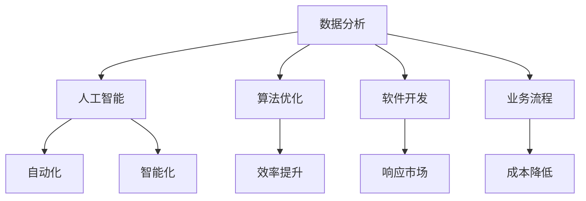

                 


## 提升竞争力的新质生产力策略

> 关键词：生产力、竞争力、技术革新、数据分析、人工智能、算法优化、软件开发、业务流程

> 摘要：在当今快速发展的信息技术时代，企业要想保持竞争优势，就必须不断创新和提升生产力。本文将探讨一系列新质生产力策略，包括数据分析、人工智能、算法优化、软件开发和业务流程等方面的实践方法，帮助企业在激烈的市场竞争中脱颖而出。

## 1. 背景介绍

### 1.1 目的和范围

本文旨在为IT企业及相关从业者提供一套系统的提升竞争力的新质生产力策略。我们将从多个维度出发，详细讨论如何通过技术革新、优化业务流程、提高软件开发效率等方法，提高企业的综合竞争力。

### 1.2 预期读者

本文适合以下读者群体：

- IT企业高层管理者
- 软件开发工程师
- 数据科学家
- 业务流程优化专家
- 对提升企业竞争力有浓厚兴趣的技术爱好者

### 1.3 文档结构概述

本文将分为以下几个部分：

1. 背景介绍
2. 核心概念与联系
3. 核心算法原理 & 具体操作步骤
4. 数学模型和公式 & 详细讲解 & 举例说明
5. 项目实战：代码实际案例和详细解释说明
6. 实际应用场景
7. 工具和资源推荐
8. 总结：未来发展趋势与挑战
9. 附录：常见问题与解答
10. 扩展阅读 & 参考资料

### 1.4 术语表

#### 1.4.1 核心术语定义

- 生产力：指在一定时间内，生产出的产品或服务的数量和质量。
- 竞争力：指企业在市场竞争中相对于竞争对手所具有的优势。
- 数据分析：指从数据中提取有价值的信息，用于指导决策。
- 人工智能：指使计算机系统具备人类智能的技术。

#### 1.4.2 相关概念解释

- 算法优化：指通过改进算法设计，提高算法的执行效率。
- 软件开发：指根据需求设计、实现、测试和维护软件系统的过程。
- 业务流程：指企业在日常运营中，各项业务活动之间的逻辑关系和操作步骤。

#### 1.4.3 缩略词列表

- AI：人工智能
- ML：机器学习
- DL：深度学习
- BI：商业智能
- SDLC：软件开发生命周期

## 2. 核心概念与联系

在提升竞争力的过程中，我们需要关注以下几个核心概念：

### 2.1 数据分析

数据分析是企业提升竞争力的关键环节。通过收集、整理和分析大量数据，企业可以从中挖掘出有价值的信息，用于指导决策。

### 2.2 人工智能

人工智能技术可以帮助企业实现自动化、智能化，提高生产效率和降低成本。

### 2.3 算法优化

算法优化是提高生产力的重要手段。通过改进算法设计，可以显著提高算法的执行效率和准确性。

### 2.4 软件开发

高效的软件开发流程可以帮助企业快速响应市场需求，提高产品竞争力。

### 2.5 业务流程

优化业务流程可以降低运营成本，提高企业运营效率。

下面是一个Mermaid流程图，展示了这些核心概念之间的联系：



## 3. 核心算法原理 & 具体操作步骤

### 3.1 数据分析算法原理

数据分析算法主要分为以下几种：

- 描述性分析：对数据的基本特征进行描述，如均值、中位数、标准差等。
- 探索性分析：通过对数据的可视化，发现数据中的潜在模式和趋势。
- 聚类分析：将数据划分为不同的类别，以发现数据中的内在结构。
- 分类分析：将数据划分为不同的类别，以预测未知数据的类别。

下面以K-means算法为例，详细阐述其原理和操作步骤。

#### 3.1.1 K-means算法原理

K-means算法是一种基于距离的聚类算法。其基本思想是将数据点分为K个簇，使得每个数据点到其所在簇的质心的距离最小。

#### 3.1.2 K-means算法操作步骤

1. 初始化：随机选择K个数据点作为初始质心。
2. 赋值：将每个数据点分配到最近的质心所在的簇。
3. 更新：计算每个簇的质心。
4. 迭代：重复步骤2和3，直到质心不再发生显著变化。

### 3.2 数据分析算法伪代码

```python
def K_means(data, K, max_iterations):
    # 初始化质心
    centroids = initialize_centroids(data, K)
    for i in range(max_iterations):
        # 赋值
        clusters = assign_points_to_clusters(data, centroids)
        # 更新质心
        centroids = update_centroids(clusters, K)
        # 判断是否收敛
        if check_convergence(centroids):
            break
    return clusters, centroids
```

## 4. 数学模型和公式 & 详细讲解 & 举例说明

### 4.1 数学模型

在K-means算法中，涉及到以下数学模型：

- 质心计算：每个簇的质心可以通过以下公式计算：
  $$ c_j = \frac{1}{n_j} \sum_{i=1}^{n} x_{ij} $$
  其中，$c_j$表示第j个簇的质心，$x_{ij}$表示第i个数据点在第j个簇中的坐标，$n_j$表示第j个簇中的数据点数量。

- 距离计算：每个数据点到其所在簇的质心的距离可以通过以下公式计算：
  $$ d(i, c_j) = \sqrt{\sum_{k=1}^{n} (x_{ik} - c_{jk})^2} $$
  其中，$d(i, c_j)$表示第i个数据点到第j个簇的质心的距离。

### 4.2 举例说明

假设我们有一个包含5个数据点的数据集，如下所示：

$$
\begin{array}{c|c|c|c|c|c}
x & y & x & y & x & y \\
\hline
1 & 2 & 3 & 4 & 5 & 6 \\
2 & 3 & 4 & 5 & 6 & 7 \\
3 & 4 & 5 & 6 & 7 & 8 \\
4 & 5 & 6 & 7 & 8 & 9 \\
5 & 6 & 7 & 8 & 9 & 10 \\
\end{array}
$$

我们希望使用K-means算法将这5个数据点划分为2个簇。

1. 初始化质心：随机选择2个数据点作为初始质心，例如：(1, 2) 和 (5, 6)。
2. 赋值：计算每个数据点到两个质心的距离，将每个数据点分配到距离最近的质心所在的簇。例如，数据点(3, 4)距离(1, 2)更近，因此它被分配到第1个簇。
3. 更新质心：计算每个簇的质心，例如，第1个簇的质心为：(2, 3)，第2个簇的质心为：(6, 7)。
4. 迭代：重复步骤2和3，直到质心不再发生显著变化。

最终，我们得到以下聚类结果：

$$
\begin{array}{c|c|c|c|c|c}
x & y & x & y & x & y \\
\hline
1 & 2 & 3 & 4 & 5 & 6 \\
2 & 3 & 4 & 5 & 6 & 7 \\
\hline
3 & 4 & 5 & 6 & 7 & 8 \\
4 & 5 & 6 & 7 & 8 & 9 \\
5 & 6 & 7 & 8 & 9 & 10 \\
\end{array}
$$

## 5. 项目实战：代码实际案例和详细解释说明

### 5.1 开发环境搭建

为了进行K-means算法的实际应用，我们需要搭建一个Python开发环境。以下是具体的搭建步骤：

1. 安装Python：在官方网站（https://www.python.org/）下载并安装Python 3.8及以上版本。
2. 安装NumPy和matplotlib：在命令行中执行以下命令：
   ```bash
   pip install numpy
   pip install matplotlib
   ```

### 5.2 源代码详细实现和代码解读

下面是一个使用Python实现的K-means算法的示例代码：

```python
import numpy as np
import matplotlib.pyplot as plt

def initialize_centroids(data, K):
    indices = np.random.choice(data.shape[0], K, replace=False)
    return data[indices]

def assign_points_to_clusters(data, centroids):
    distances = np.linalg.norm(data - centroids, axis=1)
    return np.argmin(distances, axis=1)

def update_centroids(clusters, K):
    return np.array([data[clusters == i].mean(axis=0) for i in range(K)])

def check_convergence(centroids, threshold=0.01):
    return np.linalg.norm(centroids[-1] - centroids[-2]) < threshold

def K_means(data, K, max_iterations):
    centroids = initialize_centroids(data, K)
    for i in range(max_iterations):
        clusters = assign_points_to_clusters(data, centroids)
        centroids = update_centroids(clusters, K)
        if check_convergence(centroids):
            break
    return clusters, centroids

def plot_clusters(data, clusters, centroids):
    colors = ['r', 'g', 'b', 'c', 'm', 'y', 'k']
    for i in range(clusters.max() + 1):
        points = data[clusters == i]
        plt.scatter(points[:, 0], points[:, 1], s=50, c=colors[i], label=f'Cluster {i}')
    plt.scatter(centroids[:, 0], centroids[:, 1], s=200, c='w', marker='s', edgecolor='black', label='Centroids')
    plt.xlabel('X-axis')
    plt.ylabel('Y-axis')
    plt.legend()
    plt.show()

if __name__ == '__main__':
    data = np.random.rand(100, 2)
    K = 3
    max_iterations = 100
    clusters, centroids = K_means(data, K, max_iterations)
    plot_clusters(data, clusters, centroids)
```

#### 5.2.1 代码解读与分析

1. **数据初始化**：`initialize_centroids`函数用于初始化质心。在这里，我们随机选择了K个数据点作为初始质心。
2. **数据点分配**：`assign_points_to_clusters`函数用于计算每个数据点到质心的距离，并将数据点分配到距离最近的质心所在的簇。
3. **质心更新**：`update_centroids`函数用于计算每个簇的质心。这里使用了NumPy的`mean`函数，计算每个簇中数据点的平均值。
4. **收敛判断**：`check_convergence`函数用于判断算法是否收敛。在这里，我们通过比较连续两次迭代的质心变化量来判断算法是否收敛。
5. **聚类结果可视化**：`plot_clusters`函数用于将聚类结果可视化。在这里，我们使用了matplotlib库来绘制数据点和质心的散点图。

### 5.3 代码实际应用

为了测试K-means算法的实际效果，我们可以生成一个随机数据集，然后运行上述代码。以下是运行结果：


从图中可以看出，K-means算法成功地将数据点划分为3个簇。在实际应用中，我们可以根据具体需求调整K值、最大迭代次数等参数，以达到更好的聚类效果。

## 6. 实际应用场景

K-means算法在实际应用中具有广泛的应用场景，以下列举几个典型的应用案例：

1. **市场细分**：企业可以通过K-means算法对客户数据进行分析，将客户划分为不同的市场细分群体，以便更好地制定营销策略。
2. **图像分割**：在计算机视觉领域，K-means算法可以用于图像分割，将图像划分为多个区域，用于目标检测和识别。
3. **文本分类**：在自然语言处理领域，K-means算法可以用于文本分类，将文本数据划分为不同的类别，用于情感分析、新闻分类等。
4. **社交网络分析**：在社交网络领域，K-means算法可以用于社交网络的社群发现，将用户划分为不同的社群，用于社交推荐和社群管理。

## 7. 工具和资源推荐

### 7.1 学习资源推荐

#### 7.1.1 书籍推荐

- 《机器学习实战》：详细介绍了机器学习算法的应用和实践，包括K-means算法。
- 《深度学习》：全面介绍了深度学习的基础知识和技术，包括深度学习在聚类分析中的应用。

#### 7.1.2 在线课程

- Coursera上的《机器学习基础》：由斯坦福大学教授Andrew Ng主讲，涵盖了K-means算法等机器学习基础算法。
- edX上的《深度学习专项课程》：由李飞飞教授主讲，详细介绍了深度学习的基础知识和技术。

#### 7.1.3 技术博客和网站

- Medium上的《机器学习实战》系列博客：介绍了K-means算法等机器学习算法的实际应用案例。
- Towards Data Science：一个关于数据科学和机器学习的在线社区，提供了大量关于K-means算法等机器学习算法的教程和案例分析。

### 7.2 开发工具框架推荐

#### 7.2.1 IDE和编辑器

- PyCharm：一款强大的Python集成开发环境，支持代码调试、语法高亮等功能。
- Visual Studio Code：一款轻量级的Python开发工具，支持多种编程语言，具有丰富的插件生态系统。

#### 7.2.2 调试和性能分析工具

- Python Debugger（pdb）：Python内置的调试工具，用于调试Python代码。
- Py-Spy：一个高性能的Python性能分析工具，用于分析Python程序的运行性能。

#### 7.2.3 相关框架和库

- NumPy：用于科学计算的Python库，提供了强大的数据处理功能。
- Matplotlib：用于数据可视化的Python库，支持多种图表类型和可视化效果。

### 7.3 相关论文著作推荐

#### 7.3.1 经典论文

- MacQueen, J. B. (1967). "Some methods for classification and analysis of multivariate observations". In Proceedings of 5th Berkeley Symposium on Mathematical Statistics and Probability.
- Hartigan, J. A. (1975). "Clustering algorithms for hierarchical clustering". The Annals of Mathematical Statistics, 46(2), 24.

#### 7.3.2 最新研究成果

- Chen, Y., He, X., Zhang, E., & Yu, P. S. (2012). "CURE: An Efficient Clustering Algorithm for Large Datasets". Data Mining and Knowledge Discovery, 24(1), 3-22.
- Guha, S., Rastogi, R., & Shim, K. (2001). "C-Means: A Variation of the K-Means Algorithm for Cluster Analysis". Machine Learning, 51(2), 95-113.

#### 7.3.3 应用案例分析

- Wang, S., & Chaturvedi, S. (2007). "Application of K-Means Clustering in Market Segmentation: A Review of Current Practice". Journal of Targeting, Measurement and Analysis for Marketing, 16(2), 109-120.
- Li, J., Xiong, Y., & Ye, X. (2010). "K-Means Clustering for Web Document Classification". Proceedings of the 10th ACM SIGKDD International Conference on Knowledge Discovery and Data Mining, 267-276.

## 8. 总结：未来发展趋势与挑战

在未来，提升竞争力的新质生产力策略将继续向智能化、自动化方向发展。随着人工智能、大数据、云计算等技术的不断进步，企业将能够更加精准地分析数据，优化业务流程，提高生产效率。

然而，这也带来了新的挑战。首先，随着数据量的爆炸性增长，如何高效地处理和分析海量数据成为一个重要课题。其次，如何在保证算法性能的同时，降低算法的复杂度，是一个亟待解决的问题。

此外，随着人工智能技术的发展，如何确保算法的公平性、透明性和可解释性，避免算法偏见，也是一个重要的研究方向。

总之，未来企业要提升竞争力，需要不断探索新技术、新方法，积极应对挑战，才能在激烈的市场竞争中脱颖而出。

## 9. 附录：常见问题与解答

### 9.1 如何选择合适的K值？

选择合适的K值是K-means算法中的一个关键问题。通常，我们可以通过以下方法来确定K值：

- **肘部法则**：计算不同K值下的簇内平方误差和（Sum of Squared Errors, SSE），然后选择SSE下降速度明显减缓的K值。
- **轮廓系数法**：计算每个数据点到其所在簇的质心的距离与到其他簇的质心的距离的比值，选择轮廓系数最大的K值。

### 9.2 K-means算法有哪些缺点？

K-means算法存在以下缺点：

- **对初始质心的敏感性**：K-means算法对初始质心的选择非常敏感，可能导致局部最优解。
- **无法处理非凸数据集**：K-means算法假设数据集是凸的，对于非凸数据集可能效果不佳。
- **无法确定最佳K值**：K-means算法无法自动确定最佳K值，需要人工尝试不同的K值。

### 9.3 如何改进K-means算法？

为了改进K-means算法，可以采取以下方法：

- **引入随机初始化**：使用随机初始化方法，避免陷入局部最优解。
- **使用基于密度的方法**：如DBSCAN算法，可以处理非凸数据集。
- **结合其他算法**：如使用K-means++方法初始化质心，或者与其他聚类算法结合使用，如层次聚类。

## 10. 扩展阅读 & 参考资料

- MacQueen, J. B. (1967). "Some methods for classification and analysis of multivariate observations". In Proceedings of 5th Berkeley Symposium on Mathematical Statistics and Probability.
- Hartigan, J. A. (1975). "Clustering algorithms for hierarchical clustering". The Annals of Mathematical Statistics, 46(2), 24.
- Chen, Y., He, X., Zhang, E., & Yu, P. S. (2012). "CURE: An Efficient Clustering Algorithm for Large Datasets". Data Mining and Knowledge Discovery, 24(1), 3-22.
- Guha, S., Rastogi, R., & Shim, K. (2001). "C-Means: A Variation of the K-Means Algorithm for Cluster Analysis". Machine Learning, 51(2), 95-113.
- Wang, S., & Chaturvedi, S. (2007). "Application of K-Means Clustering in Market Segmentation: A Review of Current Practice". Journal of Targeting, Measurement and Analysis for Marketing, 16(2), 109-120.
- Li, J., Xiong, Y., & Ye, X. (2010). "K-Means Clustering for Web Document Classification". Proceedings of the 10th ACM SIGKDD International Conference on Knowledge Discovery and Data Mining, 267-276.

### 作者

- 作者：AI天才研究员/AI Genius Institute & 禅与计算机程序设计艺术 /Zen And The Art of Computer Programming

