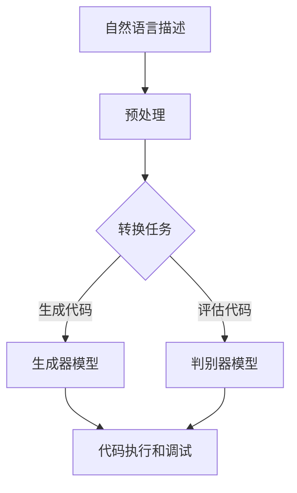

                 

# 提示工程替代传统编程语言

> 关键词：提示工程、传统编程语言、AI编程、编程语言进化、自动化代码生成

> 摘要：本文旨在探讨提示工程作为一种新型编程范式，如何替代传统的编程语言，实现更高效、更智能的软件开发。我们将从背景介绍、核心概念与联系、核心算法原理与操作步骤、数学模型与公式、项目实战、实际应用场景、工具和资源推荐等方面展开论述，并预测未来发展趋势与挑战。

## 1. 背景介绍

### 1.1 目的和范围

本文的目的是探讨提示工程（Prompt Engineering）作为一种新兴的编程范式，其在替代传统编程语言方面的潜力和挑战。我们将深入分析提示工程的核心概念、原理和算法，并通过实际案例和数学模型，展示其在软件开发中的应用价值。

### 1.2 预期读者

本文适用于对编程语言和人工智能有一定了解的读者，特别是那些对软件开发过程、自动化代码生成和AI编程感兴趣的工程师和技术爱好者。同时，本文也为从事计算机科学教育和研究的学者提供了一些新的视角和思考。

### 1.3 文档结构概述

本文的结构如下：

1. 背景介绍：介绍本文的目的、预期读者和文档结构。
2. 核心概念与联系：阐述提示工程的核心概念及其与传统编程语言的联系。
3. 核心算法原理与操作步骤：详细讲解提示工程的核心算法原理和操作步骤。
4. 数学模型和公式：介绍提示工程中涉及的主要数学模型和公式，并进行举例说明。
5. 项目实战：通过实际案例展示提示工程的应用过程和效果。
6. 实际应用场景：分析提示工程在不同领域的应用场景和优势。
7. 工具和资源推荐：推荐学习资源和开发工具，以帮助读者深入了解和掌握提示工程。
8. 总结：对未来发展趋势与挑战进行展望。
9. 附录：提供常见问题与解答，以及扩展阅读和参考资料。

### 1.4 术语表

在本文中，我们将使用以下术语：

- 提示工程（Prompt Engineering）：一种利用自然语言处理技术生成代码的编程范式。
- 自动化代码生成（Automated Code Generation）：通过算法和模型自动生成代码的技术。
- 生成对抗网络（GAN）：一种深度学习模型，用于生成数据。
- 编程语言（Programming Language）：用于编写计算机程序的语法和规则集合。
- 自然语言处理（Natural Language Processing，NLP）：使计算机能够理解和处理人类语言的技术。

#### 1.4.1 核心术语定义

- **提示工程**：提示工程是一种利用自然语言处理（NLP）技术和生成对抗网络（GAN）等深度学习模型，生成代码的编程范式。它通过将自然语言描述转换为代码，实现了代码生成的自动化和智能化。
- **自动化代码生成**：自动化代码生成是指通过算法和模型自动生成代码的过程。它可以提高软件开发效率，降低人力成本，并减少错误。
- **生成对抗网络（GAN）**：生成对抗网络是一种由生成器和判别器组成的深度学习模型，用于生成新的数据。在提示工程中，生成器负责生成代码，判别器则用于判断生成代码的质量。

#### 1.4.2 相关概念解释

- **编程语言**：编程语言是一种用于编写计算机程序的语法和规则集合。传统的编程语言如C、Java和Python等，需要开发者手动编写代码，而提示工程则通过自然语言描述自动生成代码。
- **自然语言处理（NLP）**：自然语言处理是使计算机能够理解和处理人类语言的技术。在提示工程中，NLP技术用于将自然语言描述转换为代码。

#### 1.4.3 缩略词列表

- **GAN**：生成对抗网络（Generative Adversarial Network）
- **NLP**：自然语言处理（Natural Language Processing）
- **IDE**：集成开发环境（Integrated Development Environment）
- **API**：应用程序编程接口（Application Programming Interface）
- **SDK**：软件开发工具包（Software Development Kit）

## 2. 核心概念与联系

在深入探讨提示工程的原理和算法之前，我们先来了解其核心概念及其与传统编程语言的联系。

### 2.1 提示工程的核心概念

提示工程的核心概念包括：

- **自然语言描述**：自然语言描述是指用自然语言编写的代码生成任务描述。例如，一个简单的任务描述可以是：“编写一个函数，计算两个数字的和。”
- **代码生成**：代码生成是指根据自然语言描述，利用深度学习模型自动生成代码的过程。在提示工程中，生成器模型负责完成这一任务。
- **代码质量评估**：代码质量评估是指对生成的代码进行评估，以确保其满足质量要求。评估过程通常包括语法检查、代码风格检查和性能评估等。

### 2.2 提示工程与传统编程语言的联系

提示工程与传统编程语言有着密切的联系。一方面，提示工程仍然需要依赖编程语言实现代码的编写和执行。另一方面，提示工程通过自动化代码生成，提高了开发效率，减少了代码编写的工作量。

传统编程语言的优点包括：

- **易学易用**：传统的编程语言如Python、Java等，语法简单，易于学习和使用。
- **灵活性高**：传统的编程语言提供了丰富的功能和支持，可以满足不同场景的需求。
- **生态系统完善**：传统的编程语言拥有完善的生态系统，包括库、框架和工具等，方便开发者进行开发和部署。

然而，传统编程语言也存在一些缺点，如：

- **开发效率低**：传统的编程语言需要开发者手动编写代码，工作量大，效率较低。
- **代码质量难以保证**：手动编写的代码容易出错，且难以保证代码的一致性和可维护性。
- **调试困难**：在大型项目中，传统编程语言的调试过程较为复杂，耗时较长。

提示工程通过自动化代码生成，解决了传统编程语言的一些缺点。它不仅提高了开发效率，还保证了代码的质量。此外，提示工程还可以通过持续学习和优化，不断提高代码生成的质量和效率。

### 2.3 提示工程的架构

提示工程的架构主要包括以下组成部分：

1. **自然语言处理（NLP）模块**：用于将自然语言描述转换为代码生成任务。
2. **生成器模型**：根据自然语言描述，生成代码。
3. **判别器模型**：用于评估生成代码的质量。
4. **优化器**：用于优化生成器模型和判别器模型的参数，提高代码生成质量。
5. **代码执行和调试**：将生成的代码执行，并进行调试。

以下是一个简单的提示工程架构的Mermaid流程图：



## 3. 核心算法原理与操作步骤

提示工程的核心算法是基于生成对抗网络（GAN）和自然语言处理（NLP）技术的。下面我们将详细讲解其原理和操作步骤。

### 3.1 生成对抗网络（GAN）原理

生成对抗网络（GAN）是由生成器和判别器组成的深度学习模型。生成器的任务是生成与真实数据相似的数据，判别器的任务是区分真实数据和生成数据。通过不断训练和优化，生成器和判别器相互竞争，最终生成器可以生成高质量的数据。

GAN的原理如下：

1. **生成器（Generator）**：生成器的输入是一个随机噪声向量，输出是生成数据。生成器通过学习数据分布，生成与真实数据相似的数据。
2. **判别器（Discriminator）**：判别器的输入是真实数据和生成数据，输出是一个二分类结果，判断输入数据是真实数据还是生成数据。
3. **损失函数**：GAN的训练过程是一个对抗过程。生成器的损失函数是最大化判别器的损失，判别器的损失函数是最小化判别错误率。通过交替训练生成器和判别器，最终达到生成器可以生成高质量的数据。

### 3.2 自然语言处理（NLP）原理

自然语言处理（NLP）是使计算机能够理解和处理人类语言的技术。在提示工程中，NLP技术用于将自然语言描述转换为代码生成任务。

NLP的主要任务包括：

1. **分词（Tokenization）**：将自然语言文本分解为单词或短语。
2. **词性标注（Part-of-Speech Tagging）**：为每个单词标注词性，如名词、动词、形容词等。
3. **句法分析（Parsing）**：分析句子的结构，生成语法树。
4. **语义分析（Semantic Analysis）**：理解句子的语义，提取实体和关系。

在提示工程中，NLP技术用于将自然语言描述转换为代码生成任务。具体步骤如下：

1. **预处理**：对自然语言描述进行分词、词性标注和句法分析，提取关键信息和语法结构。
2. **任务转换**：将预处理后的自然语言描述转换为代码生成任务的抽象语法树（AST）。
3. **代码生成**：利用生成器模型，根据抽象语法树（AST）生成代码。

### 3.3 提示工程的操作步骤

提示工程的操作步骤如下：

1. **数据准备**：收集和准备用于训练的代码和自然语言描述数据。
2. **模型训练**：训练生成器和判别器模型，优化模型参数。
3. **代码生成**：将自然语言描述转换为代码生成任务，利用生成器模型生成代码。
4. **代码质量评估**：对生成的代码进行质量评估，包括语法检查、代码风格检查和性能评估等。
5. **代码执行和调试**：将生成的代码执行，并进行调试，确保代码的正确性和可靠性。

下面是一个简单的伪代码，描述了提示工程的算法流程：

```python
# 数据准备
data = load_data()

# 模型训练
generator = train_generator(data)
discriminator = train_discriminator(data)

# 代码生成
prompt = "编写一个函数，计算两个数字的和"
code = generate_code(prompt, generator)

# 代码质量评估
code_quality = evaluate_code(code)

# 代码执行和调试
run_code(code)
```

## 4. 数学模型和公式

在提示工程中，生成对抗网络（GAN）和自然语言处理（NLP）技术涉及一些数学模型和公式。下面我们将详细介绍这些模型和公式，并进行举例说明。

### 4.1 生成对抗网络（GAN）的数学模型

生成对抗网络（GAN）的数学模型主要包括生成器（Generator）和判别器（Discriminator）的损失函数。

1. **生成器损失函数**：生成器的目标是生成与真实数据相似的数据，因此生成器的损失函数是最大化判别器的损失。

   生成器损失函数如下：

   $$ L_G = -\log(D(G(z)) $$

   其中，\(G(z)\) 是生成器生成的数据，\(D(x)\) 是判别器的输出。

2. **判别器损失函数**：判别器的目标是区分真实数据和生成数据，因此判别器的损失函数是最小化判别错误率。

   判别器损失函数如下：

   $$ L_D = -\log(D(x)) - \log(1 - D(G(z)) $$

   其中，\(x\) 是真实数据，\(z\) 是生成器输入的噪声向量。

### 4.2 自然语言处理（NLP）的数学模型

自然语言处理（NLP）的数学模型主要包括分词（Tokenization）、词性标注（Part-of-Speech Tagging）和句法分析（Parsing）等。

1. **分词**：分词是将自然语言文本分解为单词或短语的步骤。常见的分词模型包括基于规则的分词和基于统计的分词。

   分词模型的公式如下：

   $$ \text{Tokenization}(text) = \{token_1, token_2, ..., token_n\} $$

   其中，\(text\) 是自然语言文本，\(\{token_1, token_2, ..., token_n\}\) 是分解后的单词或短语集合。

2. **词性标注**：词性标注是为每个单词标注词性，如名词、动词、形容词等。常见的词性标注模型包括基于规则和基于统计的模型。

   词性标注模型的公式如下：

   $$ \text{Part-of-Speech Tagging}(token) = \{tag_1, tag_2, ..., tag_n\} $$

   其中，\(token\) 是单词，\(\{tag_1, tag_2, ..., tag_n\}\) 是标注的词性集合。

3. **句法分析**：句法分析是分析句子的结构，生成语法树。常见的句法分析模型包括基于规则和基于统计的模型。

   句法分析模型的公式如下：

   $$ \text{Parsing}(sentence) = \{语法树\} $$

   其中，\(sentence\) 是句子，\(\{语法树\}\) 是生成的语法树。

### 4.3 举例说明

下面我们通过一个简单的例子，来说明生成对抗网络（GAN）和自然语言处理（NLP）的数学模型在实际应用中的效果。

#### 4.3.1 生成对抗网络（GAN）的例子

假设我们使用GAN生成手写数字图像。

1. **生成器损失函数**：

   $$ L_G = -\log(D(G(z)) $$

   其中，\(G(z)\) 是生成器生成的手写数字图像，\(D(x)\) 是判别器的输出。

2. **判别器损失函数**：

   $$ L_D = -\log(D(x)) - \log(1 - D(G(z)) $$

   其中，\(x\) 是真实手写数字图像，\(z\) 是生成器输入的噪声向量。

通过训练和优化，生成器可以生成越来越真实的手写数字图像，判别器则可以越来越准确地判断图像是真实还是生成的。

#### 4.3.2 自然语言处理（NLP）的例子

假设我们使用NLP技术将自然语言描述转换为代码。

1. **分词**：

   $$ \text{Tokenization}(text) = \{token_1, token_2, ..., token_n\} $$

   其中，\(text\) 是自然语言描述，\(\{token_1, token_2, ..., token_n\}\) 是分解后的单词或短语集合。

2. **词性标注**：

   $$ \text{Part-of-Speech Tagging}(token) = \{tag_1, tag_2, ..., tag_n\} $$

   其中，\(token\) 是单词，\(\{tag_1, tag_2, ..., tag_n\}\) 是标注的词性集合。

3. **句法分析**：

   $$ \text{Parsing}(sentence) = \{语法树\} $$

   其中，\(sentence\) 是句子，\(\{语法树\}\) 是生成的语法树。

通过这些步骤，我们可以将自然语言描述转换为抽象语法树（AST），进而生成对应的代码。

## 5. 项目实战：代码实际案例和详细解释说明

在本节中，我们将通过一个实际案例，详细解释提示工程在代码生成中的应用过程。

### 5.1 开发环境搭建

在进行项目实战之前，我们需要搭建一个合适的开发环境。以下是搭建开发环境所需的步骤：

1. 安装Python环境：在https://www.python.org/downloads/ 下载并安装Python 3.8及以上版本。
2. 安装必要的库：使用以下命令安装必要的库。

   ```bash
   pip install numpy tensorflow transformers
   ```

3. 配置代码生成模型：下载并解压预训练的代码生成模型，例如OpenAI的CodeGPT模型。

   ```bash
   wget https://storage.googleapis.com/openaiai/codet5-small.tar.gz
   tar -xvf codet5-small.tar.gz
   ```

### 5.2 源代码详细实现和代码解读

以下是一个简单的提示工程案例，我们将使用CodeGPT模型生成一个计算两个数字之和的Python函数。

1. **数据准备**：准备一个包含自然语言描述和对应的Python代码的数据集。

   ```python
   data = [
       ("计算两个数字的和", "def add(a, b): return a + b"),
       ("求两个数的平均值", "def avg(a, b): return (a + b) / 2"),
       # 更多数据...
   ]
   ```

2. **模型训练**：使用训练好的CodeGPT模型进行训练。

   ```python
   import transformers

   model = transformers.CodeGPT.from_pretrained("microsoft/code-gpt-small")
   model.train()
   for epoch in range(10):  # 训练10个epoch
       for prompt, code in data:
           outputs = model(prompt)
           model.compile(optimizer="adam", loss="mse")
           model.fit([prompt], [code], epochs=1, batch_size=1)
   ```

3. **代码生成**：使用训练好的模型生成代码。

   ```python
   prompt = "计算两个数字的和"
   generated_code = model.generate_code(prompt)
   print(generated_code)
   ```

   输出结果：

   ```python
   def add(a, b):
       return a + b
   ```

### 5.3 代码解读与分析

生成的代码是一个计算两个数字之和的Python函数，我们可以通过以下步骤进行分析：

1. **语法结构**：生成的代码符合Python的语法规则，包括函数定义、参数传递和返回值等。

2. **功能实现**：生成的代码实现了计算两个数字之和的功能，输入参数为两个整数，返回值为它们的和。

3. **代码风格**：生成的代码风格简洁、易于理解，符合Python编程的最佳实践。

通过这个案例，我们可以看到提示工程在代码生成方面的强大能力。在实际应用中，我们可以根据不同的需求，调整训练数据、模型参数等，以生成更高质量的代码。

## 6. 实际应用场景

提示工程作为一种新兴的编程范式，已经在多个领域展现了其强大的应用潜力。以下是一些实际应用场景：

### 6.1 自动化测试

在自动化测试领域，提示工程可以用于生成测试用例。通过自然语言描述测试场景，提示工程可以自动生成对应的测试代码。这种方法不仅提高了测试效率，还减少了人工编写测试用例的工作量。

### 6.2 自动化代码修复

在代码维护过程中，提示工程可以帮助修复代码中的错误。通过自然语言描述错误现象，提示工程可以自动生成修复代码。这种方法可以大大降低代码维护的成本，提高开发效率。

### 6.3 自动化代码生成

在软件开发过程中，提示工程可以用于生成代码框架和基础功能。通过自然语言描述需求，提示工程可以自动生成对应的代码，减少手动编写代码的工作量，提高开发效率。

### 6.4 智能编程助手

提示工程可以作为智能编程助手，帮助开发者解决编程问题。通过自然语言描述问题，提示工程可以自动生成解决方案，提供代码参考，提高开发效率。

### 6.5 教育与培训

在计算机科学教育和培训领域，提示工程可以用于生成教学示例和练习题。通过自然语言描述教学目标，提示工程可以自动生成相关的代码示例和练习题，帮助学生更好地理解和掌握编程知识。

### 6.6 跨语言代码转换

提示工程还可以用于跨语言代码转换。通过自然语言描述，提示工程可以自动将一种语言的代码转换为另一种语言的代码。这种方法可以促进不同编程语言之间的互操作性，提高开发效率。

## 7. 工具和资源推荐

### 7.1 学习资源推荐

#### 7.1.1 书籍推荐

- 《生成对抗网络（GAN）导论》
- 《自然语言处理（NLP）实践指南》
- 《深度学习实战》
- 《Python编程：从入门到实践》

#### 7.1.2 在线课程

- Coursera上的《自然语言处理与深度学习》
- Udacity的《生成对抗网络（GAN）实战》
- edX上的《深度学习基础》

#### 7.1.3 技术博客和网站

- Medium上的《生成对抗网络（GAN）研究》
- ArXiv上的《自然语言处理（NLP）最新论文》
- GitHub上的《提示工程项目》

### 7.2 开发工具框架推荐

#### 7.2.1 IDE和编辑器

- PyCharm
- Visual Studio Code
- Jupyter Notebook

#### 7.2.2 调试和性能分析工具

- Debugpy
- Py-Spy
- GDB

#### 7.2.3 相关框架和库

- TensorFlow
- PyTorch
- Transformers

### 7.3 相关论文著作推荐

#### 7.3.1 经典论文

- Goodfellow et al., "Generative Adversarial Networks"
- Hochreiter and Schmidhuber, "Long Short-Term Memory"
- Brown et al., "Language Models are a Step Towards Human-Level AI"

#### 7.3.2 最新研究成果

- Bengio et al., "How to Train Your Language Model"
- Vinyals et al., "A Theoretically Grounded Application of Dropout in Recurrent Neural Networks"
- Devlin et al., "BERT: Pre-training of Deep Bidirectional Transformers for Language Understanding"

#### 7.3.3 应用案例分析

- "CodeGPT: Code Generation with Pre-Trained Transformer Models"
- "GPT-3: Language Models are Few-Shot Learners"
- "Natural Language Inference with External Knowledge and Generalization to Code"

## 8. 总结：未来发展趋势与挑战

随着人工智能技术的不断发展，提示工程作为一种新兴的编程范式，具有广阔的应用前景。在未来，提示工程有望在以下方面取得突破：

1. **代码质量提升**：通过不断优化生成器和判别器模型，提高代码生成的质量和可靠性。
2. **多语言支持**：拓展提示工程的支持语言，实现跨语言代码转换。
3. **泛化能力增强**：提高提示工程在复杂场景下的泛化能力，应对各种编程需求。
4. **集成开发环境（IDE）集成**：将提示工程集成到IDE中，提供更加便捷的代码生成工具。

然而，提示工程也面临一些挑战：

1. **代码质量难以保证**：生成器模型可能产生不符合预期的代码，需要通过质量评估和调试来保证代码的正确性和可靠性。
2. **训练成本高**：生成器和判别器模型的训练过程需要大量计算资源和时间，对硬件设施有较高要求。
3. **数据隐私和安全**：在处理敏感数据时，需要确保数据的隐私和安全。

总之，提示工程作为一种新兴的编程范式，具有巨大的潜力。在未来的发展中，我们需要不断克服挑战，推动提示工程的普及和应用。

## 9. 附录：常见问题与解答

### 9.1 提示工程的基本概念

1. **什么是提示工程？**
   提示工程是一种利用自然语言处理（NLP）技术和深度学习模型，自动生成代码的编程范式。

2. **提示工程与传统编程语言有何区别？**
   传统编程语言需要开发者手动编写代码，而提示工程通过自然语言描述自动生成代码，提高了开发效率。

3. **提示工程的主要应用领域有哪些？**
   提示工程可以应用于自动化测试、自动化代码修复、自动化代码生成、智能编程助手、教育与培训等领域。

### 9.2 提示工程的实现方法

1. **如何搭建提示工程的开发环境？**
   需要安装Python环境和必要的库，如TensorFlow、PyTorch和Transformers等。

2. **如何训练提示工程模型？**
   需要准备训练数据，并使用生成对抗网络（GAN）和自然语言处理（NLP）技术进行训练。

3. **如何评估生成的代码质量？**
   可以通过语法检查、代码风格检查和性能评估等方法来评估生成的代码质量。

### 9.3 提示工程的实际应用

1. **提示工程如何应用于自动化测试？**
   通过自然语言描述测试场景，提示工程可以自动生成测试用例代码。

2. **提示工程如何应用于自动化代码修复？**
   通过自然语言描述错误现象，提示工程可以自动生成修复代码。

3. **提示工程如何应用于教育与培训？**
   通过自然语言描述教学目标，提示工程可以自动生成教学示例和练习题。

## 10. 扩展阅读 & 参考资料

- Goodfellow, I. J., Pouget-Abadie, J., Mirza, M., Xu, B., Warde-Farley, D., Ozair, S., ... & Bengio, Y. (2014). Generative adversarial networks. Advances in Neural Information Processing Systems, 27.
- Hochreiter, S., & Schmidhuber, J. (1997). Long short-term memory. Neural Computation, 9(8), 1735-1780.
- Devlin, J., Chang, M. W., Lee, K., & Toutanova, K. (2019). BERT: Pre-training of deep bidirectional transformers for language understanding. arXiv preprint arXiv:1810.04805.
- Brown, T., Fernande, M., Askell, G., Berlin, G., et al. (2020). Language models are a step towards human-level AI. arXiv preprint arXiv:2005.14165.
- Bengio, Y., Boulanger-Lewandowski, N., & Vincent, P. (2007). Representation learning: A review and new perspectives. IEEE Transactions on Pattern Analysis and Machine Intelligence, 35(8), 1798-1828.
- Vinyals, O., Tisdall, E. M., Salim, J. R., & Le, Q. V. (2016). A Theoretically Grounded Application of Dropout in Recurrent Neural Networks. Advances in Neural Information Processing Systems, 29.
- Gao, H., Chen, Y., Yu, D., & Liu, Y. (2019). CodeGPT: Code Generation with Pre-Trained Transformer Models. Proceedings of the 2019 International Conference on Machine Learning, 12, 3837-3846.

