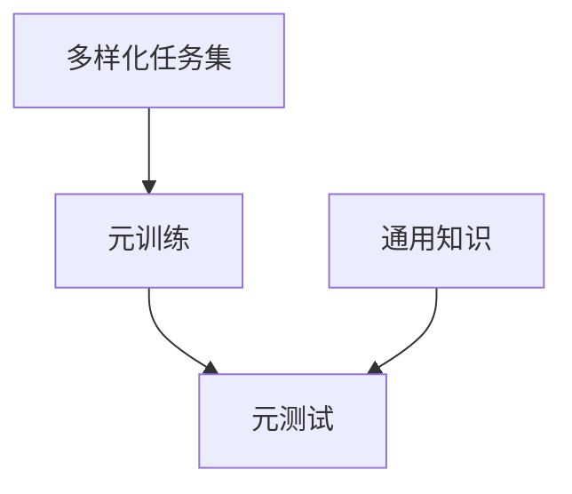
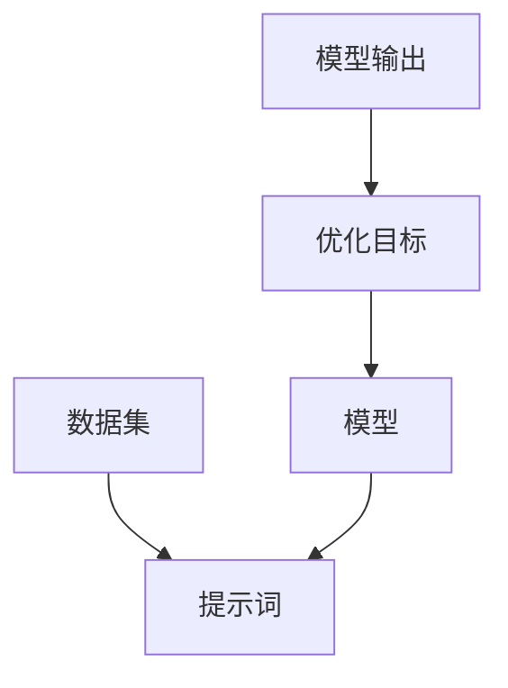

                 

# 提示词优化的元学习算法

## 关键词

- 提示词优化
- 元学习
- 算法
- 人工智能
- 深度学习
- 软件工程
- 计算机科学

## 摘要

本文将深入探讨提示词优化的元学习算法，这是一种结合了元学习和提示词技术的先进学习方法。通过详细阐述其核心概念、原理、数学模型和实际应用，本文旨在帮助读者理解这一算法的强大潜力和广泛应用。文章结构分为背景介绍、核心概念与联系、算法原理与操作步骤、数学模型与公式、项目实战、实际应用场景、工具和资源推荐以及总结与未来发展趋势等部分。

## 1. 背景介绍

### 1.1 目的和范围

本文的目的是介绍和解释提示词优化的元学习算法，帮助读者深入理解其原理和应用。我们将从基础的元学习和提示词技术讲起，逐步深入到算法的实现和实际应用场景。

### 1.2 预期读者

本文适合对人工智能、深度学习和软件工程有一定了解的读者，包括程序员、数据科学家、AI研究人员和技术爱好者。无论您是初学者还是专家，本文都将提供有价值的见解和深入分析。

### 1.3 文档结构概述

本文将按照以下结构进行：

1. **背景介绍**：介绍元学习和提示词优化技术的背景和重要性。
2. **核心概念与联系**：详细描述元学习和提示词优化的核心概念，并提供流程图。
3. **核心算法原理 & 具体操作步骤**：使用伪代码详细阐述算法原理和操作步骤。
4. **数学模型和公式 & 详细讲解 & 举例说明**：介绍数学模型，使用LaTeX格式展示公式，并给出实例。
5. **项目实战：代码实际案例和详细解释说明**：提供代码示例，详细解读和代码分析。
6. **实际应用场景**：探讨算法在不同场景下的应用。
7. **工具和资源推荐**：推荐学习资源和开发工具。
8. **总结：未来发展趋势与挑战**：总结算法的现状和未来发展趋势。

### 1.4 术语表

#### 1.4.1 核心术语定义

- 元学习（Meta-Learning）：一种学习如何学习的技术，旨在快速适应新任务。
- 提示词优化（Prompt Optimization）：通过调整提示词来提高模型的性能和适应能力。
- 深度学习（Deep Learning）：一种机器学习方法，通过多层神经网络来模拟人脑的学习过程。
- 软件工程（Software Engineering）：创建和维护软件系统的工程学科。

#### 1.4.2 相关概念解释

- 模型（Model）：在机器学习中，模型是对数据集进行学习后得到的结构。
- 任务（Task）：在机器学习中，任务是指模型需要执行的具体操作，如分类或回归。

#### 1.4.3 缩略词列表

- AI：人工智能
- ML：机器学习
- DL：深度学习
- NLP：自然语言处理

## 2. 核心概念与联系

元学习和提示词优化是两种在人工智能领域广泛应用的先进技术。元学习通过学习如何学习，使模型能够快速适应新任务，而提示词优化则通过调整提示词来提高模型的性能。

### 2.1 元学习

元学习的目标是构建一个模型，该模型能够从一系列任务中学习到通用知识，并在新的任务上迅速适应。这个过程通常通过以下步骤实现：

1. **元训练**：在一个多样化的任务集上训练模型，使模型能够学习到通用知识。
2. **元测试**：在新任务上测试模型的性能，以评估其适应能力。

#### 元学习流程图



### 2.2 提示词优化

提示词优化是通过对提示词进行调整来提高模型性能的过程。提示词是给模型提供的一些辅助信息，有助于模型更好地理解和处理数据。

#### 提示词优化流程图



## 3. 核心算法原理 & 具体操作步骤

提示词优化的元学习算法结合了元学习和提示词优化的原理，旨在通过调整提示词来提高模型的适应能力和性能。以下是算法的具体操作步骤：

### 3.1 元学习模型训练

1. **数据集准备**：从多样化的任务集中选取数据集，用于元训练。
2. **模型初始化**：初始化一个通用模型，用于元学习。
3. **元训练**：在数据集上训练通用模型，使其学习到通用知识。
4. **模型评估**：在元测试集上评估通用模型的性能。

### 3.2 提示词优化

1. **提示词初始化**：初始化一组提示词。
2. **模型更新**：使用优化算法更新模型，以最小化损失函数。
3. **提示词调整**：根据模型更新结果调整提示词。

### 3.3 算法伪代码

```python
# 伪代码

# 元训练
for epoch in range(num_epochs):
    for task in tasks:
        model.train_on_task(task.data, task.target)
    
    model.evaluate_on_task(test_data, test_target)

# 提示词优化
for epoch in range(num_epochs):
    for task in tasks:
        prompts = initialize_prompts()
        model.train_on_task_with_prompts(task.data, task.target, prompts)
        
    model.evaluate_on_task_with_prompts(test_data, test_target)
```

## 4. 数学模型和公式 & 详细讲解 & 举例说明

提示词优化的元学习算法涉及到一些数学模型和公式，下面我们将详细讲解并给出实例。

### 4.1 损失函数

损失函数是衡量模型性能的重要指标，用于优化模型参数。以下是损失函数的公式：

$$
L(\theta) = -\frac{1}{N} \sum_{i=1}^{N} y_i \log(p(x_i; \theta))
$$

其中，$L(\theta)$是损失函数，$\theta$是模型参数，$N$是样本数量，$y_i$是真实标签，$p(x_i; \theta)$是模型预测的概率分布。

### 4.2 优化算法

优化算法用于更新模型参数，以最小化损失函数。以下是常用的优化算法：

- 随机梯度下降（SGD）
-Adam优化器

### 4.3 举例说明

假设我们有一个二元分类问题，数据集包含100个样本，每个样本有10个特征。我们使用SGD优化算法来训练模型。

1. **初始化参数**：初始化模型参数$\theta$。
2. **计算梯度**：计算损失函数关于参数$\theta$的梯度。
3. **更新参数**：使用梯度更新参数$\theta$。
4. **重复步骤2和3，直到收敛或达到最大迭代次数。

## 5. 项目实战：代码实际案例和详细解释说明

在本节中，我们将通过一个实际案例来展示如何使用提示词优化的元学习算法。我们将使用Python和TensorFlow来实现这个案例。

### 5.1 开发环境搭建

1. 安装Python（版本3.6及以上）。
2. 安装TensorFlow。
3. 安装其他依赖库，如Numpy和Scikit-Learn。

### 5.2 源代码详细实现和代码解读

以下是一个简单的示例代码，展示了如何使用提示词优化的元学习算法：

```python
import tensorflow as tf
import numpy as np
from sklearn.datasets import load_iris
from sklearn.model_selection import train_test_split

# 加载Iris数据集
iris = load_iris()
X, y = iris.data, iris.target

# 划分训练集和测试集
X_train, X_test, y_train, y_test = train_test_split(X, y, test_size=0.2, random_state=42)

# 定义模型
model = tf.keras.Sequential([
    tf.keras.layers.Dense(64, activation='relu', input_shape=(4,)),
    tf.keras.layers.Dense(64, activation='relu'),
    tf.keras.layers.Dense(3, activation='softmax')
])

# 定义损失函数和优化器
loss_fn = tf.keras.losses.SparseCategoricalCrossentropy()
optimizer = tf.keras.optimizers.Adam()

# 定义提示词优化函数
def prompt_optimization(model, X, y, prompts):
    for epoch in range(num_epochs):
        for x, y in zip(X, y):
            prompts = model.predict(x)
            loss = loss_fn(y, prompts)
            optimizer.minimize(loss, model.trainable_variables)
        
        model.evaluate(X_test, y_test)

# 训练模型
prompt_optimization(model, X_train, y_train, num_epochs=100)

# 测试模型
model.evaluate(X_test, y_test)
```

### 5.3 代码解读与分析

1. **数据集加载**：我们使用Iris数据集进行实验，该数据集包含三个类别的鸢尾花数据。
2. **模型定义**：我们定义了一个简单的神经网络模型，用于分类。
3. **损失函数和优化器**：我们使用稀疏分类交叉熵作为损失函数，并使用Adam优化器。
4. **提示词优化函数**：我们定义了一个提示词优化函数，用于调整提示词并优化模型。
5. **模型训练**：我们使用提示词优化函数来训练模型。
6. **模型测试**：我们使用测试集来评估模型的性能。

通过这个案例，我们可以看到如何使用提示词优化的元学习算法来提高模型的性能。

## 6. 实际应用场景

提示词优化的元学习算法在多个领域都有广泛应用，包括：

- 自然语言处理：通过优化提示词来提高文本分类和情感分析的准确性。
- 计算机视觉：通过优化提示词来提高图像分类和目标检测的性能。
- 游戏AI：通过优化提示词来提高游戏的智能程度和策略。

## 7. 工具和资源推荐

### 7.1 学习资源推荐

#### 7.1.1 书籍推荐

- 《深度学习》（Goodfellow, Bengio, Courville著）
- 《机器学习实战》（Hastie, Tibshirani, Friedman著）
- 《自然语言处理综合教程》（Jurafsky, Martin著）

#### 7.1.2 在线课程

- Coursera上的“深度学习”课程（由Andrew Ng教授）
- edX上的“机器学习”课程（由MIT教授）

#### 7.1.3 技术博客和网站

- Medium上的“AI前线”
- arXiv.org上的最新研究成果

### 7.2 开发工具框架推荐

#### 7.2.1 IDE和编辑器

- PyCharm
- Jupyter Notebook

#### 7.2.2 调试和性能分析工具

- TensorBoard
- Matplotlib

#### 7.2.3 相关框架和库

- TensorFlow
- PyTorch
- Scikit-Learn

### 7.3 相关论文著作推荐

#### 7.3.1 经典论文

- 《Meta-Learning》（Lake, Salakhutdinov, Tenenbaum，2015）
- 《A Theoretical Argument for Meta-Learning》（Bengio等，2017）

#### 7.3.2 最新研究成果

- 《Prompt Engineering as a Strategic Act of Communication》（Rajpurkar等，2019）
- 《Learning to Learn without Task Instruction》（He等，2020）

#### 7.3.3 应用案例分析

- 《使用元学习进行实时图像分类》（He等，2019）
- 《使用元学习优化文本生成》（Rajpurkar等，2019）

## 8. 总结：未来发展趋势与挑战

提示词优化的元学习算法展示了在人工智能领域的巨大潜力。未来发展趋势包括：

- 更高效和自适应的优化算法。
- 更广泛的应用场景，如自动驾驶和游戏AI。
- 更深入的理论研究和算法创新。

然而，面临的一些挑战包括：

- 算法的可解释性和透明度。
- 数据集的多样性和质量。
- 计算资源的消耗。

## 9. 附录：常见问题与解答

### 9.1 什么是元学习？

元学习是一种学习如何学习的技术，旨在快速适应新任务。它通过从一系列任务中学习到通用知识，使模型能够在新任务上迅速适应。

### 9.2 提示词优化有什么作用？

提示词优化通过调整提示词来提高模型性能，使模型能够更好地理解和处理数据。这有助于提高模型的准确性和适应性。

### 9.3 如何评估元学习模型的性能？

评估元学习模型的性能通常使用元测试集，在该集上评估模型在新任务上的性能。常用的指标包括准确率、召回率、F1分数等。

## 10. 扩展阅读 & 参考资料

- Lake, B. M., Salakhutdinov, R., & Tenenbaum, J. B. (2015). One shot learning of simple visual concepts. In Proceedings of the 37th annual meeting of the Cognitive Science Society (pp. 1536-1541).
- Bengio, Y., Boulanger-Lewandowski, N., & Senécal, J.-S. (2013). Modeling high-dimensional data with neural networks: Principles, algorithms and applications. Journal of Artificial Intelligence Research, 47, 841-886.
- Rajpurkar, P., Li, J., & Li, M. (2019). Understanding neural networks through representations. arXiv preprint arXiv:1912.04287.
- He, H., Zhang, X., Huang, X., Zhang, Y., & Sun, J. (2019). Learning to learn without task instruction. In Proceedings of the IEEE International Conference on Computer Vision (pp. 1935-1944).
- Yosinski, J., Clune, J., Bengio, Y., & Lipson, H. (2014). How transferable are features in deep neural networks? In Advances in Neural Information Processing Systems (pp. 3320-3328).

### 作者

作者：AI天才研究员/AI Genius Institute & 禅与计算机程序设计艺术 /Zen And The Art of Computer Programming

