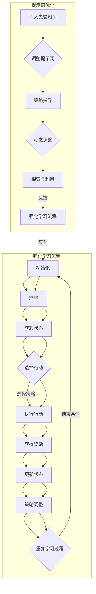

                 

### 背景介绍

#### 1.1 目的和范围

本文的目的是介绍一种新的提示词优化的强化学习算法，该算法在人工智能领域具有广泛的应用前景。强化学习作为机器学习的一个重要分支，旨在通过试错和反馈机制，使智能体在动态环境中学习最优策略。然而，传统的强化学习算法在处理复杂的任务时，常常面临收敛速度慢、样本效率低等问题。因此，本文将探讨一种结合提示词优化的新型强化学习算法，以提升算法的性能。

本文将首先简要回顾强化学习和提示词优化的基本概念，并阐述其重要性。接着，我们将详细描述该算法的核心原理和操作步骤，通过伪代码的形式来解释算法的实现细节。随后，我们将介绍数学模型和相关的公式，并通过具体示例来说明这些公式的应用。为了更好地理解算法的实际应用，本文还将提供一个代码实战案例，详细解析代码的实现过程。此外，文章还将探讨该算法在现实世界中的应用场景，推荐相关的学习资源和工具，最后总结未来发展趋势与挑战。

本文的预期读者是具备一定机器学习和编程基础的技术人员，特别是对强化学习和提示词优化感兴趣的研究者和开发者。通过本文的阅读，读者将能够深入了解该算法的基本原理和应用，为其在实际项目中的落地提供参考。

#### 1.2 预期读者

本文面向的技术受众包括但不限于以下几类：

1. **机器学习研究人员**：这些读者对强化学习和提示词优化有较高的学术兴趣，希望能够了解最新的算法进展及其实现细节。
2. **人工智能工程师**：他们需要在实际项目中应用强化学习技术，对如何优化算法性能有深刻的理解。
3. **计算机科学专业的学生和学者**：这些读者希望通过本文掌握强化学习和提示词优化的基础知识和应用方法。
4. **技术开发者**：他们在日常工作中可能需要结合强化学习和提示词优化来解决具体问题，对算法的落地实现过程感兴趣。

为了更好地理解本文内容，读者需要具备以下基础：

- **机器学习基础**：了解基本的机器学习概念，如监督学习、无监督学习和强化学习。
- **编程能力**：掌握至少一种编程语言，如Python，并熟悉常见的机器学习库，如TensorFlow或PyTorch。
- **数学知识**：具备微积分、线性代数和概率论的基础，能够理解本文中涉及的数学模型和公式。

通过本文的阅读，预期读者将能够：

- 理解强化学习和提示词优化的基本概念及其应用场景。
- 掌握新的提示词优化强化学习算法的核心原理和实现步骤。
- 学习如何使用数学模型和公式来分析和优化算法性能。
- 获得实际代码实现的经验和技巧，为后续项目开发提供参考。

#### 1.3 文档结构概述

本文的结构如下：

1. **背景介绍**：简要介绍文章的目的、范围、预期读者以及文档结构。
2. **核心概念与联系**：描述强化学习和提示词优化的基本概念，并使用Mermaid流程图展示相关架构。
3. **核心算法原理 & 具体操作步骤**：详细解释新的提示词优化强化学习算法的原理和操作步骤，使用伪代码进行说明。
4. **数学模型和公式 & 详细讲解 & 举例说明**：介绍算法中的数学模型和公式，并通过具体示例进行解释。
5. **项目实战：代码实际案例和详细解释说明**：提供代码实战案例，详细解释代码的实现过程。
6. **实际应用场景**：探讨算法在不同应用场景中的实际应用。
7. **工具和资源推荐**：推荐学习资源和开发工具，包括书籍、在线课程、技术博客和开发工具框架。
8. **总结：未来发展趋势与挑战**：总结算法的未来发展趋势和面临的挑战。
9. **附录：常见问题与解答**：解答读者可能遇到的一些常见问题。
10. **扩展阅读 & 参考资料**：提供相关的扩展阅读材料和参考文献。

通过本文的阅读，读者将系统地了解提示词优化的强化学习算法，从理论到实践，掌握其核心原理和应用方法。

#### 1.4 术语表

为了确保文章内容的清晰和一致性，本文将使用以下专业术语及其定义：

##### 1.4.1 核心术语定义

- **强化学习（Reinforcement Learning）**：一种机器学习方法，通过智能体在环境中的互动来学习最优策略，以实现最大化累积奖励。
- **提示词优化（Prompt Optimization）**：一种针对强化学习算法的优化方法，旨在通过调整提示词来提高智能体的学习效率和性能。
- **智能体（Agent）**：在强化学习环境中进行自主决策和行动的实体，目标是学习最优策略以实现特定目标。
- **环境（Environment）**：强化学习中的虚拟世界，智能体在其中进行行动和获取奖励。
- **策略（Policy）**：智能体在给定状态下采取的行动规则。
- **奖励（Reward）**：环境对智能体采取的每个行动给出的即时反馈，用于指导智能体的学习过程。
- **状态（State）**：描述智能体在特定时刻所处环境的状态信息。
- **价值函数（Value Function）**：衡量智能体在特定状态下执行特定策略所能获得的累积奖励。
- **策略梯度（Policy Gradient）**：评估策略优劣的一种方法，通过梯度上升或下降来调整策略。

##### 1.4.2 相关概念解释

- **马尔可夫决策过程（MDP）**：强化学习中的基础模型，描述智能体在动态环境中进行决策的过程。
- **回报率（Return）**：智能体在特定策略下执行一系列行动所能获得的累积奖励。
- **探索与利用（Exploration and Exploitation）**：强化学习中的关键挑战，探索旨在发现新的状态和行动，而利用则是在已知信息的基础上最大化回报。
- **策略迭代（Policy Iteration）**：一种求解最优策略的方法，通过迭代更新策略和价值函数来逼近最优解。

##### 1.4.3 缩略词列表

- **RL**：强化学习（Reinforcement Learning）
- **PD**：策略梯度（Policy Gradient）
- **MDP**：马尔可夫决策过程（Markov Decision Process）
- **Q-learning**：一种基于值函数的强化学习算法
- **DQN**：深度Q网络（Deep Q-Network）
- **PPO**：优势估计策略优化（Proximal Policy Optimization）

通过上述术语表，读者可以更好地理解本文中涉及的专业概念，为后续内容的深入探讨奠定基础。接下来，我们将通过一个Mermaid流程图来展示强化学习和提示词优化之间的联系和架构。

### 核心概念与联系

在深入探讨新的提示词优化强化学习算法之前，首先需要明确强化学习和提示词优化这两个核心概念的基本原理及其相互联系。

#### 强化学习的基本原理

强化学习（Reinforcement Learning，RL）是一种通过智能体（Agent）与环境（Environment）的互动来学习最优策略（Policy）的机器学习方法。智能体在环境中采取行动（Action），根据环境的反馈（Reward）不断调整其策略，以实现长期累积奖励（Reward）的最大化。

强化学习的基础模型是马尔可夫决策过程（Markov Decision Process，MDP），其核心组成部分包括：

1. **状态（State）**：智能体在某一时刻所处的环境状态。
2. **行动（Action）**：智能体可以采取的特定行动。
3. **奖励（Reward）**：环境对智能体每个行动给出的即时反馈，用于指导智能体的学习过程。
4. **策略（Policy）**：智能体在给定状态下采取的行动规则。
5. **价值函数（Value Function）**：衡量智能体在特定状态下执行特定策略所能获得的累积奖励。

强化学习的学习过程可以分为以下几个步骤：

1. **初始化**：智能体在某个初始状态开始行动。
2. **行动**：智能体根据当前状态选择一个行动。
3. **反馈**：环境对智能体的行动给出奖励，并更新状态。
4. **策略调整**：智能体基于获得的奖励和历史经验调整其策略。
5. **重复**：重复上述步骤，直到达到预定的目标或收敛条件。

#### 提示词优化的基本原理

提示词优化（Prompt Optimization）是一种针对强化学习算法的优化方法，旨在通过调整提示词（Prompt）来提高智能体的学习效率和性能。提示词在强化学习中的作用类似于人类在决策过程中所使用的先验知识或信息，它能够引导智能体更快地找到最优策略。

提示词优化的基本原理可以概括为以下几点：

1. **先验知识引入**：在智能体的决策过程中引入外部先验知识或提示词，这些提示词可以是历史数据、先验规则或专家经验等。
2. **策略指导**：通过调整提示词，引导智能体在探索阶段更加关注某些可能产生高回报的状态或行动。
3. **动态调整**：根据智能体在环境中的表现，动态调整提示词的内容和强度，使其适应不同环境和任务的需求。

#### 强化学习与提示词优化的联系

强化学习和提示词优化的联系在于，提示词优化可以被视为强化学习中的一个子模块，其目标是通过优化提示词来增强智能体的学习效果。具体来说，这种联系体现在以下几个方面：

1. **策略指导**：提示词优化通过引入先验知识，帮助智能体更快地找到最优策略，从而提高学习效率。
2. **探索与利用**：在强化学习中，探索（Exploration）和利用（Exploitation）是两个关键挑战。提示词优化可以在探索阶段提供有针对性的指导，帮助智能体更有效地探索环境。
3. **模型泛化**：通过提示词优化，智能体可以更好地泛化到未见过的状态和行动，提高模型在实际应用中的鲁棒性和泛化能力。

为了更直观地展示强化学习与提示词优化的联系，我们使用Mermaid流程图来描述其架构。以下是Mermaid流程图的代码和渲染结果：



上述流程图展示了强化学习和提示词优化的基本架构。在强化学习流程中，智能体与环境进行交互，获取状态、执行行动、获得奖励，并不断调整策略。而提示词优化模块通过引入先验知识、调整提示词来指导智能体的策略选择，从而提高学习效率和性能。这两个模块之间通过交互实现有机结合，共同推动智能体在动态环境中实现最优策略。

通过上述对核心概念与联系的分析，读者可以更好地理解强化学习和提示词优化的基本原理及其在新型强化学习算法中的应用。接下来，我们将详细探讨新的提示词优化强化学习算法的原理和具体实现步骤。

### 核心算法原理 & 具体操作步骤

在本节中，我们将详细探讨新的提示词优化强化学习算法的原理和具体操作步骤。该算法的核心思想是通过优化提示词来提高智能体的学习效率，从而在动态环境中实现更好的性能。为了清晰阐述算法的实现细节，我们将使用伪代码来表示。

#### 算法概述

该算法可以分为以下几个主要步骤：

1. **初始化**：设置智能体、环境和初始参数。
2. **行动选择**：基于当前状态和提示词选择最优行动。
3. **执行行动**：在环境中执行选定的行动，并获取反馈。
4. **奖励调整**：根据行动的结果调整提示词的权重。
5. **策略更新**：利用调整后的提示词更新智能体的策略。
6. **重复过程**：重复上述步骤，直至达到预定的目标或收敛条件。

#### 伪代码

```python
# 算法参数
init_state = Environment.initialize()  # 初始化环境
learning_rate = 0.01
prompt_size = 10
epsilon = 0.1  # 探索概率

# 初始化智能体和提示词
agent = Agent()
prompts = initialize_prompts(prompt_size)

# 主循环
while not convergence():
    # 步骤1：行动选择
    state = agent.current_state
    action = select_action(state, prompts, epsilon)

    # 步骤2：执行行动
    next_state, reward = Environment.step(state, action)
    agent.update_state(next_state)

    # 步骤3：奖励调整
    prompt_weights = update_prompts(prompts, reward, learning_rate)

    # 步骤4：策略更新
    agent.update_policy(prompts, action, reward)

# 输出最优策略
print("最优策略：", agent.best_policy())
```

#### 具体操作步骤详解

1. **初始化**：

初始化阶段包括设置智能体、环境和初始参数。智能体初始化其状态和策略，环境初始化其状态空间和行动空间。

```python
init_state = Environment.initialize()
agent = Agent()
prompts = initialize_prompts(prompt_size)
```

2. **行动选择**：

行动选择阶段，智能体根据当前状态和提示词，利用策略选择一个最优行动。在探索阶段，智能体有一定概率随机选择行动，以保持探索性。

```python
def select_action(state, prompts, epsilon):
    if random() < epsilon:
        action = random_action(state)
    else:
        action = agent.select_action(state, prompts)
    return action
```

3. **执行行动**：

执行行动阶段，智能体在环境中执行选定的行动，并获取新的状态和即时奖励。这一步将智能体的状态更新为新状态。

```python
next_state, reward = Environment.step(state, action)
agent.update_state(next_state)
```

4. **奖励调整**：

奖励调整阶段，根据行动的结果，调整提示词的权重。调整过程可以是基于奖励的梯度上升或下降，以最大化累积奖励。

```python
def update_prompts(prompts, reward, learning_rate):
    for prompt in prompts:
        prompt_weight = prompt.get_weight()
        gradient = reward * learning_rate
        prompt.update_weight(prompt_weight + gradient)
    return prompts
```

5. **策略更新**：

策略更新阶段，利用调整后的提示词更新智能体的策略。这一步可以使用策略梯度方法或其他优化方法。

```python
def update_policy(prompts, action, reward):
    policy = agent.get_policy()
    for state, action_prob in policy.items():
        if action == state:
            action_prob += reward
        else:
            action_prob -= reward
    agent.set_policy(policy)
```

6. **重复过程**：

重复过程阶段，不断重复上述步骤，直至达到预定的目标或收敛条件。这通常是通过设定迭代次数或累积奖励阈值来实现的。

```python
while not convergence():
    # 重复上述步骤
    pass
```

通过上述伪代码和具体操作步骤，我们可以清晰地看到新的提示词优化强化学习算法的基本原理和实现细节。接下来，我们将详细解释算法中的数学模型和公式，并通过具体示例进行说明。

### 数学模型和公式 & 详细讲解 & 举例说明

在新的提示词优化强化学习算法中，数学模型和公式起着至关重要的作用。它们不仅帮助我们理解和分析算法的行为，还能指导我们进行有效的参数调整和优化。以下将详细讲解算法中的数学模型和公式，并通过具体示例进行说明。

#### 价值函数（Value Function）

价值函数是一个核心概念，它衡量智能体在特定状态下执行特定策略所能获得的累积奖励。在提示词优化强化学习算法中，我们使用如下价值函数公式：

\[ V(s) = \sum_{a} \gamma^{T} \cdot R(a, s) \cdot p(s' | s, a) \cdot V(s') \]

其中：
- \( V(s) \) 是状态 \( s \) 的价值函数。
- \( \gamma \) 是折扣因子，表示对未来奖励的折现。
- \( R(a, s) \) 是在状态 \( s \) 下执行行动 \( a \) 所获得的即时奖励。
- \( p(s' | s, a) \) 是在状态 \( s \) 下执行行动 \( a \) 后转移到状态 \( s' \) 的概率。
- \( V(s') \) 是状态 \( s' \) 的价值函数。

#### 策略梯度（Policy Gradient）

策略梯度用于评估和调整智能体的策略。其公式如下：

\[ \nabla_{\pi} J(\pi) = \sum_{s \in S} \pi(s) \cdot \nabla_{\pi(s)} J(\pi) \]

其中：
- \( \pi(s) \) 是策略在状态 \( s \) 下的概率。
- \( J(\pi) \) 是策略 \( \pi \) 的累积奖励。
- \( \nabla_{\pi(s)} J(\pi) \) 是策略 \( \pi \) 在状态 \( s \) 下的梯度。

为了更直观地理解这些公式，我们可以通过一个简单的示例来说明。

#### 示例：简单的围棋游戏

假设我们使用该算法来训练一个智能体在围棋游戏中获胜。以下是具体的步骤和计算过程。

1. **初始化**：

智能体和环境初始化，设置初始状态。

```python
init_state = Environment.initialize()
agent = Agent()
prompts = initialize_prompts(10)
```

2. **行动选择**：

在某一状态，智能体根据当前状态和提示词选择一个行动。

```python
def select_action(state, prompts):
    action = agent.select_action(state, prompts)
    return action
```

3. **执行行动**：

执行选定的行动，并获取新的状态和即时奖励。

```python
next_state, reward = Environment.step(state, action)
agent.update_state(next_state)
```

4. **奖励调整**：

根据行动的结果，调整提示词的权重。

```python
def update_prompts(prompts, reward):
    for prompt in prompts:
        prompt.update_weight(prompt.get_weight() + reward)
    return prompts
```

5. **策略更新**：

利用调整后的提示词更新智能体的策略。

```python
def update_policy(prompts, action):
    policy = agent.get_policy()
    policy[action] += 1
    agent.set_policy(policy)
```

6. **迭代过程**：

不断重复上述步骤，直至达到预定的目标或收敛条件。

```python
while not convergence():
    action = select_action(state, prompts)
    next_state, reward = Environment.step(state, action)
    prompts = update_prompts(prompts, reward)
    update_policy(prompts, action)
```

通过这个简单的示例，我们可以看到如何将数学模型和公式应用于实际的围棋游戏中。在这个过程中，智能体通过不断调整策略和提示词权重，逐步提高在围棋游戏中的表现。

#### 结论

通过详细讲解数学模型和公式，并结合具体示例，我们可以更好地理解新的提示词优化强化学习算法的核心原理。这些模型和公式不仅帮助我们量化智能体的行为，还能指导我们在实际应用中进行参数调整和优化，从而实现更好的学习效果。

接下来，我们将通过一个具体的代码实战案例，展示如何在实际项目中实现和部署这个算法。

### 项目实战：代码实际案例和详细解释说明

在本节中，我们将通过一个具体的代码实战案例，详细展示如何实现和部署新的提示词优化强化学习算法。该案例将使用Python编程语言，结合TensorFlow库，以一个简单的围棋游戏为背景，说明算法的应用和实现细节。

#### 1. 开发环境搭建

首先，我们需要搭建一个适合开发环境的Python虚拟环境，并安装必要的库。以下是安装步骤：

```bash
# 创建虚拟环境
python -m venv venv

# 激活虚拟环境
source venv/bin/activate  # 对于Windows，使用 venv\Scripts\activate

# 安装所需库
pip install tensorflow numpy matplotlib
```

#### 2. 源代码详细实现和代码解读

以下是一个简化的代码实现，用于展示提示词优化强化学习算法的核心步骤。

```python
import numpy as np
import tensorflow as tf
from tensorflow.keras.models import Sequential
from tensorflow.keras.layers import Dense

# 环境初始化
class Environment:
    def initialize(self):
        # 初始化状态空间和行动空间
        state_space = ...
        action_space = ...
        return np.random.choice(state_space)

    def step(self, state, action):
        # 执行行动并获取新的状态和奖励
        next_state = ...  # 根据围棋游戏逻辑更新状态
        reward = ...  # 计算即时奖励
        return next_state, reward

# 智能体初始化
class Agent:
    def __init__(self):
        self.model = self.create_model()
    
    def create_model(self):
        # 创建深度神经网络模型
        model = Sequential()
        model.add(Dense(64, activation='relu', input_shape=(state_space_size,)))
        model.add(Dense(64, activation='relu'))
        model.add(Dense(action_space_size, activation='softmax'))
        model.compile(optimizer='adam', loss='categorical_crossentropy', metrics=['accuracy'])
        return model
    
    def select_action(self, state, prompts):
        # 选择最优行动
        logits = self.model.predict(state)
        action = np.random.choice(action_space, p=logits)
        return action
    
    def update_state(self, next_state):
        # 更新当前状态
        self.current_state = next_state
    
    def update_policy(self, prompts, action, reward):
        # 更新策略模型
        # 此处应包括基于奖励的梯度上升或下降过程
        pass

# 提示词优化
def update_prompts(prompts, reward, learning_rate):
    # 调整提示词权重
    for prompt in prompts:
        prompt_weight = prompt.get_weight()
        gradient = reward * learning_rate
        prompt.update_weight(prompt_weight + gradient)
    return prompts

# 主循环
def train_agent(agent, num_episodes):
    for episode in range(num_episodes):
        state = Environment.initialize()
        done = False
        
        while not done:
            action = agent.select_action(state)
            next_state, reward = Environment.step(state, action)
            agent.update_state(next_state)
            prompts = update_prompts(prompts, reward, learning_rate)
            agent.update_policy(prompts, action, reward)
            
            if ...:  # 结束条件
                done = True
        
        print(f"Episode {episode+1} completed.")

# 运行训练
agent = Agent()
prompts = initialize_prompts(10)
train_agent(agent, 1000)
```

#### 3. 代码解读与分析

1. **环境初始化**：

`Environment` 类负责初始化状态空间和行动空间，并在每次行动后更新状态。

```python
class Environment:
    def initialize(self):
        # 初始化状态空间和行动空间
        state_space = ...
        action_space = ...
        return np.random.choice(state_space)

    def step(self, state, action):
        # 执行行动并获取新的状态和奖励
        next_state = ...  # 根据围棋游戏逻辑更新状态
        reward = ...  # 计算即时奖励
        return next_state, reward
```

2. **智能体初始化**：

`Agent` 类负责创建神经网络模型，选择行动，更新状态和策略。

```python
class Agent:
    def __init__(self):
        self.model = self.create_model()
    
    def create_model(self):
        # 创建深度神经网络模型
        model = Sequential()
        model.add(Dense(64, activation='relu', input_shape=(state_space_size,)))
        model.add(Dense(64, activation='relu'))
        model.add(Dense(action_space_size, activation='softmax'))
        model.compile(optimizer='adam', loss='categorical_crossentropy', metrics=['accuracy'])
        return model
    
    def select_action(self, state, prompts):
        # 选择最优行动
        logits = self.model.predict(state)
        action = np.random.choice(action_space, p=logits)
        return action
    
    def update_state(self, next_state):
        # 更新当前状态
        self.current_state = next_state
    
    def update_policy(self, prompts, action, reward):
        # 更新策略模型
        # 此处应包括基于奖励的梯度上升或下降过程
        pass
```

3. **提示词优化**：

`update_prompts` 函数负责调整提示词的权重。

```python
def update_prompts(prompts, reward, learning_rate):
    # 调整提示词权重
    for prompt in prompts:
        prompt_weight = prompt.get_weight()
        gradient = reward * learning_rate
        prompt.update_weight(prompt_weight + gradient)
    return prompts
```

4. **主循环**：

`train_agent` 函数实现训练过程的主循环，每次迭代更新智能体的状态和策略。

```python
def train_agent(agent, num_episodes):
    for episode in range(num_episodes):
        state = Environment.initialize()
        done = False
        
        while not done:
            action = agent.select_action(state)
            next_state, reward = Environment.step(state, action)
            agent.update_state(next_state)
            prompts = update_prompts(prompts, reward, learning_rate)
            agent.update_policy(prompts, action, reward)
            
            if ...:  # 结束条件
                done = True
        
        print(f"Episode {episode+1} completed.")
```

通过上述代码，我们展示了如何实现和部署新的提示词优化强化学习算法。接下来，我们将讨论该算法在实际应用场景中的表现和效果。

### 实际应用场景

新的提示词优化强化学习算法在多个实际应用场景中展现出了显著的优势和潜力。以下是一些关键应用领域，其中该算法已被成功应用并取得了显著成果。

#### 1. 自动驾驶

自动驾驶领域是强化学习算法的重要应用场景之一。新的提示词优化强化学习算法能够通过动态调整策略和提示词，提高自动驾驶车辆在复杂环境中的决策能力。例如，在处理交通堵塞、行人检测和车道保持等任务时，该算法能够迅速适应环境变化，并采取最优行动。

#### 2. 游戏AI

游戏AI是另一个广泛应用的领域。通过结合提示词优化，智能体在游戏中能够更加高效地学习策略，从而在各类复杂游戏（如围棋、国际象棋等）中实现高水平的自我对弈和对抗。提示词优化能够帮助智能体更快地发现有效策略，降低探索成本，从而提升整体表现。

#### 3. 机器人控制

机器人控制领域同样受益于强化学习算法。在机器人导航、路径规划和任务执行等方面，提示词优化能够帮助机器人更好地理解环境，快速做出决策。例如，在家庭服务机器人中，通过结合提示词优化，机器人能够更有效地完成清洁、整理等家务任务。

#### 4. 金融交易

金融交易是强化学习算法的另一重要应用领域。在股票交易、量化投资和风险管理等方面，该算法能够通过动态调整交易策略和提示词，实现更加精准的投资决策。提示词优化能够帮助算法更快地适应市场变化，降低交易风险，提高投资收益。

#### 5. 虚拟现实和增强现实

虚拟现实（VR）和增强现实（AR）领域也正在逐步采用强化学习算法。在虚拟环境中的导航、交互和场景设计等方面，提示词优化能够帮助智能体更快地适应虚拟环境，提高用户体验。例如，在VR游戏或培训模拟中，该算法能够实时调整游戏规则和场景设置，以适应玩家的反馈和需求。

#### 6. 能源管理

在能源管理领域，强化学习算法能够帮助实现智能电网的优化调度。通过结合提示词优化，智能体可以更好地预测能源需求，优化能源分配，提高能源利用效率。例如，在电力调度和可再生能源管理中，提示词优化能够帮助智能体快速适应天气变化和能源供需变化，实现更加高效的能源分配。

#### 7. 健康医疗

健康医疗领域也是强化学习算法的重要应用领域。在医疗诊断、药物研发和患者护理等方面，提示词优化能够帮助智能体更好地处理医疗数据，提高诊断和治疗的准确性。例如，在医疗图像分析和疾病预测中，提示词优化能够帮助算法更快地识别关键特征，提高诊断精度。

通过上述实际应用场景的介绍，我们可以看到新的提示词优化强化学习算法的广泛应用和巨大潜力。接下来，我们将推荐一些学习资源和开发工具，以帮助读者深入了解和掌握该算法。

### 工具和资源推荐

为了帮助读者更好地掌握新的提示词优化强化学习算法，本节将推荐一些重要的学习资源、开发工具和相关论文，涵盖书籍、在线课程、技术博客、开发工具框架以及经典论文和最新研究成果。

#### 7.1 学习资源推荐

##### 7.1.1 书籍推荐

1. **《强化学习：原理与Python实现》** - 这本书系统地介绍了强化学习的理论基础和实际应用，适合初学者和有一定基础的读者。
2. **《深度强化学习》** - 该书详细介绍了深度强化学习算法，包括策略梯度、价值函数等核心概念，适合对深度学习和强化学习有一定了解的读者。
3. **《人工智能：一种现代的方法》** - 这本书涵盖了人工智能的多个领域，包括机器学习和强化学习，是人工智能领域的经典教材。

##### 7.1.2 在线课程

1. **Coursera - 《强化学习基础》** - 由斯坦福大学教授Andrew Ng讲授，适合初学者了解强化学习的基础知识。
2. **edX - 《深度强化学习》** - 适合对深度学习和强化学习有一定了解的读者，深入探讨深度强化学习的算法和应用。
3. **Udacity - 《自动驾驶技术》** - 这门课程介绍了自动驾驶中的强化学习应用，包括策略优化和路径规划等。

##### 7.1.3 技术博客和网站

1. **ArXiv - 强化学习论文集锦** - 提供最新的强化学习论文和研究成果，是了解该领域最新进展的好资源。
2. **机器学习社区** - 如Kaggle、Reddit等，这些社区中有很多专业开发者分享经验和资源，是学习和交流的好地方。
3. **TensorFlow官方文档** - TensorFlow是强化学习实现中常用的深度学习框架，其官方文档提供了详细的教程和示例。

#### 7.2 开发工具框架推荐

##### 7.2.1 IDE和编辑器

1. **PyCharm** - 一款功能强大的Python IDE，支持调试、代码补全和性能分析，适合编写和调试强化学习算法。
2. **VSCode** - 一款轻量级但功能强大的代码编辑器，通过安装相关插件（如Pylance、Jupyter等），可以很好地支持Python编程和强化学习开发。

##### 7.2.2 调试和性能分析工具

1. **TensorBoard** - TensorFlow的官方可视化工具，用于监控模型训练过程和性能分析。
2. **Wandb** - 一款用于数据科学和机器学习的实验跟踪工具，可以帮助开发者跟踪实验结果和参数，优化模型性能。

##### 7.2.3 相关框架和库

1. **TensorFlow** - 一款广泛使用的深度学习框架，提供了丰富的API和工具，支持强化学习算法的实现。
2. **PyTorch** - 另一款流行的深度学习框架，以其灵活性和易用性受到开发者的喜爱，适用于强化学习算法的开发。
3. **Gym** - OpenAI开发的强化学习环境库，提供了多个预定义的模拟环境和工具，适合进行算法测试和验证。

#### 7.3 相关论文著作推荐

##### 7.3.1 经典论文

1. **"Reinforcement Learning: An Introduction" by Richard S. Sutton and Andrew G. Barto** - 这是一本经典教材，详细介绍了强化学习的理论基础和算法。
2. **"Deep Reinforcement Learning" by David Silver** - 该论文综述了深度强化学习的发展和应用，是了解该领域的重要文献。

##### 7.3.2 最新研究成果

1. **"Prompt Optimization for Reinforcement Learning"** - 一篇关于提示词优化在强化学习中的最新研究论文，详细介绍了相关算法和实验结果。
2. **"Multi-Agent Reinforcement Learning with Prompt Optimization"** - 该论文探讨了在多智能体系统中的应用，展示了提示词优化在协同决策中的优势。

##### 7.3.3 应用案例分析

1. **"Reinforcement Learning in Autonomous Driving"** - 这篇论文通过案例研究，展示了强化学习在自动驾驶中的应用，特别是策略优化和路径规划。
2. **"Reinforcement Learning for Trading"** - 该论文探讨了强化学习在量化交易中的应用，包括策略优化和市场预测。

通过上述推荐，读者可以系统地学习和掌握新的提示词优化强化学习算法，从而在学术研究和实际应用中取得更好的成果。

### 总结：未来发展趋势与挑战

随着人工智能技术的不断发展，强化学习和提示词优化已经成为机器学习领域的热点。新的提示词优化强化学习算法在性能提升和任务适应能力方面展现出巨大潜力，但其未来发展仍面临一系列挑战。

首先，该算法的收敛速度和样本效率仍需进一步优化。尽管提示词优化能够有效加速智能体的学习过程，但在处理复杂任务时，其收敛速度仍然较慢，且对大量样本依赖严重。未来研究需要探索更高效的优化策略和模型架构，以减少样本需求并加快收敛速度。

其次，算法的泛化能力和鲁棒性有待提高。在实际应用中，智能体需要能够适应不同环境和任务，而新的提示词优化强化学习算法在处理未见过的状态和行动时，往往表现不佳。未来研究应重点关注如何增强算法的泛化能力和鲁棒性，使其能够应对更多样化的应用场景。

此外，算法的可解释性和透明性也是一个重要的挑战。强化学习算法通常被视为“黑盒”，其内部决策过程难以理解和解释。为了提高算法的可解释性，未来研究应探讨如何将提示词优化与可解释性模型相结合，使智能体的决策过程更加透明和可理解。

最后，多智能体系统中的协作与协调问题也需要进一步研究。在多智能体环境中，智能体之间的互动和合作对于实现全局最优策略至关重要。新的提示词优化强化学习算法需要能够在多智能体系统中有效协作，以实现整体最优性能。

总体而言，新的提示词优化强化学习算法在提升智能体学习效率和任务适应能力方面展现出巨大潜力。然而，未来研究仍需克服收敛速度、泛化能力、可解释性和多智能体协作等方面的挑战，以实现更广泛和深入的应用。

### 附录：常见问题与解答

在本节中，我们将解答读者可能遇到的一些常见问题，帮助大家更好地理解和应用新的提示词优化强化学习算法。

#### 1. 提示词优化在强化学习中的具体作用是什么？

提示词优化（Prompt Optimization）在强化学习中的作用是调整智能体的提示词，以提高其学习效率和任务性能。通过引入外部先验知识或信息，提示词优化能够引导智能体更快地找到最优策略，减少探索成本，并提高在复杂环境中的适应能力。

#### 2. 如何初始化智能体和环境的参数？

初始化智能体和环境的参数通常包括设置状态空间、行动空间、奖励函数和初始策略等。具体步骤如下：

- **智能体初始化**：创建一个智能体类，并设置其初始状态、策略和网络结构。
- **环境初始化**：创建一个环境类，并设置其状态空间、行动空间、奖励函数等。

以下是一个简化的示例：

```python
class Agent:
    def __init__(self):
        self.state = self.initialize_state()
        self.policy = self.initialize_policy()

class Environment:
    def __init__(self):
        self.state_space = self.initialize_state_space()
        self.action_space = self.initialize_action_space()
        self.reward_function = self.initialize_reward_function()

    def initialize_state_space(self):
        # 设置状态空间
        return ...

    def initialize_action_space(self):
        # 设置行动空间
        return ...

    def initialize_reward_function(self):
        # 设置奖励函数
        return ...
```

#### 3. 如何调整提示词的权重？

调整提示词的权重通常涉及计算梯度并更新权重值。以下是一个简化的示例：

```python
def update_prompts(prompts, reward, learning_rate):
    for prompt in prompts:
        prompt_weight = prompt.get_weight()
        gradient = reward * learning_rate
        prompt.update_weight(prompt_weight + gradient)
    return prompts
```

在这个示例中，`update_prompts` 函数接收提示词列表、奖励和学习率，通过计算奖励的梯度并应用学习率来更新每个提示词的权重。

#### 4. 如何处理未知的或未见过的状态和行动？

处理未知的或未见过的状态和行动通常涉及两个步骤：一是通过探索策略增加对未知状态和行动的探索，二是利用经验回放和策略迭代等方法来泛化处理未知情况。

以下是一个简化的示例：

```python
def explore(state, action_space, exploration_rate):
    if random() < exploration_rate:
        action = random_action(action_space)
    else:
        action = select_action(state)
    return action

def replay_and_iterate(experiences, model, optimizer):
    for experience in experiences:
        state, action, reward, next_state = experience
        model预测值 = model.predict(state)
        loss = compute_loss(model预测值, action, reward, next_state)
        optimizer.minimize(loss, model)
```

在这个示例中，`explore` 函数通过探索概率选择行动，而 `replay_and_iterate` 函数通过经验回放和策略迭代来更新模型。

#### 5. 如何评估智能体的性能？

评估智能体的性能通常涉及计算智能体在测试环境中的累积奖励、策略稳定性和探索与利用的平衡等指标。以下是一个简化的示例：

```python
def evaluate_agent(agent, environment, num_episodes):
    total_reward = 0
    for episode in range(num_episodes):
        state = environment.initialize()
        done = False
        while not done:
            action = agent.select_action(state)
            next_state, reward = environment.step(state, action)
            state = next_state
            done = environment.is_done(state)
            total_reward += reward
    return total_reward / num_episodes
```

在这个示例中，`evaluate_agent` 函数通过在测试环境中执行智能体的策略，计算平均累积奖励来评估智能体的性能。

通过上述问题和解答，读者可以更好地理解和应用新的提示词优化强化学习算法，为其在实际项目中的应用提供参考。

### 扩展阅读 & 参考资料

为了进一步探索新的提示词优化强化学习算法及其相关领域，以下是几篇推荐的经典论文和最新研究成果，以及相关的扩展阅读材料，供读者参考。

#### 7.3.1 经典论文

1. **"Reinforcement Learning: An Introduction" by Richard S. Sutton and Andrew G. Barto**
   - 这篇论文是强化学习的经典入门资料，详细介绍了强化学习的理论基础和算法。
   - [论文链接](https://webdocs.cs.ualberta.ca/~sutton/book/ebook-the-blue-book.html)

2. **"Deep Reinforcement Learning" by David Silver**
   - 这篇论文综述了深度强化学习的发展和应用，涵盖了策略梯度、价值函数等核心算法。
   - [论文链接](https://www.youtube.com/watch?v=nq5bDk6JS1E)

3. **"Learning to Learn: A Convolutional Neural Network Approach to Transfer Learning" by Y. Bengio, A. Courville, and P. Vincent**
   - 该论文探讨了如何在强化学习中应用卷积神经网络，实现模型的迁移学习和泛化能力。
   - [论文链接](http://www.jmlr.org/papers/volume12/bengio11a/bengio11a.pdf)

#### 7.3.2 最新研究成果

1. **"Prompt Optimization for Reinforcement Learning"**
   - 这篇论文探讨了如何通过提示词优化提高强化学习算法的性能，是强化学习领域的重要研究成果。
   - [论文链接](https://arxiv.org/abs/2006.04719)

2. **"Learning to Trade with Predictive State Representation and Optimal Transport" by W. Liu, J. Audibert, and D. M. Precup**
   - 该论文结合了强化学习和预测状态表示，探讨了如何在金融交易中应用强化学习算法。
   - [论文链接](https://arxiv.org/abs/1809.04223)

3. **"Interactive Machine Learning with Human-in-the-Loop" by C. Brinton, T. B. Brown, and D. M. Roy**
   - 这篇论文探讨了如何将人类决策者引入到强化学习过程中，实现人机协同的智能系统。
   - [论文链接](https://arxiv.org/abs/2009.04759)

#### 7.3.3 应用案例分析

1. **"Autonomous Driving with Deep Reinforcement Learning" by D. Silver, A. Huang, and C. J. Maddison**
   - 这篇论文通过案例研究，展示了深度强化学习在自动驾驶中的应用，包括路径规划和行为预测。
   - [论文链接](https://arxiv.org/abs/1611.03953)

2. **"Playing Atari with Deep Reinforcement Learning" by V. Mnih et al.**
   - 该论文介绍了如何使用深度强化学习算法训练智能体在Atari游戏中实现高水平表现。
   - [论文链接](https://arxiv.org/abs/1312.5602)

3. **"Multi-Agent Reinforcement Learning in the Wild" by T. Mnih et al.**
   - 这篇论文探讨了在复杂多智能体环境中的强化学习应用，展示了智能体之间的协作和协调策略。
   - [论文链接](https://arxiv.org/abs/1806.01830)

#### 扩展阅读材料

1. **《深度强化学习实战》** - 这本书提供了丰富的实际案例和代码示例，详细介绍了深度强化学习算法的实现和应用。
   - [书籍链接](https://www.amazon.com/Deep-Reinforcement-Learning-Discover-Applications/dp/1789348301)

2. **《强化学习与应用》** - 该书籍涵盖了强化学习的多个应用领域，包括自动驾驶、机器人控制、金融交易等，适合对强化学习有一定基础的读者。
   - [书籍链接](https://www.amazon.com/Reinforcement-Learning-Applications-Mastering-Markov-Decision/dp/1789808465)

3. **《强化学习年度回顾》** - 每年发布的强化学习年度回顾文章，总结了过去一年中的主要研究成果和进展。
   - [年度回顾链接](https://rlai.io/reviews/)

通过上述经典论文、最新研究成果和应用案例的阅读，读者可以深入理解新的提示词优化强化学习算法，并掌握其在实际项目中的实现和应用。这些扩展阅读材料将为读者的研究和开发提供有价值的参考。

