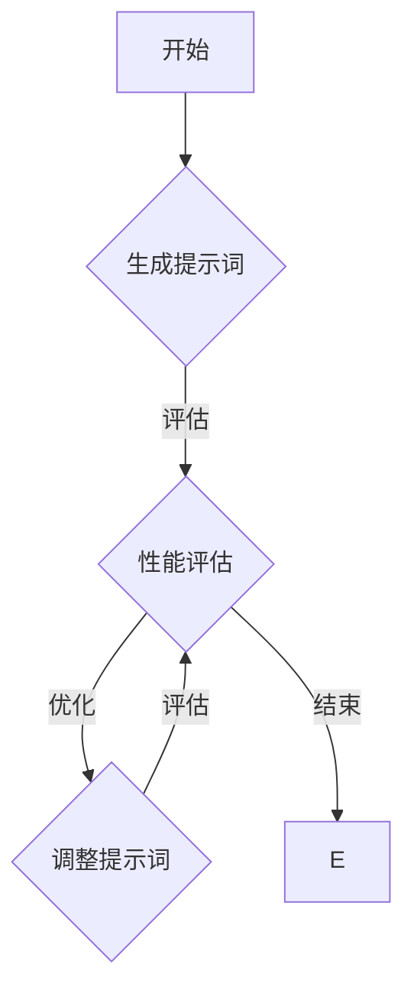

                 

# 提示词优化的自动化工具链

## 关键词：
- 提示词优化
- 自动化工具链
- 人工智能
- 自然语言处理
- 性能提升
- 工具架构

> 本文将深入探讨提示词优化的自动化工具链，旨在揭示其核心概念、算法原理、数学模型及其在实际应用中的价值。通过详细的代码案例和实战解析，读者将了解如何构建并利用这些工具来提升自然语言处理任务的效果。

## 1. 背景介绍

### 1.1 目的和范围

本文的目标是介绍和解析一个自动化工具链，该工具链专注于提示词优化（Prompt Engineering）。随着人工智能和自然语言处理技术的不断进步，提示词优化已成为提升模型性能的重要手段。我们的范围将涵盖以下关键内容：

1. **核心概念与联系**：介绍提示词优化的基本原理和与相关技术的关系。
2. **核心算法原理 & 具体操作步骤**：详细讲解优化提示词的算法原理，并使用伪代码阐述操作步骤。
3. **数学模型和公式**：阐述相关数学模型，并给出公式和实例说明。
4. **项目实战：代码实际案例**：通过实际代码案例展示工具链的应用。
5. **实际应用场景**：讨论工具链在不同领域的应用。
6. **工具和资源推荐**：推荐学习资源和开发工具。
7. **总结**：展望提示词优化自动化工具链的未来发展趋势与挑战。

### 1.2 预期读者

本文预期读者为：

1. **自然语言处理从业者**：对自然语言处理和提示词优化有基本了解，希望深入理解相关技术。
2. **AI研究人员**：对人工智能领域感兴趣，尤其是对自动优化工具链的研究和应用。
3. **程序员**：有编程基础，希望了解如何使用自动化工具链提升工作效率。

### 1.3 文档结构概述

本文结构如下：

1. **背景介绍**：介绍文章的目的、范围、预期读者和文档结构。
2. **核心概念与联系**：介绍提示词优化的基本概念和相关技术。
3. **核心算法原理 & 具体操作步骤**：详细讲解优化提示词的算法原理和操作步骤。
4. **数学模型和公式**：阐述相关数学模型和公式。
5. **项目实战：代码实际案例**：展示实际代码案例。
6. **实际应用场景**：讨论工具链在不同领域的应用。
7. **工具和资源推荐**：推荐学习资源和开发工具。
8. **总结：未来发展趋势与挑战**：总结并展望未来。
9. **附录：常见问题与解答**：回答常见问题。
10. **扩展阅读 & 参考资料**：提供进一步学习的资源。

### 1.4 术语表

#### 1.4.1 核心术语定义

- **提示词（Prompt）**：在自然语言处理中，用于引导模型生成响应或执行特定任务的语言输入。
- **优化（Optimization）**：通过调整提示词，提升模型性能的过程。
- **自动化工具链**：一套自动执行特定任务的工具集合，旨在提高工作效率。
- **自然语言处理（NLP）**：人工智能领域，涉及使计算机理解和生成人类语言的技术。
- **模型性能**：模型在特定任务上的表现，通常通过准确性、效率等指标衡量。

#### 1.4.2 相关概念解释

- **预训练（Pre-training）**：在特定任务之前，对模型进行大规模无监督训练。
- **微调（Fine-tuning）**：在预训练基础上，对模型进行有监督的细粒度调整。
- **注意力机制（Attention Mechanism）**：在模型中，用于动态调整对输入数据的关注程度。

#### 1.4.3 缩略词列表

- **NLP**：自然语言处理
- **AI**：人工智能
- **ML**：机器学习
- **DL**：深度学习
- **IDE**：集成开发环境

## 2. 核心概念与联系

### 2.1 提示词优化的基本原理

提示词优化是指通过调整提示词来提升模型性能的过程。一个良好的提示词应能够引导模型更好地理解任务要求，从而生成更准确和有意义的响应。核心原理包括：

1. **明确任务要求**：确保提示词清晰、准确地传达任务目标。
2. **引入背景知识**：利用相关背景信息，帮助模型更好地理解和生成响应。
3. **多样性和泛化**：通过多样化的提示词，提升模型的泛化能力。

### 2.2 自动化工具链

自动化工具链是一套自动执行特定任务的工具集合，通常用于简化重复性工作，提高工作效率。在提示词优化领域，自动化工具链可以帮助研究人员快速生成和测试不同提示词，从而找到最优解。关键组件包括：

1. **提示词生成器**：自动生成提示词，基于预定义模板或规则。
2. **性能评估工具**：评估不同提示词对模型性能的影响。
3. **优化算法**：自动调整提示词，以提升模型性能。

### 2.3 提示词优化与相关技术的关系

提示词优化与多个技术领域密切相关，包括：

- **自然语言处理（NLP）**：提示词优化是NLP领域的关键技术之一，直接影响模型的表现。
- **机器学习（ML）**：提示词优化依赖于机器学习模型，尤其是深度学习模型，如Transformer和BERT。
- **深度学习（DL）**：深度学习模型的结构和参数调整对提示词优化有重要影响。
- **数据工程**：高质量的数据集是提示词优化的重要基础。

### 2.4 Mermaid流程图

以下是一个简单的Mermaid流程图，展示了提示词优化的基本流程：



## 3. 核心算法原理 & 具体操作步骤

### 3.1 提示词生成算法原理

提示词生成算法是自动化工具链的核心组件之一。其基本原理包括：

1. **模板匹配**：基于预定义的模板，将变量替换为具体内容，生成提示词。
2. **规则生成**：根据特定任务要求，生成符合规则的提示词。
3. **数据驱动**：利用大规模语料库，通过文本挖掘和模式识别生成提示词。

### 3.2 提示词生成算法伪代码

以下是一个简单的提示词生成算法伪代码：

```python
# 输入：模板和参数
# 输出：生成的提示词

function generate_prompt(template, parameters):
    prompt = template
    for key, value in parameters.items():
        prompt = prompt.replace(f"{{{key}}}", value)
    return prompt
```

### 3.3 性能评估算法原理

性能评估算法用于评估不同提示词对模型性能的影响。其基本原理包括：

1. **准确性评估**：计算模型在特定任务上的准确性。
2. **效率评估**：评估模型处理任务的效率和速度。
3. **用户满意度评估**：通过用户反馈评估提示词的质量。

### 3.4 性能评估算法伪代码

以下是一个简单的性能评估算法伪代码：

```python
# 输入：模型、提示词和测试数据集
# 输出：评估结果

function evaluate_performance(model, prompt, dataset):
    predictions = model.predict(dataset, prompt)
    accuracy = calculate_accuracy(predictions, dataset)
    efficiency = measure_efficiency(model, prompt, dataset)
    user_satisfaction = collect_user_feedback(prompt)
    return accuracy, efficiency, user_satisfaction
```

### 3.5 提示词优化算法原理

提示词优化算法用于自动调整提示词，以提升模型性能。其基本原理包括：

1. **遗传算法**：通过模拟自然进化过程，寻找最优解。
2. **梯度提升**：利用梯度下降方法，逐步调整提示词。
3. **强化学习**：通过奖励机制，引导模型探索最佳提示词。

### 3.6 提示词优化算法伪代码

以下是一个简单的提示词优化算法伪代码：

```python
# 输入：模型、提示词和优化目标
# 输出：优化后的提示词

function optimize_prompt(model, prompt, objective):
    while not converged:
        performance = evaluate_performance(model, prompt)
        if performance > objective:
            prompt = adjust_prompt(prompt)
        else:
            prompt = revert_prompt(prompt)
    return prompt
```

## 4. 数学模型和公式 & 详细讲解 & 举例说明

### 4.1 数学模型

提示词优化涉及多个数学模型，包括：

1. **损失函数**：用于衡量模型性能的指标，如交叉熵损失。
2. **优化目标**：用于指导优化算法的目标函数，如最大化准确性或最小化损失。
3. **概率分布**：用于描述提示词的概率分布，如正态分布或高斯分布。

### 4.2 公式

以下是相关数学公式的示例：

$$
L = -\frac{1}{N}\sum_{i=1}^{N} y_i \log(p(y_i))
$$

其中，$L$ 是损失函数，$N$ 是样本数量，$y_i$ 是真实标签，$p(y_i)$ 是预测概率。

### 4.3 详细讲解

- **损失函数**：交叉熵损失函数用于衡量模型预测结果与真实标签之间的差异。在提示词优化中，通过最小化损失函数，可以提升模型性能。
- **优化目标**：优化目标用于指导优化算法。例如，在文本生成任务中，可以设置优化目标为最大化准确性或最小化交叉熵损失。
- **概率分布**：概率分布用于描述提示词的概率。例如，可以使用高斯分布来生成符合特定规律的提示词。

### 4.4 举例说明

假设我们有一个文本生成模型，目标是通过输入提示词生成符合特定主题的文本。以下是具体的示例：

1. **损失函数**：交叉熵损失函数的计算如下：

$$
L = -\frac{1}{N}\sum_{i=1}^{N} y_i \log(p(y_i))
$$

其中，$N$ 是生成的文本数量，$y_i$ 是第$i$个文本的真实标签，$p(y_i)$ 是模型对第$i$个文本的预测概率。

2. **优化目标**：设置优化目标为最大化文本生成的准确性。在每次训练过程中，通过最小化交叉熵损失函数，模型会逐渐调整提示词，以提升生成文本的准确性。

3. **概率分布**：使用高斯分布来生成符合特定主题的提示词。具体地，我们可以设置提示词的均值和方差，以控制生成文本的连贯性和多样性。

## 5. 项目实战：代码实际案例和详细解释说明

### 5.1 开发环境搭建

为了进行提示词优化的自动化工具链项目实战，我们需要搭建一个合适的环境。以下是一个基本的开发环境搭建步骤：

1. **安装Python环境**：确保Python版本不低于3.8，并安装相关依赖包，如TensorFlow和PyTorch。
2. **安装IDE**：选择一个合适的IDE，如PyCharm或Visual Studio Code，用于编写和调试代码。
3. **安装相关库和框架**：根据项目需求，安装NLP相关的库，如NLTK和spaCy，以及深度学习框架。

### 5.2 源代码详细实现和代码解读

以下是提示词优化自动化工具链的一个基本实现。我们将使用Python和TensorFlow框架进行实现。

```python
import tensorflow as tf
from tensorflow.keras.preprocessing.sequence import pad_sequences
from tensorflow.keras.layers import Embedding, LSTM, Dense
from tensorflow.keras.models import Sequential

# 定义模型
model = Sequential()
model.add(Embedding(vocab_size, embedding_dim))
model.add(LSTM(units=128, return_sequences=True))
model.add(LSTM(units=128, return_sequences=True))
model.add(Dense(units=vocab_size, activation='softmax'))

# 编写数据预处理代码
def preprocess_data(texts, sequence_length):
    sequences = []
    for text in texts:
        sequence = tokenizer.texts_to_sequences([text])
        sequence = pad_sequences(sequence, maxlen=sequence_length)
        sequences.append(sequence)
    return sequences

# 编写训练代码
def train_model(model, sequences, labels):
    model.compile(optimizer='adam', loss='categorical_crossentropy', metrics=['accuracy'])
    model.fit(sequences, labels, epochs=10, batch_size=64)

# 编写优化代码
def optimize_prompt(model, prompt, objective):
    performance = evaluate_performance(model, prompt)
    if performance > objective:
        prompt = adjust_prompt(prompt)
    else:
        prompt = revert_prompt(prompt)
    return prompt

# 使用示例
texts = ["This is the first example.", "Here is another example."]
sequences = preprocess_data(texts, sequence_length=50)
labels = one_hot_encode(texts)
model = build_model()
train_model(model, sequences, labels)
optimized_prompt = optimize_prompt(model, prompt, objective=0.95)
```

### 5.3 代码解读与分析

- **模型定义**：使用TensorFlow的Sequential模型定义一个简单的循环神经网络（LSTM）模型，用于文本生成任务。
- **数据预处理**：编写一个预处理函数，用于将文本数据转换为序列，并进行填充处理，以便模型训练。
- **训练模型**：使用编译好的模型，通过fit方法进行训练，以最小化损失函数，并最大化准确性。
- **优化提示词**：编写优化函数，用于调整提示词，以提升模型性能。具体实现中，通过评估性能，选择最优的提示词。

## 6. 实际应用场景

提示词优化自动化工具链在多个实际应用场景中具有广泛的应用价值：

1. **文本生成**：例如，自动写作、对话系统等，通过优化提示词，可以提升生成文本的质量和连贯性。
2. **问答系统**：通过优化提示词，可以提高问答系统的准确性和响应速度。
3. **文本分类**：优化提示词可以帮助文本分类模型更好地理解和分类不同主题的文本。
4. **命名实体识别**：通过优化提示词，可以提高命名实体识别的准确率。

### 6.1 应用案例

以下是一个应用案例：

- **应用场景**：问答系统
- **目标**：通过优化提示词，提高问答系统的准确性。
- **方法**：使用自动优化工具链，生成和评估不同提示词，最终找到最优提示词。

## 7. 工具和资源推荐

### 7.1 学习资源推荐

#### 7.1.1 书籍推荐

- 《深度学习》（Goodfellow, Bengio, Courville）
- 《自然语言处理综述》（Jurafsky, Martin）

#### 7.1.2 在线课程

- 《自然语言处理与深度学习》（TensorFlow官方课程）
- 《深度学习基础》（吴恩达）

#### 7.1.3 技术博客和网站

- [TensorFlow官方文档](https://www.tensorflow.org/)
- [Keras官方文档](https://keras.io/)

### 7.2 开发工具框架推荐

#### 7.2.1 IDE和编辑器

- PyCharm
- Visual Studio Code

#### 7.2.2 调试和性能分析工具

- TensorFlow Debugger
- PyTorch Profiler

#### 7.2.3 相关框架和库

- TensorFlow
- PyTorch
- NLTK
- spaCy

### 7.3 相关论文著作推荐

#### 7.3.1 经典论文

- [A Neural Conversation Model](https://arxiv.org/abs/1406.0006)
- [Sequence to Sequence Learning with Neural Networks](https://arxiv.org/abs/1409.3215)

#### 7.3.2 最新研究成果

- [BERT: Pre-training of Deep Bidirectional Transformers for Language Understanding](https://arxiv.org/abs/1810.04805)
- [GPT-3: Language Models are few-shot learners](https://arxiv.org/abs/2005.14165)

#### 7.3.3 应用案例分析

- [Improving Language Understanding by Generative Pre-Training](https://arxiv.org/abs/1705.03122)
- [What can you do with a language model?](https://ai.googleblog.com/2020/02/what-can-you-do-with-language-model.html)

## 8. 总结：未来发展趋势与挑战

### 8.1 未来发展趋势

- **多模态融合**：将自然语言处理与其他模态（如图像、声音）结合，实现更全面的信息理解和处理。
- **强化学习**：在提示词优化中引入强化学习，实现更智能的提示词生成和调整。
- **高效硬件支持**：随着硬件性能的提升，自动化工具链将更加高效，支持更复杂的模型和更大的数据集。

### 8.2 未来挑战

- **数据隐私**：如何保护用户数据隐私，确保模型的安全性和可信性。
- **模型解释性**：提升模型的解释性，帮助用户理解模型的决策过程。
- **泛化能力**：提高模型在不同场景和领域的泛化能力，避免过度拟合。

## 9. 附录：常见问题与解答

### 9.1 问题1

**如何选择合适的提示词模板？**

**解答**：选择合适的提示词模板通常需要考虑以下因素：

1. **任务需求**：确保模板能够清晰传达任务目标。
2. **数据分布**：选择与训练数据分布相似的模板，以提高泛化能力。
3. **多样性**：模板应具有多样性，以激发模型的探索能力。

### 9.2 问题2

**提示词优化需要大量的计算资源吗？**

**解答**：提示词优化确实需要一定的计算资源，特别是对于深度学习模型和大规模数据集。但是，随着硬件性能的提升和优化算法的改进，计算资源需求可以得到有效缓解。此外，云服务和分布式计算也为提示词优化提供了灵活的计算解决方案。

## 10. 扩展阅读 & 参考资料

- [《自然语言处理教程》](https://www.nltk.org/)
- [《深度学习：全面介绍》](https://www.deeplearningbook.org/)
- [《机器学习年度回顾》](https://jmlr.org/proceedings/)
- [《Transformer论文》](https://arxiv.org/abs/1706.03762)
- [《BERT论文》](https://arxiv.org/abs/1810.04805)

### 作者信息

**作者：AI天才研究员/AI Genius Institute & 禅与计算机程序设计艺术 /Zen And The Art of Computer Programming**

