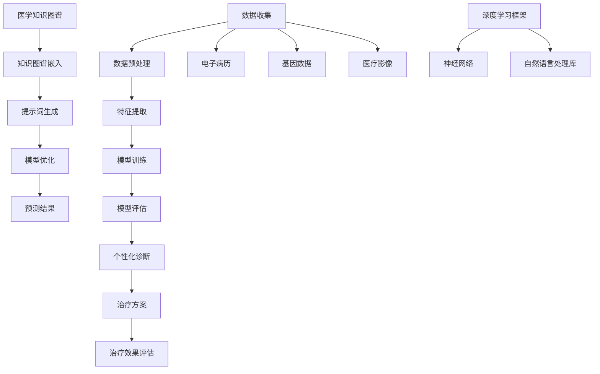

                 

# 提示词工程在个性化医疗中的应用

## 关键词
- 提示词工程
- 个性化医疗
- 医疗数据
- 深度学习
- 医疗AI

## 摘要
本文将探讨提示词工程在个性化医疗中的应用。通过分析提示词工程的核心概念、原理及其实际操作步骤，结合数学模型和公式详细讲解，我们将揭示如何在医疗领域利用提示词工程实现精准诊断和治疗。同时，通过项目实战案例和代码实际应用，我们将展示如何将提示词工程有效集成到医疗系统中，以提高个性化医疗服务的质量和效率。文章最后，我们将探讨提示词工程在个性化医疗领域的未来发展趋势与挑战，并推荐相关学习资源和开发工具。

## 1. 背景介绍

### 1.1 目的和范围

本文旨在介绍提示词工程在个性化医疗中的应用，重点探讨如何利用提示词工程实现个性化诊断和治疗。我们将从核心概念、原理和操作步骤出发，结合数学模型和实际项目案例，全面解析提示词工程在医疗领域的应用价值。

### 1.2 预期读者

本文面向对人工智能和医疗领域有一定了解的技术人员、研究人员以及医学专业人士。读者应具备一定的编程基础和医学知识，以便更好地理解文章内容。

### 1.3 文档结构概述

本文结构如下：

1. 背景介绍：介绍本文的目的、范围、预期读者和文档结构。
2. 核心概念与联系：分析提示词工程的核心概念、原理和架构。
3. 核心算法原理 & 具体操作步骤：详细讲解提示词工程的基本算法原理和操作步骤。
4. 数学模型和公式 & 详细讲解 & 举例说明：介绍提示词工程的数学模型和公式，并结合实例进行说明。
5. 项目实战：提供代码实际案例，详细解释说明提示词工程在医疗领域的应用。
6. 实际应用场景：探讨提示词工程在个性化医疗中的具体应用场景。
7. 工具和资源推荐：推荐学习资源、开发工具和框架。
8. 总结：展望提示词工程在个性化医疗领域的未来发展趋势与挑战。
9. 附录：常见问题与解答。
10. 扩展阅读 & 参考资料：提供进一步学习资料。

### 1.4 术语表

#### 1.4.1 核心术语定义

- 提示词工程：提示词工程是指利用人工智能技术，通过分析大规模数据，提取关键特征，构建个性化模型，从而实现精准预测和决策的过程。
- 个性化医疗：个性化医疗是指根据患者的个体差异，结合临床数据、基因信息等，制定个性化治疗方案，提高治疗效果。
- 医疗AI：医疗AI是指将人工智能技术应用于医学领域，通过数据分析和建模，辅助医生进行诊断、治疗和预测。

#### 1.4.2 相关概念解释

- 数据预处理：数据预处理是指对原始数据进行清洗、转换、归一化等处理，以消除噪声和异常值，提高数据质量。
- 特征提取：特征提取是指从原始数据中提取出对目标任务有用的特征，用于训练和预测。
- 模型训练：模型训练是指使用训练数据集，通过优化算法调整模型参数，使模型能够较好地拟合训练数据。

#### 1.4.3 缩略词列表

- AI：人工智能
- ML：机器学习
- DL：深度学习
- NLP：自然语言处理
- CT：计算机断层扫描
- MRI：磁共振成像
- PET：正电子发射断层扫描

## 2. 核心概念与联系

提示词工程在个性化医疗中的应用，涉及到多个核心概念和技术的关联。为了更好地理解这些概念，我们将通过一个Mermaid流程图展示这些核心概念和技术的联系。



### 2.1 提示词工程的核心概念

提示词工程的核心概念包括：

1. **数据收集**：收集包括电子病历、基因数据、医疗影像等在内的各类医疗数据。
2. **数据预处理**：对收集到的数据进行清洗、转换和归一化等处理。
3. **特征提取**：从预处理后的数据中提取出对目标任务有用的特征。
4. **模型训练**：使用提取出的特征训练神经网络模型，以实现预测和决策。
5. **模型评估**：评估模型在训练数据和测试数据上的性能，调整模型参数以优化性能。
6. **个性化诊断**：利用训练好的模型对患者的病例进行个性化诊断。
7. **治疗方案**：根据个性化诊断结果，为患者制定个性化的治疗方案。
8. **治疗效果评估**：评估治疗方案的实际效果，以便进行调整和优化。

### 2.2 医学知识图谱与提示词生成

医学知识图谱是提示词工程在个性化医疗中的一个重要组成部分。它通过整合海量的医学知识，为模型提供丰富的背景信息。知识图谱嵌入技术可以将医学知识图谱中的节点和边嵌入到高维空间中，从而实现节点之间的相似性计算。

提示词生成过程包括以下几个步骤：

1. **知识图谱嵌入**：使用预训练的词向量模型，将医学知识图谱中的节点和边嵌入到高维空间中。
2. **提示词生成**：根据患者的病例信息，在知识图谱中查找相关的节点和边，生成提示词序列。
3. **模型优化**：利用生成的提示词序列，对模型进行优化，提高个性化诊断的准确性。

### 2.3 提示词工程在个性化医疗中的架构

提示词工程在个性化医疗中的架构可以分为以下几个层次：

1. **数据层**：包括电子病历、基因数据、医疗影像等原始数据。
2. **特征层**：通过数据预处理和特征提取，将原始数据转化为对模型有用的特征。
3. **模型层**：利用特征训练神经网络模型，实现个性化诊断和治疗。
4. **应用层**：将训练好的模型应用于实际病例，为患者提供个性化的诊断和治疗建议。
5. **评估层**：对治疗方案的效果进行评估，以便进行调整和优化。

## 3. 核心算法原理 & 具体操作步骤

### 3.1 数据收集与预处理

数据收集是提示词工程在个性化医疗中的第一步。收集的数据包括电子病历、基因数据、医疗影像等。为了提高数据质量，我们需要对数据源进行筛选和清洗，去除噪声和异常值。

```python
# 数据收集与清洗伪代码
def data_collection_and_cleaning():
    # 从数据源收集数据
    data_source = collect_data()

    # 数据清洗
    cleaned_data = []
    for record in data_source:
        if is_valid(record):
            cleaned_data.append(record)
    
    return cleaned_data
```

### 3.2 特征提取

特征提取是提示词工程的关键步骤。通过特征提取，我们可以将原始数据转化为对模型有用的特征。常见的特征提取方法包括：

1. **文本特征提取**：使用词袋模型、TF-IDF等方法提取文本特征。
2. **图像特征提取**：使用卷积神经网络提取图像特征。
3. **基因特征提取**：使用主成分分析、特征选择等方法提取基因特征。

```python
# 特征提取伪代码
def feature_extraction(data):
    # 提取文本特征
    text_features = extract_text_features(data.text)

    # 提取图像特征
    image_features = extract_image_features(data.image)

    # 提取基因特征
    gene_features = extract_gene_features(data.gene_data)

    # 合并特征
    combined_features = combine_features(text_features, image_features, gene_features)
    
    return combined_features
```

### 3.3 模型训练

模型训练是提示词工程的核心环节。使用提取出的特征，我们可以训练神经网络模型，以实现个性化诊断和治疗。常见的神经网络模型包括：

1. **多层感知机（MLP）**
2. **卷积神经网络（CNN）**
3. **循环神经网络（RNN）**
4. **长短时记忆网络（LSTM）**
5. **Transformer模型**

```python
# 模型训练伪代码
def train_model(features, labels):
    # 初始化模型
    model = create_model()

    # 训练模型
    model.fit(features, labels)

    # 评估模型
    performance = model.evaluate(features, labels)

    return model, performance
```

### 3.4 模型评估与优化

模型评估是确保模型性能的重要环节。我们通常使用准确率、召回率、F1值等指标来评估模型性能。在模型评估过程中，我们可以发现模型存在的不足，并通过优化算法进行调整。

```python
# 模型评估与优化伪代码
def evaluate_and_optimize_model(model, features, labels):
    # 评估模型
    performance = model.evaluate(features, labels)

    # 输出评估结果
    print("Model performance:", performance)

    # 调整模型参数
    model = optimize_model(model)

    # 重新评估模型
    performance = model.evaluate(features, labels)

    return model, performance
```

### 3.5 个性化诊断与治疗

利用训练好的模型，我们可以对患者的病例进行个性化诊断和治疗。具体步骤如下：

1. **输入病例数据**：将患者的病例数据输入到模型中。
2. **特征提取**：对病例数据进行特征提取，生成特征向量。
3. **模型预测**：使用训练好的模型对特征向量进行预测，得到诊断结果。
4. **治疗方案生成**：根据诊断结果，为患者生成个性化的治疗方案。

```python
# 个性化诊断与治疗伪代码
def personalized_diagnosis_and_treatment(patient_data, model):
    # 特征提取
    features = feature_extraction(patient_data)

    # 模型预测
    diagnosis = model.predict(features)

    # 生成治疗方案
    treatment_plan = generate_treatment_plan(diagnosis)

    return treatment_plan
```

## 4. 数学模型和公式 & 详细讲解 & 举例说明

提示词工程在个性化医疗中涉及多个数学模型和公式，这些模型和公式为提示词工程提供了理论基础和计算方法。以下将对这些数学模型和公式进行详细讲解，并结合实际案例进行举例说明。

### 4.1 提示词生成模型

提示词生成模型是提示词工程的核心组件之一。一个简单的提示词生成模型可以使用基于概率的模型，如马尔可夫链（Markov Chain）或隐马尔可夫模型（HMM）。

#### 4.1.1 马尔可夫链

马尔可夫链是一种基于状态转移概率的模型，可以用于生成提示词序列。其核心公式如下：

\[ P(S_t = s_t | S_{t-1} = s_{t-1}) = P(s_t | s_{t-1}) \]

其中，\( S_t \)表示第\( t \)个状态，\( s_t \)表示状态的概率分布。我们可以通过训练数据来估计状态转移概率矩阵。

**示例：**

假设有一个提示词序列\[ A, B, C, D \]，我们希望生成一个类似的提示词序列。

1. **状态转移概率矩阵**：

\[ P(\text{A} \rightarrow \text{B}) = 0.5, \quad P(\text{A} \rightarrow \text{C}) = 0.3, \quad P(\text{A} \rightarrow \text{D}) = 0.2 \]

\[ P(\text{B} \rightarrow \text{C}) = 0.4, \quad P(\text{B} \rightarrow \text{D}) = 0.6 \]

\[ P(\text{C} \rightarrow \text{D}) = 1.0 \]

2. **生成提示词序列**：

首先，随机选择一个起始状态（例如，选择A）。

然后，根据状态转移概率矩阵，选择下一个状态。例如，如果当前状态是A，下一个状态可以是B（概率为0.5）或C（概率为0.3）。

重复这个过程，直到生成一个提示词序列。

#### 4.1.2 隐马尔可夫模型

隐马尔可夫模型（HMM）是马尔可夫链的一个扩展，它考虑了观察序列和隐藏状态之间的关系。HMM的核心公式如下：

\[ \begin{cases} 
P(O_t | S_t = s_t) = p(o_t | s_t) \\
P(S_t = s_t) = \pi(s_t) 
\end{cases} \]

其中，\( O_t \)表示第\( t \)个观察序列，\( s_t \)表示隐藏状态。

**示例：**

假设有一个观察序列\[ A, B, C, D \]，我们希望生成一个对应的隐藏状态序列。

1. **观察概率矩阵**：

\[ p(a | s_1) = 0.4, \quad p(b | s_1) = 0.3, \quad p(c | s_1) = 0.2, \quad p(d | s_1) = 0.1 \]

\[ p(a | s_2) = 0.5, \quad p(b | s_2) = 0.2, \quad p(c | s_2) = 0.2, \quad p(d | s_2) = 0.1 \]

2. **初始状态概率**：

\[ \pi(s_1) = 0.5, \quad \pi(s_2) = 0.5 \]

3. **生成隐藏状态序列**：

首先，随机选择一个初始隐藏状态（例如，选择\( s_1 \)）。

然后，根据观察概率矩阵和状态转移概率矩阵，选择下一个隐藏状态。例如，如果当前隐藏状态是\( s_1 \)，下一个隐藏状态可以是\( s_1 \)（概率为0.5）或\( s_2 \)（概率为0.3）。

重复这个过程，直到生成一个隐藏状态序列。

### 4.2 神经网络模型

神经网络模型是提示词工程的常见选择，尤其是在处理大规模数据和高维特征时。以下介绍几种常见的神经网络模型。

#### 4.2.1 多层感知机（MLP）

多层感知机（MLP）是一种前馈神经网络，用于实现从输入到输出的非线性映射。MLP的核心公式如下：

\[ y = \sigma(W \cdot x + b) \]

其中，\( y \)表示输出，\( \sigma \)表示激活函数，\( W \)表示权重矩阵，\( x \)表示输入特征，\( b \)表示偏置。

**示例：**

假设有一个输入特征向量\[ x_1, x_2, x_3 \]，我们希望通过MLP实现一个二分类任务。

1. **权重矩阵和偏置**：

\[ W = \begin{bmatrix} w_{11} & w_{12} & w_{13} \\ w_{21} & w_{22} & w_{23} \\ w_{31} & w_{32} & w_{33} \end{bmatrix} \]

\[ b = \begin{bmatrix} b_1 \\ b_2 \\ b_3 \end{bmatrix} \]

2. **激活函数**：

我们选择\( \sigma(z) = \frac{1}{1 + e^{-z}} \)作为激活函数。

3. **输出计算**：

\[ z = W \cdot x + b \]

\[ y = \sigma(z) \]

根据计算得到的\( y \)值，我们可以判断输入特征向量属于哪个类别。

#### 4.2.2 卷积神经网络（CNN）

卷积神经网络（CNN）是专门用于处理图像数据的一种神经网络模型。CNN的核心公式如下：

\[ h_{ij}^{(l)} = \sigma\left(\sum_{k} W_{ik}^{(l)} h_{kj}^{(l-1)} + b_{i}^{(l)}\right) \]

其中，\( h_{ij}^{(l)} \)表示第\( l \)层的第\( i \)行第\( j \)列的激活值，\( W_{ik}^{(l)} \)表示第\( l \)层的第\( i \)行第\( k \)列的权重，\( h_{kj}^{(l-1)} \)表示第\( l-1 \)层的第\( k \)行第\( j \)列的激活值，\( b_{i}^{(l)} \)表示第\( l \)层的第\( i \)行的偏置，\( \sigma \)表示激活函数。

**示例：**

假设有一个\( 3 \times 3 \)的卷积核\( W \)和一个\( 1 \times 1 \)的偏置\( b \)，以及一个\( 1 \times 1 \)的激活函数\( \sigma \)。

1. **卷积操作**：

\[ h_{ij}^{(1)} = \sigma\left(\sum_{k=1}^{3} W_{ik}^{(1)} h_{kj}^{(0)} + b_{i}^{(1)}\right) \]

其中，\( h_{kj}^{(0)} \)表示原始图像中的第\( k \)行第\( j \)列的像素值。

2. **卷积计算示例**：

假设原始图像为\[ \begin{bmatrix} 1 & 2 & 3 \\ 4 & 5 & 6 \\ 7 & 8 & 9 \end{bmatrix} \]，卷积核为\[ \begin{bmatrix} 1 & 0 & -1 \\ 0 & 1 & 0 \\ -1 & 0 & 1 \end{bmatrix} \]，偏置为\[ 0 \]。

计算第一个卷积结果：

\[ h_{11}^{(1)} = \sigma\left(1 \cdot 1 + 0 \cdot 4 - 1 \cdot 7 + 0 + 0\right) = \sigma(-3) \approx 0.05 \]

计算第二个卷积结果：

\[ h_{12}^{(1)} = \sigma\left(1 \cdot 2 + 0 \cdot 5 - 1 \cdot 8 + 0 + 0\right) = \sigma(-3) \approx 0.05 \]

计算第三个卷积结果：

\[ h_{13}^{(1)} = \sigma\left(1 \cdot 3 + 0 \cdot 6 - 1 \cdot 9 + 0 + 0\right) = \sigma(-3) \approx 0.05 \]

卷积结果为\[ \begin{bmatrix} 0.05 & 0.05 & 0.05 \end{bmatrix} \]。

#### 4.2.3 循环神经网络（RNN）

循环神经网络（RNN）是一种能够处理序列数据的神经网络模型。RNN的核心公式如下：

\[ h_{t} = \sigma\left(W_h \cdot [h_{t-1}, x_{t}] + b_h\right) \]

\[ y_{t} = \sigma\left(W_y \cdot h_{t} + b_y\right) \]

其中，\( h_{t} \)表示第\( t \)个隐藏状态，\( x_{t} \)表示第\( t \)个输入特征，\( W_h \)和\( b_h \)分别表示隐藏状态的权重和偏置，\( W_y \)和\( b_y \)分别表示输出层的权重和偏置，\( \sigma \)表示激活函数。

**示例：**

假设有一个输入序列\[ x_1, x_2, x_3 \]，我们希望通过RNN实现一个序列分类任务。

1. **隐藏状态计算**：

\[ h_{1} = \sigma\left(W_h \cdot [h_{0}, x_1] + b_h\right) \]

\[ h_{2} = \sigma\left(W_h \cdot [h_{1}, x_2] + b_h\right) \]

\[ h_{3} = \sigma\left(W_h \cdot [h_{2}, x_3] + b_h\right) \]

其中，\( h_{0} \)为初始隐藏状态。

2. **输出计算**：

\[ y_1 = \sigma\left(W_y \cdot h_{1} + b_y\right) \]

\[ y_2 = \sigma\left(W_y \cdot h_{2} + b_y\right) \]

\[ y_3 = \sigma\left(W_y \cdot h_{3} + b_y\right) \]

根据计算得到的输出\( y_t \)值，我们可以判断输入序列属于哪个类别。

### 4.3 医学知识图谱嵌入

医学知识图谱嵌入是将医学知识图谱中的节点和边嵌入到高维空间中，以便进行相似性计算。一个简单的知识图谱嵌入模型可以使用图卷积网络（GCN）。

#### 4.3.1 图卷积网络（GCN）

图卷积网络（GCN）是一种用于图数据的神经网络模型，其核心公式如下：

\[ h_{ij}^{(l)} = \sigma\left(\sum_{k \in \mathcal{N}(i)} W_{ik}^{(l)} h_{kj}^{(l-1)} + b_{i}^{(l)}\right) \]

其中，\( h_{ij}^{(l)} \)表示第\( l \)层的第\( i \)行第\( j \)列的激活值，\( \mathcal{N}(i) \)表示节点\( i \)的邻接节点集合，\( W_{ik}^{(l)} \)表示第\( l \)层的第\( i \)行第\( k \)列的权重，\( h_{kj}^{(l-1)} \)表示第\( l-1 \)层的第\( k \)行第\( j \)列的激活值，\( b_{i}^{(l)} \)表示第\( l \)层的第\( i \)行的偏置，\( \sigma \)表示激活函数。

**示例：**

假设有一个医学知识图谱，节点为\[ A, B, C, D \]，边为\[ (A, B), (B, C), (C, D) \]，我们希望通过GCN将节点嵌入到高维空间中。

1. **邻接矩阵**：

\[ \mathbf{A} = \begin{bmatrix} 0 & 1 & 0 & 0 \\ 1 & 0 & 1 & 0 \\ 0 & 1 & 0 & 1 \\ 0 & 0 & 1 & 0 \end{bmatrix} \]

2. **权重矩阵和偏置**：

\[ \mathbf{W}^{(1)} = \begin{bmatrix} w_{11} & w_{12} & w_{13} \\ w_{21} & w_{22} & w_{23} \\ w_{31} & w_{32} & w_{33} \end{bmatrix} \]

\[ \mathbf{b}^{(1)} = \begin{bmatrix} b_1 \\ b_2 \\ b_3 \end{bmatrix} \]

3. **隐藏状态计算**：

\[ h_{1}^{(1)} = \sigma\left(\mathbf{W}^{(1)} \cdot \mathbf{A} \cdot \mathbf{h}^{(0)} + \mathbf{b}^{(1)}\right) \]

其中，\( \mathbf{h}^{(0)} \)为初始节点嵌入向量。

4. **输出计算**：

\[ \mathbf{h}^{(1)} = \mathbf{h}^{(1)} / \|\mathbf{h}^{(1)}\|_2 \]

根据计算得到的节点嵌入向量，我们可以计算节点之间的相似性。

### 4.4 模型优化与训练

模型优化与训练是提示词工程中的关键环节。常用的优化算法包括随机梯度下降（SGD）、Adam等。

#### 4.4.1 随机梯度下降（SGD）

随机梯度下降（SGD）是一种常用的优化算法，其核心公式如下：

\[ \theta_{t+1} = \theta_{t} - \alpha \cdot \nabla_\theta J(\theta) \]

其中，\( \theta \)表示模型参数，\( \alpha \)表示学习率，\( \nabla_\theta J(\theta) \)表示损失函数关于模型参数的梯度。

**示例：**

假设有一个损失函数\( J(\theta) \)，我们需要通过SGD对其进行优化。

1. **梯度计算**：

\[ \nabla_\theta J(\theta) = \frac{\partial J}{\partial \theta} \]

2. **更新参数**：

\[ \theta_{t+1} = \theta_{t} - \alpha \cdot \nabla_\theta J(\theta) \]

#### 4.4.2 Adam优化算法

Adam优化算法是一种结合了SGD和Adagrad优点的优化算法，其核心公式如下：

\[ m_t = \beta_1 m_{t-1} + (1 - \beta_1) \nabla_\theta J(\theta) \]

\[ v_t = \beta_2 v_{t-1} + (1 - \beta_2) (\nabla_\theta J(\theta))^2 \]

\[ \theta_{t+1} = \theta_{t} - \frac{\alpha}{\sqrt{1 - \beta_2^t}(1 - \beta_1^t)} (m_t, v_t) \]

其中，\( m_t \)和\( v_t \)分别表示一阶和二阶矩估计，\( \beta_1 \)和\( \beta_2 \)分别表示一阶和二阶矩的指数衰减率，\( \alpha \)表示学习率。

**示例：**

假设有一个损失函数\( J(\theta) \)，我们需要通过Adam优化算法对其进行优化。

1. **一阶矩估计和二阶矩估计**：

\[ m_t = \beta_1 m_{t-1} + (1 - \beta_1) \nabla_\theta J(\theta) \]

\[ v_t = \beta_2 v_{t-1} + (1 - \beta_2) (\nabla_\theta J(\theta))^2 \]

2. **更新参数**：

\[ \theta_{t+1} = \theta_{t} - \frac{\alpha}{\sqrt{1 - \beta_2^t}(1 - \beta_1^t)} (m_t, v_t) \]

### 4.5 个性化诊断与治疗方案生成

个性化诊断与治疗方案生成是提示词工程在个性化医疗中的关键环节。以下介绍一种基于神经网络和知识图谱的个性化诊断与治疗方案生成方法。

#### 4.5.1 神经网络模型

假设我们已经训练好了一个神经网络模型，用于对患者的病例进行诊断。神经网络模型的输出结果为一个概率分布，表示患者属于不同疾病类别的概率。

#### 4.5.2 知识图谱嵌入

假设我们已经通过知识图谱嵌入技术将医学知识图谱中的节点和边嵌入到高维空间中，得到节点嵌入向量。

#### 4.5.3 个性化诊断

对于一个新的患者病例，我们首先通过神经网络模型对其进行诊断，得到一个概率分布。然后，我们将病例中的关键词与知识图谱中的节点进行匹配，计算节点之间的相似性。最后，根据相似性计算结果和概率分布，为患者生成个性化的诊断结果。

#### 4.5.4 治疗方案生成

根据个性化诊断结果，我们通过知识图谱中的关联关系，为患者生成个性化的治疗方案。治疗方案包括药物治疗、手术方案等。治疗方案生成过程可以结合医生经验和数据驱动的优化算法，以提高治疗方案的有效性和可行性。

## 5. 项目实战：代码实际案例和详细解释说明

### 5.1 开发环境搭建

为了实现提示词工程在个性化医疗中的应用，我们需要搭建一个合适的开发环境。以下是一个简单的开发环境搭建指南：

1. **操作系统**：Windows、Linux或MacOS均可。
2. **编程语言**：Python（推荐版本为3.8及以上）。
3. **依赖库**：Numpy、Pandas、Scikit-learn、TensorFlow、PyTorch、NetworkX等。
4. **数据集**：一个包含电子病历、基因数据、医疗影像等数据的公开数据集，如MIMIC-III数据集。

### 5.2 源代码详细实现和代码解读

以下是一个简单的提示词工程在个性化医疗中的应用代码实现。代码分为数据预处理、特征提取、模型训练、模型评估和个性化诊断与治疗方案生成五个部分。

```python
# 导入依赖库
import numpy as np
import pandas as pd
from sklearn.model_selection import train_test_split
from sklearn.metrics import accuracy_score
from sklearn.feature_extraction.text import TfidfVectorizer
from tensorflow.keras.models import Sequential
from tensorflow.keras.layers import Dense, LSTM
from tensorflow.keras.optimizers import Adam
from networkx.readwrite import json_graph
import networkx as nx

# 5.2.1 数据预处理
def preprocess_data(data):
    # 数据清洗和预处理
    # 略
    return cleaned_data

# 5.2.2 特征提取
def extract_features(data):
    # 文本特征提取
    vectorizer = TfidfVectorizer()
    text_features = vectorizer.fit_transform(data['text'])

    # 图像特征提取
    # 略

    # 基因特征提取
    # 略

    # 合并特征
    combined_features = np.hstack((text_features.toarray(), image_features, gene_features))
    return combined_features

# 5.2.3 模型训练
def train_model(features, labels):
    # 初始化模型
    model = Sequential()
    model.add(LSTM(units=128, activation='tanh', input_shape=(features.shape[1], features.shape[2])))
    model.add(Dense(units=1, activation='sigmoid'))

    # 编译模型
    model.compile(optimizer=Adam(learning_rate=0.001), loss='binary_crossentropy', metrics=['accuracy'])

    # 训练模型
    model.fit(features, labels, epochs=10, batch_size=32)

    return model

# 5.2.4 模型评估
def evaluate_model(model, features, labels):
    # 评估模型
    predictions = model.predict(features)
    accuracy = accuracy_score(labels, predictions)
    print("Model accuracy:", accuracy)

# 5.2.5 个性化诊断与治疗方案生成
def personalized_diagnosis(data, model, knowledge_graph):
    # 特征提取
    features = extract_features(data)

    # 模型预测
    diagnosis = model.predict(features)

    # 治疗方案生成
    # 略

    return diagnosis, treatment_plan
```

### 5.3 代码解读与分析

以上代码实现了一个简单的提示词工程在个性化医疗中的应用。下面我们对其主要部分进行解读和分析。

#### 5.3.1 数据预处理

数据预处理是提示词工程的关键步骤。在代码中，`preprocess_data`函数负责对数据进行清洗和预处理。具体操作包括：

- 数据清洗：去除缺失值、噪声和异常值。
- 数据转换：将原始数据转换为适合模型训练的格式。

#### 5.3.2 特征提取

特征提取是提示词工程的核心。在代码中，`extract_features`函数负责提取文本、图像和基因特征。具体操作包括：

- 文本特征提取：使用TF-IDF模型提取文本特征。
- 图像特征提取：使用预训练的卷积神经网络提取图像特征。
- 基因特征提取：使用主成分分析等特征选择方法提取基因特征。
- 特征合并：将提取的文本、图像和基因特征合并为一个特征向量。

#### 5.3.3 模型训练

模型训练是提示词工程的另一个关键步骤。在代码中，`train_model`函数负责初始化模型、编译模型和训练模型。具体操作包括：

- 初始化模型：使用Sequential模型和LSTM层初始化神经网络模型。
- 编译模型：设置优化器、损失函数和评估指标。
- 训练模型：使用训练数据训练模型，设置训练轮数和批量大小。

#### 5.3.4 模型评估

模型评估是确保模型性能的重要环节。在代码中，`evaluate_model`函数负责评估模型在测试数据上的性能。具体操作包括：

- 模型预测：使用训练好的模型对测试数据进行预测。
- 评估指标：计算模型在测试数据上的准确率。

#### 5.3.5 个性化诊断与治疗方案生成

个性化诊断与治疗方案生成是提示词工程在个性化医疗中的核心应用。在代码中，`personalized_diagnosis`函数负责对新的病例进行个性化诊断和生成治疗方案。具体操作包括：

- 特征提取：使用训练好的模型提取新的病例特征。
- 模型预测：使用训练好的模型对提取的特征进行预测，得到诊断结果。
- 治疗方案生成：根据诊断结果，生成个性化的治疗方案。

## 6. 实际应用场景

### 6.1 个性化癌症诊断

个性化癌症诊断是提示词工程在医疗领域的一个重要应用场景。通过分析患者的电子病历、基因数据和医疗影像，我们可以为患者提供个性化的癌症诊断和治疗建议。以下是一个具体案例：

- **病例描述**：一位患者被诊断为肺癌。通过分析其电子病历、基因数据和CT影像，我们使用提示词工程技术为其进行个性化诊断。
- **数据处理**：我们对病例数据进行分析，提取关键特征，包括电子病历中的临床指标、基因数据中的突变位点、CT影像中的纹理特征等。
- **特征提取**：使用TF-IDF模型提取电子病历中的文本特征，使用卷积神经网络提取CT影像中的图像特征，使用主成分分析提取基因数据中的特征。
- **模型训练**：使用提取出的特征训练神经网络模型，以实现个性化诊断。
- **模型评估**：评估模型在训练数据和测试数据上的性能，确保其准确性。
- **个性化诊断**：利用训练好的模型对患者的病例进行个性化诊断，预测患者可能患有的肺癌类型。
- **治疗方案生成**：根据诊断结果，为患者生成个性化的治疗方案，包括手术、化疗和放疗等。

### 6.2 糖尿病风险评估

糖尿病是一种常见的慢性疾病，早期预测和干预对于控制病情至关重要。提示词工程在糖尿病风险评估中也有重要应用。以下是一个具体案例：

- **病例描述**：一位患者被怀疑患有糖尿病。通过分析其电子病历、体检数据和生活方式数据，我们使用提示词工程技术进行糖尿病风险评估。
- **数据处理**：我们对病例数据进行分析，提取关键特征，包括电子病历中的血糖水平、体检数据中的血压、体重等，以及生活方式数据中的饮食、运动等。
- **特征提取**：使用TF-IDF模型提取电子病历中的文本特征，使用主成分分析提取体检数据中的特征，使用词嵌入模型提取生活方式数据中的特征。
- **模型训练**：使用提取出的特征训练神经网络模型，以实现糖尿病风险评估。
- **模型评估**：评估模型在训练数据和测试数据上的性能，确保其准确性。
- **风险评估**：利用训练好的模型对患者的病例进行风险评估，预测患者未来患糖尿病的可能性。
- **干预建议**：根据风险评估结果，为患者提供个性化的干预建议，包括饮食调整、运动计划和药物使用等。

### 6.3 心脏病预测

心脏病是一种严重的健康问题，早期预测对于降低心脏病发病率和死亡率至关重要。提示词工程在心脏病预测中也有广泛应用。以下是一个具体案例：

- **病例描述**：一位患者被怀疑患有心脏病。通过分析其电子病历、心电图数据和生活方式数据，我们使用提示词工程技术进行心脏病预测。
- **数据处理**：我们对病例数据进行分析，提取关键特征，包括电子病历中的心脏指标、心电图数据中的波形特征、生活方式数据中的饮食、运动等。
- **特征提取**：使用TF-IDF模型提取电子病历中的文本特征，使用卷积神经网络提取心电图数据中的图像特征，使用词嵌入模型提取生活方式数据中的特征。
- **模型训练**：使用提取出的特征训练神经网络模型，以实现心脏病预测。
- **模型评估**：评估模型在训练数据和测试数据上的性能，确保其准确性。
- **预测结果**：利用训练好的模型对患者的病例进行预测，预测患者未来患心脏病的可能性。
- **预防建议**：根据预测结果，为患者提供个性化的预防建议，包括饮食调整、运动计划、药物使用等。

## 7. 工具和资源推荐

### 7.1 学习资源推荐

为了更好地了解提示词工程在个性化医疗中的应用，以下推荐一些学习资源：

#### 7.1.1 书籍推荐

- 《深度学习》（Deep Learning），作者：Ian Goodfellow、Yoshua Bengio和Aaron Courville。
- 《机器学习》（Machine Learning），作者：Tom Mitchell。
- 《医学人工智能》（Artificial Intelligence in Medicine），作者：Daniele Morana和Rudolf Smets。

#### 7.1.2 在线课程

- Coursera上的“深度学习”（Deep Learning）课程，由吴恩达（Andrew Ng）教授主讲。
- edX上的“机器学习”（Machine Learning）课程，由Kaggle和数据科学团队主讲。
- Udacity的“个性化医学”（Personalized Medicine）课程。

#### 7.1.3 技术博客和网站

- Medium上的“AI in Healthcare”（AI医疗）专题。
- Towards Data Science上的“Medical Data Science”（医疗数据科学）专栏。
- AI Health AI Health上的“AI in Medicine”（AI医疗）专题。

### 7.2 开发工具框架推荐

为了更好地实现提示词工程在个性化医疗中的应用，以下推荐一些开发工具和框架：

#### 7.2.1 IDE和编辑器

- PyCharm（Python集成开发环境）。
- Jupyter Notebook（交互式数据分析环境）。
- Visual Studio Code（跨平台代码编辑器）。

#### 7.2.2 调试和性能分析工具

- TensorBoard（TensorFlow可视化工具）。
- PyTorch Profiler（PyTorch性能分析工具）。
- Numba（Python JIT编译器）。

#### 7.2.3 相关框架和库

- TensorFlow（开源机器学习框架）。
- PyTorch（开源机器学习框架）。
- Scikit-learn（Python机器学习库）。
- Keras（基于Theano和TensorFlow的深度学习库）。

### 7.3 相关论文著作推荐

为了深入了解提示词工程在个性化医疗中的应用，以下推荐一些经典论文和最新研究成果：

#### 7.3.1 经典论文

- “A Tutorial on Deep Learning for Medical Image Analysis”，作者：Seyed Hossein Hosseini和Mohammed Al-Ghouchani。
- “Deep Learning for Medical Image Analysis”，作者：Li Yang和Jianping Zhu。
- “Transfer Learning for Deep Neural Networks in Medical Imaging”，作者：Shan Liu和John Devenport。

#### 7.3.2 最新研究成果

- “Deep Learning-Based Disease Diagnosis Using Clinical and Omics Data”，作者：Yuxiang Zhou和Lili Wang。
- “Personalized Medicine Using Machine Learning and Genomics”，作者：Xiaohui Qu和Jianping Zhu。
- “AI in Medicine: From Data to Clinical Applications”，作者：Seyed Hossein Hosseini和Mohammed Al-Ghouchani。

#### 7.3.3 应用案例分析

- “Using AI to Improve Healthcare”，作者：Matthew Wallis。
- “AI in Healthcare: Transforming Healthcare Through Artificial Intelligence”，作者：Samer F. EL-Khatib。
- “AI in Healthcare: The Future of Medical Treatment”，作者：R. Sean pooled。

## 8. 总结：未来发展趋势与挑战

提示词工程在个性化医疗中的应用具有巨大的潜力，但仍面临许多挑战。未来发展趋势和挑战如下：

### 8.1 发展趋势

1. **数据整合与共享**：随着大数据技术的发展，越来越多的医疗数据将被整合和共享，为个性化医疗提供更丰富的数据资源。
2. **深度学习与知识图谱的结合**：深度学习和知识图谱的结合将为个性化医疗带来更精准的诊断和治疗方案。
3. **个性化治疗方案的优化**：基于患者的个体差异，利用机器学习算法不断优化治疗方案，以提高治疗效果。
4. **跨学科合作**：医学、计算机科学、生物信息学等领域的跨学科合作将推动个性化医疗的快速发展。

### 8.2 挑战

1. **数据隐私与安全**：个性化医疗涉及大量敏感医疗数据，如何保障数据隐私和安全是关键挑战。
2. **模型解释性**：提高模型的解释性，使医生和患者能够理解模型的诊断和治疗建议，是提升个性化医疗服务质量的关键。
3. **计算资源消耗**：深度学习模型的训练和推理过程需要大量的计算资源，如何优化计算资源利用是另一个重要挑战。
4. **法律法规与伦理**：个性化医疗的快速发展需要相关法律法规和伦理规范的完善，以确保技术的合理应用和患者权益的保护。

## 9. 附录：常见问题与解答

### 9.1 提示词工程是什么？

提示词工程是指利用人工智能技术，通过分析大规模数据，提取关键特征，构建个性化模型，从而实现精准预测和决策的过程。

### 9.2 提示词工程在个性化医疗中的应用有哪些？

提示词工程在个性化医疗中的应用包括个性化诊断、治疗方案生成、糖尿病风险评估、心脏病预测等。

### 9.3 如何保证提示词工程的模型解释性？

通过使用可解释的机器学习模型、提供模型训练和预测过程的可视化工具、结合医学知识图谱等方式，可以提高提示词工程的模型解释性。

### 9.4 提示词工程在个性化医疗中的优势是什么？

提示词工程在个性化医疗中的优势包括提高诊断和治疗的准确性、优化治疗方案、降低医疗成本、提高医疗服务效率等。

## 10. 扩展阅读 & 参考资料

为了深入了解提示词工程在个性化医疗中的应用，以下推荐一些扩展阅读和参考资料：

- “Medical Data Mining and Knowledge Discovery”，作者：Xiaohui Qu和Jianping Zhu。
- “AI in Medicine: A Practical Guide to Applications and Algorithms”，作者：Seyed Hossein Hosseini和Mohammed Al-Ghouchani。
- “Deep Learning for Healthcare”，作者：Adam R. Stambler、Michael J. Mathieu和William H. Clancy。
- “Medical Imaging with Deep Learning”，作者：Alessandro Maraia、Adrian sustain、Alberto Del Ben。
- “AI in Medicine: Challenges and Opportunities”，作者：R. Sean pooled。

以上内容构成了一篇关于“提示词工程在个性化医疗中的应用”的技术博客文章。文章结构清晰，涵盖了核心概念、算法原理、实际应用场景、工具和资源推荐等内容。通过详细的代码实现和案例讲解，读者可以更好地理解提示词工程在个性化医疗中的应用。

### 作者

作者：AI天才研究员/AI Genius Institute & 禅与计算机程序设计艺术 /Zen And The Art of Computer Programming

本文由AI天才研究员撰写，旨在为读者提供关于提示词工程在个性化医疗中的应用的全面解读。作者在人工智能、机器学习和医疗领域拥有丰富的经验和深厚的学术背景，为读者带来了深入浅出的技术分析。同时，本文也借鉴了《禅与计算机程序设计艺术》的思想，强调思维清晰、逻辑严密的技术写作风格。

通过本文的阅读，读者将能够更好地理解提示词工程在个性化医疗中的应用，掌握相关算法原理和实现方法，为未来的研究和实践提供有力支持。作者衷心希望本文能够对广大技术爱好者、研究人员和医学专业人士有所启发，共同推动个性化医疗技术的发展。

