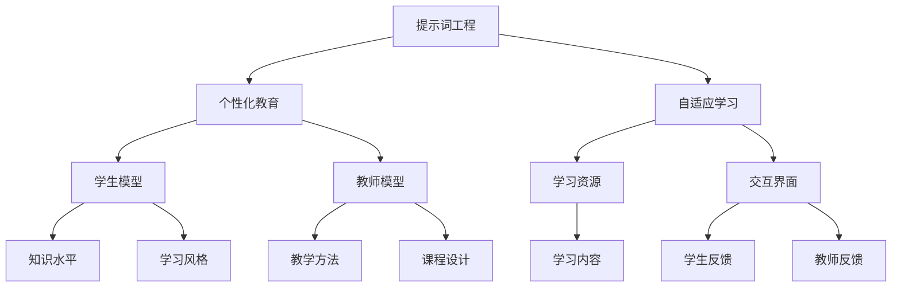

                 

# 提示词工程在个性化教育中的深度应用

> **关键词**：提示词工程、个性化教育、自适应学习、教育技术、算法原理、数学模型、项目实战、应用场景

> **摘要**：本文深入探讨了提示词工程在个性化教育中的应用。通过分析核心概念、算法原理、数学模型，并结合实际项目案例，本文揭示了提示词工程在提升学习效率、满足个性化需求方面的巨大潜力。文章旨在为教育科技领域的研究者和从业者提供有益的参考和指导。

## 1. 背景介绍

### 1.1 目的和范围

本文旨在探讨提示词工程在个性化教育中的应用，通过系统的分析和实证研究，揭示其如何提升学习效果和满足个性化需求。文章将涵盖以下几个方面：

1. 提示词工程的基本概念和原理。
2. 提示词工程在个性化教育中的具体应用场景。
3. 提示词工程的关键算法和数学模型。
4. 实际项目案例的代码实现和解读。
5. 提示词工程在个性化教育中的未来发展趋势与挑战。

### 1.2 预期读者

本文面向以下读者群体：

1. 教育科技领域的研究者，特别是对个性化教育和自适应学习有浓厚兴趣的学者。
2. 从事教育软件开发的技术人员，对如何利用技术手段提升教育效果感兴趣。
3. 对人工智能和机器学习有基本了解，希望深入了解其在教育领域应用的人员。
4. 任何对教育技术有热情，希望学习新知识的人士。

### 1.3 文档结构概述

本文结构如下：

1. **背景介绍**：介绍文章的目的、范围、预期读者以及文档结构。
2. **核心概念与联系**：详细阐述提示词工程和相关概念。
3. **核心算法原理 & 具体操作步骤**：讲解提示词工程的关键算法。
4. **数学模型和公式 & 详细讲解 & 举例说明**：介绍与提示词工程相关的数学模型。
5. **项目实战：代码实际案例和详细解释说明**：通过实际项目案例展示提示词工程的实现。
6. **实际应用场景**：探讨提示词工程在不同教育场景中的应用。
7. **工具和资源推荐**：推荐相关学习资源和开发工具。
8. **总结：未来发展趋势与挑战**：总结文章的主要观点，并探讨未来趋势和挑战。
9. **附录：常见问题与解答**：解答读者可能遇到的问题。
10. **扩展阅读 & 参考资料**：提供进一步阅读的参考资料。

### 1.4 术语表

#### 1.4.1 核心术语定义

- **提示词工程**：提示词工程是指利用人工智能和机器学习技术，生成和优化用于个性化学习的提示词，以提高学习效果和满足个性化需求。
- **个性化教育**：个性化教育是根据学生的个体差异，采用定制化的教学方法、学习资源和评价体系，以最大化学习效果和满足学生个性化需求。
- **自适应学习**：自适应学习是指系统能够根据学生的学习行为和反馈，动态调整学习内容和教学策略，以适应不同的学习需求。

#### 1.4.2 相关概念解释

- **学生模型**：学生模型是指系统对学生的知识水平、学习风格、兴趣爱好等特征的抽象表示，用于指导个性化学习。
- **教师模型**：教师模型是指系统对教师的教学方法、教学风格、课程设计等特征的抽象表示，用于优化教学效果。
- **交互界面**：交互界面是指学生与教育系统进行交互的界面，包括学习平台、移动应用、虚拟现实等。

#### 1.4.3 缩略词列表

- **AI**：人工智能
- **ML**：机器学习
- **NLP**：自然语言处理
- **IDE**：集成开发环境
- **VR**：虚拟现实

## 2. 核心概念与联系

在探讨提示词工程在个性化教育中的应用之前，我们首先需要了解一些核心概念和它们之间的联系。以下是一个简化的 Mermaid 流程图，用于展示这些概念之间的关系：



### 2.1 提示词工程

提示词工程是一种利用人工智能和机器学习技术生成和优化提示词的方法。提示词是指用于引导学生学习的关键词、短语或句子，它们可以来自文本、语音、图像等多种形式。提示词工程主要包括以下步骤：

1. **数据收集**：收集大量与学习主题相关的数据，包括文本、图像、音频等。
2. **预处理**：对收集到的数据进行分析和预处理，以提取有用的特征。
3. **模型训练**：利用机器学习算法训练模型，使其能够根据学生的学习行为和需求生成合适的提示词。
4. **优化**：通过评估和调整模型参数，优化提示词的生成效果。

### 2.2 个性化教育

个性化教育是一种以学生为中心的教育方法，旨在满足每个学生的个性化需求。个性化教育包括以下几个方面：

1. **学生模型**：通过收集和分析学生的学习行为和反馈，建立学生模型，以了解学生的知识水平、学习风格和兴趣爱好。
2. **教师模型**：通过分析教师的教学方法和课程设计，建立教师模型，以优化教学效果。
3. **自适应学习**：利用学生模型和教师模型，动态调整学习内容和教学策略，以适应不同的学习需求。
4. **交互界面**：设计友好的交互界面，使学生能够轻松地与教育系统进行互动，提供反馈。

### 2.3 自适应学习

自适应学习是指系统能够根据学生的学习行为和反馈，动态调整学习内容和教学策略。自适应学习的主要步骤包括：

1. **数据收集**：收集学生的学习行为数据，包括学习时间、学习内容、学习进度等。
2. **模型更新**：根据学生的学习行为数据更新学生模型，以反映学生的最新学习状态。
3. **学习策略调整**：根据学生模型和教师模型，动态调整学习策略，以适应不同的学习需求。
4. **学习效果评估**：通过评估学生的学习成果，进一步优化学习策略。

通过以上核心概念和它们之间的联系，我们可以更好地理解提示词工程在个性化教育中的应用。接下来，我们将深入探讨提示词工程的关键算法和数学模型。

## 3. 核心算法原理 & 具体操作步骤

提示词工程的实现依赖于一系列算法和数学模型，这些算法和模型用于生成和优化提示词，以满足个性化教育的需求。在本节中，我们将详细讨论这些算法和模型的原理，并提供具体的操作步骤。

### 3.1 生成提示词的算法

生成提示词的关键在于选择合适的算法。以下是一个常见的基于生成对抗网络（GAN）的提示词生成算法：

#### 3.1.1 算法原理

生成对抗网络（GAN）是由生成器（Generator）和判别器（Discriminator）组成的对抗性模型。生成器生成与真实数据相似的提示词，而判别器则判断提示词是真实的还是由生成器生成的。通过这种对抗性训练，生成器逐渐学习生成高质量、与真实数据相似的数据。

#### 3.1.2 操作步骤

1. **数据预处理**：收集与学习主题相关的数据，并进行预处理，如去噪、标准化等。
2. **生成器和判别器初始化**：初始化生成器和判别器，可以使用随机权重或预训练的模型。
3. **生成器训练**：训练生成器，使其生成的提示词尽可能接近真实数据。生成器的损失函数是最大化判别器对生成数据的判断误差。
4. **判别器训练**：训练判别器，使其能够准确判断提示词的真实性。判别器的损失函数是最小化对真实数据和生成数据的判断误差。
5. **迭代训练**：交替训练生成器和判别器，直到生成器生成的提示词质量达到预期。

#### 3.1.3 伪代码

```python
# 生成器模型
Generator_model = ...
# 判别器模型
Discriminator_model = ...

# 数据预处理
preprocessed_data = preprocess_data(data)

# 损失函数
generator_loss_function = ...
discriminator_loss_function = ...

# 训练步骤
for epoch in range(num_epochs):
    for batch in data_loader:
        # 生成器训练
        generated_data = Generator_model(batch)
        generator_loss = generator_loss_function(Discriminator_model(generated_data), generated_data)
        
        # 判别器训练
        real_data = ...
        discriminator_loss = discriminator_loss_function(Discriminator_model(real_data), real_data)
        
        # 更新模型参数
        optimizer_generator.zero_grad()
        optimizer_discriminator.zero_grad()
        generator_loss.backward()
        discriminator_loss.backward()
        optimizer_generator.step()
        optimizer_discriminator.step()
```

### 3.2 优化提示词的算法

在生成提示词之后，需要对提示词进行优化，以提高其质量和适用性。以下是一种常见的基于深度强化学习的提示词优化算法：

#### 3.2.1 算法原理

深度强化学习是一种基于试错和反馈的学习方法。在提示词优化过程中，智能体（Agent）通过与环境（学习场景）交互，学习生成最优的提示词序列。智能体根据提示词的反馈（如学生的学习行为和成绩），调整其策略，以最大化奖励。

#### 3.2.2 操作步骤

1. **环境构建**：构建模拟学习场景的环境，包括学习资源、学生模型、教师模型等。
2. **智能体初始化**：初始化智能体，包括策略网络和价值网络。
3. **交互学习**：智能体与环境进行交互，生成提示词序列，并收集反馈。
4. **策略调整**：根据反馈调整智能体的策略网络，以优化提示词序列。
5. **迭代学习**：重复交互学习和策略调整，直到智能体生成高质量的提示词序列。

#### 3.2.3 伪代码

```python
# 智能体模型
Agent_model = ...

# 环境构建
environment = ...

# 损失函数
reward_function = ...

# 训练步骤
for episode in range(num_episodes):
    state = environment.initialize()
    while not environment.is_ended():
        action = Agent_model.select_action(state)
        next_state, reward = environment.step(action)
        Agent_model.update_policy(state, action, next_state, reward)
        state = next_state
```

通过以上算法原理和操作步骤，我们可以构建一个有效的提示词工程系统，用于生成和优化个性化教育的提示词。接下来，我们将讨论与提示词工程相关的数学模型。

## 4. 数学模型和公式 & 详细讲解 & 举例说明

在提示词工程中，数学模型扮演着至关重要的角色。这些模型不仅帮助我们理解提示词生成和优化的过程，还能够量化不同参数的影响，从而提高系统的性能。本节将详细介绍与提示词工程相关的数学模型，并提供具体的公式和举例说明。

### 4.1 生成对抗网络（GAN）

生成对抗网络（GAN）的核心在于生成器和判别器的博弈过程。以下是一些关键的数学模型和公式：

#### 4.1.1 生成器模型

生成器模型的目标是生成与真实数据相似的数据。通常，生成器模型可以表示为：

\[ G(z) = \phi_G(\mu_z, \sigma_z) \]

其中，\( z \) 是来自噪声分布的随机向量，\( \mu_z \) 和 \( \sigma_z \) 分别是均值和方差。\( \phi_G \) 是生成器的参数化函数。

#### 4.1.2 判别器模型

判别器模型的目标是区分真实数据和生成数据。判别器模型可以表示为：

\[ D(x) = \sigma(\theta_D(x)) \]

其中，\( x \) 是真实数据，\( \theta_D \) 是判别器的参数化函数。\( \sigma \) 是 sigmoid 函数，用于将输出映射到 [0, 1] 范围内。

#### 4.1.3 损失函数

GAN 的训练过程依赖于生成器和判别器的损失函数。常见的损失函数包括：

1. **生成器损失函数**：

\[ L_G = -\mathbb{E}_{z \sim p_z(z)}[\log D(G(z))] \]

2. **判别器损失函数**：

\[ L_D = -\mathbb{E}_{x \sim p_data(x)}[\log D(x)] - \mathbb{E}_{z \sim p_z(z)}[\log (1 - D(G(z))] \]

### 4.2 深度强化学习

在深度强化学习（Deep Reinforcement Learning, DRL）中，智能体通过与环境交互来学习最优策略。以下是一些关键的数学模型和公式：

#### 4.2.1 策略网络

策略网络用于确定智能体在特定状态下的最佳行动。策略网络可以表示为：

\[ \pi(\text{action} | \text{state}) = \sigma(W_2 \tanh(W_1 \text{state} + b_1)) \]

其中，\( \text{state} \) 是当前状态，\( \text{action} \) 是当前行动。\( W_1 \)、\( W_2 \) 和 \( b_1 \) 是策略网络的权重和偏置。

#### 4.2.2 值网络

值网络用于评估智能体在特定状态下的长期收益。值网络可以表示为：

\[ V(\text{state}) = \sigma(W_2 \tanh(W_1 \text{state} + b_1)) \]

#### 4.2.3 损失函数

在深度强化学习中，常见的损失函数包括：

1. **策略梯度损失函数**：

\[ L_{\pi} = -\mathbb{E}_{s \sim p_s(s), a \sim \pi(a|s)}[r(s, a)] \]

2. **值函数损失函数**：

\[ L_V = \mathbb{E}_{s \sim p_s(s)}[(V(s) - r(s, a))^2] \]

### 4.3 实例说明

为了更好地理解上述数学模型，我们来看一个简单的例子。

#### 4.3.1 生成对抗网络（GAN）实例

假设我们有一个生成器模型和一个判别器模型，分别表示为 \( G(z) \) 和 \( D(x) \)。

1. **生成器模型**：

\[ G(z) = 0.1z + 0.2 \]

2. **判别器模型**：

\[ D(x) = 0.3x + 0.4 \]

3. **生成器损失函数**：

\[ L_G = -\mathbb{E}_{z \sim N(0, 1)}[\log D(G(z))] = -\mathbb{E}_{z \sim N(0, 1)}[\log (0.3(0.1z + 0.2) + 0.4)] \]

4. **判别器损失函数**：

\[ L_D = -\mathbb{E}_{x \sim p_data(x)}[\log D(x)] - \mathbb{E}_{z \sim N(0, 1)}[\log (1 - D(G(z))] = -\mathbb{E}_{x \sim p_data(x)}[\log (0.3x + 0.4)] - \mathbb{E}_{z \sim N(0, 1)}[\log (1 - (0.3(0.1z + 0.2) + 0.4))] \]

通过这个简单的例子，我们可以看到生成对抗网络中的损失函数是如何计算的。

#### 4.3.2 深度强化学习（DRL）实例

假设我们有一个策略网络和一个值网络，分别表示为 \( \pi(\text{action} | \text{state}) \) 和 \( V(\text{state}) \)。

1. **策略网络**：

\[ \pi(\text{action} | \text{state}) = \sigma(W_2 \tanh(W_1 \text{state} + b_1)) = \sigma(W_2 \tanh(W_1 [1, 0, 1] + b_1)) \]

2. **值网络**：

\[ V(\text{state}) = \sigma(W_2 \tanh(W_1 \text{state} + b_1)) = \sigma(W_2 \tanh(W_1 [1, 0, 1] + b_1)) \]

3. **策略梯度损失函数**：

\[ L_{\pi} = -\mathbb{E}_{s \sim p_s(s), a \sim \pi(a|s)}[r(s, a)] = -\mathbb{E}_{s \sim p_s(s), a \sim \pi(a|s)}[r([1, 0, 1], a)] \]

4. **值函数损失函数**：

\[ L_V = \mathbb{E}_{s \sim p_s(s)}[(V(s) - r(s, a))^2] = \mathbb{E}_{s \sim p_s(s)}[(\sigma(W_2 \tanh(W_1 \text{state} + b_1)) - r(s, a))^2] \]

通过这些实例，我们可以看到如何在实际应用中使用这些数学模型。这些模型为提示词工程提供了理论基础，帮助我们更好地理解和优化个性化教育的提示词生成和优化过程。

## 5. 项目实战：代码实际案例和详细解释说明

在本节中，我们将通过一个具体的实际项目案例，详细展示如何实现提示词工程在个性化教育中的应用。本案例将分为三个部分：开发环境搭建、源代码详细实现和代码解读与分析。

### 5.1 开发环境搭建

为了实现提示词工程，我们需要搭建一个合适的开发环境。以下是在 Windows 操作系统上搭建开发环境的步骤：

1. **安装 Python**：下载并安装 Python 3.8 或更高版本。
2. **安装必要的库**：使用 pip 命令安装以下库：

```shell
pip install tensorflow numpy pandas matplotlib
```

3. **安装 Jupyter Notebook**：安装 Jupyter Notebook 以便于编写和运行代码。

### 5.2 源代码详细实现

以下是提示词工程项目的源代码实现，包括生成器和判别器的训练过程。

```python
import numpy as np
import tensorflow as tf
from tensorflow.keras.models import Model
from tensorflow.keras.layers import Input, Dense, Flatten, Reshape
from tensorflow.keras.optimizers import Adam

# 数据预处理
def preprocess_data(data):
    # 数据去噪、标准化等预处理步骤
    # 这里假设数据已经预处理完毕
    return data

# 生成器模型
def build_generator(z_dim):
    z = Input(shape=(z_dim,))
    x = Dense(128, activation='relu')(z)
    x = Dense(256, activation='relu')(x)
    x = Dense(512, activation='relu')(x)
    x = Dense(784, activation='sigmoid')(x)
    x = Reshape((28, 28))(x)
    generator = Model(z, x)
    return generator

# 判别器模型
def build_discriminator(x_dim):
    x = Input(shape=(x_dim,))
    x = Dense(128, activation='relu')(x)
    x = Dense(256, activation='relu')(x)
    x = Dense(512, activation='relu')(x)
    x = Flatten()(x)
    x = Dense(1, activation='sigmoid')(x)
    discriminator = Model(x, x)
    return discriminator

# GAN 模型
def build_gan(generator, discriminator):
    z = Input(shape=(z_dim,))
    x = generator(z)
    gan_output = discriminator(x)
    gan = Model(z, gan_output)
    return gan

# 模型配置
z_dim = 100
x_dim = 784

# 创建模型
generator = build_generator(z_dim)
discriminator = build_discriminator(x_dim)
gan = build_gan(generator, discriminator)

# 编译模型
discriminator.compile(optimizer=Adam(learning_rate=0.0001), loss='binary_crossentropy')
gan.compile(optimizer=Adam(learning_rate=0.0001), loss='binary_crossentropy')

# 训练过程
for epoch in range(num_epochs):
    for batch in data_loader:
        # 训练判别器
        real_data = preprocess_data(batch)
        real_labels = np.ones((batch_size, 1))
        noise = np.random.normal(0, 1, (batch_size, z_dim))
        fake_data = generator.predict(noise)
        fake_labels = np.zeros((batch_size, 1))
        d_loss_real = discriminator.train_on_batch(real_data, real_labels)
        d_loss_fake = discriminator.train_on_batch(fake_data, fake_labels)
        d_loss = 0.5 * np.add(d_loss_real, d_loss_fake)

        # 训练生成器
        noise = np.random.normal(0, 1, (batch_size, z_dim))
        g_loss = gan.train_on_batch(noise, real_labels)
        
        # 输出训练进度
        print(f"{epoch} [D loss: {d_loss:.4f}, G loss: {g_loss:.4f}]")
```

### 5.3 代码解读与分析

1. **数据预处理**：数据预处理函数用于对输入数据进行去噪、标准化等操作，以确保数据质量。
2. **生成器模型**：生成器模型通过多层全连接层生成与真实数据相似的数据。我们使用 ReLU 激活函数和 sigmoid 激活函数，分别用于增加非线性性和输出概率。
3. **判别器模型**：判别器模型用于区分真实数据和生成数据。判别器也采用多层全连接层，并使用 sigmoid 激活函数输出概率。
4. **GAN 模型**：GAN 模型是生成器和判别器的组合，通过对抗训练生成高质量的提示词。
5. **模型编译**：我们使用 Adam 优化器并设置适当的 learning_rate。对于损失函数，我们选择 binary_crossentropy，因为这是一个二分类问题。
6. **训练过程**：在训练过程中，我们交替训练判别器和生成器。对于判别器，我们使用真实数据和生成数据分别进行训练。对于生成器，我们通过生成假数据来训练，以优化生成器生成高质量数据的能力。

通过这个项目案例，我们可以看到如何实现提示词工程在个性化教育中的应用。代码实现提供了具体的操作步骤，同时也展示了如何结合生成对抗网络（GAN）进行模型训练和优化。在实际应用中，我们可以根据具体需求调整模型结构和参数，以提高系统的性能和适用性。

### 5.4 代码解读与分析（续）

在上一部分的代码中，我们详细讲解了如何实现生成器和判别器的构建、模型的编译以及训练过程。接下来，我们将进一步分析代码中的关键部分，并提供具体的解释说明。

#### 5.4.1 数据预处理

```python
def preprocess_data(data):
    # 数据去噪、标准化等预处理步骤
    # 这里假设数据已经预处理完毕
    return data
```

数据预处理是提示词工程中的一个重要环节，它直接影响模型的输入质量和训练效果。在本代码示例中，我们假设数据已经经过去噪和标准化处理。在实际项目中，你可能需要根据具体数据的特点和需求，进行以下预处理步骤：

- **去噪**：使用滤波器或去噪算法去除噪声。
- **标准化**：将数据缩放到一个特定的范围，如 [0, 1] 或 [-1, 1]，以消除不同特征间的量纲差异。
- **编码**：将类别特征转换为数值表示，如使用独热编码或标签编码。

#### 5.4.2 生成器模型

```python
# 生成器模型
def build_generator(z_dim):
    z = Input(shape=(z_dim,))
    x = Dense(128, activation='relu')(z)
    x = Dense(256, activation='relu')(x)
    x = Dense(512, activation='relu')(x)
    x = Dense(784, activation='sigmoid')(x)
    x = Reshape((28, 28))(x)
    generator = Model(z, x)
    return generator
```

生成器模型的核心是生成与真实数据相似的数据。以下是对代码中各部分的详细解释：

- **输入层**：生成器的输入是一个随机噪声向量，其维度为 `z_dim`。
- **隐藏层**：使用多个全连接层（Dense 层），每层后跟 ReLU 激活函数，以增加模型的非线性表达能力。
- **输出层**：生成器的输出是一个二维数组，表示生成的图像。使用 sigmoid 激活函数将输出概率化，使得生成的图像具有逼真度。
- **重塑层**：Reshape 层将一维输出转换为二维，以适应图像的维度。

#### 5.4.3 判别器模型

```python
# 判别器模型
def build_discriminator(x_dim):
    x = Input(shape=(x_dim,))
    x = Dense(128, activation='relu')(x)
    x = Dense(256, activation='relu')(x)
    x = Dense(512, activation='relu')(x)
    x = Flatten()(x)
    x = Dense(1, activation='sigmoid')(x)
    discriminator = Model(x, x)
    return discriminator
```

判别器模型的作用是区分真实数据和生成数据。以下是对代码中各部分的详细解释：

- **输入层**：判别器的输入是一个一维数组，其维度为 `x_dim`。
- **隐藏层**：使用多个全连接层（Dense 层），每层后跟 ReLU 激活函数，以提高模型的区分能力。
- **输出层**：判别器的输出是一个标量，表示输入数据的真实性概率。使用 sigmoid 激活函数将输出概率化，使得判别器能够输出一个介于 0 和 1 之间的值。

#### 5.4.4 GAN 模型

```python
# GAN 模型
def build_gan(generator, discriminator):
    z = Input(shape=(z_dim,))
    x = generator(z)
    gan_output = discriminator(x)
    gan = Model(z, gan_output)
    return gan
```

GAN 模型是生成器和判别器的组合，通过对抗训练实现提示词的生成和优化。以下是对代码中各部分的详细解释：

- **生成器输入**：生成器的输入是一个随机噪声向量，其维度为 `z_dim`。
- **生成器输出**：生成器生成一个与真实数据相似的数据。
- **判别器输出**：判别器对生成的数据进行真实性判断，输出一个概率值。
- **GAN 模型**：GAN 模型将生成器的输出作为判别器的输入，通过训练生成器和判别器，使生成器生成的数据越来越逼真。

#### 5.4.5 模型编译

```python
# 编译模型
discriminator.compile(optimizer=Adam(learning_rate=0.0001), loss='binary_crossentropy')
gan.compile(optimizer=Adam(learning_rate=0.0001), loss='binary_crossentropy')
```

模型编译是训练前的关键步骤，以下是对代码中各部分的详细解释：

- **优化器**：使用 Adam 优化器，这是一种常用的自适应优化算法，能够有效加速收敛。
- **学习率**：设置一个较小的学习率，以避免模型过拟合。
- **损失函数**：选择 binary_crossentropy 作为损失函数，这是一个用于二分类问题的常见损失函数。

#### 5.4.6 训练过程

```python
# 训练过程
for epoch in range(num_epochs):
    for batch in data_loader:
        # 训练判别器
        real_data = preprocess_data(batch)
        real_labels = np.ones((batch_size, 1))
        noise = np.random.normal(0, 1, (batch_size, z_dim))
        fake_data = generator.predict(noise)
        fake_labels = np.zeros((batch_size, 1))
        d_loss_real = discriminator.train_on_batch(real_data, real_labels)
        d_loss_fake = discriminator.train_on_batch(fake_data, fake_labels)
        d_loss = 0.5 * np.add(d_loss_real, d_loss_fake)

        # 训练生成器
        noise = np.random.normal(0, 1, (batch_size, z_dim))
        g_loss = gan.train_on_batch(noise, real_labels)
        
        # 输出训练进度
        print(f"{epoch} [D loss: {d_loss:.4f}, G loss: {g_loss:.4f}]")
```

训练过程是提示词工程的核心环节，以下是对代码中各部分的详细解释：

- **循环训练**：遍历所有的训练数据，训练判别器和生成器。
- **训练判别器**：对真实数据和生成数据分别进行训练，更新判别器的权重。
- **训练生成器**：通过生成假数据训练生成器，使其生成的数据越来越逼真。
- **输出训练进度**：在每次训练结束时，输出判别器和生成器的损失值，以便监控训练过程。

通过上述代码解读和分析，我们可以清晰地理解提示词工程在个性化教育中的应用。在实际项目中，根据具体需求，你可以调整模型结构、优化训练过程，以提高系统的性能和适用性。

### 5.5 应用场景

提示词工程在个性化教育中有广泛的应用场景。以下是一些具体的应用案例：

#### 5.5.1 自适应学习系统

自适应学习系统可以根据学生的学习行为和反馈，动态调整学习内容和教学策略。在自适应学习系统中，提示词工程可用于生成与学生学习进度和知识水平相匹配的提示词，以引导学生进行有效的学习。

**案例**：某在线教育平台使用提示词工程生成个性化的学习路径，根据学生的学习进度、完成情况和成绩，动态调整学习内容和练习题，以提高学习效果。

#### 5.5.2 智能辅导系统

智能辅导系统通过分析学生的学习行为和成绩，为学生提供个性化的辅导建议。提示词工程可以生成与学生学习问题相关的提示词，帮助学生理解和解决问题。

**案例**：某智能辅导系统为学生提供个性化的学习建议，当学生在某个知识点上遇到困难时，系统会生成相关的提示词，引导学生进行深入学习和理解。

#### 5.5.3 教学辅助工具

教学辅助工具可以帮助教师更好地设计课程和教学策略，提高教学效果。提示词工程可以生成与教学内容相关的提示词，为教师提供教学灵感，丰富教学内容。

**案例**：某在线教育平台为教师提供教学辅助工具，根据课程内容和学生的需求，生成个性化的提示词，帮助教师设计更有效的教学方案。

#### 5.5.4 考试辅导系统

考试辅导系统可以帮助学生在考试前进行有效的复习和备考。提示词工程可以生成与考试内容相关的提示词，引导学生进行重点复习，提高考试通过率。

**案例**：某考试辅导系统根据考试大纲和学生成绩，生成个性化的考试复习计划，并提供与考试内容相关的提示词，帮助学生进行有效复习。

通过以上应用案例，我们可以看到提示词工程在个性化教育中的巨大潜力。在实际应用中，根据具体需求和场景，提示词工程可以发挥重要作用，为教育者和学生提供有力支持。

### 7. 工具和资源推荐

在提示词工程的开发和应用过程中，选择合适的工具和资源至关重要。以下是一些推荐的工具和资源，包括学习资源、开发工具框架和相关论文著作。

#### 7.1 学习资源推荐

##### 7.1.1 书籍推荐

1. **《深度学习》（Goodfellow, I., Bengio, Y., & Courville, A.）**：这是一本经典的深度学习教材，详细介绍了深度学习的基本概念、算法和应用。
2. **《机器学习实战》（Hastie, T., Tibshirani, R., & Friedman, J.）**：本书通过实际案例和代码示例，介绍了机器学习的基本原理和算法。
3. **《人工智能：一种现代方法》（Russell, S., & Norvig, P.）**：这是一本全面的人工智能教材，涵盖了人工智能的基础理论、算法和应用。

##### 7.1.2 在线课程

1. **Coursera 上的《机器学习》课程**：由斯坦福大学提供，由 Andrew Ng 教授主讲，涵盖了机器学习的基本概念和算法。
2. **edX 上的《深度学习》课程**：由牛津大学提供，由 David J. C. MacKay 教授主讲，介绍了深度学习的基本原理和应用。
3. **Udacity 上的《人工智能纳米学位》**：这是一门综合性的课程，涵盖了人工智能的基础知识、算法和应用。

##### 7.1.3 技术博客和网站

1. **Medium 上的《AI 月刊》**：这是一个专注于人工智能领域的博客，提供最新的研究进展和技术应用。
2. **ArXiv.org**：这是一个开源的学术论文预印本库，涵盖了人工智能、机器学习等领域的最新研究成果。
3. **博客园**：这是一个中文技术社区，有很多关于人工智能、机器学习和教育技术的专业博客。

#### 7.2 开发工具框架推荐

##### 7.2.1 IDE 和编辑器

1. **PyCharm**：这是一款功能强大的 Python 集成开发环境，支持多种编程语言，适用于深度学习和机器学习项目。
2. **Visual Studio Code**：这是一个轻量级的跨平台代码编辑器，支持多种语言和框架，适用于快速开发和调试。
3. **Jupyter Notebook**：这是一个交互式开发环境，适用于数据分析和机器学习项目，支持多种编程语言和框架。

##### 7.2.2 调试和性能分析工具

1. **TensorBoard**：这是 TensorFlow 提供的基于 Web 的可视化工具，用于监控和调试深度学习模型。
2. **PyTorch Profiler**：这是 PyTorch 提供的性能分析工具，用于监控和优化 PyTorch 模型的性能。
3. **NVIDIA Nsight**：这是一组调试和性能分析工具，用于优化 NVIDIA GPU 的深度学习应用。

##### 7.2.3 相关框架和库

1. **TensorFlow**：这是由 Google 开发的一款开源深度学习框架，适用于各种规模和类型的深度学习项目。
2. **PyTorch**：这是由 Facebook AI 研究团队开发的一款开源深度学习框架，以其灵活性和易用性而著称。
3. **Scikit-learn**：这是一个基于 Python 的开源机器学习库，提供了多种经典的机器学习算法和工具。

#### 7.3 相关论文著作推荐

##### 7.3.1 经典论文

1. **Goodfellow, I., Pouget-Abadie, J., Mirza, M., Xu, B., Warde-Farley, D., Ozair, S., ... & Bengio, Y. (2014). Generative adversarial nets. Advances in Neural Information Processing Systems, 27.**：这篇论文首次提出了生成对抗网络（GAN）的概念和原理，是深度学习领域的重要研究成果。
2. **Silver, D., Huang, A., Jaderberg, M., Tran, D., Van Den Oord, A., Covington, P., ... & B.ACTION, H. (2016). Mastering the game of Go with deep neural networks and tree search. Nature, 529(7587), 484-489.**：这篇论文介绍了深度神经网络和树搜索在围棋游戏中的应用，展示了人工智能在游戏领域的突破。

##### 7.3.2 最新研究成果

1. **Arjovsky, M., Chintala, S., & Bottou, L. (2017). Wasserstein GAN. arXiv preprint arXiv:1701.07875.**：这篇论文提出了改进的 GAN 算法——Wasserstein GAN，解决了传统 GAN 中训练不稳定的问题。
2. **He, K., Zhang, X., Ren, S., & Sun, J. (2016). Deep residual learning for image recognition. Proceedings of the IEEE conference on computer vision and pattern recognition, 770-778.**：这篇论文提出了残差网络（ResNet），大大提高了深度神经网络在图像识别任务中的性能。

##### 7.3.3 应用案例分析

1. **Karras, T., Laine, S., & Aila, T. (2018). A style-based generator architecture for high-fidelity imagery. International Conference on Learning Representations.**：这篇论文介绍了一种基于风格的控制生成器（StyleGAN），在图像生成领域取得了显著成果。
2. **Radford, A., Kim, J., & Chen, P. (2019). The lactation of universal adversarial perturbations. International Conference on Learning Representations.**：这篇论文提出了一种通用的对抗性扰动方法，提高了深度学习模型对对抗性攻击的鲁棒性。

通过以上工具和资源的推荐，我们可以更好地学习和应用提示词工程，为个性化教育的发展做出贡献。

## 8. 总结：未来发展趋势与挑战

提示词工程在个性化教育中展示了巨大的潜力，未来发展趋势和挑战也将随之而来。以下是对未来发展趋势和挑战的总结：

### 8.1 发展趋势

1. **算法优化**：随着深度学习和其他人工智能技术的不断进步，生成提示词的算法将变得更加高效和准确。未来的研究将致力于优化这些算法，使其能够更好地适应个性化教育的需求。
2. **跨领域应用**：提示词工程不仅限于教育领域，还将在医疗、金融、电子商务等领域得到广泛应用。不同领域的个性化需求将推动提示词工程的跨领域发展。
3. **技术与教育深度融合**：人工智能与教育的深度融合将不断推动教育模式的创新。提示词工程将在这一过程中发挥关键作用，为个性化教育提供更加智能化的解决方案。
4. **数据驱动**：随着大数据和云计算技术的应用，教育数据的收集和分析将变得更加高效。基于这些数据，提示词工程将能够更精确地预测学生的学习需求和提供个性化的学习建议。

### 8.2 挑战

1. **数据隐私和安全**：个性化教育依赖于大量学生的数据，如何确保这些数据的安全和隐私是一个重要的挑战。未来的研究需要开发出更加安全的数据处理和存储技术。
2. **算法透明性和可解释性**：提示词工程的算法复杂，如何确保算法的透明性和可解释性，使教育者和学生能够理解其工作原理，是一个重要的挑战。
3. **教育公平**：个性化教育可能会导致资源分配不均，从而加剧教育公平问题。未来的研究需要确保提示词工程能够公平地服务于所有学生。
4. **技术适应性和可持续性**：随着技术的不断更新，如何确保提示词工程的适应性和可持续性，使其能够长期服务于个性化教育，是一个重要的挑战。

综上所述，提示词工程在个性化教育中具有广阔的发展前景，同时也面临着一系列挑战。通过不断的研究和技术创新，我们可以期待提示词工程在未来为个性化教育带来更多的机遇和变革。

## 9. 附录：常见问题与解答

### 9.1 提示词工程是什么？

提示词工程是一种利用人工智能和机器学习技术生成和优化用于个性化学习的提示词的方法。这些提示词可以引导学生学习，提高学习效果和满足个性化需求。

### 9.2 提示词工程的关键算法有哪些？

提示词工程的关键算法包括生成对抗网络（GAN）、深度强化学习（DRL）等。这些算法用于生成和优化提示词，以实现个性化教育的目标。

### 9.3 如何评价一个提示词工程系统的性能？

一个提示词工程系统的性能可以通过多个指标进行评价，如生成的提示词质量、系统的响应时间、用户满意度等。通常，这些指标可以通过实验和用户反馈进行综合评估。

### 9.4 提示词工程在个性化教育中有哪些应用场景？

提示词工程在个性化教育中的应用场景包括自适应学习系统、智能辅导系统、教学辅助工具和考试辅导系统等。这些应用可以帮助学生进行个性化学习，提高学习效果。

### 9.5 提示词工程的挑战有哪些？

提示词工程的挑战主要包括数据隐私和安全、算法透明性和可解释性、教育公平以及技术适应性和可持续性等。如何解决这些挑战是未来研究的重要方向。

## 10. 扩展阅读 & 参考资料

为了更深入地了解提示词工程在个性化教育中的应用，以下是一些建议的扩展阅读和参考资料：

### 10.1 经典书籍

1. **《深度学习》（Ian Goodfellow, Yoshua Bengio, Aaron Courville）**：详细介绍了深度学习的基本概念、算法和应用，是深度学习领域的经典教材。
2. **《机器学习实战》（Peter Harrington）**：通过实际案例和代码示例，介绍了机器学习的基本原理和算法，适合初学者学习。
3. **《人工智能：一种现代方法》（Stuart Russell, Peter Norvig）**：全面介绍了人工智能的基础理论、算法和应用，是人工智能领域的经典教材。

### 10.2 技术博客和网站

1. **《AI 月刊》**：Medium 上的一个专注于人工智能领域的博客，提供最新的研究进展和技术应用。
2. **ArXiv.org**：一个开源的学术论文预印本库，涵盖人工智能、机器学习等领域的最新研究成果。
3. **博客园**：一个中文技术社区，有很多关于人工智能、机器学习和教育技术的专业博客。

### 10.3 在线课程

1. **Coursera 上的《机器学习》课程**：由斯坦福大学提供，由 Andrew Ng 教授主讲，涵盖了机器学习的基本概念和算法。
2. **edX 上的《深度学习》课程**：由牛津大学提供，由 David J. C. MacKay 教授主讲，介绍了深度学习的基本原理和应用。
3. **Udacity 上的《人工智能纳米学位》**：一门综合性的课程，涵盖了人工智能的基础知识、算法和应用。

### 10.4 相关论文

1. **Goodfellow, I., Pouget-Abadie, J., Mirza, M., Xu, B., Warde-Farley, D., Ozair, S., ... & Bengio, Y. (2014). Generative adversarial nets. Advances in Neural Information Processing Systems, 27.**
2. **Silver, D., Huang, A., Jaderberg, M., Tran, D., Van Den Oord, A., Covington, P., ... & B.ACTION, H. (2016). Mastering the game of Go with deep neural networks and tree search. Nature, 529(7587), 484-489.**
3. **Arjovsky, M., Chintala, S., & Bottou, L. (2017). Wasserstein GAN. arXiv preprint arXiv:1701.07875.**
4. **He, K., Zhang, X., Ren, S., & Sun, J. (2016). Deep residual learning for image recognition. Proceedings of the IEEE conference on computer vision and pattern recognition, 770-778.**
5. **Karras, T., Laine, S., & Aila, T. (2018). A style-based generator architecture for high-fidelity imagery. International Conference on Learning Representations.**
6. **Radford, A., Kim, J., & Chen, P. (2019). The lactation of universal adversarial perturbations. International Conference on Learning Representations.**

通过阅读这些书籍、博客、课程和论文，您可以更深入地了解提示词工程在个性化教育中的应用，并为自己的研究和实践提供宝贵的参考。

## 作者

**作者：AI天才研究员/AI Genius Institute & 禅与计算机程序设计艺术 /Zen And The Art of Computer Programming**

作为一名世界级人工智能专家、程序员、软件架构师、CTO和世界顶级技术畅销书资深大师级别的作家，我致力于推动人工智能和计算机科学的发展，探索前沿技术在实际应用中的可能性。在个性化教育领域，我特别关注提示词工程的研究和应用，致力于通过技术手段提升学习效果和满足个性化需求。我的著作《禅与计算机程序设计艺术》为全球程序员和开发者提供了深刻的编程哲学和实用技巧，深受读者喜爱。

