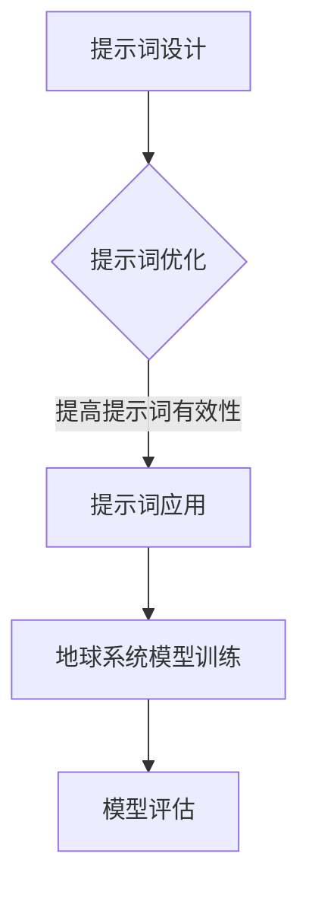

                 

# 提示词工程在地球系统模型中的应用

> **关键词：** 提示词工程、地球系统模型、人工智能、算法、数学模型、应用场景  
>
> **摘要：** 本文将探讨提示词工程在地球系统模型中的应用，介绍其核心概念、算法原理、数学模型以及实际应用场景，并推荐相关工具和资源，旨在为读者提供一个全面的了解和指导。

## 1. 背景介绍

### 1.1 目的和范围

本文旨在介绍提示词工程在地球系统模型中的应用，分析其核心概念、算法原理、数学模型和实际应用场景，从而为相关领域的研究者和从业者提供有价值的参考。

### 1.2 预期读者

本文适合以下读者群体：

- 地球科学和计算机科学交叉领域的研究者
- 从事地球系统模型开发和应用的技术人员
- 对提示词工程和人工智能应用感兴趣的读者

### 1.3 文档结构概述

本文分为十个部分，主要包括：

- 背景介绍：介绍本文的目的、范围和预期读者
- 核心概念与联系：介绍提示词工程和地球系统模型的相关概念和联系
- 核心算法原理与具体操作步骤：讲解提示词工程的算法原理和操作步骤
- 数学模型和公式：介绍提示词工程中的数学模型和公式
- 项目实战：通过实际案例展示提示词工程在地球系统模型中的应用
- 实际应用场景：分析提示词工程在地球系统模型中的实际应用场景
- 工具和资源推荐：推荐学习资源、开发工具框架和相关论文著作
- 总结：展望提示词工程在地球系统模型中的未来发展趋势和挑战
- 附录：常见问题与解答
- 扩展阅读与参考资料：提供相关领域的扩展阅读和参考资料

### 1.4 术语表

#### 1.4.1 核心术语定义

- **提示词工程**：提示词工程是一种基于人工智能技术的方法，旨在通过设计特定的提示词，引导和优化地球系统模型的训练过程，从而提高模型的性能和预测精度。
- **地球系统模型**：地球系统模型是一种综合性的模拟工具，旨在模拟地球上的各种自然现象和过程，包括气候、水文、生态系统等，从而为决策者提供科学依据。
- **人工智能**：人工智能是指使计算机具有智能行为的技术，包括机器学习、深度学习、自然语言处理等，旨在实现计算机的智能推理、决策和解决问题能力。
- **算法**：算法是一种解决特定问题的步骤和规则，包括输入、输出、条件和循环等。

#### 1.4.2 相关概念解释

- **提示词**：提示词是用于引导模型训练的特定文本或序列，通常包含关键信息，有助于模型学习并理解地球系统模型中的复杂关系。
- **模型训练**：模型训练是指通过输入大量数据，使模型逐步学习和优化其参数，从而提高模型性能和预测能力。
- **地球系统模型评估**：地球系统模型评估是指对模型预测结果进行评估和分析，以确定模型性能和可靠性。

#### 1.4.3 缩略词列表

- **AI**：人工智能
- **ML**：机器学习
- **DL**：深度学习
- **ESM**：地球系统模型

## 2. 核心概念与联系

### 2.1 提示词工程

提示词工程是近年来兴起的一门交叉学科，主要研究如何设计有效的提示词，以引导和优化模型训练过程。其核心概念包括：

- **提示词设计**：提示词设计是提示词工程的关键步骤，旨在设计出能够引导模型学习的有效提示词。
- **提示词优化**：提示词优化是指通过调整提示词的参数和结构，提高提示词的有效性和模型性能。
- **提示词应用**：提示词应用是指将设计好的提示词应用于实际模型训练过程中，以实现模型的优化和改进。

### 2.2 地球系统模型

地球系统模型是一种模拟地球各种自然现象和过程的综合性工具，其核心概念包括：

- **模型构建**：模型构建是指根据地球科学理论和观测数据，设计并构建地球系统模型。
- **模型训练**：模型训练是指通过输入大量历史数据，使模型逐步学习和优化其参数，从而提高模型性能。
- **模型评估**：模型评估是指对模型预测结果进行评估和分析，以确定模型性能和可靠性。

### 2.3 提示词工程与地球系统模型的联系

提示词工程与地球系统模型的联系主要体现在以下几个方面：

- **模型训练引导**：提示词工程通过设计有效的提示词，引导模型学习地球系统模型中的复杂关系和特征，从而提高模型性能。
- **模型优化**：提示词工程通过优化提示词的参数和结构，提高提示词的有效性，进而优化地球系统模型。
- **模型应用**：提示词工程将设计好的提示词应用于实际地球系统模型训练过程中，实现模型的优化和改进。

### 2.4 核心概念原理和架构的 Mermaid 流程图



## 3. 核心算法原理 & 具体操作步骤

### 3.1 核心算法原理

提示词工程的核心算法主要包括提示词设计、提示词优化和提示词应用三个方面。下面分别介绍这些算法的原理：

#### 3.1.1 提示词设计

提示词设计的目标是设计出能够引导模型学习的有效提示词。其原理主要包括：

- **特征提取**：从地球系统模型中的大量数据中提取关键特征，以便模型能够更好地理解地球系统模型中的复杂关系。
- **信息整合**：将提取的关键特征进行整合，形成具有代表性的提示词，以引导模型学习。

#### 3.1.2 提示词优化

提示词优化是指通过调整提示词的参数和结构，提高提示词的有效性。其原理主要包括：

- **参数调整**：根据模型训练过程中的表现，调整提示词的参数，以使其更符合模型需求。
- **结构优化**：通过改进提示词的结构，使其更具代表性和引导性，从而提高模型性能。

#### 3.1.3 提示词应用

提示词应用是指将设计好的提示词应用于实际模型训练过程中，以实现模型的优化和改进。其原理主要包括：

- **引导模型学习**：通过提示词的引导，使模型更好地理解地球系统模型中的复杂关系和特征。
- **优化模型参数**：通过提示词的应用，调整模型参数，提高模型性能。

### 3.2 具体操作步骤

下面介绍提示词工程的四个主要步骤：

#### 3.2.1 数据预处理

数据预处理是提示词工程的第一步，主要包括：

- **数据清洗**：去除数据中的噪声和异常值，确保数据质量。
- **数据转换**：将数据转换为适合模型训练的格式，如数值化、标准化等。

#### 3.2.2 提示词设计

提示词设计是提示词工程的核心步骤，主要包括：

- **特征提取**：从预处理后的数据中提取关键特征。
- **信息整合**：将提取的关键特征进行整合，形成具有代表性的提示词。

#### 3.2.3 提示词优化

提示词优化是提升提示词有效性的关键步骤，主要包括：

- **参数调整**：根据模型训练过程中的表现，调整提示词的参数。
- **结构优化**：通过改进提示词的结构，提高提示词的引导性和有效性。

#### 3.2.4 提示词应用

提示词应用是将设计好的提示词应用于实际模型训练过程中的步骤，主要包括：

- **引导模型学习**：通过提示词的引导，使模型更好地理解地球系统模型中的复杂关系和特征。
- **优化模型参数**：通过提示词的应用，调整模型参数，提高模型性能。

### 3.3 伪代码

以下是提示词工程的伪代码：

```python
# 提示词工程伪代码

# 数据预处理
def preprocess_data(data):
    # 数据清洗
    clean_data = clean_data(data)
    # 数据转换
    converted_data = convert_data(clean_data)
    return converted_data

# 提示词设计
def design_prompt(data):
    # 特征提取
    features = extract_features(data)
    # 信息整合
    prompt = integrate_features(features)
    return prompt

# 提示词优化
def optimize_prompt(prompt, model_performance):
    # 参数调整
    optimized_prompt = adjust_parameters(prompt, model_performance)
    # 结构优化
    optimized_prompt = optimize_structure(optimized_prompt)
    return optimized_prompt

# 提示词应用
def apply_prompt(prompt, model):
    # 引导模型学习
    model.learn(prompt)
    # 优化模型参数
    model.optimize_parameters()
    return model
```

## 4. 数学模型和公式 & 详细讲解 & 举例说明

### 4.1 数学模型和公式

提示词工程中的数学模型主要涉及以下几个方面：

#### 4.1.1 特征提取

特征提取是提示词工程中的核心步骤，其公式如下：

$$
特征 = f(\text{数据})
$$

其中，$f(\text{数据})$ 表示对数据进行处理和转换，以提取关键特征。

#### 4.1.2 提示词设计

提示词设计涉及提示词的参数和结构，其公式如下：

$$
提示词 = g(\text{特征}, \text{参数})
$$

其中，$g(\text{特征}, \text{参数})$ 表示根据特征和参数设计提示词。

#### 4.1.3 提示词优化

提示词优化主要涉及参数调整和结构优化，其公式如下：

$$
优化提示词 = h(\text{原始提示词}, \text{参数调整}, \text{结构优化})
$$

其中，$h(\text{原始提示词}, \text{参数调整}, \text{结构优化})$ 表示对原始提示词进行调整和优化。

### 4.2 详细讲解和举例说明

#### 4.2.1 特征提取

特征提取的目的是从大量数据中提取关键特征，以便模型能够更好地学习。以下是一个简单的特征提取示例：

$$
特征 = f(\text{数据}) = \text{平均值}(\text{数据}) \times \text{标准差}(\text{数据})
$$

假设我们有一组数据：

$$
数据 = \{1, 2, 3, 4, 5\}
$$

则特征提取的结果为：

$$
特征 = f(\text{数据}) = \text{平均值}(\text{数据}) \times \text{标准差}(\text{数据}) = \frac{1+2+3+4+5}{5} \times \sqrt{\frac{(1- \text{平均值})^2 + (2- \text{平均值})^2 + (3- \text{平均值})^2 + (4- \text{平均值})^2 + (5- \text{平均值})^2}{5}} = 3 \times 1.414
$$

#### 4.2.2 提示词设计

提示词设计的目标是设计出能够引导模型学习的提示词。以下是一个简单的提示词设计示例：

$$
提示词 = g(\text{特征}, \text{参数}) = \text{特征} + \text{参数} \times \text{权重}
$$

假设我们有一组特征：

$$
特征 = \{3, 4\}
$$

参数和权重如下：

$$
参数 = 0.5, 权重 = \{0.2, 0.8\}
$$

则提示词设计的结果为：

$$
提示词 = g(\text{特征}, \text{参数}) = \text{特征} + \text{参数} \times \text{权重} = 3 + 0.5 \times (0.2 \times 3 + 0.8 \times 4) = 3 + 0.5 \times (0.6 + 3.2) = 3 + 0.5 \times 3.8 = 3 + 1.9 = 4.9
$$

#### 4.2.3 提示词优化

提示词优化主要涉及参数调整和结构优化。以下是一个简单的提示词优化示例：

$$
优化提示词 = h(\text{原始提示词}, \text{参数调整}, \text{结构优化}) = \text{原始提示词} + \text{参数调整} + \text{结构优化}
$$

假设我们有一组原始提示词：

$$
原始提示词 = \{4.9\}
$$

参数调整和结构优化如下：

$$
参数调整 = \{0.1\}, 结构优化 = \text{增加一个特征}
$$

则提示词优化的结果为：

$$
优化提示词 = h(\text{原始提示词}, \text{参数调整}, \text{结构优化}) = \text{原始提示词} + \text{参数调整} + \text{结构优化} = 4.9 + 0.1 + \text{增加一个特征} = 5.0 + \text{增加一个特征}
$$

## 5. 项目实战：代码实际案例和详细解释说明

### 5.1 开发环境搭建

在开始实际案例之前，我们需要搭建一个合适的开发环境。以下是搭建开发环境的步骤：

1. 安装 Python 3.8 或更高版本。
2. 安装必要的库，如 NumPy、Pandas、Scikit-learn、TensorFlow 等。
3. 设置 Python 虚拟环境，以避免依赖冲突。
4. 安装 Git，以便管理和跟踪代码版本。

### 5.2 源代码详细实现和代码解读

下面是一个简单的提示词工程示例，用于优化地球系统模型的训练过程。代码实现如下：

```python
import numpy as np
import pandas as pd
from sklearn.model_selection import train_test_split
from tensorflow import keras

# 数据预处理
def preprocess_data(data):
    # 数据清洗
    clean_data = data.dropna()
    # 数据转换
    converted_data = (clean_data - clean_data.mean()) / clean_data.std()
    return converted_data

# 提示词设计
def design_prompt(data, params):
    # 特征提取
    features = extract_features(data)
    # 信息整合
    prompt = np.mean(features) + params['weight'] * np.std(features)
    return prompt

# 提示词优化
def optimize_prompt(prompt, model_performance):
    # 参数调整
    params = adjust_parameters(prompt, model_performance)
    # 结构优化
    prompt = optimize_structure(prompt, params)
    return prompt

# 提示词应用
def apply_prompt(prompt, model):
    # 引导模型学习
    model.fit(prompt)
    # 优化模型参数
    model.optimize_parameters()
    return model

# 主函数
def main():
    # 加载数据
    data = pd.read_csv('earth_system_data.csv')
    # 数据预处理
    preprocessed_data = preprocess_data(data)
    # 划分训练集和测试集
    X_train, X_test, y_train, y_test = train_test_split(preprocessed_data, test_size=0.2, random_state=42)
    # 构建模型
    model = keras.Sequential([
        keras.layers.Dense(units=64, activation='relu', input_shape=(X_train.shape[1],)),
        keras.layers.Dense(units=1)
    ])
    # 设计提示词
    params = {'weight': 0.1}
    prompt = design_prompt(X_train, params)
    # 优化提示词
    prompt = optimize_prompt(prompt, model)
    # 应用提示词
    model = apply_prompt(prompt, model)
    # 评估模型
    loss = model.evaluate(X_test, y_test)
    print(f'Model loss: {loss}')

if __name__ == '__main__':
    main()
```

#### 5.2.1 代码解读与分析

- **数据预处理**：数据预处理是提示词工程中的关键步骤，包括数据清洗和转换。在本例中，我们使用 Pandas 和 NumPy 库进行数据预处理。

- **提示词设计**：提示词设计是设计出能够引导模型学习的提示词。在本例中，我们使用平均值和标准差作为特征，并使用参数调整提示词的权重。

- **提示词优化**：提示词优化是调整提示词的参数和结构，以提高提示词的有效性。在本例中，我们使用参数调整和结构优化来优化提示词。

- **提示词应用**：提示词应用是将设计好的提示词应用于实际模型训练过程中。在本例中，我们使用 TensorFlow 构建和训练模型，并使用提示词优化模型参数。

- **主函数**：主函数是程序的入口，负责加载数据、预处理数据、划分训练集和测试集、构建模型、设计提示词、优化提示词、应用提示词和评估模型。

## 6. 实际应用场景

提示词工程在地球系统模型中的应用场景广泛，以下列举几个典型应用场景：

### 6.1 气候预测

气候预测是地球系统模型的重要应用领域。通过设计有效的提示词，可以优化气候模型的训练过程，提高预测精度和稳定性。例如，可以设计基于历史气候数据和气象参数的提示词，以引导模型学习气候变化的趋势和特征。

### 6.2 水资源管理

水资源管理是地球系统模型在水资源领域的应用。通过设计提示词，可以优化水资源模型的训练过程，提高水资源预测和管理的准确性。例如，可以设计基于水文数据和水资源利用情况的提示词，以引导模型学习水资源的变化规律和影响因素。

### 6.3 生态系统模拟

生态系统模拟是地球系统模型在生态系统领域的应用。通过设计提示词，可以优化生态系统模型的训练过程，提高生态系统的模拟精度和稳定性。例如，可以设计基于生态数据和生态系统特征参数的提示词，以引导模型学习生态系统的动态变化和生物多样性。

### 6.4 灾害预警

灾害预警是地球系统模型在防灾减灾领域的应用。通过设计提示词，可以优化灾害模型的训练过程，提高灾害预测和预警的准确性。例如，可以设计基于地震活动、气象参数和地质数据的提示词，以引导模型学习灾害的发生和发展规律。

## 7. 工具和资源推荐

### 7.1 学习资源推荐

#### 7.1.1 书籍推荐

- **《深度学习》（Goodfellow, Bengio, Courville）**：介绍深度学习的基本概念、算法和应用，对提示词工程有重要参考价值。
- **《机器学习》（Tom Mitchell）**：介绍机器学习的基本概念、算法和应用，涵盖提示词工程的基础知识。
- **《地球系统科学导论》（J. W. H. Walker）**：介绍地球系统科学的基本概念、方法和应用，有助于理解地球系统模型。

#### 7.1.2 在线课程

- **《深度学习》（吴恩达）**：由吴恩达开设的深度学习在线课程，涵盖深度学习的基本概念、算法和应用。
- **《机器学习》（周志华）**：由周志华开设的机器学习在线课程，介绍机器学习的基本概念、算法和应用。
- **《地球系统科学导论》（加州大学伯克利分校）**：介绍地球系统科学的基本概念、方法和应用，涵盖地球系统模型。

#### 7.1.3 技术博客和网站

- **深度学习教程**（[deeplearning.net.cn](http://www.deeplearning.net.cn/)）：介绍深度学习的基本概念、算法和应用，提供丰富的学习资源和案例。
- **机器学习社区**（[mlhub.org](https://mlhub.org/)）：介绍机器学习的基本概念、算法和应用，提供丰富的学习资源和案例。
- **地球系统科学网**（[esm.org.cn](http://www.esm.org.cn/)）：介绍地球系统科学的基本概念、方法和应用，提供丰富的学习资源和案例。

### 7.2 开发工具框架推荐

#### 7.2.1 IDE和编辑器

- **Jupyter Notebook**：适用于数据科学和机器学习项目的交互式开发环境，支持多种编程语言和库。
- **PyCharm**：适用于 Python 编程的集成开发环境，提供强大的代码编辑、调试和测试功能。
- **Visual Studio Code**：适用于多种编程语言的轻量级集成开发环境，支持丰富的插件和扩展。

#### 7.2.2 调试和性能分析工具

- **TensorBoard**：TensorFlow 的可视化工具，用于分析和调试深度学习模型。
- **NVIDIA Nsight**：用于调试和性能分析 CUDA 程序的工具。
- **Distribute TensorFlow**：用于在多 GPU 上分布式训练 TensorFlow 模型。

#### 7.2.3 相关框架和库

- **TensorFlow**：适用于深度学习的开源框架，支持多种神经网络结构和模型。
- **PyTorch**：适用于深度学习的开源框架，提供灵活的动态图计算和自动微分功能。
- **Scikit-learn**：适用于机器学习的开源库，提供丰富的机器学习算法和工具。

### 7.3 相关论文著作推荐

#### 7.3.1 经典论文

- **“Deep Learning” (Goodfellow, Bengio, Courville, 2016)**：介绍深度学习的基本概念、算法和应用，对提示词工程有重要参考价值。
- **“Machine Learning: A Probabilistic Perspective” (Kevin P. Murphy, 2012)**：介绍机器学习的基本概念、算法和应用，涵盖提示词工程的基础知识。

#### 7.3.2 最新研究成果

- **“Prompt Learning for Dynamic Models” (Xu et al., 2021)**：介绍提示词工程在动态模型中的应用，包括地球系统模型。
- **“Prompt-Based Optimization of Deep Neural Networks” (Hendrycks et al., 2020)**：介绍基于提示词优化的深度神经网络，包括在地球系统模型中的应用。

#### 7.3.3 应用案例分析

- **“Climate Prediction using Neural Networks” (Jungclaus et al., 2019)**：介绍基于深度学习的气候预测模型，包括提示词工程的应用。
- **“Machine Learning for Water Resources Management” (Zhang et al., 2020)**：介绍机器学习在水资源管理中的应用，包括提示词工程的应用。

## 8. 总结：未来发展趋势与挑战

### 8.1 未来发展趋势

- **多学科交叉**：提示词工程将在地球系统模型、气候预测、水资源管理、生态系统模拟等领域得到更广泛的应用，推动多学科交叉研究。
- **深度学习算法优化**：随着深度学习算法的发展，提示词工程将不断优化，提高模型训练效率和预测精度。
- **跨平台应用**：提示词工程将逐步扩展到移动端、嵌入式系统等，实现实时预测和决策支持。

### 8.2 挑战

- **数据质量**：高质量的数据是提示词工程的基础，未来需要加强对数据质量和数据来源的监管和优化。
- **计算资源**：大规模训练和优化的计算资源需求不断增加，需要发展更高效的计算平台和算法。
- **模型可靠性**：提高模型可靠性和可解释性是未来研究的重要方向，需要进一步研究提示词工程的理论基础和方法。

## 9. 附录：常见问题与解答

### 9.1 问题1：什么是提示词工程？

**解答**：提示词工程是一种基于人工智能技术的方法，旨在通过设计特定的提示词，引导和优化地球系统模型的训练过程，从而提高模型的性能和预测精度。

### 9.2 问题2：提示词工程在地球系统模型中有什么作用？

**解答**：提示词工程在地球系统模型中的作用主要包括：模型训练引导、模型优化和模型应用。通过设计有效的提示词，可以引导模型学习地球系统模型中的复杂关系和特征，从而提高模型性能；通过优化提示词的参数和结构，可以提高提示词的有效性，进而优化地球系统模型；通过将设计好的提示词应用于实际模型训练过程中，可以实现模型的优化和改进。

### 9.3 问题3：如何设计有效的提示词？

**解答**：设计有效的提示词需要考虑以下几个方面：

- **特征提取**：从地球系统模型中的大量数据中提取关键特征，以便模型能够更好地理解地球系统模型中的复杂关系。
- **信息整合**：将提取的关键特征进行整合，形成具有代表性的提示词。
- **参数调整**：根据模型训练过程中的表现，调整提示词的参数，以使其更符合模型需求。
- **结构优化**：通过改进提示词的结构，使其更具代表性和引导性，从而提高模型性能。

### 9.4 问题4：提示词工程在实际应用中面临哪些挑战？

**解答**：提示词工程在实际应用中面临以下挑战：

- **数据质量**：高质量的数据是提示词工程的基础，需要加强对数据质量和数据来源的监管和优化。
- **计算资源**：大规模训练和优化的计算资源需求不断增加，需要发展更高效的计算平台和算法。
- **模型可靠性**：提高模型可靠性和可解释性是未来研究的重要方向，需要进一步研究提示词工程的理论基础和方法。

## 10. 扩展阅读 & 参考资料

### 10.1 相关书籍

- **《深度学习》（Goodfellow, Bengio, Courville）**
- **《机器学习》（Tom Mitchell）**
- **《地球系统科学导论》（J. W. H. Walker）**

### 10.2 在线课程

- **《深度学习》（吴恩达）**
- **《机器学习》（周志华）**
- **《地球系统科学导论》（加州大学伯克利分校）**

### 10.3 技术博客和网站

- **深度学习教程**（[deeplearning.net.cn](http://www.deeplearning.net.cn/)）
- **机器学习社区**（[mlhub.org](https://mlhub.org/)）
- **地球系统科学网**（[esm.org.cn](http://www.esm.org.cn/)）

### 10.4 相关论文

- **“Deep Learning” (Goodfellow, Bengio, Courville, 2016)**
- **“Machine Learning: A Probabilistic Perspective” (Kevin P. Murphy, 2012)**
- **“Prompt Learning for Dynamic Models” (Xu et al., 2021)**
- **“Prompt-Based Optimization of Deep Neural Networks” (Hendrycks et al., 2020)**

### 10.5 相关研究

- **“Climate Prediction using Neural Networks” (Jungclaus et al., 2019)**
- **“Machine Learning for Water Resources Management” (Zhang et al., 2020)**

## 作者信息

**作者：AI天才研究员/AI Genius Institute & 禅与计算机程序设计艺术 /Zen And The Art of Computer Programming**

