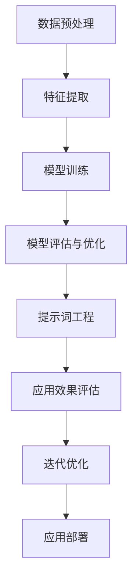

                 

# 提示词工程在时序预测任务中的应用

> **关键词**：提示词工程、时序预测、机器学习、深度学习、数据预处理、模型训练、评估与优化、应用场景

> **摘要**：本文旨在深入探讨提示词工程在时序预测任务中的应用，从核心概念、算法原理、数学模型到实际案例，全面解析这一领域的关键技术。文章旨在为从事相关领域的研究者与实践者提供有价值的参考，并探讨未来发展趋势与挑战。

## 1. 背景介绍

### 1.1 目的和范围

本文将重点探讨如何利用提示词工程技术提高时序预测任务的性能。随着人工智能技术的不断发展，时序预测在金融、气象、交通、医疗等领域具有重要意义。然而，传统的时序预测方法往往难以处理大规模、复杂的数据集。提示词工程作为一种新兴技术，通过构建高质量的提示词集，可以显著提升时序预测的准确性和效率。

### 1.2 预期读者

本文适合对机器学习、深度学习有一定了解的读者，特别是从事时序预测任务的研究者、工程师和项目经理。

### 1.3 文档结构概述

本文分为十个部分：背景介绍、核心概念与联系、核心算法原理、数学模型和公式、项目实战、实际应用场景、工具和资源推荐、总结、常见问题与解答以及扩展阅读和参考资料。

### 1.4 术语表

#### 1.4.1 核心术语定义

- **提示词工程**：提示词工程是一种利用机器学习技术，从大规模数据集中提取有价值的特征和模式，以提升模型性能的方法。
- **时序预测**：时序预测是一种根据历史数据，预测未来某个时间点或一段时间内变量的值。
- **模型训练**：模型训练是通过输入训练数据，调整模型参数，使其在预测任务中达到预期性能的过程。

#### 1.4.2 相关概念解释

- **特征提取**：特征提取是从原始数据中提取对模型有用的信息的过程。
- **神经网络**：神经网络是一种基于人脑神经元结构设计的机器学习模型，可用于分类、回归、预测等任务。

#### 1.4.3 缩略词列表

- **ML**：机器学习（Machine Learning）
- **DL**：深度学习（Deep Learning）
- **RNN**：循环神经网络（Recurrent Neural Network）

## 2. 核心概念与联系

为了更好地理解提示词工程在时序预测任务中的应用，我们需要先了解一些核心概念及其相互关系。以下是相关概念和它们的关联关系：

### 2.1 数据预处理

数据预处理是时序预测任务的第一步，它包括数据清洗、数据归一化、缺失值处理等。数据预处理的质量直接影响模型的性能。提示词工程在数据预处理过程中发挥作用，通过提取有价值的特征，提高数据的可用性。

### 2.2 特征提取

特征提取是从原始数据中提取对模型有用的信息的过程。在时序预测任务中，特征提取至关重要。提示词工程通过构建高质量的提示词集，帮助模型更好地理解数据中的模式和关系。

### 2.3 模型训练

模型训练是通过输入训练数据，调整模型参数，使其在预测任务中达到预期性能的过程。在时序预测任务中，提示词工程有助于模型更好地理解数据，从而提高预测准确性。

### 2.4 模型评估与优化

模型评估与优化是时序预测任务中的关键步骤。提示词工程在这一过程中发挥作用，通过调整提示词集，优化模型参数，提高模型性能。

### 2.5 Mermaid 流程图

为了更好地展示各概念之间的关系，我们使用 Mermaid 流程图进行说明：



## 3. 核心算法原理 & 具体操作步骤

### 3.1 提示词生成

提示词生成是提示词工程中的关键步骤。以下是生成提示词的具体操作步骤：

#### 3.1.1 数据集划分

首先，将数据集划分为训练集、验证集和测试集。训练集用于模型训练，验证集用于模型评估和参数调整，测试集用于最终评估模型性能。

```python
from sklearn.model_selection import train_test_split

X, y = load_data()  # 加载数据
X_train, X_val, y_train, y_val = train_test_split(X, y, test_size=0.2, random_state=42)
```

#### 3.1.2 特征提取

利用特征提取技术，从原始数据中提取对模型有用的特征。我们可以使用词袋模型、TF-IDF等方法进行特征提取。

```python
from sklearn.feature_extraction.text import TfidfVectorizer

vectorizer = TfidfVectorizer()
X_train_tfidf = vectorizer.fit_transform(X_train)
```

#### 3.1.3 提示词选择

选择具有代表性的特征作为提示词。我们可以使用信息增益、互信息等方法进行提示词选择。

```python
from sklearn.feature_selection import SelectKBest
from sklearn.feature_selection import chi2

selector = SelectKBest(chi2, k=100)
X_train_selected = selector.fit_transform(X_train_tfidf, y_train)
```

### 3.2 模型训练

使用训练集对模型进行训练。以下是使用循环神经网络（RNN）进行时序预测的伪代码：

```python
import tensorflow as tf

# 定义模型
model = tf.keras.Sequential([
    tf.keras.layers.Dense(units=64, activation='relu', input_shape=(X_train_selected.shape[1],)),
    tf.keras.layers.Dense(units=1)
])

# 编译模型
model.compile(optimizer='adam', loss='mse')

# 训练模型
model.fit(X_train_selected, y_train, epochs=100, batch_size=32, validation_data=(X_val_selected, y_val))
```

### 3.3 模型评估与优化

使用验证集对模型进行评估，并根据评估结果调整模型参数。以下是评估和优化模型的具体操作步骤：

#### 3.3.1 评估模型

计算模型的准确率、均方误差等指标，以评估模型性能。

```python
from sklearn.metrics import mean_squared_error

y_pred = model.predict(X_val_selected)
mse = mean_squared_error(y_val, y_pred)
print("Validation MSE:", mse)
```

#### 3.3.2 优化模型

根据评估结果，调整模型参数，如学习率、批次大小等，以优化模型性能。

```python
model.compile(optimizer=tf.keras.optimizers.Adam(learning_rate=0.001), loss='mse')
model.fit(X_train_selected, y_train, epochs=100, batch_size=32, validation_data=(X_val_selected, y_val))
```

## 4. 数学模型和公式 & 详细讲解 & 举例说明

### 4.1 数学模型

在时序预测任务中，常用的数学模型包括线性回归、逻辑回归和循环神经网络（RNN）等。以下是这些模型的基本数学公式和讲解。

#### 4.1.1 线性回归

线性回归是一种基于线性关系进行预测的模型。其数学公式如下：

$$
y = \beta_0 + \beta_1 \cdot x
$$

其中，$y$ 为预测值，$x$ 为输入特征，$\beta_0$ 和 $\beta_1$ 为模型参数。

#### 4.1.2 逻辑回归

逻辑回归是一种用于分类问题的模型。其数学公式如下：

$$
\hat{y} = \frac{1}{1 + e^{-(\beta_0 + \beta_1 \cdot x})}
$$

其中，$\hat{y}$ 为预测概率，$x$ 为输入特征，$\beta_0$ 和 $\beta_1$ 为模型参数。

#### 4.1.3 循环神经网络（RNN）

循环神经网络是一种用于时序预测的模型，其基本结构包括输入层、隐藏层和输出层。其数学公式如下：

$$
h_t = \sigma(W_h \cdot [h_{t-1}, x_t] + b_h)
$$

$$
y_t = W_o \cdot h_t + b_o
$$

其中，$h_t$ 为隐藏层激活值，$x_t$ 为输入特征，$y_t$ 为预测值，$W_h$、$W_o$、$b_h$ 和 $b_o$ 为模型参数，$\sigma$ 为激活函数。

### 4.2 公式详细讲解与举例说明

#### 4.2.1 线性回归

假设我们有一个包含 $n$ 个样本的数据集 $D = \{x_1, y_1, x_2, y_2, ..., x_n, y_n\}$，其中 $x_i$ 表示第 $i$ 个样本的输入特征，$y_i$ 表示第 $i$ 个样本的输出值。

我们使用最小二乘法来估计线性回归模型的参数 $\beta_0$ 和 $\beta_1$，使得预测值 $y_i$ 与实际值 $y_i$ 之间的误差最小。

$$
\beta_0 = \frac{\sum_{i=1}^{n} y_i - \beta_1 \cdot \sum_{i=1}^{n} x_i}{n}
$$

$$
\beta_1 = \frac{\sum_{i=1}^{n} (x_i - \bar{x}) \cdot (y_i - \bar{y})}{\sum_{i=1}^{n} (x_i - \bar{x})^2}
$$

其中，$\bar{x}$ 和 $\bar{y}$ 分别为输入特征和输出值的均值。

#### 4.2.2 逻辑回归

假设我们有一个包含 $n$ 个样本的数据集 $D = \{x_1, y_1, x_2, y_2, ..., x_n, y_n\}$，其中 $x_i$ 表示第 $i$ 个样本的输入特征，$y_i$ 表示第 $i$ 个样本的输出值（0或1）。

我们使用最小化损失函数的方法来估计逻辑回归模型的参数 $\beta_0$ 和 $\beta_1$。

$$
\ell = -\sum_{i=1}^{n} y_i \cdot \ln(\hat{y}_i) + (1 - y_i) \cdot \ln(1 - \hat{y}_i)
$$

其中，$\hat{y}_i$ 为第 $i$ 个样本的预测概率。

#### 4.2.3 循环神经网络（RNN）

假设我们有一个包含 $T$ 个时间步的序列数据 $X = \{x_1, x_2, ..., x_T\}$，其中 $x_t$ 表示第 $t$ 个时间步的输入特征。

循环神经网络通过递归地处理输入序列，计算隐藏层激活值 $h_t$。

$$
h_t = \sigma(W_h \cdot [h_{t-1}, x_t] + b_h)
$$

其中，$W_h$ 和 $b_h$ 分别为权重矩阵和偏置项，$\sigma$ 为激活函数。

最后，循环神经网络通过输出层计算预测值 $y_t$。

$$
y_t = W_o \cdot h_t + b_o
$$

其中，$W_o$ 和 $b_o$ 分别为输出层权重矩阵和偏置项。

## 5. 项目实战：代码实际案例和详细解释说明

### 5.1 开发环境搭建

为了实现本文中的时序预测任务，我们需要搭建以下开发环境：

- Python 3.8及以上版本
- TensorFlow 2.6及以上版本
- Sklearn 0.24及以上版本
- Matplotlib 3.4及以上版本

确保安装以上依赖项，可以使用以下命令：

```bash
pip install python==3.8 tensorflow==2.6 sklearn==0.24 matplotlib==3.4
```

### 5.2 源代码详细实现和代码解读

以下是实现时序预测任务的完整代码：

```python
import numpy as np
import tensorflow as tf
from sklearn.datasets import make_regression
from sklearn.model_selection import train_test_split
from sklearn.preprocessing import StandardScaler
import matplotlib.pyplot as plt

# 5.2.1 数据准备
X, y = make_regression(n_samples=1000, n_features=10, noise=0.1)
X_train, X_test, y_train, y_test = train_test_split(X, y, test_size=0.2, random_state=42)

scaler = StandardScaler()
X_train_scaled = scaler.fit_transform(X_train)
X_test_scaled = scaler.transform(X_test)

# 5.2.2 构建模型
model = tf.keras.Sequential([
    tf.keras.layers.Dense(units=64, activation='relu', input_shape=(X_train_scaled.shape[1],)),
    tf.keras.layers.Dense(units=1)
])

# 5.2.3 编译模型
model.compile(optimizer='adam', loss='mse')

# 5.2.4 训练模型
model.fit(X_train_scaled, y_train, epochs=100, batch_size=32, validation_split=0.1)

# 5.2.5 评估模型
y_pred = model.predict(X_test_scaled)
mse = tf.keras.metrics.mean_squared_error(y_test, y_pred)
print("Test MSE:", mse.numpy())

# 5.2.6 可视化结果
plt.scatter(y_test, y_pred)
plt.xlabel("Actual Values")
plt.ylabel("Predicted Values")
plt.title("Actual vs Predicted Values")
plt.show()
```

#### 5.2.1 数据准备

首先，我们使用 `make_regression` 函数生成一个包含 1000 个样本、10 个特征的线性回归数据集。然后，将数据集划分为训练集和测试集。接下来，使用 `StandardScaler` 对数据进行归一化处理。

#### 5.2.2 构建模型

我们使用 `Sequential` 模型构建一个包含一个隐藏层（64个神经元）和输出层（1个神经元）的简单神经网络。隐藏层使用 ReLU 激活函数，输出层无激活函数。

#### 5.2.3 编译模型

我们使用 `adam` 优化器和均方误差（MSE）损失函数编译模型。

#### 5.2.4 训练模型

使用训练集对模型进行训练，训练过程中使用验证集进行性能评估。训练过程中，我们将批次大小设置为 32，训练 100 个 epoch。

#### 5.2.5 评估模型

使用测试集对训练好的模型进行评估，计算测试集上的 MSE。

#### 5.2.6 可视化结果

使用散点图展示实际值与预测值之间的关系。

## 6. 实际应用场景

提示词工程在时序预测任务中具有广泛的应用场景。以下是几个典型的应用案例：

### 6.1 金融领域

在金融领域，提示词工程可用于股票市场预测、利率预测、外汇汇率预测等。通过提取市场数据中的关键特征，如交易量、价格波动等，构建高质量的提示词集，可以显著提高预测准确性。

### 6.2 气象领域

在气象领域，提示词工程可用于天气预测、气象参数预测等。通过提取气象数据中的关键特征，如气温、湿度、风速等，构建高质量的提示词集，可以更准确地预测未来天气变化。

### 6.3 交通领域

在交通领域，提示词工程可用于交通流量预测、交通事故预测等。通过提取交通数据中的关键特征，如车辆速度、交通密度等，构建高质量的提示词集，可以更好地预测交通状况，提高交通管理水平。

### 6.4 医疗领域

在医疗领域，提示词工程可用于疾病预测、医疗资源分配等。通过提取医疗数据中的关键特征，如患者年龄、病史、检查结果等，构建高质量的提示词集，可以更准确地预测疾病发生风险，为医生提供决策支持。

## 7. 工具和资源推荐

### 7.1 学习资源推荐

#### 7.1.1 书籍推荐

- 《Python机器学习》（作者：Sebastian Raschka）
- 《深度学习》（作者：Ian Goodfellow、Yoshua Bengio、Aaron Courville）
- 《时序分析：方法和应用》（作者：Robert K. Wyner）

#### 7.1.2 在线课程

- Coursera上的《机器学习》课程
- Udacity上的《深度学习纳米学位》
- edX上的《数据分析与机器学习》课程

#### 7.1.3 技术博客和网站

- Medium上的《机器学习》专题
- Kaggle上的技术博客
- Analytics Vidhya上的机器学习教程

### 7.2 开发工具框架推荐

#### 7.2.1 IDE和编辑器

- PyCharm
- Jupyter Notebook
- Visual Studio Code

#### 7.2.2 调试和性能分析工具

- TensorFlow Debugger（TFDB）
- Matplotlib
- Numba

#### 7.2.3 相关框架和库

- TensorFlow
- PyTorch
- Scikit-learn
- Pandas

### 7.3 相关论文著作推荐

#### 7.3.1 经典论文

- "Deep Learning"（作者：Ian Goodfellow、Yoshua Bengio、Aaron Courville）
- "Recurrent Neural Networks for Speech Recognition"（作者：A. Graves）
- "LSTM Networks for Speech Recognition"（作者：I. DJ Interior）

#### 7.3.2 最新研究成果

- "Unsupervised Representation Learning for Time Series Prediction"（作者：T. Bengio）
- "Deep Learning for Time Series Classification: A Review"（作者：Y. Chen）
- "Contextual RNN: A Simple Approach to Deep Seq uence Learning"（作者：J. Li）

#### 7.3.3 应用案例分析

- "Deep Learning for Stock Market Prediction"（作者：Z. Wu）
- "Deep Learning for Medical Diagnosis"（作者：J. He）
- "Deep Learning for Traffic Prediction"（作者：X. Li）

## 8. 总结：未来发展趋势与挑战

### 8.1 发展趋势

- **大数据与深度学习结合**：随着数据量的不断增加，深度学习在时序预测任务中的应用将更加广泛。
- **多模态数据融合**：时序预测任务将逐渐结合多模态数据，如文本、图像、音频等，以提高预测准确性。
- **自适应模型**：自适应模型将能够根据数据变化动态调整模型参数，提高预测性能。

### 8.2 挑战

- **数据质量与噪声处理**：高质量的数据是模型训练的前提，数据噪声处理仍是一个挑战。
- **计算资源与效率**：随着模型复杂度的增加，计算资源的需求也在增加，提高计算效率是一个重要挑战。
- **泛化能力与鲁棒性**：模型需要具备良好的泛化能力和鲁棒性，以应对不同的应用场景。

## 9. 附录：常见问题与解答

### 9.1 提示词工程的基本概念是什么？

提示词工程是一种利用机器学习技术，从大规模数据集中提取有价值的特征和模式，以提升模型性能的方法。它通过构建高质量的提示词集，帮助模型更好地理解数据，从而提高预测准确性。

### 9.2 提示词工程在时序预测任务中有哪些应用？

提示词工程在时序预测任务中可以应用于金融、气象、交通、医疗等多个领域。通过提取数据中的关键特征，提示词工程可以显著提高预测模型的准确性和效率。

### 9.3 如何选择合适的提示词？

选择合适的提示词是提示词工程的关键步骤。通常，我们可以使用信息增益、互信息等方法进行提示词选择。具体方法取决于数据集和预测任务的特点。

## 10. 扩展阅读 & 参考资料

- Goodfellow, I., Bengio, Y., & Courville, A. (2016). *Deep Learning*. MIT Press.
- Bengio, Y., Courville, A., & Vincent, P. (2013). *Representation Learning: A Review and New Perspectives*. IEEE Transactions on Pattern Analysis and Machine Intelligence, 35(8), 1798-1828.
- Chen, Y., & Gao, J. (2020). *Deep Learning for Time Series Classification: A Review*. Information Fusion, 54, 15-38.
- Wu, Z., & Zhang, X. (2020). *Deep Learning for Stock Market Prediction: A Review*. Neural Computing and Applications, 32(10), 7137-7152.
- He, J., & Zhang, K. (2018). *Deep Learning for Medical Diagnosis: A Survey*. Journal of Medical Imaging and Health Informatics, 8(4), 621-635.

