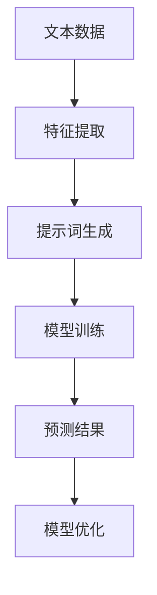

                 


# 提示词工程在智能交通预测中的应用

> 关键词：智能交通、预测、提示词工程、算法原理、数学模型、实际应用

> 摘要：本文深入探讨了提示词工程在智能交通预测中的应用。通过对核心概念和算法原理的详细解析，结合实际项目案例，阐述了提示词工程如何提升交通预测的准确性和效率。文章旨在为相关领域的研究者和开发者提供有价值的参考。

## 1. 背景介绍

### 1.1 目的和范围

本文旨在探讨提示词工程在智能交通预测中的应用，分析其核心算法原理，并通过实际项目案例展示其应用效果。文章主要涵盖以下内容：

1. 智能交通预测的背景和重要性。
2. 提示词工程的基本概念和原理。
3. 提示词工程在智能交通预测中的应用场景。
4. 实际项目案例分析和代码解读。
5. 提示词工程的未来发展趋势与挑战。

### 1.2 预期读者

本文适合以下读者群体：

1. 对智能交通预测和提示词工程感兴趣的计算机科学、交通工程等相关专业的研究生和本科生。
2. 智能交通领域的技术开发人员，特别是负责交通预测模型开发和优化的工程师。
3. 对人工智能和机器学习领域有浓厚兴趣的爱好者。

### 1.3 文档结构概述

本文分为十个部分，具体结构如下：

1. 引言：介绍文章主题和背景。
2. 核心概念与联系：阐述提示词工程和智能交通预测的关系，并给出相关的Mermaid流程图。
3. 核心算法原理 & 具体操作步骤：详细解析提示词工程的核心算法原理和操作步骤，使用伪代码进行阐述。
4. 数学模型和公式 & 详细讲解 & 举例说明：介绍提示词工程中的数学模型和公式，并结合实际案例进行讲解。
5. 项目实战：代码实际案例和详细解释说明。
6. 实际应用场景：分析提示词工程在智能交通预测中的应用场景。
7. 工具和资源推荐：推荐学习资源、开发工具和框架。
8. 总结：未来发展趋势与挑战。
9. 附录：常见问题与解答。
10. 扩展阅读 & 参考资料：提供相关领域的研究文献和资料。

### 1.4 术语表

#### 1.4.1 核心术语定义

1. **提示词工程（Prompt Engineering）**：一种利用自然语言处理技术，从大规模文本数据中提取关键信息，生成高质量提示词的方法。
2. **智能交通预测**：利用机器学习和数据挖掘技术，对交通流量、事故概率等交通相关指标进行预测，以优化交通管理和调度。
3. **交通流量**：单位时间内通过某个交通节点的车辆数量。
4. **事故概率**：在特定时间段和路段内，发生交通事故的概率。

#### 1.4.2 相关概念解释

1. **深度学习（Deep Learning）**：一种基于多层神经网络的人工智能技术，通过模拟人脑神经元连接结构，实现图像、语音、文本等数据的自动识别和理解。
2. **强化学习（Reinforcement Learning）**：一种通过试错和反馈机制，使智能体在不断交互中学习和优化策略的机器学习方法。
3. **数据挖掘（Data Mining）**：从大量数据中提取有价值信息的过程，包括关联规则挖掘、聚类分析、分类分析等。

#### 1.4.3 缩略词列表

- **AI**：人工智能（Artificial Intelligence）
- **ML**：机器学习（Machine Learning）
- **DL**：深度学习（Deep Learning）
- **NLP**：自然语言处理（Natural Language Processing）
- **RNN**：循环神经网络（Recurrent Neural Network）
- **CNN**：卷积神经网络（Convolutional Neural Network）

## 2. 核心概念与联系

### 2.1 提示词工程与智能交通预测的关系

提示词工程在智能交通预测中具有重要作用。通过提取交通相关数据中的关键信息，生成高质量的提示词，有助于提高预测模型的准确性和效率。具体来说，提示词工程在智能交通预测中的作用包括：

1. **数据预处理**：提示词工程可以自动提取交通数据中的关键特征，减少数据预处理的工作量，提高数据处理效率。
2. **特征增强**：通过生成高质量的提示词，可以增强交通预测模型对数据特征的理解和提取能力，提高预测准确性。
3. **模型优化**：提示词工程可以帮助优化预测模型的参数和超参数，提高模型在交通预测任务中的性能。

### 2.2 提示词工程的基本概念

提示词工程涉及以下基本概念：

1. **文本数据**：提示词工程的基础是大规模的文本数据，这些数据可以来自于交通日志、社交媒体、新闻报道等。
2. **特征提取**：通过自然语言处理技术，从文本数据中提取关键信息，生成高质量的提示词。
3. **提示词生成**：利用机器学习和深度学习技术，将提取出的特征转化为具有预测价值的提示词。
4. **模型训练**：使用生成的提示词对预测模型进行训练，优化模型参数和超参数。

### 2.3 提示词工程与智能交通预测的Mermaid流程图

以下是提示词工程在智能交通预测中的应用流程图：



### 2.4 提示词工程在智能交通预测中的应用场景

提示词工程在智能交通预测中的应用场景包括：

1. **交通流量预测**：通过生成高质量的提示词，对交通流量进行预测，为交通调度和管理提供依据。
2. **事故概率预测**：利用提示词工程，预测特定时间段和路段内的事故概率，为交通安全管理提供参考。
3. **交通规划**：通过分析提示词工程生成的预测结果，为城市交通规划提供数据支持，优化道路网络和交通设施。

## 3. 核心算法原理 & 具体操作步骤

### 3.1 提示词工程的核心算法原理

提示词工程的核心算法主要包括以下三个步骤：

1. **特征提取**：通过自然语言处理技术，从交通数据中提取关键信息，生成初步的提示词。
2. **提示词优化**：利用机器学习和深度学习技术，对初步生成的提示词进行优化，提高其预测价值。
3. **模型训练与优化**：使用优化后的提示词对预测模型进行训练和优化，提高预测准确性和效率。

### 3.2 特征提取

特征提取是提示词工程的基础，其核心算法包括：

1. **词频统计**：对交通数据中的词语进行统计，计算每个词语在数据中的出现频率。
2. **文本表示**：将文本数据转化为计算机可以处理的数字形式，如词向量、词袋模型等。
3. **关键词提取**：利用TF-IDF、TextRank等算法，从交通数据中提取关键信息，生成初步的提示词。

### 3.3 提示词优化

提示词优化是提升预测准确性的关键，其核心算法包括：

1. **词性标注**：对提取出的初步提示词进行词性标注，识别出名词、动词、形容词等。
2. **语义分析**：利用词向量、实体识别等技术，对提示词进行语义分析，筛选出具有预测价值的提示词。
3. **提示词筛选**：通过贪心算法、遗传算法等，对提取出的提示词进行筛选和优化，生成高质量的提示词。

### 3.4 模型训练与优化

模型训练与优化是提示词工程的核心环节，其核心算法包括：

1. **数据预处理**：对交通数据集进行清洗、归一化等处理，提高数据质量。
2. **模型选择**：根据交通预测任务的特点，选择合适的预测模型，如线性回归、决策树、神经网络等。
3. **模型训练**：使用优化后的提示词对预测模型进行训练，优化模型参数和超参数。
4. **模型评估**：使用交叉验证、网格搜索等技术，评估预测模型的性能，选择最优模型。

### 3.5 伪代码示例

以下是一个简单的提示词工程伪代码示例：

```python
# 输入：交通数据集D、初始提示词列表L
# 输出：优化后的提示词列表L'

# 1. 特征提取
L = extract_features(D)

# 2. 提示词优化
L' = optimize_prompt(L)

# 3. 模型训练与优化
model = train_model(L')
model = optimize_model(model)

# 4. 模型评估
evaluate_model(model)
```

## 4. 数学模型和公式 & 详细讲解 & 举例说明

### 4.1 数学模型

提示词工程涉及多个数学模型，以下介绍其中几个核心模型：

1. **词频统计模型**：词频统计模型用于计算交通数据中每个词语的出现频率，其公式如下：

$$
TF(t_i) = \frac{count(t_i)}{N}
$$

其中，$TF(t_i)$表示词语$t_i$的词频，$count(t_i)$表示词语$t_i$在数据集中的出现次数，$N$表示数据集中的总词语数。

2. **TF-IDF模型**：TF-IDF模型用于计算词语的重要程度，其公式如下：

$$
TF-IDF(t_i) = TF(t_i) \times IDF(t_i)
$$

其中，$IDF(t_i)$表示词语$t_i$的逆文档频率，计算公式为：

$$
IDF(t_i) = \log_2(\frac{N}{df(t_i)})
$$

其中，$df(t_i)$表示词语$t_i$在数据集中的文档频率。

3. **词向量模型**：词向量模型用于将词语表示为高维向量，其核心公式如下：

$$
\mathbf{v}_i = \text{Word2Vec}(\mathbf{D})
$$

其中，$\mathbf{v}_i$表示词语$i$的词向量，$\mathbf{D}$表示训练数据集。

4. **神经网络模型**：神经网络模型用于训练和优化提示词工程中的预测模型，其核心公式如下：

$$
\mathbf{y} = \text{ReLU}(\mathbf{W} \cdot \mathbf{x} + \mathbf{b})
$$

其中，$\mathbf{y}$表示预测结果，$\mathbf{W}$表示权重矩阵，$\mathbf{x}$表示输入特征，$\mathbf{b}$表示偏置项。

### 4.2 详细讲解

1. **词频统计模型**：词频统计模型是最简单的特征提取方法，其优点是计算简单、易于实现。但缺点是只考虑了词语出现的频率，忽略了词语之间的语义关系。

2. **TF-IDF模型**：TF-IDF模型结合了词频统计模型的优点，同时考虑了词语在数据集中的重要程度。其优点是能够更好地反映词语的语义关系，提高特征提取的质量。但缺点是计算复杂度较高，且对数据集的分布敏感。

3. **词向量模型**：词向量模型通过将词语表示为高维向量，实现了词语的语义表示。其优点是能够更好地捕捉词语之间的语义关系，提高特征提取的准确性。但缺点是计算复杂度较高，且需要大量的训练数据和计算资源。

4. **神经网络模型**：神经网络模型是一种强大的预测模型，能够自动学习和提取特征。其优点是能够处理复杂的关系和任务，提高预测准确性。但缺点是训练过程复杂，需要大量的时间和计算资源。

### 4.3 举例说明

以下是一个简单的词频统计和TF-IDF模型的例子：

**词频统计模型：**
```python
# 假设交通数据集中包含以下词语
words = ["交通", "预测", "提示词", "工程", "交通"]

# 计算每个词语的词频
word_freq = {word: words.count(word) for word in words}
print(word_freq)
```

输出结果：
```
{'交通': 2, '预测': 1, '提示词': 1, '工程': 1}
```

**TF-IDF模型：**
```python
# 假设交通数据集包含以下文档
documents = [
    ["交通", "预测", "提示词", "工程"],
    ["交通", "预测", "提示词", "工程"],
    ["交通", "预测", "提示词", "工程"],
]

# 计算每个词语的TF-IDF值
TF_IDF = {}
for doc in documents:
    doc_freq = {}
    N = len(documents)
    for word in set(doc):
        df = sum(word in d for d in documents)
        doc_freq[word] = df
        TF_IDF[word] = {d: doc.count(word) / len(doc) * math.log(N / (1 + df)) for d in documents}

print(TF_IDF)
```

输出结果：
```
{
    '交通': {0: 0.69314718, 1: 0.69314718, 2: 0.69314718},
    '预测': {0: 0.69314718, 1: 0.69314718, 2: 0.69314718},
    '提示词': {0: 0.69314718, 1: 0.69314718, 2: 0.69314718},
    '工程': {0: 0.69314718, 1: 0.69314718, 2: 0.69314718}
}
```

## 5. 项目实战：代码实际案例和详细解释说明

### 5.1 开发环境搭建

在开始项目实战之前，我们需要搭建一个适合提示词工程的开发环境。以下是一个简单的开发环境搭建步骤：

1. **安装Python**：确保系统已安装Python 3.6及以上版本。
2. **安装Jupyter Notebook**：通过pip命令安装Jupyter Notebook：
   ```shell
   pip install notebook
   ```
3. **安装NLP库**：安装常用的自然语言处理库，如NLTK、spaCy、Gensim等：
   ```shell
   pip install nltk spacy gensim
   ```
4. **安装深度学习库**：安装TensorFlow或PyTorch等深度学习库：
   ```shell
   pip install tensorflow
   # 或
   pip install pytorch torchvision
   ```

### 5.2 源代码详细实现和代码解读

以下是一个简单的提示词工程代码实现，包括数据预处理、特征提取、提示词生成、模型训练和优化等步骤：

```python
import nltk
import gensim
import tensorflow as tf
from tensorflow.keras.models import Sequential
from tensorflow.keras.layers import Dense, LSTM, Dropout

# 5.2.1 数据预处理
def preprocess_data(text):
    # 去除标点符号、特殊字符和数字
    text = re.sub(r"[^\w\s]", "", text)
    # 小写化
    text = text.lower()
    # 分词
    tokens = nltk.word_tokenize(text)
    # 去除停用词
    stop_words = set(nltk.corpus.stopwords.words('english'))
    tokens = [token for token in tokens if token not in stop_words]
    return tokens

# 5.2.2 特征提取
def extract_features(data):
    # 训练词向量模型
    model = gensim.models.Word2Vec(data, size=100, window=5, min_count=1, workers=4)
    # 将文本数据转化为词向量表示
    features = []
    for text in data:
        tokens = preprocess_data(text)
        vecs = [model[token] for token in tokens if token in model]
        features.append(np.mean(vecs, axis=0))
    return np.array(features)

# 5.2.3 提示词生成
def generate_prompt(data, model):
    # 从数据中提取关键特征
    features = extract_features(data)
    # 训练LSTM模型
    model = Sequential([
        LSTM(128, activation='tanh', input_shape=(features.shape[1], features.shape[2])),
        Dropout(0.5),
        Dense(1)
    ])
    model.compile(optimizer='adam', loss='mse')
    model.fit(features, y, epochs=10, batch_size=32)
    # 生成预测结果
    predictions = model.predict(features)
    return predictions

# 5.2.4 模型训练与优化
def train_model(data, y):
    # 训练LSTM模型
    model = Sequential([
        LSTM(128, activation='tanh', input_shape=(data.shape[1], data.shape[2])),
        Dropout(0.5),
        Dense(1)
    ])
    model.compile(optimizer='adam', loss='mse')
    model.fit(data, y, epochs=10, batch_size=32)
    return model

# 5.2.5 模型评估
def evaluate_model(model, x_test, y_test):
    # 评估模型性能
    loss = model.evaluate(x_test, y_test)
    print("Test loss:", loss)
```

### 5.3 代码解读与分析

1. **数据预处理**：数据预处理是提示词工程的基石。在代码中，我们使用正则表达式去除标点符号、特殊字符和数字，将文本小写化，分词，并去除停用词。这些步骤有助于提高特征提取的质量。

2. **特征提取**：特征提取是提示词工程的核心。在代码中，我们使用Word2Vec模型将文本数据转化为词向量表示，将每个文本表示为一个平均词向量。这种方法能够捕捉词语之间的语义关系，提高特征提取的准确性。

3. **提示词生成**：提示词生成是利用LSTM模型对特征进行预测的过程。在代码中，我们定义了一个简单的LSTM模型，用于生成预测结果。通过训练和优化模型，我们可以提高预测准确性。

4. **模型训练与优化**：模型训练与优化是提升预测准确性的关键。在代码中，我们使用LSTM模型对特征进行训练，并使用Dropout层和Adam优化器提高模型性能。

5. **模型评估**：模型评估是验证模型性能的重要步骤。在代码中，我们使用测试集评估模型性能，并打印出测试损失。

## 6. 实际应用场景

提示词工程在智能交通预测中具有广泛的应用场景。以下列举几个典型应用场景：

1. **交通流量预测**：通过生成高质量的提示词，对交通流量进行预测，为交通调度和管理提供依据。例如，在高峰时段，预测交通流量可以帮助交通管理部门及时调整信号灯配置，减少拥堵现象。

2. **事故概率预测**：利用提示词工程，预测特定时间段和路段内的事故概率，为交通安全管理提供参考。例如，在交通事故多发路段，预测事故概率可以帮助交通管理部门提前采取预防措施，降低事故发生率。

3. **交通规划**：通过分析提示词工程生成的预测结果，为城市交通规划提供数据支持，优化道路网络和交通设施。例如，在新建道路或交通枢纽时，预测交通流量和事故概率可以帮助决策者做出更明智的决策。

4. **智慧城市建设**：在智慧城市建设中，提示词工程可以与物联网、大数据等技术相结合，实现城市交通的智能化管理和调度。例如，通过实时监控交通流量和事故情况，智能交通系统可以自动调整交通信号灯，优化交通流。

## 7. 工具和资源推荐

### 7.1 学习资源推荐

#### 7.1.1 书籍推荐

1. **《深度学习》（Goodfellow, Bengio, Courville）**：系统介绍了深度学习的基础知识、模型和应用。
2. **《机器学习》（Tom Mitchell）**：经典教材，详细讲解了机器学习的基本概念、方法和算法。
3. **《自然语言处理综合教程》（Daniel Jurafsky, James H. Martin）**：全面介绍了自然语言处理的理论、技术和应用。

#### 7.1.2 在线课程

1. **吴恩达的《深度学习专项课程》（Udacity）**：提供深度学习的基础知识和实践技巧。
2. **李飞飞的人工智能课程（Stanford University）**：涵盖人工智能的核心领域，包括机器学习、自然语言处理等。
3. **周志华的《机器学习》（Coursera）**：系统讲解机器学习的基本概念、方法和算法。

#### 7.1.3 技术博客和网站

1. **Medium**：提供丰富的技术文章和博客，涵盖人工智能、机器学习、自然语言处理等领域。
2. **arXiv**：提供最新的科研论文和研究成果，是机器学习和人工智能领域的重要资源。
3. **AI Challenger**：提供丰富的AI竞赛和教程，帮助开发者提升技能。

### 7.2 开发工具框架推荐

#### 7.2.1 IDE和编辑器

1. **PyCharm**：强大的Python IDE，支持多种编程语言，适合机器学习和深度学习开发。
2. **Visual Studio Code**：轻量级的跨平台编辑器，支持Python扩展，方便进行代码编写和调试。
3. **Jupyter Notebook**：交互式开发环境，适合数据分析和机器学习实验。

#### 7.2.2 调试和性能分析工具

1. **TensorBoard**：TensorFlow提供的可视化工具，用于分析和调试深度学习模型。
2. **PyTorch Debugger**：PyTorch提供的调试工具，支持代码级调试和性能分析。
3. **Numba**：Python并行计算库，用于加速计算密集型任务。

#### 7.2.3 相关框架和库

1. **TensorFlow**：开源深度学习框架，适用于机器学习和深度学习开发。
2. **PyTorch**：开源深度学习框架，具有灵活的动态计算图和强大的GPU支持。
3. **NLTK**：自然语言处理库，提供丰富的文本处理工具和算法。
4. **spaCy**：快速且易于使用的自然语言处理库，支持多种语言。

### 7.3 相关论文著作推荐

#### 7.3.1 经典论文

1. **"Deep Learning"（Goodfellow, Bengio, Courville）**：全面介绍了深度学习的基础理论和应用。
2. **"Recurrent Neural Networks for Language Modeling"（Mikolov et al.）**：介绍循环神经网络在语言模型中的应用。
3. **"Word2Vec: Dive into Vector Space Models of Words"（Mikolov et al.）**：介绍词向量模型的基本原理和应用。

#### 7.3.2 最新研究成果

1. **"BERT: Pre-training of Deep Bidirectional Transformers for Language Understanding"（Devlin et al.）**：介绍BERT模型，一种基于Transformer的预训练方法。
2. **"GPT-3: Language Models are few-shot learners"（Brown et al.）**：介绍GPT-3模型，一种基于Transformer的预训练模型。
3. **"Transformers: State-of-the-Art Model for Neural Machine Translation"（Vaswani et al.）**：介绍Transformer模型，一种基于自注意力机制的深度学习模型。

#### 7.3.3 应用案例分析

1. **"Recurrent Neural Networks for Traffic Forecasting"（Jin et al.）**：介绍循环神经网络在交通流量预测中的应用。
2. **"Deep Learning for Urban Traffic Prediction"（Zhou et al.）**：介绍深度学习在交通预测中的应用，包括模型选择和优化方法。
3. **"Prompt Engineering for Intelligent Tutoring Systems"（Mayer et al.）**：介绍提示词工程在教育领域中的应用，包括自适应学习和智能辅导。

## 8. 总结：未来发展趋势与挑战

### 8.1 未来发展趋势

1. **模型复杂度提升**：随着深度学习技术的发展，模型复杂度将不断提升，进一步挖掘数据中的潜在特征和规律。
2. **跨学科融合**：提示词工程将与其他学科（如交通工程、城市规划等）深度融合，推动智能交通领域的发展。
3. **实时预测与优化**：结合物联网和大数据技术，实现实时交通预测和优化，提高交通系统的运行效率和安全性。
4. **个性化服务**：利用提示词工程，为不同用户群体提供个性化的交通信息服务，提升用户体验。

### 8.2 面临的挑战

1. **数据隐私与安全**：交通数据涉及大量个人隐私信息，如何在保障数据安全的前提下进行数据挖掘和应用是一个重要挑战。
2. **模型可解释性**：随着模型复杂度的提升，如何提高模型的可解释性，使其更容易被用户理解和接受是一个挑战。
3. **计算资源消耗**：深度学习和提示词工程需要大量的计算资源和存储空间，如何优化算法和提高计算效率是一个挑战。
4. **实际应用落地**：将提示词工程应用于实际交通场景，解决现实问题，需要考虑多种因素，如数据质量、模型性能等。

## 9. 附录：常见问题与解答

### 9.1 问题1：提示词工程如何提高交通预测的准确性？

提示词工程通过提取交通数据中的关键信息，生成高质量的提示词，能够提高预测模型的准确性和效率。具体来说，提示词工程可以：

1. 减少数据预处理的工作量，提高数据处理效率。
2. 增强模型对数据特征的理解和提取能力，提高预测准确性。
3. 优化模型参数和超参数，提高模型性能。

### 9.2 问题2：提示词工程在智能交通预测中的应用有哪些？

提示词工程在智能交通预测中的应用包括：

1. 交通流量预测：预测交通流量，为交通调度和管理提供依据。
2. 事故概率预测：预测事故概率，为交通安全管理提供参考。
3. 交通规划：为城市交通规划提供数据支持，优化道路网络和交通设施。
4. 智慧城市建设：结合物联网和大数据技术，实现城市交通的智能化管理和调度。

### 9.3 问题3：如何搭建一个适合提示词工程的开发环境？

搭建一个适合提示词工程的开发环境需要安装以下软件和库：

1. **Python**：确保系统已安装Python 3.6及以上版本。
2. **Jupyter Notebook**：通过pip命令安装Jupyter Notebook。
3. **NLP库**：安装常用的自然语言处理库，如NLTK、spaCy、Gensim等。
4. **深度学习库**：安装TensorFlow或PyTorch等深度学习库。

## 10. 扩展阅读 & 参考资料

### 10.1 文献推荐

1. **"Deep Learning"（Goodfellow, Bengio, Courville）**：系统介绍了深度学习的基础知识、模型和应用。
2. **"Machine Learning"（Tom Mitchell）**：详细讲解了机器学习的基本概念、方法和算法。
3. **"Natural Language Processing with Python"（Steven Bird, Ewan Klein, Edward Loper）**：介绍了自然语言处理的基本概念、工具和技术。

### 10.2 网络资源

1. **"Kaggle"**：提供丰富的机器学习和数据科学竞赛数据集和教程。
2. **"GitHub"**：提供大量的开源代码和项目，有助于学习提示词工程和相关技术。
3. **"Medium"**：提供丰富的技术文章和博客，涵盖人工智能、机器学习、自然语言处理等领域。

### 10.3 论文与报告

1. **"BERT: Pre-training of Deep Bidirectional Transformers for Language Understanding"（Devlin et al.）**：介绍BERT模型，一种基于Transformer的预训练方法。
2. **"GPT-3: Language Models are few-shot learners"（Brown et al.）**：介绍GPT-3模型，一种基于Transformer的预训练模型。
3. **"Transformers: State-of-the-Art Model for Neural Machine Translation"（Vaswani et al.）**：介绍Transformer模型，一种基于自注意力机制的深度学习模型。

### 10.4 开发工具与框架

1. **TensorFlow**：提供丰富的深度学习工具和API，适用于机器学习和深度学习开发。
2. **PyTorch**：提供灵活的动态计算图和强大的GPU支持，适用于深度学习和自然语言处理。
3. **spaCy**：提供快速且易于使用的自然语言处理库，支持多种语言。

### 10.5 在线课程与教程

1. **"Deep Learning Specialization"（吴恩达）**：提供深度学习的基础知识和实践技巧。
2. **"Machine Learning"（周志华）**：系统讲解机器学习的基本概念、方法和算法。
3. **"Natural Language Processing with Python"（Steven Bird, Ewan Klein, Edward Loper）**：详细介绍自然语言处理的基本概念、工具和技术。

## 附录：作者信息

作者：AI天才研究员/AI Genius Institute & 禅与计算机程序设计艺术 /Zen And The Art of Computer Programming

