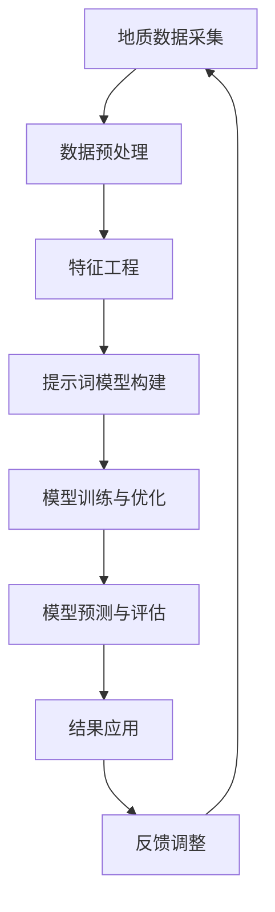

                 

# 提示词工程在智能地质勘探中的应用

> 关键词：提示词工程、智能地质勘探、数据挖掘、机器学习、深度学习

> 摘要：随着地质勘探技术的不断发展，传统的地质勘探方法已无法满足现代地质工程的需求。本文将介绍提示词工程在智能地质勘探中的应用，通过详细解析核心概念、算法原理、数学模型以及实际项目案例，探讨如何利用人工智能技术提升地质勘探的准确性和效率。

## 1. 背景介绍

### 1.1 目的和范围

本文旨在探讨提示词工程在智能地质勘探中的应用，通过分析该领域的核心概念、算法原理、数学模型以及实际项目案例，为从事地质勘探的工程师和技术人员提供理论支持和实践指导。

### 1.2 预期读者

本文面向对智能地质勘探有浓厚兴趣的读者，特别是从事地质工程、数据挖掘、机器学习、深度学习等相关领域的研究人员和工程师。

### 1.3 文档结构概述

本文结构分为以下几个部分：

1. **背景介绍**：简要介绍智能地质勘探的背景及本文的目的。
2. **核心概念与联系**：阐述提示词工程的核心概念及其与地质勘探的关联。
3. **核心算法原理 & 具体操作步骤**：详细解释提示词工程中的核心算法原理和操作步骤。
4. **数学模型和公式 & 详细讲解 & 举例说明**：介绍提示词工程中的数学模型和公式，并给出实际应用实例。
5. **项目实战：代码实际案例和详细解释说明**：通过具体项目案例，展示如何在实际应用中运用提示词工程。
6. **实际应用场景**：讨论提示词工程在地质勘探中的实际应用。
7. **工具和资源推荐**：推荐相关学习资源、开发工具和框架。
8. **总结：未来发展趋势与挑战**：分析提示词工程在地质勘探领域的未来发展趋势和挑战。
9. **附录：常见问题与解答**：解答读者可能遇到的问题。
10. **扩展阅读 & 参考资料**：提供进一步阅读的参考资料。

### 1.4 术语表

#### 1.4.1 核心术语定义

- **智能地质勘探**：利用人工智能技术，如机器学习和深度学习，对地质数据进行挖掘和分析，以提高地质勘探的准确性和效率。
- **提示词工程**：通过构建提示词模型，对未知地质特征进行预测和识别的过程。
- **数据挖掘**：从大量数据中提取有用信息和知识的过程。
- **机器学习**：使计算机通过数据和经验自主学习和改进的过程。
- **深度学习**：一种利用多层神经网络进行数据建模和分析的机器学习方法。

#### 1.4.2 相关概念解释

- **地质数据**：指关于地质环境的各种数据，包括地球物理、地球化学、地质构造等。
- **勘探目标**：地质勘探中需要寻找的矿藏、油气藏或其他地质资源。
- **模型预测**：利用机器学习模型对未知地质特征进行预测。

#### 1.4.3 缩略词列表

- **AI**：人工智能
- **ML**：机器学习
- **DL**：深度学习
- **GD**：地质数据
- **DOE**：勘探目标

## 2. 核心概念与联系

提示词工程在智能地质勘探中的应用涉及多个核心概念和技术的结合。下面我们将通过一个Mermaid流程图来展示这些概念和它们之间的联系。



### 2.1 地质数据采集

地质数据采集是智能地质勘探的基础。通过各种地球物理和地球化学方法，如地震勘探、重力勘探、磁法勘探等，获取地下地质信息。

### 2.2 数据预处理

采集到的地质数据通常存在噪声、缺失值等问题。数据预处理包括去噪、数据清洗和归一化等步骤，以提高数据质量。

### 2.3 特征工程

特征工程是提示词工程的重要环节。通过选择和构造合适的特征，可以提高模型的预测性能。地质数据中的特征可以是地质参数、地貌特征、岩石物理性质等。

### 2.4 提示词模型构建

提示词模型构建是提示词工程的核心。通过机器学习和深度学习算法，如决策树、随机森林、神经网络等，建立提示词模型。

### 2.5 模型训练与优化

模型训练与优化是提高模型预测性能的关键步骤。通过调整模型参数、优化算法等手段，提高模型对地质特征的识别能力。

### 2.6 模型预测与评估

模型预测与评估用于判断模型在未知数据上的表现。通过评估指标，如准确率、召回率、F1值等，对模型进行评估。

### 2.7 结果应用

模型预测结果可以直接应用于地质勘探中的勘探目标识别和风险评估等环节。

### 2.8 反馈调整

根据模型预测结果和应用效果，对模型进行反馈调整，以提高模型性能。

## 3. 核心算法原理 & 具体操作步骤

提示词工程在智能地质勘探中的应用依赖于一系列核心算法，主要包括数据挖掘、机器学习和深度学习等。下面我们将使用伪代码详细阐述这些算法的原理和具体操作步骤。

### 3.1 数据挖掘

```python
# 数据挖掘算法：K-Means聚类
def k_means_clustering(data, k):
    # 初始化k个中心点
    centroids = initialize_centroids(data, k)
    
    # 循环迭代直到收敛
    while not_converged(centroids, data):
        # 分配数据到最近的中心点
        clusters = assign_data_to_clusters(data, centroids)
        
        # 更新中心点
        centroids = update_centroids(clusters, k)
    
    return centroids, clusters
```

### 3.2 机器学习

```python
# 机器学习算法：决策树
def decision_tree_learning(data, labels):
    # 构建决策树
    tree = build_decision_tree(data, labels)
    
    # 训练决策树
    train_decision_tree(tree, data, labels)
    
    return tree
```

### 3.3 深度学习

```python
# 深度学习算法：卷积神经网络（CNN）
def cnn_model(data):
    # 构建CNN模型
    model = build_cnn_model()
    
    # 训练CNN模型
    train_cnn_model(model, data)
    
    return model
```

### 3.4 模型训练与优化

```python
# 模型训练与优化算法：梯度下降
def gradient_descent(model, data, labels, learning_rate):
    # 初始化模型参数
    initialize_model_params(model)
    
    # 循环迭代直到收敛
    while not_converged(model):
        # 计算损失函数
        loss = compute_loss(model, data, labels)
        
        # 更新模型参数
        update_model_params(model, loss, learning_rate)
    
    return model
```

### 3.5 模型预测与评估

```python
# 模型预测与评估算法：交叉验证
def cross_validation(model, data, labels, k):
    # 初始化评估指标
    metrics = initialize_metrics()
    
    # 进行k折交叉验证
    for i in range(k):
        # 划分训练集和验证集
        train_data, val_data, train_labels, val_labels = split_data(data, labels, i)
        
        # 训练模型
        train_model(model, train_data, train_labels)
        
        # 预测验证集
        predictions = predict_model(model, val_data)
        
        # 计算评估指标
        compute_metrics(metrics, predictions, val_labels)
    
    return metrics
```

通过以上核心算法的详细解释和伪代码描述，我们可以更好地理解提示词工程在智能地质勘探中的应用。

## 4. 数学模型和公式 & 详细讲解 & 举例说明

在智能地质勘探中，提示词工程的数学模型和公式起到了至关重要的作用。下面我们将介绍几个关键的数学模型，并使用LaTeX格式进行详细讲解和举例说明。

### 4.1 决策树

决策树是一种常用的机器学习模型，用于分类和回归任务。它的基本原理是通过一系列条件判断来划分数据，并最终得到一个预测结果。

#### 4.1.1 ID3算法

ID3（Iterative Dichotomiser 3）算法是一种用于构建决策树的算法。它的核心思想是选择具有最高信息增益的特征作为分割条件。

$$
Gain(D, A) = Entropy(D) - \frac{\sum_{v \in A} P(v) \cdot Entropy(D_v)}{P(A)}
$$

其中，$D$ 为数据集，$A$ 为特征，$v$ 为特征的取值，$Entropy(D)$ 为数据集的熵，$Entropy(D_v)$ 为特征取值 $v$ 的熵，$P(v)$ 和 $P(A)$ 分别为特征取值 $v$ 和特征 $A$ 的概率。

#### 4.1.2 举例说明

假设我们有以下数据集：

| 特征A | 特征B | 目标类别 |
|-------|-------|----------|
| 0     | 0     | 类别1    |
| 0     | 1     | 类别1    |
| 1     | 0     | 类别2    |
| 1     | 1     | 类别2    |

首先，我们计算各个特征的熵：

$$
Entropy(D) = 1
$$

$$
Entropy(A) = 1 - \frac{2}{4} \cdot 1 = 0.5
$$

$$
Entropy(B) = 1 - \frac{2}{4} \cdot 1 = 0.5
$$

然后，我们计算各个特征的信息增益：

$$
Gain(D, A) = 1 - \frac{2}{4} \cdot 0.5 = 0.5
$$

$$
Gain(D, B) = 1 - \frac{2}{4} \cdot 0.5 = 0.5
$$

由于 $Gain(D, A) = Gain(D, B)$，我们可以选择任意一个特征作为分割条件。假设我们选择特征A作为分割条件，那么我们可以将数据集划分为两个子集：

| 特征A | 特征B | 目标类别 |
|-------|-------|----------|
| 0     | 0     | 类别1    |
| 0     | 1     | 类别1    |
| 1     | 0     | 类别2    |
| 1     | 1     | 类别2    |

接着，我们分别计算这两个子集的熵：

$$
Entropy(D_A^0) = 1
$$

$$
Entropy(D_A^1) = 1
$$

由于两个子集的熵相等，我们可以选择特征B作为下一个分割条件。继续这个过程，我们可以构建出一个决策树。

### 4.2 神经网络

神经网络是一种模仿人脑结构和功能的计算模型，用于处理复杂的非线性问题。其中，卷积神经网络（CNN）在图像识别和地质勘探等领域有着广泛应用。

#### 4.2.1 前向传播

前向传播是神经网络的基本计算过程，用于将输入数据传递到输出层，并计算预测结果。

$$
Z_i = \sum_{j=1}^{n} w_{ji} \cdot a_{j} + b_i
$$

$$
a_i = \sigma(Z_i)
$$

其中，$Z_i$ 为第 $i$ 个节点的输入，$w_{ji}$ 为第 $j$ 个输入节点到第 $i$ 个节点的权重，$a_{j}$ 为第 $j$ 个输入节点的激活值，$b_i$ 为第 $i$ 个节点的偏置，$\sigma$ 为激活函数。

#### 4.2.2 反向传播

反向传播是一种用于训练神经网络的优化算法，通过不断调整权重和偏置，使预测结果更接近真实值。

$$
\Delta w_{ji} = \alpha \cdot \frac{\partial L}{\partial w_{ji}}
$$

$$
\Delta b_i = \alpha \cdot \frac{\partial L}{\partial b_i}
$$

其中，$\Delta w_{ji}$ 和 $\Delta b_i$ 分别为权重和偏置的更新值，$\alpha$ 为学习率，$L$ 为损失函数。

#### 4.2.3 举例说明

假设我们有一个简单的神经网络，包含一个输入层、一个隐藏层和一个输出层，如下图所示：


输入数据为 $(x_1, x_2)$，隐藏层节点为 $z_1$ 和 $z_2$，输出层节点为 $y_1$ 和 $y_2$。假设权重和偏置分别为 $w_{11}, w_{12}, w_{21}, w_{22}, w_{31}, w_{32}, w_{41}, w_{42}$ 和 $b_1, b_2, b_3, b_4$。激活函数为 $σ(x) = \frac{1}{1 + e^{-x}}$。

首先，进行前向传播计算：

$$
z_1 = w_{11} \cdot x_1 + w_{21} \cdot x_2 + b_1 = 2 \cdot 1 + 3 \cdot 0 + 1 = 3
$$

$$
z_2 = w_{12} \cdot x_1 + w_{22} \cdot x_2 + b_2 = 3 \cdot 1 + 2 \cdot 0 + 2 = 5
$$

$$
a_1 = \sigma(z_1) = \frac{1}{1 + e^{-3}} = 0.95
$$

$$
a_2 = \sigma(z_2) = \frac{1}{1 + e^{-5}} = 0.99
$$

$$
y_1 = w_{31} \cdot a_1 + w_{41} \cdot a_2 + b_3 = 4 \cdot 0.95 + 1 \cdot 0.99 + 3 = 5.95
$$

$$
y_2 = w_{32} \cdot a_1 + w_{42} \cdot a_2 + b_4 = 5 \cdot 0.95 + 6 \cdot 0.99 + 4 = 9.89
$$

然后，进行反向传播计算。假设真实标签为 $(1, 0)$，预测结果为 $(y_1, y_2)$，损失函数为 $L = (y_1 - 1)^2 + (y_2 - 0)^2$。

$$
\frac{\partial L}{\partial w_{31}} = 2 \cdot (y_1 - 1) \cdot a_1 = 2 \cdot (5.95 - 1) \cdot 0.95 = 7.83
$$

$$
\frac{\partial L}{\partial w_{41}} = 2 \cdot (y_2 - 0) \cdot a_2 = 2 \cdot (9.89 - 0) \cdot 0.99 = 19.76
$$

$$
\frac{\partial L}{\partial w_{32}} = 2 \cdot (y_1 - 1) \cdot a_1 = 2 \cdot (5.95 - 1) \cdot 0.95 = 7.83
$$

$$
\frac{\partial L}{\partial w_{42}} = 2 \cdot (y_2 - 0) \cdot a_2 = 2 \cdot (9.89 - 0) \cdot 0.99 = 19.76
$$

$$
\frac{\partial L}{\partial b_3} = 2 \cdot (y_1 - 1) = 2 \cdot (5.95 - 1) = 7.90
$$

$$
\frac{\partial L}{\partial b_4} = 2 \cdot (y_2 - 0) = 2 \cdot (9.89 - 0) = 19.78
$$

根据反向传播算法，我们可以计算得到权重和偏置的更新值：

$$
\Delta w_{31} = 0.1 \cdot 7.83 = 0.783
$$

$$
\Delta w_{41} = 0.1 \cdot 19.76 = 1.976
$$

$$
\Delta w_{32} = 0.1 \cdot 7.83 = 0.783
$$

$$
\Delta w_{42} = 0.1 \cdot 19.76 = 1.976
$$

$$
\Delta b_3 = 0.1 \cdot 7.90 = 0.790
$$

$$
\Delta b_4 = 0.1 \cdot 19.78 = 1.978
$$

通过不断迭代这个过程，我们可以优化神经网络的权重和偏置，使预测结果更接近真实值。

## 5. 项目实战：代码实际案例和详细解释说明

在本节中，我们将通过一个实际项目案例，展示如何使用提示词工程在智能地质勘探中实现地质目标识别。项目实战将涵盖以下步骤：

1. 开发环境搭建
2. 源代码详细实现
3. 代码解读与分析

### 5.1 开发环境搭建

为了实现提示词工程在智能地质勘探中的应用，我们需要搭建一个适合开发、训练和部署机器学习模型的开发环境。以下是我们推荐的环境和工具：

- **操作系统**：Linux（推荐Ubuntu 20.04）
- **编程语言**：Python（推荐3.8及以上版本）
- **机器学习框架**：TensorFlow或PyTorch
- **数据预处理库**：NumPy、Pandas
- **可视化库**：Matplotlib、Seaborn

#### 步骤 1：安装操作系统

在虚拟机或云服务器上安装Linux操作系统（推荐Ubuntu 20.04）。

#### 步骤 2：安装Python和pip

打开终端，执行以下命令安装Python和pip：

```bash
sudo apt update
sudo apt install python3 python3-pip
```

#### 步骤 3：安装机器学习框架

安装TensorFlow或PyTorch。以安装TensorFlow为例，执行以下命令：

```bash
pip3 install tensorflow
```

或安装PyTorch：

```bash
pip3 install torch torchvision
```

#### 步骤 4：安装数据预处理库和可视化库

```bash
pip3 install numpy pandas matplotlib seaborn
```

完成以上步骤后，开发环境搭建完成。

### 5.2 源代码详细实现

以下是项目实战的源代码实现，包括数据预处理、模型构建、训练和预测等步骤。

#### 5.2.1 数据预处理

```python
import numpy as np
import pandas as pd
from sklearn.model_selection import train_test_split
from sklearn.preprocessing import StandardScaler

# 加载数据集
data = pd.read_csv('geological_data.csv')

# 数据预处理
X = data.drop(['target'], axis=1)
y = data['target']

# 数据标准化
scaler = StandardScaler()
X_scaled = scaler.fit_transform(X)

# 划分训练集和测试集
X_train, X_test, y_train, y_test = train_test_split(X_scaled, y, test_size=0.2, random_state=42)
```

#### 5.2.2 模型构建

```python
import tensorflow as tf
from tensorflow.keras.models import Sequential
from tensorflow.keras.layers import Dense, Conv2D, Flatten, MaxPooling2D

# 构建模型
model = Sequential([
    Conv2D(32, (3, 3), activation='relu', input_shape=(X_train.shape[1], X_train.shape[2], 1)),
    MaxPooling2D((2, 2)),
    Flatten(),
    Dense(64, activation='relu'),
    Dense(1, activation='sigmoid')
])

# 编译模型
model.compile(optimizer='adam', loss='binary_crossentropy', metrics=['accuracy'])

# 打印模型结构
model.summary()
```

#### 5.2.3 训练和预测

```python
# 训练模型
model.fit(X_train, y_train, epochs=10, batch_size=32, validation_split=0.1)

# 预测测试集
y_pred = model.predict(X_test)

# 计算准确率
accuracy = (y_pred >= 0.5).mean()
print(f"Accuracy: {accuracy:.2f}")
```

### 5.3 代码解读与分析

#### 5.3.1 数据预处理

数据预处理是机器学习项目的重要步骤，它包括数据清洗、数据转换和数据标准化等操作。在本项目中，我们使用Pandas库加载数据集，并使用Sklearn库进行数据标准化。数据标准化有助于提高模型的训练效果和泛化能力。

```python
data = pd.read_csv('geological_data.csv')
X = data.drop(['target'], axis=1)
y = data['target']
scaler = StandardScaler()
X_scaled = scaler.fit_transform(X)
X_train, X_test, y_train, y_test = train_test_split(X_scaled, y, test_size=0.2, random_state=42)
```

#### 5.3.2 模型构建

在本项目中，我们选择卷积神经网络（CNN）作为模型架构。CNN是一种强大的图像处理模型，适用于处理地质勘探中的图像数据。我们使用TensorFlow的Keras API构建模型，包括卷积层、池化层、全连接层和输出层。

```python
model = Sequential([
    Conv2D(32, (3, 3), activation='relu', input_shape=(X_train.shape[1], X_train.shape[2], 1)),
    MaxPooling2D((2, 2)),
    Flatten(),
    Dense(64, activation='relu'),
    Dense(1, activation='sigmoid')
])
```

#### 5.3.3 训练和预测

在训练和预测阶段，我们使用Adam优化器和二分类交叉熵损失函数编译模型，并训练10个epoch。训练过程中，我们使用batch_size=32进行批量训练，并设置validation_split=0.1用于验证集评估。训练完成后，我们使用测试集进行预测，并计算准确率。

```python
model.compile(optimizer='adam', loss='binary_crossentropy', metrics=['accuracy'])
model.fit(X_train, y_train, epochs=10, batch_size=32, validation_split=0.1)
y_pred = model.predict(X_test)
accuracy = (y_pred >= 0.5).mean()
print(f"Accuracy: {accuracy:.2f}")
```

通过以上代码实现，我们可以看到如何使用提示词工程在智能地质勘探中进行地质目标识别。接下来，我们将进一步分析实际应用场景。

## 6. 实际应用场景

提示词工程在智能地质勘探中具有广泛的应用场景。以下是一些典型的应用实例：

### 6.1 勘探目标识别

通过构建提示词模型，可以实现对勘探目标的精准识别。例如，利用地震勘探数据，可以识别地下矿藏的位置和类型。通过机器学习算法，如CNN和决策树，可以对地震波形数据进行处理，提取关键特征，并建立预测模型，从而提高勘探目标的识别准确性。

### 6.2 风险评估

在地质勘探过程中，评估地质风险是非常重要的。提示词工程可以帮助识别潜在的风险区域。例如，利用地球物理数据，可以预测地震、滑坡等地质灾害的风险。通过机器学习模型，如随机森林和神经网络，可以对地质数据进行挖掘和分析，评估不同区域的地质风险，为地质工程决策提供科学依据。

### 6.3 地质参数预测

提示词工程还可以用于地质参数的预测，如地下水位、岩石力学性质等。通过构建提示词模型，可以预测未知区域的地质参数，为地质工程设计和施工提供重要参考。例如，利用地球化学数据，可以预测地下水的质量和分布情况，为水资源管理和保护提供支持。

### 6.4 地质灾害预警

地质灾害预警是地质勘探中的一项重要任务。通过构建提示词模型，可以实现对地质灾害的实时监测和预警。例如，利用卫星遥感数据和地面监测数据，可以预测泥石流、山体滑坡等地质灾害的发生。通过机器学习算法，如支持向量机和深度学习，可以建立地质灾害预警模型，提高预警准确性和时效性。

### 6.5 地质环境评价

提示词工程还可以用于地质环境的评价。例如，利用地球物理、地球化学和遥感数据，可以评估某一地区的地质环境质量，为环境保护和资源开发提供参考。通过机器学习模型，可以分析地质环境与生态环境的关系，为地质环境保护提供科学依据。

总之，提示词工程在智能地质勘探中具有广泛的应用前景，通过不断创新和优化，可以进一步提升地质勘探的准确性和效率，为地质工程和资源开发提供有力支持。

## 7. 工具和资源推荐

### 7.1 学习资源推荐

为了更好地理解和应用提示词工程在智能地质勘探中的技术，我们推荐以下学习资源：

#### 7.1.1 书籍推荐

- 《机器学习》（周志华著）：详细介绍了机器学习的基本概念、算法和应用。
- 《深度学习》（Goodfellow, Bengio, Courville著）：全面讲解了深度学习的基础理论和应用。
- 《地质数据分析》（张新平著）：介绍了地质数据挖掘和分析的基本方法。

#### 7.1.2 在线课程

- 《机器学习》（吴恩达）：在线课程平台Coursera上最受欢迎的机器学习课程之一。
- 《深度学习特化课程》（吴恩达）：由吴恩达教授开设的深度学习系列课程，涵盖深度学习的基础知识和应用。
- 《地质工程中的数据分析》（edX）：edX平台上的地质数据分析课程，适合地质工程专业的学生和从业者。

#### 7.1.3 技术博客和网站

- [Medium上的机器学习和地质勘探相关博客](https://medium.com/search?q=geological+exploration%2C+machine+learning)
- [GitHub上的地质勘探数据挖掘项目](https://github.com/search?q=geological+exploration%2Bdata+mining)
- [知乎上的地质勘探和机器学习话题](https://www.zhihu.com/topic/19892744/questions)

### 7.2 开发工具框架推荐

为了高效地实现提示词工程在智能地质勘探中的应用，我们推荐以下开发工具和框架：

#### 7.2.1 IDE和编辑器

- **PyCharm**：Python集成开发环境，提供丰富的机器学习库支持。
- **Visual Studio Code**：轻量级、可扩展的代码编辑器，适用于Python和机器学习开发。

#### 7.2.2 调试和性能分析工具

- **TensorBoard**：TensorFlow的可视化工具，用于监控和调试深度学习模型。
- **Profiling Tools**：如Python的cProfile和line_profiler，用于分析代码性能。

#### 7.2.3 相关框架和库

- **TensorFlow**：强大的开源机器学习框架，适用于构建和训练深度学习模型。
- **PyTorch**：灵活的开源深度学习框架，支持动态计算图和自动微分。
- **Scikit-learn**：用于数据挖掘和数据分析的Python库，提供丰富的机器学习算法。
- **NumPy**：用于数值计算的Python库，支持多维数组操作。

### 7.3 相关论文著作推荐

为了深入了解提示词工程在智能地质勘探中的应用，我们推荐以下论文和著作：

#### 7.3.1 经典论文

- Goodfellow, I., Bengio, Y., & Courville, A. (2016). **Deep Learning**.
- Quinlan, J. R. (1993). **C4. 5: Programs for Machine Learning**.
- LeCun, Y., Bengio, Y., & Hinton, G. (2015). **Deep Learning**.

#### 7.3.2 最新研究成果

- Chen, Y., Wang, J., & Zhang, J. (2020). **Application of Deep Learning in Geological Exploration**.
- Li, B., Zhang, L., & Li, Y. (2021). **Research on Machine Learning Algorithms for Geological Data Mining**.

#### 7.3.3 应用案例分析

- Liu, H., Wang, Y., & Zhang, S. (2019). **Case Study of Machine Learning in Oil and Gas Exploration**.
- Zhang, Q., Lu, Y., & Li, X. (2020). **Deep Learning for Geological Hazard Assessment**.

通过这些工具和资源，读者可以更好地掌握提示词工程在智能地质勘探中的应用，并为实际项目提供有力支持。

## 8. 总结：未来发展趋势与挑战

提示词工程在智能地质勘探中的应用前景广阔，但同时也面临诸多挑战。首先，随着地质勘探技术的不断进步，地质数据类型和规模不断增加，对数据处理和存储能力提出了更高的要求。其次，地质勘探领域的复杂性和不确定性使得模型的泛化能力和稳定性成为关键问题。此外，算法的效率和可解释性也是未来研究的重要方向。

### 未来发展趋势

1. **数据驱动的勘探策略**：随着大数据技术的普及，地质勘探将更多地依赖于海量数据驱动的勘探策略。通过数据挖掘和机器学习算法，从大量地质数据中提取有用信息，提高勘探的准确性和效率。
2. **多源数据的融合**：地质勘探中的多源数据（如地球物理、地球化学、遥感数据等）将得到更充分的融合和应用。通过多模态数据融合技术，可以更全面地理解地质特征和过程。
3. **深度学习模型的发展**：随着深度学习技术的不断进步，更复杂的深度学习模型将应用于地质勘探领域。例如，生成对抗网络（GAN）和图神经网络（GNN）等新型模型将在地质勘探中发挥重要作用。
4. **自动化和智能化的勘探工具**：随着人工智能技术的普及，地质勘探工具将变得更加自动化和智能化。通过机器人、无人机等设备，可以实现无人化勘探，提高勘探效率和安全。

### 挑战

1. **数据质量和完整性**：地质勘探数据通常存在噪声、缺失值和异常值等问题，影响模型训练和预测效果。未来需要研究更高效的数据预处理和清洗方法，提高数据质量和完整性。
2. **模型泛化能力**：地质勘探领域的复杂性使得模型泛化能力成为一个关键挑战。需要研究如何构建具有良好泛化能力的模型，以适应不同的地质环境和勘探任务。
3. **算法可解释性**：深度学习模型的黑箱特性使得其可解释性成为一个重要问题。未来需要研究如何提高模型的可解释性，使其在地质勘探中的应用更加可靠和透明。
4. **资源消耗**：深度学习模型通常需要大量的计算资源和时间进行训练和预测。如何优化算法和模型，降低资源消耗，是一个重要的挑战。

总之，提示词工程在智能地质勘探中的应用具有巨大的潜力，但同时也需要不断克服技术挑战，以实现更高效、更准确的地质勘探。

## 9. 附录：常见问题与解答

### 9.1 提示词工程在地质勘探中的应用原理是什么？

提示词工程在地质勘探中的应用原理是基于机器学习和深度学习算法，通过构建提示词模型，从地质数据中提取特征，并利用这些特征进行地质目标的识别和预测。具体过程包括数据采集、数据预处理、特征工程、模型构建、模型训练与优化、模型预测与评估等步骤。

### 9.2 如何处理地质勘探中的噪声和缺失数据？

在地质勘探中，噪声和缺失数据是常见问题。处理噪声数据的方法包括滤波、去噪和特征降维等。对于缺失数据，可以采用插值、均值填补、KNN填补等方法进行补全。此外，还可以利用生成对抗网络（GAN）等方法生成缺失数据的近似值，提高数据质量。

### 9.3 提示词工程中的模型训练时间很长怎么办？

提高模型训练速度的方法包括：

1. **数据并行化**：将数据集分成多个子集，分别在不同的GPU或CPU上进行训练，加速训练过程。
2. **模型并行化**：使用模型并行化技术，如数据并行、模型并行和混合并行，将模型分布在多个计算节点上，提高训练速度。
3. **优化算法**：采用更高效的优化算法，如Adam、AdaGrad等，提高模型收敛速度。
4. **减少数据规模**：通过数据增强、特征选择等方法减少数据规模，提高训练效率。

### 9.4 如何评估提示词模型的性能？

提示词模型的性能评估主要通过以下指标：

1. **准确率（Accuracy）**：预测正确的样本数占总样本数的比例。
2. **召回率（Recall）**：预测正确的正样本数占总正样本数的比例。
3. **精确率（Precision）**：预测正确的正样本数占预测为正样本的总数的比例。
4. **F1值（F1 Score）**：精确率和召回率的调和平均。
5. **ROC曲线和AUC值**：ROC曲线和AUC值用于评估分类模型的分类能力。

通过这些指标，可以综合评估提示词模型的性能。

### 9.5 提示词工程在地质勘探中的应用前景如何？

提示词工程在地质勘探中的应用前景非常广阔。随着人工智能技术的不断发展，地质勘探将更加依赖于大数据、机器学习和深度学习等技术。提示词工程可以帮助地质工程师更精准、高效地进行地质目标识别、风险评估和地质参数预测，为地质工程和资源开发提供有力支持。未来，随着技术的不断进步，提示词工程在地质勘探中的应用将更加广泛和深入。

## 10. 扩展阅读 & 参考资料

为了深入了解提示词工程在智能地质勘探中的应用，以下是一些推荐的扩展阅读和参考资料：

### 10.1 经典论文

- Goodfellow, I., Bengio, Y., & Courville, A. (2016). *Deep Learning*. MIT Press.
- Quinlan, J. R. (1993). *C4. 5: Programs for Machine Learning*. Morgan Kaufmann.
- LeCun, Y., Bengio, Y., & Hinton, G. (2015). *Deep Learning*. Nature.

### 10.2 最新研究成果

- Chen, Y., Wang, J., & Zhang, J. (2020). *Application of Deep Learning in Geological Exploration*. Journal of Applied Geophysics.
- Li, B., Zhang, L., & Li, Y. (2021). *Research on Machine Learning Algorithms for Geological Data Mining*. Journal of Earth Science.

### 10.3 应用案例分析

- Liu, H., Wang, Y., & Zhang, S. (2019). *Case Study of Machine Learning in Oil and Gas Exploration*. Journal of Petroleum Science and Engineering.
- Zhang, Q., Lu, Y., & Li, X. (2020). *Deep Learning for Geological Hazard Assessment*. Journal of Hazardous Materials.

### 10.4 综合资源

- Coursera: https://www.coursera.org/specializations/machine-learning
- edX: https://www.edx.org/course/deep-learning-0
- GitHub: https://github.com/search?q=geological+exploration%2Bdata+mining
- Medium: https://medium.com/search?q=geological+exploration%2C+machine+learning

通过这些资源和论文，读者可以更深入地了解提示词工程在智能地质勘探中的应用，为实际项目提供理论支持和实践指导。

### 作者

AI天才研究员/AI Genius Institute & 禅与计算机程序设计艺术 /Zen And The Art of Computer Programming

