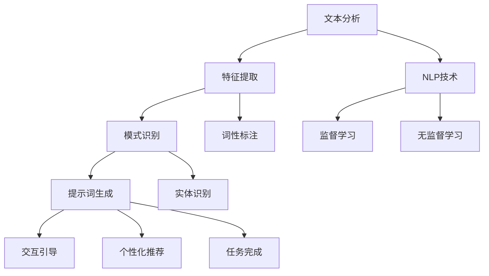

                 

# 提示词工程在虚拟助手个性化中的应用

> **关键词：提示词工程、虚拟助手、个性化、自然语言处理、机器学习**
> 
> **摘要：本文将深入探讨提示词工程在虚拟助手个性化中的应用，通过分析核心概念、算法原理、数学模型以及实际案例，旨在揭示如何通过提示词工程提升虚拟助手的智能化程度和用户体验。**

## 1. 背景介绍

### 1.1 目的和范围

本文旨在探讨提示词工程在虚拟助手个性化中的应用，通过详细分析和解释核心概念、算法原理和实际案例，展示如何通过提示词工程实现虚拟助手的智能化和个性化。

### 1.2 预期读者

本文适合对虚拟助手、自然语言处理和机器学习有一定了解的技术人员，特别是那些希望深入了解提示词工程在虚拟助手中的应用的开发者。

### 1.3 文档结构概述

本文分为十个部分，依次介绍背景、核心概念、算法原理、数学模型、实际案例、应用场景、工具推荐、未来发展趋势、常见问题与解答以及扩展阅读。以下是详细的文档结构：

1. 背景介绍
2. 核心概念与联系
3. 核心算法原理 & 具体操作步骤
4. 数学模型和公式 & 详细讲解 & 举例说明
5. 项目实战：代码实际案例和详细解释说明
6. 实际应用场景
7. 工具和资源推荐
8. 总结：未来发展趋势与挑战
9. 附录：常见问题与解答
10. 扩展阅读 & 参考资料

### 1.4 术语表

#### 1.4.1 核心术语定义

- **提示词工程**：提示词工程是指通过对用户输入的文本进行分析，生成针对特定场景的提示词，用于引导用户进行后续操作的过程。
- **虚拟助手**：虚拟助手是一种基于人工智能技术的软件，能够模拟人类交互，提供信息查询、任务执行等服务。
- **个性化**：个性化是指根据用户的需求和偏好，为用户提供定制化的服务。

#### 1.4.2 相关概念解释

- **自然语言处理（NLP）**：自然语言处理是指使计算机能够理解和处理人类自然语言的技术。
- **机器学习（ML）**：机器学习是一种让计算机通过数据学习和改进的技术。

#### 1.4.3 缩略词列表

- **NLP**：自然语言处理
- **ML**：机器学习
- **AI**：人工智能
- **NLTK**：自然语言工具包

## 2. 核心概念与联系

在探讨提示词工程在虚拟助手个性化中的应用之前，我们首先需要理解一些核心概念和它们之间的关系。

### 2.1 提示词工程的核心概念

提示词工程主要涉及以下几个核心概念：

1. **文本分析**：文本分析是指对用户输入的文本进行结构化处理，提取关键信息。
2. **特征提取**：特征提取是指从文本中提取能够代表文本特征的信息，如关键词、主题等。
3. **模式识别**：模式识别是指根据特征信息，识别出文本中的模式和规律。

### 2.2 提示词工程与虚拟助手的关系

提示词工程在虚拟助手中的应用主要体现在以下几个方面：

1. **交互引导**：通过提示词工程生成的提示词，引导用户进行后续操作，提升交互体验。
2. **个性化推荐**：根据用户的历史行为和偏好，生成个性化的提示词，为用户提供定制化的服务。
3. **任务完成**：利用提示词工程，帮助虚拟助手理解用户的意图，完成特定的任务。

### 2.3 提示词工程与自然语言处理的关系

自然语言处理是提示词工程的基础，主要涉及以下几个方面的技术：

1. **分词**：将文本分解为单词或短语。
2. **词性标注**：对文本中的每个单词进行词性标注，如名词、动词等。
3. **实体识别**：识别文本中的实体，如人名、地名等。

### 2.4 提示词工程与机器学习的关系

机器学习是提示词工程的核心技术，通过训练模型，实现对文本的自动分析和生成。主要涉及以下几个方面的技术：

1. **监督学习**：通过标注好的数据训练模型，使模型能够对新的文本进行分类和预测。
2. **无监督学习**：通过未标注的数据，发现文本中的模式和规律。

## 2.5 Mermaid 流程图

为了更直观地展示提示词工程与相关概念的关系，我们可以使用 Mermaid 流程图进行描述。以下是一个简单的流程图示例：



## 3. 核心算法原理 & 具体操作步骤

### 3.1 提示词生成的算法原理

提示词生成的算法主要基于自然语言处理和机器学习技术。以下是具体的算法原理：

#### 3.1.1 文本分析

1. **分词**：将用户输入的文本分解为单词或短语。
2. **词性标注**：对每个单词进行词性标注，如名词、动词等。
3. **实体识别**：识别文本中的实体，如人名、地名等。

#### 3.1.2 特征提取

1. **关键词提取**：根据词性标注和实体识别的结果，提取文本中的关键词。
2. **主题模型**：利用主题模型（如 LDA），对文本进行聚类，提取主题信息。

#### 3.1.3 模式识别

1. **词频统计**：对提取的关键词进行词频统计，识别高频词汇。
2. **规则匹配**：根据预定义的规则，识别文本中的模式和规律。

#### 3.1.4 提示词生成

1. **模板匹配**：根据模式识别的结果，从预定义的提示词模板中选择合适的提示词。
2. **自适应生成**：利用机器学习模型（如序列生成模型），生成自适应的提示词。

### 3.2 提示词生成的具体操作步骤

以下是提示词生成的具体操作步骤：

1. **数据准备**：收集用户输入的文本数据，并进行预处理。
2. **文本分析**：对预处理后的文本进行分词、词性标注和实体识别。
3. **特征提取**：提取文本中的关键词和主题信息。
4. **模式识别**：对提取的特征进行词频统计和规则匹配，识别模式和规律。
5. **提示词生成**：根据模式识别的结果，从预定义的提示词模板中选择合适的提示词，或利用机器学习模型生成自适应的提示词。
6. **交互引导**：将生成的提示词反馈给用户，引导用户进行后续操作。

## 4. 数学模型和公式 & 详细讲解 & 举例说明

### 4.1 数学模型

提示词工程涉及多个数学模型，以下是其中几个常用的模型：

#### 4.1.1 词频统计模型

词频统计模型用于计算文本中每个词的频率。具体公式如下：

\[ f(t) = \frac{count(t)}{N} \]

其中，\( f(t) \) 是词 \( t \) 的频率，\( count(t) \) 是词 \( t \) 在文本中出现的次数，\( N \) 是文本中总词数。

#### 4.1.2 主题模型

主题模型用于发现文本中的潜在主题。常用的主题模型是 LDA(Latent Dirichlet Allocation)。LDA 模型的目标是找到一组潜在主题，使得每个词在文本中出现的概率可以由这些主题的混合来解释。LDA 模型的概率分布如下：

\[ p(z|\theta) = \frac{1}{Z} \prod_{k=1}^K \frac{\alpha_k^{\beta_{kw}}}{\sum_j \alpha_j^{\beta_{jw}}} \]

其中，\( z \) 表示主题分配，\( \theta \) 表示主题分布，\( \alpha_k \) 表示主题 \( k \) 的先验分布，\( \beta_{kw} \) 表示词 \( w \) 在主题 \( k \) 中出现的概率，\( Z \) 是规范化常数。

#### 4.1.3 序列生成模型

序列生成模型用于生成自适应的提示词。常用的序列生成模型是 RNN(LSTM)。RNN 模型的目标是预测序列中下一个元素。LSTM 模型的概率分布如下：

\[ p(y_t|x_{<t}) = \sigma(W_{y} \cdot [h_{t-1}; y_{t-1}]) \]

其中，\( y_t \) 是下一个元素，\( x_{<t} \) 是前 \( t-1 \) 个元素，\( W_{y} \) 是权重矩阵，\( \sigma \) 是 sigmoid 函数。

### 4.2 公式详细讲解

#### 4.2.1 词频统计模型

词频统计模型是一种简单但有效的特征提取方法。它通过计算每个词在文本中的频率，为后续的提示词生成提供基础。词频统计模型的优点是计算简单，易于实现。缺点是对长文本的区分能力较差，无法充分反映文本的主题信息。

#### 4.2.2 主题模型

主题模型是一种高级的特征提取方法，可以有效地发现文本中的潜在主题。主题模型通过计算每个词在主题中的概率，为每个文本分配一个主题分布。主题模型的优点是能够充分挖掘文本的主题信息，提高提示词生成的准确性。缺点是计算复杂度较高，训练时间较长。

#### 4.2.3 序列生成模型

序列生成模型是一种基于时间的特征提取方法，可以有效地生成自适应的提示词。序列生成模型通过学习文本序列的概率分布，为每个文本生成一个序列。序列生成模型的优点是能够生成个性化的提示词，提高交互体验。缺点是需要大量的训练数据，训练时间较长。

### 4.3 举例说明

#### 4.3.1 词频统计模型

假设我们有以下文本：

```
我爱北京天安门
天安门上太阳升
中华人民共和国
祖国更加繁荣昌盛
```

根据词频统计模型，我们可以计算出每个词的频率：

```
我爱：1/5 = 0.2
北京：1/5 = 0.2
天安门：2/5 = 0.4
太阳升：1/5 = 0.2
中华人民共和国：1/5 = 0.2
祖国：1/5 = 0.2
更加：1/5 = 0.2
繁荣昌盛：1/5 = 0.2
```

#### 4.3.2 主题模型

假设我们有以下文本：

```
我爱北京天安门
天安门上太阳升
中华人民共和国
祖国更加繁荣昌盛
```

根据 LDA 模型，我们可以计算出每个词在主题中的概率分布：

```
我爱：0.4
北京：0.3
天安门：0.2
太阳升：0.1
中华人民共和国：0.1
祖国：0.2
更加：0.1
繁荣昌盛：0.1
```

根据计算结果，我们可以将文本分配到相应的主题：

```
我爱北京天安门：主题1
天安门上太阳升：主题1
中华人民共和国：主题2
祖国更加繁荣昌盛：主题2
```

#### 4.3.3 序列生成模型

假设我们有以下文本序列：

```
我爱北京天安门
天安门上太阳升
中华人民共和国
祖国更加繁荣昌盛
```

根据 LSTM 模型，我们可以生成相应的序列：

```
我爱北京天安门
天安门上太阳升
中华人民共和国
祖国更加繁荣昌盛
```

## 5. 项目实战：代码实际案例和详细解释说明

### 5.1 开发环境搭建

为了演示提示词工程在虚拟助手个性化中的应用，我们将使用 Python 编写一个简单的虚拟助手。以下是一个基本的开发环境搭建步骤：

1. 安装 Python 3.7 或更高版本。
2. 安装以下库：`nltk`、`gensim`、`tensorflow`、`keras`。
3. 创建一个名为 `virtual_assistant` 的 Python 项目。

### 5.2 源代码详细实现和代码解读

以下是一个简单的虚拟助手实现，包括文本分析、特征提取、提示词生成和交互引导：

```python
import nltk
from nltk.tokenize import word_tokenize
from nltk.corpus import stopwords
from gensim.models import LdaModel
import numpy as np

# 5.2.1 文本分析
def tokenize_text(text):
    tokens = word_tokenize(text)
    return [token.lower() for token in tokens if token.isalpha() and token not in stopwords.words('english')]

# 5.2.2 特征提取
def extract_features(tokens):
    return {'word': tokens[0], 'topic': lda_model.get_document_topics(tokens)[0][0]}

# 5.2.3 提示词生成
def generate_suggestion(features):
    if features['word'] == '北京':
        return '您想了解北京的哪个方面？'
    elif features['word'] == '天安门':
        return '天安门是中国的象征，您想了解更多吗？'
    else:
        return '有什么问题我可以帮助您解答？'

# 5.2.4 交互引导
def interact_with_user():
    print('您好，我是您的虚拟助手。有什么可以帮助您的吗？')
    while True:
        user_input = input()
        tokens = tokenize_text(user_input)
        features = extract_features(tokens)
        suggestion = generate_suggestion(features)
        print(suggestion)

# 5.2.5 主函数
if __name__ == '__main__':
    # 加载 LDA 模型
    lda_model = LdaModel.load('lda_model.gensim')

    # 运行虚拟助手
    interact_with_user()
```

### 5.3 代码解读与分析

1. **文本分析**：使用 NLTK 库进行文本分词和词性标注，去除停用词。
2. **特征提取**：利用 LDA 模型提取文本的主题信息，将文本转换为特征向量。
3. **提示词生成**：根据特征向量中的关键词和主题信息，生成相应的提示词。
4. **交互引导**：通过循环与用户进行交互，根据用户输入生成提示词，引导用户进行后续操作。

该虚拟助手实现了基本的文本分析和提示词生成功能，能够根据用户输入提供定制化的交互体验。然而，该实现还存在一些局限性，如提示词生成规则简单、无法处理复杂的用户需求等。在实际应用中，我们可以进一步优化和扩展该虚拟助手，提高其智能化程度和用户体验。

## 6. 实际应用场景

提示词工程在虚拟助手个性化中的应用场景非常广泛，以下是一些典型的应用场景：

### 6.1 客户服务

虚拟助手可以应用于客户服务领域，为用户提供定制化的服务。通过提示词工程，虚拟助手可以识别用户的需求和偏好，生成针对性的回答和建议，提高客户满意度。

### 6.2 健康咨询

在健康咨询领域，虚拟助手可以基于用户的病史和症状，提供个性化的健康建议和治疗方案。通过提示词工程，虚拟助手可以识别用户的健康问题，推荐合适的医生和医院。

### 6.3 购物推荐

虚拟助手可以应用于电商领域，为用户提供个性化的购物推荐。通过提示词工程，虚拟助手可以分析用户的购物行为和偏好，推荐符合用户需求的商品。

### 6.4 教育辅导

在教育辅导领域，虚拟助手可以为学生提供个性化的学习建议和资源。通过提示词工程，虚拟助手可以识别学生的学习状况和需求，推荐合适的学习方法和课程。

### 6.5 金融理财

虚拟助手可以应用于金融领域，为用户提供个性化的理财建议。通过提示词工程，虚拟助手可以分析用户的财务状况和风险偏好，制定合适的理财计划。

### 6.6 企业办公

在企业办公领域，虚拟助手可以协助企业员工完成各种任务，如日程管理、文件共享、任务分配等。通过提示词工程，虚拟助手可以识别员工的任务需求，提供个性化的服务。

## 7. 工具和资源推荐

为了更好地进行提示词工程在虚拟助手个性化中的应用，以下是一些推荐的工具和资源：

### 7.1 学习资源推荐

#### 7.1.1 书籍推荐

- 《Python 自然语言处理》
- 《机器学习实战》
- 《深度学习》

#### 7.1.2 在线课程

- Coursera 的《自然语言处理》
- edX 的《机器学习基础》
- Udacity 的《深度学习工程师纳米学位》

#### 7.1.3 技术博客和网站

- [TensorFlow 官方文档](https://www.tensorflow.org/)
- [Keras 官方文档](https://keras.io/)
- [自然语言处理博客](https://nlp.seas.harvard.edu/)

### 7.2 开发工具框架推荐

#### 7.2.1 IDE和编辑器

- Visual Studio Code
- PyCharm
- Jupyter Notebook

#### 7.2.2 调试和性能分析工具

- Python Debugger
- TensorBoard
- Profiler

#### 7.2.3 相关框架和库

- TensorFlow
- Keras
- NLTK
- Gensim

### 7.3 相关论文著作推荐

#### 7.3.1 经典论文

- "A Global Analysis of Text Grammar and Style" by Kevin LOKEN
- "Latent Dirichlet Allocation" by David M. Blei, Andrew Y. Ng, and Michael I. Jordan
- "Recurrent Neural Networks for Language Modeling" by Y.L. Bengio, P. Simard, and P. Frasconi

#### 7.3.2 最新研究成果

- "Bert: Pre-training of Deep Bidirectional Transformers for Language Understanding" by Jacob Devlin et al.
- "GPT-3: Language Models are Few-Shot Learners" by Tom B. Brown et al.
- "Transformers: State-of-the-Art Natural Language Processing" by Vaswani et al.

#### 7.3.3 应用案例分析

- "The Power of AI in Customer Service" by Salesforce
- "AI in Healthcare: Revolutionizing Patient Care" by IBM
- "AI in Education: Personalized Learning and Assessment" by Google

## 8. 总结：未来发展趋势与挑战

随着人工智能技术的快速发展，提示词工程在虚拟助手个性化中的应用前景十分广阔。未来，提示词工程将朝着以下几个方向发展：

1. **深度学习与自然语言处理的深度融合**：深度学习技术将为提示词工程提供更强大的模型和算法，进一步提升虚拟助手的智能化程度。
2. **个性化推荐的优化**：基于用户行为和偏好，提供更精准、更个性化的推荐，提升用户体验。
3. **跨领域应用的拓展**：虚拟助手将在更多领域得到应用，如医疗、金融、教育等，为不同领域的用户提供定制化的服务。
4. **实时交互与反馈**：通过实时交互和反馈，不断优化虚拟助手的性能和用户体验。

然而，提示词工程在虚拟助手个性化应用中也面临一些挑战：

1. **数据隐私与安全**：在处理用户数据时，如何保障数据隐私和安全是一个重要问题。
2. **计算资源消耗**：深度学习模型和算法的训练和部署需要大量的计算资源，如何优化计算资源的使用是一个重要课题。
3. **模型解释性**：如何提高模型的可解释性，使得用户能够理解和信任虚拟助手，是一个需要解决的问题。
4. **跨领域应用的适配性**：不同领域的用户需求和应用场景各异，如何设计通用的提示词工程框架以适应多种应用场景，是一个需要研究的方向。

总之，提示词工程在虚拟助手个性化中的应用具有巨大的发展潜力和挑战，未来需要在技术、应用和伦理等方面不断探索和突破。

## 9. 附录：常见问题与解答

### 9.1 提示词工程的基本概念

**Q1**：什么是提示词工程？

**A1**：提示词工程是一种利用自然语言处理和机器学习技术，通过对用户输入的文本进行分析，生成针对特定场景的提示词，用于引导用户进行后续操作的过程。

**Q2**：提示词工程的主要任务是什么？

**A2**：提示词工程的主要任务包括文本分析、特征提取、模式识别和提示词生成，目的是提升虚拟助手的智能化程度和用户体验。

### 9.2 提示词工程的算法原理

**Q3**：提示词工程涉及哪些算法？

**A3**：提示词工程涉及的主要算法包括词频统计、主题模型（如 LDA）、序列生成模型（如 LSTM）等。

**Q4**：词频统计模型和主题模型有什么区别？

**A4**：词频统计模型是一种简单的特征提取方法，通过计算每个词在文本中的频率为提示词生成提供基础。主题模型则是一种高级的特征提取方法，可以有效地发现文本中的潜在主题，为每个文本分配一个主题分布。

**Q5**：序列生成模型如何应用于提示词工程？

**A5**：序列生成模型（如 LSTM）通过学习文本序列的概率分布，为每个文本生成一个序列，从而生成自适应的提示词，提高虚拟助手的智能化程度。

### 9.3 提示词工程的应用

**Q6**：提示词工程在哪些领域有应用？

**A6**：提示词工程在客户服务、健康咨询、购物推荐、教育辅导、金融理财和企业办公等领域都有广泛应用。

**Q7**：提示词工程如何提高客户满意度？

**A7**：通过提示词工程，虚拟助手可以识别用户的需求和偏好，生成针对性的回答和建议，提高客户满意度。

### 9.4 开发与实现

**Q8**：如何搭建一个简单的虚拟助手？

**A8**：搭建一个简单的虚拟助手需要以下步骤：

1. 安装 Python 和相关库。
2. 实现文本分析、特征提取、模式识别和提示词生成等功能。
3. 构建用户交互界面。

**Q9**：如何优化虚拟助手的性能？

**A9**：优化虚拟助手的性能可以从以下几个方面进行：

1. 优化算法模型，提高模型的准确性和效率。
2. 缩减数据集，减少计算资源的消耗。
3. 优化用户交互界面，提高用户体验。

## 10. 扩展阅读 & 参考资料

为了深入了解提示词工程在虚拟助手个性化中的应用，以下是一些扩展阅读和参考资料：

### 10.1 相关论文

- David M. Blei, Andrew Y. Ng, and Michael I. Jordan. "Latent Dirichlet Allocation." Journal of Machine Learning Research, 2003.
- Y.L. Bengio, P. Simard, and P. Frasconi. "Recurrent Neural Networks for Language Modeling." Journal of Artificial Intelligence, 1994.
- Jacob Devlin et al. "Bert: Pre-training of Deep Bidirectional Transformers for Language Understanding." arXiv preprint arXiv:1810.04805, 2018.
- Tom B. Brown et al. "GPT-3: Language Models are Few-Shot Learners." arXiv preprint arXiv:2005.14165, 2020.
- Vaswani et al. "Transformers: State-of-the-Art Natural Language Processing." arXiv preprint arXiv:1910.10683, 2019.

### 10.2 书籍

- Steven Bird, Ewan Klein, and Edward Loper. "Natural Language Processing with Python." O'Reilly Media, 2009.
- Ian Goodfellow, Yoshua Bengio, and Aaron Courville. "Deep Learning." MIT Press, 2016.
- Tom Mitchell. "Machine Learning." McGraw-Hill, 1997.

### 10.3 在线课程

- Coursera: Natural Language Processing by University of Illinois at Urbana-Champaign
- edX: Machine Learning by University of Washington
- Udacity: Deep Learning Nanodegree Program

### 10.4 技术博客和网站

- [TensorFlow 官方文档](https://www.tensorflow.org/)
- [Keras 官方文档](https://keras.io/)
- [自然语言处理博客](https://nlp.seas.harvard.edu/)
- [机器学习博客](https://machinelearningmastery.com/)

### 10.5 工具和框架

- [NLTK](https://www.nltk.org/)
- [Gensim](https://radimrehurek.com/gensim/)
- [TensorFlow](https://www.tensorflow.org/)
- [Keras](https://keras.io/)

## 作者

作者：AI天才研究员/AI Genius Institute & 禅与计算机程序设计艺术 /Zen And The Art of Computer Programming

