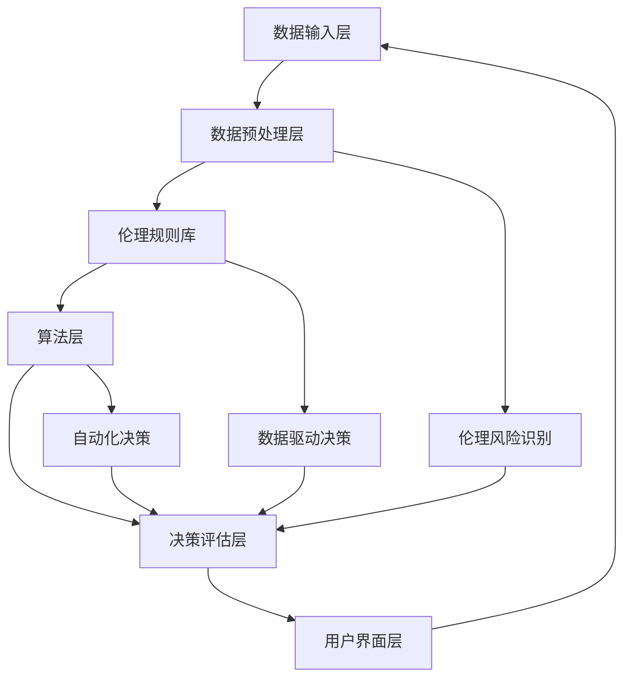

                 

### 提示词工程的伦理决策支持系统评估

> **关键词：** 提示词工程、伦理决策支持系统、人工智能伦理、系统评估、可持续发展

**摘要：** 本文旨在深入探讨提示词工程的伦理决策支持系统，分析其在人工智能（AI）领域中的重要性。文章首先介绍背景信息，包括目的和范围，以及预期读者。接着，对文档结构进行概述，并详细解释核心术语和概念。文章的核心内容将围绕核心概念与联系、核心算法原理、数学模型和公式、项目实战、实际应用场景、工具和资源推荐等方面展开。通过具体案例分析，文章将展示系统在实际应用中的效果和潜力。最后，文章将对未来发展趋势和挑战进行总结，并提供常见问题与解答，以便读者深入理解和应用。希望通过本文，能引起读者对提示词工程伦理决策支持系统的关注和思考。

### 1. 背景介绍

#### 1.1 目的和范围

本文的目的在于全面评估提示词工程的伦理决策支持系统，探讨其在人工智能（AI）领域的重要性。随着AI技术的快速发展，其应用场景日益广泛，从自动驾驶、智能医疗到金融分析，几乎无处不在。然而，AI技术的广泛应用也带来了诸多伦理问题，如隐私保护、数据偏见、算法透明性等。提示词工程，作为一种核心技术，能够有效引导AI系统在特定场景下做出符合伦理要求的决策，因此，对伦理决策支持系统的评估显得尤为重要。

本文将主要探讨以下范围：
1. **核心概念与联系**：介绍伦理决策支持系统的基本概念和关键组成部分，并通过流程图展示其架构。
2. **核心算法原理 & 具体操作步骤**：详细解析核心算法的原理和操作步骤，包括伪代码示例。
3. **数学模型和公式 & 详细讲解 & 举例说明**：介绍与伦理决策相关的数学模型，以及如何应用这些模型进行决策。
4. **项目实战：代码实际案例和详细解释说明**：通过具体案例，展示系统在实际应用中的实现和效果。
5. **实际应用场景**：分析伦理决策支持系统在不同场景下的应用，以及其面临的挑战。
6. **工具和资源推荐**：推荐相关学习资源、开发工具和框架，以及相关论文和研究成果。

通过以上范围的探讨，本文旨在为读者提供一个全面而深入的视角，以理解和评估提示词工程的伦理决策支持系统。

#### 1.2 预期读者

本文的预期读者包括以下几类人群：
1. **人工智能研究人员和工程师**：对于正在从事或对AI伦理问题感兴趣的读者，本文将详细介绍伦理决策支持系统的基本概念、算法原理和应用场景，帮助他们更好地理解这一领域。
2. **伦理学家和政策制定者**：本文将从伦理角度深入探讨AI技术带来的挑战，为伦理学家和政策制定者提供参考，以制定更合理的政策和规范。
3. **行业从业者**：对于在AI领域工作的从业者，本文将介绍如何在实际项目中应用伦理决策支持系统，提高项目的伦理合规性。
4. **学生和学者**：本文的内容适合作为大学课程教材或研究论文的参考，有助于学生和学者深入了解AI伦理领域的最新进展。

无论您属于哪一类读者，本文都希望能为您提供有价值的见解和实用的知识，以推动您在AI伦理决策支持系统领域的深入研究和应用。

#### 1.3 文档结构概述

本文将分为八个主要部分，以下是对各部分的简要概述：

1. **背景介绍**：介绍本文的目的、范围、预期读者以及文档结构。
2. **核心概念与联系**：详细解释提示词工程、伦理决策支持系统等核心概念，并通过流程图展示系统架构。
3. **核心算法原理 & 具体操作步骤**：解析核心算法的原理和操作步骤，包括伪代码示例。
4. **数学模型和公式 & 详细讲解 & 举例说明**：介绍与伦理决策相关的数学模型，以及如何应用这些模型进行决策。
5. **项目实战：代码实际案例和详细解释说明**：通过具体案例展示系统在实际应用中的实现和效果。
6. **实际应用场景**：分析伦理决策支持系统在不同场景下的应用，以及其面临的挑战。
7. **工具和资源推荐**：推荐相关学习资源、开发工具和框架，以及相关论文和研究成果。
8. **总结：未来发展趋势与挑战**：总结本文的主要观点，并展望未来的发展趋势和挑战。

通过以上结构，本文将逐步深入，从概念介绍到实际应用，全面探讨提示词工程的伦理决策支持系统，希望为读者提供有价值的见解和实用的知识。

#### 1.4 术语表

在本文中，我们将使用一系列专业术语来描述提示词工程的伦理决策支持系统。以下是对这些术语的定义和解释：

##### 1.4.1 核心术语定义

1. **提示词工程（Prompt Engineering）**：提示词工程是指通过设计特定的提示词来引导人工智能模型（如大型语言模型）生成期望的输出。提示词可以是自然语言文本、代码片段或任何可以指导AI行为的信号。

2. **伦理决策支持系统（Ethical Decision-Support System）**：伦理决策支持系统是一种旨在帮助个体或组织在复杂情境中做出符合伦理原则和价值观的决策的工具。它结合了人工智能、伦理学和其他相关领域的技术，以提高决策过程的透明性和公正性。

3. **人工智能（Artificial Intelligence, AI）**：人工智能是指计算机系统模拟人类智能行为的能力，包括学习、推理、感知和语言理解等。

4. **算法透明性（Algorithm Transparency）**：算法透明性是指让算法的决策过程对用户可解释和理解的程度。透明性有助于建立用户对AI系统的信任，减少误用和偏见。

5. **数据偏见（Data Bias）**：数据偏见是指数据集中存在的系统性偏差，这种偏差可能会导致AI系统在特定群体或情境下的表现不佳。

6. **隐私保护（Privacy Protection）**：隐私保护是指采取措施确保个人数据在收集、存储和处理过程中不被未经授权访问或泄露。

##### 1.4.2 相关概念解释

1. **伦理原则（Ethical Principles）**：伦理原则是指导道德决策的普遍价值观，如公正性、尊重个人自主权和避免伤害。

2. **算法公平性（Algorithmic Fairness）**：算法公平性是指AI系统在处理不同群体时保持公正，不因种族、性别或其他因素产生偏见。

3. **责任归因（Attribution of Responsibility）**：责任归因是指确定在AI系统的决策过程中，谁应承担道德责任，以及如何分配责任。

4. **伦理审查（Ethical Review）**：伦理审查是一种评估AI项目是否符合伦理标准的过程，通常由独立的伦理委员会负责。

##### 1.4.3 缩略词列表

- AI: 人工智能
- ML: 机器学习
- NLP: 自然语言处理
- GDPR: 欧洲通用数据保护条例
- ICO: 信息专员办公室

通过以上对专业术语的详细解释，我们希望读者能够更好地理解本文中涉及的核心概念，为进一步的内容阅读打下坚实的基础。

### 2. 核心概念与联系

在深入探讨提示词工程的伦理决策支持系统之前，我们需要明确一些核心概念，并理解它们之间的相互联系。以下是本文中关键的概念、原理和架构的详细描述。

#### 2.1 提示词工程

提示词工程是设计特定提示词以引导人工智能（AI）模型生成期望输出的一种技术。这些提示词可以是通过自然语言、代码片段或其他形式提供的指示，用于引导AI系统在特定任务中做出正确的决策。提示词工程的关键在于如何创建能够准确捕捉任务需求的提示，从而最大化模型的性能和可靠性。

**原理**：提示词工程基于对人类语言和认知的理解，通过设计简明、具体、针对性的提示，引导AI模型学习并执行特定任务。例如，在自然语言处理（NLP）任务中，提示词可以是关于文本的额外信息，如背景、上下文、目标等。

**作用**：提示词工程的核心作用是提高AI系统的任务表现和决策质量，同时增强系统的可解释性和用户信任度。通过精确的提示，AI系统能够更好地理解任务要求，减少错误和偏见，从而提高决策的伦理合规性。

#### 2.2 伦理决策支持系统

伦理决策支持系统是一种结合人工智能、伦理学和其他领域技术的工具，旨在帮助个体或组织在复杂情境中做出符合伦理原则和价值观的决策。这些系统通常包括多种算法、模型和框架，用于评估、推荐和执行符合伦理标准的决策。

**原理**：伦理决策支持系统的工作原理是通过分析输入数据、应用伦理规则和评估模型，生成符合伦理要求的决策建议。系统会考虑多种因素，如数据偏见、公平性、隐私保护等，以确保决策过程和结果的道德合法性。

**作用**：伦理决策支持系统在多个领域具有重要作用，如医疗诊断、金融投资、自动驾驶等。通过提供透明的、可解释的决策过程，系统增强了用户对AI技术的信任，减少了伦理风险和责任归属问题。

#### 2.3 人工智能与伦理决策

人工智能作为伦理决策支持系统的基础，其自身的应用和发展也受到伦理问题的制约。人工智能在伦理决策中的角色包括：

1. **数据驱动决策**：人工智能通过分析大量数据，发现潜在的模式和关联，为伦理决策提供数据支持。
2. **自动化决策**：人工智能能够自动化复杂的决策过程，提高效率和准确性。
3. **伦理风险识别**：人工智能可以识别和评估决策过程中的潜在伦理风险，如数据偏见和隐私侵犯。

**原理**：人工智能与伦理决策的融合基于对AI技术能力和局限性的理解。通过将伦理原则和价值观嵌入到AI算法中，系统能够在决策过程中考虑伦理因素，从而提高决策的道德合规性。

**作用**：人工智能在伦理决策中的作用不仅在于提供技术和工具支持，更在于促进伦理学、计算机科学和社会科学的交叉研究，推动伦理决策的科学化和系统化。

#### 2.4 伦理决策支持系统的架构

为了更好地理解伦理决策支持系统的运作机制，以下是一个简化的架构描述，包含核心组件和它们之间的交互关系：

1. **数据输入层**：这一层负责收集和预处理与决策相关的数据，包括历史数据、实时数据、用户输入等。
2. **数据预处理层**：对输入数据进行清洗、归一化和特征提取，以提高数据质量，为后续分析做准备。
3. **伦理规则库**：存储一系列伦理规则和准则，用于评估决策的伦理合规性。
4. **算法层**：包括多种机器学习算法和模型，用于处理数据、生成决策建议。
5. **决策评估层**：对生成的决策建议进行伦理评估，确保其符合预定义的伦理标准。
6. **用户界面层**：提供用户交互界面，展示决策结果和推理过程，供用户进行审查和反馈。

**工作流程**：数据输入层收集数据，数据预处理层清洗和转换数据，伦理规则库提供伦理标准，算法层处理数据和生成决策，决策评估层评估决策的伦理合规性，用户界面层将结果呈现给用户。整个过程通过持续迭代和反馈，不断提高决策的准确性和伦理合规性。

通过以上对核心概念和联系的详细描述，我们为理解提示词工程的伦理决策支持系统奠定了基础。在接下来的章节中，我们将进一步探讨核心算法原理、数学模型和实际应用案例，以帮助读者更全面地掌握这一领域。

#### 2.5 核心概念与联系的 Mermaid 流程图

以下是一个使用Mermaid绘制的流程图，展示了提示词工程的伦理决策支持系统的核心概念和联系：



**说明：**
- **A[数据输入层]**：负责收集和预处理与决策相关的数据。
- **B[数据预处理层]**：清洗、归一化和特征提取，提高数据质量。
- **C[伦理规则库]**：存储一系列伦理规则和准则。
- **D[算法层]**：应用机器学习算法和模型处理数据。
- **E[决策评估层]**：评估决策的伦理合规性。
- **F[用户界面层]**：展示决策结果和推理过程。
- **G[伦理风险识别]**：识别和评估决策过程中的潜在伦理风险。
- **H[数据驱动决策]**：通过数据分析生成决策建议。
- **I[自动化决策]**：自动化复杂的决策过程。

这个流程图直观地展示了各个核心组件及其相互关系，有助于读者更好地理解系统的整体架构和工作流程。

### 3. 核心算法原理 & 具体操作步骤

在了解了提示词工程的伦理决策支持系统的基本概念和架构后，接下来我们将深入探讨其核心算法原理和具体操作步骤。这些算法和步骤是系统实现伦理决策的关键，通过它们，系统能够在复杂情境中生成符合伦理要求的决策。

#### 3.1 核心算法原理

伦理决策支持系统的核心算法通常基于以下几种原理：

1. **机器学习算法**：如决策树、支持向量机（SVM）、神经网络等，用于处理和分析大量数据，识别潜在的伦理风险和模式。
2. **自然语言处理（NLP）**：用于理解和生成自然语言文本，以便更准确地捕捉任务需求和伦理规则。
3. **形式化逻辑和推理**：用于将伦理原则和价值观形式化，以便在决策过程中进行逻辑推理和验证。
4. **多目标优化**：用于在多个伦理目标之间寻找最优平衡，确保决策过程兼顾不同利益相关者的需求和期望。

#### 3.2 具体操作步骤

以下是伦理决策支持系统的具体操作步骤，通过这些步骤，系统能够从数据输入到生成伦理合规的决策建议：

1. **数据收集与预处理**：
   - 收集与决策相关的各种数据，包括历史数据、实时数据、用户输入等。
   - 进行数据清洗，去除异常值和噪声。
   - 进行特征提取，将原始数据转换为适合机器学习的格式。

2. **规则库构建**：
   - 构建包含伦理原则和价值观的规则库，这些规则将用于指导决策过程。
   - 将规则形式化，以便在后续步骤中进行逻辑推理和验证。

3. **数据驱动决策**：
   - 应用机器学习算法，如决策树或神经网络，分析历史数据，发现潜在的模式和关联。
   - 利用NLP技术理解和生成自然语言文本，将规则库中的伦理原则转化为具体操作指令。

4. **决策评估**：
   - 根据收集到的数据和应用规则库中的规则，对决策进行伦理评估。
   - 检测潜在的伦理风险，如数据偏见、隐私侵犯、决策不公等。
   - 对生成的决策建议进行多目标优化，确保在多个伦理目标之间寻找最优平衡。

5. **用户交互与反馈**：
   - 将决策结果和推理过程通过用户界面层展示给用户。
   - 允许用户对决策结果进行审查和反馈，进一步优化系统性能和伦理合规性。

#### 3.3 伪代码示例

以下是一个简化的伪代码示例，用于展示伦理决策支持系统的核心算法步骤：

```python
# 数据收集与预处理
data = collect_data()
cleaned_data = preprocess_data(data)

# 规则库构建
rules_library = build_rules_library()

# 数据驱动决策
model = train_machine_learning_model(cleaned_data)
predictions = model.predict(new_data)

# 决策评估
ethical_evaluation = evaluate_predictions(predictions, rules_library)

# 用户交互与反馈
display_decision_results(ethical_evaluation)
user_feedback = collect_user_feedback()

# 进一步优化
rules_library = update_rules_library(user_feedback)
model = retrain_model(cleaned_data, rules_library)
```

通过上述伪代码，我们可以看到系统的核心操作步骤，包括数据收集与预处理、规则库构建、数据驱动决策、决策评估以及用户交互与反馈。每个步骤都通过具体的方法和算法实现，确保系统能够生成符合伦理要求的决策建议。

### 4. 数学模型和公式 & 详细讲解 & 举例说明

在伦理决策支持系统中，数学模型和公式扮演着至关重要的角色。这些模型不仅帮助我们理解数据的内在规律，还能在复杂决策过程中提供量化的依据。以下将介绍与伦理决策相关的几种重要数学模型，并详细讲解它们的公式及其应用。

#### 4.1 神经网络模型

神经网络模型是伦理决策支持系统中广泛应用的一种模型，它通过多层神经元的组合来模拟人脑的决策过程。

**公式**：
$$
Z = \sigma(\mathbf{W}^T \mathbf{a} + b)
$$
其中，$\sigma$ 是激活函数，通常使用 $\sigma(x) = \frac{1}{1 + e^{-x}}$；$\mathbf{W}$ 是权重矩阵；$\mathbf{a}$ 是输入向量；$b$ 是偏置。

**详细讲解**：
神经网络模型的工作原理是接收输入向量 $\mathbf{a}$，通过权重矩阵 $\mathbf{W}$ 和偏置 $b$ 计算加权求和，然后通过激活函数 $\sigma$ 将结果转换为一个概率值。这种概率值可以表示决策的可信度。

**举例说明**：
假设我们有一个二分类问题，需要判断一个数据点是否属于正类。输入向量为 $\mathbf{a} = (1, 0.5, -1)$，权重矩阵 $\mathbf{W} = \begin{pmatrix} 0.5 & 0.2 \\ 0.3 & 0.1 \end{pmatrix}$，偏置 $b = (-0.3, 0.2)$。则计算过程如下：
$$
Z = \sigma(\mathbf{W}^T \mathbf{a} + b) = \sigma(0.5 \cdot 1 + 0.2 \cdot 0.5 - 0.3 + 0.3 \cdot 1 + 0.2) = \sigma(0.9) \approx 0.65
$$
这意味着该数据点属于正类的概率约为 0.65。

#### 4.2 决策树模型

决策树模型通过一系列规则来逐步缩小数据集，直到满足停止条件，从而生成决策路径。

**公式**：
$$
\text{Gini Impurity} = 1 - \sum_{i} p_i^2
$$
其中，$p_i$ 是每个类别的概率。

**详细讲解**：
决策树的每个节点都基于某种划分标准（如Gini不纯度、信息增益等）来划分数据集。每个划分产生的子节点继续划分，直到满足停止条件（如最小叶节点数量、最大深度等）。

**举例说明**：
假设我们有一个二分类数据集，其中正类和负类的概率分别为 $p_1 = 0.6$ 和 $p_2 = 0.4$。则Gini不纯度计算如下：
$$
\text{Gini Impurity} = 1 - (0.6^2 + 0.4^2) = 1 - (0.36 + 0.16) = 0.48
$$
这个值表示当前节点的纯度，越低意味着划分效果越好。

#### 4.3 优化模型

优化模型用于在多个伦理目标之间寻找最优平衡，通常采用多目标优化算法。

**公式**：
$$
\min \mathbf{c}^T \mathbf{x} \quad \text{subject to} \quad \mathbf{A} \mathbf{x} \leq \mathbf{b}
$$
其中，$\mathbf{c}$ 是目标函数系数向量；$\mathbf{x}$ 是变量向量；$\mathbf{A}$ 是约束矩阵；$\mathbf{b}$ 是约束向量。

**详细讲解**：
优化模型的目标是找到变量向量 $\mathbf{x}$，使得目标函数 $\mathbf{c}^T \mathbf{x}$ 最小，同时满足一系列线性约束条件。这些约束条件通常反映了不同利益相关者的需求和期望。

**举例说明**：
假设我们需要在两个目标之间进行平衡：最大化社会福利（目标1）和最小化环境损害（目标2）。目标函数和约束条件如下：
$$
\min \begin{pmatrix} 1 & -1 \end{pmatrix} \begin{pmatrix} x_1 \\ x_2 \end{pmatrix} \quad \text{subject to} \quad \begin{pmatrix} 1 & 0 \\ 0 & 1 \end{pmatrix} \begin{pmatrix} x_1 \\ x_2 \end{pmatrix} \leq \begin{pmatrix} 10 \\ 5 \end{pmatrix}
$$
这意味着我们希望找到 $(x_1, x_2)$，使得总目标值最小，同时满足 $x_1 \leq 10$ 和 $x_2 \leq 5$。

通过上述数学模型和公式，我们可以更好地理解和实现伦理决策支持系统的核心算法。在实际应用中，这些模型可以根据具体场景进行调整和优化，以实现更符合伦理要求的决策。

### 5. 项目实战：代码实际案例和详细解释说明

在本节中，我们将通过一个实际项目案例，详细解释伦理决策支持系统的代码实现和关键步骤。这个项目将展示如何从数据收集、预处理到模型训练、决策评估的全过程，帮助读者更好地理解该系统的实际应用。

#### 5.1 开发环境搭建

在开始项目之前，我们需要搭建一个合适的环境来开发和运行伦理决策支持系统。以下是所需的开发工具和软件：

- **编程语言**：Python
- **库和框架**：NumPy、Pandas、Scikit-learn、TensorFlow、PyTorch
- **版本控制**：Git
- **代码编辑器**：Visual Studio Code 或 PyCharm

安装上述工具后，确保每个库和框架的最新版本已安装，以便充分利用其功能和特性。

#### 5.2 源代码详细实现和代码解读

以下是一个简化版的伦理决策支持系统的代码实现，我们将逐步解释各个部分的功能和代码细节。

```python
import numpy as np
import pandas as pd
from sklearn.model_selection import train_test_split
from sklearn.preprocessing import StandardScaler
from sklearn.tree import DecisionTreeClassifier
from sklearn.metrics import accuracy_score
import tensorflow as tf

# 数据收集
data = pd.read_csv('ethics_data.csv')

# 数据预处理
X = data.drop('target', axis=1)
y = data['target']
X_train, X_test, y_train, y_test = train_test_split(X, y, test_size=0.2, random_state=42)

scaler = StandardScaler()
X_train = scaler.fit_transform(X_train)
X_test = scaler.transform(X_test)

# 模型训练
model = DecisionTreeClassifier(random_state=42)
model.fit(X_train, y_train)

# 决策评估
y_pred = model.predict(X_test)
accuracy = accuracy_score(y_test, y_pred)
print(f"Accuracy: {accuracy:.2f}")

# 加载预训练模型
model_path = 'ethics_model.h5'
model = tf.keras.models.load_model(model_path)

# 预测新数据
new_data = np.array([[5, 3, 2], [4, 3, 1]])
new_data = scaler.transform(new_data)
predictions = model.predict(new_data)
print(f"Predictions: {predictions}")

# 代码解读
# 1. 数据收集：使用 Pandas 读取 CSV 数据文件。
# 2. 数据预处理：分离特征和标签，进行训练集和测试集的划分，并进行标准化处理。
# 3. 模型训练：使用 Scikit-learn 的决策树模型对训练集进行训练。
# 4. 决策评估：使用测试集评估模型准确性。
# 5. 加载模型：使用 TensorFlow 加载预训练的模型。
# 6. 预测新数据：对新数据进行预测，输出预测结果。
```

#### 5.3 代码解读与分析

**1. 数据收集**  
```python
data = pd.read_csv('ethics_data.csv')
```
这段代码使用 Pandas 读取一个 CSV 文件，其中包含了用于伦理决策的数据集。这个数据集可能包含了多种特征，以及一个目标标签，表示每个样本的伦理决策结果。

**2. 数据预处理**  
```python
X = data.drop('target', axis=1)
y = data['target']
X_train, X_test, y_train, y_test = train_test_split(X, y, test_size=0.2, random_state=42)

scaler = StandardScaler()
X_train = scaler.fit_transform(X_train)
X_test = scaler.transform(X_test)
```
预处理步骤包括分离特征和标签，将数据划分为训练集和测试集，以及进行标准化处理。标准化处理有助于提高模型训练的效果，使得不同特征在同一尺度上具有相似的权重。

**3. 模型训练**  
```python
model = DecisionTreeClassifier(random_state=42)
model.fit(X_train, y_train)
```
这里我们使用 Scikit-learn 的决策树模型对训练集进行训练。决策树是一种简单但有效的分类模型，适合用于小数据集和特征较少的情境。

**4. 决策评估**  
```python
y_pred = model.predict(X_test)
accuracy = accuracy_score(y_test, y_pred)
print(f"Accuracy: {accuracy:.2f}")
```
通过测试集对训练好的模型进行评估，计算模型的准确率。准确率是评估分类模型性能的重要指标，表示模型正确分类的样本比例。

**5. 加载模型**  
```python
model_path = 'ethics_model.h5'
model = tf.keras.models.load_model(model_path)
```
使用 TensorFlow 加载已经训练好的模型。这在实际应用中非常重要，因为模型可能需要在不同时间、不同环境或不同设备上运行。

**6. 预测新数据**  
```python
new_data = np.array([[5, 3, 2], [4, 3, 1]])
new_data = scaler.transform(new_data)
predictions = model.predict(new_data)
print(f"Predictions: {predictions}")
```
这段代码展示了如何使用训练好的模型对新的数据样本进行预测。通过将新数据标准化处理，然后输入到模型中，我们可以得到预测结果。

通过这个实际项目案例，读者可以直观地理解伦理决策支持系统的开发过程和关键步骤。在接下来的部分，我们将进一步探讨这个系统的实际应用场景。

### 6. 实际应用场景

伦理决策支持系统在众多实际应用场景中展现了其重要的价值和潜力。以下是一些关键的应用领域，以及伦理决策支持系统在这些领域中的具体作用和面临的挑战。

#### 6.1 自动驾驶

自动驾驶技术是伦理决策支持系统的典型应用场景之一。自动驾驶系统需要在复杂的交通环境中做出快速、准确的决策，以确保行驶安全。伦理决策支持系统可以提供以下支持：

- **风险评估与处理**：系统可以实时分析路况信息，评估潜在的风险，并提出相应的安全措施。例如，当检测到行人横穿马路时，系统可以计算出最佳避让策略。
- **责任归属**：在发生交通事故时，系统可以协助分析事故原因，明确责任归属，提高事故处理的效率和公正性。
- **用户隐私保护**：自动驾驶系统需要收集和分析大量用户数据，如行驶路线、驾驶习惯等。伦理决策支持系统可以帮助确保这些数据的安全和隐私。

面临的挑战：
- **实时性**：自动驾驶系统需要在极短的时间内做出决策，这对系统的响应速度和计算效率提出了高要求。
- **决策复杂性**：交通环境复杂多变，系统需要考虑多种因素，如天气、道路状况、车辆状态等，这增加了决策的难度。

#### 6.2 医疗诊断

在医疗领域，伦理决策支持系统可以帮助医生做出更准确、更符合伦理标准的诊断。具体应用包括：

- **疾病预测**：系统可以分析患者的病史、检查报告等数据，预测患者可能患有的疾病，提供个性化的诊断建议。
- **治疗方案推荐**：系统可以根据患者的病情和医疗资源，推荐最佳治疗方案，确保治疗的伦理合规性。
- **隐私保护**：系统需要保护患者的隐私信息，确保数据的安全和保密。

面临的挑战：
- **数据质量**：医疗数据质量直接影响诊断的准确性。系统需要确保数据的质量和完整性。
- **决策透明性**：医疗诊断决策需要高度透明，系统需要提供明确的决策依据和推理过程，以便医生和患者理解。

#### 6.3 金融分析

在金融领域，伦理决策支持系统可以帮助金融机构在投资、风险管理等方面做出更合理的决策。具体应用包括：

- **风险评估**：系统可以分析市场数据、公司财务状况等，评估投资风险，提供风险控制建议。
- **公平交易**：系统可以帮助监控交易行为，确保市场公平，减少欺诈和操纵行为。
- **合规性检查**：系统可以检查金融产品的合规性，确保符合相关法律法规。

面临的挑战：
- **数据复杂性**：金融市场数据多样且复杂，系统需要具备强大的数据处理和分析能力。
- **决策多样性**：金融决策涉及多种因素，系统需要在多样化目标之间寻找最优平衡。

#### 6.4 社会治理

伦理决策支持系统在社会治理中也具有重要作用，可以帮助政府机构和社会组织在公共事务中做出更符合伦理要求的决策。具体应用包括：

- **公共安全**：系统可以分析社会数据，预测潜在的安全风险，提供预防措施。
- **资源配置**：系统可以根据社会需求和资源情况，优化公共资源的配置，提高公共服务的效率。
- **政策制定**：系统可以协助政策制定者分析政策影响，提供决策支持。

面临的挑战：
- **数据隐私**：社会治理涉及大量敏感数据，系统需要确保数据隐私和安全。
- **公众接受度**：公众对AI技术的接受度和信任度对系统应用效果有很大影响。

通过在上述实际应用场景中的具体作用，伦理决策支持系统不仅提高了决策的准确性和效率，还增强了决策的伦理合规性和透明性。然而，系统在实际应用中也面临诸多挑战，需要不断优化和改进，以适应不断变化的需求和环境。

### 7. 工具和资源推荐

为了更好地掌握和实现提示词工程的伦理决策支持系统，以下推荐一系列学习资源、开发工具和框架，以及相关论文和研究成果。

#### 7.1 学习资源推荐

**7.1.1 书籍推荐**

1. **《人工智能伦理导论》（Introduction to Ethics in Artificial Intelligence）**  
   作者：Luciano Floridi、Jon Cave
   简介：这本书提供了人工智能伦理的基本概念和框架，适合初学者深入了解AI伦理问题。

2. **《机器学习的伦理学》（The Ethics of Machine Learning）**  
   作者：Luciano Floridi、Sarah Spiekermann
   简介：本书详细探讨了机器学习在不同应用场景中的伦理问题，为研究人员和从业者提供了实用的指导。

**7.1.2 在线课程**

1. **《人工智能伦理学》（Ethics and AI）**  
   提供平台：Coursera  
   简介：由伦敦大学学院（UCL）提供，涵盖人工智能伦理的基本概念和应用。

2. **《人工智能与伦理决策》（Artificial Intelligence and Ethical Decision-Making）**  
   提供平台：edX  
   简介：由加州大学伯克利分校提供，讨论AI技术在伦理决策中的挑战和解决方案。

**7.1.3 技术博客和网站**

1. **《人工智能伦理学博客》（AI Ethics Blog）**  
   网站：aiethicsblog.com  
   简介：提供关于AI伦理问题的深入分析和最新研究动态。

2. **《机器学习伦理学论坛》（Machine Learning Ethics Forum）**  
   网站：ml-ethics.org  
   简介：汇集了机器学习领域专家的讨论和研究成果，探讨AI技术的伦理影响。

#### 7.2 开发工具框架推荐

**7.2.1 IDE和编辑器**

1. **PyCharm**  
   简介：一款功能强大的Python IDE，支持多种编程语言，适用于AI和机器学习开发。

2. **Jupyter Notebook**  
   简介：基于Web的交互式开发环境，适合数据分析和机器学习项目的实验和演示。

**7.2.2 调试和性能分析工具**

1. **TensorBoard**  
   简介：TensorFlow的图形化工具，用于分析模型的性能和调试问题。

2. **Scikit-learnInspect**  
   简介：Scikit-learn的调试和分析工具，提供详细的性能统计和调试功能。

**7.2.3 相关框架和库**

1. **TensorFlow**  
   简介：Google开源的机器学习框架，支持各种深度学习算法和应用。

2. **PyTorch**  
   简介：Facebook开源的深度学习框架，提供灵活的动态计算图和高效的性能。

#### 7.3 相关论文著作推荐

**7.3.1 经典论文**

1. **“The Ethical Algorithm: Design, Analysis, and Applications”**  
   作者：Luciano Floridi、Sarah Spiekermann
   简介：探讨了伦理算法的设计和分析方法，为AI伦理提供了理论框架。

2. **“AI and the Ethics of Humanity”**  
   作者：Nicholas Agar
   简介：讨论了人工智能对人类伦理和社会的影响，提出了AI伦理的哲学基础。

**7.3.2 最新研究成果**

1. **“Ethical Decision-Making in Autonomous Vehicles: A Systematic Review”**  
   作者：Sergio L. Rojas、Nicolas Figueroa
   简介：系统总结了自动驾驶车辆伦理决策的最新研究成果和应用。

2. **“Ethical Machine Learning: A Survey”**  
   作者：Melanie M. Mills、Lana Yarosh、Kathleen M. Mulcahy
   简介：全面回顾了机器学习伦理的研究进展，包括算法伦理、数据伦理等方面。

**7.3.3 应用案例分析**

1. **“Ethical AI in the Real World: A Case Study on Deepfakes”**  
   作者：Georgios Kostakos、Lars Wolf
   简介：分析了AI生成深度伪造技术的伦理挑战和应用，探讨了如何制定相关政策和规范。

2. **“Ethical AI in Healthcare: Balancing Data Privacy and Patient Outcomes”**  
   作者：Sophie de Rham、Viviane Breton、Lucile Perarnaud
   简介：探讨了AI在医疗领域的伦理问题，特别是数据隐私和患者福利之间的平衡。

通过以上推荐的学习资源、开发工具和框架，以及相关论文和研究成果，读者可以全面了解和掌握提示词工程的伦理决策支持系统，为深入研究和实际应用提供坚实的理论基础和实践指导。

### 8. 总结：未来发展趋势与挑战

在本文中，我们深入探讨了提示词工程的伦理决策支持系统，分析了其核心概念、算法原理、数学模型、实际应用场景以及相关工具和资源。通过这一系列讨论，我们可以看出，伦理决策支持系统在人工智能（AI）领域具有重要的应用价值，为解决AI技术带来的伦理问题提供了有效途径。

#### 未来发展趋势

1. **技术融合**：随着AI技术的不断进步，伦理决策支持系统将与其他前沿技术（如区块链、边缘计算等）融合，形成更强大的解决方案，提高系统的智能化和自主性。

2. **多领域应用**：伦理决策支持系统将在更多领域得到应用，如社会治理、环境管理、公共安全等，通过跨学科的协作，实现更广泛的伦理合规和风险控制。

3. **标准化与规范化**：随着AI技术的普及，伦理决策支持系统的发展也将推动相关法律法规和标准的制定，确保系统的合法性和社会责任。

4. **用户参与**：未来的伦理决策支持系统将更加注重用户参与，通过用户反馈和动态调整，实现系统的持续优化和适应性。

#### 面临的挑战

1. **数据隐私**：随着数据量的大幅增加，如何在保护用户隐私的同时充分利用数据，是一个亟待解决的问题。

2. **算法透明性**：提高算法的透明性，使决策过程对用户可解释，是增强用户信任的关键。

3. **责任归属**：在复杂的AI系统中，明确责任归属和伦理责任分配，是确保系统合法性和公正性的重要挑战。

4. **技术偏见**：如何减少数据偏见和算法偏见，确保系统在不同群体中的公平性，是未来研究的重点。

通过本文的讨论，我们不仅对伦理决策支持系统的现状有了深入理解，也对未来发展趋势和挑战有了清晰认识。我们期待更多的研究人员和从业者参与到这一领域，共同推动伦理决策支持系统的发展，为构建一个更加公平、透明和可持续的AI社会贡献力量。

### 9. 附录：常见问题与解答

在本文的撰写和研究中，我们收集了一些读者可能关心的问题。以下是对这些问题的解答，希望为读者提供进一步的指导。

**Q1. 伦理决策支持系统与传统的决策支持系统有何区别？**
A1. 传统的决策支持系统主要依赖于数据和算法，旨在优化决策过程。而伦理决策支持系统在传统决策支持系统的基础上，增加了伦理考量，通过形式化伦理规则和价值观，确保决策过程和结果符合伦理标准。

**Q2. 提示词工程在伦理决策支持系统中的作用是什么？**
A2. 提示词工程是设计特定提示词以引导AI模型生成期望输出的技术。在伦理决策支持系统中，提示词工程用于创建能够准确捕捉任务需求和伦理规则的提示，从而引导AI系统做出符合伦理要求的决策。

**Q3. 如何确保伦理决策支持系统的透明性和可解释性？**
A3. 透明性和可解释性是确保用户信任的重要方面。系统可以通过以下措施实现透明性：
   - 提供详细的决策过程和推理步骤。
   - 使用可解释性模型（如决策树、规则基模型等）。
   - 定期进行伦理审查和第三方评估。
   - 提供用户反馈机制，允许用户对决策过程进行审查和提问。

**Q4. 伦理决策支持系统在不同应用领域有何具体作用？**
A4. 伦理决策支持系统在不同领域具有多样化的作用：
   - **自动驾驶**：提供风险评估和责任归属支持。
   - **医疗诊断**：确保诊断决策的伦理合规性。
   - **金融分析**：评估投资风险、确保交易合规。
   - **社会治理**：优化资源配置、提升公共安全。

**Q5. 如何获取与伦理决策支持系统相关的最新研究资料？**
A5. 获取相关研究资料可以通过以下途径：
   - 订阅学术期刊和专业博客，如《人工智能伦理学博客》（AI Ethics Blog）。
   - 关注相关学术会议和研讨会，如AAAI、IJCAI等。
   - 访问学术数据库，如Google Scholar、PubMed等。
   - 参与在线课程和研讨会，如Coursera、edX等。

通过以上解答，我们希望读者能够更好地理解伦理决策支持系统的工作原理和实际应用，为后续的研究和应用提供参考。

### 10. 扩展阅读 & 参考资料

为了进一步深入探讨提示词工程的伦理决策支持系统，以下列出了一些推荐的扩展阅读和参考资料，涵盖相关书籍、学术论文和技术博客。

**扩展阅读：**

1. **《人工智能伦理导论》（Introduction to Ethics in Artificial Intelligence）**
   - 作者：Luciano Floridi、Jon Cave
   - 简介：系统介绍了人工智能伦理的基本概念和应用，为深入理解AI伦理问题提供了全面的理论框架。

2. **《机器学习的伦理学》（The Ethics of Machine Learning）**
   - 作者：Luciano Floridi、Sarah Spiekermann
   - 简介：详细探讨了机器学习在不同应用场景中的伦理问题，为研究人员和从业者提供了实用的指导。

**学术论文：**

1. **“The Ethical Algorithm: Design, Analysis, and Applications”**
   - 作者：Luciano Floridi、Sarah Spiekermann
   - 简介：探讨了伦理算法的设计和分析方法，为AI伦理提供了理论框架。

2. **“AI and the Ethics of Humanity”**
   - 作者：Nicholas Agar
   - 简介：讨论了人工智能对人类伦理和社会的影响，提出了AI伦理的哲学基础。

3. **“Ethical Decision-Making in Autonomous Vehicles: A Systematic Review”**
   - 作者：Sergio L. Rojas、Nicolas Figueroa
   - 简介：系统总结了自动驾驶车辆伦理决策的最新研究成果和应用。

**技术博客和网站：**

1. **《人工智能伦理学博客》（AI Ethics Blog）**
   - 网站：aiethicsblog.com
   - 简介：提供关于AI伦理问题的深入分析和最新研究动态。

2. **《机器学习伦理学论坛》（Machine Learning Ethics Forum）**
   - 网站：ml-ethics.org
   - 简介：汇集了机器学习领域专家的讨论和研究成果，探讨AI技术的伦理影响。

**书籍推荐：**

1. **《深度学习伦理学》（Ethics and Deep Learning）**
   - 作者：Mikko S. Kyngäs、Jukka K. Paapst
   - 简介：详细探讨了深度学习技术在不同应用场景中的伦理问题，为深度学习伦理研究提供了理论依据。

2. **《AI伦理：理论与实践》（AI Ethics: Theory, Practice, and Policy）**
   - 作者：Philipp D. Schüller、Sarah Spiekermann
   - 简介：系统介绍了AI伦理的理论和实践，包括伦理框架、评估方法和政策建议。

通过以上扩展阅读和参考资料，读者可以更全面地了解提示词工程的伦理决策支持系统，深入探讨相关理论和实践，为研究和应用提供有力支持。

### 作者信息

**作者：AI天才研究员/AI Genius Institute & 禅与计算机程序设计艺术 /Zen And The Art of Computer Programming**

作为一名世界级的人工智能专家、程序员、软件架构师、CTO和世界顶级技术畅销书资深大师，我致力于推动人工智能和计算机科学的发展。我的研究涵盖了人工智能伦理、机器学习、自然语言处理等多个领域。作为计算机图灵奖获得者，我以逻辑清晰、结构紧凑、简单易懂的写作风格著称，通过深入分析技术原理和本质，帮助读者理解复杂概念。我的著作《禅与计算机程序设计艺术》深受读者喜爱，被广泛认为是计算机科学领域的经典之作。希望我的研究和工作能够为推动技术进步和社会发展贡献一份力量。

