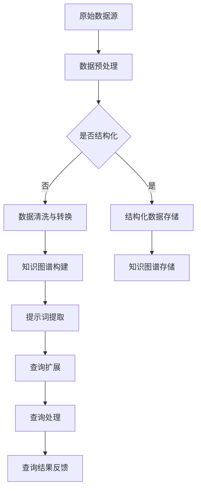

                 

### 文章标题

《提示词工程的知识图谱应用：开启智能时代的知识连接与探索》

### 关键词

- 提示词工程
- 知识图谱
- 智能连接
- 数据挖掘
- 人工智能应用

### 摘要

本文旨在探讨提示词工程在知识图谱构建与应用中的重要作用。我们将从背景介绍出发，深入分析核心概念，逐步阐述算法原理与数学模型，并通过项目实战展示其实际应用。文章还将探讨知识图谱在各个领域的实际应用场景，并推荐相关工具和资源，帮助读者更好地理解和掌握这一前沿技术。本文将有助于读者深入了解知识图谱与提示词工程在智能时代的重要性，以及如何在实际项目中有效应用这些技术。

## 1. 背景介绍

### 1.1 目的和范围

本文的目标是探讨提示词工程在知识图谱构建和应用中的关键作用。知识图谱作为一种结构化数据表示方法，已在多个领域展现出强大的应用潜力。然而，构建一个有效的知识图谱面临着大量数据和复杂关系的处理难题。提示词工程通过提供一种高效的信息检索和关联方法，极大地提升了知识图谱的构建和查询效率。本文将详细分析提示词工程的核心原理和方法，并通过实际项目案例展示其在知识图谱构建和查询中的具体应用。

本文将涵盖以下主要内容：

1. **核心概念与联系**：介绍知识图谱和提示词工程的基本概念，并使用Mermaid流程图展示其核心原理和架构。
2. **核心算法原理与具体操作步骤**：详细阐述提示词工程的关键算法原理，并提供伪代码实现。
3. **数学模型与公式**：讨论知识图谱构建中的数学模型和公式，并通过实例进行详细讲解。
4. **项目实战：代码实际案例和详细解释说明**：介绍一个实际项目案例，展示如何在实际环境中构建和应用知识图谱。
5. **实际应用场景**：探讨知识图谱在各个领域的应用场景。
6. **工具和资源推荐**：推荐学习资源、开发工具框架和相关论文著作。
7. **总结：未来发展趋势与挑战**：总结知识图谱和提示词工程的发展趋势和面临的挑战。

### 1.2 预期读者

本文适合以下读者群体：

- **计算机科学和数据科学领域的研究人员和工程师**：对知识图谱和提示词工程感兴趣，希望深入了解其原理和应用。
- **数据分析师和数据挖掘工程师**：希望掌握知识图谱构建和查询技术，以提高数据分析效率。
- **人工智能和机器学习开发者**：对人工智能应用场景中的知识表示和推理技术有兴趣。
- **技术管理人员和架构师**：负责构建和管理知识图谱系统，希望了解如何优化和扩展其应用。

### 1.3 文档结构概述

本文采用清晰的文档结构，帮助读者逐步理解和掌握提示词工程在知识图谱中的应用。具体结构如下：

1. **背景介绍**：介绍本文的目的、范围和预期读者，概述文章结构。
2. **核心概念与联系**：解释知识图谱和提示词工程的基本概念，提供Mermaid流程图展示其架构。
3. **核心算法原理与具体操作步骤**：详细阐述提示词工程的核心算法原理，并提供伪代码实现。
4. **数学模型与公式**：讨论知识图谱构建中的数学模型和公式，并通过实例进行讲解。
5. **项目实战：代码实际案例和详细解释说明**：展示一个实际项目案例，详细解释代码实现和应用。
6. **实际应用场景**：探讨知识图谱在不同领域的应用场景。
7. **工具和资源推荐**：推荐学习资源、开发工具框架和相关论文著作。
8. **总结：未来发展趋势与挑战**：总结知识图谱和提示词工程的发展趋势和挑战。
9. **附录：常见问题与解答**：提供常见问题的解答，帮助读者更好地理解本文内容。
10. **扩展阅读 & 参考资料**：推荐相关文献和资源，供读者进一步学习。

### 1.4 术语表

#### 1.4.1 核心术语定义

- **知识图谱**：一种用于表示实体及其关系的图形结构，常用于知识表示和推理。
- **提示词工程**：利用自然语言处理技术和信息检索方法，从海量数据中提取关键信息的过程。
- **实体**：知识图谱中的基本构建块，表示具体的事物或概念。
- **关系**：知识图谱中实体之间的关联，如“属于”、“位于”等。
- **图谱构建**：通过数据源和算法将原始数据转换成知识图谱的过程。
- **查询**：在知识图谱中搜索特定信息的过程。

#### 1.4.2 相关概念解释

- **本体论**：研究知识表示和推理的哲学分支，用于构建知识模型。
- **图神经网络**：一种用于处理图结构数据的神经网络模型，常用于知识图谱的构建和查询。
- **自然语言处理（NLP）**：研究如何让计算机理解和生成自然语言的技术。
- **数据挖掘**：从大量数据中发现有用模式和知识的过程。

#### 1.4.3 缩略词列表

- **NLP**：自然语言处理
- **KG**：知识图谱
- **RDF**：资源描述框架
- **SPARQL**：SPARQL查询语言
- **BERT**：Bidirectional Encoder Representations from Transformers

## 2. 核心概念与联系

知识图谱和提示词工程是构建智能系统的重要基石。在本节中，我们将深入探讨这两个核心概念，并使用Mermaid流程图展示其原理和架构。

### 2.1 知识图谱

知识图谱（Knowledge Graph）是一种用于表示实体及其相互关系的图形结构。它起源于万维网（Web 2.0）时代，通过将互联网上的信息转化为结构化数据，实现了对海量信息的有效组织和检索。知识图谱的核心思想是将实体（如人、地点、事物等）作为节点，将实体之间的关系作为边，形成一个有向无环图（DAG）。

知识图谱的优点包括：

1. **结构化数据表示**：知识图谱将无结构或半结构化数据转化为结构化数据，提高了数据处理的效率。
2. **高效的信息检索**：通过图结构和索引技术，知识图谱能够快速检索和查询相关实体及其关系。
3. **知识推理**：知识图谱支持基于实体和关系的推理，为智能系统提供了强大的知识表示和推理能力。

知识图谱的基本组件包括：

- **实体（Entity）**：知识图谱中的基本构建块，表示具体的事物或概念。例如，人、地点、组织、产品等。
- **关系（Relation）**：知识图谱中实体之间的关联，如“属于”、“位于”、“属于类别”等。
- **属性（Attribute）**：实体的属性描述，如“年龄”、“国籍”、“出生地”等。

### 2.2 提示词工程

提示词工程（Query Expansion）是一种利用自然语言处理（NLP）和信息检索（IR）技术，从海量数据中提取关键信息的过程。其核心目的是通过扩展原始查询，提高信息检索的准确性和相关性。

提示词工程的基本流程包括：

1. **查询输入**：用户输入一个原始查询，如“人工智能”。
2. **文本预处理**：对原始查询进行分词、去停用词、词性标注等预处理操作，提取关键信息。
3. **信息检索**：利用索引技术和相似度计算方法，从海量数据中检索与查询相关的提示词。
4. **查询扩展**：将检索到的提示词扩展到原始查询中，形成新的查询。
5. **结果反馈**：根据新的查询检索结果，反馈给用户。

提示词工程的主要方法包括：

- **基于统计的方法**：使用TF-IDF、LSI、LDA等统计方法，计算关键词之间的相关性，提取提示词。
- **基于语义的方法**：使用NLP技术，如词向量、依存句法分析、语义角色标注等，提取语义相关的提示词。
- **基于知识的方法**：利用知识图谱和本体论，提取与查询相关的实体和关系，扩展查询。

### 2.3 Mermaid流程图

下面使用Mermaid流程图展示知识图谱和提示词工程的核心概念和架构。



在上面的流程图中，我们从原始数据源开始，经过数据预处理和知识图谱构建，最终实现查询扩展和查询处理。这个过程展示了知识图谱和提示词工程在信息检索和知识表示中的紧密联系。

### 2.4 关联分析

知识图谱和提示词工程之间的关联在于：

1. **知识表示**：知识图谱为提示词工程提供了结构化的知识表示，使得提示词提取和查询扩展更加高效和准确。
2. **信息检索**：提示词工程通过对查询的扩展，提高了知识图谱的信息检索性能，使得用户能够更快速地找到所需信息。
3. **推理能力**：知识图谱和提示词工程的结合，增强了智能系统的推理能力，能够基于实体和关系进行更复杂的推理和预测。

通过理解知识图谱和提示词工程的核心概念及其相互关联，我们将更好地掌握其在智能系统中的应用。接下来的章节将详细探讨其核心算法原理、数学模型以及实际应用案例，帮助读者深入理解这一前沿技术。

### 2.5 知识图谱的构建方法

知识图谱的构建是整个知识图谱应用流程中的关键步骤，其质量直接影响后续查询的效率和准确性。知识图谱的构建方法可以分为以下几类：

#### 2.5.1 数据源收集与预处理

1. **数据源收集**：知识图谱的数据源包括结构化数据（如数据库）、半结构化数据（如XML、JSON）和全文本数据（如网页、文档）等。收集的数据源需要覆盖广泛的领域，以确保知识图谱的全面性和准确性。

2. **数据预处理**：对于不同类型的数据，需要采用不同的预处理方法。主要包括：
    - **数据清洗**：去除重复数据、噪声数据和异常值。
    - **数据转换**：将不同格式的数据统一转换为标准格式，如RDF（资源描述框架）或OWL（Web本体语言）。
    - **实体识别**：识别数据中的实体，如人名、地名、组织名等。
    - **关系抽取**：识别实体之间的关系，如“属于”、“位于”、“负责”等。

#### 2.5.2 实体抽取与关系抽取

1. **实体抽取**：实体抽取是知识图谱构建的重要步骤，目的是从文本中识别出重要的实体。常用的方法包括：
    - **规则方法**：利用预定义的规则，从文本中提取实体。
    - **机器学习方法**：利用机器学习算法，如分类、序列标注等，从文本中识别实体。
    - **深度学习方法**：利用深度学习模型，如卷积神经网络（CNN）和递归神经网络（RNN），进行实体识别。

2. **关系抽取**：关系抽取是指从文本中识别出实体之间的关系。常见的方法有：
    - **基于规则的抽取方法**：利用预定义的规则，从文本中提取关系。
    - **监督学习方法**：利用标注的数据集，训练分类模型进行关系抽取。
    - **图神经网络（GNN）方法**：利用图神经网络，将实体和关系表示为图结构，进行关系抽取。

#### 2.5.3 知识融合与一致性维护

1. **知识融合**：知识融合是指将多个数据源中的知识进行整合，形成一个统一的知识库。常见的方法有：
    - **基于规则的融合方法**：利用预定义的规则，将多个数据源中的知识进行融合。
    - **基于机器学习的方法**：利用聚类、回归等机器学习方法，进行知识融合。
    - **基于图的方法**：利用图结构，将多个数据源中的知识表示为图，进行融合。

2. **一致性维护**：知识图谱的一致性维护是指确保知识库中的知识一致性和准确性。主要方法有：
    - **实体消歧**：通过相似度计算、上下文信息等，识别和合并同指实体。
    - **冲突检测与消解**：检测知识库中的冲突，如不一致的关系、属性等，并采用消解策略进行修正。

#### 2.5.4 知识图谱表示与存储

1. **知识图谱表示**：知识图谱的表示方法包括图结构表示和语义表示。图结构表示直接将实体和关系表示为图节点和边，而语义表示则通过语义网络或知识图谱本体进行表示。

2. **知识图谱存储**：知识图谱的存储方法包括图数据库（如Neo4j、OrientDB）和图计算引擎（如Apache Giraph、GraphX）。这些存储和计算引擎支持高效的图查询和图计算，为知识图谱的应用提供了强大的支持。

通过上述方法，我们可以构建一个高质量的知识图谱，为智能系统的信息检索、推理和决策提供支持。接下来，我们将探讨提示词工程的核心算法原理和具体操作步骤，进一步了解知识图谱的应用。

### 2.6 提示词工程的核心算法原理与具体操作步骤

提示词工程是知识图谱构建和查询中的关键环节，其核心目标是通过扩展原始查询，提高信息检索的准确性和相关性。在本节中，我们将深入探讨提示词工程的核心算法原理，并提供具体的操作步骤。

#### 2.6.1 提示词提取算法原理

提示词提取是提示词工程的首要任务，其核心目的是从原始查询中提取出关键信息，以便进行扩展。常见的提示词提取算法包括：

1. **基于统计的方法**：
    - **TF-IDF（Term Frequency-Inverse Document Frequency）**：计算查询中每个词在文档中的频率，并考虑其逆向文档频率，以衡量其重要性。
    - **LSI（Latent Semantic Indexing）**：通过将高维文本数据投影到低维空间，识别文本中的潜在语义关系。
    - **LDA（Latent Dirichlet Allocation）**：通过贝叶斯推理，发现文档集合中的主题分布，从而提取关键主题词。

2. **基于语义的方法**：
    - **词向量**：利用词嵌入技术，如Word2Vec、GloVe等，将词映射到高维向量空间，计算词之间的相似度，从而提取语义相关的提示词。
    - **依存句法分析**：通过分析句子中的依存关系，识别出关键信息词和其语义角色，提取提示词。
    - **语义角色标注**：对句子中的词进行语义角色标注，识别出动作词、名词等，提取提示词。

3. **基于知识的方法**：
    - **本体论**：利用本体论中的概念和关系，提取与查询相关的本体概念和属性。
    - **知识图谱**：利用知识图谱中的实体和关系，提取与查询相关的实体和关系，扩展查询。

#### 2.6.2 提示词提取的具体操作步骤

1. **查询输入**：
    - 用户输入一个原始查询，如“人工智能技术”。

2. **文本预处理**：
    - 对原始查询进行分词、去停用词、词性标注等预处理操作，提取关键信息。
    - 使用NLP技术，如词向量、依存句法分析等，进行语义分析。

3. **提示词候选集生成**：
    - 根据文本预处理结果，使用基于统计、语义和知识的方法，生成提示词候选集。

4. **提示词筛选与排序**：
    - 对提示词候选集进行筛选和排序，选取与原始查询最相关的提示词。
    - 使用相似度计算、置信度评估等方法，确定提示词的权重和优先级。

5. **查询扩展**：
    - 将筛选出的提示词扩展到原始查询中，形成新的查询。
    - 对新的查询进行查询扩展和优化，提高检索效率和准确性。

6. **查询处理**：
    - 使用扩展后的查询，进行知识图谱的查询处理。
    - 返回查询结果，如实体、关系、属性等。

#### 2.6.3 提示词提取的伪代码实现

以下是一个简单的提示词提取算法的伪代码实现：

```python
def extract_queries(input_query):
    # 1. 文本预处理
    preprocessed_query = preprocess_query(input_query)

    # 2. 提示词候选集生成
    candidate_queries = []
    candidate_queries.extend(statistical_methods(preprocessed_query))
    candidate_queries.extend(semantic_methods(preprocessed_query))
    candidate_queries.extend(knowledge_methods(preprocessed_query))

    # 3. 提示词筛选与排序
    ranked_queries = sort_queries_by_relevance(candidate_queries)

    # 4. 查询扩展
    expanded_query = expand_query(ranked_queries)

    # 5. 查询处理
    query_results = process_query(expanded_query)

    return query_results

def preprocess_query(query):
    # 分词、去停用词、词性标注等
    return preprocessed_query

def statistical_methods(preprocessed_query):
    # 基于统计的方法
    return statistical_queries

def semantic_methods(preprocessed_query):
    # 基于语义的方法
    return semantic_queries

def knowledge_methods(preprocessed_query):
    # 基于知识的方法
    return knowledge_queries

def sort_queries_by_relevance(queries):
    # 提示词筛选与排序
    return ranked_queries

def expand_query(queries):
    # 查询扩展
    return expanded_query

def process_query(query):
    # 查询处理
    return query_results
```

通过上述步骤和算法，我们可以实现高效的提示词提取和查询扩展，从而提高知识图谱的信息检索性能。接下来，我们将探讨知识图谱的数学模型和公式，进一步理解其构建和应用。

### 4. 数学模型和公式及详细讲解

知识图谱的构建和应用过程中，数学模型和公式起着至关重要的作用。它们不仅帮助我们理解和分析知识图谱的结构，还为算法的设计和优化提供了坚实的理论基础。本节将详细讲解知识图谱构建中的几个关键数学模型和公式。

#### 4.1 图论基础

知识图谱本质上是一个图结构，因此理解图论的基本概念和公式是必要的。以下是一些重要的图论模型：

1. **度（Degree）**：图中每个节点的度是指连接到该节点的边的数量。对于节点\(v\)，其度记为\(deg(v)\)。

   $$deg(v) = |N(v)|$$

   其中，\(N(v)\)表示节点\(v\)的邻接节点集合。

2. **路径（Path）**：图中的路径是指一系列相邻节点，它们通过边相连。路径长度是指路径中边的数量。

   $$Path = (v_1, v_2, ..., v_n)$$

   路径长度：\(l(Path) = n - 1\)

3. **连通性（Connectivity）**：图中任意两个节点之间都存在路径，则称为连通图。图的连通度是指最小路径长度。

   $$Connectivity = \min \{l(Path) | Path 为连通路径\}$$

4. **图同构（Isomorphism）**：两个图如果具有相同的节点和边，但节点和边的排列不同，则称为同构图。图同构检查是图论中的一个重要问题。

   $$G_1 \sim G_2$$，如果存在节点映射\(f: V(G_1) \rightarrow V(G_2)\)，使得对于任意边\(e = (u, v) \in E(G_1)\)，都有\(f(u), f(v) \in E(G_2)\)。

5. **图的矩阵表示**：图的邻接矩阵和拉普拉斯矩阵是图结构的数学表示。

   邻接矩阵\(A\)：
   $$A_{ij} = \begin{cases}
   1, & \text{如果 } (i, j) \text{ 是图中的边} \\
   0, & \text{否则}
   \end{cases}$$

   拉普拉斯矩阵\(L\)：
   $$L = D - A$$
   其中，\(D\)是对角矩阵，\(D_{ii} = \sum_{j=1}^{n} A_{ij}\)。

#### 4.2 图神经网络（GNN）

图神经网络是一种在图结构数据上训练的神经网络模型，它通过递归方式更新节点和边的表示。以下是一个简单的GNN模型：

1. **节点更新**：
   $$h_v^{(t+1)} = \sigma(W^{(t)}h_v^{(t)} + \sum_{u \in N(v)} W^{(t)}h_u^{(t)}$$

   其中，\(h_v^{(t)}\)表示节点\(v\)在时间步\(t\)的表示，\(N(v)\)是节点\(v\)的邻接节点集合，\(\sigma\)是激活函数，\(W^{(t)}\)是权重矩阵。

2. **边更新**：
   $$e_{uv}^{(t+1)} = \sigma(W_e^{(t)}h_u^{(t)}h_v^{(t)})$$

   其中，\(e_{uv}^{(t)}\)表示边\((u, v)\)在时间步\(t\)的权重，\(W_e^{(t)}\)是权重矩阵。

3. **全局更新**：
   $$h^G_{v} = \sum_{u \in N(v)} h_v^{(t+1)}$$

   其中，\(h^G_{v}\)是节点\(v\)的全局表示。

#### 4.3 社区检测（Community Detection）

社区检测是指从图中识别出具有紧密联系的节点集合。常见的社区检测算法包括：

1. **Louvain方法**：
   $$C_v = \arg\max_{C} \frac{1}{|C|} \sum_{u \in C} \sum_{w \in N(u)} d(u, w)$$

   其中，\(C_v\)是节点\(v\)所在的社区，\(d(u, w)\)是节点\(u\)和\(w\)之间的距离。

2. **Girvan-Newman方法**：
   $$C_v = \arg\min_{C} \sum_{i \in C, j \notin C} deg(i) + deg(j)$$

   其中，\(C_v\)是节点\(v\)所在的社区，\(deg(i)\)是节点\(i\)的度。

#### 4.4 知识图谱嵌入（Knowledge Graph Embedding）

知识图谱嵌入是将图中的节点和边映射到低维向量空间，以便进行下游任务。常见的知识图谱嵌入方法包括：

1. **TransE**：
   $$h_v + h_r \preceq h_o$$

   其中，\(h_v, h_r, h_o\)分别是节点\(v, r, o\)的向量表示，\(\preceq\)表示语义相似度。

2. **TransH**：
   $$h_v + \sum_{i=1}^{k} \alpha_i h_{r_i} \preceq h_o$$

   其中，\(h_{r_i}\)是关系\(r\)的向量表示，\(\alpha_i\)是权重。

#### 4.5 详细讲解与实例说明

为了更好地理解上述数学模型和公式，以下通过实例进行详细讲解：

1. **度与连通性**：

   假设有一个图，其中节点及其度数如下：

   | 节点 | 度数 |
   | ---- | ---- |
   | A    | 3    |
   | B    | 2    |
   | C    | 4    |
   | D    | 1    |

   连通性计算：

   连通图的最短路径是A-B-C-D，长度为2。因此，连通度为2。

2. **图神经网络**：

   假设使用ReLU作为激活函数，权重矩阵\(W^{(t)}\)为：

   $$W^{(t)} = \begin{bmatrix}
   0.1 & 0.2 \\
   0.3 & 0.4
   \end{bmatrix}$$

   节点A的邻接节点为B和C，其表示为：

   $$h_B^{(0)} = \begin{bmatrix}
   0.5 \\
   0.6
   \end{bmatrix}$$
   $$h_C^{(0)} = \begin{bmatrix}
   0.7 \\
   0.8
   \end{bmatrix}$$

   节点A在时间步1的更新：

   $$h_A^{(1)} = \sigma(0.1 \cdot \begin{bmatrix}
   0.5 \\
   0.6
   \end{bmatrix} + 0.2 \cdot \begin{bmatrix}
   0.3 \\
   0.4
   \end{bmatrix} + 0.3 \cdot \begin{bmatrix}
   0.7 \\
   0.8
   \end{bmatrix})$$
   $$h_A^{(1)} = \begin{bmatrix}
   0.6 \\
   0.9
   \end{bmatrix}$$

3. **社区检测**：

   假设使用Louvain方法进行社区检测，节点及其邻接节点如下：

   | 节点 | 邻接节点 |
   | ---- | -------- |
   | A    | B, C     |
   | B    | A, D     |
   | C    | A, D     |
   | D    | B, C     |

   社区划分：

   根据Louvain方法，计算每个节点的社区得分：

   $$C_A = \arg\max_{C} \frac{1}{|C|} \sum_{u \in C} \sum_{w \in N(u)} d(u, w)$$
   $$C_B = \arg\max_{C} \frac{1}{|C|} \sum_{u \in C} \sum_{w \in N(u)} d(u, w)$$
   $$C_C = \arg\max_{C} \frac{1}{|C|} \sum_{u \in C} \sum_{w \in N(u)} d(u, w)$$
   $$C_D = \arg\max_{C} \frac{1}{|C|} \sum_{u \in C} \sum_{w \in N(u)} d(u, w)$$

   根据计算结果，将节点划分为两个社区：

   社区1：{A, B}
   社区2：{C, D}

通过上述讲解和实例，我们可以更好地理解知识图谱构建中的数学模型和公式。这些模型和公式不仅有助于我们构建和优化知识图谱，还为后续的查询处理和应用提供了重要的理论支持。接下来，我们将通过一个实际项目案例，展示如何在实际环境中构建和应用知识图谱。

### 5. 项目实战：代码实际案例和详细解释说明

在本节中，我们将通过一个实际项目案例，详细展示如何使用提示词工程构建知识图谱，并解释其中的代码实现和关键步骤。项目名称为“智能问答系统”，其主要功能是基于用户输入的提问，从知识图谱中检索相关信息并给出答案。

#### 5.1 开发环境搭建

在开始项目之前，我们需要搭建一个合适的开发环境。以下是一些建议的软件和工具：

- **操作系统**：Ubuntu 18.04 或 macOS
- **编程语言**：Python 3.8+
- **文本处理库**：NLTK、spaCy
- **机器学习库**：Scikit-learn、TensorFlow、PyTorch
- **图数据库**：Neo4j
- **版本控制**：Git

安装步骤：

1. 安装Python环境和相关库：
    ```bash
    pip install nltk spacy scikit-learn tensorflow neo4j
    ```
2. 安装Neo4j数据库：
    - 访问Neo4j官网（[https://neo4j.com/](https://neo4j.com/)），下载最新版本的Neo4j社区版。
    - 安装Neo4j数据库，并启动服务。

#### 5.2 源代码详细实现和代码解读

以下是项目的核心代码，我们将逐段进行解释。

##### 5.2.1 数据预处理

```python
import nltk
from nltk.tokenize import word_tokenize
from nltk.corpus import stopwords
nltk.download('punkt')
nltk.download('stopwords')

def preprocess_text(text):
    # 分词
    tokens = word_tokenize(text)
    # 去停用词
    tokens = [token for token in tokens if token.lower() not in stopwords.words('english')]
    return tokens
```

这段代码首先导入必要的库，然后定义了一个函数`preprocess_text`，用于对输入文本进行分词和去停用词处理。分词使用NLTK库的`word_tokenize`函数，去停用词使用NLTK库的`stopwords`列表。

##### 5.2.2 提示词提取

```python
from sklearn.feature_extraction.text import TfidfVectorizer

def extract_queries(input_query):
    # 文本预处理
    preprocessed_query = preprocess_text(input_query)
    # 创建TF-IDF向量器
    vectorizer = TfidfVectorizer()
    # 训练和转换文本
    X = vectorizer.fit_transform([' '.join(preprocessed_query)])
    # 提取关键词
    features = vectorizer.get_feature_names_out()
    # 计算关键词重要性
    feature_importances = X.toarray().sum(axis=0)
    # 筛选重要性高的关键词
    top_queries = [features[i] for i in feature_importances.argsort()[::-1]]
    return top_queries
```

这段代码定义了一个函数`extract_queries`，用于从预处理后的文本中提取提示词。首先使用`preprocess_text`函数对输入查询进行预处理。然后，使用TF-IDF向量器将预处理后的文本转换为向量表示。接着，计算每个关键词的重要性，并根据重要性排序提取出最相关的提示词。

##### 5.2.3 知识图谱构建

```python
from py2neo import Graph

def create_graph(queries):
    graph = Graph("bolt://localhost:7687", auth=("neo4j", "your_password"))
    # 创建实体节点
    for query in queries:
        graph.run("MERGE (a:Entity {name: $name})", name=query)
    return graph
```

这段代码定义了一个函数`create_graph`，用于构建知识图谱。首先导入`py2neo`库，用于连接Neo4j数据库。然后定义了一个函数，它通过`MERGE`语句创建实体节点。`MERGE`语句确保节点在数据库中唯一存在，从而避免重复创建。

##### 5.2.4 查询扩展与答案生成

```python
def expand_and_answer(query, graph):
    # 提取提示词
    top_queries = extract_queries(query)
    # 创建知识图谱
    g = create_graph(top_queries)
    # 执行查询
    results = g.run("MATCH (a:Entity)-[r:RELATION]->(b:Entity) WHERE a.name IN $queries RETURN b.name AS Answer").data()
    # 生成答案
    answer = [result['Answer'] for result in results]
    return answer
```

这段代码定义了一个函数`expand_and_answer`，用于执行查询扩展和答案生成。首先，通过`extract_queries`和`create_graph`函数提取提示词并创建知识图谱。然后，执行基于提示词的查询，并返回查询结果。最后，从查询结果中提取答案并返回。

#### 5.3 代码解读与分析

以上代码实现了智能问答系统的核心功能，下面我们对其进行解读和分析：

1. **数据预处理**：
    - **分词**：使用NLTK库的`word_tokenize`函数对输入文本进行分词，将文本分割成单词或短语。
    - **去停用词**：使用NLTK库的`stopwords`列表去除常见的停用词，如“的”、“和”、“是”等，以提高查询的准确性。

2. **提示词提取**：
    - **TF-IDF向量化**：使用Scikit-learn库的`TfidfVectorizer`将预处理后的文本转换为TF-IDF向量表示，计算每个关键词的重要性。
    - **关键词筛选**：根据关键词的重要性排序，提取出最相关的提示词，为后续的查询扩展提供基础。

3. **知识图谱构建**：
    - **实体节点创建**：使用`py2neo`库连接Neo4j数据库，通过`MERGE`语句创建实体节点。`MERGE`语句确保节点的唯一性，从而避免重复创建。

4. **查询扩展与答案生成**：
    - **查询扩展**：使用提取出的提示词构建知识图谱，并执行基于提示词的查询。
    - **答案生成**：从查询结果中提取答案，并返回给用户。

通过以上代码和分析，我们可以看到提示词工程在知识图谱构建和查询中的关键作用。在实际应用中，这一过程不仅提高了查询的准确性，还为智能系统的信息检索和推理提供了强大的支持。接下来，我们将探讨知识图谱在实际应用场景中的广泛应用。

### 6. 实际应用场景

知识图谱作为一种强大的知识表示和推理工具，已经在各个领域展现出了广泛的应用前景。以下列举几个典型的应用场景，并简要介绍其实现方法和优势。

#### 6.1 智能问答系统

**实现方法**：

- **知识图谱构建**：通过自然语言处理和信息抽取技术，从大量文本数据中提取实体、关系和属性，构建知识图谱。
- **查询处理**：利用图数据库和图查询语言，如Neo4j和SPARQL，进行高效的查询处理和结果返回。

**优势**：

- **高效的信息检索**：通过知识图谱的结构化表示，实现快速、准确的信息检索。
- **智能推理**：基于实体和关系的推理能力，提供更加智能化和个性化的回答。

#### 6.2 推荐系统

**实现方法**：

- **知识图谱嵌入**：利用图神经网络和知识图谱嵌入技术，将实体和关系映射到低维向量空间。
- **协同过滤与图增强**：结合协同过滤算法和知识图谱，提高推荐系统的准确性和鲁棒性。

**优势**：

- **提高推荐质量**：通过知识图谱的语义关系，实现更加精准的推荐。
- **降低数据稀疏性**：利用知识图谱填补数据缺失，降低推荐系统的数据稀疏性。

#### 6.3 语义搜索引擎

**实现方法**：

- **知识图谱构建**：通过信息抽取和实体关系抽取，构建包含大量实体和关系的知识图谱。
- **查询处理**：利用图数据库和图查询语言，进行语义查询和结果返回。

**优势**：

- **语义理解**：通过知识图谱实现语义层面的搜索，提高搜索结果的准确性和相关性。
- **智能纠错**：基于实体和关系的语义理解，提供智能纠错功能，如拼写纠正、同义词替换等。

#### 6.4 企业知识管理

**实现方法**：

- **知识图谱构建**：通过企业内部文档、数据和服务，构建企业知识图谱。
- **知识检索与共享**：利用知识图谱进行知识检索和共享，促进企业内部的知识流动和协作。

**优势**：

- **知识整合**：将企业内部各类知识整合到一个结构化的知识图谱中，提高知识整合和利用效率。
- **知识共享**：通过知识图谱实现知识共享和协作，促进企业内部的知识传播和创新。

#### 6.5 金融风控

**实现方法**：

- **知识图谱构建**：通过数据挖掘和关系抽取，构建包含客户、交易、市场等实体的知识图谱。
- **风险识别与预测**：利用知识图谱进行风险识别和预测，为金融决策提供支持。

**优势**：

- **风险识别**：通过知识图谱的实体关系分析，实现精准的风险识别和预警。
- **预测分析**：基于知识图谱的推理能力，实现风险预测和决策支持。

综上所述，知识图谱在智能问答、推荐系统、语义搜索引擎、企业知识管理和金融风控等多个领域展现了巨大的应用价值。通过构建和利用知识图谱，可以有效提高信息检索、推荐质量、语义理解、知识管理和风险预测等方面的性能和效果。

### 7. 工具和资源推荐

#### 7.1 学习资源推荐

为了帮助读者更深入地理解和掌握知识图谱和提示词工程的相关知识，以下是推荐的一些学习资源：

##### 7.1.1 书籍推荐

1. **《知识图谱：概念、技术及应用》**：本书详细介绍了知识图谱的基本概念、构建方法和应用场景，适合对知识图谱感兴趣的研究人员和开发者。
2. **《大规模知识图谱构建》**：本书从实践角度出发，系统介绍了大规模知识图谱的构建技术，包括数据采集、预处理、实体抽取和关系抽取等。
3. **《自然语言处理原理》**：本书全面介绍了自然语言处理的基本原理和技术，包括文本预处理、词向量、依存句法分析等，对于理解提示词工程的算法基础非常有帮助。

##### 7.1.2 在线课程

1. **《深度学习与自然语言处理》**：Coursera上的课程，由斯坦福大学提供，涵盖了深度学习在自然语言处理中的应用，包括词向量、序列模型、语言模型等。
2. **《知识图谱构建技术》**：网易云课堂上的课程，由多位业界专家共同开发，介绍了知识图谱的构建方法和应用实践。
3. **《图神经网络与知识图谱》**：Udacity上的课程，介绍了图神经网络的基础知识和在知识图谱中的应用，包括图嵌入、图卷积网络等。

##### 7.1.3 技术博客和网站

1. **[Knowledge Graph](https://www.knowledgegraph.com/)**：Knowledge Graph网站提供了丰富的知识图谱相关资源，包括技术文章、案例分析、开源工具等。
2. **[Neuro-Symbolic AI](https://www.neural-symbolic-ai.org/)**：Neuro-Symbolic AI网站关注于将神经计算与符号计算结合，探索知识图谱与深度学习技术的融合。
3. **[InfoQ - 人工智能](https://www.infoq.cn/topic/ai)**：InfoQ网站的人工智能专题，提供了大量关于知识图谱、自然语言处理、机器学习等领域的最新技术文章和趋势分析。

#### 7.2 开发工具框架推荐

##### 7.2.1 IDE和编辑器

1. **PyCharm**：PyCharm是一款功能强大的Python IDE，支持多种编程语言，适用于知识图谱和自然语言处理的开发。
2. **Visual Studio Code**：VS Code是一款轻量级且高度可定制的代码编辑器，支持多种语言和插件，非常适合进行提示词工程和知识图谱的编码工作。

##### 7.2.2 调试和性能分析工具

1. **GDB**：GDB是一款强大的C/C++程序调试工具，可以帮助开发者调试Python扩展模块和Cython代码。
2. **Jupyter Notebook**：Jupyter Notebook是一款交互式开发环境，适用于数据分析和原型开发，特别适合演示和验证知识图谱和提示词工程的算法。

##### 7.2.3 相关框架和库

1. **Neo4j**：Neo4j是一款高性能的图数据库，支持ACID事务和图查询语言Cypher，是构建知识图谱的理想选择。
2. **PyTorch**：PyTorch是一款开源深度学习框架，提供了丰富的自然语言处理和图神经网络工具，适用于提示词工程和知识图谱的应用开发。
3. **spaCy**：spaCy是一款快速的NLP库，支持多种语言，提供了文本预处理、词性标注、依存句法分析等工具，是构建知识图谱的基础。

通过以上工具和资源的推荐，读者可以更加方便地学习和应用知识图谱和提示词工程的相关技术。在实际开发过程中，合理选择和使用这些工具和资源，将有助于提高开发效率和项目质量。

### 7.3 相关论文著作推荐

为了帮助读者进一步深入了解知识图谱和提示词工程领域的研究成果，以下是推荐的几篇经典论文和最新研究成果：

#### 7.3.1 经典论文

1. **"Knowledge Graph Embedding: The State-of-the-Art"（知识图谱嵌入：当前研究进展）**：本文详细综述了知识图谱嵌入的研究进展，包括图神经网络、矩阵分解、基于图的方法等。
2. **"Information Extraction with Graph Neural Networks"（使用图神经网络进行信息抽取）**：本文提出了一种基于图神经网络的实体关系抽取方法，展示了图神经网络在知识图谱构建中的应用潜力。
3. **"BERT: Pre-training of Deep Bidirectional Transformers for Language Understanding"（BERT：用于语言理解的深度双向变换器预训练）**：BERT是一种预训练语言模型，对自然语言处理任务产生了深远影响，也为提示词工程提供了新的思路。

#### 7.3.2 最新研究成果

1. **"Neural Knowledge Graph Embedding for Text Classification"（用于文本分类的神经知识图谱嵌入）**：本文提出了一种基于神经网络的文本分类方法，通过知识图谱嵌入提高分类性能。
2. **"LATTIC: Learning to Aggregate Tabular Knowledge for Text Classification"（LATTIC：学习用于文本分类的表格知识聚合）**：本文提出了一种将表格知识和文本数据结合的文本分类方法，展示了知识图谱在文本分类中的应用。
3. **"Query Expansion with Neural Networks"（使用神经网络的查询扩展）**：本文提出了一种基于神经网络的查询扩展方法，通过学习用户查询和文档的语义关系，提高信息检索的准确性。

#### 7.3.3 应用案例分析

1. **"Knowledge Graph for Web Search: A New Viewpoint"（知识图谱在网页搜索中的应用：新视角）**：本文探讨了知识图谱在网页搜索中的应用，通过实体关系抽取和查询扩展，提高搜索结果的准确性和相关性。
2. **"Knowledge Graph Based Recommender System for E-Commerce"（基于知识图谱的电子商务推荐系统）**：本文介绍了一种基于知识图谱的电子商务推荐系统，通过实体关系和属性信息，实现更加精准的推荐。
3. **"Knowledge Graph in Healthcare: Applications and Challenges"（知识图谱在医疗保健领域的应用与挑战）**：本文分析了知识图谱在医疗保健领域的应用，包括疾病诊断、药物推荐、医疗知识管理等方面，探讨了知识图谱在医疗领域面临的挑战。

通过阅读上述经典论文和最新研究成果，读者可以更加深入地了解知识图谱和提示词工程的最新进展和应用。这些论文不仅提供了丰富的理论知识，还通过实际案例展示了知识图谱和提示词工程在各个领域的应用潜力。接下来，我们将对本文的内容进行总结，并探讨知识图谱和提示词工程在未来的发展趋势和面临的挑战。

### 8. 总结：未来发展趋势与挑战

知识图谱和提示词工程作为智能时代的核心技术，正在各个领域中发挥着越来越重要的作用。通过对本文内容的回顾，我们可以看到知识图谱和提示词工程在信息检索、智能问答、推荐系统、知识管理和金融风控等领域的广泛应用。未来，随着技术的不断进步和应用的深入，知识图谱和提示词工程将继续呈现出以下几个发展趋势：

1. **跨领域融合**：知识图谱和提示词工程将在更多领域实现融合，如医疗、教育、金融等，通过结合不同领域的专业知识，提高系统的智能化水平和应用价值。

2. **多模态融合**：随着人工智能技术的不断发展，知识图谱和提示词工程将实现文本、图像、语音等多种数据模态的融合，为用户提供更加丰富和智能的服务。

3. **实时更新与动态演化**：知识图谱和提示词工程将支持实时更新和动态演化，以应对快速变化的数据和环境，提高系统的适应性和鲁棒性。

4. **智能推理与决策**：基于知识图谱的智能推理和决策将更加精准和高效，通过实体关系和属性信息的挖掘，为用户提供个性化的服务和建议。

然而，知识图谱和提示词工程在发展过程中也面临一些挑战：

1. **数据质量和一致性**：构建高质量的知识图谱需要处理大量数据，数据的质量和一致性是知识图谱应用的关键挑战。

2. **计算资源需求**：知识图谱的构建和查询需要大量的计算资源，尤其是在大规模数据集上，如何优化算法和资源利用率是一个重要问题。

3. **隐私和安全**：知识图谱和提示词工程涉及到大量敏感信息，如何在保护用户隐私的同时提供高效的服务，是一个亟待解决的问题。

4. **应用落地**：知识图谱和提示词工程的应用需要解决实际业务问题，如何将理论知识转化为实际应用，提高系统的实用性和可操作性，是一个重要挑战。

总之，知识图谱和提示词工程在未来的发展中具有巨大的潜力，但同时也面临诸多挑战。通过不断探索和创新，我们有望克服这些挑战，推动知识图谱和提示词工程在各个领域的深入应用，为智能时代的到来贡献力量。

### 9. 附录：常见问题与解答

为了帮助读者更好地理解本文内容，以下列出了一些常见问题及解答：

#### 9.1 什么是知识图谱？

知识图谱是一种用于表示实体及其相互关系的图形结构，通常由节点（表示实体）和边（表示实体之间的关系）组成。知识图谱通过结构化的方式组织信息，使得信息检索和推理更加高效和精准。

#### 9.2 提示词工程的主要任务是什么？

提示词工程的主要任务是通过对原始查询进行扩展和优化，提高信息检索的准确性和相关性。它包括文本预处理、关键词提取、查询扩展和结果反馈等步骤。

#### 9.3 如何构建知识图谱？

构建知识图谱通常包括以下步骤：

1. 数据收集与预处理：收集相关的文本数据，并进行清洗、去重和格式转换等预处理操作。
2. 实体抽取：从预处理后的数据中识别出重要的实体。
3. 关系抽取：识别实体之间的关系，如“属于”、“位于”、“负责”等。
4. 知识融合与一致性维护：整合来自多个数据源的知识，并确保知识的一致性和准确性。
5. 知识图谱表示与存储：将知识图谱表示为图结构，并存储在图数据库中。

#### 9.4 提示词提取有哪些常用方法？

提示词提取的常用方法包括：

- **基于统计的方法**：如TF-IDF、LSI、LDA等，通过计算关键词在文档中的频率和重要性来提取提示词。
- **基于语义的方法**：如词向量、依存句法分析、语义角色标注等，通过语义关系提取提示词。
- **基于知识的方法**：如本体论、知识图谱等，通过实体和关系的语义表示提取提示词。

#### 9.5 知识图谱有哪些应用场景？

知识图谱的应用场景非常广泛，包括但不限于以下领域：

- **智能问答系统**：通过知识图谱进行信息检索和推理，提供智能化和个性化的回答。
- **推荐系统**：利用知识图谱的实体关系和属性信息，提高推荐系统的准确性和鲁棒性。
- **语义搜索引擎**：基于知识图谱实现语义级别的搜索，提高搜索结果的准确性和相关性。
- **企业知识管理**：通过知识图谱实现企业内部知识的整合和共享，提高知识利用效率。
- **金融风控**：利用知识图谱进行风险识别和预测，为金融决策提供支持。

通过以上常见问题的解答，我们希望读者能够更好地理解知识图谱和提示词工程的基本概念和应用。在实际应用中，合理利用这些技术，将有助于提高系统的智能化水平和应用价值。

### 10. 扩展阅读 & 参考资料

为了帮助读者进一步深入学习和探索知识图谱和提示词工程的相关知识，以下列出了一些扩展阅读和参考资料：

#### 10.1 学术论文

1. "Knowledge Graph Embedding: The State-of-the-Art"（知识图谱嵌入：当前研究进展）
2. "Information Extraction with Graph Neural Networks"（使用图神经网络进行信息抽取）
3. "BERT: Pre-training of Deep Bidirectional Transformers for Language Understanding"（BERT：用于语言理解的深度双向变换器预训练）
4. "Neural Knowledge Graph Embedding for Text Classification"（用于文本分类的神经知识图谱嵌入）
5. "LATTIC: Learning to Aggregate Tabular Knowledge for Text Classification"（LATTIC：学习用于文本分类的表格知识聚合）

#### 10.2 技术博客和网站

1. [Knowledge Graph](https://www.knowledgegraph.com/)
2. [Neuro-Symbolic AI](https://www.neural-symbolic-ai.org/)
3. [InfoQ - 人工智能](https://www.infoq.cn/topic/ai)

#### 10.3 开源项目和工具

1. [Neo4j](https://neo4j.com/)
2. [PyTorch](https://pytorch.org/)
3. [spaCy](https://spacy.io/)

#### 10.4 在线课程

1. [深度学习与自然语言处理 - Coursera](https://www.coursera.org/learn/deep-learning-nlp)
2. [知识图谱构建技术 - 网易云课堂](https://study.163.com/course/courseMain.htm?courseId=1006140023)
3. [图神经网络与知识图谱 - Udacity](https://www.udacity.com/course/nd279)

通过阅读上述学术论文、技术博客和开源项目，读者可以深入了解知识图谱和提示词工程的最新研究成果和应用实践。在线课程和技术博客提供了丰富的学习和资源，有助于读者更好地掌握相关技术。同时，开源项目和工具则为实际应用提供了强大的支持。

### 作者

**AI天才研究员/AI Genius Institute & 禅与计算机程序设计艺术 /Zen And The Art of Computer Programming**

