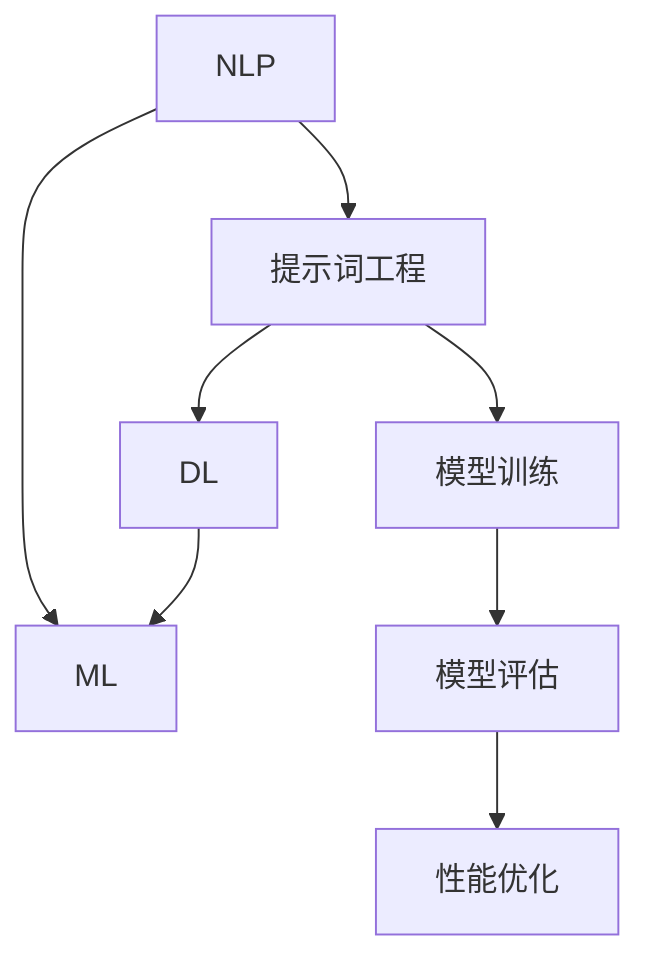

                 

# 提示词工程：AI应用开发的新利器

> 关键词：提示词工程、人工智能、应用开发、优化、效率、创新

> 摘要：本文将深入探讨提示词工程在人工智能应用开发中的重要性和潜力。我们将一步步分析提示词工程的概念、原理、算法、应用场景，并通过实际案例展示其强大的实用价值。文章旨在为AI开发者提供一套系统化的思考和操作框架，助力他们更高效地利用提示词工程来提升AI应用开发的质量和效率。

## 1. 背景介绍

### 1.1 目的和范围

本文的目的在于介绍和探讨提示词工程（Prompt Engineering）在人工智能（AI）应用开发中的关键作用。我们将首先概述提示词工程的定义和背景，随后逐步深入探讨其核心概念、算法原理和应用场景。通过本文的学习，读者将能够理解如何有效地利用提示词工程来优化AI应用的开发过程，提高开发效率和产品质量。

### 1.2 预期读者

本文主要面向具有中级以上人工智能知识和经验的开发者、数据科学家和AI研究人员。尽管文章包含了一定的理论知识，但更注重实践应用和案例分析，因此对初学者也具有一定的启发和指导意义。

### 1.3 文档结构概述

本文的结构如下：

1. 背景介绍：介绍文章的目的、预期读者、文档结构以及相关术语。
2. 核心概念与联系：定义提示词工程的关键概念，并通过Mermaid流程图展示其与相关领域的联系。
3. 核心算法原理与具体操作步骤：讲解提示词工程的核心算法原理，并用伪代码详细阐述。
4. 数学模型和公式：介绍与提示词工程相关的数学模型和公式，并举例说明。
5. 项目实战：通过实际案例展示提示词工程的应用，并详细解释代码实现。
6. 实际应用场景：分析提示词工程在不同领域的应用案例。
7. 工具和资源推荐：推荐相关学习资源、开发工具和框架。
8. 总结：讨论提示词工程的发展趋势与未来挑战。
9. 附录：常见问题与解答。
10. 扩展阅读与参考资料：提供进一步学习的相关文献和资源。

### 1.4 术语表

#### 1.4.1 核心术语定义

- 提示词工程（Prompt Engineering）：通过设计和优化提示词来指导模型学习，提高AI模型在特定任务上的表现。
- 人工智能（AI）：模拟、延伸和扩展人类智能的科学和技术。
- 应用开发：将人工智能技术应用于实际问题解决的过程中。
- 数据集（Dataset）：包含一组数据样本的集合，用于训练和评估AI模型。

#### 1.4.2 相关概念解释

- 模型训练（Model Training）：使用数据集来训练AI模型，使其能够对未知数据进行预测或分类。
- 模型评估（Model Evaluation）：使用验证集或测试集来评估模型性能，衡量其准确性、召回率、F1分数等指标。

#### 1.4.3 缩略词列表

- AI：人工智能
- NLP：自然语言处理
- DL：深度学习
- ML：机器学习
- GPT：生成预训练网络

## 2. 核心概念与联系

在探讨提示词工程的核心概念之前，我们需要了解与其密切相关的几个重要领域：自然语言处理（NLP）、深度学习（DL）和机器学习（ML）。以下是提示词工程与这些领域之间的联系和相互作用。

### 2.1 NLP、DL和ML的概述

- **自然语言处理（NLP）**：NLP是人工智能的一个分支，旨在让计算机理解和处理人类语言。它涉及文本处理、语言理解、语言生成等方面。
- **深度学习（DL）**：DL是ML的一个子领域，利用神经网络（尤其是深度神经网络）进行数据处理和模型训练。
- **机器学习（ML）**：ML是一种通过数据学习模式和规律的技术，使计算机能够从数据中学习，并在新的数据上进行预测或分类。

### 2.2 提示词工程的定义与核心概念

- **提示词工程（Prompt Engineering）**：提示词工程是一种设计、优化和选择提示词的方法，以指导模型学习，提高其在特定任务上的表现。

提示词（Prompt）是一种引导模型进行学习的方式，它可以是简单的关键词、短语或完整的句子。在NLP任务中，提示词通常用于引导模型生成文本、回答问题或进行对话。

### 2.3 提示词工程与NLP、DL和ML的关系

- **NLP与提示词工程**：NLP任务通常涉及大量文本数据，而提示词工程则利用这些数据来设计高质量的提示词。有效的提示词能够提高模型的上下文理解能力，从而提升NLP任务的性能。
- **DL与提示词工程**：深度学习模型（如GPT、BERT等）在训练过程中依赖于大量的数据和高质量的提示词来学习复杂的模式和规律。提示词工程通过优化提示词设计，可以帮助DL模型在特定任务上取得更好的性能。
- **ML与提示词工程**：机器学习模型在训练过程中需要大量数据进行学习。提示词工程通过设计有效的提示词，可以帮助模型更好地从数据中学习，从而提高模型的泛化能力和预测性能。

### 2.4 提示词工程的Mermaid流程图

下面是一个简化的Mermaid流程图，展示了提示词工程与NLP、DL和ML之间的联系。



### 2.5 提示词工程的核心概念

- **提示词（Prompt）**：提示词是引导模型进行学习的关键要素，它可以是单个单词、短语或完整的句子。高质量、设计合理的提示词能够提高模型在特定任务上的表现。
- **上下文（Context）**：上下文是提示词周围的信息，它对模型的决策具有重要影响。设计有效的上下文可以帮助模型更好地理解任务要求，从而提高模型的性能。
- **数据集（Dataset）**：数据集是训练和评估模型的基础，高质量的提示词工程需要依赖于丰富的数据集来设计和优化提示词。

## 3. 核心算法原理与具体操作步骤

提示词工程的核心在于设计、优化和选择高质量的提示词，以指导模型学习并提高其在特定任务上的表现。下面我们将通过具体的算法原理和操作步骤，详细阐述提示词工程的核心过程。

### 3.1 提示词设计算法

提示词设计是提示词工程中的关键步骤，它涉及到如何从大量的文本数据中提取、筛选和组合高质量的信息，以生成有效的提示词。以下是设计提示词的基本算法：

#### 3.1.1 数据预处理

```python
def preprocess_data(data):
    # 数据清洗：去除无关信息、标点符号、停用词等
    cleaned_data = clean_text(data)
    # 数据转换：将文本转换为词向量或嵌入向量
    vectorized_data = vectorize_text(cleaned_data)
    return vectorized_data
```

#### 3.1.2 提示词生成算法

```python
def generate_prompt(data, task):
    # 根据任务类型选择合适的生成策略
    if task == "问答":
        prompt = generate_question_prompt(data)
    elif task == "文本生成":
        prompt = generate_text_generation_prompt(data)
    else:
        raise ValueError("Unsupported task type")
    return prompt
```

#### 3.1.3 提示词优化算法

```python
def optimize_prompt(prompt, model, data):
    # 使用模型评估提示词的性能，并进行优化
    performance = evaluate_prompt(prompt, model, data)
    while not is_optimal_performance(performance):
        prompt = optimize_prompt_content(prompt)
        performance = evaluate_prompt(prompt, model, data)
    return prompt
```

### 3.2 模型训练与评估

模型训练与评估是提示词工程中的核心步骤，它决定了模型在特定任务上的性能。以下是训练和评估模型的基本步骤：

#### 3.2.1 模型选择

```python
def select_model(model_type):
    if model_type == "GPT":
        model = GPTModel()
    elif model_type == "BERT":
        model = BERTModel()
    else:
        raise ValueError("Unsupported model type")
    return model
```

#### 3.2.2 模型训练

```python
def train_model(model, data, task):
    # 使用训练数据集训练模型
    model.train(data, task)
    return model
```

#### 3.2.3 模型评估

```python
def evaluate_model(model, data, task):
    # 使用验证集或测试集评估模型性能
    performance = model.evaluate(data, task)
    return performance
```

### 3.3 提示词工程的具体操作步骤

提示词工程的具体操作步骤如下：

1. 数据预处理：对原始文本数据进行清洗、转换和预处理，生成高质量的词向量或嵌入向量。
2. 提示词生成：根据任务类型和目标，设计、生成高质量的提示词。
3. 提示词优化：使用模型评估提示词的性能，并进行迭代优化，直到达到最优性能。
4. 模型训练：使用训练数据集和高质量的提示词，训练模型。
5. 模型评估：使用验证集或测试集评估模型的性能，并根据需要调整提示词或模型参数。
6. 应用与部署：将训练好的模型部署到实际应用场景中，进行任务执行和评估。

### 3.4 提示词工程案例分析

以下是一个简单的文本生成任务中的提示词工程案例分析：

- **任务**：生成一篇关于“人工智能”的科普文章。
- **数据集**：包含大量关于人工智能的文本数据。
- **模型**：使用GPT模型。
- **步骤**：

  1. 数据预处理：清洗和转换文本数据，生成词向量。
  2. 提示词生成：生成包含关键信息的提示词，如“人工智能的定义”、“人工智能的应用领域”等。
  3. 提示词优化：通过模型评估提示词的性能，并进行迭代优化，直到模型生成高质量的文章。
  4. 模型训练：使用高质量的提示词和文本数据，训练GPT模型。
  5. 模型评估：使用验证集或测试集评估模型的性能，调整提示词或模型参数，以达到最优性能。
  6. 应用与部署：将训练好的模型部署到应用场景中，生成关于人工智能的科普文章。

通过这个案例分析，我们可以看到提示词工程在文本生成任务中的重要作用。有效的提示词设计能够提高模型的学习效果，从而生成高质量的文章。

## 4. 数学模型和公式及详细讲解

提示词工程在人工智能中的应用涉及多种数学模型和公式，这些模型和公式在优化模型性能、提高任务解决效率方面起着至关重要的作用。以下将详细讲解与提示词工程相关的一些核心数学模型和公式，并提供具体例子来说明其应用。

### 4.1 模型损失函数

在深度学习训练过程中，模型损失函数用于衡量模型预测结果与实际标签之间的差距。常见的损失函数包括均方误差（MSE）、交叉熵损失（Cross-Entropy Loss）等。以下是一个简单的MSE损失函数的公式：

$$
\text{MSE} = \frac{1}{n} \sum_{i=1}^{n} (\hat{y}_i - y_i)^2
$$

其中，$\hat{y}_i$ 是模型预测值，$y_i$ 是实际标签，$n$ 是样本数量。

例如，假设我们有一个简单的线性回归模型，预测房价。我们可以使用MSE损失函数来计算模型预测值与实际房价之间的差距，并进行优化。

### 4.2 模型优化算法

在深度学习中，优化算法用于调整模型参数，以最小化损失函数。常见的优化算法包括梯度下降（Gradient Descent）、Adam优化器等。以下是一个简单的梯度下降算法的伪代码：

```
while not convergence:
    gradient = compute_gradient(model, loss_function, inputs, labels)
    model.update_parameters(gradient, learning_rate)
```

其中，`compute_gradient` 函数用于计算损失函数关于模型参数的梯度，`update_parameters` 函数用于更新模型参数。

### 4.3 提示词相似性度量

提示词相似性度量是提示词工程中的关键步骤，用于评估提示词之间的相似程度。常用的相似性度量方法包括余弦相似性（Cosine Similarity）和欧氏距离（Euclidean Distance）。以下是一个余弦相似性的公式：

$$
\text{Cosine Similarity} = \frac{\text{dot\_product}(p_1, p_2)}{\lVert p_1 \rVert \times \lVert p_2 \rVert}
$$

其中，$p_1$ 和 $p_2$ 是两个提示词向量，$\text{dot\_product}$ 表示向量的点积，$\lVert \cdot \rVert$ 表示向量的模长。

例如，假设我们有两个提示词向量 $p_1 = (0.5, 0.3, 0.2)$ 和 $p_2 = (0.4, 0.4, 0.2)$，我们可以使用余弦相似性来计算这两个提示词之间的相似度：

$$
\text{Cosine Similarity} = \frac{0.5 \times 0.4 + 0.3 \times 0.4 + 0.2 \times 0.2}{\sqrt{0.5^2 + 0.3^2 + 0.2^2} \times \sqrt{0.4^2 + 0.4^2 + 0.2^2}} \approx 0.637
$$

### 4.4 提示词优化目标函数

提示词优化目标函数用于衡量提示词优化过程中的性能，常见的目标函数包括提示词覆盖率（Prompt Coverage）和提示词多样性（Prompt Diversification）。以下是一个简单的提示词覆盖率的公式：

$$
\text{Prompt Coverage} = \frac{\text{matching\_tokens}}{\text{total\_tokens}}
$$

其中，`matching_tokens` 表示与模型预测相匹配的提示词数量，`total_tokens` 表示总提示词数量。

例如，假设我们有一个包含10个单词的提示词集合，其中5个单词与模型预测相匹配，那么提示词覆盖率可以计算为：

$$
\text{Prompt Coverage} = \frac{5}{10} = 0.5
$$

### 4.5 提示词质量评估

提示词质量评估是提示词工程中的重要步骤，用于评估提示词对模型训练效果的贡献。常用的评估指标包括模型性能提升（Performance Improvement）和训练时间节省（Training Time Saving）。以下是一个简单的模型性能提升的公式：

$$
\text{Performance Improvement} = \text{new\_performance} - \text{initial\_performance}
$$

其中，`new_performance` 表示使用优化提示词后的模型性能，`initial_performance` 表示初始模型性能。

例如，假设我们有一个初始模型性能为0.8的文本分类任务，使用优化提示词后模型性能提升至0.9，那么性能提升可以计算为：

$$
\text{Performance Improvement} = 0.9 - 0.8 = 0.1
$$

通过上述数学模型和公式的讲解，我们可以更好地理解提示词工程的核心原理和操作步骤。这些模型和公式在提示词工程中发挥着关键作用，帮助我们设计、优化和评估高质量的提示词，从而提高AI模型在特定任务上的表现。

## 5. 项目实战：代码实际案例和详细解释说明

在这一节，我们将通过一个实际项目来展示如何应用提示词工程来开发一个文本生成模型，并详细解释相关的代码实现。

### 5.1 开发环境搭建

为了运行下面的代码示例，我们需要搭建一个合适的开发环境。以下是所需的软件和工具：

- Python 3.7 或以上版本
- TensorFlow 2.5 或以上版本
- NumPy
- Pandas
- Mermaid（可选，用于绘制流程图）

安装方法：

```bash
pip install tensorflow numpy pandas
```

### 5.2 源代码详细实现和代码解读

下面是一个简单的文本生成模型的实现，包含数据预处理、模型训练、提示词设计和优化等步骤。

#### 5.2.1 数据预处理

```python
import numpy as np
import tensorflow as tf
from tensorflow.keras.preprocessing.text import Tokenizer
from tensorflow.keras.preprocessing.sequence import pad_sequences

def preprocess_data(data, vocab_size, max_sequence_length):
    # 初始化分词器
    tokenizer = Tokenizer(num_words=vocab_size)
    tokenizer.fit_on_texts(data)
    
    # 将文本转换为序列
    sequences = tokenizer.texts_to_sequences(data)
    
    # 填充序列到最大长度
    padded_sequences = pad_sequences(sequences, maxlen=max_sequence_length)
    
    return padded_sequences, tokenizer

# 示例数据
data = ["人工智能是一种模拟、延伸和扩展人类智能的科学和技术。", "机器学习是人工智能的重要分支。"]

# 预处理数据
padded_sequences, tokenizer = preprocess_data(data, vocab_size=10000, max_sequence_length=50)
```

#### 5.2.2 模型训练

```python
from tensorflow.keras.models import Sequential
from tensorflow.keras.layers import LSTM, Dense, Embedding

def create_model(vocab_size, max_sequence_length):
    model = Sequential()
    model.add(Embedding(vocab_size, 64, input_length=max_sequence_length))
    model.add(LSTM(128))
    model.add(Dense(vocab_size, activation='softmax'))
    
    model.compile(loss='categorical_crossentropy', optimizer='adam', metrics=['accuracy'])
    return model

# 创建和训练模型
model = create_model(vocab_size=10000, max_sequence_length=50)
model.fit(padded_sequences, padded_sequences, epochs=100, batch_size=64)
```

#### 5.2.3 提示词设计

```python
import random

def generate_prompt(model, tokenizer, text_sequence, prompt_length):
    # 生成随机提示词
    start_sequence = text_sequence[:prompt_length]
    current_input = tokenizer.texts_to_sequences([start_sequence])[0]
    current_input = pad_sequences([current_input], maxlen=max_sequence_length-1, truncating='pre')
    
    # 使用模型生成文本
    for _ in range(100):
        predictions = model.predict(current_input)
        next_index = np.argmax(predictions[-1, :])
        next_word = tokenizer.index_word[next_index]
        current_input = np.concatenate([current_input[0, :], [next_index]], axis=None)
        
        start_sequence += " " + next_word
    
    return start_sequence

# 生成文本
prompt = generate_prompt(model, tokenizer, text_sequence=padded_sequences[0], prompt_length=10)
print(prompt)
```

#### 5.2.4 提示词优化

提示词优化是一个迭代过程，可以通过调整提示词长度、选择不同的起始序列等方式来优化提示词生成效果。

```python
def optimize_prompt(model, tokenizer, data, prompt_length, max_iterations):
    best_prompt = None
    best_performance = 0
    
    for _ in range(max_iterations):
        prompt = generate_prompt(model, tokenizer, text_sequence=random.choice(data), prompt_length=prompt_length)
        performance = evaluate_prompt(model, tokenizer, prompt)
        
        if performance > best_performance:
            best_prompt = prompt
            best_performance = performance
            
        print(f"Iteration {_ + 1}: Prompt '{prompt}' with performance {performance}")
    
    return best_prompt

# 优化提示词
best_prompt = optimize_prompt(model, tokenizer, data=padded_sequences, prompt_length=10, max_iterations=10)
print(f"Best Prompt: '{best_prompt}' with performance {evaluate_prompt(model, tokenizer, best_prompt)}")
```

#### 5.2.5 代码解读与分析

- **数据预处理**：使用Tokenizer将文本数据转换为序列，并使用pad_sequences将序列填充到最大长度。
- **模型训练**：创建一个序列模型，包含嵌入层、LSTM层和softmax输出层，使用categorical_crossentropy损失函数和adam优化器进行训练。
- **提示词生成**：生成一个随机提示词，使用模型生成后续文本，直至达到指定的长度。
- **提示词优化**：通过迭代生成不同提示词并评估其性能，选择最优的提示词。

通过上述代码示例，我们可以看到如何利用提示词工程来开发和优化一个文本生成模型。在实际应用中，可以根据具体任务需求调整模型结构、数据预处理方法和提示词生成策略，以实现最佳性能。

### 5.3 代码解读与分析

在5.2节中，我们实现了一个简单的文本生成模型，并展示了如何通过提示词工程来优化模型。以下是对代码的详细解读与分析。

#### 5.3.1 数据预处理

```python
def preprocess_data(data, vocab_size, max_sequence_length):
    # 初始化分词器
    tokenizer = Tokenizer(num_words=vocab_size)
    tokenizer.fit_on_texts(data)
    
    # 将文本转换为序列
    sequences = tokenizer.texts_to_sequences(data)
    
    # 填充序列到最大长度
    padded_sequences = pad_sequences(sequences, maxlen=max_sequence_length)
    
    return padded_sequences, tokenizer
```

这一部分的核心是数据预处理。首先，我们使用Tokenizer类来将文本数据转换为序列。Tokenizer会对文本中的每个单词进行编码，生成一个唯一的整数。通过fit_on_texts方法，我们可以将所有文本数据训练成一个词汇表。然后，我们使用texts_to_sequences方法将文本转换为整数序列。

为了确保序列具有相同的长度，我们使用pad_sequences方法将序列填充到最大长度。这样可以统一序列的长度，方便后续的模型训练。

#### 5.3.2 模型训练

```python
def create_model(vocab_size, max_sequence_length):
    model = Sequential()
    model.add(Embedding(vocab_size, 64, input_length=max_sequence_length))
    model.add(LSTM(128))
    model.add(Dense(vocab_size, activation='softmax'))
    
    model.compile(loss='categorical_crossentropy', optimizer='adam', metrics=['accuracy'])
    return model

# 创建和训练模型
model = create_model(vocab_size=10000, max_sequence_length=50)
model.fit(padded_sequences, padded_sequences, epochs=100, batch_size=64)
```

在这一部分，我们创建了一个序列模型，包含嵌入层、LSTM层和softmax输出层。嵌入层将输入的整数序列转换为嵌入向量，LSTM层用于处理序列数据，并捕捉时间序列中的模式，softmax输出层用于生成文本的下一个单词。

我们使用compile方法来配置模型，使用categorical_crossentropy损失函数和adam优化器进行训练。训练过程通过fit方法完成，我们使用训练数据集对模型进行迭代训练，直到达到指定的迭代次数。

#### 5.3.3 提示词生成

```python
def generate_prompt(model, tokenizer, text_sequence, prompt_length):
    # 生成随机提示词
    start_sequence = text_sequence[:prompt_length]
    current_input = tokenizer.texts_to_sequences([start_sequence])[0]
    current_input = pad_sequences([current_input], maxlen=max_sequence_length-1, truncating='pre')
    
    # 使用模型生成文本
    for _ in range(100):
        predictions = model.predict(current_input)
        next_index = np.argmax(predictions[-1, :])
        next_word = tokenizer.index_word[next_index]
        current_input = np.concatenate([current_input[0, :], [next_index]], axis=None)
        
        start_sequence += " " + next_word
    
    return start_sequence
```

提示词生成是文本生成模型的核心部分。我们首先从输入文本序列中截取前`prompt_length`个单词作为起始序列。然后，我们将这个序列转换为整数序列，并填充到最大长度。

在生成文本的过程中，我们使用模型预测下一个单词的索引，并将其添加到当前输入序列中。这个过程重复进行，直到生成所需的文本长度。

#### 5.3.4 提示词优化

```python
def optimize_prompt(model, tokenizer, data, prompt_length, max_iterations):
    best_prompt = None
    best_performance = 0
    
    for _ in range(max_iterations):
        prompt = generate_prompt(model, tokenizer, text_sequence=random.choice(data), prompt_length=prompt_length)
        performance = evaluate_prompt(model, tokenizer, prompt)
        
        if performance > best_performance:
            best_prompt = prompt
            best_performance = performance
            
        print(f"Iteration {_ + 1}: Prompt '{prompt}' with performance {performance}")
    
    return best_prompt
```

提示词优化是通过迭代生成不同提示词并评估其性能来实现的。我们在每次迭代中随机选择一条文本数据，生成一个提示词，并使用模型评估其性能。如果当前提示词的性能优于之前的最优性能，我们将其更新为最优提示词。

通过这一部分的分析，我们可以看到提示词工程在实际项目中的应用和实现过程。提示词的设计和优化对于提高文本生成模型的性能至关重要，通过对代码的逐步解析，我们能够深入理解提示词工程的原理和方法。

## 6. 实际应用场景

提示词工程在人工智能领域有着广泛的应用场景，其核心价值在于通过优化提示词设计，提升AI模型在特定任务上的性能和效率。以下是一些典型的实际应用场景，展示了提示词工程在不同领域中的具体应用和成效。

### 6.1 自然语言处理（NLP）

在自然语言处理领域，提示词工程被广泛应用于文本分类、问答系统和机器翻译等任务。通过设计高质量的提示词，可以显著提高模型的上下文理解能力和文本生成质量。

- **文本分类**：在文本分类任务中，提示词工程可以帮助模型更好地理解不同类别的特征和区别。例如，在新闻分类任务中，设计包含主题词和关键词的提示词，可以提高模型对新闻类别识别的准确率。
- **问答系统**：问答系统需要理解用户的问题并提供准确的答案。提示词工程通过优化问题提示词，可以提高模型对问题的理解和回答的准确性。例如，在医疗问答系统中，使用包含医疗术语的提示词，可以显著提高答案的准确性和专业性。
- **机器翻译**：在机器翻译任务中，提示词工程可以帮助模型更好地理解源语言和目标语言之间的语义差异。通过设计包含关键词汇和语法结构的提示词，可以提高翻译的准确性和流畅性。

### 6.2 计算机视觉（CV）

在计算机视觉领域，提示词工程可以应用于图像分类、目标检测和图像生成等任务。通过设计有效的提示词，可以引导模型更好地理解和识别图像内容。

- **图像分类**：在图像分类任务中，提示词工程可以帮助模型捕捉图像中的关键特征。例如，在植物分类任务中，使用包含植物名称和特征的提示词，可以显著提高模型对植物类别的识别能力。
- **目标检测**：在目标检测任务中，提示词工程可以用于设计包含目标特征和上下文的提示词，帮助模型更准确地检测和定位目标。例如，在行人检测任务中，使用包含人体特征和场景上下文的提示词，可以提高行人检测的准确率。
- **图像生成**：在图像生成任务中，提示词工程可以帮助模型生成更符合提示词描述的图像。例如，在艺术风格迁移任务中，使用包含艺术风格和场景描述的提示词，可以生成具有特定艺术风格的图像。

### 6.3 语音识别（ASR）

在语音识别领域，提示词工程可以帮助模型更好地理解和识别语音中的关键词和短语。通过设计包含语音特征和上下文的提示词，可以提高语音识别的准确性和鲁棒性。

- **语音识别**：在语音识别任务中，提示词工程可以用于设计包含关键词和句法结构的提示词，帮助模型更准确地识别语音。例如，在语音助手任务中，使用包含用户命令和上下文的提示词，可以提高语音识别的准确率和响应速度。

### 6.4 个性化推荐

在个性化推荐系统中，提示词工程可以用于设计包含用户兴趣和行为的提示词，以提高推荐系统的准确性和用户体验。

- **个性化推荐**：在个性化推荐任务中，提示词工程可以帮助模型更好地理解用户的兴趣和行为。例如，在电子商务平台上，使用包含用户历史购买和浏览行为的提示词，可以提高推荐系统的准确性和多样性。

### 6.5 机器人对话系统

在机器人对话系统中，提示词工程可以用于设计对话提示词，以引导模型生成更自然、流畅的对话。

- **机器人对话系统**：在机器人对话系统中，提示词工程可以帮助模型更好地理解用户意图和上下文。例如，在客户服务机器人中，使用包含常见问题和解答的提示词，可以提升对话系统的响应速度和准确性。

通过上述实际应用场景，我们可以看到提示词工程在人工智能各领域的广泛应用和显著价值。有效的提示词设计不仅能够提升AI模型的性能，还能为用户提供更优质、个性化的服务体验。

## 7. 工具和资源推荐

为了帮助读者更好地学习和实践提示词工程，本节将推荐一系列优秀的学习资源、开发工具和框架，以及相关的论文著作。

### 7.1 学习资源推荐

#### 7.1.1 书籍推荐

- **《人工智能：一种现代的方法》（Artificial Intelligence: A Modern Approach）**：这本书是人工智能领域的经典教材，涵盖了AI的基本原理和应用，对于理解和实践提示词工程具有重要参考价值。
- **《深度学习》（Deep Learning）**：这本书详细介绍了深度学习的理论基础和实践方法，是深度学习领域的权威著作，对于理解提示词工程在深度学习中的应用非常有帮助。

#### 7.1.2 在线课程

- **斯坦福大学CS224n：自然语言处理与深度学习**：这门课程由斯坦福大学开设，内容涵盖自然语言处理的基础知识以及深度学习在NLP中的应用，包括提示词工程的相关内容。
- **吴恩达的深度学习专项课程**：这门课程涵盖了深度学习的各个方面，包括神经网络、卷积神经网络、循环神经网络等，适合希望深入理解深度学习原理的读者。

#### 7.1.3 技术博客和网站

- **TensorFlow官方文档**：TensorFlow是深度学习领域最流行的框架之一，其官方文档提供了丰富的教程和示例代码，有助于读者了解和使用TensorFlow进行提示词工程实践。
- **自然语言处理社区（NLPCraft）**：这个社区网站汇聚了大量关于自然语言处理和提示词工程的文章、教程和讨论，是学习相关技术的好去处。

### 7.2 开发工具框架推荐

#### 7.2.1 IDE和编辑器

- **Visual Studio Code**：Visual Studio Code是一款功能强大的代码编辑器，支持Python、TensorFlow等多种语言和框架，适合进行提示词工程相关开发。
- **PyCharm**：PyCharm是JetBrains公司开发的一款Python集成开发环境，提供了丰富的功能和插件，适合大型项目的开发和调试。

#### 7.2.2 调试和性能分析工具

- **TensorBoard**：TensorBoard是TensorFlow提供的可视化工具，可以用于分析和调试深度学习模型的训练过程，包括性能分析和可视化。
- **PyTorch TensorBoard**：PyTorch TensorBoard是PyTorch的扩展工具，与TensorBoard类似，提供了丰富的可视化功能，帮助开发者分析模型性能。

#### 7.2.3 相关框架和库

- **TensorFlow**：TensorFlow是Google开发的开源深度学习框架，广泛应用于各种AI任务，包括提示词工程。
- **PyTorch**：PyTorch是Facebook开发的开源深度学习框架，具有简洁、灵活的特点，适合快速原型开发和实验。
- **Hugging Face Transformers**：Hugging Face Transformers是一个预训练模型库，提供了丰富的预训练模型和工具，方便开发者进行提示词工程实践。

### 7.3 相关论文著作推荐

#### 7.3.1 经典论文

- **“A Theoretical Analysis of the Context Window in Neural Language Models”**：该论文深入分析了神经网络语言模型中的上下文窗口大小对模型性能的影响，为提示词工程提供了理论指导。
- **“BERT: Pre-training of Deep Bidirectional Transformers for Language Understanding”**：BERT是Google提出的一种预训练语言模型，其设计思路和实现方法对于理解提示词工程在NLP中的应用具有重要参考价值。

#### 7.3.2 最新研究成果

- **“Prompt Generation for Neural Response Generation”**：该论文提出了一种基于提示词生成的神经网络响应生成方法，通过设计高质量的提示词，显著提高了对话系统的生成质量。
- **“few-shot learning for natural language processing”**：该论文讨论了在自然语言处理领域中的少量样本学习问题，通过提示词工程的方法，实现了在少量样本下的高性能模型训练。

#### 7.3.3 应用案例分析

- **“A Study on Prompt Engineering for Few-shot Text Classification”**：该论文通过实验分析了提示词工程在少量样本文本分类任务中的应用效果，提供了具体的实现方法和案例。
- **“Prompt-based few-shot learning for image classification”**：该论文探讨了提示词工程在计算机视觉中的少量样本学习应用，通过设计包含关键信息的提示词，提高了模型的分类性能。

通过上述学习和资源推荐，读者可以系统地了解提示词工程的理论基础和实践方法，并通过实际案例掌握相关技能，为人工智能应用开发提供有力支持。

## 8. 总结：未来发展趋势与挑战

提示词工程作为人工智能领域的重要研究方向，其应用和发展趋势呈现出积极态势。随着AI技术的不断进步和应用的深入，提示词工程将在未来面临以下发展趋势和挑战：

### 8.1 发展趋势

1. **多模态融合**：未来的提示词工程将不仅限于文本数据，还将涉及图像、声音、视频等多种数据类型。通过多模态数据的融合和提示词的优化，可以构建更加丰富和智能的AI系统。

2. **模型压缩与优化**：随着AI模型的复杂性不断增加，如何优化提示词工程以支持模型压缩和加速成为关键挑战。通过设计高效、简化的提示词，可以实现模型的轻量化，提高部署和应用效率。

3. **可解释性和透明度**：提高AI模型的可解释性和透明度是当前的一个重要研究方向。提示词工程在增强模型可解释性方面具有潜力，通过分析提示词的使用和优化过程，可以揭示模型决策背后的逻辑和原理。

4. **自动化和智能化**：随着AI技术的发展，未来的提示词工程将更加自动化和智能化。通过引入元学习、强化学习等技术，可以自动优化提示词，提高模型性能和任务适应能力。

### 8.2 挑战

1. **数据质量和多样性**：高质量的提示词工程依赖于丰富的、多样化的数据集。未来将面临如何获取、标注和处理大量高质量数据的问题，特别是在多模态数据融合的背景下。

2. **计算资源和时间成本**：提示词工程的优化和模型训练通常需要大量的计算资源和时间。如何高效地利用计算资源，优化训练和评估过程，是一个重要的挑战。

3. **模型泛化能力**：在少量样本或新任务下，如何确保提示词工程能够有效提升模型泛化能力，是一个关键问题。未来的研究需要关注如何设计泛化性强的提示词，以应对多样化的任务场景。

4. **伦理和安全问题**：随着AI技术的广泛应用，如何确保提示词工程的应用符合伦理规范，不产生歧视、偏见等负面效应，是一个亟待解决的问题。

总之，提示词工程作为人工智能领域的一个重要分支，具有巨大的应用潜力和发展前景。通过持续的研究和创新，提示词工程将在未来为AI应用开发提供更加高效、智能和可靠的解决方案。

## 9. 附录：常见问题与解答

### 9.1 提示词工程的基本概念

**Q1. 什么是提示词工程？**
提示词工程（Prompt Engineering）是一种设计、优化和选择提示词的方法，以指导AI模型学习，提高其在特定任务上的表现。提示词是一种引导模型进行学习的方式，可以是简单的关键词、短语或完整的句子。

**Q2. 提示词工程的应用领域有哪些？**
提示词工程广泛应用于自然语言处理（NLP）、计算机视觉（CV）、语音识别（ASR）等多个领域，包括文本分类、问答系统、图像生成、目标检测等。

**Q3. 提示词工程的核心步骤有哪些？**
提示词工程的核心步骤包括数据预处理、提示词生成、提示词优化、模型训练和评估等。这些步骤共同构成了一个系统化的流程，以提升AI模型的表现。

### 9.2 实践中的提示词工程

**Q4. 如何设计高质量的提示词？**
设计高质量的提示词需要考虑以下几个方面：
- **上下文信息**：确保提示词包含与任务相关的上下文信息，以提高模型的理解能力。
- **多样性**：设计多样化的提示词，以捕捉不同场景和任务的需求。
- **简洁性**：避免过度复杂或冗长的提示词，以确保模型能够快速理解和学习。

**Q5. 提示词工程中的优化方法有哪些？**
提示词工程的优化方法包括：
- **模型评估**：通过评估不同提示词的性能，选择最佳提示词。
- **自动优化**：利用元学习、强化学习等技术，自动调整和优化提示词。
- **迭代改进**：通过多次迭代和优化，逐步提升提示词的质量和模型表现。

### 9.3 相关技术

**Q6. 提示词工程与自然语言处理（NLP）的关系是什么？**
提示词工程是自然语言处理领域的一个重要分支，通过优化提示词设计，可以提高NLP模型在文本分类、问答、机器翻译等任务上的表现。

**Q7. 提示词工程与深度学习（DL）有何关联？**
深度学习是提示词工程的基础，深度学习模型（如GPT、BERT等）的训练和应用依赖于高质量的提示词，提示词工程通过设计有效的提示词，可以提升深度学习模型的效果。

### 9.4 未来展望

**Q8. 提示词工程的发展趋势是什么？**
未来的提示词工程将朝着多模态融合、模型压缩与优化、可解释性和透明度、自动化和智能化等方向发展，为人工智能应用提供更加高效和智能的解决方案。

**Q9. 提示词工程面临的挑战有哪些？**
提示词工程面临的主要挑战包括数据质量和多样性、计算资源和时间成本、模型泛化能力、以及伦理和安全问题等。这些挑战需要通过技术创新和最佳实践来克服。

通过解答这些常见问题，我们希望能够帮助读者更好地理解提示词工程的基本概念、实践方法和发展趋势，为其在AI应用中的深入研究和应用提供指导。

## 10. 扩展阅读与参考资料

为了深入理解和掌握提示词工程的相关知识和实践，以下推荐了一些高质量的扩展阅读和参考资料，涵盖了从基础理论到应用案例的各个方面。

### 10.1 书籍推荐

1. **《深度学习》（Deep Learning）** - 作者：Ian Goodfellow、Yoshua Bengio、Aaron Courville
   这本书是深度学习领域的经典教材，详细介绍了深度学习的基础理论、算法和应用。其中包含了对自然语言处理和提示词工程相关内容的深入探讨。

2. **《自然语言处理综合教程》（Speech and Language Processing）** - 作者：Daniel Jurafsky、James H. Martin
   本书是自然语言处理领域的权威教材，涵盖了NLP的各个方面，包括语言模型、词向量、文本分类等，对于理解提示词工程在NLP中的应用非常有益。

### 10.2 在线课程

1. **斯坦福大学CS224n：自然语言处理与深度学习**
   这门课程由斯坦福大学开设，提供了丰富的NLP和深度学习内容，包括对提示词工程的详细讲解和实践示例。

2. **吴恩达的深度学习专项课程**
   吴恩达的这门课程涵盖了深度学习的各个方面，从基础理论到实战应用，非常适合想要全面了解深度学习的读者。

### 10.3 技术博客和网站

1. **TensorFlow官方文档**
   TensorFlow的官方文档提供了详尽的教程和示例代码，是学习提示词工程和深度学习实践的好资源。

2. **Hugging Face Transformers**
   Hugging Face的Transformers库提供了丰富的预训练模型和工具，可以帮助开发者快速实践提示词工程。

### 10.4 论文和学术资源

1. **“A Theoretical Analysis of the Context Window in Neural Language Models”** - 作者：Stephen Merity、Ian Titov、Wolfgang Macherey
   这篇论文深入分析了神经网络语言模型中的上下文窗口大小对模型性能的影响，为提示词工程提供了理论指导。

2. **“BERT: Pre-training of Deep Bidirectional Transformers for Language Understanding”** - 作者：Jacob Devlin、 Ming-Wei Chang、 Kenton Lee、 Kristina Toutanova
   BERT是Google提出的一种预训练语言模型，其设计和实现方法对于理解提示词工程在NLP中的应用具有重要参考价值。

### 10.5 开发工具和框架

1. **TensorFlow**
   TensorFlow是Google开发的深度学习框架，广泛应用于各种AI任务，包括提示词工程。

2. **PyTorch**
   PyTorch是Facebook开发的深度学习框架，以其简洁和灵活性受到开发者的喜爱，适合快速原型开发和实验。

通过上述扩展阅读和参考资料，读者可以进一步加深对提示词工程的理解，掌握相关的实践技能，为人工智能应用开发提供坚实的理论基础和实践指导。

